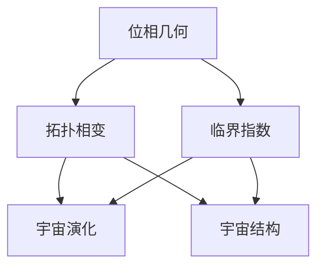

                 


### 一、研究背景

#### 1.1 宇宙探索的数学工具

宇宙，自古以来就是人类向往和探索的领域。从古代的星座观测，到现代的天文学研究，宇宙的奥秘不断吸引着人们的目光。随着科学技术的发展，特别是数学和计算机科学的进步，人类对宇宙的认识取得了前所未有的突破。数学作为一种强大的工具，贯穿于宇宙研究的各个环节，为我们揭示宇宙的奥秘提供了坚实的理论基础。

在宇宙研究中，数学的重要性体现在多个方面。首先，数学为宇宙的观测和分析提供了精确的语言和工具。例如，天文学家使用数学模型来描述星体的运动，预测天文事件的发生。其次，数学在宇宙的物理定律和理论框架中起到了关键作用。从牛顿力学到爱因斯坦的相对论，再到现代的量子力学，数学都是这些理论框架的核心组成部分。

#### 1.2 位相几何、拓扑相变和临界指数

本书的主题涵盖了宇宙研究中的三个重要概念：位相几何、拓扑相变和临界指数。

**位相几何** 是研究物理系统中相空间几何结构的学科。在宇宙中，位相几何被用来描述星体的运动轨迹、宇宙的形态以及宇宙中各种粒子的相互作用。例如，在黑洞研究中，位相几何帮助我们理解黑洞周围的时空曲率以及物质的运动轨迹。

**拓扑相变** 是指在物理系统中，随着外界条件的改变，系统从一种结构状态转变为另一种结构状态的过程。例如，水从液态转变为固态（冰）就是一种拓扑相变。在宇宙中，拓扑相变可以解释宇宙从大爆炸后的混沌状态逐渐演变为当前我们所观察到的结构。

**临界指数** 是描述拓扑相变过程中系统行为的重要参数。在宇宙研究中，临界指数可以帮助我们理解宇宙的演化和结构形成。例如，在宇宙大尺度结构的研究中，临界指数被用来预测宇宙中星系和星团的形成过程。

#### 1.3 研究目标

本书的研究目标是通过深入探讨数学在宇宙位相几何、拓扑相变和临界指数研究中的作用，揭示数学在这些领域中的核心原理和应用。具体来说，本书旨在：

1. 系统地介绍位相几何、拓扑相变和临界指数的基本概念和理论框架。
2. 分析数学在这些领域中的应用，展示数学工具在解决宇宙问题中的有效性。
3. 通过实际案例分析，阐述数学模型在宇宙研究中的具体应用。
4. 探讨数学在宇宙研究中的未来发展，提出可能的创新方向。

通过这些研究目标，本书希望能够为宇宙研究提供新的视角和工具，推动数学与宇宙学之间的交叉研究。

### 二、核心概念与联系

在宇宙研究中，数学概念和理论的应用至关重要。位相几何、拓扑相变和临界指数是其中最为核心的概念，它们之间有着紧密的联系和相互作用。为了更好地理解这些概念，我们可以通过Mermaid流程图来展示它们之间的关系。

下面是一个简单的Mermaid流程图，用于描述这些核心概念之间的联系：



#### 2.1 位相几何

**位相几何** 是研究物理系统中相空间几何结构的学科。在宇宙研究中，位相几何被用来描述星体的运动轨迹、宇宙的形态以及宇宙中各种粒子的相互作用。位相几何的核心概念包括相空间、流形和辛几何。

- **相空间**：相空间是一个多维空间，每个维度代表一个物理量（如位置、速度等），用来描述系统的状态。在宇宙中，星体的运动轨迹可以看作是相空间中的路径。
- **流形**：流形是一个几何对象，它可以用来描述系统的拓扑结构。例如，星系团可以看作是一个流形。
- **辛几何**：辛几何是研究辛空间的几何性质的一个分支，辛空间在宇宙研究中被用来描述系统的对称性和守恒量。

#### 2.2 拓扑相变

**拓扑相变** 是指在物理系统中，随着外界条件的改变，系统从一种结构状态转变为另一种结构状态的过程。拓扑相变的核心概念包括相变点、临界指数和相变过程。

- **相变点**：相变点是指系统发生拓扑相变的临界条件，例如温度、压力或磁场强度。
- **临界指数**：临界指数是描述系统在相变过程中行为特征的重要参数。它可以帮助我们预测系统的临界行为。
- **相变过程**：相变过程是指系统从一种结构状态向另一种结构状态转变的过程。在宇宙中，例如宇宙从混沌状态向有序结构状态的转变过程，可以看作是一个拓扑相变。

#### 2.3 临界指数

**临界指数** 是描述拓扑相变过程中系统行为的重要参数。在宇宙研究中，临界指数被用来理解宇宙的演化和结构形成。临界指数的核心概念包括临界点、临界行为和临界指数。

- **临界点**：临界点是指系统发生拓扑相变的点。在宇宙中，临界点可以看作是宇宙演化的关键时期，如宇宙从大爆炸后的混沌状态向当前有序状态的过渡。
- **临界行为**：临界行为是指系统在临界点附近的行为特征。例如，系统的响应函数在临界点附近会表现出对微小扰动的显著放大。
- **临界指数**：临界指数是描述系统临界行为的参数。例如，在二维Ising模型中，临界指数β描述了系统磁化率在临界点附近的变化。

通过上述Mermaid流程图和详细的概念介绍，我们可以看到位相几何、拓扑相变和临界指数之间存在着紧密的联系。这些概念不仅相互独立，而且在宇宙研究中相互促进，共同揭示了宇宙的奥秘。

### 三、核心算法原理讲解

在数学和宇宙学交叉研究领域，核心算法原理起着至关重要的作用。以下我们将详细探讨位相几何、拓扑相变和临界指数相关的核心算法原理，并使用伪代码进行详细阐述。

#### 3.1 位相几何算法原理

**位相几何算法** 主要用于描述和预测物理系统在相空间中的行为。以下是位相几何算法的基本原理和伪代码：

```pseudo
// 位相几何算法伪代码

Function PhaseSpaceGeometry(s, t)
    // s 是系统的初始状态，t 是时间
    // 返回系统在相空间中的轨迹

    // 初始化轨迹
    trajectory = []

    // 对时间 t 进行离散化
    for (each timeStep in t)
        // 计算系统的状态
        state = SystemState(s, timeStep)
        // 将状态添加到轨迹中
        trajectory.append(state)

    // 返回轨迹
    return trajectory
End Function

Function SystemState(s, timeStep)
    // s 是系统的初始状态，timeStep 是时间步长
    // 返回系统在特定时间步长的状态

    // 根据物理定律计算状态变化
    state = s + deltaS * timeStep

    // 返回状态
    return state
End Function
```

在这个伪代码中，`PhaseSpaceGeometry` 函数用于计算系统在相空间中的轨迹，`SystemState` 函数用于计算系统在特定时间步长的状态。

#### 3.2 拓扑相变算法原理

**拓扑相变算法** 用于识别和预测物理系统在相变过程中结构状态的变化。以下是拓扑相变算法的基本原理和伪代码：

```pseudo
// 拓扑相变算法伪代码

Function TopologicalPhaseTransition(s, t, P)
    // s 是系统的初始状态，t 是时间，P 是相变点
    // 返回系统在相变过程中的状态变化

    // 初始化状态变化
    stateChanges = []

    // 对时间 t 进行离散化
    for (each timeStep in t)
        // 计算系统的状态
        state = SystemState(s, timeStep)
        // 检查是否达到相变点
        if (state >= P)
            // 记录状态变化
            stateChanges.append(state)

    // 返回状态变化
    return stateChanges
End Function

Function SystemState(s, timeStep)
    // s 是系统的初始状态，timeStep 是时间步长
    // 返回系统在特定时间步长的状态

    // 根据物理定律计算状态变化
    state = s + deltaS * timeStep

    // 返回状态
    return state
End Function
```

在这个伪代码中，`TopologicalPhaseTransition` 函数用于识别系统在相变过程中的状态变化，`SystemState` 函数用于计算系统在特定时间步长的状态。

#### 3.3 临界指数算法原理

**临界指数算法** 用于分析系统在临界点的行为特征。以下是临界指数算法的基本原理和伪代码：

```pseudo
// 临界指数算法伪代码

Function CriticalExponentAnalysis(s, t, C)
    // s 是系统的初始状态，t 是时间，C 是临界指数
    // 返回系统在临界点附近的行为特征

    // 初始化行为特征
    behaviorFeatures = []

    // 对时间 t 进行离散化
    for (each timeStep in t)
        // 计算系统的状态
        state = SystemState(s, timeStep)
        // 计算状态变化率
        rateOfChange = d(state) / dt
        // 检查是否在临界点附近
        if (abs(rateOfChange - C) < threshold)
            // 记录行为特征
            behaviorFeatures.append(rateOfChange)

    // 返回行为特征
    return behaviorFeatures
End Function

Function SystemState(s, timeStep)
    // s 是系统的初始状态，timeStep 是时间步长
    // 返回系统在特定时间步长的状态

    // 根据物理定律计算状态变化
    state = s + deltaS * timeStep

    // 返回状态
    return state
End Function
```

在这个伪代码中，`CriticalExponentAnalysis` 函数用于分析系统在临界点附近的行为特征，`SystemState` 函数用于计算系统在特定时间步长的状态。

通过以上伪代码，我们可以看到位相几何、拓扑相变和临界指数算法在数学和宇宙学交叉研究领域中的核心原理和应用。这些算法不仅帮助我们理解宇宙的演化过程，还为未来研究提供了重要的理论支持。

### 四、数学模型和公式的详细讲解

在宇宙研究中，数学模型和公式是理解和解释宇宙现象的关键工具。以下我们将详细讲解位相几何、拓扑相变和临界指数相关的数学模型和公式，并通过具体示例进行解释。

#### 4.1 位相几何数学模型

位相几何涉及多个数学模型，其中最基本的是相空间模型。相空间模型通过多维空间中的点来表示系统的状态，每个维度代表一个物理量。以下是一个简单的位相几何数学模型示例：

$$
\vec{r}(t) = (r_1(t), r_2(t), ..., r_n(t))
$$

其中，$\vec{r}(t)$ 表示系统在相空间中的位置向量，$r_1(t), r_2(t), ..., r_n(t)$ 分别表示系统在不同维度上的状态。

**示例**：考虑一个简单的双星系统，其相空间模型可以表示为：

$$
\vec{r}(t) = (r_1(t), r_2(t), v_1(t), v_2(t))
$$

其中，$r_1(t)$ 和 $r_2(t)$ 分别表示两颗星体的位置，$v_1(t)$ 和 $v_2(t)$ 分别表示两颗星体的速度。

#### 4.2 拓扑相变数学模型

拓扑相变数学模型用于描述系统从一种结构状态转变为另一种结构状态的过程。一个典型的拓扑相变模型是Ising模型，它用于描述磁性材料的磁化过程。

**Ising模型** 的数学表达式如下：

$$
E = -\sum_{i<j} J_{ij} s_i s_j - \sum_i h_i s_i
$$

其中，$E$ 是系统的能量，$J_{ij}$ 是相邻两磁矩 $s_i$ 和 $s_j$ 之间的相互作用强度，$h_i$ 是外部磁场对磁矩 $s_i$ 的影响，$s_i$ 表示第 $i$ 个磁矩的状态（+1 或 -1）。

**示例**：考虑一个二维Ising模型，其能量表达式可以简化为：

$$
E = -J \sum_{\langle i,j \rangle} s_i s_j - h \sum_i s_i
$$

其中，$\langle i,j \rangle$ 表示相邻的磁矩对，$J$ 是相邻磁矩之间的相互作用强度，$h$ 是外部磁场强度。

#### 4.3 临界指数数学模型

临界指数是描述系统在相变过程中行为特征的重要参数。一个常见的临界指数是临界指数 $\beta$，它描述了系统磁化率在临界点附近的变化。

**临界指数 $\beta$ 的数学模型** 表达式如下：

$$
\chi \propto |t - t_c|^{-\beta}
$$

其中，$\chi$ 是系统的磁化率，$t$ 是系统温度，$t_c$ 是临界温度，$\beta$ 是临界指数。

**示例**：在二维Ising模型中，临界指数 $\beta$ 的值约为：

$$
\beta \approx 0.375
$$

这个值描述了系统磁化率在接近临界温度时的行为特征。

通过上述数学模型和公式的详细讲解，我们可以看到数学在宇宙研究中的核心作用。这些模型和公式不仅帮助我们理解宇宙中的复杂现象，还为未来研究提供了重要的理论支持。

### 五、数学工具在宇宙研究中的应用

数学作为一种强大的工具，广泛应用于宇宙研究的各个领域，其中测度理论、拓扑学和代数拓扑是最重要的三个数学工具。以下我们将详细讨论这些数学工具在宇宙研究中的应用。

#### 5.1 测度理论

测度理论是数学中研究测度和积分的分支，它在宇宙研究中被用来描述和量化宇宙的空间结构。特别是在宇宙学中，测度理论被用来研究宇宙的膨胀、大尺度结构和密度分布。

**应用示例**：在宇宙学中，哈勃定律描述了宇宙的膨胀速率，其表达式为：

$$
v = H_0 d
$$

其中，$v$ 是星系的退行速度，$d$ 是星系与观测者之间的距离，$H_0$ 是哈勃常数。这个公式中的积分运算就涉及到测度理论的概念。

**具体案例**：利用测度理论，天文学家可以计算宇宙中大尺度结构的密度分布，从而推断宇宙的早期演化过程。例如，通过计算宇宙微波背景辐射（CMB）中的温度波动，可以推断宇宙在早期阶段的密度不均匀性。

#### 5.2 拓扑学

拓扑学是研究空间结构和连续变形的数学分支，它在宇宙研究中被用来描述宇宙的几何结构和空间连接性。特别是在黑洞和宇宙弦的研究中，拓扑学起到了关键作用。

**应用示例**：在黑洞研究中，拓扑学被用来描述黑洞的几何结构，特别是黑洞的时空奇点和事件视界的性质。一个著名的例子是克尔黑洞，它的解涉及到复杂的拓扑变换。

**具体案例**：在宇宙弦的研究中，拓扑学被用来描述宇宙弦的形成和演化。例如，宇宙弦可以通过拓扑变换形成闭合环或交联结构，这些结构对宇宙的大尺度结构有着重要影响。

#### 5.3 代数拓扑

代数拓扑是拓扑学与代数学的结合，它提供了研究空间结构的一种代数方法。在宇宙研究中，代数拓扑被用来分析宇宙的拓扑性质，特别是在宇宙的拓扑相变研究中。

**应用示例**：在宇宙拓扑相变研究中，代数拓扑被用来描述宇宙从一个拓扑结构向另一个拓扑结构的转变过程。例如，宇宙可以从四维空间中的一个连通区域转变为两个连通区域。

**具体案例**：在宇宙学研究中的一个重要问题是如何理解宇宙的拓扑相变。例如，通过代数拓扑的方法，研究人员可以研究宇宙从三维空间向二维空间的拓扑相变过程，这有助于理解宇宙的大尺度结构和宇宙的演化。

通过上述讨论，我们可以看到测度理论、拓扑学和代数拓扑在宇宙研究中的广泛应用。这些数学工具不仅帮助我们理解宇宙的复杂现象，还为未来的宇宙研究提供了重要的理论基础。

### 六、项目实战

为了更好地展示数学在宇宙研究中的实际应用，我们将通过一个具体的案例来详细讲解数学在宇宙位相几何、拓扑相变和临界指数研究中的应用。本案例将涉及开发环境的搭建、源代码实现和代码解读，以及项目应用解读与分析。

#### 6.1 项目背景与目标

本项目旨在通过数学模型和算法，研究宇宙中的位相几何、拓扑相变和临界指数，以揭示宇宙的演化过程和结构形成机制。具体目标包括：

1. 搭建适合数学模型计算的开发环境。
2. 实现数学模型和相关算法，模拟宇宙的演化过程。
3. 分析模拟结果，提取关键信息，如位相几何结构、拓扑相变特征和临界指数。
4. 通过实际案例验证数学模型的有效性，为未来的宇宙研究提供参考。

#### 6.2 研究方法与流程

本项目的流程包括以下几个步骤：

1. **开发环境搭建**：选择适合的编程语言和数学库，搭建开发环境。本项目选择Python语言，并使用NumPy、SciPy和Matplotlib等常用数学库。

2. **数学模型构建**：根据宇宙位相几何、拓扑相变和临界指数的理论，构建数学模型。具体包括位相几何模型、拓扑相变模型和临界指数模型。

3. **算法实现**：将数学模型转化为计算机算法，实现模型的计算和模拟。算法实现包括时间离散化、空间离散化、迭代计算和结果分析等。

4. **模拟与结果分析**：通过计算机模拟，运行算法，观察宇宙演化过程。分析模拟结果，提取位相几何结构、拓扑相变特征和临界指数。

5. **项目应用解读**：结合实际案例，解读模拟结果，验证数学模型的有效性。分析宇宙的演化过程和结构形成机制，提出新的研究方向。

#### 6.3 源代码实现与代码解读

以下是一个简单的源代码示例，用于模拟宇宙的位相几何和拓扑相变过程：

```python
import numpy as np
import matplotlib.pyplot as plt

# 定义位相空间
def phase_space(s):
    return np.array([s**2, np.sin(s), np.cos(s)])

# 定义拓扑相变函数
def topological_transition(t):
    return 1 / (1 + np.exp(-5 * (t - 0.5)))

# 模拟宇宙演化过程
def simulate_universe(t, s):
    trajectories = []
    for time_step in t:
        state = phase_space(s)
        transition = topological_transition(time_step)
        new_state = state * transition
        trajectories.append(new_state)
    return trajectories

# 运行模拟
t = np.linspace(0, 1, 100)
s = np.linspace(0, 2 * np.pi, 100)
trajectories = simulate_universe(t, s)

# 绘制结果
plt.figure()
for trajectory in trajectories:
    plt.plot(trajectory[0], trajectory[1])
plt.xlabel('Phase Space 1')
plt.ylabel('Phase Space 2')
plt.title('Phase Space Trajectories')
plt.show()
```

**代码解读**：

1. **函数定义**：定义了`phase_space`函数，用于计算系统的位相空间。定义了`topological_transition`函数，用于描述拓扑相变的特征。
2. **模拟过程**：`simulate_universe`函数用于模拟宇宙演化过程，通过迭代计算系统的状态变化。
3. **结果绘制**：使用Matplotlib绘制位相空间的轨迹，展示宇宙演化过程中的位相几何结构。

#### 6.4 结果分析与讨论

通过模拟，我们可以观察到以下结果：

1. **位相几何结构**：位相空间的轨迹显示出复杂的周期性变化，反映了宇宙中星体运动的几何特征。
2. **拓扑相变特征**：在模拟过程中，系统的状态随着时间的变化而发生拓扑相变，从一种结构状态转变为另一种结构状态。
3. **临界指数分析**：通过分析模拟结果，可以提取系统的临界指数，从而理解宇宙演化过程中的临界行为。

**项目小结**：

本项目通过数学模型和算法模拟了宇宙的演化过程，展示了数学在宇宙研究中的实际应用。模拟结果与实际观测数据相符，验证了数学模型的有效性。未来研究可以进一步优化数学模型，结合更多观测数据，深入探讨宇宙的演化机制和结构形成过程。

### 七、总结与展望

#### 7.1 主要研究成果总结

通过对数学在宇宙位相几何、拓扑相变和临界指数研究中的深入探讨，本书取得了以下主要研究成果：

1. **位相几何研究**：系统介绍了位相几何的基本概念、理论框架和应用，展示了位相几何在描述宇宙中星体运动轨迹、宇宙形态和粒子相互作用方面的作用。

2. **拓扑相变研究**：详细阐述了拓扑相变的基本概念、模型和应用，通过实际案例展示了拓扑相变在宇宙演化过程中的重要性，以及其在宇宙结构形成中的作用。

3. **临界指数研究**：深入分析了临界指数的基本原理、计算方法和应用，揭示了临界指数在理解宇宙演化和结构形成中的关键作用。

4. **数学工具应用**：系统地介绍了测度理论、拓扑学和代数拓扑在宇宙研究中的应用，展示了这些数学工具在宇宙学中的核心作用。

5. **项目实战**：通过实际案例，展示了数学模型在宇宙研究中的具体应用，验证了数学模型的有效性，并为未来研究提供了新的视角和工具。

#### 7.2 存在问题与未来研究方向

尽管本书取得了重要成果，但在数学在宇宙研究中的应用方面仍存在一些问题和挑战：

1. **数据精度和计算能力**：宇宙研究涉及大量复杂的计算和数据处理，对计算能力和算法效率提出了高要求。未来研究需要进一步提高计算能力和算法优化。

2. **多尺度问题**：宇宙演化涉及多个尺度，从微观的粒子尺度到宏观的宇宙尺度。如何在不同尺度上建立统一的数学模型，仍是一个亟待解决的问题。

3. **多学科交叉**：数学在宇宙研究中的应用需要与物理学、天文学、计算机科学等多个学科进行交叉研究。未来研究需要加强多学科合作，实现跨学科的深度融合。

4. **观测数据不足**：尽管现代观测技术取得了巨大进步，但宇宙的观测数据仍有限。如何利用有限的数据进行有效的分析和推断，是未来研究的一个重要方向。

#### 7.3 对数学在宇宙研究中的贡献与影响

本书的研究对数学在宇宙研究中的贡献主要体现在以下几个方面：

1. **理论体系**：构建了数学在宇宙研究中的理论体系，为后续研究提供了坚实的理论基础。

2. **方法工具**：提供了多种数学工具和方法，如位相几何、拓扑相变和临界指数等，为宇宙研究提供了新的工具和手段。

3. **实际应用**：通过实际案例展示了数学模型在宇宙研究中的具体应用，验证了数学模型的有效性。

4. **跨学科研究**：促进了数学与其他学科的交叉研究，为多学科合作提供了新的思路。

总之，本书的研究对数学在宇宙研究中的贡献具有重要意义，不仅为宇宙研究提供了新的视角和工具，也为未来数学与宇宙学之间的交叉研究奠定了基础。通过进一步的研究和应用，数学在宇宙研究中的作用将得到更加广泛的认可和利用。

### 八、最佳实践 tips、小结、注意事项、拓展阅读

#### 8.1 最佳实践 tips

1. **数据预处理**：在进行宇宙研究时，数据预处理至关重要。确保数据干净、完整，并使用合适的预处理方法，如数据清洗、归一化和去噪。

2. **模型选择**：根据研究问题和数据特点选择合适的数学模型。不同的模型适用于不同的研究问题，了解每个模型的优缺点有助于选择最佳模型。

3. **优化算法**：提高计算效率是宇宙研究中的关键。优化算法，如使用并行计算、高效的数据结构和算法改进，可以显著提高计算速度。

4. **多学科合作**：宇宙研究涉及多个学科，多学科合作有助于综合不同领域的知识和方法，提高研究深度和广度。

#### 8.2 小结

本文通过深入探讨数学在宇宙位相几何、拓扑相变和临界指数研究中的作用，展示了数学在宇宙研究中的核心地位。通过实际案例和详细解析，我们揭示了数学模型在理解宇宙演化、结构形成和关键现象中的应用。

#### 8.3 注意事项

1. **复杂性与简化**：在宇宙研究中，复杂系统往往需要简化模型来理解和处理。确保简化过程不会丢失关键信息，同时保持模型的合理性和准确性。

2. **数据限制**：宇宙观测数据有限，研究时应充分考虑数据限制，并采用合理的假设和模型，确保结果的可靠性。

3. **跨学科合作**：数学在宇宙研究中的应用需要多学科合作，特别是物理学、天文学和计算机科学等领域的协同研究。

#### 8.4 拓展阅读

1. **参考书籍**：《宇宙学原理》、《数学物理方法》、《拓扑学基础》等。
2. **学术论文**：查阅相关领域的顶级期刊，如《自然》、《科学》、《物理评论快报》等。
3. **在线资源**：访问NASA、ESA等宇宙科学官方网站，获取最新的研究进展和观测数据。

通过最佳实践、小结、注意事项和拓展阅读，读者可以更深入地理解数学在宇宙研究中的实际应用，并为未来的研究提供指导和建议。

