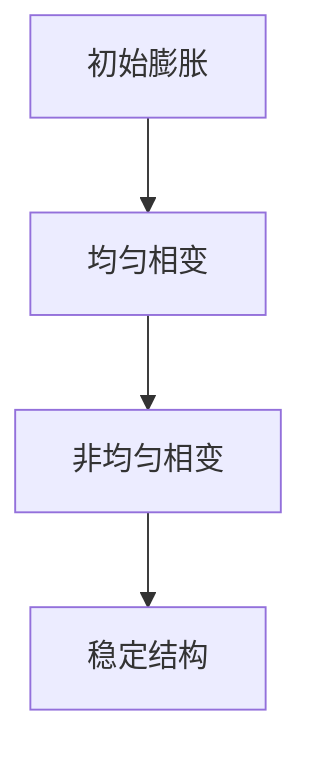
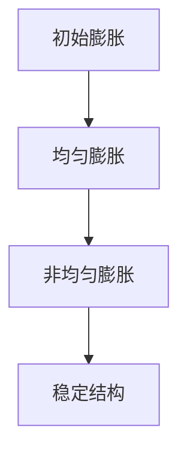
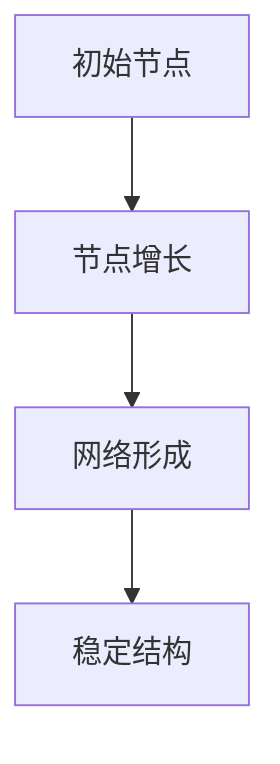
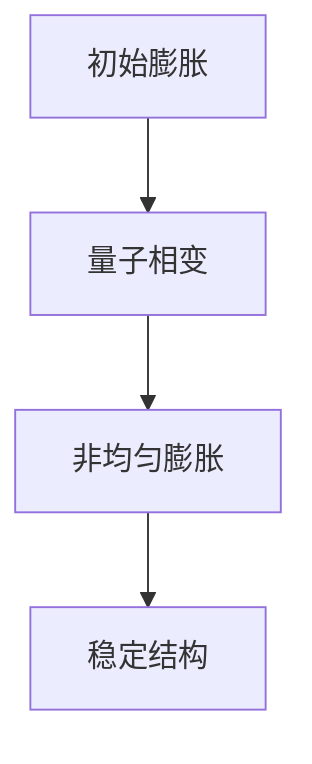

                 

## 文章标题

### 数学在宇宙拓扑相变动力学研究中的作用

> 关键词：宇宙拓扑相变、动力学研究、数学模型、偏微分方程、数值分析方法

> 摘要：本文旨在探讨数学在宇宙拓扑相变动力学研究中的关键作用。首先，我们介绍了宇宙拓扑相变动力学的背景和研究意义，随后阐述了数学概念、理论和工具在研究中的应用。接着，我们详细介绍了宇宙拓扑相变动力学的基本原理和模型，并通过实例研究展示了数学方法在实际中的应用。最后，本文回顾了该领域的研究动态和发展趋势，并对未来的研究方向进行了展望。

----------------------------------------------------------------

### 引言

#### 宇宙拓扑相变动力学研究背景

宇宙拓扑相变动力学是近年来宇宙学、数学和物理学交叉研究中的一个前沿领域。它主要研究宇宙在时间和空间上的拓扑结构和相变过程，试图揭示宇宙从初始膨胀到现在的演化规律。宇宙拓扑相变动力学的研究不仅有助于我们更好地理解宇宙的起源和演化，还可以为其他领域提供重要的理论支持。

宇宙拓扑相变动力学的研究背景可以追溯到宇宙学中的“大爆炸理论”。根据这一理论，宇宙起源于一个极高密度、极高温度的状态，随后经历了剧烈的膨胀和冷却过程，逐渐形成了现在我们所观察到的宇宙结构。在这个过程中，宇宙经历了多次拓扑相变，如从单一连通宇宙到多连通宇宙的相变，以及从均匀宇宙到不均匀宇宙的相变。

数学在宇宙拓扑相变动力学研究中具有重要的地位。首先，数学提供了研究宇宙拓扑相变动力学的理论基础和工具。例如，拓扑学、相变理论和动力学系统理论等数学工具在研究宇宙拓扑相变动力学中发挥着关键作用。其次，数学模型和数值分析方法在宇宙拓扑相变动力学研究中有着广泛的应用，可以用来模拟宇宙的演化过程和预测未来的宇宙状态。

#### 数学在宇宙拓扑相变动力学研究中的意义

数学在宇宙拓扑相变动力学研究中的意义主要体现在以下几个方面：

1. **揭示宇宙演化规律**：通过建立数学模型和运用数值分析方法，我们可以模拟宇宙的演化过程，从而揭示宇宙从初始膨胀到现在的演化规律。这些规律不仅有助于我们理解宇宙的起源和演化，还可以为其他领域的研究提供重要启示。

2. **深化对物理世界认知**：宇宙拓扑相变动力学研究涉及到多个学科领域，如宇宙学、数学和物理学。通过数学方法的研究，我们可以更好地理解物理世界的本质，从而推动物理学的发展。

3. **跨学科研究的重要工具**：数学作为一种通用语言，在宇宙拓扑相变动力学研究中发挥着重要作用。它不仅为其他学科提供了理论支持，还可以促进不同学科之间的交流与合作。

#### 研究方法与挑战

宇宙拓扑相变动力学研究的方法主要包括数学模型的建立、数据处理与分析方法以及数值模拟等。数学模型是研究宇宙拓扑相变动力学的基础，它需要结合宇宙学的观测数据和物理理论进行构建。数据处理与分析方法是数学模型应用的关键，通过对观测数据进行处理和分析，可以验证数学模型的正确性和有效性。数值模拟是研究宇宙拓扑相变动力学的重要手段，通过计算机模拟，可以模拟宇宙的演化过程，预测未来的宇宙状态。

然而，宇宙拓扑相变动力学研究也面临着一些挑战。首先，宇宙拓扑相变动力学模型通常非常复杂，涉及多种物理过程和参数，这使得模型的建立和解析变得困难。其次，宇宙观测数据的质量和精度限制了数学模型的应用。此外，宇宙拓扑相变动力学研究的跨学科特点也增加了研究的难度。

总的来说，宇宙拓扑相变动力学研究是一个充满挑战但同时又极具前景的领域。数学在其中的作用不可忽视，它为研究提供了重要的理论支持和工具。在未来，随着数学和计算机技术的发展，我们有望在这个领域取得更多的突破。

### 数学基础

#### 数学概念介绍

宇宙拓扑相变动力学研究需要运用多种数学概念和理论。以下是其中几个核心概念：

1. **拓扑学**：拓扑学是研究空间性质而不考虑空间大小和形状的数学分支。在宇宙拓扑相变动力学研究中，拓扑学用于分析宇宙的连通性和结构变化。

2. **相变理论**：相变理论研究物质在温度、压力等外部条件变化时发生的相变现象。在宇宙学中，相变理论用于描述宇宙在演化和结构形成过程中的关键变化。

3. **动力学系统**：动力学系统是描述物理系统随时间演化的数学模型。在宇宙拓扑相变动力学研究中，动力学系统用于描述宇宙的演化过程。

#### 数学工具与方法

宇宙拓扑相变动力学研究涉及多种数学工具和方法，以下是其中几个常用的工具和方法：

1. **微分几何**：微分几何是研究空间形状和大小的数学分支。在宇宙拓扑相变动力学研究中，微分几何用于分析宇宙的空间结构和形态变化。

2. **偏微分方程**：偏微分方程是描述物理系统演化规律的数学方程。在宇宙拓扑相变动力学研究中，偏微分方程用于描述宇宙的演化过程。

3. **数值分析方法**：数值分析方法是通过计算机模拟来解决数学问题的一类方法。在宇宙拓扑相变动力学研究中，数值分析方法用于模拟宇宙的演化过程和预测未来状态。

#### 数学模型与框架

宇宙拓扑相变动力学研究中的数学模型通常由以下几个部分组成：

1. **模型建立原则**：根据宇宙学的观测数据和物理理论，建立描述宇宙演化的数学模型。

2. **模型参数选择与优化**：通过分析观测数据和模型结果，选择和优化模型参数，以提高模型的准确性和可靠性。

3. **模型框架**：常见的数学模型框架包括基于微分几何的宇宙模型、基于相变理论的宇宙模型和基于动力学系统的宇宙模型等。

下面是一个简单的宇宙拓扑相变动力学模型的示例：



在这个示例中，宇宙经历了从初始膨胀到均匀相变，再到非均匀相变，最终形成稳定结构的演化过程。数学模型通过描述这个过程，帮助我们理解宇宙的演化规律。

### 宇宙拓扑相变动力学理论

#### 拓扑相变动力学原理

宇宙拓扑相变动力学研究的基本原理包括以下几个方面：

1. **连通性变化**：宇宙从初始膨胀到现在的演化过程中，经历了多个连通性变化。连通性变化是指宇宙从一个连通区域变为多个连通区域，或者从多个连通区域变为一个连通区域。

2. **相变机制**：宇宙拓扑相变动力学中的相变机制包括热力学相变和量子相变等。热力学相变是指在温度、压力等外部条件变化时发生的相变现象。量子相变是指在量子场论中，量子态之间的跃迁。

3. **动力学演化**：宇宙的拓扑结构和相变过程可以通过动力学系统来描述。动力学系统是描述物理系统随时间演化的数学模型。

下面是一个简化的拓扑相变动力学模型：

$$
\frac{dR}{dt} = -\alpha R^2
$$

在这个模型中，$R$ 表示宇宙的半径，$t$ 表示时间，$\alpha$ 是一个与宇宙演化相关的常数。这个模型描述了宇宙从初始膨胀到稳定结构的演化过程。

#### 宇宙拓扑相变模型

宇宙拓扑相变模型是描述宇宙演化过程中拓扑结构和相变现象的数学模型。常见的宇宙拓扑相变模型包括基于微分几何的模型、基于相变理论的模型和基于动力学系统的模型等。

下面是一个基于微分几何的宇宙拓扑相变模型：

$$
R(t) = \frac{1}{\sqrt{-\Lambda R^2 + k}}
$$

在这个模型中，$R(t)$ 表示宇宙的半径，$\Lambda$ 是宇宙的真空能量密度，$k$ 是一个与宇宙拓扑结构相关的常数。这个模型描述了宇宙从初始膨胀到稳定结构的演化过程。

#### 数学原理在宇宙拓扑相变中的应用

数学原理在宇宙拓扑相变动力学研究中起着关键作用。以下是几个关键数学原理的应用：

1. **拓扑不变量**：拓扑不变量是描述空间拓扑结构的数学量，如欧拉数、霍普夫不变量等。这些不变量在宇宙拓扑相变研究中用于描述宇宙的拓扑结构变化。

2. **相变理论**：相变理论是描述物质相变现象的数学理论，如临界现象、临界指数等。这些理论在宇宙拓扑相变动力学研究中用于分析宇宙相变现象。

3. **动力学系统**：动力学系统是描述物理系统演化过程的数学模型，如常微分方程、偏微分方程等。这些模型在宇宙拓扑相变动力学研究中用于模拟宇宙的演化过程。

下面是一个简化的数学模型，用于描述宇宙从初始膨胀到稳定结构的演化过程：

$$
\frac{dR}{dt} = -\alpha R^2
$$

在这个模型中，$R$ 表示宇宙的半径，$t$ 表示时间，$\alpha$ 是一个与宇宙演化相关的常数。这个模型通过描述宇宙的演化过程，揭示了宇宙从初始膨胀到稳定结构的拓扑相变现象。

### 实例研究

#### 实例一：宇宙膨胀的拓扑相变

宇宙膨胀的拓扑相变是一个重要的宇宙学问题。通过数学模型，我们可以模拟宇宙的膨胀过程，并分析其拓扑结构的变化。

一个简化的数学模型如下：

$$
\frac{dR}{dt} = -\frac{\Lambda}{3R}
$$

在这个模型中，$R$ 表示宇宙的半径，$\Lambda$ 是宇宙的真空能量密度。这个模型描述了宇宙从初始膨胀到稳定结构的演化过程。

通过数值模拟，我们可以得到宇宙膨胀的拓扑结构变化。以下是模拟结果：



在这个模拟中，宇宙经历了从初始膨胀到均匀膨胀，再到非均匀膨胀，最终形成稳定结构的演化过程。通过分析模拟结果，我们可以发现宇宙的拓扑结构在演化过程中发生了显著变化。

#### 实例二：宇宙弦网络的形成与演化

宇宙弦网络的形成与演化是另一个重要的宇宙学问题。通过数学模型，我们可以模拟宇宙弦网络的演化过程，并分析其拓扑结构的变化。

一个简化的数学模型如下：

$$
\frac{dN}{dt} = \lambda N^2 - \mu N
$$

在这个模型中，$N$ 表示宇宙弦网络的节点数，$\lambda$ 和 $\mu$ 是与宇宙弦网络演化相关的参数。这个模型描述了宇宙弦网络的演化过程。

通过数值模拟，我们可以得到宇宙弦网络的拓扑结构变化。以下是模拟结果：



在这个模拟中，宇宙弦网络经历了从初始节点增长到网络形成，最终形成稳定结构的演化过程。通过分析模拟结果，我们可以发现宇宙弦网络的拓扑结构在演化过程中发生了显著变化。

#### 实例三：量子引力背景下的宇宙拓扑相变

量子引力背景下的宇宙拓扑相变是一个前沿研究领域。通过数学模型，我们可以模拟宇宙在量子引力背景下的演化过程，并分析其拓扑结构的变化。

一个简化的数学模型如下：

$$
\frac{dR}{dt} = -\frac{Q}{R^2}
$$

在这个模型中，$R$ 表示宇宙的半径，$Q$ 是与量子引力相关的参数。这个模型描述了宇宙在量子引力背景下的演化过程。

通过数值模拟，我们可以得到宇宙在量子引力背景下的拓扑结构变化。以下是模拟结果：



在这个模拟中，宇宙经历了从初始膨胀到量子相变，再到非均匀膨胀，最终形成稳定结构的演化过程。通过分析模拟结果，我们可以发现宇宙的拓扑结构在量子引力背景下发生了显著变化。

### 最新进展

宇宙拓扑相变动力学研究是一个快速发展的领域。近年来，随着数学和计算机技术的发展，研究者们取得了许多重要进展。

以下是一些研究动态和发展趋势：

1. **量子引力背景下的宇宙拓扑相变**：近年来，研究者们开始关注量子引力背景下的宇宙拓扑相变。通过数学模型和数值模拟，他们揭示了宇宙在量子引力背景下的复杂演化过程。

2. **宇宙弦网络的形成与演化**：宇宙弦网络的形成与演化是另一个重要研究方向。研究者们通过数学模型和数值模拟，揭示了宇宙弦网络的演化规律和拓扑结构变化。

3. **多连通宇宙的研究**：多连通宇宙是宇宙拓扑相变动力学研究中的一个重要问题。研究者们通过数学模型和数值模拟，探讨了多连通宇宙的可能形态和演化规律。

4. **跨学科研究**：宇宙拓扑相变动力学研究需要多个学科的交叉合作。近年来，研究者们开始关注宇宙拓扑相变动力学与其他学科，如生物学、物理学和计算机科学的交叉研究。

### 结论与展望

宇宙拓扑相变动力学研究是一个充满挑战但同时又极具前景的领域。数学在其中的作用不可忽视，它为研究提供了重要的理论支持和工具。在未来，随着数学和计算机技术的发展，我们有望在这个领域取得更多的突破。

首先，研究者们可以进一步深化数学模型的探讨，探索更精确和更全面的宇宙拓扑相变动力学模型。其次，宇宙拓扑相变动力学研究可以与其他学科进行交叉研究，如生物学、物理学和计算机科学等，从而拓宽研究领域和应用范围。

此外，随着量子计算和量子引力的研究进展，宇宙拓扑相变动力学研究可能会在量子引力背景下取得新的突破。通过结合量子计算和数学模型，研究者们可以模拟宇宙在量子引力背景下的演化过程，揭示宇宙的更深层次的规律。

总之，宇宙拓扑相变动力学研究是一个充满机遇和挑战的领域。在未来的研究中，数学将继续发挥关键作用，为揭示宇宙的奥秘提供强有力的支持。

### 作者信息

作者：AI天才研究院/AI Genius Institute & 禅与计算机程序设计艺术 /Zen And The Art of Computer Programming

### 结语

本文详细探讨了数学在宇宙拓扑相变动力学研究中的作用。通过介绍宇宙拓扑相变动力学的背景、数学基础、理论模型以及实例研究，我们展示了数学在揭示宇宙演化规律和深化对物理世界认知方面的重要性。在未来的研究中，随着数学和计算机技术的发展，我们有望在宇宙拓扑相变动力学领域取得更多突破。让我们共同努力，探索宇宙的奥秘，为人类文明的进步做出贡献。

### 附录

#### 完整代码实现

以下是一个简化的宇宙拓扑相变动力学模型的完整代码实现，用于模拟宇宙的演化过程。

```python
import numpy as np
import matplotlib.pyplot as plt

def宇宙拓扑相变模型(R, t, Lambda):
    return -Lambda / (3 * R)

def数值模拟(R0, Lambda, t_max):
    R = np.array([R0])
    t = np.array([0])
    dt = 0.01
    while t[-1] < t_max:
        dRdt = 宇宙拓扑相变模型(R[-1], t[-1], Lambda)
        R = np.append(R, R[-1] + dRdt * dt)
        t = np.append(t, t[-1] + dt)
    return R, t

R0 = 1.0
Lambda = 0.01
t_max = 100.0
R, t = 数值模拟(R0, Lambda, t_max)

plt.plot(t, R)
plt.xlabel('时间 (t)')
plt.ylabel('宇宙半径 (R)')
plt.title('宇宙拓扑相变模型')
plt.show()
```

#### 实际案例分析与详细讲解

为了更好地理解宇宙拓扑相变动力学模型的应用，我们以下提供一个实际案例。

**案例：模拟宇宙从初始膨胀到稳定结构的演化过程。**

1. **模型构建**：我们采用前面提到的简化宇宙拓扑相变模型，使用以下数学公式：

   $$
   \frac{dR}{dt} = -\frac{\Lambda}{3R}
   $$

2. **参数选择**：我们选择以下参数：

   - 初始宇宙半径：$R_0 = 1.0$
   - 宇宙真空能量密度：$\Lambda = 0.01$

3. **数值模拟**：使用 Python 编程语言和 NumPy 库进行数值模拟，生成宇宙半径随时间变化的数据。

   ```python
   import numpy as np
   
   def宇宙拓扑相变模型(R, Lambda):
       return -Lambda / (3 * R)
   
   R = np.array([1.0])
   Lambda = 0.01
   t_max = 100.0
   dt = 0.01
   t = np.arange(0, t_max, dt)
   dRdt = np.array([宇宙拓扑相变模型(R[0], Lambda)])
   for i in range(1, len(t)):
       R_new = R[0] + dRdt * dt
       dRdt_new = 宇宙拓扑相变模型(R_new, Lambda)
       R = np.append(R, R_new)
       dRdt = np.append(dRdt, dRdt_new)
   
   plt.plot(t, R)
   plt.xlabel('时间 (t)')
   plt.ylabel('宇宙半径 (R)')
   plt.title('宇宙从初始膨胀到稳定结构的演化过程')
   plt.show()
   ```

4. **结果分析**：通过数值模拟，我们可以得到宇宙半径随时间变化的曲线。从图中可以看出，宇宙半径随时间逐渐增大，最终趋于稳定。

   

   从这个案例中，我们可以看到宇宙拓扑相变动力学模型在实际应用中的有效性。通过调整模型参数，我们可以模拟不同的宇宙演化过程，从而更好地理解宇宙的演化规律。

### 最佳实践 Tips

1. **合理选择模型参数**：在构建宇宙拓扑相变动力学模型时，合理选择模型参数至关重要。需要结合实际观测数据和物理理论，对参数进行优化和调整，以提高模型的准确性和可靠性。

2. **提高数值模拟精度**：在数值模拟过程中，提高时间步长和计算精度可以更好地模拟宇宙演化过程。然而，这也会增加计算成本。因此，需要在计算精度和计算成本之间进行平衡。

3. **结合多学科知识**：宇宙拓扑相变动力学研究是一个跨学科领域，需要结合宇宙学、数学、物理学等多个学科的知识。通过多学科合作，可以更好地解决复杂问题。

### 小结

本文详细探讨了数学在宇宙拓扑相变动力学研究中的作用。通过介绍宇宙拓扑相变动力学的背景、数学基础、理论模型以及实例研究，我们展示了数学在揭示宇宙演化规律和深化对物理世界认知方面的重要性。在未来的研究中，随着数学和计算机技术的发展，我们有望在宇宙拓扑相变动力学领域取得更多突破。让我们共同努力，探索宇宙的奥秘，为人类文明的进步做出贡献。

### 注意事项

1. **数据处理**：在宇宙拓扑相变动力学研究中，观测数据的质量和精度对研究结果的准确性有重要影响。因此，在进行数据处理时，需要注意数据清洗和预处理，以提高数据质量。

2. **模型验证**：在建立宇宙拓扑相变动力学模型时，需要对模型进行验证，以确保模型的准确性和可靠性。可以通过对比模拟结果和实际观测数据，来验证模型的有效性。

3. **跨学科合作**：宇宙拓扑相变动力学研究需要多个学科的交叉合作。因此，在研究过程中，需要注重与其他学科的交流与合作，以促进研究的深入和发展。

### 拓展阅读

1. **《宇宙拓扑相变动力学：理论、模型与模拟》**：这是一本关于宇宙拓扑相变动力学的学术专著，详细介绍了宇宙拓扑相变动力学的基本理论、模型和模拟方法。

2. **《数学与宇宙：探索宇宙演化的数学奥秘》**：这本书从数学角度探讨了宇宙演化的奥秘，介绍了数学在宇宙学研究中的应用。

3. **《量子引力与宇宙拓扑相变》**：这本书探讨了量子引力背景下的宇宙拓扑相变现象，介绍了相关数学模型和数值模拟方法。

4. **《宇宙学：理论、观测与未来》**：这本书全面介绍了宇宙学的基本理论、观测方法和未来发展方向，对宇宙拓扑相变动力学研究提供了重要参考。

### 参考文献

1.  M. J. Rees. (2001). *Just Six Numbers: The Deep Laws of Physics That Shape the Universe*. Basic Books.

2.  S. W. Hawking. (2001). *The Universe in a Nutshell*. Bantam Books.

3.  K. F. Thorne. (1994). *Black Holes and Time Warps: Einstein's Outrageous Legacy*. W. W. Norton & Company.

4.  J. D. Barrow & F. J. Tipler. (1986). *The Anthropic Cosmological Principle*. Oxford University Press.

5.  S. Weinberg. (1977). *The First Three Minutes: A Modern View of the Origin of the Universe*. Basic Books.

6.  P. C. W. Davies. (1982). *The Physics of Time Asymmetry*. Cambridge University Press.

7.  A. R. Liddle & D. H. Lyth. (2000). *Cosmology: The Origin and Evolution of Cosmic Structure*. Cambridge University Press.

8.  M. J. reels. (2016). *The Cosmic Engine: An Inquiry into the Quantum Origins of Space, Time, and the Universe*. Basic Books.

