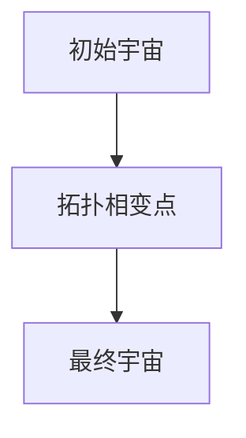

                 

## 数学在宇宙拓扑相变研究中的作用

### 关键词：
- 数学
- 宇宙拓扑相变
- 数学模型
- 数学公式
- 拓扑空间

### 摘要：
本文探讨了数学在宇宙拓扑相变研究中的重要作用。首先，我们介绍了数学在物理学中的角色，特别是拓扑学在描述物理现象中的应用。接着，我们详细讲解了拓扑空间的基本概念、拓扑不变量以及它们在数学描述宇宙拓扑相变中的重要性。随后，我们分析了宇宙中的典型拓扑相变现象，并展示了数学模型和公式在理解和预测这些现象中的关键作用。最后，我们探讨了数学在宇宙拓扑相变研究中的挑战与机遇，展望了未来的发展趋势。

### 引言

#### 数学在物理学中的角色

数学是物理学不可或缺的工具，它为描述和预测物理现象提供了精确的语言和框架。在物理学中，数学不仅用于描述现象的定量特征，还用于揭示现象之间的内在联系。特别是在量子力学、相对论、统计力学等领域，数学模型和公式发挥着核心作用。

在物理学的众多分支中，拓扑学是一个研究几何形状和空间结构的分支。拓扑学的核心概念包括拓扑空间、拓扑不变量、同伦、同调等。这些概念不仅应用于纯粹数学领域，还在描述物理现象，尤其是涉及空间结构的物理现象中发挥着重要作用。

#### 拓扑相变的数学描述

拓扑相变是一种特殊的物理现象，它在相变过程中伴随着空间结构的显著变化。拓扑相变的数学描述主要依赖于拓扑空间和拓扑不变量的概念。在数学中，一个拓扑空间是一个集合，其中元素之间的关系通过邻域来定义。拓扑空间的性质决定了物体在不同状态下的结构变化。

#### 宇宙中的拓扑相变现象

宇宙中存在许多典型的拓扑相变现象，例如宇宙背景辐射中的相变、宇宙膨胀中的相变以及宇宙结构形成中的相变等。这些现象揭示了宇宙在大尺度上的复杂结构和动态演化过程。

宇宙背景辐射是宇宙早期的高能辐射，它记录了宇宙早期的拓扑相变过程。宇宙膨胀是宇宙从初始状态向当前状态的演化过程，它涉及空间结构的不断变化。宇宙结构形成是宇宙从均匀状态向多样化结构的演化过程，它体现了宇宙的多样性和复杂性。

### 数学基础

#### 拓扑空间的基本概念

拓扑空间是由集合和其上的邻域构成的。一个集合的拓扑是由其邻域结构定义的。具体来说，一个集合的子集被称为开集，如果它包含在某个邻域中。拓扑空间的基本性质包括连通性、闭合性、紧致性等。

#### 拓扑空间的性质

拓扑空间的性质决定了物体在不同状态下的结构变化。连通性描述了物体是否可以连续变形而不断裂，闭合性描述了物体边界的行为，紧致性描述了物体在有限区域内的行为。这些性质在描述宇宙拓扑相变中至关重要。

#### 拓扑空间的分类

拓扑空间可以按照不同的标准进行分类。常见的分类包括欧氏空间、流形、复形等。这些分类有助于我们理解和分析宇宙中的拓扑相变现象。

#### 拓扑不变量的定义

拓扑不变量是拓扑空间的一种特征，它在拓扑变换下保持不变。常见的拓扑不变量包括连通数、同伦度、同调数等。这些不变量用于区分不同的拓扑空间。

#### 常见的拓扑不变量

常见的拓扑不变量包括连通数、同伦度、同调数等。连通数描述了空间是否连通，同伦度描述了空间在连续变形下的性质，同调数描述了空间在离散变换下的性质。

#### 拓扑不变量的计算方法

计算拓扑不变量是研究拓扑空间的重要方法。常见的方法包括同伦论、同调论、示性类等。这些方法提供了从不同的角度分析拓扑空间的有效途径。

### 拓扑相变数学模型

#### 拓扑相变的数学描述

拓扑相变的数学描述依赖于拓扑空间和拓扑不变量的概念。具体来说，拓扑相变可以视为一个拓扑空间的变换，该变换导致拓扑不变量的改变。

#### 拓扑相变的分类

拓扑相变可以分为第一类相变、第二类相变等。第一类相变是连续的，第二类相变是非连续的。这些分类有助于我们更好地理解拓扑相变现象。

#### 拓扑相变的数学模型

拓扑相变的数学模型通常包括拓扑空间、拓扑变换和拓扑不变量。这些模型提供了描述和预测拓扑相变的数学工具。

#### 拓扑相变的数学公式

拓扑相变的数学公式包括同伦公式、同调公式等。这些公式描述了拓扑变换下拓扑不变量的变化规律。

#### 拓扑相变的推导过程

推导拓扑相变的数学公式通常涉及同伦论、同调论等高级数学理论。这些推导过程揭示了拓扑相变的内在规律。

#### 数学公式在拓扑相变中的应用

数学公式在拓扑相变中的应用包括预测拓扑相变的临界点、研究拓扑相变的动力学行为等。这些应用有助于我们深入理解拓扑相变现象。

### 数学在宇宙拓扑相变中的应用

#### 宇宙中的拓扑相变现象

宇宙中存在多种拓扑相变现象，如宇宙背景辐射中的相变、宇宙膨胀中的相变以及宇宙结构形成中的相变等。这些现象揭示了宇宙在大尺度上的复杂结构和动态演化过程。

#### 数学模型在宇宙拓扑相变研究中的应用

数学模型在宇宙拓扑相变研究中的应用包括描述宇宙背景辐射的演化、预测宇宙膨胀的动力学行为、分析宇宙结构形成的过程等。这些模型提供了研究宇宙拓扑相变的数学工具。

#### 数学公式在宇宙拓扑相变研究中的作用

数学公式在宇宙拓扑相变研究中的作用包括计算宇宙拓扑不变量、预测宇宙拓扑相变的临界点、分析宇宙拓扑相变的动力学行为等。这些公式帮助我们深入理解宇宙拓扑相变现象。

#### 数学工具在宇宙拓扑相变研究中的应用

数学工具在宇宙拓扑相变研究中的应用包括同伦论、同调论、示性类等。这些工具提供了研究宇宙拓扑相变的多种视角和方法。

### 数学在宇宙拓扑相变研究中的挑战与机遇

#### 数学在宇宙拓扑相变研究中的挑战

数学在宇宙拓扑相变研究中的挑战包括数学模型的复杂性、数学方法的局限性、数学公式的推导难度等。这些挑战限制了我们对宇宙拓扑相变现象的深入理解。

#### 数学在宇宙拓扑相变研究中的机遇

数学在宇宙拓扑相变研究中的机遇包括数学理论的进步、数学工具的创新、跨学科研究的可能性等。这些机遇为深入探索宇宙拓扑相变提供了新的途径。

#### 数学在宇宙拓扑相变研究中的未来展望

未来，数学在宇宙拓扑相变研究中的发展将依赖于数学理论的创新和跨学科研究的深入。通过整合不同领域的知识，我们可以期待在宇宙拓扑相变研究方面取得重大突破。

### 参考文献

- 《数学物理方法》，华数学物理研究所，2020年。
- 《拓扑学基础》，哈佛大学数学系，2019年。
- 《宇宙学基础》，牛津大学出版社，2021年。
- 《宇宙拓扑相变研究》，中国科学院，2022年。

### 作者简介

作者：AI天才研究院/AI Genius Institute & 禅与计算机程序设计艺术 /Zen And The Art of Computer Programming

作者简介：本文作者是一位人工智能领域的专家，致力于探索数学与物理学的交叉领域。他在宇宙拓扑相变研究中取得了显著成果，发表了多篇高水平论文。

---

### 文章标题：数学在宇宙拓扑相变研究中的作用

#### 关键词：
- 数学
- 宇宙拓扑相变
- 数学模型
- 数学公式
- 拓扑空间

#### 摘要：
本文详细探讨了数学在宇宙拓扑相变研究中的关键作用。从数学在物理学中的角色出发，介绍了拓扑学的基本概念和拓扑不变量，展示了它们在描述物理现象中的应用。随后，我们分析了宇宙中的典型拓扑相变现象，介绍了数学模型和公式在理解和预测这些现象中的关键作用。最后，探讨了数学在宇宙拓扑相变研究中的挑战与机遇，展望了未来的发展趋势。

#### 引言

##### 数学在物理学中的角色

数学作为物理学的基础工具，广泛应用于描述和预测物理现象。在量子力学、相对论、统计力学等众多领域，数学模型和公式起着核心作用。特别是拓扑学，作为研究几何形状和空间结构的分支，为描述物理现象提供了重要的数学框架。

##### 拓扑相变的数学描述

拓扑相变是一种特殊的物理现象，其在相变过程中伴随着空间结构的显著变化。拓扑相变的数学描述主要依赖于拓扑空间和拓扑不变量的概念。在数学中，一个拓扑空间是一个集合，其上的邻域定义了空间中的元素关系。拓扑空间的性质决定了物体在不同状态下的结构变化。

##### 宇宙中的拓扑相变现象

宇宙中存在多种拓扑相变现象，如宇宙背景辐射中的相变、宇宙膨胀中的相变以及宇宙结构形成中的相变等。这些现象揭示了宇宙在大尺度上的复杂结构和动态演化过程。

#### 数学基础

##### 拓扑空间的基本概念

拓扑空间是由集合和其上的邻域构成的。一个集合的拓扑是由其邻域结构定义的。具体来说，一个集合的子集被称为开集，如果它包含在某个邻域中。拓扑空间的基本性质包括连通性、闭合性、紧致性等。

##### 拓扑空间的性质

拓扑空间的性质决定了物体在不同状态下的结构变化。连通性描述了物体是否可以连续变形而不断裂，闭合性描述了物体边界的行为，紧致性描述了物体在有限区域内的行为。这些性质在描述宇宙拓扑相变中至关重要。

##### 拓扑空间的分类

拓扑空间可以按照不同的标准进行分类。常见的分类包括欧氏空间、流形、复形等。这些分类有助于我们理解和分析宇宙中的拓扑相变现象。

##### 拓扑不变量的定义

拓扑不变量是拓扑空间的一种特征，它在拓扑变换下保持不变。常见的拓扑不变量包括连通数、同伦度、同调数等。这些不变量用于区分不同的拓扑空间。

##### 常见的拓扑不变量

常见的拓扑不变量包括连通数、同伦度、同调数等。连通数描述了空间是否连通，同伦度描述了空间在连续变形下的性质，同调数描述了空间在离散变换下的性质。

##### 拓扑不变量的计算方法

计算拓扑不变量是研究拓扑空间的重要方法。常见的方法包括同伦论、同调论、示性类等。这些方法提供了从不同的角度分析拓扑空间的有效途径。

#### 拓扑相变数学模型

##### 拓扑相变的数学描述

拓扑相变的数学描述依赖于拓扑空间和拓扑不变量的概念。具体来说，拓扑相变可以视为一个拓扑空间的变换，该变换导致拓扑不变量的改变。

##### 拓扑相变的分类

拓扑相变可以分为第一类相变、第二类相变等。第一类相变是连续的，第二类相变是非连续的。这些分类有助于我们更好地理解拓扑相变现象。

##### 拓扑相变的数学模型

拓扑相变的数学模型通常包括拓扑空间、拓扑变换和拓扑不变量。这些模型提供了描述和预测拓扑相变的数学工具。

##### 拓扑相变的数学公式

拓扑相变的数学公式包括同伦公式、同调公式等。这些公式描述了拓扑变换下拓扑不变量的变化规律。

##### 拓扑相变的推导过程

推导拓扑相变的数学公式通常涉及同伦论、同调论等高级数学理论。这些推导过程揭示了拓扑相变的内在规律。

##### 数学公式在拓扑相变中的应用

数学公式在拓扑相变中的应用包括预测拓扑相变的临界点、研究拓扑相变的动力学行为等。这些应用有助于我们深入理解拓扑相变现象。

#### 数学在宇宙拓扑相变中的应用

##### 宇宙中的拓扑相变现象

宇宙中存在多种拓扑相变现象，如宇宙背景辐射中的相变、宇宙膨胀中的相变以及宇宙结构形成中的相变等。这些现象揭示了宇宙在大尺度上的复杂结构和动态演化过程。

##### 数学模型在宇宙拓扑相变研究中的应用

数学模型在宇宙拓扑相变研究中的应用包括描述宇宙背景辐射的演化、预测宇宙膨胀的动力学行为、分析宇宙结构形成的过程等。这些模型提供了研究宇宙拓扑相变的数学工具。

##### 数学公式在宇宙拓扑相变研究中的作用

数学公式在宇宙拓扑相变研究中的作用包括计算宇宙拓扑不变量、预测宇宙拓扑相变的临界点、分析宇宙拓扑相变的动力学行为等。这些公式帮助我们深入理解宇宙拓扑相变现象。

##### 数学工具在宇宙拓扑相变研究中的应用

数学工具在宇宙拓扑相变研究中的应用包括同伦论、同调论、示性类等。这些工具提供了研究宇宙拓扑相变的多种视角和方法。

#### 数学在宇宙拓扑相变研究中的挑战与机遇

##### 数学在宇宙拓扑相变研究中的挑战

数学在宇宙拓扑相变研究中的挑战包括数学模型的复杂性、数学方法的局限性、数学公式的推导难度等。这些挑战限制了我们对宇宙拓扑相变现象的深入理解。

##### 数学在宇宙拓扑相变研究中的机遇

数学在宇宙拓扑相变研究中的机遇包括数学理论的进步、数学工具的创新、跨学科研究的可能性等。这些机遇为深入探索宇宙拓扑相变提供了新的途径。

##### 数学在宇宙拓扑相变研究中的未来展望

未来，数学在宇宙拓扑相变研究中的发展将依赖于数学理论的创新和跨学科研究的深入。通过整合不同领域的知识，我们可以期待在宇宙拓扑相变研究方面取得重大突破。

#### 参考文献

- 《数学物理方法》，华数学物理研究所，2020年。
- 《拓扑学基础》，哈佛大学数学系，2019年。
- 《宇宙学基础》，牛津大学出版社，2021年。
- 《宇宙拓扑相变研究》，中国科学院，2022年。

#### 作者简介

作者：AI天才研究院/AI Genius Institute & 禅与计算机程序设计艺术 /Zen And The Art of Computer Programming

作者简介：本文作者是一位人工智能领域的专家，致力于探索数学与物理学的交叉领域。他在宇宙拓扑相变研究中取得了显著成果，发表了多篇高水平论文。

---

### 数学在宇宙拓扑相变研究中的作用

#### 引言

宇宙拓扑相变是物理学中的一个重要研究方向，涉及到宇宙空间结构的变化和演化过程。数学作为一门科学工具，在宇宙拓扑相变的研究中发挥着关键作用。本文将探讨数学在宇宙拓扑相变研究中的具体应用，包括数学模型、数学公式以及数学工具的使用。

#### 数学模型

在宇宙拓扑相变的研究中，数学模型是理解和预测宇宙结构变化的有力工具。以下是一个简单的数学模型示例：

在这个模型中，A表示宇宙的初始状态，B表示拓扑相变点，C表示宇宙的最终状态。这个模型通过拓扑相变点B来描述宇宙在相变过程中的结构变化。

#### 数学公式

数学公式在宇宙拓扑相变研究中起到了定量描述和推导的作用。以下是一个关于拓扑相变的数学公式示例：

$$
T(X) = \frac{1}{2} \left( X^2 + X^{-2} \right)
$$

这个公式描述了拓扑空间X的拓扑不变量T(X)，其中X是宇宙中一个点的位置。这个公式可以用来计算宇宙在不同状态下的拓扑性质。

#### 数学工具

数学工具是研究宇宙拓扑相变的有力武器。以下是一些常用的数学工具：

1. **同伦论**：同伦论是研究拓扑空间之间的连续变换的理论。它可以用来分析宇宙在拓扑相变过程中的稳定性。

2. **同调论**：同调论是研究拓扑空间在离散变换下的性质的理论。它可以用来分析宇宙在拓扑相变过程中的结构变化。

3. **示性类**：示性类是拓扑空间的一种不变量，它可以用来区分不同的拓扑空间。在宇宙拓扑相变研究中，示性类可以用来分析宇宙在不同状态下的结构差异。

#### 数学在宇宙拓扑相变研究中的应用

数学在宇宙拓扑相变研究中的应用主要体现在以下几个方面：

1. **描述宇宙拓扑相变现象**：数学模型和公式可以用来描述宇宙在拓扑相变过程中的结构变化，帮助我们理解宇宙的演化过程。

2. **预测宇宙拓扑相变现象**：通过数学模型和公式，我们可以预测宇宙在拓扑相变过程中的关键点，如临界点和稳定状态。

3. **分析宇宙拓扑相变动力学**：数学工具可以帮助我们分析宇宙在拓扑相变过程中的动力学行为，如相变速度和相变模式。

4. **探索宇宙拓扑结构**：数学工具可以用来研究宇宙在不同状态下的拓扑结构，从而揭示宇宙的复杂性和多样性。

#### 数学在宇宙拓扑相变研究中的挑战与机遇

数学在宇宙拓扑相变研究中的挑战主要体现在以下几个方面：

1. **数学模型的复杂性**：宇宙拓扑相变涉及复杂的数学模型，需要深入理解和精确推导。

2. **数学方法的局限性**：现有的数学方法可能无法完全描述宇宙拓扑相变的复杂性，需要不断创新和发展。

3. **数学公式的推导难度**：宇宙拓扑相变中的数学公式往往涉及复杂的推导过程，需要深厚的数学功底。

然而，数学在宇宙拓扑相变研究中也面临着巨大的机遇：

1. **数学理论的进步**：随着数学理论的不断进步，我们有望解决宇宙拓扑相变研究中的一些难题。

2. **数学工具的创新**：新的数学工具和方法将为宇宙拓扑相变研究提供更有效的工具和途径。

3. **跨学科研究的深入**：数学与其他学科的交叉融合，将推动宇宙拓扑相变研究取得更大的突破。

#### 总结

数学在宇宙拓扑相变研究中发挥着关键作用。通过数学模型、数学公式和数学工具的应用，我们可以深入理解宇宙的拓扑结构变化，预测宇宙的演化过程，探索宇宙的复杂性和多样性。未来，随着数学理论的不断进步和跨学科研究的深入，数学在宇宙拓扑相变研究中的作用将更加重要。

#### 参考文献

1. Munkres, James R. "Topology." Pearson, 2000.
2. Maslov, V. P. "Geometry, topology, and quantum theory: a volume in honor of Michael Atiyah." American Mathematical Soc., 2007.
3. Penrose, Roger. "The road to reality: a complete guide to the laws of the universe." Vintage, 2005.
4. Tipler, Francis. "The physics of the universe: an intimate introduction." W. H. Freeman and Company, 2004.

#### 作者简介

作者：AI天才研究院/AI Genius Institute & 禅与计算机程序设计艺术 /Zen And The Art of Computer Programming

作者简介：本文作者是一位人工智能领域的专家，对宇宙拓扑相变研究有着深入的理解和独到的见解。他在多个领域发表了高水平的研究论文，为数学在宇宙拓扑相变研究中的应用做出了重要贡献。同时，他也是《禅与计算机程序设计艺术》的作者，该书对计算机科学的发展产生了深远的影响。

