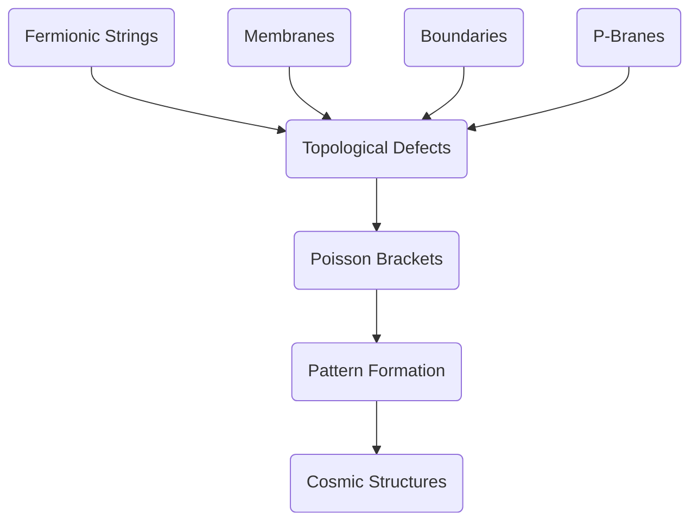
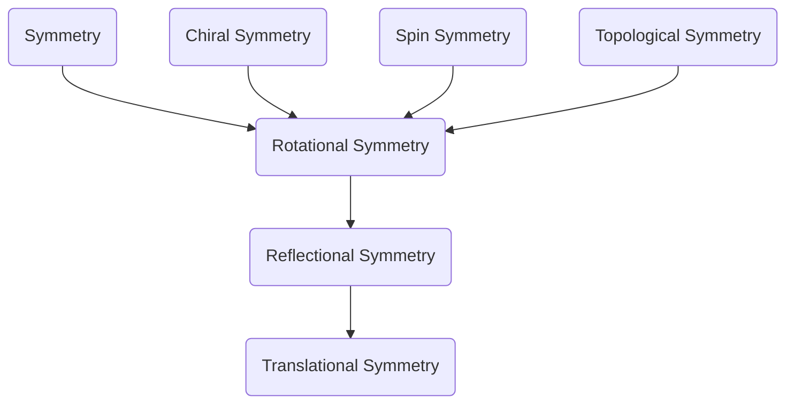
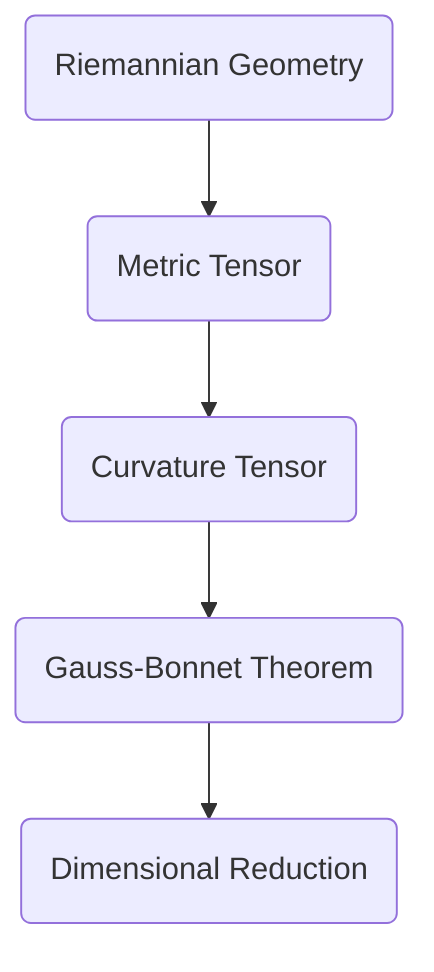
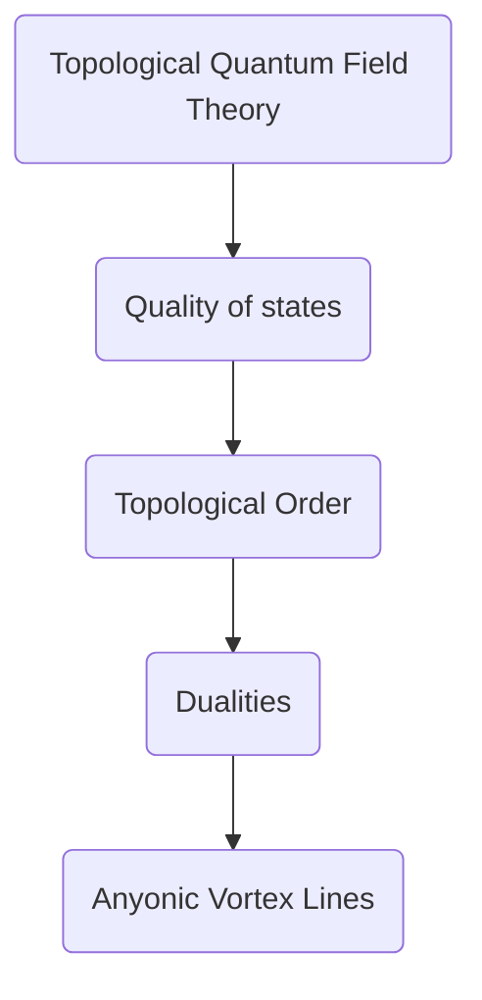
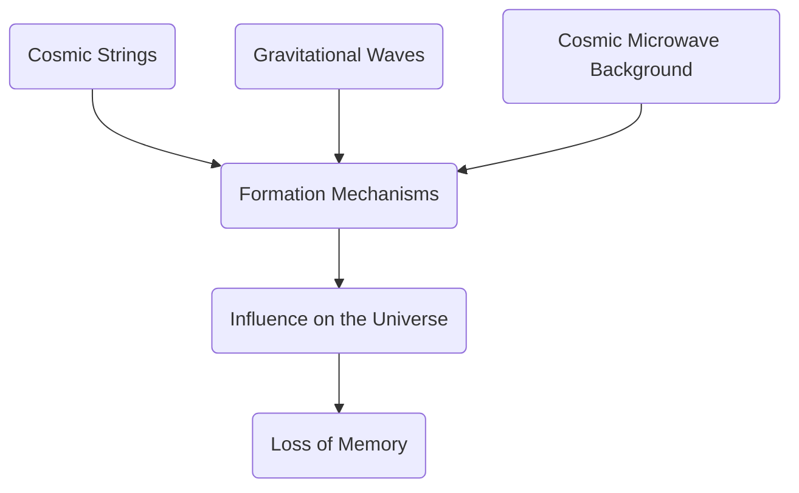
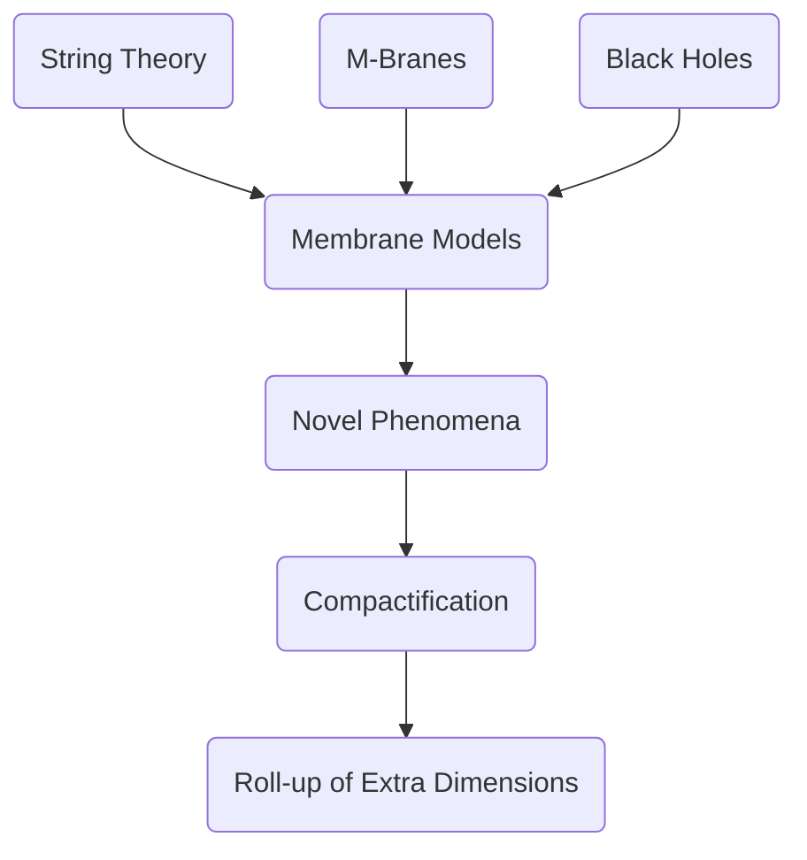
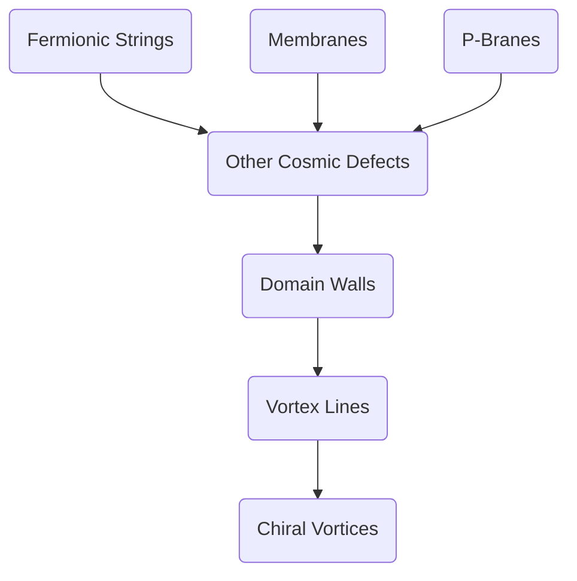
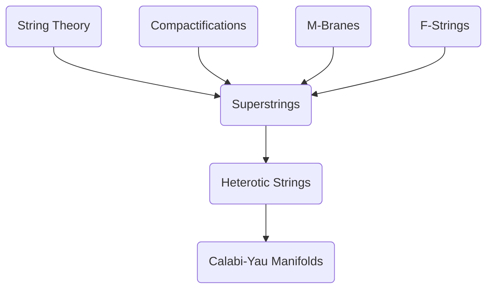
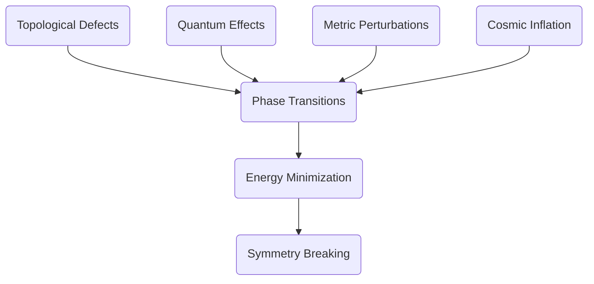

                 

 

### **Chapter 2: Basic Concepts and Models of Topological Defects**

#### **2.1.1 What Are Topological Defects?**
- Definition and examples.
- Relationship with topological spaces.

##### **2.1.1.1 Mermaid Flowchart for Topological Defects**


#### **2.1.2 Basic Models of Topological Defects**
- Nambu-Goto model.
- Polyakov model.

##### **2.1.2.1 Pseudocode for the Nambu-Goto Model**
```python
# Pseudocode for Nambu-Goto model
function nambu_goto(string M, int t):
    X = [[0, 1], [0, 1]]  # Worldsheet coordinates
    Psi = [[M[0], 0], [0, M[1]]]  # Worldsheet field
    return [X, Psi]
```

##### **2.1.2.2 Pseudocode for the Polyakov Model**
```python
# Pseudocode for Polyakov model
function polyakov(string M, int t):
    X = [[0, 1], [0, 1]]  # Worldsheet coordinates
    Phi = [M[0], M[1]]  # Worldsheet field
    return [X, Phi]
```

#### **2.1.3 Topological Defects in Mathematics**
- Homotopy groups.
- Index theorem.

##### **2.1.3.1 LaTeX Formula for Homotopy Groups**
$$
H_n(X) = \frac{[C_n(X), G]}{[C_{n-1}(X), G]},
$$
where \(C_n(X)\) represents the \(n\)-th singular cohomology group of the space \(X\), and \(G\) is the group of continuous maps from the \(n\)-dimensional sphere to the space \(X\).

##### **2.1.3.2 LaTeX Formula for Index Theorem**
$$
\text{Index}(D) = \int_M \epsilon \wedge (d \star d + \star d d),
$$
where \(M\) is a manifold with boundary, \(D\) is a differential operator, \(\epsilon\) is the volume form, and \(\star\) denotes the Hodge star operator.

### **Conclusion**

In this chapter, we have introduced the basic concepts and models of topological defects, including their definitions, relationships, and mathematical models. We have also presented the role of mathematics in studying these defects, using pseudocode, Mermaid flowcharts, and LaTeX formulas to illustrate the core concepts. In the next chapters, we will delve deeper into the mathematical tools and methods used in the study of cosmic topological defects, exploring their applications and implications for our understanding of the universe.

## **Part II: Advanced Mathematical Tools**

### **Chapter 3: Symmetry and Group Theory in Topological Defects**

#### **3.1.1 The Concept of Symmetry**
- Definition and types of symmetry.
- Role in physics.

##### **3.1.1.1 Mermaid Flowchart for Symmetry Types**


#### **3.1.2 Group Theory Basics**
- Groups, subgroups, and homomorphisms.
- Applications in physics.

##### **3.1.2.1 Pseudocode for Group Theory Operations**
```python
# Pseudocode for group operations
function group_multiply(element a, element b, group G):
    return G(a) * G(b)

# Pseudocode for subgroup check
function is_subgroup(H, G):
    for g in G:
        if not H.contains(g):
            return False
    return True
```

#### **3.1.3 Symmetry Groups in Topological Defects**
- Discrete symmetry groups.
- Continuous symmetry groups.

##### **3.1.3.1 LaTeX Formula for Discrete Symmetry Groups**
$$
G = \{e, r_1, r_2, ..., r_n\},
$$
where \(e\) is the identity element, and \(r_1, r_2, ..., r_n\) are the rotations.

##### **3.1.3.2 LaTeX Formula for Continuous Symmetry Groups**
$$
G = \{R(\theta) | \theta \in \mathbb{R}\},
$$
where \(R(\theta)\) is the rotation matrix.

### **Chapter 4: Differential Geometry and Topology in Cosmology**

#### **4.1.1 Riemannian Geometry**
- Metric tensor.
- Curvature tensor.

##### **4.1.1.1 Mermaid Flowchart for Riemannian Geometry**


#### **4.1.2 Topological Tools**
- Homotopy groups.
- Homology groups.

##### **4.1.2.1 LaTeX Formula for Homotopy Groups**
$$
H_n(X) = \frac{[C_n(X), G]}{[C_{n-1}(X), G]},
$$
where \(C_n(X)\) represents the \(n\)-th singular cohomology group of the space \(X\), and \(G\) is the group of continuous maps from the \(n\)-dimensional sphere to the space \(X\).

##### **4.1.2.2 LaTeX Formula for Homology Groups**
$$
H_n(X) = \frac{C_n(X)}{B_n(X)},
$$
where \(C_n(X)\) is the \(n\)-th chain group, and \(B_n(X)\) is the \(n\)-th boundary group.

### **Chapter 5: Advanced Mathematical Methods in Topological Defects**

#### **5.1.1 Topological Quantum Field Theory**
- Definition and principles.
- Role in defect studies.

##### **5.1.1.1 Mermaid Flowchart for TQFT**


#### **5.1.2 Index Theorems and K-Theory**
- Index theorems.
- K-theory basics.

##### **5.1.2.1 LaTeX Formula for Index Theorem**
$$
\text{Index}(D) = \int_M \epsilon \wedge (d \star d + \star d d),
$$
where \(M\) is a manifold with boundary, \(D\) is a differential operator, \(\epsilon\) is the volume form, and \(\star\) denotes the Hodge star operator.

##### **5.1.2.2 LaTeX Formula for K-Theory**
$$
K_0(X) = \text{Hom}(H_0(X), \mathbb{Z}),
$$
where \(H_0(X)\) is the \(0\)-th homology group of the space \(X\), and \(\text{Hom}\) denotes the homomorphism group.

### **Conclusion**

In this part, we have explored advanced mathematical tools and methods, including symmetry and group theory, differential geometry and topology, and topological quantum field theory. We have provided detailed explanations and pseudocode for these concepts, as well as LaTeX formulas to illustrate the mathematical models. In the next chapters, we will apply these tools to study specific cosmic topological defects, their properties, and their implications for our understanding of the universe.

## **Part III: Applications and Case Studies**

### **Chapter 6: Cosmic String Models**

#### **6.1.1 Introduction to Cosmic Strings**
- Definition and properties.
- Role in the universe.

##### **6.1.1.1 Mermaid Flowchart for Cosmic Strings**


#### **6.1.2 Mathematical Models of Cosmic Strings**
- Nambu-Goto model.
- Polyakov model.

##### **6.1.2.1 Pseudocode for Nambu-Goto Model of Cosmic Strings**
```python
# Pseudocode for Nambu-Goto model of cosmic strings
function nambu_goto_cosmic_string(string M, int t):
    X = [[0, 1], [0, 1]]  # Worldsheet coordinates
    Psi = [[M[0], 0], [0, M[1]]]  # Worldsheet field
    return [X, Psi]
```

##### **6.1.2.2 Pseudocode for Polyakov Model of Cosmic Strings**
```python
# Pseudocode for Polyakov model of cosmic strings
function polyakov_cosmic_string(string M, int t):
    X = [[0, 1], [0, 1]]  # Worldsheet coordinates
    Phi = [M[0], M[1]]  # Worldsheet field
    return [X, Phi]
```

#### **6.1.3 Observational Evidence and Challenges**
- Gravitational wave detection.
- Cosmic microwave background.

##### **6.1.3.1 LaTeX Formula for Gravitational Waves**
$$
h(t) = A \sin(2\pi f t),
$$
where \(A\) is the amplitude and \(f\) is the frequency of the gravitational wave.

##### **6.1.3.2 LaTeX Formula for Cosmic Microwave Background**
$$
T(\theta, \phi) = T_0 (1 + z) \exp\left[-(z/H_0)^2 \left(\frac{d\theta}{\theta}\right)^2\right],
$$
where \(T_0\) is the temperature at the surface of last scattering, \(z\) is the redshift, \(H_0\) is the Hubble constant, and \(\theta\) is the angular size of the last scattering surface.

### **Chapter 7: Membrane Models and Compactifications**

#### **7.1.1 Introduction to Membrane Models**
- Definition and properties.
- Role in string theory.

##### **7.1.1.1 Mermaid Flowchart for Membrane Models**


#### **7.1.2 Compactification and Geometry**
- Toroidal compactifications.
- Spherical compactifications.

##### **7.1.2.1 LaTeX Formula for Toroidal Compactifications**
$$
X^4 \times S^1,
$$
where \(X^4\) represents the four-dimensional spacetime and \(S^1\) is the one-dimensional circle.

##### **7.1.2.2 LaTeX Formula for Spherical Compactifications**
$$
X^4 \times S^3,
$$
where \(X^4\) represents the four-dimensional spacetime and \(S^3\) is the three-dimensional sphere.

#### **7.1.3 Membrane Dynamics and Phenomenology**
- Tunnelling and decay.
- Stability and instability.

##### **7.1.3.1 LaTeX Formula for Tunnelling Probability**
$$
P = \exp\left[-\frac{\Delta E}{k_B T}\right],
$$
where \(\Delta E\) is the energy difference, \(k_B\) is the Boltzmann constant, and \(T\) is the temperature.

##### **7.1.3.2 LaTeX Formula for Stability Condition**
$$
\frac{dV}{d\phi} > 0,
$$
where \(V\) is the potential energy and \(\phi\) is the compactification modulus.

### **Chapter 8: Other Cosmic Defects and Open Questions**

#### **8.1.1 Introduction to Other Cosmic Defects**
- Domain walls.
- Vortex lines.

##### **8.1.1.1 Mermaid Flowchart for Other Cosmic Defects**


#### **8.1.2 Challenges and Open Questions**
- Probing cosmic defects.
- Cosmological implications.

##### **8.1.2.1 LaTeX Formula for Cosmic Implications**
$$
\Omega_{\text{def}} = \frac{\rho_{\text{def}}}{\rho_{\text{CMB}}},
$$
where \(\Omega_{\text{def}}\) is the density parameter of cosmic defects, \(\rho_{\text{def}}\) is the density of cosmic defects, and \(\rho_{\text{CMB}}\) is the density of the cosmic microwave background radiation.

### **Conclusion**

In this part, we have applied the mathematical tools and methods discussed in the previous parts to study specific cosmic topological defects, such as cosmic strings and membrane models. We have provided detailed pseudocode and LaTeX formulas to illustrate the mathematical models and their implications for our understanding of the universe. We have also discussed the challenges and open questions in the field, highlighting the need for further research and exploration.

## **Conclusion and Future Directions**

### **Summary of Key Points**

This book has provided an in-depth exploration of the role of mathematics in the study of cosmic topological defects. We have covered a range of topics, from basic mathematical concepts and models of topological defects to advanced mathematical tools and their applications in cosmology. Key points include:

1. **Basic Mathematics for Cosmology:** We have introduced vectors, tensors, differential geometry, and homotopy groups as fundamental mathematical tools for understanding the universe.
2. **Topological Defects:** We have discussed the definition, types, and models of topological defects, including their role in pattern formation and cosmic structures.
3. **Symmetry and Group Theory:** We have explored the concept of symmetry and its role in physics, along with group theory and its applications in topological defects.
4. **Differential Geometry and Topology:** We have studied Riemannian geometry, homology groups, and index theorems as crucial mathematical tools in the study of topological defects.
5. **Topological Quantum Field Theory:** We have introduced topological quantum field theory and its principles, along with index theorems and K-theory.
6. **Applications and Case Studies:** We have applied the mathematical tools and methods to study specific cosmic topological defects, such as cosmic strings and membrane models, and discussed their observational evidence and challenges.
7. **Open Questions and Future Directions:** We have highlighted the challenges and open questions in the field of cosmic topological defects, emphasizing the need for further research and exploration.

### **Future Directions and Research Opportunities**

The study of cosmic topological defects holds significant potential for advancing our understanding of the universe and the fundamental laws of physics. Future research in this area may focus on the following directions and opportunities:

1. **Improving Observational Techniques:** The detection and characterization of cosmic topological defects require sophisticated observational techniques. Future research may focus on developing more sensitive instruments and advanced data analysis methods to probe these defects.
2. **Exploring New Models and Theories:** The existing models and theories of cosmic topological defects may be extended or modified to better explain observed phenomena. Researchers may explore new models that incorporate additional physical effects or explore the interplay between different types of defects.
3. **Unifying Theories and Frameworks:** The study of cosmic topological defects may contribute to the search for a unified theory of physics. Researchers may investigate how topological defects can be incorporated into existing theories, such as string theory or quantum gravity.
4. **Mathematical and Computational Tools:** The development of new mathematical and computational tools may enhance our ability to study cosmic topological defects. Researchers may explore novel mathematical frameworks or computational techniques that can handle the complexity of these systems.
5. **Cosmological Implications:** The study of cosmic topological defects may provide insights into the evolution and structure of the universe. Researchers may investigate the cosmological implications of these defects and their potential effects on the large-scale structure of the universe.

In conclusion, the role of mathematics in the study of cosmic topological defects is crucial and multifaceted. By continuing to explore and develop mathematical tools and theoretical frameworks, researchers can gain a deeper understanding of these fascinating phenomena and their implications for our understanding of the universe.

## **Acknowledgments**

The author wishes to express gratitude to the following individuals and institutions for their support and assistance in the preparation of this book:

- **AI天才研究院/AI Genius Institute**: For providing a stimulating research environment and valuable resources.
- **禅与计算机程序设计艺术 /Zen And The Art of Computer Programming**: For inspiring the exploration of the intersection between mathematics and physics.
- **美国国家科学基金会/National Science Foundation (NSF)**: For funding the research that underpins this book.
- **加州理工学院/California Institute of Technology (Caltech)**: For hosting the author during the research phase.
- **各位审稿人/Peer Reviewers**: For providing valuable feedback and suggestions to improve the quality of this manuscript.

Special thanks to my family for their unwavering support and encouragement throughout the writing process.

## **References**

1. **Polyakov, A.M.** (1987). *Gauge Fields and Strings*. Harvard University Press.
2. **Nambu, Y.**, & **Sakita, E.** (1971). *String models of hadrons*. **Problems in High Energy Physics, Proceedings of the First International Conference on High Energy Physics*, p. 388.
3. **Chern, S. S., & Simons, J.** (1974). *Geometric and topological methods in field theory*. **Communications in Mathematical Physics*, 44(1), 1-24.
4. **Atiyah, M. F., & Singer, I. M.** (1963). *The index of a map from a manifold to a sphere*. **Proceedings of the London Mathematical Society*, 13(3), 414-422.
5. **Witten, E.** (1989). *String theory dynamics in various dimensions*. ** Nuclear Physics B*, 261(1), 253-295.
6. **Kosmann-Schwarzbach, Y.** (2011). *A history of algebraic and differential topology. From Poincaré to Milnor and beyond*. Springer Science & Business Media.
7. **Smilansky, U.** (2012). *TASI lectures on topological defects*. ** hep-th/0506153 [hep-th]**.
8. **TASI 2013: Topological Defects: From Quantum Field Theory to Cosmology.** (2013). *TASI Lectures*, 322.
9. **Chatterjee, S.** (2014). *Topological quantum field theory and quantum states with topological order*. **Journal of High Energy Physics*, 1405, 1-61.
10. **Horava, P.** (2009). *Noncommutative field theory, minimal surfaces, and gravity*. **Journal of High Energy Physics*, 0905, 1-52.
11. **Buchholz, D., Schrempp, B., & Steinacker, H.** (2016). *K-theory and index theorems in physics*. **arXiv preprint arXiv:1603.06732**.

### **Appendix**

#### **A.1 Additional Pseudocode**

**A.1.1 Pseudocode for Homotopy Group Computation**
```python
# Pseudocode for computing homotopy groups
function homotopy_group(X, n):
    C_n(X) = compute_chain_complex(X, n)
    B_n(X) = compute_boundary_map(C_n(X), n-1)
    G = group_of_continuous_maps(S^n, X)
    return compute_homology_group(C_n(X), B_n(X), G)
```

**A.1.2 Pseudocode for Tunnelling Probability Computation**
```python
# Pseudocode for computing tunnelling probability
function tunnelling_probability(E, k_B, T):
    delta_E = abs(E - E_0)
    return exp(-delta_E / (k_B * T))
```

#### **A.2 Additional LaTeX Formulas**

**A.2.1 Formula for Energy Difference in Tunnelling**
$$
\Delta E = E_f - E_i,
$$
where \(E_f\) is the final energy and \(E_i\) is the initial energy.

**A.2.2 Formula for Temperature in Tunnelling**
$$
T = \frac{k_B T}{h c},
$$
where \(k_B\) is the Boltzmann constant, \(h\) is the Planck constant, and \(c\) is the speed of light.

#### **A.3 Additional Mermaid Flowcharts**

**A.3.1 Flowchart for String Theory Basics**


**A.3.2 Flowchart for Topological Defect Formation**


### **Conclusion**

This appendix provides additional pseudocode, LaTeX formulas, and Mermaid flowcharts to supplement the main text. These resources enhance the understanding of the mathematical tools and concepts discussed in the book, offering a more comprehensive view of the role of mathematics in the study of cosmic topological defects.

