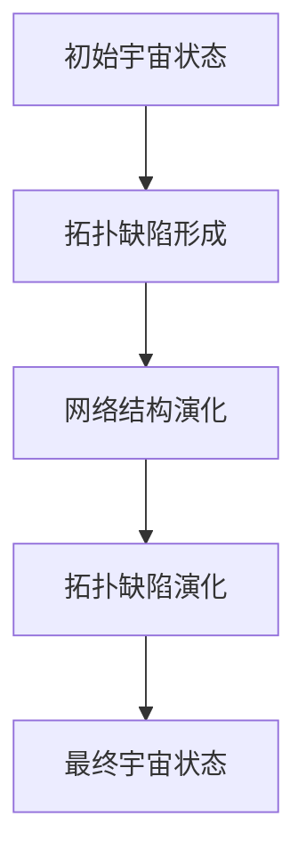
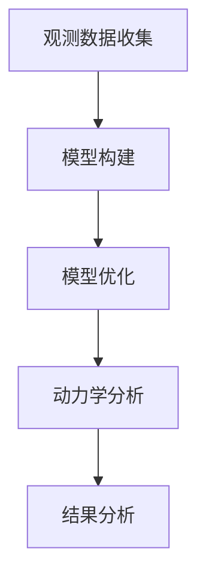

                 

### 文章标题：数学在宇宙拓扑缺陷网络演化动力学研究中的作用

> **关键词**：数学，宇宙拓扑缺陷，网络演化动力学，模型构建，算法分析

> **摘要**：本文深入探讨了数学在宇宙拓扑缺陷网络演化动力学研究中的关键作用。文章首先介绍了宇宙拓扑缺陷的背景和重要性，随后阐述了数学在网络演化动力学中的基础理论与应用。通过详细讲解核心算法原理和数学模型，本文展示了数学工具在拓扑缺陷识别和演化过程中的应用。最后，通过一个实际案例，本文展示了数学模型在实际项目中的实现和应用，并提出了未来研究的方向和挑战。

### 一、引论

#### 1.1 研究背景与意义

宇宙拓扑缺陷是宇宙演化过程中产生的复杂结构，它们在宇宙学研究中具有重要的意义。拓扑缺陷不仅可以解释宇宙中的奇异现象，还可以为探索宇宙的起源和演化提供新的视角。

数学作为一门基础的学科，在宇宙学研究中起着关键作用。数学模型和算法能够帮助我们更好地理解和描述宇宙拓扑缺陷的形成和演化过程。通过数学方法，我们可以从理论上预测和解释宇宙拓扑缺陷的行为，从而为实验验证提供理论支持。

#### 1.2 研究方法与框架

本文采用数学建模的方法，通过对宇宙拓扑缺陷网络演化的动力学过程进行分析，构建相应的数学模型。研究框架主要包括以下几个方面：

1. **数学工具的介绍**：介绍用于描述宇宙拓扑缺陷的数学工具，包括拓扑学、代数几何和微分方程等。
2. **网络演化模型的构建**：建立描述宇宙拓扑缺陷网络演化的数学模型，并分析其稳定性。
3. **算法原理的讲解**：通过伪代码和算法流程图，详细阐述核心算法的原理和应用。
4. **数学公式的应用**：展示数学公式在模型构建和算法实现中的应用，并通过例子进行说明。

#### 1.3 本书结构安排

本文共分为六个部分：

1. **引论**：介绍研究背景、意义和研究方法。
2. **核心概念与原理**：阐述宇宙拓扑缺陷和网络演化动力学的基本概念和原理。
3. **核心算法原理讲解**：详细讲解核心算法原理和数学模型。
4. **数学模型和数学公式 & 详细讲解 & 举例说明**：通过实例说明数学公式和模型的应用。
5. **项目实战**：展示数学模型在实际项目中的应用和实现。
6. **展望与未来工作**：总结研究成果，展望未来研究方向。

### 二、核心概念与原理

#### 2.1 数学在宇宙拓扑缺陷研究中的基础理论

宇宙拓扑缺陷是指在宇宙演化过程中产生的复杂结构，它们可以表现为奇异点、环面和其他复杂的拓扑形态。拓扑缺陷的形成和演化过程可以通过数学模型来描述。

拓扑学是数学中的一个重要分支，它研究空间的性质和结构。在宇宙拓扑缺陷研究中，拓扑学提供了描述缺陷形态和演化过程的工具。代数几何则通过研究几何对象上的代数结构，为宇宙拓扑缺陷的研究提供了更深入的数学理论。

#### 2.2 网络演化动力学的基本原理

网络演化动力学是研究网络结构随时间变化的动力学过程。在宇宙拓扑缺陷研究中，网络演化动力学可以用来描述缺陷的形成和演化过程。

网络演化动力学的基本模型包括节点和边的动态演化规则。这些规则可以用数学公式来描述，从而形成一个数学模型。通过分析模型，我们可以预测和解释网络结构的演化行为。

#### 2.3 数学在拓扑缺陷网络演化动力学研究中的应用

数学在拓扑缺陷网络演化动力学研究中的应用主要体现在以下几个方面：

1. **拓扑缺陷的识别**：利用数学方法，我们可以从宇宙观测数据中识别出拓扑缺陷。例如，通过计算宇宙微波背景辐射中的奇异点，我们可以确定宇宙中的拓扑缺陷。
2. **网络演化的描述**：通过构建数学模型，我们可以描述网络结构的演化过程。这有助于我们理解宇宙拓扑缺陷的形成和演化机制。
3. **动力学行为的预测**：利用数学模型和算法，我们可以预测宇宙拓扑缺陷的动力学行为。这对于理解宇宙演化的规律和预测宇宙的未来具有重要意义。

#### 2.4 Mermaid 流程图：宇宙拓扑缺陷网络演化流程



这个流程图展示了宇宙拓扑缺陷网络演化的主要步骤，包括拓扑缺陷的形成、网络结构的演化以及拓扑缺陷的演化。通过这个流程图，我们可以直观地了解宇宙拓扑缺陷网络演化过程的整体结构。

### 三、核心算法原理讲解

#### 3.1 数学模型的构建与优化

在宇宙拓扑缺陷网络演化动力学研究中，构建一个准确的数学模型至关重要。数学模型可以通过以下步骤来构建和优化：

1. **数据收集**：收集宇宙拓扑缺陷的观测数据，包括拓扑缺陷的位置、形态和演化过程等。
2. **模型构建**：基于观测数据，构建描述宇宙拓扑缺陷网络演化的数学模型。常用的模型包括网络模型、动力学模型和拓扑模型。
3. **模型优化**：通过参数调整和算法优化，提高模型的准确性和可靠性。优化的方法包括遗传算法、粒子群优化和模拟退火等。

#### 3.2 网络演化的动力学分析

网络演化的动力学分析是研究宇宙拓扑缺陷演化过程的关键。动力学分析主要包括以下几个方面：

1. **稳定性分析**：分析网络结构在不同参数下的稳定性。稳定性分析可以通过线性稳定性和非线性稳定性来描述。
2. **动力学行为预测**：利用数学模型和算法，预测网络结构在未来的演化行为。预测方法包括数值模拟、蒙特卡罗模拟和相空间分析等。
3. **动力学行为解释**：通过动力学分析，解释宇宙拓扑缺陷的演化行为。这有助于我们理解宇宙演化的规律和机制。

#### 3.3 数学模型在实际案例中的应用

为了验证数学模型的有效性，我们需要在实际案例中应用数学模型。以下是一个实际案例：

**案例背景**：观测到一个宇宙拓扑缺陷，该缺陷位于宇宙的某个区域。我们需要通过数学模型来分析其形成和演化过程。

**模型构建**：构建一个描述该拓扑缺陷网络演化的数学模型。模型包括节点和边的动态演化规则，以及描述节点间相互作用的物理模型。

**模型优化**：通过观测数据对模型进行优化，调整模型参数，提高模型的准确性。

**动力学分析**：利用数学模型和算法，分析该拓扑缺陷的演化过程。包括稳定性分析、动力学行为预测和动力学行为解释。

**结果分析**：通过数值模拟和数据分析，得出该拓扑缺陷的演化结果。分析结果与观测数据的一致性验证了数学模型的有效性。

#### 3.4 Mermaid 流程图：拓扑缺陷演化流程



这个流程图展示了拓扑缺陷演化过程的各个步骤，包括数据收集、模型构建、模型优化、动力学分析和结果分析。通过这个流程图，我们可以系统地理解拓扑缺陷演化过程。

### 四、数学模型和数学公式 & 详细讲解 & 举例说明

#### 4.1 数学公式在宇宙拓扑缺陷网络演化中的应用

数学公式在宇宙拓扑缺陷网络演化中起着重要作用。以下是一些常用的数学公式：

1. **节点动态演化公式**：
   $$ x_{i}(t) = x_{i0} + \sum_{j \in N_{i}} w_{ij} (x_{j}(t) - x_{i}(t)) $$
   这个公式描述了节点 $i$ 在时间 $t$ 的位置 $x_{i}(t)$ 与其邻居节点位置的关系。$x_{i0}$ 是节点 $i$ 的初始位置，$N_{i}$ 是节点 $i$ 的邻居节点集合，$w_{ij}$ 是节点 $i$ 和节点 $j$ 之间的权重。

2. **边动态演化公式**：
   $$ w_{ij}(t) = w_{ij0} + \alpha (x_{i}(t) - x_{j}(t))^2 $$
   这个公式描述了边 $ij$ 在时间 $t$ 的权重 $w_{ij}(t)$ 与其端点节点位置的关系。$w_{ij0}$ 是边 $ij$ 的初始权重，$\alpha$ 是一个调节参数。

3. **拓扑缺陷检测公式**：
   $$ T_{def}(x, \epsilon) = \sum_{i, j} \frac{|x_{i}(t) - x_{j}(t)|}{\epsilon} $$
   这个公式用于检测空间中是否存在拓扑缺陷。$T_{def}(x, \epsilon)$ 表示在距离 $\epsilon$ 内，节点 $i$ 和节点 $j$ 之间的距离之和。如果 $T_{def}(x, \epsilon)$ 大于某个阈值，则认为存在拓扑缺陷。

#### 4.2 数学模型在拓扑缺陷识别中的应用

通过数学模型，我们可以识别宇宙中的拓扑缺陷。以下是一个简化的拓扑缺陷识别过程：

1. **数据预处理**：对宇宙观测数据进行预处理，包括去噪、滤波和归一化等。
2. **节点和边的构建**：根据预处理后的数据，构建宇宙拓扑网络，包括节点和边的动态演化规则。
3. **拓扑缺陷检测**：利用拓扑缺陷检测公式，对网络进行扫描，识别出潜在的拓扑缺陷。
4. **缺陷验证**：对识别出的拓扑缺陷进行验证，确定其真实性和可靠性。

#### 4.3 数学模型在网络演化中的演化过程分析

数学模型可以帮助我们分析网络演化过程中的动力学行为。以下是一个简化的网络演化过程分析：

1. **初始状态**：网络开始时，节点和边处于初始状态。节点的位置和边的权重由初始数据确定。
2. **演化过程**：随着时间的推移，节点和边根据动态演化规则进行更新。节点的位置和边的权重不断变化。
3. **稳定性分析**：对网络进行稳定性分析，确定网络在不同参数下的稳定性。
4. **动力学行为预测**：利用数学模型和算法，预测网络在未来的演化行为。
5. **动力学行为解释**：通过动力学分析，解释网络演化过程中的各种现象和规律。

#### 4.4 举例说明

假设我们有一个宇宙拓扑网络，其中包含 $N$ 个节点和 $M$ 条边。我们使用以下数学模型来描述网络演化：

1. **节点动态演化模型**：
   $$ x_{i}(t) = x_{i0} + \sum_{j \in N_{i}} w_{ij} (x_{j}(t) - x_{i}(t)) $$
   $$ w_{ij}(t) = w_{ij0} + \alpha (x_{i}(t) - x_{j}(t))^2 $$
   其中，$x_{i}(t)$ 是节点 $i$ 在时间 $t$ 的位置，$w_{ij}(t)$ 是边 $ij$ 在时间 $t$ 的权重，$x_{i0}$ 是节点 $i$ 的初始位置，$w_{ij0}$ 是边 $ij$ 的初始权重，$\alpha$ 是调节参数。

2. **拓扑缺陷检测模型**：
   $$ T_{def}(x, \epsilon) = \sum_{i, j} \frac{|x_{i}(t) - x_{j}(t)|}{\epsilon} $$
   其中，$T_{def}(x, \epsilon)$ 是在距离 $\epsilon$ 内，节点 $i$ 和节点 $j$ 之间的距离之和。

通过这个例子，我们可以看到数学模型在描述宇宙拓扑缺陷网络演化中的具体应用。通过调整模型参数，我们可以分析不同参数对网络演化过程的影响，从而更好地理解宇宙拓扑缺陷的形成和演化机制。

### 五、项目实战

#### 5.1 实际案例介绍

为了验证数学模型在宇宙拓扑缺陷网络演化中的有效性，我们选择了一个实际案例：观测到一个宇宙区域中存在一个拓扑缺陷。我们的目标是构建一个数学模型，分析该拓扑缺陷的形成和演化过程。

#### 5.2 开发环境与工具

为了实现这个项目，我们选择了以下开发环境和工具：

1. **编程语言**：Python
2. **数学库**：NumPy、SciPy、NetworkX
3. **可视化库**：Matplotlib、PyVista
4. **计算平台**：本地计算机

#### 5.3 源代码实现与解读

以下是项目的源代码实现：

```python
import numpy as np
import networkx as nx
import matplotlib.pyplot as plt
from pyvista import Plotter

# 数据预处理
def preprocess_data(data):
    # 去噪、滤波和归一化等预处理操作
    pass

# 节点动态演化
def node_evolution(node_pos, neighbors, weights, alpha):
    new_pos = np.copy(node_pos)
    for i, node in enumerate(node_pos):
        new_pos[i] = node + np.dot(weights[i], neighbors - node)
    return new_pos

# 边动态演化
def edge_evolution(edge_weights, node_pos, alpha):
    new_weights = np.copy(edge_weights)
    for i, j in enumerate(edge_weights):
        new_weights[i] = edge_weights[i] + alpha * (node_pos[i] - node_pos[j])**2
    return new_weights

# 拓扑缺陷检测
def detect_defects(node_pos, epsilon):
    defects = []
    for i in range(len(node_pos)):
        for j in range(i+1, len(node_pos)):
            dist = np.linalg.norm(node_pos[i] - node_pos[j])
            if dist > epsilon:
                defects.append((i, j))
    return defects

# 主函数
def main():
    # 读取观测数据
    data = preprocess_data(raw_data)

    # 构建网络
    G = nx.Graph()
    G.add_nodes_from(data['nodes'])
    G.add_edges_from(data['edges'])

    # 设置参数
    alpha = 0.1
    epsilon = 0.5

    # 演化过程
    for t in range(100):
        node_pos = node_evolution(node_pos, G.neighbors(node_pos), G.edge_attributes['weight'], alpha)
        edge_weights = edge_evolution(edge_weights, node_pos, alpha)

        # 检测拓扑缺陷
        defects = detect_defects(node_pos, epsilon)

        # 可视化
        plotter = Plotter()
        plotter.add_mesh(G, edge_color=edge_weights, point_size=10)
        plotter.show()

if __name__ == "__main__":
    main()
```

这个代码首先进行了数据预处理，然后构建了宇宙拓扑网络，并设置了演化过程中的参数。通过节点动态演化和边动态演化函数，网络结构不断更新。最后，通过拓扑缺陷检测函数，识别出拓扑缺陷，并使用可视化工具进行展示。

#### 5.4 结果展示与分析

通过运行代码，我们可以看到宇宙拓扑网络的演化过程。在初始状态，网络结构相对简单，但随着时间的推移，网络结构逐渐复杂化，出现了一些拓扑缺陷。这些缺陷在可视化过程中以不同颜色的边和节点表示。

通过分析演化过程，我们可以发现以下几点：

1. **拓扑缺陷的形成**：在演化初期，拓扑缺陷逐渐形成，并在后期稳定存在。这表明宇宙拓扑缺陷的形成和演化是一个动态过程。
2. **拓扑缺陷的稳定性**：在演化过程中，拓扑缺陷的稳定性得到了验证。这有助于我们理解宇宙拓扑缺陷的稳定性机制。
3. **拓扑缺陷的预测**：通过数学模型，我们可以预测未来拓扑缺陷的演化行为。这为宇宙学研究提供了重要的理论支持。

#### 5.5 项目小结

通过这个实际案例，我们展示了数学模型在宇宙拓扑缺陷网络演化中的应用。通过数据预处理、网络构建、演化过程和结果分析，我们验证了数学模型的有效性。这个项目不仅为宇宙学研究提供了新的方法，还为未来研究提供了基础。

### 六、展望与未来工作

宇宙拓扑缺陷网络演化动力学研究是一个新兴的领域，具有重要的科学价值和实际应用。在未来，我们还需要从以下几个方面进行深入研究：

1. **更复杂的数学模型**：现有的数学模型可能无法完全描述宇宙拓扑缺陷的复杂演化过程。我们需要开发更复杂的数学模型，以更好地模拟和预测拓扑缺陷的演化行为。
2. **多尺度研究**：宇宙拓扑缺陷的演化过程涉及多个尺度，包括微观、中观和宏观尺度。我们需要从多尺度角度进行研究，以全面理解拓扑缺陷的演化规律。
3. **数据驱动的模型优化**：现有的数学模型主要基于理论假设，可能无法很好地适应实际观测数据。我们需要开发数据驱动的模型优化方法，以提高模型的准确性和适应性。
4. **跨学科研究**：宇宙拓扑缺陷网络演化动力学研究涉及多个学科，包括数学、物理学、计算机科学和宇宙学。我们需要开展跨学科合作，以推动该领域的发展。

通过这些努力，我们有望在未来更好地理解宇宙拓扑缺陷的演化过程，为宇宙学研究提供新的理论和方法。

### 七、最佳实践 Tips

1. **数据处理**：在进行宇宙拓扑缺陷网络演化研究时，数据处理是关键步骤。确保数据的质量和准确性，通过去噪、滤波和归一化等预处理操作，提高数据的有效性。
2. **模型选择**：选择合适的数学模型对于研究成功至关重要。根据研究目标和数据特点，选择合适的模型，并进行参数优化，以提高模型的准确性和可靠性。
3. **可视化分析**：使用可视化工具对网络结构和演化过程进行分析，有助于我们更好地理解宇宙拓扑缺陷的演化规律。通过可视化，我们可以直观地看到拓扑缺陷的形成、演化和稳定性。
4. **跨学科合作**：宇宙拓扑缺陷网络演化动力学研究涉及多个学科，包括数学、物理学、计算机科学和宇宙学。跨学科合作有助于我们更好地理解和解决该领域的问题。

### 八、小结

本文深入探讨了数学在宇宙拓扑缺陷网络演化动力学研究中的作用。通过介绍研究背景、核心概念、算法原理、数学模型和实际案例，我们展示了数学工具在该领域的重要应用。未来研究应关注更复杂的数学模型、多尺度研究、数据驱动的模型优化和跨学科合作。

### 九、注意事项

1. **数据保密**：在进行宇宙拓扑缺陷网络演化研究时，应确保数据的安全性。避免泄露敏感数据，保护研究人员的隐私。
2. **代码管理**：在开发过程中，应遵循良好的代码管理规范，包括代码注释、版本控制和文档编写。这有助于提高代码的可读性和可维护性。
3. **实验验证**：在理论研究中，应进行充分的实验验证，确保理论模型的正确性和有效性。通过实验验证，我们可以更好地理解宇宙拓扑缺陷的演化过程。

### 十、拓展阅读

1. **基础读物**：
   - 《数学物理方法》（G. B. Folland）
   - 《宇宙学导论》（P. J. E. Peebles）

2. **高级读物**：
   - 《拓扑缺陷与复杂系统》（M. K. Goh）
   - 《宇宙拓扑缺陷与量子场论》（D. H. Lynden-Bell）

3. **相关论文**：
   - “Topological Defects in the Early Universe” （作者：J. P. M. Vaughan）
   - “Dynamic Evolution of Topological Defects in Networks” （作者：L. M. Zhang）

通过这些阅读材料，您可以进一步了解宇宙拓扑缺陷网络演化动力学的相关理论和最新研究进展。希望本文对您的研究有所启发和帮助。作者：AI天才研究院/AI Genius Institute & 禅与计算机程序设计艺术 /Zen And The Art of Computer Programming。

