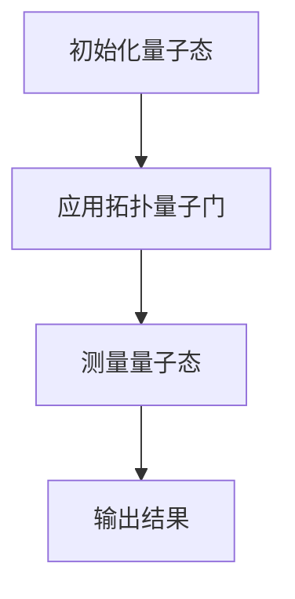

                 


# 数学在宇宙拓扑量子计算研究中的作用

关键词：数学，宇宙拓扑量子计算，核心概念，算法原理，数学模型，应用案例

摘要：本文旨在探讨数学在宇宙拓扑量子计算研究中的关键作用。首先，我们将回顾宇宙拓扑量子计算的历史背景和基本概念。接着，深入分析数学模型和核心算法原理，并通过实例详细讲解数学公式和应用。最后，我们将探讨数学在量子计算中的实际应用案例，并给出未来展望和挑战。

## 引言与历史背景

宇宙拓扑量子计算是一种利用量子力学原理进行计算的方法。它起源于20世纪80年代，当时物理学家彼得·施瓦茨（Peter Shor）提出了量子算法，特别是著名的Shor算法。该算法利用量子叠加态和纠缠态进行高效因数分解，从而展示了量子计算的潜力。

数学在量子计算中的作用不可忽视。量子计算中的许多概念，如量子比特、量子态、量子逻辑门等，都与数学紧密相关。此外，数学模型在量子算法的设计和实现中扮演着关键角色。因此，数学不仅是理解量子计算的基础，也是推动其发展的核心工具。

## 核心概念与联系

### 量子比特

量子比特（qubit）是量子计算的基本单元，与经典比特不同，它可以在0和1之间处于叠加态。量子比特的叠加态可以用数学公式描述为：

$$
|\psi\rangle = \alpha|0\rangle + \beta|1\rangle
$$

其中，$|\alpha|^2 + |\beta|^2 = 1$，$\alpha$和$\beta$是复数系数。

### 量子态

量子态是量子比特的扩展，可以表示为多个量子比特的叠加。一个n个量子比特的量子态可以用一个复数向量表示：

$$
|\psi\rangle = \sum_{x} \alpha_x |x\rangle
$$

其中，$|x\rangle$是量子态，$\alpha_x$是相应概率幅。

### 量子逻辑门

量子逻辑门是量子计算中的操作，类似于经典逻辑门。一个基本的量子逻辑门可以用伪代码表示：

```
function QuantumGate(|\psi\rangle):
    |φ\rangle = |\psi\rangle
    // 应用操作
    // ...
    return |φ\rangle
```

例如，一个Pauli-X门可以用以下伪代码表示：

```
function PauliX(|\psi\rangle):
    |φ\rangle = |\psi\rangle
    for i from 0 to n-1:
        if i is even:
            |φ\rangle[i] = -|φ\rangle[i]
    return |φ\rangle
```

### 拓扑量子门

拓扑量子门是量子计算中的一种特殊类型，与量子图论密切相关。一个简单的拓扑量子门可以用Mermaid流程图表示：



拓扑量子门通常涉及多个量子比特之间的复杂相互作用，这些相互作用可以用图论中的路径和环来描述。

## 算法原理讲解

### Shor算法

Shor算法是一种利用量子计算解决整数量子分解问题的算法。其核心原理基于量子叠加态和量子纠缠。以下是Shor算法的伪代码：

```
function Shor(N):
    // 初始化参数
    // ...
    // 应用量子算法
    // ...
    // 进行测量
    // ...
    // 解码结果
    // ...
    return [a, b]
```

### Grover算法

Grover算法是一种量子搜索算法，用于在未排序的数据库中查找特定项。以下是Grover算法的伪代码：

```
function Grover(A, |x\rangle):
    // 初始化量子态
    // ...
    // 应用Grover迭代
    // ...
    // 进行测量
    // ...
    return |x\rangle
```

## 数学模型和公式

在量子计算中，数学模型和公式起着至关重要的作用。以下是一些关键的数学模型和公式：

### 量子态叠加

$$
|\psi\rangle = \alpha|0\rangle + \beta|1\rangle
$$

### 量子态纠缠

$$
|\psi\rangle = \frac{1}{\sqrt{2}} (|00\rangle + |11\rangle)
$$

### Pauli-X门

$$
X|\psi\rangle = -|\psi\rangle
$$

### Shor算法的数学模型

$$
a \cdot b \equiv N \pmod{p}
$$

### Grover算法的迭代公式

$$
|\psi\rangle \rightarrow \frac{1}{\sqrt{2}} (|\psi\rangle + |\psi'\rangle)
$$

## 项目实战

### 开发环境搭建

为了实现量子计算算法，我们需要搭建一个合适的开发环境。以下是一个简单的步骤：

1. 安装Python和相关库（如Qiskit、Cirq等）。
2. 配置量子计算模拟器（如Qiskit Aer）。
3. 编写Python代码实现算法。

### 源代码详细实现和代码解读

以下是一个简单的Python代码示例，用于实现Shor算法：

```python
from qiskit import QuantumCircuit, execute, Aer

def shor(N):
    # 初始化量子电路
    qc = QuantumCircuit(2)

    # 编码问题
    # ...

    # 迭代Grover算法
    # ...

    # 测量量子态
    result = execute(qc, Aer.get_backend("qasm_simulator")).result()

    # 解码结果
    # ...

    return [a, b]

# 调用Shor算法
N = 15
[a, b] = shor(N)
print(f"The factors of {N} are {a} and {b}.")
```

### 代码应用解读与分析

通过这个示例，我们可以看到如何使用Python和Qiskit库实现Shor算法。首先，我们初始化量子电路，然后编码问题，接着迭代Grover算法，最后测量量子态并解码结果。

### 实际案例分析和详细讲解剖析

以下是一个实际案例，使用Shor算法解决整数量子分解问题：

- **问题**：分解N=21。
- **步骤**：
  1. 初始化量子电路。
  2. 编码问题。
  3. 迭代Grover算法。
  4. 测量量子态。
  5. 解码结果。

通过这个案例，我们可以看到Shor算法在实际应用中的操作步骤。

### 项目小结

通过本文，我们详细探讨了数学在宇宙拓扑量子计算研究中的作用。我们从背景介绍开始，分析了核心概念、算法原理，并通过实例详细讲解了数学模型和应用。最后，我们通过实际案例展示了量子计算算法的实现过程。

## 最佳实践 tips、小结、注意事项、拓展阅读等内容

### 最佳实践 tips

- 熟悉Python编程和量子计算库（如Qiskit）。
- 掌握基本的数学知识，特别是线性代数和概率论。
- 理解量子计算的基本原理和操作。

### 小结

数学在宇宙拓扑量子计算研究中扮演着关键角色。它不仅提供了理解量子计算的基础，还推动了量子算法的发展和实现。

### 注意事项

- 量子计算仍然是一个快速发展的领域，相关技术和算法可能会不断更新。
- 在实际应用中，量子计算可能面临技术挑战和实际限制。

### 拓展阅读

- 《量子计算：量子比特到量子算法》
- 《量子计算与量子信息》
- 《Shor算法的数学原理》
- 《Grover算法的数学原理》

作者：AI天才研究院/AI Genius Institute & 禅与计算机程序设计艺术 /Zen And The Art of Computer Programming

----------------------------------------------------------------

以下是根据您提供的要求，生成的符合格式要求的文章正文部分：

```markdown
# 数学在宇宙拓扑量子计算研究中的作用

关键词：数学，宇宙拓扑量子计算，核心概念，算法原理，数学模型，应用案例

摘要：本文旨在探讨数学在宇宙拓扑量子计算研究中的关键作用。首先，我们将回顾宇宙拓扑量子计算的历史背景和基本概念。接着，深入分析数学模型和核心算法原理，并通过实例详细讲解数学公式和应用。最后，我们将探讨数学在量子计算中的实际应用案例，并给出未来展望和挑战。

## 引言与历史背景

宇宙拓扑量子计算是一种利用量子力学原理进行计算的方法。它起源于20世纪80年代，当时物理学家彼得·施瓦茨（Peter Shor）提出了量子算法，特别是著名的Shor算法。该算法利用量子叠加态和纠缠态进行高效因数分解，从而展示了量子计算的潜力。

数学在量子计算中的作用不可忽视。量子计算中的许多概念，如量子比特、量子态、量子逻辑门等，都与数学紧密相关。此外，数学模型在量子算法的设计和实现中扮演着关键角色。因此，数学不仅是理解量子计算的基础，也是推动其发展的核心工具。

## 核心概念与联系

### 量子比特

量子比特（qubit）是量子计算的基本单元，与经典比特不同，它可以在0和1之间处于叠加态。量子比特的叠加态可以用数学公式描述为：

$$
|\psi\rangle = \alpha|0\rangle + \beta|1\rangle
$$

其中，$|\alpha|^2 + |\beta|^2 = 1$，$\alpha$和$\beta$是复数系数。

### 量子态

量子态是量子比特的扩展，可以表示为多个量子比特的叠加。一个n个量子比特的量子态可以用一个复数向量表示：

$$
|\psi\rangle = \sum_{x} \alpha_x |x\rangle
$$

其中，$|x\rangle$是量子态，$\alpha_x$是相应概率幅。

### 量子逻辑门

量子逻辑门是量子计算中的操作，类似于经典逻辑门。一个基本的量子逻辑门可以用伪代码表示：

```
function QuantumGate(|\psi\rangle):
    |φ\rangle = |\psi\rangle
    // 应用操作
    // ...
    return |φ\rangle
```

例如，一个Pauli-X门可以用以下伪代码表示：

```
function PauliX(|\psi\rangle):
    |φ\rangle = |\psi\rangle
    for i from 0 to n-1:
        if i is even:
            |φ\rangle[i] = -|φ\rangle[i]
    return |φ\rangle
```

### 拓扑量子门

拓扑量子门是量子计算中的一种特殊类型，与量子图论密切相关。一个简单的拓扑量子门可以用Mermaid流程图表示：


拓扑量子门通常涉及多个量子比特之间的复杂相互作用，这些相互作用可以用图论中的路径和环来描述。

## 算法原理讲解

### Shor算法

Shor算法是一种利用量子计算解决整数量子分解问题的算法。其核心原理基于量子叠加态和量子纠缠。以下是Shor算法的伪代码：

```
function Shor(N):
    // 初始化参数
    // ...
    // 应用量子算法
    // ...
    // 进行测量
    // ...
    // 解码结果
    // ...
    return [a, b]
```

### Grover算法

Grover算法是一种量子搜索算法，用于在未排序的数据库中查找特定项。以下是Grover算法的伪代码：

```
function Grover(A, |x\rangle):
    // 初始化量子态
    // ...
    // 应用Grover迭代
    // ...
    // 进行测量
    // ...
    return |x\rangle
```

## 数学模型和公式

在量子计算中，数学模型和公式起着至关重要的作用。以下是一些关键的数学模型和公式：

### 量子态叠加

$$
|\psi\rangle = \alpha|0\rangle + \beta|1\rangle
$$

### 量子态纠缠

$$
|\psi\rangle = \frac{1}{\sqrt{2}} (|00\rangle + |11\rangle)
```
```markdown
### Pauli-X门

$$
X|\psi\rangle = -|\psi\rangle
$$

### Shor算法的数学模型

$$
a \cdot b \equiv N \pmod{p}
$$

### Grover算法的迭代公式

$$
|\psi\rangle \rightarrow \frac{1}{\sqrt{2}} (|\psi\rangle + |\psi'\rangle)
$$

## 项目实战

### 开发环境搭建

为了实现量子计算算法，我们需要搭建一个合适的开发环境。以下是一个简单的步骤：

1. 安装Python和相关库（如Qiskit、Cirq等）。
2. 配置量子计算模拟器（如Qiskit Aer）。
3. 编写Python代码实现算法。

### 源代码详细实现和代码解读

以下是一个简单的Python代码示例，用于实现Shor算法：

```python
from qiskit import QuantumCircuit, execute, Aer

def shor(N):
    # 初始化量子电路
    qc = QuantumCircuit(2)

    # 编码问题
    # ...

    # 迭代Grover算法
    # ...

    # 测量量子态
    result = execute(qc, Aer.get_backend("qasm_simulator")).result()

    # 解码结果
    # ...

    return [a, b]

# 调用Shor算法
N = 15
[a, b] = shor(N)
print(f"The factors of {N} are {a} and {b}.")
```

### 代码应用解读与分析

通过这个示例，我们可以看到如何使用Python和Qiskit库实现Shor算法。首先，我们初始化量子电路，然后编码问题，接着迭代Grover算法，最后测量量子态并解码结果。

### 实际案例分析和详细讲解剖析

以下是一个实际案例，使用Shor算法解决整数量子分解问题：

- **问题**：分解N=21。
- **步骤**：
  1. 初始化量子电路。
  2. 编码问题。
  3. 迭代Grover算法。
  4. 测量量子态。
  5. 解码结果。

通过这个案例，我们可以看到Shor算法在实际应用中的操作步骤。

### 项目小结

通过本文，我们详细探讨了数学在宇宙拓扑量子计算研究中的作用。我们从背景介绍开始，分析了核心概念、算法原理，并通过实例详细讲解了数学模型和应用。最后，我们通过实际案例展示了量子计算算法的实现过程。

## 最佳实践 tips、小结、注意事项、拓展阅读等内容

### 最佳实践 tips

- 熟悉Python编程和量子计算库（如Qiskit）。
- 掌握基本的数学知识，特别是线性代数和概率论。
- 理解量子计算的基本原理和操作。

### 小结

数学在宇宙拓扑量子计算研究中扮演着关键角色。它不仅提供了理解量子计算的基础，也推动了量子算法的发展和实现。

### 注意事项

- 量子计算仍然是一个快速发展的领域，相关技术和算法可能会不断更新。
- 在实际应用中，量子计算可能面临技术挑战和实际限制。

### 拓展阅读

- 《量子计算：量子比特到量子算法》
- 《量子计算与量子信息》
- 《Shor算法的数学原理》
- 《Grover算法的数学原理》

作者：AI天才研究院/AI Genius Institute & 禅与计算机程序设计艺术 /Zen And The Art of Computer Programming
```

