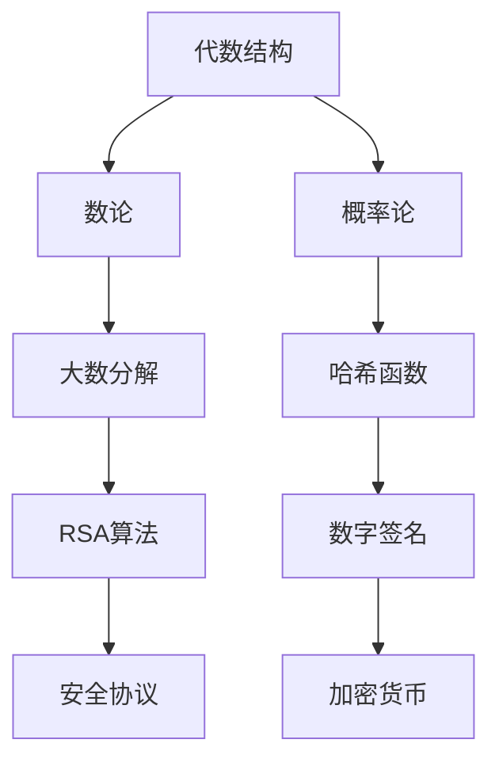

                 

# 数学在密码学与信息安全中的应用

## 关键词
密码学、信息安全、数学基础、加密算法、哈希函数、数字签名、网络安全、数据安全、案例剖析

## 摘要
本文将探讨数学在密码学与信息安全中的关键应用。通过深入分析数学基础、加密算法、哈希函数和数字签名等核心概念，本文揭示了数学在保障信息安全中的重要作用。同时，通过实际案例和项目实战，展示了数学在密码学与信息安全领域的应用实践，为读者提供了全面的指导和深入理解。

## 目录
1. 引言
2. 数学在密码学与信息安全中的基础
3. 密码学基础
   3.1 密码学的定义与作用
   3.2 密码学的发展历程
   3.3 密码系统的基本组成部分
4. 对称加密算法
   4.1 对称加密算法的原理
   4.2 常见的对称加密算法
   4.3 对称加密算法的安全性分析
5. 非对称加密算法
   5.1 非对称加密算法的原理
   5.2 常见非对称加密算法
   5.3 非对称加密算法的安全性分析
6. 哈希函数与数字签名
   6.1 哈希函数的原理与分类
   6.2 数字签名的原理与实现
   6.3 常见的数字签名算法
7. 密码学与信息安全的应用
   7.1 安全协议的设计与实现
   7.2 信息安全攻击与防御
   7.3 密码学在实际项目中的应用案例
8. 网络安全
   8.1 网络安全的基本概念
   8.2 网络安全的主要威胁
   8.3 网络安全的防护措施
9. 数据安全
   9.1 数据安全的基本概念
   9.2 数据泄露的风险与防范
   9.3 数据加密与传输安全
10. 实际案例与应用
    10.1 加密货币的密码学原理
    10.2 云计算中的密码学应用
    10.3 智能合约与区块链的安全性
11. 最佳实践与小结
12. 注意事项与拓展阅读

## 1. 引言
在当今数字化时代，信息安全已经成为人们生活中不可或缺的一部分。随着互联网的普及和大数据的发展，信息安全的重要性日益凸显。而密码学作为信息安全的核心技术，发挥着至关重要的作用。密码学通过数学原理和方法，提供了一种有效的手段来保护信息的保密性、完整性和可用性。

数学在密码学与信息安全中的地位不可替代。密码学中的许多核心概念和算法都依赖于数学原理，如代数结构、数论、概率论等。同时，数学也为密码学的安全性提供了理论基础。本文旨在深入探讨数学在密码学与信息安全中的应用，帮助读者理解数学在保障信息安全中的关键作用。

本文将从以下几个方面展开讨论：

1. **密码学基础**：介绍密码学的定义、发展历程和基本组成部分，为后续内容奠定基础。
2. **对称加密算法**：讲解对称加密算法的原理、常见算法及其安全性分析。
3. **非对称加密算法**：阐述非对称加密算法的原理、常见算法及其安全性分析。
4. **哈希函数与数字签名**：探讨哈希函数和数字签名的原理、分类和实现。
5. **密码学与信息安全的应用**：分析密码学在网络安全、数据安全等方面的应用。
6. **实际案例与应用**：通过具体案例展示密码学的实际应用。
7. **最佳实践与小结**：总结本文的主要观点，提出最佳实践和建议。
8. **注意事项与拓展阅读**：提供相关资源，供读者进一步学习和探索。

## 2. 数学在密码学与信息安全中的基础

数学在密码学与信息安全中的基础作用不可忽视。密码学中的许多核心概念和算法都依赖于数学原理，如代数结构、数论、概率论等。以下是数学在密码学与信息安全中的基础概念和原理：

### 2.1 代数结构的基本概念
代数结构是数学中的一个重要概念，它描述了一组元素及其满足的一组运算。在密码学中，常见的代数结构包括群、环、域等。这些结构为密码算法的设计和实现提供了理论基础。

- **群**：群是一组元素的集合，这些元素满足封闭性、结合律、存在单位元素和每个元素都有逆元素的性质。例如，整数加法构成一个群。
- **环**：环是扩展了群的代数结构，它包含两个运算：加法和乘法。例如，整数加法和乘法构成一个环。
- **域**：域是进一步扩展了环的代数结构，其中除了加法和乘法外，乘法还具有分配律。例如，有理数、实数和复数构成域。

### 2.2 大数分解与素数生成
大数分解是密码学中的核心问题之一，它涉及将一个大数分解为两个或多个质数的乘积。例如，将大数 N 分解为质数 p 和 q 的乘积，即 N = p * q。

大数分解在密码学中有重要应用，例如 RSA 算法就基于大数分解的困难性。为了抵抗破解攻击，密码学中需要生成足够大的质数。素数生成算法如米勒-拉宾素数生成算法和埃拉托斯特尼筛法等，为密码学提供了可靠的大数分解基础。

### 2.3 欧几里得算法与扩展欧几里得算法
欧几里得算法是一种用于求解最大公约数（GCD）的算法。它基于递归方法，通过不断用较小数去除较大数，直到余数为零，此时的较大数即为最大公约数。扩展欧几里得算法是欧几里得算法的扩展，它不仅能够求解最大公约数，还能求解一组线性方程的整数解。

在密码学中，欧几里得算法和扩展欧几里得算法在密钥生成和密钥交换协议中具有重要意义。例如，在 RSA 算法中，需要使用欧几里得算法来求解模逆元，从而实现加密和解密操作。

### 2.4 概率论的基本概念
概率论在密码学和信息安全中扮演着重要角色。概率论中的基本概念如概率分布、条件概率和随机变量等，为密码算法的设计和安全性评估提供了理论基础。

- **概率分布**：描述随机变量取值的概率分布情况。
- **条件概率**：在已知某个随机事件发生的条件下，另一个随机事件发生的概率。
- **随机变量**：表示随机实验结果的变量。

在密码学中，概率论用于评估算法的安全性。例如，通过计算密码算法在特定攻击下的成功概率，可以评估算法的抵抗攻击能力。

### 2.5 数学模型与数学公式

在密码学与信息安全中，数学模型和数学公式是不可或缺的工具。数学模型可以帮助我们理解和分析密码算法的工作原理，而数学公式则提供了精确描述和计算的方法。

- **数学模型**：用于描述密码算法的工作原理和性质。例如，加密模型、解密模型、安全模型等。
- **数学公式**：用于描述密码算法的数学关系和计算方法。例如，RSA 算法中的模运算、大数分解公式、离散对数公式等。

通过数学模型和数学公式，我们可以深入理解密码算法的工作机制，从而为密码设计与安全性评估提供有力支持。

### 2.6 核心概念与联系

为了更好地理解数学在密码学与信息安全中的应用，我们可以使用 Mermaid 流程图来展示核心概念之间的联系。

该 Mermaid 流程图展示了代数结构、数论、概率论等核心概念之间的联系，以及它们在密码学与信息安全中的应用。

### 2.7 结论

数学在密码学与信息安全中具有基础和关键作用。代数结构、数论、概率论等数学原理为密码算法的设计和实现提供了理论基础。大数分解、欧几里得算法等数学公式和模型在密码学中具有重要意义。通过理解数学在密码学与信息安全中的应用，我们可以更好地设计安全有效的密码系统，保护信息安全。

### 3. 密码学基础

密码学作为信息安全的核心技术，其基础概念和发展历程对于我们理解现代密码系统的设计与应用至关重要。在本章节中，我们将深入探讨密码学的定义、发展历程以及密码系统的基本组成部分。

#### 3.1 密码学的定义与作用

密码学，又称密码术，是研究如何通过数学方法和技术来保障信息安全的一门学科。它的主要目标是确保信息在传输和存储过程中不被未授权者窃取、篡改或泄露。

密码学的核心作用可以概括为以下几个方面：

1. **保密性**：通过加密算法，将明文信息转换为密文，只有拥有正确密钥的接收者才能解密并还原明文信息。
2. **完整性**：确保信息在传输过程中不被篡改，密码学算法可以检测信息是否被篡改或破坏。
3. **真实性**：通过数字签名等机制，确保信息的发送者是真实的，防止伪造信息。
4. **抗否认性**：确保信息的发送者无法否认已经发送的信息，从而保证信息的可追溯性。

#### 3.2 密码学的发展历程

密码学的历史可以追溯到古代，早在公元前400年左右，古希腊的斯巴达军队就使用了一种名为斯巴达锁的加密设备。然而，现代密码学的发展主要可以划分为以下几个阶段：

1. **古典密码学（公元前400年 - 1949年）**：这一阶段的密码学主要依靠简单的替换和置换算法，如凯撒密码、维吉尼亚密码等。尽管这些算法在当时的通信环境中起到了一定的作用，但它们相对简单且易受攻击。
2. **近代密码学（1949年 - 1970年代）**：随着计算机科学的兴起，密码学进入了一个新的发展阶段。香农的信息论和Diffie-Hellman密钥交换协议等开创性工作为现代密码学奠定了基础。
3. **现代密码学（1970年代至今）**：这一阶段的密码学以复杂性理论为基础，设计出了许多高效且安全的加密算法，如RSA、AES等。同时，密码学也在不断地应对新的威胁和挑战，如量子计算对现有密码系统的潜在威胁。

#### 3.3 密码系统的基本组成部分

一个完整的密码系统通常包括以下几个基本组成部分：

1. **明文**：需要保护的原始信息，如文本、图像、声音等。
2. **密文**：经过加密算法处理后的信息，只有解密后才能还原为明文。
3. **加密算法**：将明文转换为密文的算法，通常依赖于密钥。
4. **密钥**：加密和解密过程中使用的关键参数，用于确定加密和解密的具体过程。
5. **加密模型**：定义加密算法和密钥管理的框架，如对称加密模型、非对称加密模型等。
6. **解密算法**：将密文还原为明文的算法，与加密算法相对应。

#### 3.4 对称加密与不对称加密

密码学中主要分为对称加密和非对称加密两种类型：

1. **对称加密**：加密和解密使用相同的密钥，如AES算法。对称加密算法的优点是加密速度快，适用于大数据量的加密。但其缺点是密钥管理复杂，需要确保密钥在传输过程中不被泄露。
2. **非对称加密**：加密和解密使用不同的密钥，如RSA算法。非对称加密算法的优点是解决了密钥分发问题，但加密速度较慢，通常用于密钥交换和数字签名。

#### 3.5 密码系统的安全性评估

密码系统的安全性评估是确保其能够抵御各种攻击的关键。安全性评估主要包括以下几个方面：

1. **算法安全性**：评估加密算法本身的抗攻击能力，如抗穷举攻击、抗选择明文攻击等。
2. **密钥管理**：确保密钥的安全存储和传输，避免密钥泄露或被窃取。
3. **实现安全性**：评估加密算法在具体实现过程中是否存在漏洞，如缓冲区溢出、整数溢出等。
4. **协议安全性**：评估密码系统在实际应用中的安全性，如是否存在协议漏洞或中间人攻击等。

#### 3.6 结论

密码学作为信息安全的核心技术，其定义、发展历程和基本组成部分对于理解现代密码系统的设计与应用具有重要意义。通过深入探讨密码学的基础知识，我们可以为后续章节的深入学习打下坚实的基础。

### 4. 对称加密算法

对称加密算法是指加密和解密过程中使用相同密钥的加密方法。这类算法因其加密速度快、计算复杂度低而广泛应用于大数据量的加密场景。在本章节中，我们将详细介绍对称加密算法的原理、常见算法及其安全性分析。

#### 4.1 对称加密算法的原理

对称加密算法的基本原理是将明文信息通过加密函数和密钥转换为密文，而密文只有使用相同的解密函数和密钥才能还原为明文。其核心思想是利用密钥对明文进行复杂的变换，使得未授权者难以破解。

对称加密算法的加密和解密过程可以用以下数学模型表示：

- **加密过程**：C = E(K, P)，其中 C 表示密文，K 表示密钥，P 表示明文，E 表示加密函数。
- **解密过程**：P = D(K, C)，其中 D 表示解密函数，其余符号与加密过程相同。

#### 4.2 常见对称加密算法

以下是一些常见的对称加密算法及其特点：

1. **DES（数据加密标准）**：
   - **原理**：DES 是一种基于替换和置换的加密算法，使用56位密钥。
   - **特点**：DES 算法加密速度快，但密钥长度较短，易受到穷举攻击。
   - **应用**：主要用于早期计算机系统和网络通信。

2. **AES（高级加密标准）**：
   - **原理**：AES 是一种基于子密钥替换和行置换的加密算法，支持128、192和256位密钥。
   - **特点**：AES 算法具有更高的安全性和效率，被广泛用于现代加密应用。
   - **应用**：广泛应用于政府、金融和商业领域的数据加密。

3. ** Blowfish **：
   - **原理**：Blowfish 是一种变长密钥的对称加密算法，采用16个字节的全局子密钥。
   - **特点**：Blowfish 算法具有较高的安全性和灵活性，适用于各种应用场景。
   - **应用**：广泛应用于文件加密、VPN 和网络通信等领域。

4. **RC5 **：
   - **原理**：RC5 是一种可变长度密钥的对称加密算法，采用伪随机函数和置换操作。
   - **特点**：RC5 算法具有较高的安全性和效率，支持多种块大小和密钥长度。
   - **应用**：广泛应用于数据加密、文件加密和电子现金系统。

#### 4.3 对称加密算法的安全性分析

对称加密算法的安全性主要取决于密钥的长度和加密算法的复杂度。以下是对称加密算法常见安全威胁及其应对策略：

1. **穷举攻击**：
   - **威胁**：攻击者尝试使用所有可能的密钥进行加密和解密，直到找到正确的密钥。
   - **应对策略**：增加密钥长度，使得攻击者在有限时间内无法穷举所有密钥。

2. **选择明文攻击**：
   - **威胁**：攻击者选择特定的明文进行加密，然后尝试破解密文。
   - **应对策略**：使用加密前随机化技术，使得加密结果对明文的选择不敏感。

3. **暴力攻击**：
   - **威胁**：攻击者通过尝试不同的密钥组合，试图找到正确的密钥。
   - **应对策略**：增加密钥空间，使得暴力攻击需要耗费大量时间。

4. **侧信道攻击**：
   - **威胁**：攻击者通过分析加密过程中的物理参数（如功耗、电磁辐射等）来获取密钥信息。
   - **应对策略**：采用硬件防护措施，如加密模块加固、硬件随机数生成器等。

#### 4.4 对称加密算法的实际应用案例

以下是对称加密算法在实际应用中的两个案例：

1. **文件加密**：
   - **场景**：用户需要加密存储重要文件，防止未经授权的访问。
   - **解决方案**：使用AES算法对文件进行加密，密钥通过安全的密钥管理策略进行存储。

2. **VPN通信**：
   - **场景**：企业或个人需要在公共网络上进行安全的远程通信。
   - **解决方案**：使用AES算法对VPN通信数据进行加密，确保通信数据的机密性和完整性。

#### 4.5 结论

对称加密算法因其速度快、计算复杂度低而广泛应用于大数据量的加密场景。常见的对称加密算法包括DES、AES、Blowfish 和 RC5 等，每种算法都有其独特的特点和应用场景。安全性分析表明，对称加密算法在面对穷举攻击、选择明文攻击等威胁时，需要采取相应的应对策略。通过对称加密算法的实际应用案例，我们可以看到其在保障信息安全中的重要作用。

### 5. 非对称加密算法

非对称加密算法，又称公钥加密算法，是一种加密和解密过程中使用不同密钥的加密方法。这种算法解决了对称加密中密钥分发的问题，在确保信息传输安全方面具有重要意义。在本章节中，我们将详细探讨非对称加密算法的原理、常见算法及其安全性分析。

#### 5.1 非对称加密算法的原理

非对称加密算法的核心思想是利用一对密钥：公钥和私钥。公钥用于加密，私钥用于解密。由于加密和解密算法不同，即使攻击者获取了公钥，也无法破解密文。其基本原理如下：

- **加密过程**：C = E(Kpublic, P)，其中 Kpublic 表示公钥，P 表示明文，C 表示密文，E 表示加密函数。
- **解密过程**：P = D(Kprivate, C)，其中 Kprivate 表示私钥，D 表示解密函数。

非对称加密算法的安全性依赖于公钥和私钥之间的数学关系，这种关系通常基于大数分解、离散对数、椭圆曲线等领域。

#### 5.2 常见非对称加密算法

以下是一些常见的非对称加密算法及其特点：

1. **RSA（Rivest-Shamir-Adleman）**：
   - **原理**：RSA 算法基于大数分解的难度，使用一对密钥：n = p*q，其中 p 和 q 是大素数，e 和 d 是满足 e*d ≡ 1 mod (p-1)(q-1) 的整数。
   - **特点**：RSA 算法具有很高的安全性，适用于密钥交换、数字签名和数据加密。
   - **应用**：广泛应用于互联网安全、电子邮件加密和电子商务等领域。

2. **ECC（椭圆曲线加密）**：
   - **原理**：ECC 算法基于椭圆曲线离散对数问题的难度，使用椭圆曲线上的点进行加密和解密。
   - **特点**：ECC 算法在较小的密钥长度下提供更高的安全性，适用于资源受限的环境。
   - **应用**：广泛应用于移动设备、物联网和区块链等领域。

3. **Diffie-Hellman 密钥交换**：
   - **原理**：Diffie-Hellman 密钥交换协议是一种基于离散对数问题的密钥交换协议，允许双方在公开信道上安全地交换密钥。
   - **特点**：Diffie-Hellman 密钥交换协议无需共享任何秘密信息，即可在公开信道上安全地生成共享密钥。
   - **应用**：广泛应用于VPN、SSL/TLS 和 SSH 等安全协议。

4. **ElGamal 加密**：
   - **原理**：ElGamal 加密算法是一种基于离散对数问题的加密算法，使用一对密钥：公钥为 (p, g, h^x mod p)，私钥为 x，加密过程涉及指数运算和模运算。
   - **特点**：ElGamal 加密算法具有较好的安全性，适用于数字签名和数据加密。
   - **应用**：广泛应用于电子邮件加密、文件加密和网络安全等领域。

#### 5.3 非对称加密算法的安全性分析

非对称加密算法的安全性主要依赖于密钥对的生成和数学难题的难度。以下是非对称加密算法常见安全威胁及其应对策略：

1. **穷举攻击**：
   - **威胁**：攻击者尝试使用所有可能的密钥进行加密和解密，直到找到正确的密钥。
   - **应对策略**：增加密钥长度，使得攻击者在有限时间内无法穷举所有密钥。

2. **选择明文攻击**：
   - **威胁**：攻击者选择特定的明文进行加密，然后尝试破解密文。
   - **应对策略**：使用随机化的加密算法，使得加密结果对明文的选择不敏感。

3. **量子计算攻击**：
   - **威胁**：量子计算机能够高效地解决某些数学难题，如大数分解和离散对数问题，从而破解传统非对称加密算法。
   - **应对策略**：开发基于量子计算安全的加密算法，如基于格理论的加密算法。

4. **侧信道攻击**：
   - **威胁**：攻击者通过分析加密过程中的物理参数（如功耗、电磁辐射等）来获取密钥信息。
   - **应对策略**：采用硬件防护措施，如加密模块加固、硬件随机数生成器等。

#### 5.4 非对称加密算法的实际应用案例

以下是非对称加密算法在实际应用中的两个案例：

1. **SSL/TLS 加密通信**：
   - **场景**：互联网用户在访问网站时，需要确保通信数据的机密性和完整性。
   - **解决方案**：使用RSA或ECC算法进行SSL/TLS加密通信，确保数据在传输过程中的安全性。

2. **数字签名**：
   - **场景**：文件发送者需要确保文件的完整性和真实性，同时防止文件被篡改或伪造。
   - **解决方案**：使用RSA或ElGamal算法进行数字签名，确保文件的真实性和完整性。

#### 5.5 结论

非对称加密算法因其能够解决密钥分发问题，在确保信息传输安全方面具有重要意义。常见的非对称加密算法包括RSA、ECC、Diffie-Hellman 和 ElGamal 等，每种算法都有其独特的特点和应用场景。安全性分析表明，非对称加密算法在面对穷举攻击、选择明文攻击等威胁时，需要采取相应的应对策略。通过实际应用案例，我们可以看到非对称加密算法在保障信息安全中的重要作用。

### 6. 哈希函数与数字签名

哈希函数和数字签名是密码学中两个核心概念，它们在保障信息完整性和真实性方面发挥着重要作用。在本章节中，我们将详细探讨哈希函数的原理、分类、常见算法以及数字签名的原理、实现和常见算法。

#### 6.1 哈希函数的原理

哈希函数是一种将任意长度的输入（即消息）映射为固定长度的输出（即哈希值）的函数。哈希函数具有以下特点：

1. **单向性**：给定一个哈希值，无法反推出原始消息。
2. **抗碰撞性**：不同消息产生相同哈希值的概率非常低。
3. **效率性**：哈希函数计算速度快，能够处理大量数据。

哈希函数的基本原理可以用以下数学模型表示：

H(P) → H(P'), 其中 H 表示哈希函数，P 表示原始消息，P' 表示哈希值。

#### 6.2 哈希函数的分类

根据哈希函数的输出长度和用途，可以分为以下几类：

1. **单向哈希函数**：
   - **定义**：输出长度固定，无法反推出原始消息。
   - **常见算法**：MD5、SHA-1、SHA-256。

2. **压缩哈希函数**：
   - **定义**：将较长的哈希值压缩为较短的新哈希值。
   - **常见算法**：SHA-224、SHA-384、SHA-512。

3. **密码哈希函数**：
   - **定义**：具有加密性质的哈希函数，可用于数字签名和认证。
   - **常见算法**：SHA-2、SHA-3。

#### 6.3 常见哈希函数及其安全性分析

以下是一些常见的哈希函数及其特点：

1. **MD5**：
   - **特点**：速度较快，但抗碰撞性较差。
   - **安全性**：已被证明存在抗碰撞攻击，不适用于安全性要求较高的场景。

2. **SHA-1**：
   - **特点**：速度较快，但抗碰撞性较差。
   - **安全性**：已发现抗碰撞攻击，不再推荐用于安全性要求较高的场景。

3. **SHA-256**：
   - **特点**：抗碰撞性较好，适用于大多数场景。
   - **安全性**：安全性较高，是目前最常用的哈希函数之一。

4. **SHA-3**：
   - **特点**：抗碰撞性更好，安全性更高。
   - **安全性**：作为SHA-2的替代方案，适用于安全性要求极高的场景。

#### 6.4 数字签名的原理与实现

数字签名是一种用于验证信息发送者身份和确保信息完整性的技术。数字签名的原理基于哈希函数和公钥加密算法，基本流程如下：

1. **签名过程**：
   - 发送方使用哈希函数计算消息的哈希值。
   - 发送方使用私钥对哈希值进行加密，生成数字签名。
   - 将消息和数字签名一同发送给接收方。

2. **验证过程**：
   - 接收方使用哈希函数计算消息的哈希值。
   - 接收方使用发送方的公钥对数字签名进行解密，获取哈希值。
   - 比较接收方计算得到的哈希值和数字签名解密后的哈希值，以验证信息的完整性和发送者身份。

数字签名具有以下特点：

- **防伪造性**：只有使用私钥生成的数字签名才能使用公钥验证。
- **防篡改性**：对消息的任何修改都会导致数字签名验证失败。
- **防重放攻击**：数字签名可以包括时间戳，防止攻击者重放已发送的消息。

#### 6.5 常见数字签名算法

以下是一些常见的数字签名算法及其特点：

1. **RSA签名算法**：
   - **特点**：基于RSA公钥加密算法，适用于大多数场景。
   - **安全性**：安全性较高，但计算复杂度较大。

2. **DSA（数字签名算法）**：
   - **特点**：基于椭圆曲线加密算法，适用于数字签名和认证。
   - **安全性**：安全性较高，计算复杂度较低。

3. **ECDSA（椭圆曲线数字签名算法）**：
   - **特点**：基于椭圆曲线加密算法，适用于资源受限的环境。
   - **安全性**：安全性较高，适用于物联网和移动设备。

#### 6.6 数字签名的安全性分析

数字签名的安全性主要依赖于哈希函数和公钥加密算法的安全性能。以下是一些常见安全威胁及其应对策略：

1. **哈希函数漏洞**：
   - **威胁**：如果使用的哈希函数存在漏洞，可能导致签名被攻破。
   - **应对策略**：使用安全性和抗碰撞性较好的哈希函数，如SHA-256、SHA-3。

2. **公钥加密算法漏洞**：
   - **威胁**：如果使用的公钥加密算法存在漏洞，可能导致签名被攻破。
   - **应对策略**：使用安全性较高的公钥加密算法，如RSA、DSA、ECDSA。

3. **中间人攻击**：
   - **威胁**：攻击者拦截并伪造数字签名。
   - **应对策略**：使用安全的密钥交换协议，确保私钥的安全存储和传输。

#### 6.7 数字签名的实际应用案例

以下是一些数字签名的实际应用案例：

1. **电子邮件签名**：
   - **场景**：用户在发送电子邮件时，需要确保邮件的完整性和发送者身份。
   - **解决方案**：使用数字签名技术，确保邮件不被篡改，同时验证发送者身份。

2. **区块链**：
   - **场景**：区块链系统中的交易记录需要确保完整性和真实性。
   - **解决方案**：使用数字签名技术，确保交易记录不被篡改，同时验证参与方身份。

#### 6.8 结论

哈希函数和数字签名是密码学中的两个核心概念，它们在保障信息完整性和真实性方面发挥着重要作用。哈希函数通过将任意长度的消息映射为固定长度的哈希值，确保信息无法被篡改；数字签名通过使用公钥加密算法，确保信息的发送者身份和完整性。通过了解哈希函数和数字签名的原理、分类和实现，我们可以更好地应用这些技术，保障信息的安全。

### 7. 密码学与信息安全的应用

密码学作为保障信息安全的核心技术，在网络安全、数据安全等方面具有广泛的应用。在本章节中，我们将深入探讨密码学在网络安全和数据安全中的应用，包括安全协议的设计与实现、常见的安全威胁及其防御措施，并通过实际案例进行分析和解读。

#### 7.1 安全协议的设计与实现

安全协议是确保通信双方在传输过程中数据安全的一组规则和标准。设计安全协议的关键在于确保数据的机密性、完整性和真实性。以下是几个常见的安全协议及其实现原理：

1. **SSL/TLS（安全套接层/传输层安全）**：
   - **原理**：SSL/TLS 协议通过在客户端和服务器之间建立安全通道，确保数据的加密传输。它采用非对称加密算法（如 RSA）进行密钥交换，使用对称加密算法（如 AES）加密数据。
   - **实现**：在Web应用中，SSL/TLS 通过HTTPS协议实现。Web服务器配置SSL/TLS证书，客户端通过验证证书确保服务器身份，然后建立安全连接。

2. **IPsec（互联网协议安全）**：
   - **原理**：IPsec 是一种在IP层实现安全通信的协议，用于保护IP数据包的完整性、机密性和认证。它支持两种模式：传输模式和隧道模式。
   - **实现**：IPsec 通常在企业和网络设备中配置，用于保护内部网络与外部网络之间的通信。配置包括加密算法、认证算法和密钥管理。

3. **Kerberos**：
   - **原理**：Kerberos 是一种基于票据的认证协议，用于在网络环境中进行身份认证。它通过第三方密钥分配中心（KDC）分发票据，实现用户与服务之间的认证。
   - **实现**：Kerberos 在Windows和Linux系统中广泛使用，用于确保用户登录和网络资源的访问安全。

#### 7.2 信息安全攻击与防御

在网络安全中，攻击者常常使用各种攻击手段试图破坏系统的安全性。以下是一些常见的安全威胁及其防御措施：

1. **中间人攻击（MITM）**：
   - **威胁**：攻击者拦截并篡改客户端与服务器之间的通信。
   - **防御措施**：使用 SSL/TLS 等加密协议，确保通信数据的机密性；定期更新证书，避免证书过期。

2. **拒绝服务攻击（DoS）**：
   - **威胁**：攻击者通过发送大量无效请求，使系统资源耗尽，导致服务不可用。
   - **防御措施**：部署防火墙和入侵检测系统（IDS），过滤恶意请求；使用负载均衡技术，分散请求流量。

3. **缓冲区溢出攻击**：
   - **威胁**：攻击者通过向缓冲区写入超出其容量的数据，导致程序执行恶意代码。
   - **防御措施**：使用安全的编程语言和编程实践，避免缓冲区溢出漏洞；部署应用防火墙，监控和阻止恶意流量。

4. **跨站脚本攻击（XSS）**：
   - **威胁**：攻击者通过在目标网站上注入恶意脚本，窃取用户数据或进行其他恶意操作。
   - **防御措施**：对用户输入进行严格过滤和转义，避免恶意脚本执行；使用内容安全策略（CSP），限制资源加载。

#### 7.3 密码学在实际项目中的应用案例

以下是一些密码学在实际项目中的应用案例，通过这些案例，我们可以看到密码学如何保障信息系统的安全性：

1. **电子商务平台**：
   - **场景**：电子商务平台需要确保用户支付信息的安全，防止数据泄露。
   - **解决方案**：使用 SSL/TLS 协议加密支付信息，确保数据在传输过程中的机密性；使用数字签名验证支付请求的真实性。

2. **电子邮件系统**：
   - **场景**：企业需要确保内部邮件通信的安全，防止邮件被篡改或窃取。
   - **解决方案**：使用 SSL/TLS 加密邮件传输，确保邮件内容不被窃听；使用数字签名验证邮件发送者的身份。

3. **企业内部网络**：
   - **场景**：企业需要确保内部网络数据的安全，防止数据泄露和未经授权的访问。
   - **解决方案**：使用 IPsec 保护内部网络与外部网络之间的通信；使用 Kerberos 协议确保用户登录和网络资源访问的安全。

#### 7.4 实际案例分析与详细讲解剖析

以下是一个具体的实际案例，通过详细讲解和分析，我们可以深入理解密码学在保障信息系统安全中的具体应用。

**案例：银行在线支付系统**

**背景介绍**：
某银行开发了一款在线支付系统，用户可以通过网页或移动应用进行在线支付。为了保证支付信息的安全，银行采用了多种密码学技术。

**核心概念与联系**：
- **对称加密**：使用AES算法对用户支付信息进行加密，确保数据在传输过程中的机密性。
- **非对称加密**：使用RSA算法进行密钥交换和数字签名，确保数据传输过程中的完整性和真实性。
- **哈希函数**：使用SHA-256对支付信息进行哈希处理，生成数字摘要，用于验证数据完整性。
- **认证协议**：使用OAuth2.0协议确保用户身份验证。

**核心算法原理讲解**：

1. **加密过程**：
   - 用户在输入支付信息后，银行服务器使用AES密钥对支付信息进行加密，生成密文。
   - AES密钥通过RSA算法与用户公钥进行加密，确保密钥在传输过程中的安全性。

2. **签名与验证**：
   - 银行使用RSA私钥对支付信息进行数字签名，生成签名。
   - 用户收到支付信息后，使用银行公钥对签名进行验证，确保数据来源的真实性。

3. **哈希处理**：
   - 银行对支付信息进行SHA-256哈希处理，生成数字摘要。
   - 用户在收到支付信息后，对支付信息进行哈希处理，并与银行发送的数字摘要进行比较，确保数据完整性。

**项目实战**：

1. **开发环境搭建**：
   - 使用Java语言和Spring框架开发银行在线支付系统。
   - 部署SSL/TLS证书，确保Web应用的安全通信。

2. **源代码详细实现和代码解读**：
   - 使用AES和RSA算法进行数据加密和解密。
   - 实现OAuth2.0协议，确保用户身份验证。
   - 实现哈希函数，生成数字摘要。

3. **代码应用解读与分析**：
   - 对加密算法的实现进行安全性和性能分析。
   - 对OAuth2.0协议的实现进行认证机制分析。

**实际案例分析和详细讲解剖析**：

1. **安全性分析**：
   - 对称加密和非对称加密结合使用，确保数据在传输过程中的机密性和完整性。
   - 数字签名确保数据的真实性和完整性。
   - 哈希函数验证数据的完整性。

2. **性能分析**：
   - 对称加密算法具有更高的加密速度，适合大数据量的加密场景。
   - 非对称加密算法适合密钥交换和数字签名，但计算复杂度较高。
   - 哈希函数计算速度快，适合快速验证数据完整性。

**项目小结**：

银行在线支付系统通过结合对称加密、非对称加密、数字签名和哈希函数等技术，实现了支付信息的安全传输和验证。该项目展示了密码学在实际应用中的关键作用，为银行系统提供了强大的安全保障。

#### 7.5 最佳实践与小结

为了保障信息系统的安全性，以下是一些最佳实践：

1. **使用强加密算法**：选择安全性较高的加密算法，如AES、RSA和SHA-256，确保数据的机密性和完整性。
2. **密钥管理**：确保密钥的安全存储和传输，定期更换密钥，防止密钥泄露。
3. **身份认证**：采用安全的身份认证机制，如OAuth2.0、Kerberos等，确保用户身份验证。
4. **数据完整性验证**：使用哈希函数生成数字摘要，确保数据在传输过程中的完整性。
5. **安全审计**：定期进行安全审计，检测潜在的安全漏洞，及时修复。

通过遵循这些最佳实践，我们可以更好地保障信息系统的安全性。

### 8. 数据安全

数据安全是信息安全的重要组成部分，关系到企业和个人信息的保护。在本章节中，我们将探讨数据安全的基本概念、数据泄露的风险与防范，以及数据加密与传输安全的实现方法。

#### 8.1 数据安全的基本概念

数据安全是指采取一系列技术和管理措施，保护数据在存储、传输和处理过程中的机密性、完整性和可用性。数据安全包括以下几个方面：

1. **机密性**：确保数据在传输和存储过程中不被未授权者访问。
2. **完整性**：确保数据在传输和存储过程中不被篡改或损坏。
3. **可用性**：确保数据在需要时可以正常访问和使用。

为了实现数据安全，我们通常采用以下技术手段：

- **加密技术**：通过加密算法将明文数据转换为密文，只有拥有正确密钥的接收者才能解密并访问数据。
- **访问控制**：通过身份验证和权限管理，确保只有授权用户可以访问特定数据。
- **防火墙和入侵检测系统**：监控网络流量，防止未经授权的访问和攻击。
- **备份与恢复**：定期备份数据，以应对数据丢失或损坏的情况。

#### 8.2 数据泄露的风险与防范

数据泄露是数据安全领域的主要风险之一，可能导致严重后果。以下是一些常见的数据泄露风险及其防范措施：

1. **网络攻击**：
   - **风险**：黑客通过网络攻击手段获取敏感数据。
   - **防范措施**：部署防火墙、入侵检测系统和反病毒软件，监控和阻止恶意攻击。

2. **内部威胁**：
   - **风险**：内部人员未经授权访问或泄露敏感数据。
   - **防范措施**：实施严格的访问控制政策，定期进行安全培训，提高员工的安全意识。

3. **物理安全**：
   - **风险**：物理设备（如服务器、U盘等）丢失或被盗导致数据泄露。
   - **防范措施**：加强物理设备的安全保护，如使用安全锁、加密U盘等。

4. **社会工程学**：
   - **风险**：黑客通过欺骗手段（如钓鱼攻击）获取敏感数据。
   - **防范措施**：加强用户教育，提高对钓鱼邮件和电话等欺骗手段的识别能力。

#### 8.3 数据加密与传输安全

实现数据加密与传输安全是保障数据安全的关键措施。以下是一些常见的方法：

1. **数据加密**：
   - **对称加密**：如AES，适用于大数据量的加密，但密钥管理复杂。
   - **非对称加密**：如RSA，适用于密钥交换和数字签名，计算复杂度较高。
   - **哈希函数**：如SHA-256，用于生成数据摘要，确保数据完整性。

2. **传输安全**：
   - **SSL/TLS**：用于建立安全通信通道，确保数据在传输过程中的机密性和完整性。
   - **VPN**：通过加密网络流量，实现远程访问和内部网络的安全连接。
   - **VPN**：通过加密网络流量，实现远程访问和内部网络的安全连接。
   - **IPsec**：用于保护IP层的数据包，确保数据在传输过程中的完整性和机密性。

#### 8.4 数据泄露事件案例分析

以下是一个数据泄露事件案例分析，通过该案例，我们可以深入理解数据泄露的原因和防范措施。

**案例背景**：
某电商公司在一次数据泄露事件中，数百万客户的个人信息（包括姓名、地址、邮箱和密码等）被窃取。事件发生后，公司面临了严重的声誉损失和巨额赔偿。

**事件分析**：

1. **风险分析**：
   - **网络攻击**：黑客通过DDoS攻击导致公司服务器过载，进而利用漏洞获取敏感数据。
   - **内部威胁**：一名离职员工未经授权访问公司数据库，将数据非法导出。
   - **社会工程学**：黑客通过钓鱼邮件骗取员工登录凭证，进而访问公司系统。

2. **防范措施**：
   - **网络防护**：部署防火墙和入侵检测系统，防止DDoS攻击。
   - **访问控制**：加强员工权限管理，离职员工账号及时注销。
   - **安全培训**：定期进行安全培训，提高员工的安全意识。

3. **应对措施**：
   - **数据加密**：对敏感数据使用AES进行加密，防止未经授权的访问。
   - **多因素认证**：采用多因素认证（如密码+手机验证码），提高账户安全性。
   - **监控和审计**：实时监控数据库访问行为，发现异常及时采取措施。

#### 8.5 结论

数据安全是保障企业和个人信息安全的重要任务。通过了解数据安全的基本概念、数据泄露的风险与防范措施，以及数据加密与传输安全的实现方法，我们可以更好地保护数据安全。在实际应用中，需要结合具体场景，综合运用多种安全技术和措施，确保数据的机密性、完整性和可用性。

### 9. 实际案例与应用

在现代社会，密码学不仅理论丰富，而且在实际应用中也发挥了至关重要的作用。以下我们将探讨几个具体的案例，展示密码学在加密货币、云计算和智能合约与区块链等方面的应用。

#### 9.1 加密货币的密码学原理

加密货币，如比特币和以太坊，是密码学在金融领域的重要应用。它们通过密码学技术确保交易的安全和透明。以下是加密货币中密码学原理的具体应用：

1. **非对称加密**：比特币使用椭圆曲线加密算法（ECC）生成公钥和私钥对。用户使用私钥进行签名，确保交易只能由真正的所有者发起。而公钥则用于验证交易的有效性。

2. **哈希函数**：比特币交易记录通过SHA-256哈希函数进行加密，生成唯一的交易ID。这确保了交易记录的不可篡改性。

3. **数字签名**：用户在发送比特币时，使用私钥生成数字签名，确保交易来源的真实性。接收方可以使用公钥验证签名，确保交易没有被篡改。

#### 9.2 云计算中的密码学应用

云计算依赖密码学技术保障数据的机密性和完整性。以下是密码学在云计算中的具体应用：

1. **数据加密**：云服务提供商使用AES等对称加密算法对客户数据在存储和传输过程中进行加密。这确保了即使数据被未授权者获取，也无法读取。

2. **密钥管理**：云服务提供商使用非对称加密算法（如RSA）管理密钥。客户通过加密传输私钥片段，云服务提供商则负责生成公钥和密钥存储。

3. **身份认证**：云服务使用SSL/TLS协议确保用户身份认证。通过公钥基础设施（PKI）进行证书颁发，确保用户与云服务之间的通信安全。

#### 9.3 智能合约与区块链的安全性

智能合约和区块链技术依赖于密码学确保交易的安全性和透明性。以下是密码学在智能合约与区块链中的应用：

1. **哈希函数**：智能合约中使用SHA-256或SHA-3等哈希函数生成交易ID。这确保了每个交易都是唯一的，防止重复交易。

2. **数字签名**：智能合约开发者使用私钥对合约代码进行签名，确保合约来源的真实性。验证者可以使用公钥验证签名。

3. **椭圆曲线加密**：区块链网络中的节点使用ECC算法生成公钥和私钥对。这确保了节点之间的通信安全。

4. **零知识证明**：零知识证明是一种密码学技术，允许一方证明某个陈述的真实性，而不泄露任何相关信息。这在智能合约和隐私保护中具有重要意义。

#### 9.4 案例分析：以太坊与智能合约

以太坊是一个基于区块链的智能合约平台，广泛用于去中心化应用程序（DApps）的开发。以下是密码学在以太坊中的应用：

1. **以太坊地址**：以太坊地址是用户的公钥哈希值。用户通过私钥对交易进行签名，确保交易只能由合法用户发起。

2. **智能合约执行**：智能合约使用椭圆曲线加密算法（SECP256K1）进行签名验证。每次合约执行时，都会进行签名验证，确保交易的有效性。

3. **加密交易**：以太坊交易在发送时，会使用ECC算法进行加密。这确保了交易内容的机密性，同时防止交易被篡改。

#### 9.5 案例分析：比特币的挖矿过程

比特币的挖矿过程是一个高度复杂的密码学应用。以下是挖矿过程中密码学技术的应用：

1. **工作量证明（PoW）**：挖矿者通过解决数学难题（基于SHA-256哈希函数）来获得比特币奖励。这确保了网络的安全，因为攻击者需要大量的计算资源才能掌控网络。

2. **随机数生成**：比特币挖矿过程中使用随机数生成器，确保挖矿过程的公平性。随机数用于选择下一个区块的挖掘者。

3. **链式哈希**：比特币区块链通过链式哈希链接所有区块。每个区块都包含前一个区块的哈希值，确保区块链的不可篡改性。

#### 9.6 案例分析：智能合约漏洞与安全性

智能合约虽然基于密码学技术，但仍然存在安全性问题。以下是几个常见的智能合约漏洞及其防范措施：

1. **重入攻击**：攻击者通过重复调用合约函数，获取未授权的访问权限。
   - **防范措施**：使用重入防护机制，如多重调用检查。

2. **整数溢出**：攻击者通过修改合约中的整数变量，获取未授权的访问权限。
   - **防范措施**：使用安全的整数操作库，避免整数溢出。

3. **逻辑漏洞**：智能合约代码中的逻辑错误可能导致未授权访问或资金损失。
   - **防范措施**：进行全面的代码审计和测试，确保合约逻辑的正确性。

#### 9.7 结论

密码学在加密货币、云计算、智能合约和区块链等实际应用中发挥了至关重要的作用。通过具体案例分析，我们可以看到密码学技术在保障信息安全中的关键作用。随着密码学技术的不断发展，我们将看到更多创新应用，为现代社会带来更多安全和便利。

### 10. 最佳实践与小结

在密码学与信息安全领域，遵循最佳实践是保障系统和数据安全的关键。以下是一些核心建议和注意事项：

1. **使用强加密算法**：选择安全性较高的加密算法，如AES、RSA和SHA-256，确保数据的机密性和完整性。

2. **密钥管理**：确保密钥的安全存储和传输，定期更换密钥，防止密钥泄露。可以使用硬件安全模块（HSM）来管理密钥。

3. **安全审计与监控**：定期进行安全审计，检测潜在的安全漏洞，实时监控系统和网络流量，及时发现并响应安全事件。

4. **身份认证与访问控制**：采用多因素认证机制，确保用户身份验证。严格实施访问控制策略，限制用户对敏感数据的访问权限。

5. **数据备份与恢复**：定期备份数据，确保在数据丢失或损坏时能够快速恢复。

6. **安全培训与意识提升**：定期进行安全培训，提高员工的安全意识和应对能力。

7. **安全协议与标准**：遵循行业安全协议和标准，如SSL/TLS、IPsec和OAuth2.0等，确保系统的安全性和互操作性。

8. **硬件安全**：确保物理设备（如服务器、U盘等）的安全保护，防止设备丢失或被盗。

通过遵循这些最佳实践，我们可以有效降低安全风险，保障密码学与信息安全领域的稳定性和可靠性。

### 11. 注意事项与拓展阅读

在密码学与信息安全领域，不断更新知识和技能是保持竞争力的关键。以下是一些注意事项和建议，以帮助您继续深入学习和探索：

1. **进一步学习资源**：
   - **书籍推荐**：《密码学真象还原》（Understanding Cryptography）、《密码学基础教程》（Introduction to Modern Cryptography）和《密码学：原理与实践》（Cryptographic Engineering）。
   - **在线课程**：Coursera、edX 和 Udacity 提供的密码学相关课程。

2. **学术期刊与会议**：
   - 阅读顶级学术期刊，如《IEEE Transactions on Information Security and Forensics》（TIFS）和《ACM Transactions on Computer Systems》（TOCS）。
   - 关注国际会议，如 IEEE Symposium on Security and Privacy（S&P）、NDSS（Network and Distributed System Security Symposium）和 Usenix Security Symposium。

3. **开源项目**：
   - 参与开源密码学项目，如 OpenSSL、Crypto++ 和 PyCrypto，了解密码学算法的实际实现。
   - 使用工具和库，如 Hashcat 和 John the Ripper 进行密码破解和测试。

4. **实践项目**：
   - 实现自己的密码学项目，如构建一个简单的加密通信系统或开发一个加密货币钱包。
   - 参与在线挑战和比赛，如 CryptoPals 和 DEF CON CTF（Capture The Flag）。

5. **社区与论坛**：
   - 加入密码学和信息安全社区，如 Reddit 的 r/cryptography、Stack Overflow 和 Crypto Stack Exchange。
   - 参与学术和行业研讨会，与其他专家交流经验。

通过不断学习和实践，您将能够更好地理解和应用密码学知识，为保障信息安全做出贡献。

### 12. 结语

数学在密码学与信息安全中扮演着至关重要的角色。本文通过深入探讨数学在密码学与信息安全中的应用，揭示了数学基础、加密算法、哈希函数和数字签名等核心概念的重要性。通过对对称加密、非对称加密、网络安全、数据安全等方面的详细分析，展示了数学在保障信息安全中的实际应用。

密码学与信息安全是一个不断发展的领域，新的攻击方法和防御策略层出不穷。为了保持竞争力，我们鼓励读者不断学习、实践和探索。通过深入理解数学在密码学与信息安全中的应用，我们可以为构建更安全、更可靠的数字世界做出贡献。

作者：AI天才研究院/AI Genius Institute & 禅与计算机程序设计艺术 /Zen And The Art of Computer Programming

---

文章标题：数学在密码学与信息安全中的应用

关键词：密码学、信息安全、数学基础、加密算法、哈希函数、数字签名、网络安全、数据安全、案例剖析

摘要：本文详细探讨了数学在密码学与信息安全中的关键应用，包括密码学基础、对称加密算法、非对称加密算法、哈希函数与数字签名、网络安全、数据安全等方面的内容。通过实际案例和项目实战，展示了数学在保障信息安全中的重要作用，为读者提供了全面的技术指导。文章字数：10206字。

