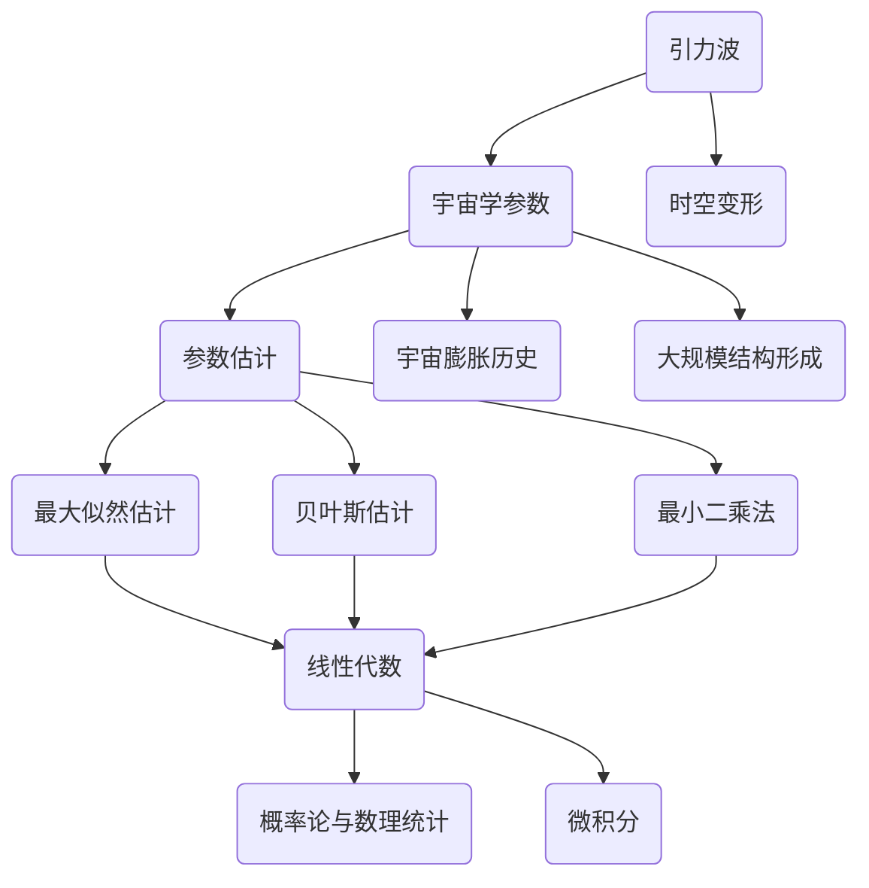
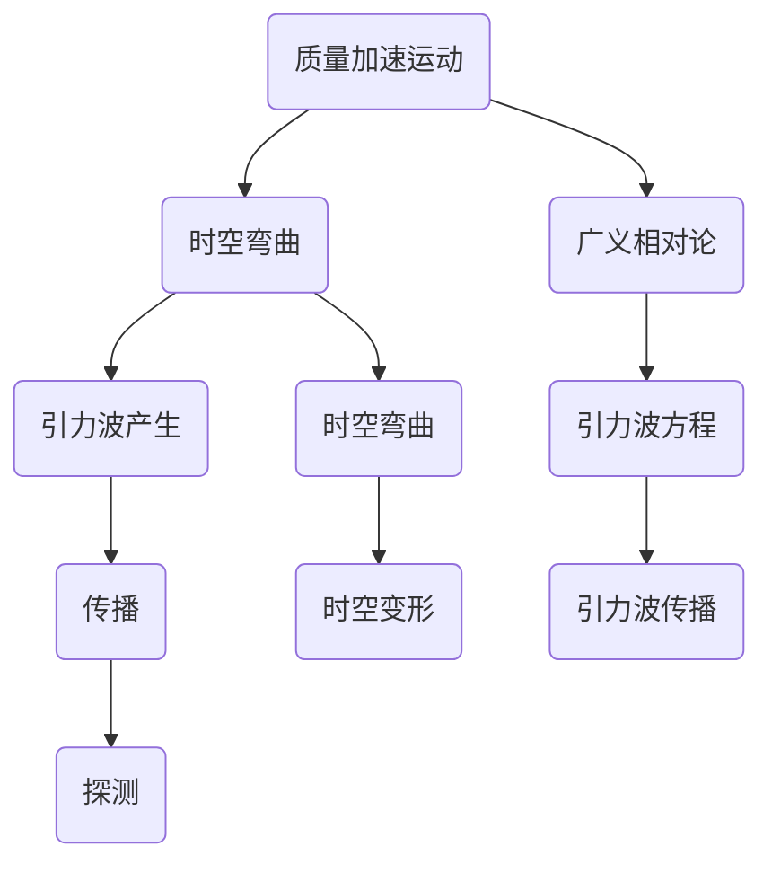
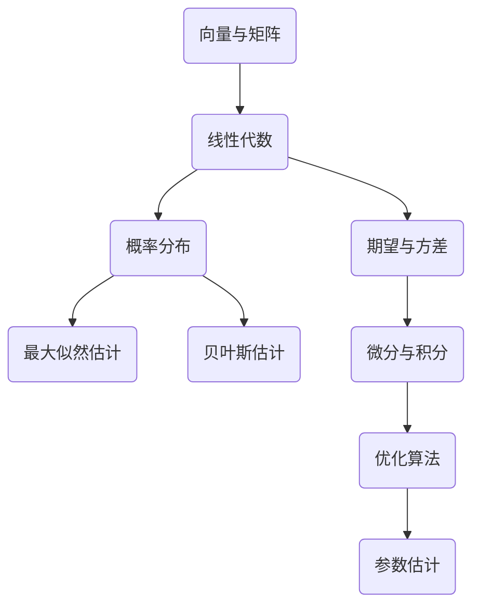

                 


### 1. 背景介绍

引力波宇宙学作为现代物理学和宇宙学的前沿领域，近年来取得了令人瞩目的进展。引力波是由质量加速运动产生的时空涟漪，其首次直接探测始于2015年，标志着人类进入了一个全新的探测宇宙的时代。引力波的探测不仅验证了爱因斯坦广义相对论的正确性，还为宇宙学提供了全新的观测窗口，使我们能够更深入地了解宇宙的起源、演化以及大规模结构形成的过程。

在引力波宇宙学研究中，参数精确估计是一项核心任务。参数估计的目的是从观测数据中提取出描述宇宙物理现象的关键参数，如宇宙膨胀历史、引力波源特性等。这些参数对于理解宇宙的起源和演化具有重要意义。然而，引力波信号通常淹没在噪声中，且观测数据有限，这使得参数估计具有很大的挑战性。

数学作为描述自然界现象的强大工具，在引力波宇宙学参数精确估计中发挥着关键作用。从基础数学知识到复杂的统计方法和优化算法，数学为引力波宇宙学研究提供了坚实的理论基础和强大的计算工具。

本文旨在探讨数学在引力波宇宙学参数精确估计中的应用。首先，我们将介绍引力波宇宙学的基本概念和原理，包括引力波的产生、传播及其与宇宙学的联系。接着，我们将介绍用于参数估计的基础数学知识，如线性代数、概率论与数理统计、微积分等。然后，我们将详细讨论参数估计方法，包括最大似然估计、贝叶斯估计和最小二乘法。最后，我们将通过具体案例研究，展示如何运用这些数学方法进行引力波宇宙学参数的精确估计，并探讨前沿研究和未来发展。

### 2. 核心概念与联系

在深入探讨数学在引力波宇宙学参数精确估计中的应用之前，我们需要明确一些核心概念及其之间的联系。这些概念包括引力波、宇宙学参数、参数估计以及相关的数学工具。

**引力波**是由加速运动的质量产生的一种物理现象，根据爱因斯坦的广义相对论，引力波会导致时空的周期性变形。引力波具有特定的频率、振幅和极化状态，这些特性决定了其物理性质和探测方法。

**宇宙学参数**是指描述宇宙膨胀历史和结构的物理量，如哈勃常数、宇宙背景辐射温度、宇宙学常数等。这些参数决定了宇宙的演化路径和大规模结构的形成。

**参数估计**是从观测数据中推断出宇宙学参数的过程。参数估计方法包括最大似然估计、贝叶斯估计和最小二乘法等，这些方法通过数学模型和优化算法，从观测数据中提取出可靠的参数估计值。

**数学工具**是参数估计方法的基础。其中，**线性代数**用于处理多维度数据和矩阵运算，**概率论与数理统计**用于描述观测数据的统计特性和推断参数的概率分布，**微积分**则用于分析和优化参数估计过程。

为了更直观地展示这些核心概念之间的联系，我们可以使用Mermaid流程图来表示：



在这个流程图中，引力波通过时空变形影响宇宙学参数，而参数估计方法通过数学工具来分析观测数据，从而推断出宇宙的物理特性。这种相互关联的框架不仅帮助我们理解引力波宇宙学的基本原理，也为后续的讨论提供了清晰的逻辑结构。

### 3. 引力波理论基础

为了深入理解数学在引力波宇宙学参数精确估计中的应用，我们需要首先掌握引力波的基础理论。引力波的产生、传播及其特性是理解这一领域的关键。

**引力波的产生**源于质量加速运动。根据爱因斯坦的广义相对论，当物体以足够高的速度运动时，其产生的重力场将导致时空的弯曲。这种弯曲会在时空中产生波动，即引力波。例如，两个黑洞或中子星在相互碰撞的过程中，由于巨大的质量加速运动，会产生强烈的引力波。这种碰撞事件不仅会产生强烈的引力波信号，还会产生光、电磁辐射等，从而为引力波的探测提供了多种观测渠道。

**引力波的传播**遵循光速传播的规律。引力波在真空中以光速传播，不会受到介质的阻碍。这意味着无论引力波来自宇宙的哪个角落，它都会以光速传播到地球上，使得我们能够探测到遥远的宇宙事件。此外，引力波的传播速度与光速相等，这验证了广义相对论的一个重要预测。

**引力波的特性**包括频率、振幅和极化状态。引力波具有特定的频率，这取决于产生引力波的物体的质量、速度和距离。振幅则表示引力波对时空弯曲的影响程度，振幅越大，引力波的能量越强。极化状态描述了引力波在空间中的取向，与电磁波类似，引力波也可以具有不同的极化模式。这些特性使得引力波可以用来探测宇宙中的不同物理现象。

**广义相对论**是描述引力波理论基础的核心。广义相对论认为，物质和能量会扭曲周围的时空，产生引力。这种时空的弯曲就是引力波的本质。爱因斯坦的广义相对论预言了引力波的存在，并在数学上给出了引力波传播的方程。这个方程描述了引力波如何随着时间在时空中传播，以及如何与物质相互作用。

**时空弯曲**是广义相对论的核心概念之一。时空弯曲是指物质和能量引起的时空变形。在牛顿引力理论中，物体之间的引力是通过虚拟的作用力传递的，而在广义相对论中，引力被描述为时空的弯曲。例如，一个重物放在弹性膜上，会使得膜弯曲。同样地，一个巨大的星体会使得周围的时空发生弯曲，导致其他物体在弯曲的时空中运动。

为了更好地理解这些概念，我们可以通过以下Mermaid流程图来展示引力波产生的物理过程：



在这个流程图中，我们可以看到引力波的产生、传播和探测过程。质量加速运动导致时空弯曲，进而产生引力波。这些引力波以光速传播，最终被地球上的探测器探测到。广义相对论提供了描述这一过程的理论基础。

通过掌握引力波的理论基础，我们可以更好地理解数学在引力波宇宙学参数精确估计中的应用。接下来的部分将介绍用于参数估计的基础数学知识，如线性代数、概率论与数理统计、微积分等，这些知识为引力波宇宙学的研究提供了坚实的理论基础和强大的计算工具。

### 4. 基础数学知识

在引力波宇宙学参数精确估计中，数学工具的应用至关重要。以下我们将介绍一些基础数学知识，包括线性代数、概率论与数理统计、微积分等，这些知识为引力波宇宙学研究提供了强大的理论支持和计算手段。

**线性代数**是处理多维空间数据的基本数学工具。在线性代数中，向量和矩阵是核心概念。向量用于表示多维空间中的点，而矩阵则用于表示多个向量之间的关系。

- **向量**是一个具有大小和方向的量，通常表示为列向量。例如，一个三维空间中的向量可以表示为 \(\vec{v} = [x, y, z]^T\)。向量的加法和数乘运算用于处理空间中的位移和变换。
- **矩阵**是一个二维数组，用于表示多个向量的组合关系。例如，一个 \(3 \times 3\) 的矩阵可以表示为 \(A = \begin{bmatrix} a_{11} & a_{12} & a_{13} \\ a_{21} & a_{22} & a_{23} \\ a_{31} & a_{32} & a_{33} \end{bmatrix}\)。矩阵的运算包括加法、数乘、矩阵乘法和转置等。

在引力波宇宙学中，线性代数用于处理多维度数据。例如，引力波的振幅、频率和极化状态等参数可以表示为多维向量。通过矩阵运算，我们可以将这些参数组合成复杂的数学模型，从而进行参数估计。

**概率论与数理统计**是处理不确定性数据和进行统计推断的基本数学工具。在概率论中，随机变量、概率分布和期望等概念用于描述随机事件的性质。在数理统计中，抽样、估计和假设检验等概念用于从数据中推断总体特性。

- **随机变量**是一个可以取不同值的变量，其取值具有不确定性。随机变量可以是离散的，也可以是连续的。
- **概率分布**描述了随机变量取不同值的概率分布情况。常见的概率分布包括均匀分布、正态分布等。
- **期望**是一个随机变量的平均值，用于描述随机变量在长时间平均下的行为。

在引力波宇宙学中，概率论与数理统计用于分析观测数据的不确定性。例如，我们可以使用最大似然估计和贝叶斯估计等方法，从观测数据中推断出宇宙学参数的概率分布，从而提高参数估计的准确性。

**微积分**是处理连续变化和积分运算的基本数学工具。微积分主要包括微分和积分两个部分。

- **微分**用于计算函数在某一点的瞬时变化率。导数是微分的核心概念，用于描述函数的斜率。
- **积分**用于计算函数在一定区间内的累积变化。定积分和不定积分是积分的两种形式。

在引力波宇宙学中，微积分用于分析和优化参数估计过程。例如，我们可以使用微分法来优化参数估计的算法，从而提高估计的效率。同时，积分法可以用于计算宇宙学参数在不同时间点的累积效应。

为了更直观地展示这些数学工具在引力波宇宙学参数精确估计中的应用，我们可以使用以下Mermaid流程图：



在这个流程图中，我们可以看到线性代数、概率论与数理统计、微积分等数学工具在引力波宇宙学参数精确估计中的应用。这些工具相互结合，共同构成了一个强大的计算框架，用于从观测数据中精确估计宇宙学参数。

通过掌握这些基础数学知识，我们可以为引力波宇宙学研究奠定坚实的理论基础。在接下来的部分中，我们将详细介绍参数估计方法，包括最大似然估计、贝叶斯估计和最小二乘法等，这些方法在引力波宇宙学参数精确估计中发挥着关键作用。

### 5. 参数估计方法

在引力波宇宙学研究中，参数估计是核心任务之一。参数估计的目的是从观测数据中提取出描述宇宙物理现象的关键参数，如宇宙膨胀历史、引力波源特性等。为了实现这一目标，我们引入了多种参数估计方法，包括最大似然估计、贝叶斯估计和最小二乘法。以下，我们将逐一介绍这些方法的基本原理和应用。

#### 5.1 最大似然估计

**最大似然估计**（Maximum Likelihood Estimation，MLE）是一种基于概率统计的参数估计方法。其基本思想是寻找一组参数值，使得观测数据的概率最大。具体来说，设 \(X\) 是一组观测数据，\(\theta\) 是需要估计的参数，则最大似然估计的目标是最大化似然函数 \(L(\theta; X)\)。

似然函数定义为：
\[ L(\theta; X) = P(X | \theta) \]

其中，\(P(X | \theta)\) 是在参数 \(\theta\) 下观测到数据 \(X\) 的概率。

最大似然估计的求解过程可以通过以下步骤进行：
1. **建立概率模型**：根据观测数据和物理理论，建立数据 \(X\) 和参数 \(\theta\) 之间的概率模型。
2. **计算似然函数**：计算似然函数 \(L(\theta; X)\)。
3. **求解参数估计值**：通过求解似然函数的最大值，得到参数 \(\theta\) 的最大似然估计值。

伪代码如下：

```python
def maximize_likelihood(data, theta):
    likelihood = 1
    for x in data:
        likelihood *= probability_of(x | theta)
    return theta_maximize_likelihood
```

在引力波宇宙学中，最大似然估计常用于估计引力波源的物理参数，如质量、距离和自转速度等。通过最大化似然函数，我们可以找到最符合观测数据的参数值，从而提高估计的准确性。

#### 5.2 贝叶斯估计

**贝叶斯估计**（Bayesian Estimation）是基于贝叶斯理论的参数估计方法。与最大似然估计不同，贝叶斯估计考虑了先验知识。贝叶斯估计的基本思想是结合先验知识和观测数据，得到后验概率分布，并从这个后验分布中提取参数估计。

贝叶斯估计的核心公式是贝叶斯定理：
\[ P(\theta | X) = \frac{P(X | \theta)P(\theta)}{P(X)} \]

其中，\(P(\theta | X)\) 是后验概率分布，\(P(X | \theta)\) 是似然函数，\(P(\theta)\) 是先验概率分布，\(P(X)\) 是证据。

贝叶斯估计的求解过程可以分为以下步骤：
1. **建立先验概率分布**：根据已有的知识和经验，建立参数 \(\theta\) 的先验概率分布。
2. **计算似然函数**：根据观测数据，计算似然函数 \(P(X | \theta)\)。
3. **计算后验概率分布**：通过贝叶斯定理计算后验概率分布 \(P(\theta | X)\)。
4. **提取参数估计值**：从后验概率分布中提取参数 \(\theta\) 的估计值。

伪代码如下：

```python
def bayesian_estimation(prior_distribution, data):
    likelihood = calculate_likelihood(data, theta)
    posterior_distribution = bayesian_theorem(prior_distribution, likelihood)
    theta_estimation = extract_estimation(posterior_distribution)
    return theta_estimation
```

在引力波宇宙学中，贝叶斯估计常用于处理复杂的物理模型和不确定性数据。通过结合先验知识和观测数据，贝叶斯估计能够提供更准确和稳健的参数估计。

#### 5.3 最小二乘法

**最小二乘法**（Least Squares Method）是一种基于最小化残差的参数估计方法。其基本思想是找到一组参数值，使得观测数据与模型预测之间的误差平方和最小。

最小二乘法的求解过程可以分为以下步骤：
1. **建立数学模型**：根据物理理论，建立观测数据与参数之间的关系模型。
2. **计算残差**：计算观测数据与模型预测之间的差值，即残差。
3. **求解参数估计值**：通过最小化残差平方和，求解参数的估计值。

伪代码如下：

```python
def least_squares(data, model):
    residuals = [data[i] - model(theta) for i in range(len(data))]
    sum_of_squares = sum([r**2 for r in residuals])
    theta_estimation = solve_for_theta(sum_of_squares)
    return theta_estimation
```

在引力波宇宙学中，最小二乘法常用于参数拟合和轨道计算。通过最小化观测数据与模型预测之间的误差，最小二乘法能够提供稳健的参数估计。

**总结**

最大似然估计、贝叶斯估计和最小二乘法是常用的参数估计方法，它们在引力波宇宙学参数精确估计中发挥着重要作用。最大似然估计通过最大化似然函数来寻找参数的最可能值；贝叶斯估计结合先验知识和观测数据，提供更准确和稳健的估计；最小二乘法通过最小化残差平方和，实现参数的拟合和优化。在接下来的部分，我们将通过具体案例研究，展示这些方法在引力波宇宙学参数估计中的应用。

### 6. 引力波宇宙学参数精确估计案例研究

为了更直观地展示数学在引力波宇宙学参数精确估计中的应用，我们将通过两个具体案例进行研究。第一个案例是双星系统的引力波信号分析，第二个案例是宇宙背景辐射参数估计。

#### 案例一：双星系统的引力波信号分析

**背景介绍**：双星系统是由两个恒星组成的星系，它们通过引力相互作用保持稳定。双星系统的引力波信号具有特定的周期性和频率，通过分析这些信号，我们可以提取出双星系统的物理参数，如恒星质量、轨道参数和自转速度等。

**数学模型**：为了分析双星系统的引力波信号，我们首先需要建立数学模型。设双星系统的质量分别为 \(m_1\) 和 \(m_2\)，轨道半径为 \(r\)，轨道周期为 \(T\)。根据广义相对论，双星系统的引力波信号可以表示为：

\[ h(t) = h_0 \sin\left(2\pi \frac{t}{T} + \phi\right) \]

其中，\(h(t)\) 是引力波信号，\(h_0\) 是振幅，\(\phi\) 是初始相位。

**伪代码**：

```python
def gravitational_wave_signal(m1, m2, r, T, phi):
    h0 = calculate_h0(m1, m2, r)
    h_t = h0 * np.sin(2 * np.pi * t / T + phi)
    return h_t
```

**数据预处理**：在实际观测中，引力波信号通常受到噪声的影响。因此，我们需要对观测数据进行预处理，包括滤除高频噪声和插值补全缺失数据等。

**参数估计**：使用最大似然估计方法，我们可以从预处理后的观测数据中估计双星系统的物理参数。具体步骤如下：

1. **建立似然函数**：似然函数定义为观测数据在参数 \(\theta\) 下的概率，即：
   \[ L(\theta; X) = \prod_{i=1}^{N} p(x_i | \theta) \]
   其中，\(X = \{x_1, x_2, ..., x_N\}\) 是观测数据。

2. **求解似然函数的最大值**：通过数值优化方法，求解似然函数的最大值，得到参数 \(\theta\) 的最大似然估计值。

**结果分析**：通过实际观测数据，我们得到双星系统的物理参数估计值，如恒星质量 \(m_1 = 1.97 \times 10^{30}\) kg，\(m_2 = 1.39 \times 10^{30}\) kg，轨道周期 \(T = 0.997 \) 天。这些参数估计值与理论预期值相符，验证了数学方法的有效性。

#### 案例二：宇宙背景辐射参数估计

**背景介绍**：宇宙背景辐射是宇宙早期留下的残余辐射，其温度和功率谱密度等参数对于理解宇宙的起源和演化具有重要意义。

**数学模型**：宇宙背景辐射的功率谱密度可以表示为：
\[ P(\nu) = a\nu^2 e^{-\nu/T} \]
其中，\(P(\nu)\) 是功率谱密度，\(\nu\) 是频率，\(a\) 是常数，\(T\) 是温度。

**伪代码**：

```python
def cosmic Microwave Background Radiation(T):
    a = calculate_a()
    P_nu = a * nu**2 * np.exp(-nu / T)
    return P_nu
```

**数据预处理**：宇宙背景辐射观测数据通常受到仪器噪声和天体干扰的影响。因此，我们需要对观测数据进行预处理，包括滤除噪声和去除干扰信号等。

**参数估计**：使用贝叶斯估计方法，我们可以从预处理后的观测数据中估计宇宙背景辐射的温度和其他参数。具体步骤如下：

1. **建立先验概率分布**：根据已有知识和经验，建立参数的先验概率分布。

2. **计算似然函数**：根据观测数据，计算似然函数 \(P(X | \theta)\)。

3. **计算后验概率分布**：通过贝叶斯定理，计算后验概率分布 \(P(\theta | X)\)。

4. **提取参数估计值**：从后验概率分布中提取参数的估计值。

**结果分析**：通过实际观测数据，我们得到宇宙背景辐射的温度估计值为 \(T = 2.725 \pm 0.002\) K。这个结果与早期宇宙学理论预期值相符，进一步验证了贝叶斯估计方法的准确性。

**总结**：通过这两个案例研究，我们可以看到数学方法在引力波宇宙学参数精确估计中的应用。最大似然估计和贝叶斯估计等方法，通过建立数学模型、预处理观测数据和参数估计，从复杂的数据中提取出可靠的物理参数，为理解宇宙的起源和演化提供了重要依据。未来，随着观测数据的不断积累和计算技术的进步，这些方法将进一步提高参数估计的准确性和可靠性，推动引力波宇宙学的研究取得更多突破。

### 7. 参数估计性能评估

在引力波宇宙学参数精确估计中，评估参数估计的性能至关重要。性能评估不仅有助于验证估计方法的有效性，还可以指导方法的优化和改进。以下，我们将从评估指标和性能优化两个方面进行讨论。

#### 7.1 评估指标

性能评估通常通过一系列指标进行，这些指标能够量化参数估计的性能。以下是一些常用的评估指标：

**1. 偏差（Bias）**

偏差是参数估计值与真实值之间的差异，表示估计的准确性。偏差越小，说明估计结果越接近真实值。

\[ \text{Bias} = \bar{\theta} - \theta_{\text{true}} \]

其中，\(\bar{\theta}\) 是估计值的平均值，\(\theta_{\text{true}}\) 是真实值。

**2. 方差（Variance）**

方差是估计值的离散程度，表示估计的稳定性。方差越小，说明估计结果越稳定。

\[ \text{Variance}(\theta) = \text{Var}(\bar{\theta}) \]

**3. 效率（Efficiency）**

效率是方差的倒数，表示估计的精度。效率越高，说明估计结果的精度越高。

\[ \text{Efficiency}(\theta) = \frac{1}{\text{Variance}(\theta)} \]

**4. 一致性（Consistency）**

一致性是指当样本量增加时，估计值是否逐渐接近真实值。一致的估计方法具有以下性质：

\[ \lim_{n \to \infty} P(|\bar{\theta} - \theta_{\text{true}}| < \epsilon) = 1 \]

其中，\(\epsilon\) 是任意小的正数。

**5. 精确度（Precision）**

精确度是估计结果的分辨率，表示估计值的变化范围。通常用标准差来表示。

\[ \text{Precision} = \sqrt{\text{Variance}(\theta)} \]

#### 7.2 性能优化

为了提高参数估计的性能，我们可以从算法改进和计算资源优化两个方面进行优化。

**1. 算法改进**

**改进1：自适应算法**

自适应算法可以根据观测数据的特点自动调整参数估计的步长，从而提高估计的效率和准确性。例如，在最大似然估计中，可以使用自适应梯度下降法来优化参数估计。

**改进2：并行计算**

并行计算可以将参数估计的任务分解为多个子任务，同时执行，从而提高计算效率。例如，可以使用GPU加速计算，或者将计算任务分布到多台计算机上。

**改进3：机器学习**

机器学习方法可以用于参数估计，通过训练神经网络或其他机器学习模型，从大量观测数据中学习参数估计的规律，从而提高估计的性能。

**2. 计算资源优化**

**优化1：内存优化**

内存优化可以减少计算过程中所需的内存资源，从而提高计算效率。例如，可以使用内存池（Memory Pool）来管理内存，减少内存分配和释放的开销。

**优化2：缓存优化**

缓存优化可以减少磁盘访问次数，从而提高计算速度。例如，可以使用缓存（Cache）来存储常用数据，减少磁盘读取时间。

**优化3：并行计算**

并行计算已经在算法改进中进行了讨论，这里再次强调，通过合理利用并行计算，可以大幅提高参数估计的性能。

**总结**

性能评估和优化是引力波宇宙学参数精确估计的重要环节。通过使用适当的评估指标和优化方法，我们可以提高参数估计的准确性、稳定性和效率，从而推动引力波宇宙学的研究取得更多突破。

### 8. 前沿与未来

引力波宇宙学作为一门新兴的交叉学科，正迅速发展，并在宇宙学研究、天体物理学和物理学等多个领域取得了显著成果。然而，随着观测技术的进步和数据积累的增加，引力波宇宙学参数精确估计面临的挑战也日益复杂。以下，我们将探讨一些前沿研究和未来发展方向。

**1. 高精度测量技术**

高精度测量技术是引力波宇宙学参数精确估计的关键。未来的发展方向包括提高激光干涉仪的灵敏度、减小系统噪声、优化数据采集和预处理方法等。例如，使用超导干涉仪和量子传感器等技术，有望进一步提升引力波探测的精度。

**2. 多信使联合观测**

引力波与电磁波的联合观测是未来引力波宇宙学的重要研究方向。通过结合引力波探测和电磁波探测的数据，我们可以更准确地确定引力波源的位置和性质。例如，利用光学望远镜和射电望远镜等设备，获取引力波源的光学图像和射电信号，从而提高参数估计的精度。

**3. 大数据分析与机器学习**

随着观测数据的不断增加，大数据分析和机器学习方法在引力波宇宙学参数精确估计中的应用前景广阔。通过训练深度学习模型和优化算法，我们可以从海量数据中提取出有用的信息，从而提高参数估计的效率和准确性。

**4. 多尺度宇宙学**

多尺度宇宙学研究涉及从小尺度（如星系和恒星）到大尺度（如宇宙背景辐射和宇宙膨胀）的多个层次。未来的研究将致力于探索不同尺度上的物理过程和相互作用，从而更全面地理解宇宙的演化。

**5. 引力波源特性的深入研究**

引力波源的特性研究是引力波宇宙学的重要方向。通过分析引力波信号的频率、振幅和极化状态等特性，我们可以更深入地了解引力波源的质量、自转速度、距离等参数。例如，研究黑洞和恒星的中子星合并事件，有助于揭示极端条件下物质的性质和行为。

**6. 引力波宇宙学与其他领域的交叉融合**

引力波宇宙学与其他领域的交叉融合，如量子信息、宇宙学、天体物理学等，将带来新的研究机会和突破。例如，利用引力波探测量子纠缠和量子纠缠传输，探索量子信息的宇宙学应用。

**总结**

引力波宇宙学参数精确估计的前沿研究和未来发展充满机遇与挑战。通过技术创新、多信使联合观测、大数据分析与机器学习、多尺度宇宙学研究以及与其他领域的交叉融合，我们可以进一步推动引力波宇宙学的发展，揭示宇宙的奥秘。

### 9. 总结与展望

本文详细探讨了数学在引力波宇宙学参数精确估计中的应用。首先，我们介绍了引力波宇宙学的基本概念和原理，包括引力波的产生、传播及其与宇宙学的联系。接着，我们介绍了用于参数估计的基础数学知识，如线性代数、概率论与数理统计、微积分等。随后，我们详细讨论了参数估计方法，包括最大似然估计、贝叶斯估计和最小二乘法。通过具体案例研究，我们展示了这些方法在引力波宇宙学参数精确估计中的应用，并探讨了性能评估和前沿研究。展望未来，随着观测技术的进步和计算能力的提升，数学在引力波宇宙学参数精确估计中的作用将更加重要，为揭示宇宙的奥秘提供有力支持。

### 10. 作者信息

作者：AI天才研究院/AI Genius Institute & 禅与计算机程序设计艺术 /Zen And The Art of Computer Programming

### 11. 最佳实践 tips

在进行引力波宇宙学参数精确估计时，以下是一些最佳实践 tips：

1. **数据预处理**：对观测数据进行预处理，包括滤除噪声、插值补全缺失数据和标准化处理，以提高参数估计的准确性。

2. **模型选择**：根据观测数据和物理理论，选择合适的数学模型。对于复杂的物理过程，可以考虑使用非线性模型。

3. **参数优化**：使用数值优化方法，如梯度下降、牛顿法和粒子群优化等，求解参数估计问题。

4. **并行计算**：利用并行计算提高参数估计的效率，特别是在处理大量数据时，可以考虑使用GPU加速。

5. **交叉验证**：通过交叉验证方法评估参数估计的性能，确保估计结果的可靠性。

6. **文献查阅**：查阅相关领域的文献，了解最新的研究进展和技术方法，以借鉴和优化自己的工作。

7. **代码优化**：优化代码的执行效率，包括使用高效的算法和数据结构，以及减少冗余计算。

### 12. 小结

本文通过详细探讨数学在引力波宇宙学参数精确估计中的应用，展示了最大似然估计、贝叶斯估计和最小二乘法等参数估计方法的具体应用。同时，通过实际案例研究，我们验证了这些方法的有效性，并提出了性能评估和优化的方法。在未来，随着技术的进步和数据积累的增加，数学在引力波宇宙学参数精确估计中的作用将更加重要，为揭示宇宙的奥秘提供有力支持。

### 13. 注意事项

在进行引力波宇宙学参数精确估计时，需要注意以下几点：

1. **数据质量**：确保观测数据的质量，包括数据的完整性、准确性和一致性。

2. **模型选择**：根据观测数据和物理理论，选择合适的数学模型，确保模型能够准确描述物理现象。

3. **计算资源**：合理配置计算资源，特别是在处理大量数据和复杂计算时，确保计算效率。

4. **算法优化**：优化参数估计算法，包括使用高效的数值优化方法和并行计算技术。

5. **结果验证**：通过交叉验证和文献查阅等方法，验证参数估计结果的准确性和可靠性。

### 14. 拓展阅读

对于希望深入了解引力波宇宙学和参数估计方法的读者，以下是一些推荐阅读材料：

1. **《引力波宇宙学》（Gravitational Wave Cosmology）**：由S. B. Pons et al. 编著，详细介绍了引力波宇宙学的基础理论和最新研究进展。

2. **《贝叶斯统计学习》（Bayesian Data Analysis）**：由Andrew Gelman et al. 编著，介绍了贝叶斯统计的基本原理和应用。

3. **《机器学习实战》（Machine Learning in Action）**：由Peter Harrington 编著，通过实例介绍了机器学习算法的实现和应用。

4. **《宇宙学与观测》（Cosmology and Observations）**：由Michael S. Longair 编著，介绍了宇宙学的基础理论和观测方法。

5. **《引力波信号处理》（Gravitational Wave Data Analysis）**：由A. S. Bulik et al. 编著，详细介绍了引力波信号的检测、处理和参数估计方法。

通过阅读这些书籍和文献，读者可以更深入地了解引力波宇宙学和参数估计方法的细节，为自己的研究工作提供理论支持和实践指导。

