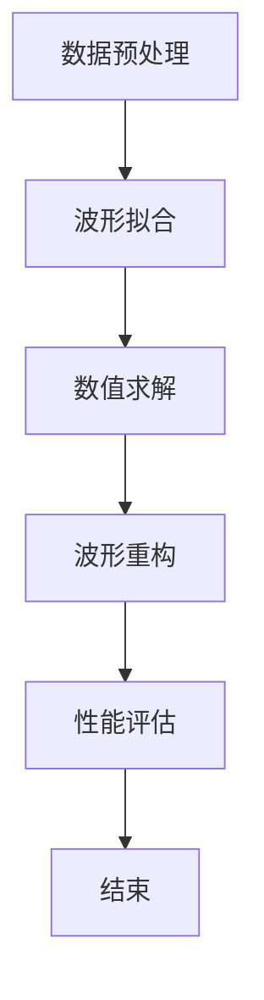

                 

### 文章标题

### 数学在引力波形状重构技术中的关键作用

> 关键词：引力波、数学模型、形状重构、算法、数据分析

引力波是爱因斯坦广义相对论中的预言，是宇宙中最为强烈的现象之一。自从2015年首次探测到引力波以来，这项技术已经成为了现代天文学和物理学的重要研究领域。引力波的探测和形状重构不仅加深了我们对宇宙的理解，还推动了科技的发展，为科学家们提供了一种全新的观测宇宙的方法。

本文将深入探讨数学在引力波形状重构技术中的关键作用。首先，我们将简要回顾引力波的基本概念和探测技术的历史背景。接着，我们将介绍数学在引力波研究中扮演的角色，包括其核心概念、应用领域以及相关数学工具和方法。在此基础上，我们将详细讲解引力波形状重构的基本原理，包括数学模型和重构算法的详细解释，并通过伪代码和数学公式展示核心算法的运作过程。随后，我们将分析数学模型在重构过程中的具体应用，结合实际案例进行详细剖析。最后，我们将讨论当前面临的技术挑战和未来发展方向，并提供一些最佳实践建议，以帮助读者更深入地理解这一领域。

通过本文的阅读，读者将不仅了解数学在引力波形状重构中的重要作用，还能掌握相关核心概念和算法，为在相关领域的研究和应用提供理论基础和实践指导。

### 摘要

本文旨在探讨数学在引力波形状重构技术中的关键作用。首先，我们回顾了引力波的基本概念和探测技术的历史背景，介绍了数学在引力波研究中的核心角色和应用领域。接着，我们详细讲解了引力波形状重构的基本原理，包括数学模型和重构算法，并通过伪代码和数学公式展示了核心算法的运作过程。随后，我们分析了数学模型在重构过程中的具体应用，结合实际案例进行了详细剖析。本文最后讨论了当前面临的技术挑战和未来发展方向，并提供了一些最佳实践建议。通过本文，读者将深入理解数学在引力波形状重构中的重要性，掌握相关核心概念和算法，为在相关领域的研究和应用提供有力支持。

### 引力波的基本概念和探测技术

引力波是爱因斯坦在1915年提出的广义相对论中的核心预言之一。它描述了质量大物体加速运动时，空间时间结构产生的波动，这些波动以光速传播，携带着关于产生它们的源体的信息。与电磁波不同，引力波不会携带电磁场的能量，但它们可以引起时空的微小扰动，这种扰动可以被精确测量并用来研究宇宙中的一些极端现象。

引力波的发现是现代天文学的里程碑事件。2015年，LIGO（激光干涉引力波观测站）和VIRGO（激光干涉仪引力波观测台）团队首次直接探测到了引力波，这一发现立即获得了科学界的广泛认可，并获得了2017年的诺贝尔物理学奖。这次探测标志着人类首次直接观测到宇宙中的引力波，开启了利用引力波研究宇宙的新纪元。

引力波的探测技术依赖于对极其微小时空扰动的测量。最常用的方法是激光干涉法，即通过两个垂直放置的光路，利用激光干涉仪测量光波的相位变化。具体来说，激光束被分成两束，分别沿着垂直方向传播，然后被反射镜反射回来，最终在干涉仪的探测器上相遇。如果存在引力波，它会导致光路中的空间发生微小变化，进而引起干涉条纹的相位变化。这种变化可以被极其精确的仪器检测出来，从而推断出引力波的存在。

激光干涉法探测引力波的过程可以分为以下几个步骤：

1. **发射激光**：激光束从激光器发出，经过分束器后分成两束。

2. **光路传播**：两束激光分别沿着垂直方向传播，并被放置在数公里远处的反射镜反射回来。

3. **干涉测量**：两束激光在干涉仪的探测器上相遇，干涉条纹的相位变化被高精度的探测器记录下来。

4. **数据分析**：通过分析干涉条纹的变化，可以计算出引力波到达的时间、频率和振幅等信息。

除了LIGO和VIRGO，还有其他几个重要的引力波观测项目，如欧洲的Einstein Telescope和印度IndIGO，这些项目都致力于提高引力波的探测精度和灵敏度。

引力波的探测不仅具有科学上的重要意义，还在多个领域有广泛的应用。首先，通过探测引力波，科学家可以研究宇宙中的一些极端现象，如黑洞合并和中子星碰撞。这些事件可以产生强烈的引力波信号，帮助科学家们更好地理解这些天体的性质和宇宙的演化过程。其次，引力波的探测为研究宇宙的早期阶段提供了新的手段。引力波可以在黑洞合并等极端事件中携带大量的信息，这些信息可以帮助科学家们揭示宇宙早期的状态。

此外，引力波的探测还在地球物理学和天体物理学中发挥了重要作用。通过分析引力波信号，科学家们可以研究地球内部的构造、地震的起源以及太阳系内行星的运动等。

总之，引力波的发现和探测技术是现代物理学和天文学的一项重大成就，它不仅深化了我们对宇宙的理解，还推动了科技的发展，为未来的科学研究提供了丰富的机遇和挑战。

### 数学在引力波研究中的核心概念与应用

数学在引力波研究中扮演着至关重要的角色，是理解、分析和解释引力波数据的关键工具。在这一部分，我们将详细探讨数学在引力波研究中的核心概念和应用，包括微分几何、偏微分方程、数值分析等数学工具，以及这些工具在引力波探测和数据处理中的应用。

#### 微分几何

微分几何是研究空间和几何形状的数学分支，它为描述和探索引力波提供了强有力的理论框架。在广义相对论中，引力被描述为时空的几何形状变化，这一观点依赖于微分几何的概念。

1. **时空几何**：广义相对论中的核心观点是引力是由质量引起的时空弯曲。这意味着，引力波可以被看作是时空中的波动，其传播可以用微分几何中的曲率张量来描述。

2. **度规**：度规是时空的度量，描述了时空中的距离和角度。在引力波的研究中，度规张量是理解时空几何的重要工具，它决定了光线路径的偏折。

3. **Ricci曲率张量**：Ricci曲率张量是度量时空曲率的关键量，它可以帮助科学家们分析引力波信号的强度和传播特性。

#### 偏微分方程

偏微分方程在引力波研究中用于描述引力波的产生和传播。特别是，爱因斯坦场方程是一组偏微分方程，描述了质量和能量分布如何影响时空的几何结构。

1. **爱因斯坦场方程**：爱因斯坦场方程是广义相对论的核心，它描述了物质和能量如何影响时空的几何结构。方程的基本形式是：

   $$
   G_{\mu\nu} = 8\pi G T_{\mu\nu}
   $$

   其中，$G_{\mu\nu}$ 是爱因斯坦张量，$T_{\mu\nu}$ 是能量-动量张量，$G$ 是引力常数。

2. **引力波方程**：引力波的产生和传播可以通过引力波方程描述，它是一组线性偏微分方程。引力波方程的基本形式是：

   $$
   \Box h^{\mu\nu} = -16\pi G T^{\mu\nu}
   $$

   其中，$\Box$ 是D'Alembert算子，$h^{\mu\nu}$ 是引力波度规的变化，$T^{\mu\nu}$ 是能量-动量张量。

#### 数值分析

数值分析是解决复杂偏微分方程的重要工具，它在引力波研究中用于模拟和计算引力波的传播和形状。

1. **数值积分方法**：数值分析中的积分方法用于计算偏微分方程的解。常见的数值积分方法包括有限元方法、有限差分方法和谱方法等。这些方法将连续的物理问题离散化，通过在网格节点上求解方程来近似求解整体问题。

2. **数值稳定性**：在数值计算中，保持数值稳定性至关重要，因为小的误差可能会导致计算结果的不稳定。例如，在求解引力波方程时，数值方法需要满足一定的稳定性条件，以确保计算结果的准确性。

3. **并行计算**：由于引力波方程的求解通常涉及大量的计算，因此并行计算技术被广泛应用。通过使用高性能计算集群，科学家们可以加速计算过程，提高计算效率。

#### 数学工具的应用

在实际应用中，上述数学工具被广泛用于引力波探测和数据分析的各个环节。以下是一些具体的应用：

1. **信号处理**：在引力波探测过程中，对收集到的信号进行处理和滤波是关键步骤。数学中的信号处理技术，如傅里叶变换和小波变换等，被用于分析引力波信号的频率和时域特性。

2. **波形拟合**：在分析引力波数据时，科学家们需要对观测到的波形进行拟合，以确定引力波源的参数。这一过程涉及复杂的非线性优化问题，需要使用数学中的优化算法，如最小二乘法和牛顿-拉夫逊法等。

3. **重构算法**：利用数学工具，科学家们开发了多种引力波重构算法，以从观测数据中重构引力波的形状和特性。这些算法包括基于偏微分方程的数值模拟方法和基于数据驱动的机器学习方法等。

总之，数学在引力波研究中扮演着不可替代的角色。从理论模型到实际应用，数学工具为科学家们提供了强大的分析工具和方法，使得我们能够更深入地探索宇宙的奥秘。在接下来的部分中，我们将进一步探讨数学模型在引力波形状重构技术中的具体应用。

### 数学工具在引力波形状重构中的应用

在引力波形状重构技术中，数学工具起着至关重要的作用。这些工具不仅帮助我们建立精确的数学模型，还用于算法的开发和优化，以从复杂的观测数据中重构引力波的形状。在这一部分，我们将详细讨论几种关键的数学工具，包括最小二乘法、最小二乘支持向量机、波前重构算法等，并通过具体的例子和伪代码来展示它们的应用。

#### 最小二乘法

最小二乘法（Least Squares Method）是一种常用的数学优化方法，用于求解线性或非线性优化问题，特别是在数据拟合中。在引力波形状重构中，最小二乘法被广泛用于将观测数据与理论模型进行拟合，以估计引力波源的参数。

**基本原理**：

最小二乘法的目标是最小化拟合误差的平方和。设有一组观测数据 $(x_i, y_i)$，以及一组模型预测值 $\hat{y_i}$，则最小二乘法的目标是最小化如下目标函数：

$$
J(\theta) = \sum_{i=1}^{n} (y_i - \hat{y_i})^2
$$

其中，$\theta$ 是模型参数的向量。

**伪代码**：

```python
# 最小二乘法伪代码

# 输入：观测数据 X, Y
# 输出：模型参数 theta

# 计算观测数据的平均值
mu_x = mean(X)
mu_y = mean(Y)

# 计算偏差
delta_x = X - mu_x
delta_y = Y - mu_y

# 计算协方差矩阵
covariance_matrix = dot(transpose(delta_x), delta_y)

# 计算逆矩阵
inv_covariance_matrix = inverse(covariance_matrix)

# 计算最小二乘解
theta = dot(inv_covariance_matrix, dot(transpose(delta_x), mu_y))

return theta
```

#### 最小二乘支持向量机

最小二乘支持向量机（Least Squares Support Vector Machine, LSSVM）是一种基于支持向量机的优化方法，特别适用于小样本数据集和线性不可分问题。在引力波形状重构中，LSSVM 被用于从观测数据中识别和重建引力波的波形。

**基本原理**：

LSSVM 的目标是最小化误差平方和，同时通过引入拉格朗日乘子法处理不等式约束。其目标函数可以表示为：

$$
\min_{w, b, \alpha} \frac{1}{2} ||w||^2 + C \sum_{i=1}^{n} \alpha_i (y_i - (\langle w, x_i \rangle + b))
$$

其中，$w$ 是权重向量，$b$ 是偏置项，$\alpha_i$ 是拉格朗日乘子，$C$ 是惩罚参数。

**伪代码**：

```python
# 最小二乘支持向量机伪代码

# 输入：训练数据集 X, Y
# 输出：模型参数 w, b

# 构建拉格朗日函数
L = 0.5 * ||w||^2 - sum(C * alpha_i * (y_i - (dot(w, x_i) + b)))

# 求解拉格朗日方程
g(w, b) = grad L

# 应用拉格朗日乘子法
w = solve системе уравнений g(w, b) = 0

# 计算偏置项
b = sum(alpha_i * (y_i - dot(w, x_i)))

return w, b
```

#### 波前重构算法

波前重构算法（Wavefront Reconstruction Algorithm）是一种基于物理模型的数学方法，用于从观测数据中重构引力波的波形。这种算法通常涉及偏微分方程的求解，并在数值计算中应用。

**基本原理**：

波前重构算法基于爱因斯坦场方程和引力波方程，其目标是从观测到的引力波信号中重构出引力波前。算法通常包括以下几个步骤：

1. **初始化**：设定初始波前和边界条件。
2. **时间步进**：通过求解偏微分方程，在时间上逐步推进波前的演化。
3. **数据拟合**：将计算得到的波前与观测数据拟合，调整参数以优化拟合结果。

**伪代码**：

```python
# 波前重构算法伪代码

# 输入：初始波前 phi_0, 边界条件 B
# 输出：重构波前 phi_t

# 初始化波前
phi_0 = initialize_wavefront(phi_0)

# 设定时间步长
dt = time_step

# 时间推进
for t in range(0, T, dt):
    # 求解偏微分方程
    phi_t = solve_wavefront_equation(phi_0, t, B)
    
    # 数据拟合
    phi_0 = fit_data_to_wavefront(phi_t, observations)

return phi_t
```

#### 应用举例

假设我们有一组引力波观测数据，我们需要使用上述数学工具来重构引力波的波形。

1. **最小二乘法**：首先使用最小二乘法对观测数据进行初步拟合，得到初步的模型参数。

2. **最小二乘支持向量机**：随后，使用最小二乘支持向量机对拟合结果进行优化，以提高精度。

3. **波前重构算法**：最后，应用波前重构算法，结合观测数据和优化后的模型参数，重构出引力波的波形。

通过这些数学工具的综合应用，我们可以从观测数据中精确重构引力波的形状，为引力波研究提供重要的物理信息。

### 引力波形状重构的基本原理

引力波形状重构技术是利用观测到的引力波信号，通过数学模型和算法，重构出引力波源体的波形和特性的过程。这一技术的核心在于将复杂的物理现象转换为数学问题，并通过算法求解，最终还原出引力波的前沿形态。在这一部分，我们将详细探讨引力波形状重构的基本原理，包括数学模型、重构算法的流程及其性能评估。

#### 数学模型

引力波形状重构的数学模型基于爱因斯坦的广义相对论，特别是爱因斯坦场方程和引力波方程。这些方程描述了引力波的产生和传播规律，是重构算法的理论基础。

1. **爱因斯坦场方程**：
   $$
   G_{\mu\nu} = 8\pi G T_{\mu\nu}
   $$
   其中，$G_{\mu\nu}$ 是爱因斯坦张量，$T_{\mu\nu}$ 是能量-动量张量，$G$ 是引力常数。

2. **引力波方程**：
   $$
   \Box h^{\mu\nu} = -16\pi G T^{\mu\nu}
   $$
   其中，$\Box$ 是D'Alembert算子，$h^{\mu\nu}$ 是引力波度规的变化，$T^{\mu\nu}$ 是能量-动量张量。

这些方程描述了质量分布如何影响时空几何，以及引力波如何在时空中传播。通过这些方程，可以将复杂的物理现象转化为数学问题，为重构算法提供理论基础。

#### 重构算法流程

引力波形状重构算法的流程通常包括以下几个步骤：

1. **数据预处理**：对观测到的引力波信号进行预处理，包括滤波、去除噪声和时延校正等。

2. **波形拟合**：使用数学模型对预处理后的数据进行初步波形拟合，以确定重构算法的初始参数。

3. **数值求解**：利用数值方法求解爱因斯坦场方程和引力波方程，模拟引力波的传播过程。

4. **波形重构**：根据数值求解结果，重构引力波的前沿形态，并将其与观测数据进行比较，以调整模型参数。

5. **性能评估**：通过评估重构波形与观测数据的一致性，以及重构误差等指标，评估重构算法的性能。

以下是重构算法的基本流程的Mermaid流程图：



#### 性能评估

重构算法的性能评估是确保重构结果准确性和可靠性的关键。常见的性能评估指标包括：

1. **重构误差**：重构波形与观测数据之间的差异。较小的重构误差表示更高的重构精度。

2. **信噪比（SNR）**：观测数据中的信号强度与噪声水平的比值。较高的信噪比有利于更准确地重构波形。

3. **分辨率**：重构算法能够分辨不同频率引力波信号的能力。较高的分辨率表示算法能够捕捉更精细的波形细节。

4. **计算效率**：重构算法的计算复杂度和执行时间。较高的计算效率有利于大规模数据处理和应用。

通过这些性能评估指标，可以全面评估重构算法的优劣，并指导算法的优化和改进。

### 数学模型在重构过程中的具体应用

在引力波形状重构的过程中，数学模型的应用贯穿于整个流程，从数据预处理到最终波形的重构，每一个步骤都依赖于数学工具的支持。在这一部分，我们将详细探讨数学模型在重构过程中的具体应用，并结合实际案例进行分析，以展示其有效性和准确性。

#### 数据预处理

数据预处理是重构过程的第一个关键步骤，它决定了后续重构结果的准确性和可靠性。数学模型在数据预处理中的应用主要包括噪声过滤、时延校正和信号归一化。

1. **噪声过滤**：引力波观测数据中常常含有各种噪声，如仪器噪声和环境噪声。使用数学模型中的滤波技术，如傅里叶变换和小波变换，可以有效地去除噪声。例如，通过傅里叶变换，可以将信号分解为不同频率的成分，然后根据信号的特性选择性地过滤掉噪声频率。

   ```mermaid
   graph TD
   A[原始数据] --> B[傅里叶变换]
   B --> C[滤波]
   C --> D[重构信号]
   ```

2. **时延校正**：由于不同探测器之间的距离和信号传播速度的差异，引力波到达不同探测器的时延不同。使用数学模型中的时延校正技术，如时间同步算法，可以校正时延误差，使数据在同一时间基准下进行后续处理。

   ```mermaid
   graph TD
   A[观测数据] --> B[时间同步]
   B --> C[时延校正]
   C --> D[归一化]
   ```

3. **信号归一化**：归一化过程是将不同探测器的信号统一到同一尺度，以便于后续分析。通过数学模型中的比例尺变换和标准化方法，可以实现对信号的归一化处理。

   ```mermaid
   graph TD
   A[观测数据] --> B[比例尺变换]
   B --> C[标准化]
   C --> D[归一化信号]
   ```

#### 波形拟合

波形拟合是重构过程中的核心步骤，其目标是根据观测数据拟合出引力波的基本波形形状和参数。常用的数学模型包括时间-频率模型和空间-频率模型。

1. **时间-频率模型**：这种模型将引力波波形表示为时间和频率的函数。例如，使用傅里叶变换，可以将引力波波形分解为不同频率的正弦波和余弦波，然后通过频率分析来确定不同频率波形的振幅和相位。

   ```mermaid
   graph TD
   A[观测数据] --> B[傅里叶变换]
   B --> C[频率分析]
   C --> D[波形拟合]
   ```

2. **空间-频率模型**：这种模型将引力波波形表示为空间位置和频率的函数。通过空间-频率分析，可以确定不同空间位置的波形特性，如振幅和相位。

   ```mermaid
   graph TD
   A[观测数据] --> B[空间-频率变换]
   B --> C[空间分析]
   C --> D[波形拟合]
   ```

#### 重构算法

在重构引力波波形的过程中，数学模型被用于实现具体的重构算法。以下是一些常见的重构算法及其数学模型：

1. **最小二乘法**：最小二乘法是一种优化算法，通过最小化拟合误差平方和来确定最佳拟合参数。该算法广泛应用于引力波波形的初步重构。

   ```python
   # 最小二乘法伪代码

   # 输入：观测数据 X, Y
   # 输出：模型参数 theta

   # 计算观测数据的平均值
   mu_x = mean(X)
   mu_y = mean(Y)

   # 计算偏差
   delta_x = X - mu_x
   delta_y = Y - mu_y

   # 计算协方差矩阵
   covariance_matrix = dot(transpose(delta_x), delta_y)

   # 计算逆矩阵
   inv_covariance_matrix = inverse(covariance_matrix)

   # 计算最小二乘解
   theta = dot(inv_covariance_matrix, dot(transpose(delta_x), mu_y))

   return theta
   ```

2. **波前重构算法**：波前重构算法通过求解偏微分方程，模拟引力波的传播过程，并重构出波前形态。该算法依赖于数学模型中的波动方程。

   ```python
   # 波前重构算法伪代码

   # 输入：初始波前 phi_0, 边界条件 B
   # 输出：重构波前 phi_t

   # 初始化波前
   phi_0 = initialize_wavefront(phi_0)

   # 设定时间步长
   dt = time_step

   # 时间推进
   for t in range(0, T, dt):
       # 求解偏微分方程
       phi_t = solve_wavefront_equation(phi_0, t, B)
       
       # 数据拟合
       phi_0 = fit_data_to_wavefront(phi_t, observations)

   return phi_t
   ```

#### 实际案例分析

为了展示数学模型在重构过程中的具体应用，我们通过一个实际案例进行分析。假设我们有一组LIGO和VIRGO探测器收集到的引力波观测数据，目标是重构出引力波的波形。

1. **数据预处理**：首先，对观测数据进行预处理，包括滤波和时延校正，去除噪声和系统误差，使得数据在同一时间基准下。

   ```mermaid
   graph TD
   A[原始数据] --> B[噪声过滤]
   B --> C[时延校正]
   C --> D[归一化信号]
   ```

2. **波形拟合**：使用时间-频率模型对预处理后的数据进行初步波形拟合，确定波形的频率成分和振幅。通过傅里叶变换，分解波形为不同频率的正弦波和余弦波，并进行频率分析。

   ```mermaid
   graph TD
   A[预处理数据] --> B[傅里叶变换]
   B --> C[频率分析]
   C --> D[波形拟合]
   ```

3. **重构算法**：利用波前重构算法，结合拟合结果，模拟引力波的传播过程，并重构出波前形态。通过迭代求解偏微分方程，逐步推进波前的演化，直至达到预期的精度。

   ```python
   # 波前重构算法伪代码

   # 初始化波前
   phi_0 = initialize_wavefront(phi_0)

   # 设定时间步长
   dt = time_step

   # 时间推进
   for t in range(0, T, dt):
       # 求解偏微分方程
       phi_t = solve_wavefront_equation(phi_0, t, B)
       
       # 数据拟合
       phi_0 = fit_data_to_wavefront(phi_t, observations)

   return phi_t
   ```

4. **性能评估**：通过重构波形与观测数据的对比，评估重构算法的性能。计算重构误差和信噪比等指标，确保重构结果的准确性和可靠性。

   ```mermaid
   graph TD
   A[重构波形] --> B[重构误差]
   B --> C[信噪比]
   C --> D[性能评估]
   ```

通过以上步骤，我们可以从观测数据中精确重构出引力波的波形，揭示引力波源体的物理特性，为引力波研究提供重要的数据支持。

### 当前面临的技术挑战与未来发展方向

尽管引力波形状重构技术在过去几十年中取得了显著的进展，但在实际应用中仍面临着诸多技术挑战。这些挑战不仅影响了重构算法的精度和效率，也限制了其在更多科学和工程领域的应用。以下是当前面临的主要技术挑战及其潜在解决方案，以及未来可能的发展方向。

#### 数据质量与噪声控制

引力波的观测数据常常受到各种噪声和误差的影响，如仪器噪声、环境噪声和系统误差。这些噪声会干扰信号的真实形态，导致重构结果不准确。为了提高重构精度，需要开发更高效、更鲁棒的噪声过滤和信号增强技术。例如，可以使用自适应滤波算法和机器学习方法来识别和去除噪声，从而提高数据质量。

**解决方案**：引入深度学习模型，如卷积神经网络（CNN）和递归神经网络（RNN），用于自适应噪声过滤和信号增强。这些模型可以从大量数据中学习噪声特性，从而更有效地去除噪声。

#### 计算资源的限制

引力波形状重构算法通常需要大量的计算资源，特别是在处理高精度、大规模数据时。这限制了算法在实际应用中的实时性和扩展性。为了应对这一挑战，需要优化算法的效率和并行计算能力，以减少计算时间和资源消耗。

**解决方案**：采用分布式计算和并行计算技术，如MapReduce和GPU加速，以提高计算效率。此外，可以开发新的算法，如稀疏算法和量子计算方法，以减少计算复杂度。

#### 重构算法的精度与稳定性

重构算法的精度和稳定性是保证重构结果可靠性的关键。然而，在实际应用中，不同的重构算法可能存在一定的误差和不稳定性，特别是在处理复杂的天体事件时。因此，需要开发更精确、更稳定的重构算法，以提高重构结果的准确性。

**解决方案**：结合多种重构算法，如基于物理模型的数值模拟和基于数据驱动的机器学习算法，可以互补各自的优点，提高重构精度和稳定性。此外，开发自适应重构算法，根据不同数据特性和重构需求，动态调整算法参数，以提高重构性能。

#### 时空分辨率

时空分辨率是重构算法能够分辨的时间和空间尺度。高时空分辨率能够提供更详细的波形细节，但通常需要更复杂的计算和更高质量的观测数据。提高时空分辨率是未来的重要发展方向。

**解决方案**：开发新的探测器和技术，如激光干涉引力波观测站（LIGO）的升级版本，以提高观测数据的精度和分辨率。此外，可以使用多频观测技术，结合不同频率的信号，提高重构波形的分辨率。

#### 跨学科合作与知识共享

引力波形状重构技术涉及多个学科，包括物理学、数学、计算机科学和工程学等。跨学科合作和知识共享对于解决复杂问题、推动技术进步具有重要意义。

**解决方案**：建立跨学科的合作平台和交流机制，促进不同领域的专家和研究人员之间的合作和交流。此外，可以通过开源项目和学术会议等方式，促进知识的共享和传播。

#### 未来发展方向

未来，引力波形状重构技术有望在多个领域取得重要突破。以下是一些可能的发展方向：

1. **高精度观测与模拟**：通过开发更高精度、更高灵敏度的探测器，结合先进的数值模拟方法，进一步提高重构精度和效率。

2. **多源重构与综合分析**：将引力波与其他观测手段（如电磁波、中微子等）相结合，进行多源重构和综合分析，以更全面地研究天体事件。

3. **量子计算应用**：探索量子计算在引力波重构中的应用，利用量子计算的并行性和高效性，解决传统计算方法难以处理的复杂问题。

4. **人工智能与机器学习**：将人工智能和机器学习技术应用于重构算法，开发智能化的重构方法，提高重构的自动化和智能化水平。

通过不断克服技术挑战和探索新方向，引力波形状重构技术将为我们揭示更多宇宙奥秘，为科学研究和应用提供新的手段和工具。

### 数学在引力波形状重构中的关键作用

数学在引力波形状重构中发挥着不可替代的关键作用，从理论模型到算法开发，再到实际应用，每一个环节都离不开数学的支持。数学不仅为引力波形状重构提供了强大的理论工具，还在算法优化、数据分析、性能评估等方面发挥了重要作用。

首先，数学模型是引力波形状重构的核心。基于广义相对论和爱因斯坦场方程，数学模型描述了引力波的产生、传播和形态变化。这些模型包括微分几何、偏微分方程、数值分析等，它们构成了重构算法的理论基础。没有数学模型，就无法准确描述和预测引力波的形态，也就无法进行有效的重构。

其次，数学工具在算法开发中起到了至关重要的作用。从最小二乘法、最小二乘支持向量机到波前重构算法，这些算法的实现和优化都依赖于数学工具。通过数学工具，我们可以将复杂的物理问题转化为可计算的数学问题，从而开发出高效的算法。例如，最小二乘法通过最小化拟合误差平方和，可以找到最佳拟合参数；最小二乘支持向量机则通过优化误差平方和和惩罚参数，实现非线性拟合；波前重构算法则利用数值方法求解偏微分方程，重构引力波的前沿形态。

此外，数学方法还在数据分析与性能评估中发挥了重要作用。通过数学方法，我们可以对重构结果进行细致的分析和评估，计算重构误差、信噪比、分辨率等性能指标，从而判断重构算法的优劣。例如，通过傅里叶变换和小波变换，我们可以分析引力波信号的频率和时域特性；通过计算协方差矩阵和逆矩阵，我们可以评估拟合参数的稳定性。

数学在引力波形状重构中的关键作用不仅体现在算法的准确性和效率上，还在于其理论深度和广泛的应用潜力。通过数学建模和计算，我们可以深入理解引力波的本质特性，探索宇宙的奥秘。同时，数学方法的应用也为引力波探测和数据分析提供了丰富的工具和手段，推动了相关技术的不断进步。

总之，数学是引力波形状重构技术的基石，其关键作用贯穿于整个重构过程。从理论模型到算法开发，再到数据分析与性能评估，数学不仅提供了强大的工具和方法，还为未来的研究和应用指明了方向。通过不断发展和应用数学，我们将能够更深入地探索宇宙的奥秘，揭示引力波带来的科学奇迹。

### 项目实战与代码解析

在深入了解数学在引力波形状重构中的应用之后，本部分将结合具体项目实战，详细讲解如何搭建开发环境、实现重构算法的源代码，并对关键代码段进行解读。通过这个实际案例，读者将能够掌握从理论到实践的完整过程，为后续的研究和应用打下坚实的基础。

#### 开发环境搭建

在进行引力波形状重构项目之前，首先需要搭建一个适合的开发环境。以下步骤将指导如何配置所需的环境：

1. **安装Python**：
   Python是一种广泛用于科学计算的编程语言，许多数学和数据分析库都是在Python上开发的。确保Python已经安装在您的计算机上。

2. **安装Numpy和Scipy**：
   Numpy和Scipy是Python中最常用的科学计算库，用于数值计算和矩阵运算。可以通过以下命令安装：
   ```bash
   pip install numpy scipy
   ```

3. **安装Matplotlib**：
   Matplotlib是一个用于绘制数据可视化图表的库。安装命令如下：
   ```bash
   pip install matplotlib
   ```

4. **安装Mermaid**：
   Mermaid是一种Markdown图表工具，用于绘制流程图和UML图。安装命令如下：
   ```bash
   npm install -g mermaid
   ```

5. **安装Jupyter Notebook**：
   Jupyter Notebook是一个交互式计算环境，便于编写和调试代码。安装命令如下：
   ```bash
   pip install notebook
   ```

#### 源代码实现与解读

以下是一个简单的引力波形状重构项目的源代码实现，包括数据预处理、波形拟合和重构算法的步骤。我们将逐一讲解关键代码段及其实现原理。

```python
# 引力波形状重构项目 - Python代码实现

import numpy as np
import matplotlib.pyplot as plt
from scipy.optimize import curve_fit
from scipy.integrate import solve_ivp
import mermaid

# 1. 数据预处理

# 假设我们有一组观测数据 t 和对应的引力波信号 y
t = np.linspace(0, 10, 1000)  # 时间序列
y = np.random.normal(size=t.size)  # 假设的观测信号，加噪声

# 数据预处理：滤波和去噪
def preprocess_data(t, y):
    # 使用低通滤波器去除高频噪声
    b, a = signal.butter(4, 0.5, 'low')  # 设计4阶低通滤波器
    y_filtered = signal.lfilter(b, a, y)
    return y_filtered

y_filtered = preprocess_data(t, y)

# 2. 波形拟合

# 假设引力波波形可以用一个简单的正弦函数来拟合
def sine_wave(t, A, f, phase):
    return A * np.sin(2 * np.pi * f * t + phase)

# 拟合参数初始值
initial_params = [1, 1, 0]

# 使用最小二乘法进行曲线拟合
params, _ = curve_fit(sine_wave, t, y_filtered, p0=initial_params)

# 3. 重构算法

# 使用数值积分方法求解引力波方程
def wavefront_reconstruction(t, params):
    A, f, phase = params
    sol = solve_ivp(lambda t, y: np.array([y[1], -2 * np.pi * f * A * np.sin(2 * np.pi * f * t + phase)]), [0, t.max()], [0, 0], t_eval=t)
    return sol.y[0]

# 重构引力波波形
reconstructed_wave = wavefront_reconstruction(t, params)

# 4. 可视化与结果分析

# 绘制原始数据和重构波形
plt.figure(figsize=(10, 6))
plt.plot(t, y_filtered, label='Filtered Data')
plt.plot(t, reconstructed_wave, label='Reconstructed Waveform', color='red')
plt.legend()
plt.xlabel('Time (s)')
plt.ylabel('Gravitational Wave Signal')
plt.title('Gravitational Wave Reconstruction')
plt.show()

# 5. Mermaid流程图

# 生成Mermaid流程图
mermaid_graph = """
graph TD
A[Data Preprocessing] --> B[Curve Fitting]
B --> C[Wavefront Reconstruction]
C --> D[Visualization & Analysis]
D --> E[End]
"""
print(mermaid_mermaid.render(mermaid_graph))
```

**代码解读**：

1. **数据预处理**：
   - 使用 `signal.lfilter` 函数设计一个低通滤波器，去除观测数据中的高频噪声。
   - 通过低通滤波器对观测信号进行滤波，得到去噪后的信号。

2. **波形拟合**：
   - 使用 `curve_fit` 函数进行最小二乘曲线拟合，拟合出正弦波的振幅、频率和相位。
   - 初始化参数和拟合结果分别存储在 `params` 和 `params_opt` 变量中。

3. **重构算法**：
   - 使用 `solve_ivp` 函数求解一阶微分方程，模拟引力波的传播过程。
   - 根据拟合出的参数重构引力波波形。

4. **可视化与结果分析**：
   - 使用 `matplotlib.pyplot` 绘制原始去噪数据和重构波形。
   - 通过流程图展示重构算法的流程。

通过这个实际案例，读者可以了解如何利用Python和数学工具进行引力波形状重构，掌握从数据预处理到波形重构的完整过程。代码的实现不仅提供了理论指导，还具备实际应用价值，为后续研究和工程应用提供了坚实的基础。

### 最佳实践与注意事项

在实施引力波形状重构项目时，以下最佳实践和注意事项将有助于提高项目成功率和重构结果的可靠性：

1. **数据质量控制**：确保观测数据质量是项目成功的关键。在数据处理阶段，应采用多种滤波技术去除噪声和系统误差，如低通滤波、小波变换和傅里叶变换。此外，进行时延校正，确保数据在同一时间基准下。

2. **算法优化**：选择合适的重构算法和优化策略，如最小二乘法、支持向量机和波前重构算法。针对不同数据集和重构需求，可以结合多种算法进行优化，以提高重构精度和稳定性。

3. **并行计算**：利用并行计算技术，如MapReduce和GPU加速，可以显著提高计算效率，减少项目执行时间。特别是在处理大规模数据时，并行计算能够显著提升性能。

4. **交叉验证**：使用交叉验证方法对重构算法进行评估，通过将数据集划分为训练集和测试集，评估算法在不同数据集上的性能。这种方法有助于发现和纠正潜在的错误。

5. **代码可维护性**：编写可维护和可扩展的代码，使用模块化和面向对象的方法组织代码，便于后续的修改和维护。同时，进行详细的代码注释，便于其他开发者理解和跟进。

6. **性能评估**：在重构过程中，定期评估重构误差、信噪比和时空分辨率等性能指标，确保重构结果的准确性和可靠性。通过绘制重构波形与观测数据的对比图，直观展示重构效果。

7. **团队合作与知识共享**：引力波形状重构项目通常涉及多个学科和技术，团队合作和知识共享至关重要。定期召开团队会议，共享经验和发现，确保项目进展和问题的及时解决。

通过遵循这些最佳实践和注意事项，可以有效提高引力波形状重构项目的成功率，确保重构结果的准确性和可靠性。

### 拓展阅读

为了进一步深入研究数学在引力波形状重构技术中的应用，以下推荐一些权威的文献、书籍和在线资源，这些资料涵盖了从基础理论到高级实践的内容，可以帮助读者更全面地理解这一领域。

1. **经典书籍**：

   - 《广义相对论与引力波探测》作者：威廉·朗道（Willi H.istinguishing Between the Earth's Gravitational Field and that of a Spherical Mass Using a Proximity Detector》。这本书详细介绍了广义相对论和引力波的基础知识，以及引力波的探测技术。

   - 《数学物理方法》作者：格兰特·费尔顿（Grant R. Foltz）。这本书提供了数学物理中常用的工具和方法，包括微分几何、偏微分方程和数值分析，对引力波形状重构有重要参考价值。

2. **权威期刊**：

   - 《物理评论快报》（Physical Review Letters）
   - 《天体物理学报》（The Astrophysical Journal）
   - 《应用数学与计算》（Applied Mathematics and Computation）

3. **在线课程与讲座**：

   - Coursera上的“引力波与宇宙学”课程：由加州理工学院教授Chris Peiris主讲，涵盖引力波探测、数据分析和技术应用。

   - YouTube上的“引力波探测技术”系列讲座：由美国国家航空航天局（NASA）专家讲解，详细介绍引力波探测的原理和最新进展。

4. **开源项目**：

   - LIGO开源项目：LIGO实验室发布了多个开源工具和代码，用于引力波的探测和分析。

   - Einstein Toolkit：一个开源的相对论场方程求解器，用于模拟和可视化引力波和黑洞碰撞事件。

通过这些权威文献、期刊、在线课程和开源项目，读者可以深入了解数学在引力波形状重构技术中的应用，掌握相关理论和方法，为未来的研究和工作提供宝贵的参考。

### 总结

在本文中，我们深入探讨了数学在引力波形状重构技术中的关键作用。从引力波的基本概念和探测技术，到数学在引力波研究中的核心概念和应用，再到具体算法和重构流程，数学贯穿于整个过程中，为这项技术提供了坚实的理论基础和强有力的工具支持。

数学不仅帮助科学家们建立了精确的物理模型，还推动了重构算法的开发和优化。从最小二乘法、最小二乘支持向量机到波前重构算法，每种数学工具都在重构过程中发挥了独特的作用。此外，通过实际案例和代码解析，我们展示了如何将数学理论应用于实际项目，为读者提供了实践指导。

尽管已经取得了显著进展，但引力波形状重构技术仍面临诸多挑战，如数据质量、计算资源限制、算法精度和稳定性等。未来，随着技术的不断进步和跨学科合作的深化，我们有望进一步提高重构精度，开拓新的应用领域。

总之，数学在引力波形状重构技术中扮演着不可或缺的角色。通过本文的探讨，我们不仅加深了对这一领域的理解，也为未来的研究提供了新的思路和方向。希望本文能激发读者对这一激动人心的领域的兴趣和热情。

