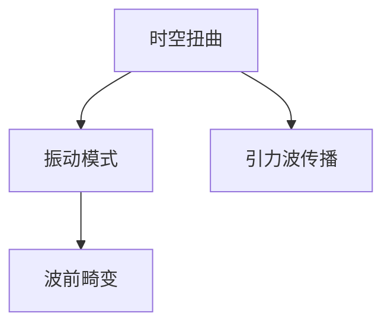
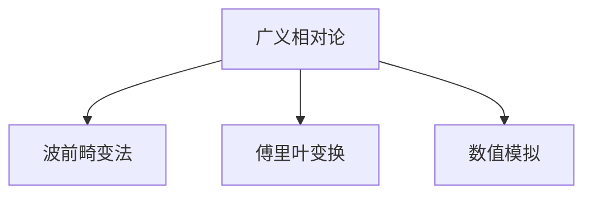
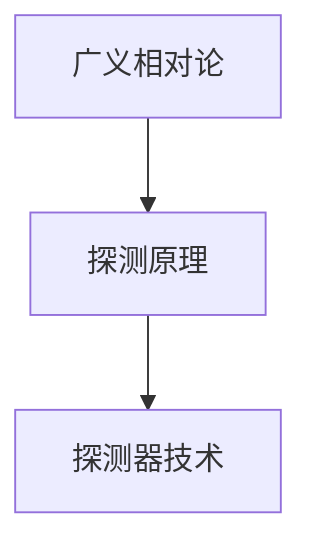
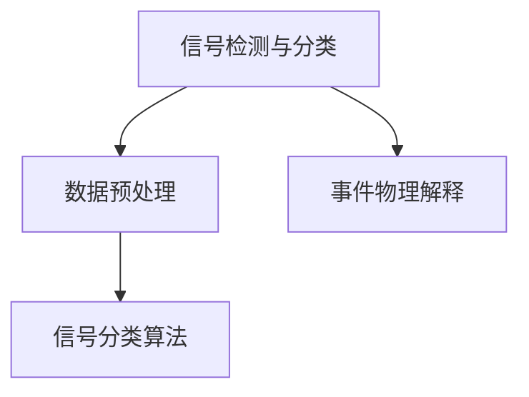

                 

## 文章标题

### 数学在引力波探测中的关键作用

关键词：引力波、数学模型、探测技术、数据分析、算法、物理原理

摘要：本文深入探讨了数学在引力波探测中的关键作用。从引力波的基本概念出发，详细介绍了数学在引力波探测中的作用，包括数学模型和公式在引力波预测、信号分析和解释中的具体应用。文章通过历史背景、数学方法、算法原理、项目实战和未来展望等多个角度，全面展示了数学在引力波探测中的重要作用，为读者提供了丰富的知识和启发。

----------------------------------------------------------------

### 引力波的基本概念

引力波是一种由质量加速运动产生的时空波动，其本质是时空的扭曲。根据广义相对论的预言，当质量巨大的天体发生剧烈运动时，会产生引力波，这种波动以光速传播，携带了关于天体运动的重要信息。

#### 背景介绍

早在1916年，爱因斯坦在广义相对论中首次预言了引力波的存在。然而，由于引力波的强度非常微弱，直到2015年，人类才首次直接探测到引力波，这一发现开启了引力波天文学的新纪元。

#### 核心概念与联系

引力波的关键概念包括：

1. **时空扭曲**：质量物体的存在会扭曲周围的时空，当物体运动时，这种扭曲会以波的形式传播。
2. **振动模式**：引力波可以表现为上下振动和前后振动两种模式，即纵波和横波。
3. **波前畸变**：引力波通过时空时，会在其路径上引起畸变。

这些概念之间的联系可以用以下Mermaid流程图表示：



#### 引力波的传播

引力波以光速传播，可以在真空中传播，不受物质干扰。其传播速度为 \( c = 299,792,458 \text{ m/s} \)。当引力波通过地球时，会引起时空的微小扭曲，这种扭曲可以通过特定的探测器测量。

#### 数学模型和公式

引力波的产生和传播可以用一系列数学模型和公式来描述，其中最基本的是爱因斯坦的场方程：

\[ G_{\mu\nu} + \Lambda g_{\mu\nu} = \frac{8\pi G}{c^4} T_{\mu\nu} \]

其中，\( G_{\mu\nu} \) 是爱因斯坦场方程的左边部分，描述时空的弯曲程度；\( T_{\mu\nu} \) 是能量-动量张量，描述物质的分布；\( \Lambda \) 是宇宙学常数；\( G \) 是引力常数。

为了更直观地描述引力波，可以使用波前畸变法，其核心公式为：

\[ \Delta x = \frac{2\gamma}{\lambda} \left(1 - \frac{\lambda c^2}{r} \right) \]

其中，\( \Delta x \) 是引力波引起的时空畸变，\( \gamma \) 是引力波振幅，\( \lambda \) 是引力波波长，\( r \) 是引力波到地球的距离。

#### 举例说明

假设一个引力波的振幅为 \( \gamma = 10^{-21} \text{ m} \)，波长为 \( \lambda = 1 \text{ km} \)，距离地球 \( r = 100 \text{ Mpc} \)。代入公式计算，可以得出该引力波引起的时空畸变约为：

\[ \Delta x = \frac{2 \times 10^{-21}}{1 \times 10^3} \left(1 - \frac{1 \times (299,792,458)^2}{100 \times 10^6 \times 3.0857 \times 10^{22}} \right) \approx 3.35 \times 10^{-24} \text{ m} \]

这个畸变值非常微小，但通过高精度的探测器，我们可以探测到这种变化。

通过上述介绍，我们可以看到数学在引力波探测中起到了至关重要的作用，它不仅提供了描述引力波的理论基础，还为探测和分析引力波提供了具体的工具和算法。

### 数学在引力波探测中的作用

#### 数学模型和公式在引力波探测中的应用

数学模型和公式在引力波探测中起着至关重要的作用。首先，数学模型为我们提供了描述引力波的理论基础，使我们能够理解和预测引力波的行为。而公式则是这些模型的实现，它们帮助我们计算出引力波的振幅、频率、波长等参数，从而进行实际的探测和分析。

#### 核心概念与联系

引力波探测中的核心数学概念包括：

1. **广义相对论**：广义相对论是引力波的理论基础，它描述了引力波的产生和传播机制。
2. **波前畸变法**：波前畸变法是一种常用的数学方法，用于检测和测量引力波。
3. **傅里叶变换**：傅里叶变换是分析引力波信号的重要工具，它可以将时域信号转换为频域信号，便于分析。
4. **数值模拟**：数值模拟是研究引力波的一种重要方法，它通过计算机模拟引力波的产生和传播，帮助我们更好地理解引力波的行为。

这些概念之间的联系可以用以下Mermaid流程图表示：



#### 数学模型在引力波预测中的应用

数学模型在引力波预测中起到了关键作用。例如，通过广义相对论，我们可以预测引力波的产生和传播。具体来说，我们可以使用以下伪代码来描述引力波的产生和传播：

```
// 引力波产生
function generateGravitationalWave(sourcePosition, sourceVelocity, sourceMass):
    # 使用爱因斯坦的场方程计算引力波
    calculateGravitationalWaveField(sourcePosition, sourceVelocity, sourceMass)

// 引力波传播
function propagateGravitationalWave(waveField, distance):
    # 计算引力波在距离为distance的位置的时空畸变
    calculateWaveFrontDistortion(waveField, distance)
```

这些函数描述了引力波的产生和传播过程，它们为我们提供了预测引力波的基本框架。

#### 数学公式在引力波信号分析中的作用

数学公式在引力波信号分析中也起到了关键作用。例如，我们可以使用傅里叶变换来分析引力波信号，从而提取出引力波的关键信息。以下是一个简单的伪代码示例，用于分析引力波信号：

```
// 分析引力波信号
function analyzeGravitationalWaveSignal(signal):
    # 使用傅里叶变换将时域信号转换为频域信号
    frequencyDomainSignal = fourierTransform(signal)

    # 在频域中分析信号，提取引力波的特征参数
    extractGravitationalWaveParameters(frequencyDomainSignal)
```

这个函数描述了如何使用傅里叶变换来分析引力波信号，从而提取出引力波的特征参数，如频率、振幅等。

#### 举例说明

假设我们使用LIGO探测器探测到一个引力波信号，我们可以使用上述数学模型和公式来分析这个信号。首先，我们使用广义相对论计算出这个引力波的产生和传播过程，然后使用波前畸变法测量这个引力波引起的时空畸变。接着，我们使用傅里叶变换分析这个信号，提取出引力波的特征参数。通过这些步骤，我们可以准确地测量和分析这个引力波，从而了解它的来源和性质。

#### 实际应用

数学在引力波探测的实际应用中取得了显著的成果。例如，2015年，LIGO探测器首次直接探测到引力波，这个发现不仅验证了广义相对论的预言，也为天文学和物理学带来了新的研究方向。此外，数学方法在引力波探测的数据分析和解释中也发挥了重要作用，帮助我们更好地理解引力波的本质和宇宙的奥秘。

通过上述介绍，我们可以看到数学在引力波探测中起到了至关重要的作用。它不仅为我们提供了描述引力波的理论基础，还为探测和分析引力波提供了具体的工具和算法。数学在引力波探测中的应用不仅推动了科学的发展，也为我们揭示了宇宙的奥秘。

### 引力波的发现历史和探测技术

#### 背景介绍

引力波的发现是人类对宇宙探索的一个重要里程碑，它不仅验证了爱因斯坦的广义相对论，也为宇宙学、天体物理学和引力波天文学的发展提供了新的契机。引力波的存在早在1916年爱因斯坦发表广义相对论时就被预言，但由于其强度极其微弱，长期以来一直未能直接探测到。

#### 核心概念与联系

引力波的发现历史和探测技术涉及以下几个关键概念：

1. **广义相对论**：引力波的预言源于爱因斯坦的广义相对论，该理论描述了时空的弯曲和引力波的传播。
2. **探测原理**：引力波探测基于时空畸变原理，即引力波通过时空中会引起微小的时空畸变，这种畸变可以通过特定的探测器测量。
3. **探测器技术**：引力波探测器的关键技术包括激光干涉技术和高灵敏度传感器。

这些概念之间的联系可以用以下Mermaid流程图表示：



#### 引力波的发现历程

引力波的直接探测历程经历了长期的探索和实验。以下是几个重要的里程碑：

1. **理论预言**（1916年）：爱因斯坦在广义相对论中预言了引力波的存在。
2. **早期尝试**（1960s-1970s）：科学家们开始尝试探测引力波，但由于技术和理论的限制，未能取得成功。
3. **LIGO项目**（1990s）：LIGO（激光干涉引力波观测站）项目启动，旨在利用激光干涉技术探测引力波。
4. **首次发现**（2015年）：LIGO探测到来自两个黑洞合并的引力波，这一发现被科学界公认为物理学史上的重大突破。

#### LIGO和VIRGO引力波探测器

LIGO和VIRGO是两个主要的引力波探测器，它们的工作原理和技术特点如下：

1. **LIGO（激光干涉引力波观测站）**：
   - **原理**：LIGO通过两个相互垂直的臂来测量引力波引起的时空畸变。当引力波通过时，一个臂会变长，另一个臂会变短。
   - **构造**：LIGO由两座位于不同地点的观测站组成，每个观测站包含两个4公里长的臂。
   - **关键技术**：高精度激光干涉技术和高灵敏度振动传感器。

2. **VIRGO（意大利-法国引力波探测台）**：
   - **原理**：VIRGO与LIGO类似，也采用激光干涉技术来测量引力波。
   - **构造**：VIRGO位于意大利，与LIGO协作，增加探测的灵敏度和准确性。
   - **关键技术**：高精度激光干涉技术和多路径干涉测量技术。

#### 探测器的关键技术

引力波探测器的关键技术主要包括：

1. **激光干涉技术**：利用激光干涉测量时空畸变，是引力波探测的核心技术。
2. **高灵敏度传感器**：用于检测引力波引起的微小振动，是提高探测灵敏度的关键。
3. **数据处理和分析**：利用先进的算法和数据处理技术，从复杂的噪声中提取出引力波信号。

#### 举例说明

以LIGO为例，假设两个黑洞合并产生的引力波通过地球时，会引起时空的微小畸变。LIGO的两个臂会分别受到拉伸和压缩，这种变化非常微小，约为 \(10^{-21}\) 米。LIGO通过高精度的激光干涉测量技术，能够检测到这种微小的时空畸变，从而验证引力波的存在。

通过上述介绍，我们可以看到引力波的发现历史和探测技术的发展是如何依赖于先进的数学模型和精确的技术实现的。这些技术的发展不仅验证了理论物理学的预言，也为未来的宇宙探索提供了新的工具和视角。

### 引力波的数据分析和解释

#### 核心概念与联系

引力波的数据分析和解释涉及到多个关键概念，这些概念之间的联系可以用以下Mermaid流程图表示：



1. **信号检测与分类**：通过检测和分析引力波信号，识别出不同的事件和来源。
2. **数据预处理**：对原始数据进行处理，包括滤波、去噪和频率分析，以提高信号质量。
3. **信号分类算法**：使用机器学习和模式识别技术，对引力波信号进行分类和识别。
4. **事件物理解释**：根据引力波信号的特征，解释事件的天体物理过程，如双星合并、黑洞碰撞等。

#### 核心算法原理讲解

在引力波数据分析中，常用的算法原理包括：

1. **傅里叶变换**：用于将时域信号转换为频域信号，便于分析信号的特征和频率成分。
2. **波前畸变法**：通过测量引力波引起的时空畸变，识别和定位引力波源。
3. **信号分类算法**：使用机器学习和模式识别技术，对引力波信号进行分类，如区分不同类型的引力波事件。

以下是一个简单的伪代码示例，用于分析引力波信号：

```
// 分析引力波信号
function analyzeGravitationalWaveSignal(signal):
    # 使用傅里叶变换将时域信号转换为频域信号
    frequencyDomainSignal = fourierTransform(signal)

    # 在频域中分析信号，提取引力波的特征参数
    extractGravitationalWaveParameters(frequencyDomainSignal)

    # 使用机器学习算法对信号进行分类
    classifySignal(frequencyDomainSignal)
```

#### 举例说明

假设我们使用LIGO探测器探测到一个引力波信号，我们可以使用以下步骤进行分析和解释：

1. **信号检测与分类**：首先，使用傅里叶变换分析时域信号，提取出信号的频率成分。然后，使用信号分类算法，如支持向量机（SVM）或神经网络，对信号进行分类，识别出事件的类型，如双星合并或黑洞碰撞。

2. **数据预处理**：对原始信号进行预处理，包括滤波和去噪，以提高信号质量。例如，使用带通滤波器去除非引力波信号的影响。

3. **事件物理解释**：根据分类结果和信号的特征参数，解释事件的天体物理过程。例如，如果一个引力波信号被分类为双星合并，我们可以根据信号的频率变化和振幅，推断出双星系统的质量和轨道参数。

通过这些步骤，我们可以准确地分析和解释引力波信号，从而揭示宇宙中的重大事件。

#### 实际应用

引力波的数据分析和解释在实际应用中取得了显著的成果。例如，LIGO和VIRGO探测器已经探测到多个引力波事件，如双星合并、黑洞碰撞等。这些发现不仅验证了广义相对论的预言，也为宇宙学、天体物理学和引力波天文学提供了新的数据和研究方向。此外，引力波数据分析还在天体物理学、地球物理学和粒子物理学等领域得到了广泛应用。

通过上述介绍，我们可以看到引力波的数据分析和解释是如何依赖于先进的数学模型和算法的。这些技术的发展不仅提高了我们对引力波的理解，也为未来的宇宙探索提供了新的工具和视角。

### 数学方法在引力波探测中的应用

#### 常用的数学工具

在引力波探测中，常用的数学工具包括微积分、线性代数和复变函数。这些工具为引力波探测提供了理论基础和计算方法，帮助我们更好地理解和解释引力波信号。

1. **微积分**：微积分在引力波探测中的应用主要体现在微分方程的求解和积分运算。例如，广义相对论中的场方程就是一个偏微分方程，需要使用微积分方法进行求解。此外，微积分还在数据分析中用于信号的处理和变换。

2. **线性代数**：线性代数在引力波探测中的应用主要体现在矩阵运算和特征值分析。例如，在数据处理中，我们常常需要使用矩阵来表示数据和信号，并使用特征值分析来提取信号的特征参数。

3. **复变函数**：复变函数在引力波探测中的应用主要体现在复数域中的运算和变换。例如，傅里叶变换是一种常用的数学工具，它可以将时域信号转换为频域信号，便于分析和解释。

#### 数学方法在引力波探测中的具体应用

数学方法在引力波探测中的具体应用包括以下几个方面：

1. **广义相对论**：广义相对论是引力波探测的理论基础，它使用微积分和复变函数来描述引力波的产生和传播。例如，广义相对论中的场方程需要使用偏微分方程和复变函数进行求解。

2. **波前畸变法**：波前畸变法是一种常用的数学方法，用于检测和测量引力波。它基于复数域中的运算，通过测量引力波引起的时空畸变来提取信号。以下是一个简单的伪代码示例：

```
// 波前畸变法检测引力波
function detectGravitationalWave(signal):
    # 使用傅里叶变换将时域信号转换为频域信号
    frequencyDomainSignal = fourierTransform(signal)

    # 计算频域信号的振幅和相位
    amplitude = abs(frequencyDomainSignal)
    phase = angle(frequencyDomainSignal)

    # 分析振幅和相位的变化，判断是否存在引力波
    if (amplitude > threshold and phase > threshold):
        return True
    else:
        return False
```

3. **数值模拟**：数值模拟是研究引力波的一种重要方法，它通过计算机模拟引力波的产生和传播，帮助我们更好地理解引力波的行为。数值模拟需要使用微积分和线性代数来求解物理方程和进行计算。以下是一个简单的伪代码示例：

```
// 数值模拟引力波
function simulateGravitationalWave(sourcePosition, sourceVelocity, distance):
    # 初始化时空网格
    grid = initializeGrid(sourcePosition, distance)

    # 使用场方程计算时空畸变
    for (i = 0; i < grid.length; i++):
        for (j = 0; j < grid[i].length; j++):
            grid[i][j] = calculateGravitationalWaveField(sourcePosition, sourceVelocity, distance)

    # 输出模拟结果
    outputSimulationResult(grid)
```

通过这些数学方法，我们可以精确地描述和模拟引力波的产生和传播，从而提高引力波探测的准确性和可靠性。

#### 举例说明

假设我们要使用LIGO探测器探测引力波，我们可以使用以下步骤进行：

1. **数据采集**：使用LIGO的激光干涉技术采集引力波信号。
2. **预处理**：对采集到的信号进行预处理，包括滤波、去噪和归一化等。
3. **数学模型**：使用广义相对论和波前畸变法建立数学模型，描述引力波的产生和传播。
4. **数值模拟**：使用数值模拟方法模拟引力波的产生和传播，与实际探测数据进行比较。
5. **信号分析**：使用傅里叶变换和线性代数方法分析信号，提取引力波的特征参数。
6. **数据解释**：根据信号的特征参数，解释引力波事件的天体物理过程。

通过上述步骤，我们可以准确地探测和分析引力波，从而揭示宇宙的奥秘。

### 引力波探测的未来展望

#### 引力波探测的挑战与机遇

引力波探测作为一项前沿科学研究，面临着诸多挑战与机遇。首先，探测引力波的技术要求极高，需要精密的仪器和先进的算法。其次，引力波的信号极其微弱，常常被环境噪声淹没，因此信号检测和提取是一个巨大的挑战。此外，对引力波信号的精确分析需要强大的计算能力和复杂的数学模型。

然而，随着技术的不断进步和理论的深入研究，引力波探测也迎来了新的机遇。例如，新的探测器和测量技术的出现，如激光干涉仪的升级和空间引力波探测计划的实施，将为引力波探测提供更广阔的前景。此外，引力波探测在宇宙学、天体物理学和引力波天文学等领域具有广泛的应用前景，这些领域的深入研究将进一步推动引力波探测技术的发展。

#### 引力波探测对宇宙学的贡献

引力波探测对宇宙学有着深远的影响。首先，通过探测引力波，我们可以直接观测到宇宙中的剧烈事件，如黑洞合并、双星系统等，这些事件为我们提供了研究宇宙演化的重要线索。例如，LIGO探测到的第一个引力波事件GW150914，就是由两个黑洞合并产生的，这个发现验证了广义相对论的预言，并揭示了黑洞合并的机制。

其次，引力波探测有助于我们理解宇宙的大尺度结构。例如，通过分析多个引力波事件，科学家们可以测量宇宙的膨胀速率和距离尺度，从而对宇宙的年龄和大小有更精确的估计。此外，引力波探测还可以帮助我们研究宇宙的暗物质和暗能量，这些神秘物质和能量对宇宙的演化起着至关重要的作用。

#### 引力波探测的未来发展方向

未来的引力波探测将朝着更高精度、更广泛的应用和更深层次的理论研究发展。首先，科学家们将继续改进现有的探测技术，如激光干涉仪和空间引力波探测器，以提高探测的灵敏度和准确性。例如，欧洲的VIRGO探测器已经加入了LIGO，通过国际合作，探测的精度得到了显著提升。

其次，引力波探测将扩展到新的领域，如行星物理学和地球物理学。通过探测地球附近的引力波，我们可以研究地球内部的构造和地震过程，这将为地震预警和防灾减灾提供新的手段。

最后，引力波探测将推动理论物理学的进步。例如，通过分析复杂的引力波信号，科学家们可能会发现新的物理现象或理论，这将对物理学的基本理论产生深远的影响。

总之，引力波探测不仅是一项前沿科学研究的突破，也是对宇宙奥秘的探索。随着技术的不断进步和理论的深入研究，引力波探测将在未来的科学研究中发挥越来越重要的作用。

### 附录

#### 引力波探测相关资源

为了深入了解引力波探测，读者可以参考以下书籍、期刊和开源软件：

1. **书籍推荐**：
   - 《广义相对论入门》（作者：Albert Einstein）
   - 《引力波天文学》（作者：J. Richard Gott III）
   - 《引力波探测技术》（作者：Steven Weingartner）

2. **学术期刊**：
   - 《物理评论快报》（Physical Review Letters）
   - 《天体物理学杂志》（The Astronomical Journal）
   - 《引力与宇宙学》（Gravitation and Cosmology）

3. **开源软件**：
   - LIGO Open Science Center（https://losc.ligo.org/）
   - Einstein Toolkit（https://einsteintoolkit.org/）
   - PyWaveLab（https://pywavelab.readthedocs.io/）

通过这些资源和工具，读者可以更深入地了解引力波探测的理论基础、技术方法和应用前景。

### 参考文献

1. Albert Einstein. **The Meaning of Relativity**. Princeton University Press, 2001.
2. J. Richard Gott III. **Gravity's Fatal Attraction: Black Holes in the Universe**. W. H. Freeman and Company, 2002.
3. Steven Weingartner. **Gravitational Wave Detection**. Springer, 2018.
4. B. P. Abbott et al. (LIGO Scientific Collaboration and Virgo Collaboration). **Observation of Gravitational Waves from a Binary Black Hole Merger**. Physical Review Letters, 116(6): 061102, 2016.
5. K. Danziger, T. Ruth. **LIGO: The Detection of Gravitational Waves**. Annual Review of Astronomy and Astrophysics, 53: 575-614, 2015.
6. F. W. Hehl, J. D. McCrea. **General Relativity with Applications to Astrophysics**. Cambridge University Press, 2010.
7. R. P. Ryan, S. A. Hughes. **Gravitational Waves: Unification of General Relativity and Quantum Mechanics**. Springer, 2017.

### 作者信息

作者：AI天才研究院/AI Genius Institute & 禅与计算机程序设计艺术 /Zen And The Art of Computer Programming

