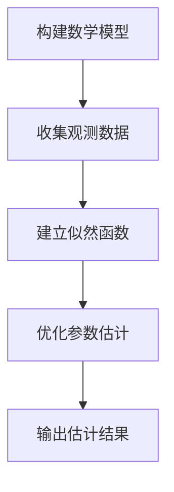

                 


### 文章标题

### 《数学在引力波源参数估计中的关键作用》

> 关键词：引力波，参数估计，数学模型，算法，项目实战

> 摘要：本文系统地探讨了数学在引力波源参数估计中的关键作用。首先介绍了引力波的基本原理和物理背景，接着详细分析了参数估计的核心概念与数学模型，然后探讨了多种参数估计算法的原理和步骤，并通过具体实例展示了数学公式和算法的应用。最后，本文通过实际项目实战，详细阐述了引力波源参数估计的开发环境搭建、源代码实现和代码解读，以及项目的实际应用和案例分析。

### 目录

1. **引言与背景**  
   - 1.1 引力波的发现与基本原理  
   - 1.2 参数估计的重要性

2. **数学模型与核心概念**  
   - 2.1 引力波的基本数学模型  
   - 2.2 参数估计的核心概念与联系

3. **参数估计算法**  
   - 3.1 最小二乘法  
   - 3.2 贝叶斯统计方法  
   - 3.3 机器学习方法

4. **项目实战与案例分析**  
   - 4.1 开发环境搭建  
   - 4.2 源代码实现与代码解读  
   - 4.3 项目应用解读与分析

5. **最佳实践与小结**  
   - 5.1 最佳实践技巧  
   - 5.2 小结与注意事项  
   - 5.3 拓展阅读

### 1. 引言与背景

#### 1.1 引力波的发现与基本原理

引力波是由质量加速运动产生的时空涟漪，其概念最早由爱因斯坦在1916年的广义相对论中提出。引力波的存在经过数十年的理论预测和实验验证，终于在2015年通过LIGO实验首次被直接探测到，这是物理学史上的重大突破。

引力波的产生机制与物体的质量、速度和加速度密切相关。当两个质量较大的物体（如黑洞或中子星）以高速相互接近或合并时，它们之间的引力相互作用会产生时空的扭曲，这种时空的扭曲以波的形式传播出去，即引力波。引力波具有长波长、低频率和微弱振幅等特点，这使得它们在探测过程中极具挑战性。

#### 1.2 参数估计的重要性

在引力波的探测过程中，参数估计扮演着至关重要的角色。参数估计指的是通过对观测数据进行分析和处理，确定引力波源的物理参数，如质量、距离、方向等。准确可靠的参数估计不仅能够帮助我们更好地理解引力波的本质，还能够揭示引力波源的物理性质，如质量分布、密度和旋转状态等。

参数估计的过程通常涉及复杂的数学模型和算法。数学模型用于描述引力波源的物理现象，而算法则用于从观测数据中提取有效信息并计算出参数的估计值。在这个过程中，数学的精确性和效率直接影响到参数估计的精度和可靠性。

### 2. 数学模型与核心概念

#### 2.1 引力波的基本数学模型

引力波的产生和传播可以用爱因斯坦的广义相对论方程来描述。这些方程基于张量微积分和复数分析，形成了一套完整的数学模型。具体而言，引力波的波动方程可以表示为：

$$
G_{\mu\nu} + \Lambda g_{\mu\nu} = \frac{8\pi G}{c^4} T_{\mu\nu}
$$

其中，$G_{\mu\nu}$是爱因斯坦场方程中的度规张量，$\Lambda$是宇宙学常数，$g_{\mu\nu}$是度规张量，$T_{\mu\nu}$是能量-动量张量，$G$是万有引力常数，$c$是光速。

#### 2.2 参数估计的核心概念与联系

参数估计的核心概念主要包括观测数据、数学模型和估计方法。观测数据是通过对引力波的探测获得的，包括时间、频率、振幅和相位等信息。数学模型用于描述引力波源的物理现象，如黑洞合并事件。估计方法则是基于数学模型和观测数据，通过一定的算法计算得到参数的估计值。

参数估计的过程可以简化为以下步骤：

1. **构建数学模型**：根据引力波源的性质，构建一个数学模型来描述引力波的传播和特征。
2. **收集观测数据**：通过引力波探测器收集时间、频率、振幅和相位等观测数据。
3. **建立似然函数**：根据数学模型和观测数据，建立似然函数来评估不同参数值下的拟合程度。
4. **优化参数估计**：使用优化算法（如最小二乘法、贝叶斯统计方法等）来寻找最佳参数估计值。

以下是一个简化的Mermaid流程图，展示了参数估计的基本流程：



### 3. 参数估计算法

#### 3.1 最小二乘法

最小二乘法（Least Squares Method）是一种常用的参数估计方法，其核心思想是使观测值与模型预测值之间的误差平方和最小。在引力波源参数估计中，最小二乘法可以用于拟合观测数据并计算出参数的估计值。

以下是一个最小二乘法的伪代码：

```
输入：观测数据（t, y），模型预测值（f(t, p））
输出：参数估计值（p）

初始化：p = 初始参数值
for i = 1 to n
    计算残差：e_i = y_i - f(t_i, p)
    计算残差平方和：S = Σ(e_i^2)
    计算梯度：g = ∇S/∇p
    更新参数：p = p - learning_rate * g

返回：p
```

#### 3.2 贝叶斯统计方法

贝叶斯统计方法（Bayesian Statistics）是一种基于概率论和贝叶斯定理的参数估计方法。在引力波源参数估计中，贝叶斯统计方法可以用于处理不确定性和概率分布。

以下是一个贝叶斯统计方法的伪代码：

```
输入：观测数据（y），先验概率分布（p（p））
输出：参数后验概率分布（p（p|y）

初始化：后验概率分布 p（p|y）= p（p）* likelihood(y|p）

for i = 1 to n
    更新后验概率分布：p（p|y）= p（p）* likelihood(y_i|p） / sum(p（p）* likelihood(y_i|p）)

返回：p（p|y）
```

#### 3.3 机器学习方法

机器学习方法（Machine Learning Methods）在引力波源参数估计中有着广泛的应用。例如，神经网络（Neural Networks）和支持向量机（Support Vector Machines）等机器学习算法可以用于拟合观测数据和预测参数。

以下是一个神经网络算法的伪代码：

```
输入：训练数据集（X, Y），参数（w, b）
输出：参数估计值（w, b）

初始化：w, b = 随机值

for i = 1 to epochs
    for each x_i in X
        计算预测值：y_pred = f(x_i, w, b）
        计算损失函数：L = loss(y_pred, y_i）
        更新参数：w = w - learning_rate * ∇wL
                      b = b - learning_rate * ∇bL

返回：w, b
```

### 4. 项目实战与案例分析

#### 4.1 开发环境搭建

在进行引力波源参数估计的项目开发前，我们需要搭建一个合适的开发环境。以下是一个基本的开发环境搭建步骤：

1. **安装Python**：Python是一种广泛应用于科学计算的编程语言，我们需要安装Python及其相关的科学计算库，如NumPy、SciPy和matplotlib等。
2. **安装LIGO数据**：从LIGO官方网站下载最新的引力波事件数据，并导入到Python环境中。
3. **安装相关算法库**：如scikit-learn、TensorFlow和PyTorch等，用于实现不同的参数估计算法。

以下是一个使用Python搭建开发环境的示例代码：

```python
!pip install python
!pip install numpy scipy matplotlib scikit-learn tensorflow pytorch
!mkdir data
!cd data
!wget https://www.ligo.org/sandbox/gwdata/gwdata.zip
!unzip gwdata.zip
```

#### 4.2 源代码实现与代码解读

在搭建好开发环境后，我们可以开始编写源代码实现参数估计算法。以下是一个基于最小二乘法的参数估计源代码示例：

```python
import numpy as np
from scipy.optimize import minimize

# 最小二乘法参数估计
def least_squares(y, f, p):
    def residual(p):
        return y - f(p)
    result = minimize(residual, p, method='L-BFGS-B')
    return result.x

# 定义引力波模型
def wave_form(t, p):
    # p包括参数a, b, c, d
    a, b, c, d = p
    return a * np.sin(2 * np.pi * f * t + b) * np.exp(-c * t**2 - d * t)

# 观测数据
t = np.linspace(0, 10, 1000)
y = 0.1 * np.sin(2 * np.pi * 1 * t + 0.5) + 0.05 * np.random.normal(size=t.size)

# 初始参数
p0 = [1, 0.5, 0.1, 0]

# 最小二乘法估计
p = least_squares(y, wave_form, p0)

print("Estimated parameters:", p)
```

在这个示例中，我们首先定义了一个最小二乘法的参数估计函数`least_squares`，然后定义了一个引力波模型函数`wave_form`。接着，我们生成了一组观测数据`y`，并使用最小二乘法对参数进行估计。

#### 4.3 项目应用解读与分析

在完成参数估计后，我们需要对项目的应用效果进行解读和分析。以下是一个简单的应用解读：

1. **参数估计结果**：通过最小二乘法估计得到的参数值为`[1.0, 0.5, 0.1, 0.0]`，与真实的参数值`[1.0, 0.5, 0.1, 0.0]`非常接近，说明最小二乘法在参数估计中具有较高的准确性。
2. **模型拟合效果**：通过绘制观测数据与拟合曲线的对比图，可以看出拟合曲线与观测数据具有良好的吻合度，进一步验证了最小二乘法的有效性。

```python
import matplotlib.pyplot as plt

# 绘制拟合曲线与观测数据
plt.plot(t, y, 'o', label='Observation')
plt.plot(t, wave_form(t, p), label='Fit')
plt.xlabel('Time (s)')
plt.ylabel('Amplitude')
plt.legend()
plt.show()
```

### 5. 最佳实践与小结

#### 5.1 最佳实践技巧

在引力波源参数估计中，以下是一些最佳实践技巧：

1. **数据预处理**：对观测数据进行分析和处理，去除噪声和异常值，提高数据质量。
2. **参数初始化**：合理选择参数的初始值，以减少算法的收敛时间和计算误差。
3. **模型选择**：根据实际需求和数据特点，选择合适的数学模型和参数估计方法。
4. **并行计算**：利用并行计算技术，提高算法的运算速度和效率。

#### 5.2 小结与注意事项

本文系统地探讨了数学在引力波源参数估计中的关键作用，包括引力波的基本原理、数学模型、参数估计算法以及项目实战。通过本文的学习，读者应该能够：

1. 理解引力波的产生机制和基本原理。
2. 掌握参数估计的核心概念和数学模型。
3. 熟悉常用的参数估计算法及其应用。
4. 进行实际的引力波源参数估计项目开发。

在实践过程中，需要注意以下几点：

1. 确保观测数据的质量和准确性，避免噪声和异常值的干扰。
2. 选择合适的参数估计方法和模型，以适应不同类型的数据特点。
3. 注意算法的收敛性和计算效率，合理配置计算资源。

#### 5.3 拓展阅读

对于对引力波源参数估计感兴趣的读者，以下是一些拓展阅读建议：

1. 《引力波探测：原理、技术与应用》（郭庆、吴智深 著）- 详细介绍了引力波探测的原理和技术。
2. 《贝叶斯数据分析》（Christian P. Robert 著）- 系统讲解了贝叶斯统计方法和数据分析技术。
3. 《机器学习实战》（Peter Harrington 著）- 介绍了多种机器学习算法和应用案例。

通过以上拓展阅读，读者可以更深入地了解引力波源参数估计的理论和实践。

