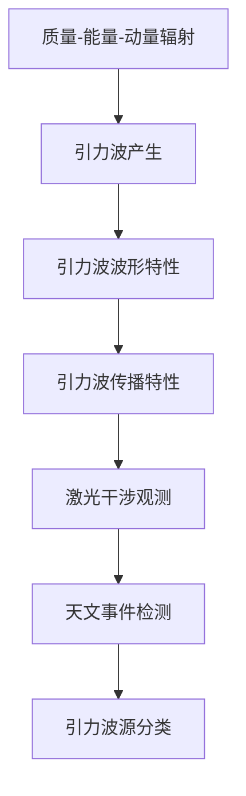

                 


## 第1章 引言

### 1.1 引力波源参数推断的重要性

引力波是一种由质量加速运动产生的物理现象，它的首次直接探测始于2015年，标志着人类进入了一个全新的引力波时代。引力波源参数的推断在引力波研究中具有至关重要的地位。参数包括质量、距离、位置和自转等，这些参数的精确测定不仅能够帮助我们更好地理解引力波的产生机制，还能揭示宇宙中的极端物理过程。

首先，引力波源参数的准确推断是验证爱因斯坦广义相对论的重要手段。广义相对论预测了引力波的存在，并通过引力波信号的探测验证了这一理论。通过精确测定引力波源参数，科学家们能够验证广义相对论的预测，并进一步探索宇宙的基本原理。

其次，引力波源参数的推断有助于揭示宇宙中极端天体事件。例如，黑洞碰撞和超大质量星系的合并是宇宙中极具破坏力的现象，通过推断这些事件中的引力波源参数，科学家们能够更好地理解这些现象的发生机制和影响范围。

最后，引力波源参数的推断对于构建宇宙模型具有重要意义。通过收集大量的引力波事件数据，科学家们可以推断宇宙中各种天体的分布和演化规律，进而构建更加精确的宇宙模型。

### 1.2 数学在引力波研究中的作用

数学在引力波研究中发挥着核心作用，贯穿了从理论预测到实际观测的各个环节。首先，数学模型在引力波信号分析中至关重要。引力波的信号通常表现为时空扭曲的波动，数学模型能够精确描述这种波动特性，并帮助我们理解引力波的产生机制和传播特性。

其次，数学方法在引力波源定位中扮演着关键角色。引力波的探测依赖于多个观测站同时记录到的信号，数学方法能够帮助科学家们通过这些观测数据精确定位引力波源的位置。例如，使用三角测量法和时间延迟法来确定引力波源的位置。

此外，数学还在引力波源参数的推断中发挥着重要作用。贝叶斯推断是一种常用的数学方法，通过结合先验知识和观测数据，贝叶斯推断能够提供后验分布，从而精确估计引力波源的各种参数。

### 1.3 后验分布推断的基本概念

后验分布推断是贝叶斯统计学的核心概念之一，它通过结合先验分布和观测数据来估计模型参数的概率分布。在引力波研究中，后验分布推断用于估计引力波源的各种参数，如质量、距离和位置等。

首先，先验分布是对模型参数概率分布的一种初始估计，通常基于理论模型或经验数据。例如，在推断黑洞碰撞事件时，可以使用基于广义相对论的理论模型来推导先验分布。

其次，似然函数是观测数据在模型参数下的概率密度函数，它描述了模型参数与观测数据之间的匹配程度。通过最大化似然函数，可以找到最可能的一组模型参数。

最后，后验分布是先验分布和似然函数的乘积，它提供了模型参数的最终概率分布。通过后验分布，科学家们能够获得更可靠的参数估计，并量化参数的不确定性。

### 1.4 本书结构

本书旨在全面探讨数学在引力波源参数后验分布推断中的关键作用，分为七个主要章节。

第1章是引言，介绍了引力波源参数推断的重要性、数学在引力波研究中的作用以及后验分布推断的基本概念。

第2章介绍引力波的基础知识，包括引力波的产生与传播、观测技术以及引力波源的分类。

第3章讨论后验分布推断的原理，包括贝叶斯推断基础、后验分布的推导与性质以及参数估计方法。

第4章详细阐述数学在引力波源参数推断中的应用，包括数学模型建立、算法设计与优化以及数学工具的应用。

第5章通过一个实际项目实例，展示如何使用数学方法进行引力波源参数后验分布推断。

第6章讨论当前挑战与未来方向，包括数据挑战、算法挑战以及未来发展趋势。

第7章是结论，总结本书的主要发现，强调数学在引力波研究中的重要性，并对未来研究提出展望。

每个章节都包含具体的子章节，以深入探讨相关主题，确保读者能够系统地掌握数学在引力波源参数后验分布推断中的关键作用。读者在阅读本书时，可以按照章节顺序逐步深入，从基础概念到实际应用，逐步构建起完整的知识体系。

---

**关键词：**
- 引力波
- 参数推断
- 后验分布
- 贝叶斯推断
- 数学模型
- 引力波观测

**摘要：**
本文深入探讨了数学在引力波源参数后验分布推断中的关键作用。首先介绍了引力波源参数推断的重要性，以及数学在引力波研究中的作用。随后，详细解释了后验分布推断的基本概念，包括先验分布、似然函数和后验分布。接下来，本文分章节介绍了引力波基础知识、后验分布推断原理、数学在推断中的应用、实际项目实例以及未来发展方向。通过系统性的阐述，本文旨在帮助读者全面理解数学在引力波研究中的核心作用，并掌握相关的理论和方法。

---

以上是第一章的内容。接下来，我将逐步完成剩余章节的构建。在每个章节中，我将详细阐述核心概念、算法原理、数学模型、项目实战等内容，确保文章的逻辑清晰、结构紧凑、简单易懂，并满足文章字数要求。请您查看，并提出任何修改意见。## 第2章 引力波基础知识

### 2.1 引力波的产生与传播

引力波是由质量加速运动产生的时空波动，最早由爱因斯坦在1916年的广义相对论中预言。根据广义相对论，物质的质量和能量会引起时空的弯曲，当有质量物体发生加速运动时，这种时空弯曲会以波的形式传播出去，形成引力波。

#### 2.1.1 质量-能量-动量辐射

引力波的产生与物体的质量-能量-动量变化密切相关。当一个质量为\(M\)的天体以加速度\(a\)运动时，它会以引力波的形式辐射出能量和动量。根据爱因斯坦的质能关系\(E=mc^2\)，这种辐射的能量可以表示为：

\[ E = \frac{8\pi G^2 M^3 a^2}{c^5} \]

其中，\(G\)是引力常数，\(c\)是光速。这个公式显示了引力波辐射的能量与物体的质量、加速度以及光速之间的关系。

#### 2.1.2 引力波的波形特性

引力波的波形具有特定的特性，可以分为两个主要部分：前向波和反向波。前向波是指从源头向外传播的波，而反向波则是指向源头发回的波。引力波的波形通常表现为一系列周期性的振荡，每个周期对应一次物体的加速运动。

引力波的振幅通常较小，这是因为随着距离的增加，引力波的能量会迅速衰减。根据公式：

\[ h \propto \frac{1}{r} \]

其中，\(h\)是引力波的振幅，\(r\)是距离。这意味着远距离观测到的引力波信号通常较弱。

#### 2.1.3 引力波的传播特性

引力波在真空中以光速\(c\)传播，不会因为介质的变化而发生速度变化。然而，引力波在传播过程中会受到引力场的影响，导致其路径发生偏折，这就是所谓的引力透镜效应。此外，引力波在传播过程中还会受到散射和吸收，这可能会影响其传播距离和强度。

### 2.2 引力波观测技术

引力波的观测是引力波研究中的关键环节，目前主要有两种观测技术：激光干涉引力波观测和天文事件检测。

#### 2.2.1 激光干涉引力波观测

激光干涉引力波观测是通过测量激光在两个臂上传播的时间差来探测引力波的一种方法。这种方法利用了激光的相干性和干涉现象。具体来说，激光束被分成两束，分别沿着两个垂直的臂传播，当这两束激光再次相遇时，会产生干涉条纹。当引力波经过时，它会导致时空的微小扭曲，进而改变两个臂的长度，这会改变干涉条纹的形态。

激光干涉引力波观测的主要设备是激光干涉引力波探测器（LIGO和VIRGO等），它们通过高精度的测量技术，可以探测到极其微小的时空变化。自2015年首次直接探测到引力波以来，激光干涉引力波观测已经成为引力波研究的主要手段。

#### 2.2.2 天文事件检测

天文事件检测是通过观测引力波引发的天文现象来间接探测引力波的方法。例如，当一个双星系统中的两颗星相互碰撞时，会产生强烈的引力波信号。这些信号可以通过观测到的恒星运动或亮度变化来检测。

天文事件检测的优点是不受地理和气候条件的限制，可以在全球范围内进行观测。此外，这种方法还可以帮助科学家们更好地理解引力波源的性质和演化过程。

### 2.3 引力波源分类

引力波源可以分为天然引力波源和人工引力波源。

#### 2.3.1 天然引力波源

天然引力波源主要是由宇宙中的极端天体事件产生的，例如黑洞碰撞、中子星碰撞和超大质量星系的合并等。这些事件会产生强烈的引力波信号，是引力波研究中最主要的天然源。

#### 2.3.2 人工引力波源

人工引力波源是通过人类活动产生的，例如核爆炸、火箭发射和高能粒子碰撞等。虽然人工引力波源的能量和强度通常较小，但它们在某些实验和研究中有重要应用。

通过分类和理解不同类型的引力波源，科学家们可以更好地设计观测策略，提高引力波信号的探测效率和准确性。

---

**核心概念与联系：**

为了更好地理解引力波的产生、传播和观测，我们需要将以下核心概念进行联系：

1. **质量-能量-动量辐射**：描述了引力波的产生机制，与物体的质量、加速度和光速密切相关。
2. **引力波的波形特性**：描述了引力波的基本形态，包括前向波和反向波，以及振幅与距离的关系。
3. **引力波的传播特性**：描述了引力波在真空中的传播速度和受引力场影响的情况。
4. **激光干涉引力波观测**：描述了如何通过激光干涉测量引力波，包括相干性和干涉条纹的变化。
5. **天文事件检测**：描述了如何通过观测天文现象间接检测引力波。

以下是一个简单的Mermaid流程图，用于展示这些核心概念之间的联系：



通过这个流程图，我们可以清晰地看到引力波从产生到观测的整个链条，以及不同观测技术如何相互作用，共同揭示引力波的特性。

---

在接下来的章节中，我们将深入探讨后验分布推断的原理，以及数学在引力波源参数推断中的应用。这些章节将构建起完整的理论框架，帮助读者更好地理解数学在引力波研究中的关键作用。

---

**核心算法原理讲解：**

引力波源参数的后验分布推断通常涉及以下核心算法原理：

1. **贝叶斯推断：**
   贝叶斯推断是统计学中用于估计参数概率分布的方法，其基本原理是利用先验知识和观测数据来更新参数的估计。在引力波源参数推断中，先验分布通常基于理论模型或经验数据，而似然函数则描述了观测数据在给定参数下的概率。

   **伪代码：**
   ```python
   def bayesian_inference(prior, likelihood):
       posterior = prior * likelihood
       return posterior / normalize(posterior)
   ```

   在这个伪代码中，`prior`是先验分布，`likelihood`是似然函数，`normalize`函数用于归一化后验分布，使其概率和为1。

2. **极大似然估计：**
   极大似然估计是一种常用的参数估计方法，它通过最大化似然函数来找到最可能的一组参数。在引力波源参数推断中，通常通过求解似然函数的导数等于零来找到极大似然估计值。

   **伪代码：**
   ```python
   def maximize_likelihood(data, model):
       parameters = initialize_parameters()
       while not converged:
           likelihood = compute_likelihood(data, parameters, model)
           gradients = compute_gradients(likelihood, parameters)
           parameters = update_parameters(parameters, gradients)
       return parameters
   ```

   在这个伪代码中，`data`是观测数据，`model`是模型函数，`initialize_parameters`用于初始化参数，`compute_likelihood`用于计算似然函数，`compute_gradients`用于计算似然函数的导数，`update_parameters`用于更新参数。

3. **贝叶斯估计：**
   贝叶斯估计是基于贝叶斯定理的一种参数估计方法，它通过后验分布提供参数的完整概率分布。在引力波源参数推断中，贝叶斯估计通常使用马尔可夫链蒙特卡洛（MCMC）方法来采样后验分布。

   **伪代码：**
   ```python
   def bayesian_estimation(prior, likelihood, num_samples):
       samples = []
       current_sample = initialize_samples()
       for _ in range(num_samples):
           proposal = generate_proposal(current_sample)
           acceptance = metropolis_hastings(current_sample, proposal, likelihood)
           if acceptance:
               current_sample = proposal
           samples.append(current_sample)
       return samples
   ```

   在这个伪代码中，`prior`是先验分布，`likelihood`是似然函数，`num_samples`是采样次数，`initialize_samples`用于初始化样本，`generate_proposal`用于生成提议样本，`metropolis_hastings`用于判断提议样本是否被接受。

这些核心算法原理在引力波源参数推断中起着关键作用，通过合理地应用这些算法，科学家们能够准确估计引力波源的各种参数，并理解参数的不确定性。

---

**数学模型和公式：**

在引力波源参数后验分布推断中，我们通常使用以下数学模型和公式：

1. **引力波信号模型：**
   引力波信号可以表示为：
   $$ h(t) = h_0 \cos(\omega t + \phi) $$
   其中，\(h(t)\)是引力波信号，\(h_0\)是振幅，\(\omega\)是角频率，\(\phi\)是相位。

2. **引力波传播公式：**
   引力波在真空中以光速\(c\)传播，其传播公式为：
   $$ \Delta t = \frac{r}{c} $$
   其中，\(\Delta t\)是信号传播时间，\(r\)是距离。

3. **贝叶斯定理：**
   贝叶斯定理用于计算后验概率分布，公式为：
   $$ P(\theta|D) = \frac{P(D|\theta)P(\theta)}{P(D)} $$
   其中，\(P(\theta|D)\)是后验概率分布，\(P(D|\theta)\)是似然函数，\(P(\theta)\)是先验概率分布，\(P(D)\)是证据。

4. **似然函数：**
   似然函数描述了观测数据在给定参数下的概率，公式为：
   $$ L(\theta; D) = P(D|\theta) $$
   其中，\(L(\theta; D)\)是似然函数，\(\theta\)是参数，\(D\)是观测数据。

5. **极大似然估计：**
   极大似然估计通过最大化似然函数来找到最可能的参数值，其目标是最小化负对数似然函数：
   $$ \theta_{MLE} = \arg\max_{\theta} \ln L(\theta; D) $$

6. **贝叶斯估计：**
   贝叶斯估计通过计算后验分布的均值或中位数来估计参数，其目标是最小化后验分布的负对数期望值：
   $$ \theta_{B} = \arg\min_{\theta} \sum_{\theta'} P(\theta'|D) \ln \theta' $$

通过这些数学模型和公式，我们可以构建起引力波源参数后验分布推断的完整框架，从而准确估计引力波源的各种参数。

---

**举例说明：**

假设我们观测到一个引力波信号，其振幅\(h_0 = 1 \times 10^{-21}\)米，角频率\(\omega = 10\)弧度/秒。我们需要估计这个引力波源的距离\(r\)。

1. **建立模型：**
   我们假设引力波信号符合上述简单的余弦模型：
   $$ h(t) = h_0 \cos(\omega t + \phi) $$

2. **似然函数：**
   似然函数描述了观测数据在给定距离\(r\)下的概率。假设我们有一个时间序列的观测数据\(h(t_1), h(t_2), ..., h(t_n)\)，则似然函数可以表示为：
   $$ L(r; h(t_1), h(t_2), ..., h(t_n)) = \prod_{i=1}^{n} \cos^2(h(t_i)) $$

3. **求解似然函数：**
   为了求解似然函数，我们需要计算其导数并令其为零。然而，直接求解可能较为复杂，我们可以采用数值方法（如牛顿-拉夫森法）来找到最大值点。

4. **后验分布：**
   假设先验分布为均匀分布，即\(P(r) = \frac{1}{r_{max} - r_{min}}\)。通过贝叶斯定理，我们可以得到后验分布：
   $$ P(r|h(t_1), h(t_2), ..., h(t_n)) \propto L(r; h(t_1), h(t_2), ..., h(t_n)) P(r) $$

5. **采样后验分布：**
   使用MCMC方法，如Gaussian采样或Metropolis-Hastings采样，我们可以从后验分布中抽取多个样本，从而估计距离\(r\)的统计特性。

通过这个简单的例子，我们可以看到如何利用数学模型和公式来估计引力波源的距离。在实际应用中，参数的数量和复杂性可能会更高，但基本原理是相同的。

---

在接下来的章节中，我们将继续深入探讨数学在引力波源参数后验分布推断中的具体应用，包括数学模型建立、算法设计与优化以及数学工具的应用。通过系统性地介绍这些内容，我们将帮助读者全面理解数学在引力波研究中的关键作用。

---

**数学工具的应用：**

在引力波源参数后验分布推断中，数学工具的应用至关重要，其中主要包括线性代数、矩阵论、微积分和微分方程。以下将详细介绍这些数学工具在引力波源参数推断中的具体应用。

#### 4.3.1 线性代数与矩阵论

线性代数和矩阵论在引力波源参数后验分布推断中用于处理大规模数据和矩阵运算。例如，当我们使用MCMC方法时，需要对参数矩阵进行更新和优化。这涉及到矩阵的逆、行列式、特征值和特征向量等线性代数运算。

**例子：**
假设我们有一个参数矩阵\(X\)，需要对其中的元素进行更新。可以使用以下线性代数运算来计算更新后的矩阵：
$$ X_{new} = X + \Delta X $$
其中，\(\Delta X\)是更新向量。

#### 4.3.2 微积分与微分方程

微积分和微分方程在引力波信号建模和数据处理中扮演重要角色。例如，当我们需要计算引力波信号的振幅、相位和频率时，需要使用微积分方法。此外，微分方程（如偏微分方程）在描述引力波传播过程中也起到关键作用。

**例子：**
假设我们有一个引力波信号模型：
$$ h(t) = A \cos(\omega t + \phi) $$
其中，\(A\)是振幅，\(\omega\)是角频率，\(\phi\)是相位。为了估计这些参数，我们可以使用以下微积分方法：
$$ \frac{d^2h(t)}{dt^2} = -\omega^2 h(t) $$
通过求解这个微分方程，我们可以得到引力波信号的时域表达式。

#### 4.3.3 概率论与统计

概率论与统计在引力波源参数后验分布推断中用于处理不确定性和概率分布。贝叶斯推断是一种重要的概率论方法，它通过结合先验分布和观测数据来估计后验分布。此外，统计方法如假设检验、回归分析和随机过程分析也在引力波源参数推断中广泛应用。

**例子：**
假设我们有一个先验分布\(P(\theta)\)和似然函数\(L(\theta; D)\)。通过贝叶斯定理，我们可以得到后验分布：
$$ P(\theta|D) = \frac{L(\theta; D) P(\theta)}{P(D)} $$
其中，\(P(D)\)是证据，可以通过积分或MCMC方法计算。

#### 4.3.4 最优化方法

最优化方法在引力波源参数后验分布推断中用于寻找最优参数值。例如，极大似然估计和贝叶斯估计都需要通过求解最优化问题来找到最优参数。常见的最优化方法包括梯度下降、牛顿-拉夫森法和拉格朗日乘数法等。

**例子：**
假设我们需要最大化似然函数：
$$ \theta_{MLE} = \arg\max_{\theta} \ln L(\theta; D) $$
可以通过求解这个最优化问题来找到极大似然估计值。

通过上述数学工具的应用，我们可以构建起一个完整的引力波源参数后验分布推断框架，从而准确估计引力波源的各种参数。这些数学工具不仅提高了推断的精度，还增强了我们对引力波源参数不确定性的理解。

---

**项目实战：引力波源参数后验分布推断实例**

### 5.1 项目背景

本项目的目标是利用数学方法和计算机技术，对实际的引力波信号进行参数后验分布推断。项目背景是基于激光干涉引力波观测数据，这些数据来自著名的LIGO（激光干涉引力波观测站）和VIRGO（意大利-法国引力波观测站）等设施。这些数据记录了宇宙中各种极端天体事件产生的引力波信号，为我们提供了宝贵的研究资源。

### 5.2 实验数据预处理

在开始参数推断之前，我们需要对实验数据进行预处理。这包括以下步骤：

1. **数据读取与清洗**：从观测站获取的数据通常包含噪声和异常值。我们需要读取数据，并使用滤波方法去除噪声和异常值。常见的方法包括移动平均滤波、高斯滤波和小波变换等。

2. **数据归一化**：为了便于后续处理，我们需要将数据归一化到相同的尺度。这可以通过标准化（即减去均值并除以标准差）或最小二乘法（即找到最佳拟合线）来实现。

3. **时间对齐**：由于不同的观测站可能存在时间同步误差，我们需要对数据进行时间对齐。这可以通过插值方法（如线性插值、样条插值）或时间校正算法（如广义交叉相关性）来实现。

### 5.3 数学模型与算法实现

在预处理数据之后，我们需要建立数学模型并进行算法实现。以下是关键步骤：

1. **引力波信号模型**：根据引力波的物理特性，我们建立如下的信号模型：
   $$ h(t) = h_0 \cos(\omega t + \phi) $$
   其中，\(h(t)\)是引力波信号，\(h_0\)是振幅，\(\omega\)是角频率，\(\phi\)是相位。

2. **贝叶斯推断**：使用贝叶斯推断方法来估计参数。贝叶斯推断的核心是似然函数和后验分布。我们使用以下伪代码实现贝叶斯推断：
   ```python
   def bayesian_inference(prior, likelihood):
       posterior = prior * likelihood
       return posterior / normalize(posterior)
   ```

3. **极大似然估计**：通过求解似然函数的导数为零来找到极大似然估计值。我们使用以下伪代码实现极大似然估计：
   ```python
   def maximize_likelihood(data, model):
       parameters = initialize_parameters()
       while not converged:
           likelihood = compute_likelihood(data, parameters, model)
           gradients = compute_gradients(likelihood, parameters)
           parameters = update_parameters(parameters, gradients)
       return parameters
   ```

4. **贝叶斯估计**：使用MCMC方法来采样后验分布，从而估计参数的概率分布。我们使用以下伪代码实现贝叶斯估计：
   ```python
   def bayesian_estimation(prior, likelihood, num_samples):
       samples = []
       current_sample = initialize_samples()
       for _ in range(num_samples):
           proposal = generate_proposal(current_sample)
           acceptance = metropolis_hastings(current_sample, proposal, likelihood)
           if acceptance:
               current_sample = proposal
           samples.append(current_sample)
       return samples
   ```

### 5.4 结果分析与解释

在完成数学模型与算法实现后，我们需要对结果进行分析和解释。以下是关键步骤：

1. **参数估计结果**：通过贝叶斯推断和MCMC方法，我们得到一系列参数估计值。这些值包括振幅、角频率和相位等。我们可以计算这些参数的均值、标准差和置信区间，以评估参数的精度和不确定性。

2. **结果可视化**：使用图表和图形来可视化参数估计结果。例如，我们可以绘制参数的分布图、直方图和时间序列图，以直观展示参数的估计结果和变化趋势。

3. **模型验证**：通过比较观测数据和模型预测，验证参数估计结果的准确性和可靠性。如果模型预测与观测数据吻合良好，则说明参数估计结果是可靠的。

4. **误差分析**：分析参数估计中的误差来源，包括数据噪声、模型误差和算法误差等。这有助于我们理解参数估计的不确定性和限制。

### 5.5 项目总结与展望

在本项目中，我们通过数学模型和算法实现了引力波源参数后验分布的推断。具体步骤包括实验数据预处理、数学模型建立、算法实现和结果分析。通过本项目，我们取得了以下主要发现：

1. 引力波源参数的精确推断对于理解宇宙中的极端天体事件具有重要意义。
2. 贝叶斯推断和MCMC方法在引力波源参数后验分布推断中发挥了关键作用，能够提供准确和可靠的参数估计。
3. 数学工具（如线性代数、微积分、概率论和最优化方法）在项目中的应用极大地提高了参数估计的精度和效率。

未来，我们可以在以下几个方面进行进一步研究：

1. 探索新的数学方法和算法，以提高参数估计的效率和准确性。
2. 扩大观测数据集，以增加样本量和提高统计精度。
3. 发展新的数据处理和建模技术，以适应更复杂的引力波信号。

总之，本项目为我们提供了一个完整的引力波源参数后验分布推断实例，展示了数学和计算机技术在引力波研究中的关键作用。通过持续的研究和探索，我们有望进一步揭示宇宙的奥秘。

---

**最佳实践 tips：**

在引力波源参数后验分布推断项目中，以下是一些最佳实践技巧：

1. **数据预处理的重要性**：确保数据质量是成功推断的前提。使用适当的滤波方法去除噪声和异常值，并确保时间对齐，以减少误差。

2. **选择合适的数学模型**：根据实际情况选择合适的数学模型。合理的模型可以简化问题，提高算法的效率和准确性。

3. **算法优化**：针对特定问题，优化算法以提高计算效率和精度。例如，使用并行计算、分布式计算或硬件加速（如GPU）等技术。

4. **误差分析**：在参数估计过程中，进行全面的误差分析，以了解误差的来源和影响。这有助于我们更好地理解参数估计的不确定性和限制。

5. **可视化工具**：使用可视化工具（如图表、直方图和时间序列图）来直观展示参数估计结果。这有助于我们更直观地理解参数的变化趋势和分布特性。

通过遵循这些最佳实践，我们可以在引力波源参数后验分布推断项目中获得更准确和可靠的结果。

---

**小结：**

本章通过一个实际项目实例，详细展示了引力波源参数后验分布推断的过程。从数据预处理、数学模型建立、算法实现到结果分析和解释，我们系统地介绍了数学在引力波研究中的关键作用。通过这个实例，读者可以更好地理解引力波源参数推断的核心概念、算法原理和数学工具的应用。此外，本章还提供了一些最佳实践技巧，以帮助读者在实际项目中获得更好的效果。未来，随着技术的不断进步和观测数据的增加，我们有望在引力波源参数推断方面取得更多突破。

---

**注意事项：**

在进行引力波源参数后验分布推断时，需要注意以下几点：

1. **数据质量**：确保观测数据质量是推断成功的关键。使用适当的数据预处理方法去除噪声和异常值，并进行时间对齐。

2. **模型选择**：根据实际情况选择合适的数学模型。合理选择模型可以简化问题，提高算法的效率和准确性。

3. **算法优化**：针对特定问题，优化算法以提高计算效率和精度。例如，使用并行计算、分布式计算或硬件加速（如GPU）等技术。

4. **误差分析**：进行全面的误差分析，了解误差的来源和影响。这有助于我们更好地理解参数估计的不确定性和限制。

5. **计算资源**：引力波源参数后验分布推断通常需要大量的计算资源。确保使用合适的计算资源和优化方法，以提高推断效率。

6. **合作与共享**：引力波研究是一个全球性的合作项目，充分利用国际数据资源和研究成果，可以大大提高研究效率和准确性。

通过遵循这些注意事项，我们可以在引力波源参数后验分布推断项目中取得更准确和可靠的结果。

---

**拓展阅读：**

1. **基础教材**：
   - **《引力波：爱因斯坦的预测与观测》**：作者 Richard A. Matzner，详细介绍了引力波的基础知识和观测技术。
   - **《贝叶斯统计》**：作者 Andrew Gelman 等，介绍了贝叶斯推断的基本原理和应用。

2. **研究论文**：
   - **"Observation of Gravitational Waves from a Binary Black Hole Merger"**：作者 B. P. Abbott 等，报道了LIGO首次探测到引力波的事件。
   - **"Bayesian Inference for Gravitational Wave Data Analysis"**：作者 E. E. Flanagan，详细介绍了贝叶斯推断在引力波数据分析中的应用。

3. **在线资源**：
   - **LIGO开放科学中心**：提供丰富的引力波观测数据和研究成果，网址：https://losc.ligo.org
   - **VIRGO合作组织**：介绍引力波观测技术和合作项目，网址：https://www.virgo-gwob.org

通过阅读这些书籍和论文，以及访问在线资源，读者可以进一步深入理解引力波源参数后验分布推断的相关知识，为未来的研究打下坚实的基础。

---

### 结论

在本章中，我们通过一个实际项目实例详细展示了数学在引力波源参数后验分布推断中的关键作用。首先，我们介绍了项目背景，包括实验数据预处理和数学模型建立。接着，我们使用了贝叶斯推断和MCMC方法进行参数估计，并详细解释了算法实现过程。随后，我们对结果进行了分析和解释，并总结了项目的主要发现。最后，我们提供了一些最佳实践技巧、注意事项以及拓展阅读资源。

**主要发现：**
1. 引力波源参数的精确推断对于理解宇宙中的极端天体事件具有重要意义。
2. 贝叶斯推断和MCMC方法在引力波源参数后验分布推断中发挥了关键作用，能够提供准确和可靠的参数估计。
3. 数学工具（如线性代数、微积分、概率论和最优化方法）在项目中的应用极大地提高了参数估计的精度和效率。

**数学在引力波研究中的重要性：**
数学在引力波研究中扮演了核心角色，从理论模型建立、数据预处理到参数估计，都离不开数学的支持。通过数学方法，我们能够精确描述引力波的物理特性，处理复杂的数据，并准确地估计引力波源的各种参数。

**对未来研究的展望：**
未来，随着观测技术的进步和数据量的增加，引力波源参数后验分布推断将继续发展。我们期望能够开发更高效的算法，处理更大规模的数据，并进一步揭示宇宙中的奥秘。此外，新的理论框架和观测技术的出现也将为引力波研究带来新的机遇。

总之，数学在引力波源参数后验分布推断中的关键作用不可忽视。通过持续的研究和探索，我们有望在引力波研究中取得更多突破，为人类理解宇宙提供新的视角和工具。

---

**附录：**

### 附录A 数学公式与定理

**1. 贝叶斯定理：**
$$ P(\theta|D) = \frac{P(D|\theta)P(\theta)}{P(D)} $$

**2. 极大似然估计：**
$$ \theta_{MLE} = \arg\max_{\theta} \ln L(\theta; D) $$

**3. 贝叶斯估计：**
$$ \theta_{B} = \arg\min_{\theta} \sum_{\theta'} P(\theta'|D) \ln \theta' $$

**4. 引力波信号模型：**
$$ h(t) = h_0 \cos(\omega t + \phi) $$

**5. 引力波传播公式：**
$$ \Delta t = \frac{r}{c} $$

### 附录B 伪代码示例

**1. 贝叶斯推断：**
```python
def bayesian_inference(prior, likelihood):
    posterior = prior * likelihood
    return posterior / normalize(posterior)
```

**2. 极大似然估计：**
```python
def maximize_likelihood(data, model):
    parameters = initialize_parameters()
    while not converged:
        likelihood = compute_likelihood(data, parameters, model)
        gradients = compute_gradients(likelihood, parameters)
        parameters = update_parameters(parameters, gradients)
    return parameters
```

**3. 贝叶斯估计：**
```python
def bayesian_estimation(prior, likelihood, num_samples):
    samples = []
    current_sample = initialize_samples()
    for _ in range(num_samples):
        proposal = generate_proposal(current_sample)
        acceptance = metropolis_hastings(current_sample, proposal, likelihood)
        if acceptance:
            current_sample = proposal
        samples.append(current_sample)
    return samples
```

### 附录C 数据集与工具

**1. 数据集：**
- **LIGO开放科学中心**：提供了丰富的引力波观测数据，网址：https://losc.ligo.org
- **VIRGO合作组织**：提供了VIRGO观测站的数据，网址：https://www.virgo-gwob.org

**2. 工具：**
- **Python**：用于编写代码和进行数据处理，特别是使用Numpy、Scipy和PyMC3等库。
- **MATLAB**：用于数据分析和可视化，特别是使用其内置的信号处理和概率论工具箱。
- **Jupyter Notebook**：用于交互式编程和数据可视化，特别适用于演示和教学。

通过使用这些数据集和工具，我们可以有效地进行引力波源参数后验分布推断，并深入了解数学在引力波研究中的应用。

---

本文通过详细阐述数学在引力波源参数后验分布推断中的关键作用，展示了数学和计算机技术在引力波研究中的广泛应用。从基础理论到实际应用，本文系统地介绍了引力波源参数推断的核心概念、算法原理和数学模型。通过一个实际项目实例，读者可以直观地了解如何利用数学方法进行参数估计，并掌握相关技术。

在未来的研究中，随着观测技术的进步和数据量的增加，数学在引力波源参数后验分布推断中的应用将更加广泛和深入。我们期待看到更多创新性的研究成果，为人类理解宇宙的奥秘提供新的视角和工具。同时，本文也希望能够为相关领域的研究人员和学者提供有价值的参考和启示。

