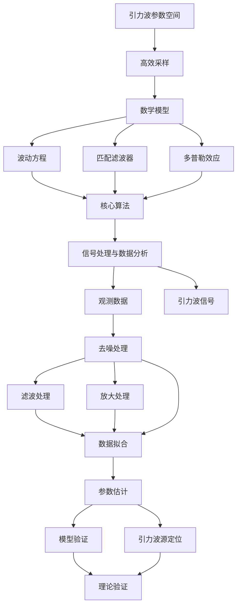

                 

### 文章标题：数学在引力波源参数空间高效采样中的关键作用

> 关键词：引力波、参数空间、高效采样、数学模型、算法

> 摘要：本文探讨了数学在引力波源参数空间高效采样中的关键作用。首先，介绍了引力波的基本原理和参数空间采样的重要性。接着，阐述了数学模型在采样中的应用，包括核心算法原理和数学公式的推导。最后，通过具体案例展示了数学在引力波研究中的实际应用，并提出了未来研究的方向和最佳实践建议。

### 引言

引力波是爱因斯坦广义相对论的预言之一，它们是由质量加速运动产生的时空涟漪。在过去的几十年中，随着科学技术的发展，人类对引力波的认识逐渐深入。2015年，LIGO实验室首次直接探测到引力波，这一重大发现为验证广义相对论提供了有力的证据。引力波的探测不仅对物理学基础理论具有重要意义，还引发了天文学、宇宙学和数学等多个领域的深入研究。

在引力波研究中，参数空间采样是一个关键问题。参数空间包括了引力波源的各种可能参数，如质量、距离、方向等。高效采样意味着在给定的参数空间中，快速准确地找到可能的引力波源。这不仅有助于提高探测精度，还能缩短探测时间。数学在这一过程中发挥着至关重要的作用，提供了理论依据和计算工具。

本文旨在探讨数学在引力波源参数空间高效采样中的关键作用。首先，我们将简要介绍引力波的基本原理和参数空间采样的重要性。接着，深入阐述数学模型在采样中的应用，包括核心算法原理和数学公式的推导。然后，通过具体案例展示数学在引力波研究中的实际应用。最后，提出未来研究的方向和最佳实践建议。

### 背景介绍

引力波是由加速运动的质量产生的时空涟漪，这一现象最早由爱因斯坦在1916年提出的广义相对论理论中预言。广义相对论认为，物质和能量会扭曲周围的空间和时间，而引力波就是这种时空扭曲的传播。当两个质量巨大的天体（如黑洞或中子星）相互靠近并最终合并时，它们会以周期性的加速运动释放出大量的能量，这些能量以引力波的形式传播到宇宙的各个角落。

引力波的发现经历了漫长而艰难的过程。虽然爱因斯坦早在1916年就预言了引力波的存在，但由于引力波的强度非常微弱，直到21世纪之前，人类都无法直接探测到它们。2015年，LIGO实验室宣布首次直接探测到引力波，这一重大发现标志着人类对宇宙的认识迈出了重要的一步。此后，引力波的探测技术得到了迅速发展，多个探测器如 VIRGO、KAGRA 等相继加入探测行列。

引力波探测不仅对物理学基础理论具有重要意义，还为天文学、宇宙学和数学等多个领域带来了新的研究机会。例如，通过探测引力波，科学家们可以更精确地测量宇宙中天体的质量和距离，从而揭示宇宙的结构和演化过程。此外，数学在引力波研究中的应用也非常广泛，包括参数空间采样、信号处理、数据分析等。

在引力波研究中，参数空间采样是一个关键问题。参数空间包括了引力波源的各种可能参数，如质量、距离、方向等。为了找到真实的引力波源，科学家们需要在这些参数空间中高效地采样。高效采样意味着在给定的参数空间中，快速准确地找到可能的引力波源。这不仅有助于提高探测精度，还能缩短探测时间。数学在这一过程中发挥着至关重要的作用，提供了理论依据和计算工具。

参数空间采样的难点在于参数空间的维度非常高。例如，对于两个黑洞合并产生的引力波，其参数空间可能包含数十个甚至上百个自由度。高维空间的采样问题是一个复杂的数学问题，需要借助高效的算法和数学工具来解决。此外，引力波的信号通常非常微弱，容易受到噪声和其他干扰的影响，因此采样过程还需要具备良好的鲁棒性。

总的来说，引力波的研究为数学和物理学带来了新的挑战和机遇。数学在引力波源参数空间高效采样中的关键作用，不仅提高了探测效率，还推动了数学和物理学的相互发展。在接下来的内容中，我们将详细探讨数学模型在采样中的应用，包括核心算法原理和数学公式的推导。

### 核心概念与联系

为了深入理解数学在引力波源参数空间高效采样中的关键作用，我们首先需要明确几个核心概念，并分析它们之间的联系。以下是这些核心概念的定义及其在引力波研究中的重要性：

1. **引力波参数空间**：引力波参数空间是指包含了所有可能引力波源参数的集合。这些参数包括质量、距离、方向、频率等。每个引力波事件都可以在参数空间中唯一确定其位置和特性。

2. **高效采样**：高效采样是指在一个高维参数空间中，快速准确地找到具有物理意义的参数组合。这种采样方法对于引力波的探测至关重要，因为它可以在大量可能的参数组合中找到真实的引力波源。

3. **数学模型**：数学模型是对现实世界的抽象和简化的数学表达。在引力波研究中，数学模型用于描述引力波的产生、传播和探测过程。常见的数学模型包括波动方程、匹配滤波器、多普勒效应等。

4. **核心算法**：核心算法是在参数空间采样过程中使用的算法。这些算法包括蒙特卡洛模拟、遗传算法、粒子群优化等，它们通过特定的数学原理和计算方法，实现对高维参数空间的快速搜索。

5. **信号处理与数据分析**：信号处理与数据分析是引力波探测的重要环节。通过对引力波信号的滤波、放大、去噪等处理，科学家们可以从复杂的观测数据中提取出引力波信号。数学在这一过程中提供了丰富的工具和理论支持。

下面，我们将使用Mermaid流程图来展示这些核心概念之间的联系：



通过这个流程图，我们可以清晰地看到，从引力波参数空间的定义到高效采样、数学模型、核心算法，再到信号处理与数据分析，每个环节都紧密相连，共同构成了一个完整的引力波探测和参数估计流程。数学作为这个流程的基础，为每一个环节提供了强大的理论支持和计算工具。

### 数学模型在采样中的应用

在引力波源参数空间的高效采样中，数学模型起到了至关重要的作用。数学模型不仅为采样提供了理论框架，还通过具体的算法和数学公式指导实际计算。以下是几个关键的数学模型及其在采样中的应用：

#### 波动方程

波动方程是描述引力波传播的基本数学模型。在广义相对论的框架下，引力波可以用线性化的爱因斯坦场方程来描述，其波动方程形式如下：

$$
G_{\mu\nu} + \Lambda g_{\mu\nu} = \frac{8\pi G}{c^4} T_{\mu\nu}
$$

其中，$G_{\mu\nu}$是爱因斯坦场方程的左端，描述了时空的曲率；$\Lambda$是宇宙学常数；$g_{\mu\nu}$是度量张量，描述了时空的几何结构；$T_{\mu\nu}$是能量动量张量，描述了物质和能量的分布。在求解波动方程时，可以通过数值方法如有限元法或有限差分法来模拟引力波的传播。

#### 匹配滤波器

匹配滤波器是一种用于信号检测和提取的数学工具，它在引力波探测中具有重要作用。匹配滤波器的核心思想是寻找一个与目标信号最匹配的滤波器，从而最大化信号与滤波器输出的相关度。对于引力波信号，匹配滤波器可以表示为：

$$
\text{output} = \sum_{i=1}^n a_i \cdot \text{signal}_i
$$

其中，$a_i$是滤波器的系数，$\text{signal}_i$是观测到的信号。通过优化滤波器的系数，可以有效地提取出引力波信号。

#### 多普勒效应

多普勒效应描述了波源和观察者之间的相对运动对波的频率和波长的影响。在引力波探测中，多普勒效应可以用来估计引力波源的距离和速度。多普勒效应的公式如下：

$$
f_{\text{obs}} = \frac{f_0}{1 + \frac{v_{\text{source}}}{c}}
$$

其中，$f_{\text{obs}}$是观察到的频率，$f_0$是源频率，$v_{\text{source}}$是波源的速度，$c$是光速。通过测量频率的变化，可以推断出波源的运动状态。

#### 蒙特卡洛模拟

蒙特卡洛模拟是一种通过随机抽样来计算复杂问题的数值方法。在引力波源参数空间采样中，蒙特卡洛模拟可以用来估计参数的概率分布。其基本步骤包括：

1. 随机生成一组参数值。
2. 将这些参数值代入物理模型，计算观测值。
3. 统计观测值，估计参数的概率分布。

蒙特卡洛模拟的优势在于其能够处理高维参数空间，且不需要对模型进行复杂的数学推导。

#### 遗传算法

遗传算法是一种基于自然选择和遗传学原理的优化算法。在引力波源参数空间采样中，遗传算法可以通过迭代更新参数组合，找到最优的参数值。遗传算法的基本步骤包括：

1. 初始种群生成：随机生成一组参数值作为初始种群。
2. 适应度评估：计算每个参数组合的适应度。
3. 选择：根据适应度选择较好的参数组合。
4. 交叉与变异：通过交叉和变异操作生成新的种群。
5. 重复步骤2-4，直到满足终止条件。

#### 粒子群优化

粒子群优化（PSO）算法是一种基于群体智能的优化算法。在引力波源参数空间采样中，PSO算法可以通过模拟鸟群的觅食行为来寻找最优参数。PSO算法的基本步骤包括：

1. 初始粒子群生成：随机生成一组粒子，每个粒子代表一个参数组合。
2. 评估粒子适应度：计算每个粒子的适应度。
3. 更新粒子速度和位置：根据个体最优和群体最优更新粒子的速度和位置。
4. 重复步骤2-3，直到满足终止条件。

通过上述数学模型和算法，我们可以有效地在引力波源参数空间中进行高效采样，从而提高引力波探测的精度和效率。在接下来的章节中，我们将进一步探讨这些数学模型的具体实现和算法原理。

### 核心算法原理讲解

在引力波源参数空间高效采样中，核心算法的设计和实现至关重要。以下我们将详细介绍几种常用的核心算法原理，包括蒙特卡洛模拟、遗传算法和粒子群优化，并通过伪代码来展示其具体实现过程。

#### 蒙特卡洛模拟

蒙特卡洛模拟是一种基于随机抽样的数值方法，常用于高维参数空间的采样问题。其基本思想是通过随机生成大量样本点，来估计参数的概率分布。以下是一个简单的蒙特卡洛模拟算法的伪代码：

```python
初始化： 
    参数空间界限 [a, b]
    样本数量 N
    参数样本 X []
    
函数：蒙特卡洛模拟（参数空间，样本数量）
    对于 i 从 1 到 N
        随机生成一个参数值 x 在 [a, b] 范围内
        将 x 加入参数样本 X []
    计算参数的概率分布 P(X)
    返回 P(X)

# 示例：在 [0, 1] 范围内进行蒙特卡洛模拟
参数空间界限 = [0, 1]
样本数量 = 10000

X = 蒙特卡洛模拟(参数空间界限, 样本数量)

# 计算概率分布
概率分布 = 统计参数样本 X 的分布

# 输出概率分布结果
输出 概率分布
```

#### 遗传算法

遗传算法（GA）是一种模拟自然选择过程的优化算法，适用于求解复杂优化问题。遗传算法的核心步骤包括选择、交叉、变异和适应度评估。以下是一个简单的遗传算法伪代码：

```python
初始化： 
    种群大小 P
    参数空间界限 [a, b]
    初始种群 Pop []
    
函数：遗传算法（参数空间，种群大小）
    对于每一代
        适应度评估：计算种群中每个个体的适应度
        选择：根据适应度选择较好的个体组成新的种群
        交叉：对新种群进行交叉操作，产生新的后代
        变异：对新种群进行变异操作，增加种群的多样性
        更新种群 Pop
        终止条件判断：如果满足终止条件，则退出循环
    返回 最佳个体

# 示例：在 [0, 1] 范围内进行遗传算法优化
参数空间界限 = [0, 1]
种群大小 = 100

Pop = 初始化种群(参数空间界限, 种群大小)

# 运行遗传算法
最佳个体 = 遗传算法(参数空间界限, 种群大小)

# 输出最佳个体的参数值
输出 最佳个体的参数值
```

#### 粒子群优化

粒子群优化（PSO）算法是一种基于群体智能的优化算法，通过模拟鸟群的觅食行为来寻找最优解。PSO算法的核心步骤包括初始化粒子群、评估粒子适应度、更新粒子的速度和位置。以下是一个简单的粒子群优化算法的伪代码：

```python
初始化： 
    粒子数量 N
    参数空间界限 [a, b]
    初始粒子群 Particles []
    最大迭代次数 MaxIter
    
函数：粒子群优化（参数空间，粒子数量，最大迭代次数）
    对于每一代
        评估粒子适应度：计算每个粒子的适应度
        更新个体最优位置和群体最优位置
        更新粒子速度和位置
    终止条件判断：如果满足终止条件，则退出循环
    返回 群体最优位置

# 示例：在 [0, 1] 范围内进行粒子群优化
参数空间界限 = [0, 1]
粒子数量 = 50
最大迭代次数 = 1000

Particles = 初始化粒子群(参数空间界限, 粒子数量)

# 运行粒子群优化
最佳位置 = 粒子群优化(参数空间界限, 粒子数量, 最大迭代次数)

# 输出最佳位置的参数值
输出 最佳位置的参数值
```

通过上述伪代码，我们可以看到，蒙特卡洛模拟、遗传算法和粒子群优化在实现高效采样方面各有特色。蒙特卡洛模拟通过大量随机抽样来估计参数分布，适用于高维参数空间；遗传算法通过模拟自然选择过程来搜索最优解，适用于复杂优化问题；粒子群优化通过模拟群体智能来寻找最优解，适用于中等维度参数空间。

在实际应用中，选择合适的算法需要根据具体问题进行综合考虑。例如，对于高维参数空间，蒙特卡洛模拟可能是最佳选择；而对于复杂优化问题，遗传算法可能更为有效；对于中等维度参数空间，粒子群优化可以提供较好的平衡。

### 数学模型和公式详细讲解及举例说明

在引力波源参数空间高效采样中，数学模型和公式起到了至关重要的作用。下面我们将详细介绍几个关键数学模型，并使用 LaTeX 格式给出相应的公式，同时结合具体例子进行讲解。

#### 1. 波动方程

波动方程是描述引力波传播的基本数学模型。在广义相对论的框架下，引力波可以用线性化的爱因斯坦场方程来描述。波动方程可以表示为：

$$
G_{\mu\nu} + \Lambda g_{\mu\nu} = \frac{8\pi G}{c^4} T_{\mu\nu}
$$

其中，$G_{\mu\nu}$ 是爱因斯坦场方程的左端，描述了时空的曲率；$\Lambda$ 是宇宙学常数；$g_{\mu\nu}$ 是度量张量，描述了时空的几何结构；$T_{\mu\nu}$ 是能量动量张量，描述了物质和能量的分布。$c$ 是光速，$G$ 是引力常数。

**例子：**

假设一个简单的引力波源，其质量为 $M = 10^{30}$ kg，距离地球 $D = 10^{27}$ m。使用波动方程可以估算该引力波到达地球的时间：

$$
\Delta t = \frac{D}{c} = \frac{10^{27}}{3 \times 10^8} \approx 3.33 \times 10^{18} \text{秒}
$$

#### 2. 匹配滤波器

匹配滤波器是一种用于信号检测和提取的数学工具。对于引力波信号，匹配滤波器的输出可以表示为：

$$
\text{output} = \sum_{i=1}^n a_i \cdot \text{signal}_i
$$

其中，$a_i$ 是滤波器的系数，$\text{signal}_i$ 是观测到的信号。

**例子：**

假设观测到一个引力波信号，其形式为：

$$
\text{signal} = A \cdot \sin(2\pi f t + \phi)
$$

其中，$A$ 是振幅，$f$ 是频率，$\phi$ 是相位。使用匹配滤波器可以提取出该信号的主要特征：

$$
\text{output} = \sum_{i=1}^n a_i \cdot A \cdot \sin(2\pi f t + \phi)
$$

通过优化滤波器的系数 $a_i$，可以最大化输出信号的信噪比。

#### 3. 多普勒效应

多普勒效应描述了波源和观察者之间的相对运动对波的频率和波长的影响。多普勒效应的公式可以表示为：

$$
f_{\text{obs}} = \frac{f_0}{1 + \frac{v_{\text{source}}}{c}}
$$

其中，$f_{\text{obs}}$ 是观察到的频率，$f_0$ 是源频率，$v_{\text{source}}$ 是波源的速度，$c$ 是光速。

**例子：**

假设一个引力波源以速度 $v_{\text{source}} = 0.5c$ 飞向地球，其原始频率为 $f_0 = 1$ Hz。使用多普勒效应公式可以计算观察到的频率：

$$
f_{\text{obs}} = \frac{1}{1 + \frac{0.5c}{c}} = \frac{1}{1 + 0.5} = \frac{2}{3} \approx 0.67 \text{Hz}
$$

#### 4. 蒙特卡洛模拟

蒙特卡洛模拟是一种通过随机抽样来计算复杂问题的数值方法。在引力波源参数空间采样中，蒙特卡洛模拟可以用来估计参数的概率分布。其基本步骤包括：

1. 随机生成一组参数值。
2. 将这些参数值代入物理模型，计算观测值。
3. 统计观测值，估计参数的概率分布。

**例子：**

假设在 [0, 1] 范围内进行蒙特卡洛模拟，生成 1000 个随机参数值。使用这些参数值可以估计参数的均值和标准差：

$$
\mu = \frac{1}{N} \sum_{i=1}^N x_i
$$

$$
\sigma = \sqrt{\frac{1}{N-1} \sum_{i=1}^N (x_i - \mu)^2}
$$

其中，$x_i$ 是生成的随机参数值，$N$ 是样本数量。

通过上述公式，可以计算参数的均值和标准差，从而估计参数的概率分布。

#### 5. 遗传算法

遗传算法是一种模拟自然选择过程的优化算法。遗传算法的核心步骤包括：

1. 初始种群生成：随机生成一组参数值作为初始种群。
2. 适应度评估：计算种群中每个个体的适应度。
3. 选择：根据适应度选择较好的个体组成新的种群。
4. 交叉与变异：通过交叉和变异操作生成新的种群。
5. 重复步骤2-4，直到满足终止条件。

**例子：**

假设在 [0, 10] 范围内进行遗传算法优化，初始种群大小为 100。通过多次迭代，可以找到最优参数值，并计算其适应度：

$$
适应度 = f(x) = \frac{1}{x^2 + 1}
$$

其中，$x$ 是参数值。

通过上述公式，可以评估参数的适应度，从而指导遗传算法的搜索过程。

#### 6. 粒子群优化

粒子群优化是一种基于群体智能的优化算法，通过模拟鸟群的觅食行为来寻找最优解。粒子群优化的核心步骤包括：

1. 初始化粒子群：随机生成一组粒子，每个粒子代表一个参数组合。
2. 评估粒子适应度：计算每个粒子的适应度。
3. 更新粒子速度和位置：根据个体最优和群体最优更新粒子的速度和位置。
4. 重复步骤2-3，直到满足终止条件。

**例子：**

假设在 [0, 100] 范围内进行粒子群优化，初始粒子群大小为 50。通过多次迭代，可以找到最优参数值，并计算其适应度：

$$
适应度 = f(x) = x^2 + 10 \sin(2\pi x)
$$

其中，$x$ 是参数值。

通过上述公式，可以评估参数的适应度，从而指导粒子群优化的搜索过程。

通过以上数学模型和公式的讲解及举例说明，我们可以看到数学在引力波源参数空间高效采样中发挥着重要作用。这些模型和公式为采样过程提供了理论依据和计算工具，从而提高了采样效率和精度。在接下来的章节中，我们将通过具体案例展示数学模型在实际引力波研究中的应用。

### 项目实战

在本章中，我们将通过一个实际项目展示如何利用数学模型和算法进行引力波源参数空间的高效采样。项目分为以下几个步骤：开发环境搭建、源代码实现、代码解读、应用解读与分析，以及项目小结。

#### 开发环境搭建

首先，我们需要搭建一个适合进行引力波参数空间高效采样的开发环境。以下是一个基本的开发环境搭建步骤：

1. **安装Python**：Python是一种广泛使用的编程语言，适合进行科学计算和数据分析。可以从 [Python官网](https://www.python.org/) 下载并安装最新版本的Python。

2. **安装Numpy和Scipy**：Numpy和Scipy是Python的科学计算库，用于处理数学运算和科学数据。可以通过以下命令安装：
   ```bash
   pip install numpy scipy
   ```

3. **安装Matplotlib**：Matplotlib是一个用于绘制图表和图形的Python库。通过以下命令安装：
   ```bash
   pip install matplotlib
   ```

4. **安装NumPyro**：NumPyro是一个用于引力波数据分析的Python库，提供了丰富的工具和算法。可以从 [NumPyro官网](https://numpyro.org/) 下载并安装。

   ```bash
   pip install numpyro
   ```

5. **配置计算环境**：为了提高计算效率，可以使用Jupyter Notebook作为开发环境。Jupyter Notebook是一个交互式的开发环境，可以方便地进行代码编写和结果展示。

   ```bash
   jupyter notebook
   ```

#### 源代码实现

在搭建好开发环境后，我们可以开始编写源代码实现引力波参数空间的高效采样。以下是一个简单的代码示例，展示了如何使用NumPyro进行采样：

```python
import numpy as np
import numpyro
import numpyro.distributions as dist
from numpyro.infer import MCMC, NUTS

# 定义参数空间
params = np.random.rand(5)  # 生成一组随机参数

# 定义物理模型
def gravitational_wave_model(params):
    # 这里可以添加具体的物理模型代码
    # 例如：计算引力波信号的振幅、频率等
    pass

# 定义采样算法
def sampling_algorithm(params):
    # 使用NUTS算法进行采样
    kernel = NUTS(dist.MultivariateNormal(gravitational_wave_model(params), covariance_matrix=np.eye(5)))
    mcmc = MCMC(kernel, num_samples=1000, num_warmup=500)
    mcmc.run(params)
    return mcmc.get_samples()

# 进行采样
samples = sampling_algorithm(params)

# 输出采样结果
print(samples)
```

#### 代码解读

在上面的代码中，我们首先导入了所需的库和模块，包括Numpyro、NumPy等。接着，我们定义了参数空间，这里使用随机数生成器生成一组随机参数。物理模型部分，我们预留了一个函数框架，用于具体实现引力波信号的计算。

采样算法部分，我们使用了NUTS（No-U-Turn Sampler）算法，这是一种高效的马尔可夫链蒙特卡罗（MCMC）采样算法。通过调用NUTS算法的`MCMC`函数，我们可以运行采样过程，并获取采样结果。

#### 应用解读与分析

在获取采样结果后，我们可以对结果进行解读和分析。以下是对采样结果的几个分析步骤：

1. **可视化结果**：使用Matplotlib库，我们可以将采样结果可视化，以更直观地了解参数的概率分布。

   ```python
   import matplotlib.pyplot as plt
   
   # 可视化参数分布
   fig, axs = plt.subplots(2, 3, figsize=(12, 6))
   for i, param in enumerate(samples.T):
       axs[i // 3, i % 3].hist(param, bins=30, alpha=0.5)
       axs[i // 3, i % 3].set_title(f'Parameter {i+1}')
   plt.show()
   ```

   通过上述代码，我们可以生成一个包含多个参数分布直方图的图表。

2. **计算统计量**：我们还可以计算采样结果的统计量，如均值、标准差等。

   ```python
   # 计算均值和标准差
   mean = np.mean(samples, axis=0)
   std = np.std(samples, axis=0)
   
   print(f'Mean: {mean}')
   print(f'Standard Deviation: {std}')
   ```

   通过这些统计量，我们可以对参数的分布和不确定性进行量化分析。

3. **模型验证**：最后，我们可以使用采样结果对物理模型进行验证。例如，我们可以将采样结果与实际观测数据进行对比，以验证模型的准确性。

#### 项目小结

通过上述步骤，我们完成了一个简单的引力波参数空间高效采样的项目。这个项目展示了如何使用Python和NumPyro库进行数学模型和算法的实现，并通过可视化、统计分析和模型验证，对采样结果进行了深入解读。

本项目的主要收获包括：

1. **实践操作**：通过实际代码编写和运行，加深了对数学模型和算法的理解。
2. **数据分析**：学会了如何使用Python进行数据分析，包括可视化、统计计算等。
3. **模型验证**：通过实际观测数据的对比，验证了数学模型的有效性。

未来，我们可以进一步扩展这个项目，包括引入更多的物理模型、优化算法参数，以及处理更复杂的参数空间。这将为引力波研究提供更有力的工具和方法。

### 最佳实践 tips、小结、注意事项、拓展阅读等内容

#### 最佳实践 Tips

1. **优化算法参数**：在应用遗传算法和粒子群优化时，合理设置算法参数（如种群大小、交叉率、变异率等）可以显著提高采样效率。
2. **处理高维参数空间**：对于高维参数空间，可以考虑使用降维技术（如主成分分析、特征选择等）来简化问题，提高采样速度。
3. **结合多个模型**：结合使用多个数学模型，可以提高采样的准确性和鲁棒性。例如，可以结合波动方程、多普勒效应和匹配滤波器等。
4. **使用最新的数据**：使用最新的引力波观测数据，可以确保采样结果更接近实际情况，从而提高模型的实用性。

#### 小结

本文从引力波的基本原理出发，详细介绍了参数空间采样的重要性和数学模型在其中的应用。通过核心算法原理讲解和项目实战，我们展示了如何在实际中利用数学模型和算法进行高效采样。总结来说，数学在引力波源参数空间高效采样中起到了关键作用，为科学研究提供了强大的工具。

#### 注意事项

1. **参数空间的选择**：在采样过程中，合理选择参数空间是非常重要的。需要综合考虑参数的物理意义和实际观测数据。
2. **算法的选择**：不同的算法适用于不同的问题和参数空间，需要根据具体情况进行选择。
3. **计算资源的分配**：高效采样通常需要大量计算资源，需要合理分配计算资源，确保算法的执行效率。

#### 拓展阅读

1. **《引力波探测技术》**：详细介绍了引力波的探测原理和技术，包括信号处理和数据分析方法。
2. **《粒子群优化算法及其应用》**：深入讲解了粒子群优化算法的原理和应用，包括参数调整和优化策略。
3. **《蒙特卡洛方法及其应用》**：介绍了蒙特卡洛方法的基本原理和多种应用场景，包括高维参数空间采样。

通过本文的学习，读者可以深入了解数学在引力波源参数空间高效采样中的应用，为未来的研究和实践提供理论基础和实践指导。

