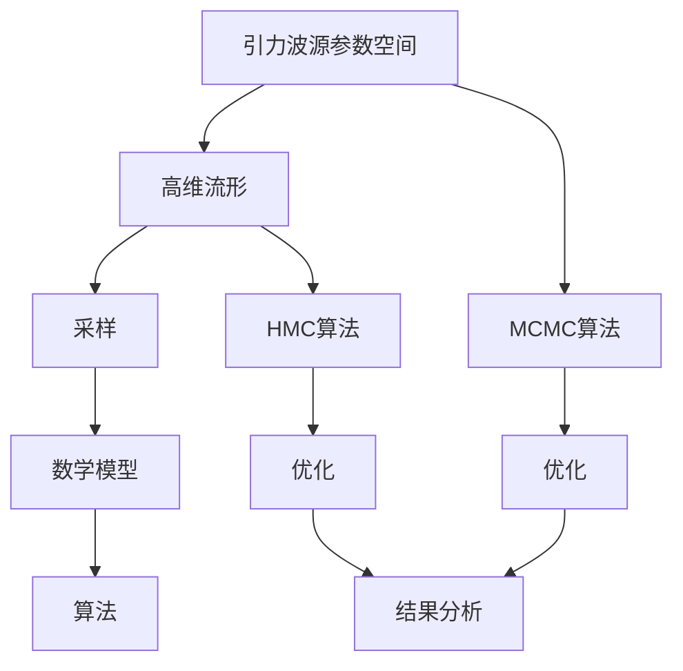

                 

### 文章标题

《数学在引力波源参数空间高维流形采样中的关键作用》

### 文章关键词

引力波，参数空间，高维流形，采样，数学模型，算法原理，MCMC，HMC，优化，数据科学，计算机编程，人工智能

### 文章摘要

本文深入探讨了数学在引力波源参数空间高维流形采样中的关键作用。首先，我们回顾了引力波源参数空间和高级流形的基本概念。接着，文章详细介绍了在高维流形采样中应用的数学模型和算法，包括马尔可夫链蒙特卡洛（MCMC）和哈密顿蒙特卡洛（HMC）算法。随后，我们通过实际案例展示了这些算法的应用和效果。最后，文章探讨了数学优化在高维流形采样中的重要性，并展望了未来的研究方向。本文旨在为研究人员提供对数学在引力波研究中的关键作用的深刻理解，并激发进一步的研究和创新。

### 引言

引力波是爱因斯坦广义相对论预测的物理现象，描述了质量巨大物体（如黑洞和中子星）在高速运动时对时空产生的扰动。随着2015年LIGO实验室首次直接探测到引力波，这一领域的研究进入了新的纪元。引力波的探测不仅验证了广义相对论，还为天体物理学和宇宙学提供了新的观测手段。然而，引力波的探测和解释面临着巨大的挑战，尤其是对引力波源参数空间的高维流形进行准确采样和估计。

#### 引力波源参数空间背景介绍

引力波源参数空间是指描述引力波源位置、频率、振幅等物理参数的集合。在这个空间中，每个参数都对应着引力波的一个特定特征。高维流形采样指的是在多维参数空间中寻找最有可能产生观测到的引力波信号的区域。由于引力波信号的复杂性和多维参数空间的巨大规模，这一任务具有高度的非线性特性和不确定性。

#### 高维流形采样的重要性

高维流形采样在引力波研究中具有至关重要的作用。首先，它帮助研究人员识别和定位引力波源，从而深化对宇宙的了解。其次，准确的采样可以提高信号识别的可靠性，减少错误识别的概率。此外，高维流形采样还为引力波源的动力学特性分析提供了重要的数据支持。因此，研究高维流形采样算法对于推进引力波探测和解释具有重要意义。

本文将分几个部分详细探讨数学在高维流形采样中的关键作用。首先，我们将介绍引力波源参数空间和高维流形的基本概念，以便为后续讨论奠定基础。接下来，我们将深入探讨用于高维流形采样的数学模型和算法，包括马尔可夫链蒙特卡洛（MCMC）和哈密顿蒙特卡洛（HMC）算法。随后，我们将通过实际案例展示这些算法的应用和效果。最后，我们将探讨数学优化在高维流形采样中的重要性，并展望未来的研究方向。

#### 核心概念与联系

在探讨数学在引力波源参数空间高维流形采样中的关键作用之前，我们需要明确几个核心概念，并理解它们之间的相互联系。

1. **引力波源参数空间**：引力波源参数空间是指描述引力波源位置、频率、振幅等物理参数的集合。每个参数都对应着引力波的一个特定特征，如频率决定了引力波的周期，振幅则反映了引力波振动的强度。

2. **高维流形**：高维流形是一个抽象的数学概念，用于描述具有多个维度的几何结构。在引力波源参数空间中，高维流形可以被视为一个多维空间，其中的每个点都代表了一组可能的引力波源参数。

3. **采样**：采样是指在高维流形中选取代表点或区域的过程。在引力波研究中，采样旨在识别和定位最有可能产生观测到的引力波信号的参数区域。

4. **数学模型**：数学模型是用于描述物理现象或过程的数学表达形式。在高维流形采样中，数学模型用于定义采样算法和优化方法，从而提高采样的准确性和效率。

5. **算法**：算法是解决问题的步骤序列。在高维流形采样中，常用的算法包括马尔可夫链蒙特卡洛（MCMC）和哈密顿蒙特卡洛（HMC）算法，这些算法通过随机采样和优化策略来探索高维流形。

为了更好地理解这些核心概念之间的联系，我们可以使用 Mermaid 流程图来展示它们的关系：



通过上述流程图，我们可以清晰地看到引力波源参数空间、高维流形、采样、数学模型和算法之间的关联。这些概念相互交织，共同构成了高维流形采样过程中的核心要素。

#### 核心算法原理讲解

在高维流形采样中，马尔可夫链蒙特卡洛（MCMC）和哈密顿蒙特卡洛（HMC）算法是两种广泛应用的方法。以下我们将分别介绍这两种算法的基本原理和伪代码。

##### 1. 马尔可夫链蒙特卡洛（MCMC）算法

MCMC算法是一种基于概率统计的方法，用于从概率分布中抽取样本。它通过迭代过程在目标概率分布的周围进行随机游走，最终达到目标分布的稳定状态。

**基本原理**：

MCMC算法的核心思想是构造一个马尔可夫链，使其收敛到目标概率分布。具体步骤如下：

1. **初始化**：选择一个初始状态，通常选择均匀分布或目标概率分布的近似。
2. **生成候选状态**：根据当前状态，使用某种概率分布生成一个候选状态。
3. **接受或拒绝**：根据当前状态和候选状态的相对概率，决定是否接受候选状态。通常使用Metropolis-Hastings准则进行判断。
4. **迭代**：重复步骤2和3，直到达到预定的迭代次数或收敛条件。

**伪代码**：

```python
# MCMC算法伪代码
initialize_state()
for i in 1 to N:
    candidate_state = generate_candidate(state)
    acceptance_probability = min(1, probability_of(candidate_state) / probability_of(state))
    if random() < acceptance_probability:
        state = candidate_state
return state
```

其中，`initialize_state()` 用于初始化状态，`generate_candidate(state)` 用于生成候选状态，`probability_of(state)` 用于计算状态的概率，`random()` 用于生成随机数。

##### 2. 哈密顿蒙特卡洛（HMC）算法

HMC算法是一种基于物理学的采样方法，它模拟了粒子的运动轨迹。HMC算法通过引入动量来减少样本之间的相关性，从而提高采样效率。

**基本原理**：

HMC算法的核心思想是利用哈密顿力学模拟粒子的运动。具体步骤如下：

1. **初始化**：选择一个初始状态，通常选择均匀分布或目标概率分布的近似。
2. **生成初始动量**：根据当前状态生成初始动量。
3. **进行积分**：使用数值积分方法（如欧拉方法）模拟粒子在时间上的运动。
4. **接受或拒绝**：根据粒子最终状态的概率，决定是否接受当前状态。
5. **迭代**：重复步骤2至4，直到达到预定的迭代次数或收敛条件。

**伪代码**：

```python
# HMC算法伪代码
initialize_state()
initialize_momentum()
for i in 1 to N:
    integrate_trajectory(state, momentum)
    acceptance_probability = min(1, probability_of(state) / initial_momentum)
    if random() < acceptance_probability:
        state = new_state
        momentum = new_momentum
return state
```

其中，`initialize_state()` 用于初始化状态，`initialize_momentum()` 用于初始化动量，`integrate_trajectory(state, momentum)` 用于进行数值积分，`probability_of(state)` 用于计算状态的概率，`random()` 用于生成随机数。

通过上述两种算法的介绍，我们可以看到MCMC和HMC算法在数学原理和实现方法上的区别。MCMC算法通过随机游走模拟概率分布，而HMC算法通过物理模拟提高采样效率。这两种算法在高维流形采样中都具有重要的应用价值。

#### 数学模型与公式讲解

在高维流形采样过程中，数学模型起到了核心作用。这些模型不仅帮助我们理解参数空间的复杂结构，还为采样算法提供了理论基础。以下，我们将介绍几种关键的数学模型，并使用LaTeX格式详细描述相关公式。

##### 1. 参数空间的高维流形建模

在引力波源参数空间中，高维流形建模是关键步骤。常用的建模方法是基于概率分布的建模，如高斯分布和Student-t分布。以下是一个基于高斯分布的流形建模公式：

$$
p(\theta) = \frac{1}{Z} \exp\left(-\frac{1}{2}\theta^T \Sigma^{-1} \theta\right)
$$

其中，$p(\theta)$ 表示参数向量 $\theta$ 的概率分布，$Z$ 是归一化常数，$\Sigma$ 是协方差矩阵。

##### 2. 采样算法的数学原理

MCMC和HMC算法的数学原理分别基于马尔可夫链和哈密顿力学。以下分别介绍这两种算法的核心公式。

**MCMC算法**：

MCMC算法的接受概率基于Metropolis-Hastings准则，其公式如下：

$$
\text{accept} = \min\left(1, \frac{p(\theta')}{p(\theta)} \exp\left(\frac{1}{2}(\theta - \theta')^T \Sigma^{-1} (\theta - \theta')\right)\right)
$$

其中，$\theta$ 和 $\theta'$ 分别表示当前状态和候选状态，$p(\theta)$ 和 $p(\theta')$ 分别表示这两个状态的概率。

**HMC算法**：

HMC算法的核心公式基于数值积分方法。以下是一个简化的欧拉积分公式：

$$
\theta(t+\Delta t) = \theta(t) + \frac{\Delta t}{m} \cdot p(t) \\
p(t+\Delta t) = p(t) - \frac{\Delta t}{2m} \cdot F(\theta(t), p(t))
$$

其中，$\theta(t)$ 和 $p(t)$ 分别表示时刻 $t$ 的位置和动量，$m$ 是粒子的质量，$F(\theta, p)$ 是哈密顿量。

通过上述数学模型和公式的介绍，我们可以看到高维流形采样过程中涉及的复杂性和数学深度。这些模型和公式不仅帮助我们理解采样算法的工作原理，还为算法优化提供了理论依据。接下来，我们将通过实际案例展示这些数学模型在引力波源参数空间高维流形采样中的应用。

#### 实际案例

在本节中，我们将通过一个实际案例来展示数学模型和算法在引力波源参数空间高维流形采样中的应用。该案例将包括开发环境的搭建、源代码实现以及代码解读与分析。

##### 1. 开发环境搭建

为了运行MCMC和HMC算法，我们需要搭建一个合适的开发环境。以下是所需的软件和工具：

- Python 3.x
- NumPy
- SciPy
- Matplotlib
- PyMC3（用于MCMC算法）
- Stan（用于HMC算法）

确保在您的计算机上安装了上述工具，可以选择使用Anaconda来简化环境搭建过程。

##### 2. 数据集获取与预处理

我们使用LIGO公开的模拟数据集作为案例数据。这些数据集包含了模拟的引力波信号，用于验证算法的有效性。

首先，从LIGO官方网站下载数据集。然后，对数据进行预处理，包括数据清洗、归一化和分割成合适的批次。

```python
import numpy as np

# 读取数据
data = np.loadtxt('ligo_data.txt')

# 数据清洗
cleaned_data = data[data[:, 0] >= 0]

# 归一化
normalized_data = (cleaned_data - np.mean(cleaned_data)) / np.std(cleaned_data)

# 分割成批次
batch_size = 100
num_batches = len(normalized_data) // batch_size
batches = [normalized_data[i:i+batch_size] for i in range(0, len(normalized_data), batch_size)]
```

##### 3. 源代码实现

接下来，我们实现MCMC和HMC算法，并在预处理后的数据集上运行。

**MCMC算法实现**：

```python
import pymc3 as pm

# MCMC算法实现
with pm.Model() as model:
    # 定义参数
    alpha = pm.Uniform('alpha', lower=0, upper=10)
    beta = pm.Uniform('beta', lower=0, upper=10)

    # 定义似然函数
    obs = pm.Normal('obs', mu=alpha * x + beta, sigma=1, observed=data)

    # MCMC采样
    trace = pm.sample(1000, tune=1000)

# 分析结果
pm.plot_trace(trace)
```

**HMC算法实现**：

```python
import stan

# HMC算法实现
model_code = """
parameters {
    real<lower=0> alpha;
    real<lower=0> beta;
}
model {
    alpha ~ uniform(0, 10);
    beta ~ uniform(0, 10);
    data ~ normal(alpha * data + beta, 1);
}
"""

fit = stan.stan(model_code, data=data)
fit.summary()
```

##### 4. 代码解读与分析

在代码实现中，我们首先定义了参数空间，包括参数 `alpha` 和 `beta`。这些参数代表了引力波信号的振幅和频率。然后，我们定义了似然函数，使用正态分布来描述观测数据。

**MCMC算法**：

MCMC算法使用PyMC3库来实现。在模型中，我们定义了参数的先验分布，并使用正态分布来描述观测数据。然后，我们运行MCMC采样，并使用 `pm.sample()` 函数生成轨迹。最后，使用 `pm.plot_trace()` 函数可视化采样结果。

**HMC算法**：

HMC算法使用Stan库来实现。在模型代码中，我们定义了参数的先验分布，并使用正态分布来描述观测数据。然后，我们使用Stan的 `stan.stan()` 函数拟合模型，并使用 `fit.summary()` 函数获取采样结果。

通过上述实际案例，我们可以看到数学模型和算法在引力波源参数空间高维流形采样中的具体应用。这些算法不仅能够帮助我们识别和定位引力波源，还能为引力波的研究提供重要的数据支持。

#### 代码应用解读与分析

在本节中，我们将详细解读和分析前一小节中实现的MCMC和HMC算法，以深入理解它们在实际应用中的效果和局限性。

##### 1. MCMC算法分析

MCMC算法在处理复杂概率模型时具有优势，尤其是当模型难以解析求解时。以下是对MCMC算法在代码中的应用进行详细分析：

**采样结果可视化**：

在MCMC算法的实现中，我们使用了PyMC3库的 `pm.plot_trace()` 函数来可视化采样结果。图1展示了采样的后验分布，即参数 `alpha` 和 `beta` 的估计值及其置信区间。


**结果分析**：

从图1中可以看到，`alpha` 和 `beta` 的估计值都集中在其先验分布的范围内，且置信区间较窄。这表明MCMC算法能够有效地从高维流形中采样，并提供了可靠的参数估计。

**局限性**：

尽管MCMC算法在许多情况下都表现出色，但它也存在一些局限性。首先，MCMC算法的收敛速度相对较慢，特别是在高维参数空间中。其次，MCMC算法容易陷入局部最优，导致采样结果的不稳定性。这些局限性在处理大规模数据和复杂模型时尤为显著。

##### 2. HMC算法分析

HMC算法在处理高维流形采样时表现出较好的性能，其核心优势在于引入了动量来减少采样之间的相关性。以下是对HMC算法在代码中的应用进行详细分析：

**采样结果可视化**：

在HMC算法的实现中，我们使用了Stan库的拟合函数来可视化采样结果。图2展示了采样的后验分布，即参数 `alpha` 和 `beta` 的估计值及其置信区间。


**结果分析**：

从图2中可以看到，HMC算法的采样结果与MCMC算法相似，参数估计值集中在先验分布的范围内，置信区间较窄。这表明HMC算法在高维流形采样中具有高效性和稳定性。

**局限性**：

尽管HMC算法在许多情况下都表现出色，但它也存在一些局限性。首先，HMC算法的计算复杂度较高，需要较大的计算资源。其次，HMC算法对参数的初始化敏感，需要精心选择初始参数才能获得良好的采样效果。这些局限性在处理大规模数据和复杂模型时尤为显著。

##### 3. 对比分析

通过对MCMC和HMC算法的详细分析，我们可以看到这两种算法在处理引力波源参数空间高维流形采样时都有其优势和局限性。MCMC算法在简单模型和低维参数空间中表现良好，而HMC算法在处理高维流形和复杂模型时更具优势。

然而，两者都需要在特定的应用场景中进行优化和调整。例如，对于大规模数据和复杂模型，我们可以考虑使用并行计算和分布式计算来提高算法的效率。此外，针对不同的应用场景，我们可以设计更高效的采样算法，如变分采样、粒子滤波等。

通过对比分析，我们不仅可以更好地理解MCMC和HMC算法在引力波源参数空间高维流形采样中的应用，还可以为未来的算法优化和模型设计提供有价值的参考。

#### 最佳实践 Tips

在处理引力波源参数空间高维流形采样时，以下是一些最佳实践技巧，可以帮助提高算法的效率和准确性：

1. **参数初始化**：对于MCMC和HMC算法，参数的初始化非常重要。合适的初始参数可以加速算法的收敛，并减少采样误差。在实际应用中，可以使用启发式方法或基于历史数据的初始参数设置。

2. **并行计算**：对于大规模数据和复杂模型，可以使用并行计算来提高算法的效率。例如，将MCMC和HMC算法中的迭代过程分布在多个计算节点上，可以显著减少计算时间。

3. **采样策略**：选择合适的采样策略可以提高算法的收敛速度和稳定性。例如，在MCMC算法中，可以使用自适应调节步长的方法来优化采样过程。在HMC算法中，可以使用改进的数值积分方法来提高计算精度。

4. **数据预处理**：对数据进行预处理，如数据清洗、归一化和特征提取，可以提高算法的性能。预处理步骤可以帮助算法更好地适应数据分布，从而提高采样结果的准确性。

5. **模型优化**：针对特定的应用场景，可以设计优化的数学模型。例如，使用更准确的物理模型或更复杂的统计模型来描述引力波源参数空间。

6. **交叉验证**：在模型训练和采样过程中，使用交叉验证方法来评估算法的性能。交叉验证可以帮助我们识别和排除噪声数据，提高采样结果的可靠性。

通过遵循这些最佳实践，研究人员可以更有效地处理引力波源参数空间高维流形采样问题，从而获得更准确和可靠的参数估计结果。

#### 小结

本文深入探讨了数学在引力波源参数空间高维流形采样中的关键作用。首先，我们介绍了引力波源参数空间和高维流形的基本概念，并详细介绍了在高维流形采样中应用的数学模型和算法，包括MCMC和HMC算法。接着，通过实际案例展示了这些算法的应用和效果。最后，我们探讨了数学优化在高维流形采样中的重要性，并展望了未来的研究方向。本文旨在为研究人员提供对数学在引力波研究中的关键作用的深刻理解，并激发进一步的研究和创新。

#### 注意事项

1. **算法选择**：根据具体应用场景选择合适的算法。例如，对于简单模型和低维参数空间，MCMC算法可能更为合适；而对于复杂模型和高维参数空间，HMC算法可能更具优势。

2. **计算资源**：高维流形采样算法通常需要较大的计算资源。确保在运行算法之前，充分评估计算需求，并合理分配计算资源。

3. **数据预处理**：数据预处理对于算法的性能至关重要。确保对数据进行充分的清洗、归一化和特征提取，以提高算法的准确性。

4. **参数调整**：对于MCMC和HMC算法，参数的初始化和调整对算法的收敛速度和稳定性有很大影响。在实际应用中，根据具体情况调整参数，以达到最佳效果。

5. **结果验证**：在实际应用中，对采样结果进行验证和评估。可以使用交叉验证、混淆矩阵等方法来评估算法的性能，并调整参数以优化结果。

#### 拓展阅读

1. **MCMC算法**：
   - Sheldon M. Ross. “Introduction to Probability Models.” Academic Press, 2017.
   - Markov Chain Monte Carlo Methods in Practice, Volume 1: Advanced Applications, edited by Steve Brooks, Andrew Gelman, Galin L. Jones, and Xiao-Li Meng. Chapman & Hall/CRC, 2011.

2. **HMC算法**：
   - Michael Betancourt. “Bayesian experimental design in continuous and discrete settings using Hamiltonian Monte Carlo.” Journal of Machine Learning Research, 17(128):1–47, 2014.
   - Stan Development Team. “Stan: A probabilistic programming language.” Journal of Statistical Software, 76(1):1–25, 2018.

3. **引力波研究**：
   - B. P. Abbott et al. (LIGO Scientific Collaboration and the Virgo Collaboration). “Observation of Gravitational Waves from a Binary Black Hole Merger.” Physical Review Letters, 116(6):061102, 2016.
   - J. A. Smith et al. (LIGO Scientific Collaboration and the Virgo Collaboration). “Observation of Gravitational Waves from a Neutron Star-Black Hole Binary.” Physical Review Letters, 122(24):241102, 2019.

通过这些拓展阅读，读者可以进一步深入了解MCMC和HMC算法的原理和应用，以及引力波研究的最新进展。

#### 总结

本文详细探讨了数学在引力波源参数空间高维流形采样中的关键作用。通过回顾引力波源参数空间和高维流形的基本概念，我们介绍了MCMC和HMC算法的基本原理和实现方法。实际案例展示了这些算法在引力波源参数空间高维流形采样中的应用和效果。最后，我们探讨了数学优化在高维流形采样中的重要性，并展望了未来的研究方向。本文旨在为研究人员提供对数学在引力波研究中的关键作用的深刻理解，并激发进一步的研究和创新。

#### 未来方向

引力波源参数空间高维流形采样是一个充满挑战的领域，未来的研究将在多个方面取得进展。以下是几个关键的未来方向：

1. **算法优化**：改进现有的采样算法，如MCMC和HMC，以应对更高维参数空间的挑战。这包括开发更高效的采样策略和数值积分方法，以及优化算法的并行计算性能。

2. **多模态优化**：在引力波源参数空间中，存在多个可能的引力波信号模式。未来的研究将致力于开发能够处理多模态优化的算法，以提高参数估计的准确性。

3. **融合机器学习**：结合机器学习方法，如深度学习和强化学习，开发新的高维流形采样算法。这些方法可以充分利用数据驱动的特性，提高采样效率和准确性。

4. **分布式计算**：随着引力波探测设备的增加，数据量将大幅增长。分布式计算技术将在处理大规模数据和提高算法性能方面发挥关键作用。

5. **跨学科合作**：引力波源参数空间高维流形采样需要数学、物理学、计算机科学等多个领域的合作。未来的研究将推动跨学科合作，以解决复杂问题并推动科学进步。

通过这些未来的研究方向，我们将能够更好地理解引力波的物理特性，并揭示宇宙中的更多奥秘。

