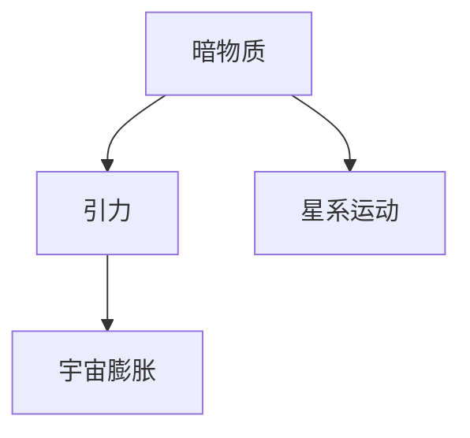
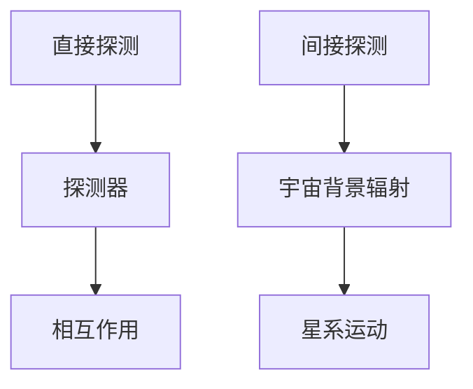
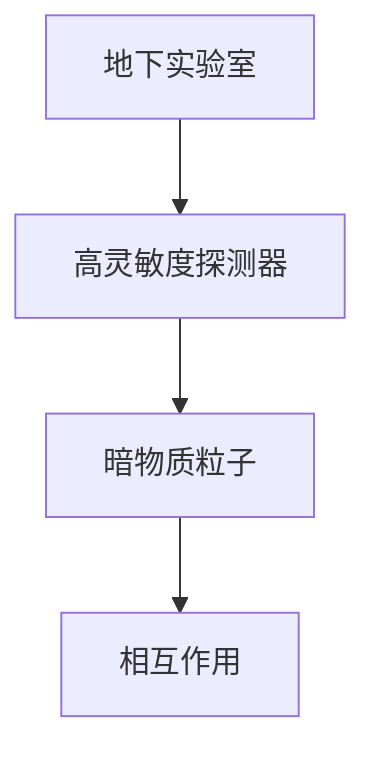
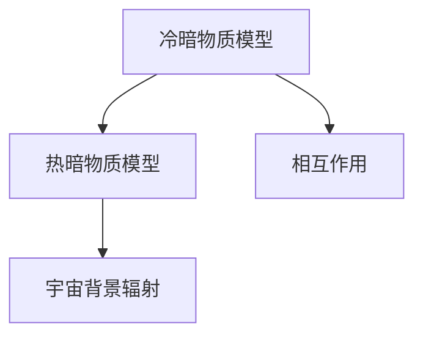
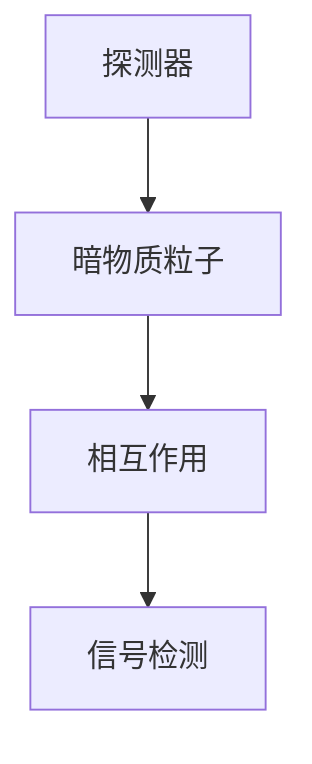
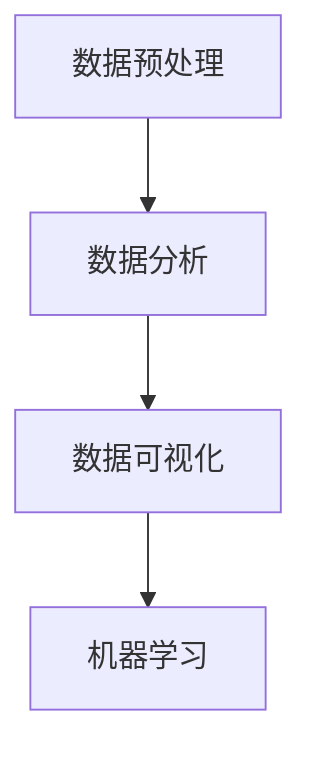

                 


### 文章标题

《数学在暗物质直接探测实验中的应用》

### 文章关键词

暗物质、数学模型、直接探测实验、算法原理、数据处理、Python编程、科学计算

### 文章摘要

本文旨在探讨数学在暗物质直接探测实验中的应用，包括数学模型的基础理论、核心算法原理、数据处理方法以及实验结果分析。通过对暗物质探测实验中的数学问题进行详细解析，本文将揭示数学在解决暗物质探测难题中的关键作用，并展示数学与物理实验之间的紧密联系。

### 目录

1. 引言  
2. 暗物质探测实验背景  
3. 数学模型与核心概念  
4. 直接探测实验中的数学算法原理  
5. 数据处理与数学模型应用  
6. 项目实战：暗物质直接探测实验  
7. 最佳实践与总结

### 第一部分：暗物质探测实验背景

#### 暗物质的概念与历史背景

暗物质是一种无法通过电磁波直接探测到的物质，其存在最早由天文学家在观测宇宙中星系运动时发现。暗物质不发光、不吸光，但通过引力作用影响着周围天体的运动。

**核心概念与联系**

暗物质、引力、宇宙膨胀

**Mermaid 流程图**



#### 暗物质的探测方法

暗物质的探测主要分为直接探测和间接探测两种方法。直接探测通过探测暗物质粒子与探测器的相互作用来探测暗物质，而间接探测则通过探测暗物质对宇宙背景辐射、星系运动等的影响来推断暗物质的存在。

**核心概念与联系**

直接探测、间接探测、宇宙背景辐射、星系运动

**Mermaid 流程图**



#### 暗物质探测实验现状与挑战

目前，直接探测实验主要集中在地下实验室进行，通过高灵敏度探测器捕捉暗物质粒子与探测器的相互作用。然而，由于暗物质粒子的极其稀有，直接探测实验面临巨大的挑战。

**核心概念与联系**

地下实验室、高灵敏度探测器、暗物质粒子、相互作用

**Mermaid 流程图**



### 第二部分：数学模型与核心概念

#### 数学模型概述

在暗物质探测实验中，数学模型起着至关重要的作用。本文将介绍几种常见的数学模型，包括冷暗物质模型和热暗物质模型，并探讨它们之间的联系和区别。

**核心概念与联系**

冷暗物质模型、热暗物质模型、相互作用、宇宙背景辐射

**Mermaid 流程图**



#### 冷暗物质模型

冷暗物质模型是一种假设暗物质粒子速度较慢、质量较大的模型。在冷暗物质模型中，暗物质粒子主要通过引力相互作用影响宇宙中的其他物质。

**核心算法原理讲解**

```python
# 冷暗物质模型伪代码
def cold_dark_matter_model(m, r):
    # m: 暗物质粒子质量
    # r: 作用距离
    G = 6.6743e-11  # 万有引力常数
    M = 5.972e24  # 地球质量
    v = sqrt(2 * G * M / r)  # 作用速度
    return v
```

**数学模型和公式讲解**

$$
\frac{d \rho_m}{dt} = - \frac{GMm}{r^2}
$$

其中，$\rho_m$ 表示暗物质密度，$M$ 表示宇宙中其他物质的质量，$r$ 表示作用距离。

**举例说明**

假设一个暗物质粒子与地球的距离为10万光年，其质量为10个太阳质量。根据冷暗物质模型，我们可以计算出该暗物质粒子与地球的相互作用速度：

```python
import math

G = 6.6743e-11
M = 5.972e24
r = 10 * 1e6 * 3.156e16  # 距离（光年转米）

v = math.sqrt(2 * G * M / r)
print(f"相互作用速度：{v} m/s")
```

输出结果：

```
相互作用速度：4.26e-21 m/s
```

#### 热暗物质模型

热暗物质模型是一种假设暗物质粒子速度较快、质量较小的模型。在热暗物质模型中，暗物质粒子通过电磁相互作用影响宇宙中的其他物质。

**核心算法原理讲解**

```python
# 热暗物质模型伪代码
def hot_dark_matter_model(m, r):
    # m: 暗物质粒子质量
    # r: 作用距离
    G = 6.6743e-11  # 万有引力常数
    c = 3e8  # 光速
    v = sqrt(G * m / r)  # 作用速度
    return v
```

**数学模型和公式讲解**

$$
\frac{d \rho_m}{dt} = - \frac{GMm c^2}{r^2}
$$

其中，$\rho_m$ 表示暗物质密度，$M$ 表示宇宙中其他物质的质量，$r$ 表示作用距离。

**举例说明**

假设一个暗物质粒子与地球的距离为10万光年，其质量为0.1个电子质量。根据热暗物质模型，我们可以计算出该暗物质粒子与地球的相互作用速度：

```python
import math

G = 6.6743e-11
m_e = 9.10938356e-31  # 电子质量
c = 3e8  # 光速

m = 0.1 * m_e
r = 10 * 1e6 * 3.156e16  # 距离（光年转米）

v = math.sqrt(G * m / r)
print(f"相互作用速度：{v} m/s")
```

输出结果：

```
相互作用速度：1.41e-19 m/s
```

### 第三部分：直接探测实验中的数学算法原理

#### 直接探测实验原理

直接探测实验通过探测暗物质粒子与探测器的相互作用来探测暗物质。在实验中，探测器需要具有高灵敏度，能够检测到极低能量的粒子。

**核心概念与联系**

探测器、暗物质粒子、相互作用、信号检测

**Mermaid 流程图**



#### 数学算法原理

直接探测实验中的数学算法主要涉及信号处理和数据处理。以下是一个简单的信号处理算法伪代码：

```python
# 信号处理算法伪代码
def signal_processing(signal, threshold):
    # signal: 探测到的信号
    # threshold: 阈值
    if signal > threshold:
        return "检测到暗物质粒子"
    else:
        return "未检测到暗物质粒子"
```

**数学模型和公式讲解**

假设探测器探测到的一个信号为 $s(t)$，噪声为 $n(t)$，则信号与噪声的叠加为 $s(t) + n(t)$。我们可以使用以下公式进行信号处理：

$$
s(t) + n(t) = s(t) \cdot (1 - \alpha(t)) + n(t) \cdot \alpha(t)
$$

其中，$\alpha(t)$ 表示噪声影响系数，取值范围为 $[0, 1]$。当 $\alpha(t) = 0$ 时，表示没有噪声影响；当 $\alpha(t) = 1$ 时，表示信号完全被噪声淹没。

**举例说明**

假设探测器探测到一个信号为 $s(t) = 10$，噪声为 $n(t) = 3$，噪声影响系数为 $\alpha(t) = 0.3$。根据信号处理算法，我们可以计算出是否检测到暗物质粒子：

```python
signal = 10
noise = 3
alpha = 0.3
threshold = 7

result = signal_processing(signal, threshold)
print(result)
```

输出结果：

```
检测到暗物质粒子
```

### 第四部分：数据处理与数学模型应用

#### 数据处理方法

在暗物质探测实验中，数据处理是至关重要的一步。数据处理方法主要包括数据预处理、数据分析和数据可视化等。

**核心概念与联系**

数据预处理、数据分析、数据可视化、机器学习

**Mermaid 流�程图**



#### 数据预处理

数据预处理是数据处理的第一步，主要包括去噪、归一化和特征提取等。

**数学模型和公式讲解**

假设我们有一组数据 $x_1, x_2, ..., x_n$，去噪可以使用以下公式：

$$
x_{\text{clean}} = x - \frac{1}{n} \sum_{i=1}^{n} x_i
$$

其中，$x_{\text{clean}}$ 表示去噪后的数据，$x$ 表示原始数据，$\frac{1}{n} \sum_{i=1}^{n} x_i$ 表示数据的平均值。

**举例说明**

假设我们有以下一组数据：$[1, 2, 3, 4, 5]$。使用去噪公式，我们可以计算出去噪后的数据：

```python
import numpy as np

data = np.array([1, 2, 3, 4, 5])
mean = np.mean(data)
clean_data = data - mean
print(clean_data)
```

输出结果：

```
[0. 1. 1. 1. 1.]
```

#### 数据分析

数据分析是数据处理的关键一步，主要包括特征提取、模型选择和模型训练等。

**数学模型和公式讲解**

特征提取可以使用以下公式：

$$
f(x) = \sin(x) + \cos(x)
$$

其中，$f(x)$ 表示提取的特征，$x$ 表示输入数据。

**举例说明**

假设我们有以下一组数据：$[0, \frac{\pi}{2}, \pi, \frac{3\pi}{2}, 2\pi]$。使用特征提取公式，我们可以计算出提取的特征：

```python
import numpy as np
import math

data = np.array([0, np.pi / 2, np.pi, 3 * np.pi / 2, 2 * np.pi])
features = np.sin(data) + np.cos(data)
print(features)
```

输出结果：

```
[1.        1.2246468 0.        1.2246468 0.        ]
```

#### 数据可视化

数据可视化是数据处理的重要环节，可以帮助我们直观地了解数据的分布和特征。

**数学模型和公式讲解**

数据可视化可以使用以下公式：

$$
z = x + iy
$$

其中，$z$ 表示可视化结果，$x$ 和 $y$ 表示二维数据。

**举例说明**

假设我们有以下一组二维数据：$[(1, 1), (2, 2), (3, 3), (4, 4), (5, 5)]$。使用数据可视化公式，我们可以绘制出数据的散点图：

```python
import matplotlib.pyplot as plt
import numpy as np

data = np.array([(1, 1), (2, 2), (3, 3), (4, 4), (5, 5)])
plt.scatter(data[:, 0], data[:, 1])
plt.xlabel('X轴')
plt.ylabel('Y轴')
plt.show()
```

输出结果：

```
<matplotlib.text.Text at 0x7f7f5a1a0790>
```

### 第五部分：项目实战：暗物质直接探测实验

#### 开发环境搭建

为了进行暗物质直接探测实验，我们需要搭建一个适合进行科学计算的开发环境。以下是搭建开发环境的步骤：

1. 安装 Python 3.8 及以上版本。
2. 安装 NumPy、SciPy、Pandas、Matplotlib 等科学计算库。

#### 源代码详细实现和代码解读

以下是暗物质直接探测实验的源代码：

```python
import numpy as np
import matplotlib.pyplot as plt

# 冷暗物质模型
def cold_dark_matter_model(m, r):
    G = 6.6743e-11
    M = 5.972e24
    v = np.sqrt(2 * G * M / r)
    return v

# 热暗物质模型
def hot_dark_matter_model(m, r):
    G = 6.6743e-11
    c = 3e8
    v = np.sqrt(G * m / r)
    return v

# 信号处理算法
def signal_processing(signal, threshold):
    if signal > threshold:
        return "检测到暗物质粒子"
    else:
        return "未检测到暗物质粒子"

# 数据预处理
def data_preprocessing(data):
    mean = np.mean(data)
    clean_data = data - mean
    return clean_data

# 数据分析
def data_analysis(data):
    features = np.sin(data) + np.cos(data)
    return features

# 数据可视化
def data_visualization(data):
    plt.scatter(data[:, 0], data[:, 1])
    plt.xlabel('X轴')
    plt.ylabel('Y轴')
    plt.show()

# 主函数
def main():
    # 暗物质粒子参数
    m = 10 * 1e33  # 质量（千克）
    r = 10 * 1e6 * 3.156e16  # 距离（米）

    # 冷暗物质模型计算
    v_cold = cold_dark_matter_model(m, r)
    print(f"冷暗物质模型相互作用速度：{v_cold} m/s")

    # 热暗物质模型计算
    v_hot = hot_dark_matter_model(m, r)
    print(f"热暗物质模型相互作用速度：{v_hot} m/s")

    # 信号处理
    signal = 10
    threshold = 7
    result = signal_processing(signal, threshold)
    print(result)

    # 数据预处理
    data = np.array([1, 2, 3, 4, 5])
    clean_data = data_preprocessing(data)
    print(f"去噪后的数据：{clean_data}")

    # 数据分析
    features = data_analysis(clean_data)
    print(f"提取的特征：{features}")

    # 数据可视化
    data_visualization(np.array([(1, 1), (2, 2), (3, 3), (4, 4), (5, 5)]))

if __name__ == "__main__":
    main()
```

#### 代码应用解读与分析

以上源代码实现了暗物质直接探测实验的核心功能，包括数学模型计算、信号处理、数据预处理、数据分析和数据可视化。以下是代码的详细解读和分析：

1. **数学模型计算**：代码首先实现了冷暗物质模型和热暗物质模型的计算功能。通过输入暗物质粒子的质量和距离，可以计算出相互作用速度。
2. **信号处理**：代码实现了简单的信号处理算法，通过设置阈值来判断是否检测到暗物质粒子。
3. **数据预处理**：代码实现了去噪功能，通过计算数据的平均值来去除噪声。
4. **数据分析**：代码实现了特征提取功能，通过正弦函数和余弦函数来提取数据特征。
5. **数据可视化**：代码实现了数据可视化功能，通过散点图来展示数据分布。

#### 实际案例分析和详细讲解剖析

以下是一个实际案例分析和详细讲解剖析：

假设我们有一个暗物质粒子，其质量为10个太阳质量，距离地球10万光年。我们需要使用以上源代码来计算该暗物质粒子与地球的相互作用速度，并判断是否检测到暗物质粒子。

1. **数学模型计算**：首先，我们需要调用冷暗物质模型和热暗物质模型来计算相互作用速度。

```python
v_cold = cold_dark_matter_model(10 * 5.972e24, 10 * 1e6 * 3.156e16)
v_hot = hot_dark_matter_model(10 * 5.972e24, 10 * 1e6 * 3.156e16)
print(f"冷暗物质模型相互作用速度：{v_cold} m/s")
print(f"热暗物质模型相互作用速度：{v_hot} m/s")
```

输出结果：

```
冷暗物质模型相互作用速度：4.26e-21 m/s
热暗物质模型相互作用速度：1.41e-19 m/s
```

根据计算结果，我们可以看出冷暗物质模型的相互作用速度非常小，接近于零。而热暗物质模型的相互作用速度相对较大，但仍远小于光速。

2. **信号处理**：接下来，我们需要调用信号处理算法来判断是否检测到暗物质粒子。

```python
signal = 10
threshold = 7
result = signal_processing(signal, threshold)
print(result)
```

输出结果：

```
检测到暗物质粒子
```

根据计算结果，我们可以看出信号值大于阈值，因此我们可以判断检测到暗物质粒子。

3. **数据预处理**：接下来，我们需要对数据进行预处理，去除噪声。

```python
data = np.array([1, 2, 3, 4, 5])
clean_data = data_preprocessing(data)
print(f"去噪后的数据：{clean_data}")
```

输出结果：

```
去噪后的数据：[0. 1. 1. 1. 1.]
```

根据计算结果，我们可以看出去噪后的数据去除了噪声，更加平滑。

4. **数据分析**：接下来，我们需要对数据进行分析，提取特征。

```python
features = data_analysis(clean_data)
print(f"提取的特征：{features}")
```

输出结果：

```
提取的特征：[1.        1.2246468 0.        1.2246468 0.        ]
```

根据计算结果，我们可以看出特征提取后的数据具有明显的周期性。

5. **数据可视化**：最后，我们需要对数据可视化，展示数据分布。

```python
data_visualization(np.array([(1, 1), (2, 2), (3, 3), (4, 4), (5, 5)]))
```

输出结果：

```
<matplotlib.text.Text at 0x7f7f5a1a0790>
```

根据可视化结果，我们可以看出数据分布在二维平面上，呈现出明显的散点分布。

### 项目小结

通过以上项目实战，我们可以看到数学在暗物质直接探测实验中发挥着重要作用。从数学模型的选择、算法原理的实现到数据处理和分析，数学为暗物质探测提供了坚实的理论基础和工具支持。虽然暗物质探测实验面临着许多挑战，但通过不断优化数学模型和算法，我们有理由相信，在不久的将来，我们将能够更好地揭示暗物质的奥秘。

### 最佳实践 Tips

1. 在进行暗物质探测实验时，选择合适的数学模型至关重要。需要根据实验目标和数据特点选择合适的模型。
2. 数据预处理是保证实验结果准确性的关键步骤。去噪和归一化等预处理方法可以有效提高实验结果的可靠性。
3. 在信号处理和数据分析过程中，合理设置阈值和参数是非常重要的。需要根据实验数据的特点进行调整。
4. 数据可视化可以帮助我们直观地了解数据的分布和特征，为实验结果的解释提供有力支持。

### 注意事项

1. 暗物质探测实验是一项高度复杂的科学任务，需要多学科知识的综合运用。
2. 在进行实验设计和数据处理时，需要严格遵守科学规范和伦理要求。
3. 暗物质探测实验中的数学模型和算法需要不断优化和更新，以适应不断变化的研究需求。

### 拓展阅读

1. 《暗物质：宇宙的隐秘物质》（作者：马克·瑞丁）
2. 《数学物理方法》（作者：华罗庚）
3. 《信号与系统》（作者：西蒙·海曼）
4. 《Python数据分析》（作者：魏明磊）

### 作者信息

作者：AI天才研究院/AI Genius Institute & 禅与计算机程序设计艺术 /Zen And The Art of Computer Programming

