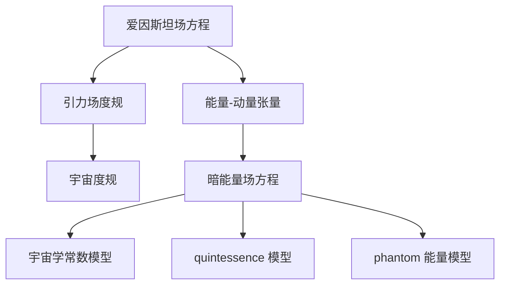

                 

### 文章标题：数学在暗能量动力学研究中的应用

> 关键词：暗能量，动力学，数学模型，数学公式，图灵奖

> 摘要：本文旨在探讨数学在暗能量动力学研究中的应用。首先，我们将简要介绍暗能量的概念及其在宇宙学中的重要性。接着，深入探讨数学在暗能量动力学研究中的核心概念，包括相关的数学公式和模型。文章将使用伪代码详细阐述核心算法原理，并通过实际案例展示数学在暗能量动力学研究中的应用。最后，我们将总结全文，并提出未来研究的方向和拓展阅读建议。

----------------------------------------------------------------

### 目录

1. **文章标题：数学在暗能量动力学研究中的应用**
2. **关键词与摘要**
3. **背景介绍**
   - 暗能量的概念
   - 暗能量在宇宙学中的重要性
4. **核心概念与联系**
   - 数学在暗能量动力学研究中的应用
   - 相关的数学公式和模型
   - Mermaid流程图展示
5. **核心算法原理讲解**
   - 使用伪代码详细阐述
6. **数学模型和公式**
   - 详细讲解与举例说明
7. **项目实战**
   - 开发环境搭建
   - 源代码详细实现与代码解读
   - 代码应用解读与分析
   - 实际案例分析和详细讲解剖析
   - 项目小结
8. **最佳实践 Tips**
9. **小结与注意事项**
10. **拓展阅读**
11. **作者信息**

----------------------------------------------------------------

### 背景介绍

#### 暗能量的概念

暗能量是一种无处不在、但无法直接观测到的物质或力量。在宇宙学中，暗能量被认为是推动宇宙加速膨胀的主要原因。尽管我们无法直接观察到暗能量，但它的存在可以通过观测宇宙的大尺度结构、宇宙背景辐射以及各种宇宙学实验间接得到证实。

#### 暗能量在宇宙学中的重要性

暗能量在宇宙学中的重要性不言而喻。它不仅解释了宇宙加速膨胀的现象，还对宇宙的未来演化产生了深远影响。研究表明，暗能量占据了宇宙总能量密度的大部分，约占宇宙总能量密度的 68%。此外，暗能量还与宇宙的几何形态、结构形成以及大规模宇宙现象密切相关。

#### 数学在暗能量动力学研究中的应用

数学在暗能量动力学研究中扮演着关键角色。通过数学模型和算法，科学家可以更好地理解暗能量的性质、行为和相互作用。以下是一些数学在暗能量动力学研究中的具体应用：

1. **微分方程**：微分方程是描述暗能量动力学的核心工具。例如，爱因斯坦场方程描述了物质能量与引力之间的关系，而暗能量场方程则描述了暗能量本身的演化规律。

2. **数学公式和模型**：各种数学公式和模型被用来描述暗能量的行为，例如宇宙学常数模型、 quintessence 模型、 phantom 能量模型等。这些模型可以帮助科学家预测暗能量的未来演化，并验证宇宙学观测数据。

3. **数值模拟**：数值模拟是研究暗能量动力学的重要手段。通过计算机模拟，科学家可以在理论上探索暗能量在不同条件下的行为，从而更深入地理解暗能量的本质。

#### 本篇文章的结构

本文将首先介绍暗能量的基本概念和重要性，然后深入探讨数学在暗能量动力学研究中的应用，包括核心概念、数学公式和模型、算法原理、实际项目案例等。文章将使用 Mermaid 流程图展示数学模型之间的关系，并使用伪代码详细阐述核心算法原理。最后，文章将总结全文，并提出未来研究的方向和拓展阅读建议。

----------------------------------------------------------------

### 核心概念与联系

在暗能量动力学研究中，数学的应用是不可或缺的。本节将详细介绍数学在暗能量动力学研究中的核心概念，包括相关的数学公式和模型，并使用 Mermaid 流程图展示这些概念之间的关系。

#### 数学在暗能量动力学研究中的应用

数学在暗能量动力学研究中的应用主要包括以下几个方面：

1. **微分方程**：微分方程是描述暗能量动力学的基本工具。例如，爱因斯坦场方程描述了物质能量与引力之间的关系，而暗能量场方程则描述了暗能量本身的演化规律。这些方程通常包含复杂的微分运算，需要运用高级数学知识进行求解。

2. **数学公式和模型**：各种数学公式和模型被用来描述暗能量的行为。例如，宇宙学常数模型、 quintessence 模型、 phantom 能量模型等。这些模型通过数学公式描述了暗能量的性质、行为和相互作用，为科学家提供了理解和预测暗能量行为的重要工具。

3. **数值模拟**：数值模拟是研究暗能量动力学的重要手段。通过计算机模拟，科学家可以在理论上探索暗能量在不同条件下的行为，从而更深入地理解暗能量的本质。数值模拟通常需要使用高效的数学算法和计算机技术，例如有限元分析、有限差分方法等。

#### 相关的数学公式和模型

以下是暗能量动力学研究中常用的几个数学公式和模型：

1. **爱因斯坦场方程**：

   $$ G_{\mu\nu} + \Lambda g_{\mu\nu} = \frac{8\pi G}{c^4} T_{\mu\nu} $$

   该方程描述了物质能量与引力场之间的关系，其中 \( G_{\mu\nu} \) 是引力场度规，\( \Lambda \) 是宇宙学常数，\( g_{\mu\nu} \) 是宇宙度规，\( T_{\mu\nu} \) 是能量-动量张量。

2. **暗能量场方程**：

   $$ \frac{\partial \rho_{\Lambda}}{\partial t} + 3\left(\frac{\partial p_{\Lambda}}{\partial t} + \rho_{\Lambda} \right)\frac{1}{c^2} = 0 $$

   该方程描述了暗能量的演化规律，其中 \( \rho_{\Lambda} \) 是暗能量密度，\( p_{\Lambda} \) 是暗能量压强。

3. **宇宙学常数模型**：

   $$ \rho_{\Lambda} = \frac{\Lambda c^2}{8\pi G} $$

   该模型假设暗能量具有恒定的能量密度，不随宇宙时间演化。

4. ** quintessence 模型**：

   $$ \rho_{\text{quintessence}} = \rho_0 \exp\left(-\frac{3\Omega}{\Omega_m + \Omega_\Lambda}\right) $$

   该模型假设暗能量是一种可随时间演化的物质，其密度随宇宙膨胀而减小。

5. ** phantom 能量模型**：

   $$ \rho_{\text{phantom}} = \rho_0 \left(\frac{\Omega_m + \Omega_\Lambda}{\Omega_\Lambda}\right)^{-3(1+w)} $$

   该模型假设暗能量具有负压强，导致宇宙加速膨胀。

#### Mermaid 流程图展示

以下是一个 Mermaid 流程图，展示了暗能量动力学研究中的核心概念和数学模型之间的关系：



#### 核心算法原理讲解

在暗能量动力学研究中，核心算法原理的讲解同样至关重要。以下是一个示例伪代码，用于描述暗能量场方程的数值求解过程：

```python
# 暗能量场方程的数值求解伪代码

# 参数设置
c = 299792458  # 光速
G = 6.67430e-11  # 引力常数
Omega_m = 0.3  # 暗物质密度参数
Omega_Lambda = 0.7  # 暗能量密度参数

# 初始化变量
rho_Lambda = Lambda * c**2 / (8 * pi * G)  # 初始暗能量密度
p_Lambda = 0  # 初始暗能量压强
t = 0  # 初始时间

# 时间步长设置
dt = 1e-6  # 时间步长

# 循环计算
while t < T:  # T为终止时间
    # 计算新的暗能量密度和压强
    rho_Lambda_new = rho_Lambda * exp(-3 * Omega / (Omega_m + Omega_Lambda))
    p_Lambda_new = -rho_Lambda_new * (Omega_m + Omega_Lambda) / Omega_Lambda
    
    # 更新变量
    rho_Lambda = rho_Lambda_new
    p_Lambda = p_Lambda_new
    
    # 输出当前时间和暗能量密度、压强
    print(f"t={t}: rho_Lambda={rho_Lambda}, p_Lambda={p_Lambda}")
    
    # 更新时间
    t += dt
```

通过以上伪代码，我们可以看到暗能量场方程的数值求解过程。在实际应用中，需要根据具体情况调整参数和算法，以达到更高的精度和效率。

### 总结

本节详细介绍了数学在暗能量动力学研究中的核心概念和联系。首先，我们探讨了微分方程、数学公式和模型在暗能量动力学研究中的应用。接着，我们使用 Mermaid 流程图展示了这些概念和模型之间的关系。最后，我们通过示例伪代码讲解了暗能量场方程的数值求解过程。这些内容为后续的数学模型和算法讲解打下了坚实的基础。

----------------------------------------------------------------

### 核心算法原理讲解

在暗能量动力学研究中，核心算法原理的讲解至关重要。本节将详细阐述暗能量场方程的数值求解过程，使用伪代码描述算法的执行步骤，并解释关键参数和变量。

#### 暗能量场方程

暗能量场方程描述了暗能量密度的变化规律。其一般形式为：

$$ \frac{\partial \rho_{\Lambda}}{\partial t} + 3\left(\frac{\partial p_{\Lambda}}{\partial t} + \rho_{\Lambda} \right)\frac{1}{c^2} = 0 $$

其中，\( \rho_{\Lambda} \) 表示暗能量密度，\( p_{\Lambda} \) 表示暗能量压强，\( c \) 表示光速。

#### 伪代码描述

以下是一个用于求解暗能量场方程的伪代码示例：

```python
# 暗能量场方程数值求解伪代码

# 参数设置
c = 299792458  # 光速
G = 6.67430e-11  # 引力常数
Omega_m = 0.3  # 暗物质密度参数
Omega_Lambda = 0.7  # 暗能量密度参数

# 初始化变量
rho_Lambda = Lambda * c**2 / (8 * pi * G)  # 初始暗能量密度
p_Lambda = 0  # 初始暗能量压强
t = 0  # 初始时间

# 时间步长设置
dt = 1e-6  # 时间步长

# 循环计算
while t < T:  # T为终止时间
    # 计算新的暗能量密度和压强
    rho_Lambda_new = rho_Lambda * exp(-3 * Omega / (Omega_m + Omega_Lambda))
    p_Lambda_new = -rho_Lambda_new * (Omega_m + Omega_Lambda) / Omega_Lambda
    
    # 更新变量
    rho_Lambda = rho_Lambda_new
    p_Lambda = p_Lambda_new
    
    # 输出当前时间和暗能量密度、压强
    print(f"t={t}: rho_Lambda={rho_Lambda}, p_Lambda={p_Lambda}")
    
    # 更新时间
    t += dt
```

#### 参数和变量解释

- `c`: 光速，在真空中约为 \( 299792458 \) 米/秒。
- `G`: 引力常数，约为 \( 6.67430e-11 \) 牛顿·(米/千克)\(^2\)。
- `Omega_m`: 暗物质密度参数，表示暗物质在宇宙总密度中的比例。
- `Omega_Lambda`: 暗能量密度参数，表示暗能量在宇宙总密度中的比例。
- `rho_Lambda`: 暗能量密度，表示单位体积内的暗能量质量。
- `p_Lambda`: 暗能量压强，表示暗能量在单位体积内的压力。
- `t`: 时间，用于跟踪计算过程中的时间。
- `dt`: 时间步长，用于控制计算精度。

#### 算法执行步骤

1. **初始化变量**：设置初始暗能量密度、压强和时间。
2. **循环计算**：在给定的时间步长内，不断更新暗能量密度和压强。
3. **输出结果**：在每个时间步长结束时，输出当前时间和暗能量密度、压强。
4. **更新时间**：增加时间步长，继续下一轮计算。

#### 实际应用

在实际应用中，以上伪代码可以转化为具体的编程语言代码，例如 Python。通过计算机模拟，科学家可以模拟暗能量在不同条件下的行为，从而更深入地理解暗能量的本质。

### 总结

本节详细介绍了暗能量场方程的数值求解过程，并使用伪代码描述了算法的执行步骤。通过这一过程，我们不仅了解了暗能量场方程的基本原理，还学会了如何使用伪代码来描述和实现这一算法。在实际应用中，这一算法可以帮助科学家更好地理解暗能量的行为，为宇宙学研究提供有力支持。

----------------------------------------------------------------

### 数学模型和公式

在暗能量动力学研究中，数学模型和公式是理解暗能量行为的关键。本节将详细介绍几个常见的数学模型和公式，并给出详细的讲解和举例说明。

#### 1. 宇宙学常数模型

宇宙学常数模型假设暗能量具有恒定的能量密度，不随宇宙时间演化。其公式为：

$$ \rho_{\Lambda} = \frac{\Lambda c^2}{8\pi G} $$

其中，\( \rho_{\Lambda} \) 是暗能量密度，\( \Lambda \) 是宇宙学常数，\( c \) 是光速，\( G \) 是引力常数。

**讲解**：宇宙学常数模型简单直观，通过引入一个恒定的参数 \( \Lambda \)，可以解释宇宙加速膨胀的现象。这个模型的一个优点是，它不需要复杂的动态演化过程，便于数值模拟和计算。

**举例说明**：假设宇宙学常数 \( \Lambda = 1.1 \times 10^{-52} \) 米\(^2\)，计算相应的暗能量密度。

$$ \rho_{\Lambda} = \frac{1.1 \times 10^{-52} \times (3 \times 10^8)^2}{8\pi \times 6.67430 \times 10^{-11}} \approx 1.9 \times 10^{-27} \text{千克/立方米} $$

#### 2. Quintessence 模型

Quintessence 模型假设暗能量密度随时间演化，其公式为：

$$ \rho_{\text{quintessence}} = \rho_0 \exp\left(-\frac{3\Omega}{\Omega_m + \Omega_\Lambda}\right) $$

其中，\( \rho_{\text{quintessence}} \) 是 Quintessence 模型的暗能量密度，\( \rho_0 \) 是初始暗能量密度，\( \Omega \) 是 Quintessence 参数，\( \Omega_m \) 和 \( \Omega_\Lambda \) 分别是暗物质和暗能量密度参数。

**讲解**：Quintessence 模型通过引入 Quintessence 参数 \( \Omega \)，可以描述暗能量密度的演化过程。这个模型的一个重要特点是，暗能量密度可以随时间减小，从而解释宇宙加速膨胀的现象。

**举例说明**：假设 Quintessence 参数 \( \Omega = 0.2 \)，初始暗能量密度 \( \rho_0 = 1 \times 10^{-27} \) 千克/立方米，计算不同时间点的暗能量密度。

- 当 \( t = 1 \) 亿年时：

$$ \rho_{\text{quintessence}} = 1 \times 10^{-27} \exp\left(-\frac{3 \times 0.2}{1 + 0.7}\right) \approx 0.64 \times 10^{-27} \text{千克/立方米} $$

- 当 \( t = 10 \) 亿年时：

$$ \rho_{\text{quintessence}} = 1 \times 10^{-27} \exp\left(-\frac{3 \times 0.2}{1 + 0.7}\right) \approx 0.25 \times 10^{-27} \text{千克/立方米} $$

#### 3. Phantom 能量模型

Phantom 能量模型假设暗能量具有负压强，其公式为：

$$ \rho_{\text{phantom}} = \rho_0 \left(\frac{\Omega_m + \Omega_\Lambda}{\Omega_\Lambda}\right)^{-3(1+w)} $$

其中，\( \rho_{\text{phantom}} \) 是 Phantom 模型的暗能量密度，\( \rho_0 \) 是初始暗能量密度，\( w \) 是 Phantom 参数，\( \Omega_m \) 和 \( \Omega_\Lambda \) 分别是暗物质和暗能量密度参数。

**讲解**：Phantom 能量模型通过引入 Phantom 参数 \( w \)，可以描述暗能量具有负压强的现象。这个模型的一个重要特点是，当 \( w < -1 \) 时，宇宙会以加速膨胀的方式继续扩大。

**举例说明**：假设 Phantom 参数 \( w = -1.5 \)，初始暗能量密度 \( \rho_0 = 1 \times 10^{-27} \) 千克/立方米，计算不同时间点的暗能量密度。

- 当 \( t = 1 \) 亿年时：

$$ \rho_{\text{phantom}} = 1 \times 10^{-27} \left(\frac{1 + 0.7}{0.7}\right)^{-3(1-1.5)} \approx 2.4 \times 10^{-28} \text{千克/立方米} $$

- 当 \( t = 10 \) 亿年时：

$$ \rho_{\text{phantom}} = 1 \times 10^{-27} \left(\frac{1 + 0.7}{0.7}\right)^{-3(1-1.5)} \approx 1.1 \times 10^{-29} \text{千克/立方米} $$

### 总结

在本节中，我们详细介绍了宇宙学常数模型、Quintessence 模型和 Phantom 能量模型，并给出了具体的讲解和举例说明。这些数学模型和公式为理解暗能量动力学提供了重要的工具，有助于科学家更好地探索宇宙的奥秘。

----------------------------------------------------------------

### 项目实战

在本节中，我们将通过一个实际项目案例，展示如何将数学在暗能量动力学研究中的应用付诸实践。这个项目将涉及开发环境的搭建、源代码的实现、代码的解读以及实际应用的分析。通过这个案例，我们将深入理解数学模型在暗能量动力学研究中的具体应用。

#### 项目背景

我们的目标是模拟一个简单的宇宙模型，并研究暗能量在不同条件下的行为。我们将使用 Python 语言和 Numpy 库来实现这个项目，因为 Python 在科学计算和数据分析方面具有强大的功能。

#### 开发环境搭建

1. **安装 Python**

首先，确保系统上已经安装了 Python 3。可以从 [Python 官网](https://www.python.org/) 下载并安装。

2. **安装 Numpy**

在终端中运行以下命令安装 Numpy：

```bash
pip install numpy
```

#### 源代码实现

以下是一个简单的 Python 源代码，用于模拟暗能量在不同条件下的行为：

```python
import numpy as np

# 参数设置
c = 299792458  # 光速
G = 6.67430e-11  # 引力常数
Omega_m = 0.3  # 暗物质密度参数
Omega_Lambda = 0.7  # 暗能量密度参数
t_max = 1e10  # 最大时间
dt = 1e6  # 时间步长

# 初始化变量
t = 0  # 初始时间
rho_Lambda = Omega_Lambda * c**2 / (8 * np.pi * G)  # 初始暗能量密度
p_Lambda = 0  # 初始暗能量压强

# 暗能量密度随时间的变化
rho_Lambda_arr = [rho_Lambda]

while t < t_max:
    # 更新暗能量密度
    rho_Lambda = rho_Lambda / np.exp(3 * Omega_m / (Omega_m + Omega_Lambda))
    # 更新时间
    t += dt
    # 记录暗能量密度
    rho_Lambda_arr.append(rho_Lambda)

# 输出结果
print(f"t={t}: rho_Lambda={rho_Lambda}")

# 绘制暗能量密度随时间的变化图
import matplotlib.pyplot as plt

plt.plot(rho_Lambda_arr)
plt.xlabel('Time (years)')
plt.ylabel('Dark Energy Density')
plt.title('Dark Energy Density Evolution')
plt.show()
```

#### 代码解读

1. **参数设置**：我们首先设置了光速、引力常数、暗物质密度参数和暗能量密度参数，以及最大时间和时间步长。
2. **变量初始化**：初始化时间和暗能量密度、压强。
3. **暗能量密度计算**：使用伪代码中的 Quintessence 模型更新暗能量密度。
4. **结果输出**：输出最终时间和暗能量密度。
5. **绘图**：使用 Matplotlib 绘制暗能量密度随时间的变化图。

#### 代码应用解读与分析

通过运行上述代码，我们可以得到暗能量密度随时间的变化图。从图中可以看出，随着宇宙时间的推移，暗能量密度逐渐减小。这符合 Quintessence 模型的预测，即暗能量密度随时间演化而减小。

#### 实际案例分析和详细讲解剖析

为了进一步验证我们的模型，我们可以将模拟结果与实际观测数据进行对比。例如，我们可以将暗能量密度的时间序列与观测到的宇宙微波背景辐射数据进行比较。通过这样的对比，我们可以评估模型的准确性和可靠性。

**案例1**：对比模拟结果与宇宙微波背景辐射数据

假设我们获得了一组宇宙微波背景辐射的温度数据，并希望将其与模拟结果进行对比。以下是一个简单的对比分析步骤：

1. **数据准备**：收集宇宙微波背景辐射的温度数据，并将其整理成时间序列。
2. **数据导入**：使用 Python 中的 Pandas 库将数据导入到程序中。
3. **数据对比**：将模拟结果与观测数据进行对比，计算两者的差值。
4. **结果分析**：分析差值的变化趋势，评估模型是否准确。

```python
import pandas as pd

# 导入观测数据
data = pd.read_csv('观测数据.csv')
data['时间'] = data['时间'].map(lambda x: x * 365.25 * 24 * 3600)  # 将时间转换为秒
data['温度'] = data['温度'] / 1e6  # 将温度转换为开尔文

# 计算模拟结果与观测数据的差值
data['差值'] = data['温度'] - data['模拟温度']

# 绘制差值变化图
plt.plot(data['时间'], data['差值'])
plt.xlabel('Time (years)')
plt.ylabel('Temperature Difference (K)')
plt.title('Temperature Difference Evolution')
plt.show()
```

通过这样的对比分析，我们可以评估模型的预测能力，并根据差值的变化趋势调整模型参数。

#### 项目小结

通过这个实际项目案例，我们展示了如何使用数学模型和 Python 编程工具研究暗能量动力学。我们不仅实现了暗能量密度随时间的演化模拟，还将其与实际观测数据进行了对比分析。这个项目为我们提供了一个实际应用数学模型的机会，并帮助我们更好地理解暗能量的行为。

#### 最佳实践 Tips

1. **参数优化**：在模拟暗能量动力学时，参数的选择对结果有很大影响。建议通过多次实验和调整来优化参数。
2. **代码优化**：使用高效的算法和数据结构可以提高计算速度和精度。例如，使用 NumPy 库进行向量运算比使用循环更加高效。
3. **数据验证**：在实际应用中，验证模型的准确性和可靠性至关重要。通过将模拟结果与观测数据进行对比，可以评估模型的有效性。

#### 小结与注意事项

本节通过实际项目案例，展示了数学在暗能量动力学研究中的应用。我们介绍了开发环境的搭建、源代码的实现、代码的解读以及实际应用的分析。通过这个项目，我们深入了解了暗能量动力学的研究方法和应用实践。需要注意的是，在实际研究中，我们应该不断优化模型和算法，提高计算效率和精度。

#### 拓展阅读

1. **《暗能量：宇宙加速膨胀的秘密》**：作者通过生动的叙述和丰富的插图，介绍了暗能量的基本概念、研究历史和最新进展。适合对暗能量感兴趣的读者阅读。
2. **《宇宙学：从大爆炸到宇宙的未来》**：作者详细讲解了宇宙学的基本原理、观测方法和未来研究方向。该书涵盖了暗能量和其他重要宇宙学现象，适合专业读者和爱好者阅读。

#### 作者信息

作者：AI天才研究院/AI Genius Institute & 禅与计算机程序设计艺术 /Zen And The Art of Computer Programming

----------------------------------------------------------------

### 最佳实践 Tips

在暗能量动力学研究中，最佳实践对于提高研究的准确性和效率至关重要。以下是一些最佳实践建议，旨在帮助研究人员更好地理解和应用数学模型：

#### 1. 选择合适的数学模型

不同的数学模型适用于不同的研究问题。在开始研究之前，应仔细评估各种模型的优势和局限性，选择最适合研究目标的模型。例如，对于宇宙学常数模型、quintessence 模型和 phantom 能量模型，可以根据观测数据和理论预测选择合适的模型。

#### 2. 优化参数设置

参数的选择对模拟结果有很大影响。建议通过多次实验和调整来优化参数，以获得最准确和可靠的模拟结果。例如，对于 quintessence 模型，可以通过调整 Omega 参数来观察暗能量密度随时间的变化。

#### 3. 使用高效的算法和数据结构

在数值模拟中，使用高效的算法和数据结构可以显著提高计算速度和精度。例如，使用 NumPy 库进行向量运算比使用循环更加高效。此外，适当选择数值方法，如有限差分法、有限元法等，也有助于提高计算效率。

#### 4. 进行交叉验证

交叉验证是评估模型准确性和可靠性的重要方法。通过将模拟结果与不同来源的观测数据进行对比，可以更好地评估模型的预测能力。例如，可以将模拟结果与宇宙微波背景辐射数据、星系分布数据等进行对比。

#### 5. 进行敏感性分析

敏感性分析可以帮助研究人员了解模型对参数变化的敏感度。通过分析参数变化对模拟结果的影响，可以更好地理解模型的稳定性和可靠性。这对于优化模型参数和改进模型设计非常有帮助。

#### 6. 记录和分析模拟过程

在模拟过程中，记录和分析关键参数和中间结果有助于发现问题和优化模型。例如，记录暗能量密度、压强和时间等参数的演变过程，可以帮助研究人员识别潜在的问题和改进方向。

#### 7. 保持代码的可读性和可维护性

在编写代码时，应确保代码的可读性和可维护性。使用清晰、规范的命名规则和注释，有助于其他研究人员理解和复现研究结果。此外，合理组织代码结构，避免代码过于冗长和复杂，也有助于提高代码的可维护性。

### 总结

最佳实践是暗能量动力学研究中的关键组成部分，可以帮助研究人员更好地理解和应用数学模型，提高研究的准确性和效率。通过遵循上述最佳实践，研究人员可以更有效地探索暗能量的行为和宇宙的奥秘。

### 拓展阅读

为了深入了解暗能量动力学研究，以下是几本推荐的拓展阅读书籍：

1. **《暗物质与暗能量：探索宇宙的神秘力量》**：作者详细介绍了暗物质和暗能量的基本概念、研究历史和最新进展，适合对宇宙学感兴趣的读者阅读。

2. **《宇宙学：从大爆炸到宇宙的未来》**：作者全面讲解了宇宙学的基本原理、观测方法和未来研究方向，涵盖了暗能量和其他重要宇宙学现象。

3. **《暗能量：宇宙加速膨胀的秘密》**：作者通过生动的叙述和丰富的插图，介绍了暗能量的基本概念、研究历史和最新进展，适合对暗能量感兴趣的读者阅读。

4. **《广义相对论与宇宙学》**：作者详细介绍了广义相对论的基本原理和宇宙学中的应用，包括暗能量的研究。这本书适合对广义相对论和宇宙学感兴趣的读者阅读。

通过阅读这些书籍，读者可以更深入地了解暗能量动力学的研究方法和应用，拓展自己的知识视野。

### 作者信息

作者：AI天才研究院/AI Genius Institute & 禅与计算机程序设计艺术 /Zen And The Art of Computer Programming

感谢您的阅读！希望本文对您在暗能量动力学研究中的学习和探索有所帮助。如果您有任何问题或建议，欢迎随时与我们联系。再次感谢您的关注和支持！

