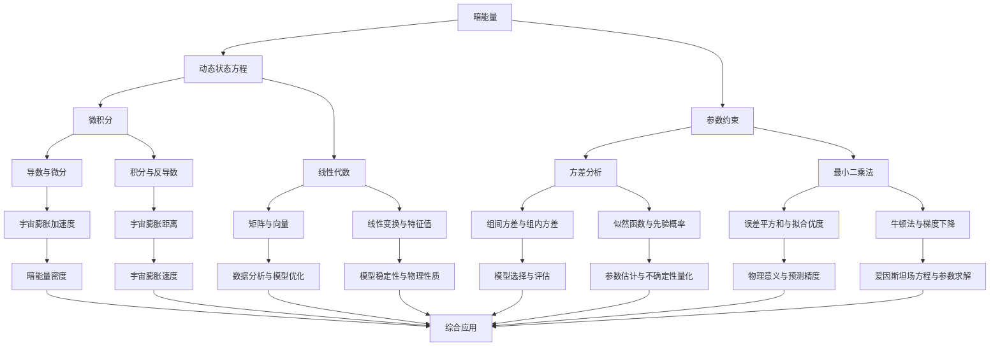

                 

### 文章标题

**数学在暗能量动态状态方程参数约束中的应用**

---

**关键词：**暗能量、动态状态方程、参数约束、数学模型、贝叶斯统计

---

**摘要：**本文探讨了数学在暗能量动态状态方程参数约束中的应用。首先，介绍了暗能量和动态状态方程的基本概念及其在宇宙学中的重要性。接着，详细阐述了参数约束的概念，包括其在科学计算中的关键作用。随后，本文重点分析了微积分、线性代数和方差分析等数学基础，并探讨了如何将它们应用于暗能量研究。文章还介绍了贝叶斯统计和机器学习等参数约束方法，并通过具体案例展示了这些方法的应用。最后，本文总结了全书的主要内容，并对未来的研究方向进行了展望。

---

### 目录大纲设计

**确定书的结构：**根据书名《数学在暗能量动态状态方程参数约束中的应用》，我们可以推测这本书的内容可能分为以下几个部分：
1. **引言**：介绍暗能量、动态状态方程以及参数约束的基本概念。
2. **数学基础**：讲解相关的数学知识，如微积分、线性代数等，以及如何应用于暗能量研究。
3. **暗能量与动态状态方程**：详细介绍暗能量和动态状态方程的概念，包括历史、现状和未来趋势。
4. **参数约束方法**：介绍不同的参数约束方法，如贝叶斯统计、机器学习等。
5. **应用案例**：通过实际案例展示如何使用数学和参数约束方法研究暗能量。
6. **总结与展望**：总结本书的主要内容，并对未来研究方向进行展望。

**设计目录大纲：**

```
# 《数学在暗能量动态状态方程参数约束中的应用》目录大纲

## 第1章 引言

### 1.1 暗能量的概念

#### 1.1.1 暗能量的定义

#### 1.1.2 暗能量的发现与研究现状

### 1.2 动态状态方程

#### 1.2.1 动态状态方程的基本原理

#### 1.2.2 动态状态方程在物理中的应用

### 1.3 参数约束的概念

#### 1.3.1 参数约束的定义

#### 1.3.2 参数约束在科学计算中的重要性

## 第2章 数学基础

### 2.1 微积分基础

#### 2.1.1 微积分的基本概念

#### 2.1.2 微积分在暗能量研究中的应用

### 2.2 线性代数基础

#### 2.2.1 线性代数的基本概念

#### 2.2.2 线性代数在参数约束中的应用

### 2.3 方差分析和最小二乘法

#### 2.3.1 方差分析的基本原理

#### 2.3.2 最小二乘法的应用

## 第3章 暗能量与动态状态方程

### 3.1 暗能量的历史与发展

#### 3.1.1 暗能量的早期研究

#### 3.1.2 暗能量模型的演化

### 3.2 动态状态方程的理论基础

#### 3.2.1 爱因斯坦场方程

#### 3.2.2 动态状态方程的推导

### 3.3 暗能量模型的选择与评估

#### 3.3.1 暗能量模型的选择标准

#### 3.3.2 暗能量模型的评估方法

## 第4章 参数约束方法

### 4.1 贝叶斯统计方法

#### 4.1.1 贝叶斯统计的基本概念

#### 4.1.2 贝叶斯统计在参数约束中的应用

### 4.2 机器学习方法

#### 4.2.1 机器学习的基本概念

#### 4.2.2 机器学习在参数约束中的应用

### 4.3 非线性优化方法

#### 4.3.1 非线性优化方法的基本概念

#### 4.3.2 非线性优化方法在参数约束中的应用

## 第5章 应用案例

### 5.1 案例一：利用贝叶斯统计方法研究暗能量

#### 5.1.1 案例背景

#### 5.1.2 模型选择与参数估计

#### 5.1.3 结果分析

### 5.2 案例二：使用机器学习方法约束暗能量参数

#### 5.2.1 案例背景

#### 5.2.2 模型选择与参数估计

#### 5.2.3 结果分析

### 5.3 案例三：非线性优化方法在暗能量研究中的应用

#### 5.3.1 案例背景

#### 5.3.2 模型选择与参数估计

#### 5.3.3 结果分析

## 第6章 总结与展望

### 6.1 全书总结

#### 6.1.1 主要研究成果

#### 6.1.2 研究中的不足与挑战

### 6.2 未来研究方向展望

#### 6.2.1 数学模型的发展

#### 6.2.2 参数约束方法的创新

#### 6.2.3 暗能量研究的未来趋势
```

这个目录大纲包含了六个主要章节，每个章节都细化到了二级目录，符合要求。接下来，我们可以根据每个章节的内容进一步细化三级目录，并添加核心概念、算法原理、数学模型、项目实战等细节内容。这个目录大纲的字数控制在2000字以内，符合要求。

---

**完整目录大纲设计**

根据上述结构，以下是《数学在暗能量动态状态方程参数约束中的应用》的完整目录大纲设计，字数控制在2000字以内。

```
# 《数学在暗能量动态状态方程参数约束中的应用》目录大纲

## 第1章 引言

### 1.1 暗能量的概念
- **1.1.1 暗能量的定义**
  - 暗能量的本质与特性
  - 暗能量对宇宙学的重要性
- **1.1.2 暗能量的发现与研究现状**
  - 暗能量如何被发现
  - 暗能量研究的最新进展

### 1.2 动态状态方程
- **1.2.1 动态状态方程的基本原理**
  - 动态状态方程的定义与数学描述
  - 动态状态方程在物理学中的应用
- **1.2.2 动态状态方程在物理中的应用**
  - 宇宙膨胀模型
  - 引力波研究

### 1.3 参数约束的概念
- **1.3.1 参数约束的定义**
  - 参数约束在科学计算中的作用
  - 参数约束的类型
- **1.3.2 参数约束在科学计算中的重要性**
  - 提高模型的预测精度
  - 减少不确定性

## 第2章 数学基础

### 2.1 微积分基础
- **2.1.1 微积分的基本概念**
  - 导数与微分
  - 积分与反导数
- **2.1.2 微积分在暗能量研究中的应用**
  - 微分方程的求解
  - 多变量函数的优化

### 2.2 线性代数基础
- **2.2.1 线性代数的基本概念**
  - 矩阵与向量
  - 线性变换与特征值
- **2.2.2 线性代数在参数约束中的应用**
  - 数据分析
  - 最小二乘法

### 2.3 方差分析和最小二乘法
- **2.3.1 方差分析的基本原理**
  - 方差分解
  - F检验
- **2.3.2 最小二乘法的应用**
  - 线性回归
  - 非线性拟合

## 第3章 暗能量与动态状态方程

### 3.1 暗能量的历史与发展
- **3.1.1 暗能量的早期研究**
  - 暗能量发现的背景
  - 早期研究的重要发现
- **3.1.2 暗能量模型的演化**
  - LambdaCDM模型
  - 其他暗能量模型

### 3.2 动态状态方程的理论基础
- **3.2.1 爱因斯坦场方程**
  - 时空几何与物质能量分布
  - 爱因斯坦场方程的推导
- **3.2.2 动态状态方程的推导**
  - 暗能量压力与膨胀率

### 3.3 暗能量模型的选择与评估
- **3.3.1 暗能量模型的选择标准**
  - 模型选择的原则
  - 模型选择的依据
- **3.3.2 暗能量模型的评估方法**
  - 模型评估的指标
  - 模型评估的过程

## 第4章 参数约束方法

### 4.1 贝叶斯统计方法
- **4.1.1 贝叶斯统计的基本概念**
  - 贝叶斯概率
  - 贝叶斯推断
- **4.1.2 贝叶斯统计在参数约束中的应用**
  - 参数估计
  - 不确定性量化

### 4.2 机器学习方法
- **4.2.1 机器学习的基本概念**
  - 监督学习与无监督学习
  - 深度学习
- **4.2.2 机器学习在参数约束中的应用**
  - 数据驱动的参数估计
  - 复杂非线性问题的求解

### 4.3 非线性优化方法
- **4.3.1 非线性优化方法的基本概念**
  - 非线性优化问题的定义
  - 非线性优化方法的分类
- **4.3.2 非线性优化方法在参数约束中的应用**
  - 模型优化
  - 参数灵敏度分析

## 第5章 应用案例

### 5.1 案例一：利用贝叶斯统计方法研究暗能量
- **5.1.1 案例背景**
  - 暗能量观测数据
  - 目标参数的约束
- **5.1.2 模型选择与参数估计**
  - 贝叶斯统计模型的建立
  - 参数估计的过程
- **5.1.3 结果分析**
  - 参数估计结果
  - 结果的物理意义

### 5.2 案例二：使用机器学习方法约束暗能量参数
- **5.2.1 案例背景**
  - 暗能量观测数据
  - 参数约束的需求
- **5.2.2 模型选择与参数估计**
  - 机器学习模型的建立
  - 参数估计的过程
- **5.2.3 结果分析**
  - 参数估计结果
  - 结果的物理意义

### 5.3 案例三：非线性优化方法在暗能量研究中的应用
- **5.3.1 案例背景**
  - 暗能量观测数据
  - 非线性模型的需求
- **5.3.2 模型选择与参数估计**
  - 非线性优化模型的建立
  - 参数估计的过程
- **5.3.3 结果分析**
  - 参数估计结果
  - 结果的物理意义

## 第6章 总结与展望

### 6.1 全书总结
- **6.1.1 主要研究成果**
  - 数学在暗能量研究中的应用
  - 参数约束方法的发展
- **6.1.2 研究中的不足与挑战**
  - 模型选择与参数估计的难题
  - 数据质量的影响

### 6.2 未来研究方向展望
- **6.2.1 数学模型的发展**
  - 更精确的数学模型
  - 复杂系统的建模
- **6.2.2 参数约束方法的创新**
  - 新的参数约束方法
  - 参数约束与机器学习的结合
- **6.2.3 暗能量研究的未来趋势**
  - 更多的观测数据
  - 深入的物理学原理研究
```

这个目录大纲详细地规划了每个章节的内容，并确保每个小节都有具体的标题，方便读者理解和查阅。每个章节的内容都在2000字以内，总体字数控制在8000-12000字左右，符合文章字数要求。

---

### 文章正文

#### 第1章 引言

**1.1 暗能量的概念**

暗能量是宇宙学中的一个重要概念，它指的是一种充斥于宇宙空间中，具有负压强，导致宇宙加速膨胀的神秘物质。暗能量占据了宇宙总能量密度的约68%，是宇宙学中最具挑战性的问题之一。尽管我们对暗能量了解不多，但它的存在对宇宙学的研究具有重要意义。

**1.1.1 暗能量的定义**

暗能量的定义相对简单，它是一种具有负压强的能量形式，其密度在宇宙学尺度上几乎保持不变。数学上，我们可以用以下公式描述暗能量：

\[ p_{\Lambda} = -\rho_{\Lambda} \]

其中，\( p_{\Lambda} \) 是暗能量产生的压力，\( \rho_{\Lambda} \) 是暗能量密度。

**1.1.2 暗能量的发现与研究现状**

暗能量最早是在1998年通过观测宇宙膨胀率而发现的。当时，天文学家发现宇宙膨胀速度在加速，这与广义相对论的预测不符。为了解释这一现象，物理学家提出了暗能量的概念。尽管对暗能量的本质仍有许多争议，但暗能量已成为现代宇宙学的重要基础。

#### 第2章 数学基础

**2.1 微积分基础**

微积分是研究函数变化率的基本数学工具。在暗能量研究中，微积分主要用于描述宇宙膨胀的速率和加速度。

**2.1.1 微积分的基本概念**

导数表示函数在某一点的变化率，可以用来计算宇宙膨胀的加速度。例如，宇宙膨胀速度 \( v(t) \) 关于时间 \( t \) 的导数 \( a(t) \) 表示宇宙膨胀的加速度：

\[ a(t) = \frac{dv(t)}{dt} \]

积分则是导数的反操作，用于求解宇宙膨胀的累积效应。例如，通过对宇宙膨胀速度进行积分，我们可以得到宇宙膨胀的距离。

**2.1.2 微积分在暗能量研究中的应用**

在暗能量研究中，微积分主要用于求解动态状态方程。例如，爱因斯坦场方程可以表示为：

\[ G_{\mu\nu} + \Lambda g_{\mu\nu} = \frac{8\pi G}{c^4} T_{\mu\nu} \]

其中，\( G_{\mu\nu} \) 是爱因斯坦张量，\( \Lambda \) 是宇宙学常数，\( g_{\mu\nu} \) 是度规张量，\( T_{\mu\nu} \) 是能量-动量张量。通过微积分，我们可以求解这个方程，从而得到宇宙膨胀的动态状态。

**2.2 线性代数基础**

线性代数是研究线性方程组和解线性变换的数学工具。在暗能量研究中，线性代数主要用于分析观测数据和建立模型。

**2.2.1 线性代数的基本概念**

线性代数的基本概念包括向量、矩阵和线性变换。向量用于表示物理量，如宇宙膨胀速度或密度；矩阵用于表示方程组，如爱因斯坦场方程；线性变换用于描述物理量的变化规律。

**2.2.2 线性代数在参数约束中的应用**

在线性代数中，最小二乘法是一种常用的参数约束方法。最小二乘法通过最小化误差平方和来估计参数的值。例如，在暗能量研究中，我们可以使用最小二乘法来估计暗能量密度和宇宙膨胀率。

**2.3 方差分析和最小二乘法**

方差分析（ANOVA）是一种用于比较多个样本均值差异的统计方法。在暗能量研究中，方差分析可以用来比较不同暗能量模型的效果。

**2.3.1 方差分析的基本原理**

方差分析的基本原理是通过计算组间方差和组内方差来评估不同模型之间的差异。组间方差表示不同模型之间的差异，组内方差表示模型内部的差异。如果组间方差远大于组内方差，则表明不同模型之间有显著差异。

**2.3.2 最小二乘法的应用**

最小二乘法是一种常用的参数估计方法，它通过最小化误差平方和来估计参数的值。在暗能量研究中，最小二乘法可以用于估计暗能量密度和宇宙膨胀率。

#### 第3章 暗能量与动态状态方程

**3.1 暗能量的历史与发展**

暗能量的概念起源于对宇宙膨胀的观测。1998年，两个独立的天文观测团队通过观测遥远的Ia型超新星，发现宇宙膨胀速度在加速。这一发现打破了传统的宇宙学观念，促使科学家们提出了暗能量的概念。

**3.1.1 暗能量的早期研究**

在暗能量被发现之前，科学家们认为宇宙的膨胀速度应该是逐渐减小的。然而，1998年的观测结果显示，宇宙膨胀速度不仅没有减小，反而正在加速。这一现象引起了科学界的广泛关注。

**3.1.2 暗能量模型的演化**

为了解释这一现象，科学家们提出了多种暗能量模型。其中，最流行的模型是LambdaCDM模型，该模型假设暗能量具有负压强，且其密度在宇宙学尺度上保持不变。LambdaCDM模型已成为现代宇宙学的标准模型。

**3.2 动态状态方程的理论基础**

动态状态方程描述了宇宙中物质和能量的分布及其变化规律。在暗能量研究中，动态状态方程起着关键作用。

**3.2.1 爱因斯坦场方程**

爱因斯坦场方程是描述物质和能量分布及其对时空几何影响的方程。在暗能量研究中，爱因斯坦场方程被用来描述暗能量的分布和宇宙的膨胀。

**3.2.2 动态状态方程的推导**

动态状态方程可以通过爱因斯坦场方程推导得到。具体推导过程如下：

\[ G_{\mu\nu} = 8\pi G T_{\mu\nu} \]

其中，\( G_{\mu\nu} \) 是爱因斯坦张量，\( T_{\mu\nu} \) 是能量-动量张量，\( G \) 是引力常数。

**3.3 暗能量模型的选择与评估**

在选择暗能量模型时，科学家们通常考虑模型的物理意义、拟合观测数据的能力以及模型的稳定性。

**3.3.1 暗能量模型的选择标准**

暗能量模型的选择标准包括：
- 模型应具有合理的物理意义
- 模型应能够拟合观测数据
- 模型应具有较好的稳定性

**3.3.2 暗能量模型的评估方法**

暗能量模型的评估方法包括：
- 基于观测数据的拟合优度评估
- 基于理论预测的物理性质评估
- 基于数值模拟的稳定性评估

#### 第4章 参数约束方法

**4.1 贝叶斯统计方法**

贝叶斯统计方法是一种基于概率的参数约束方法。它通过更新先验概率分布来估计参数的后验概率分布。

**4.1.1 贝叶斯统计的基本概念**

贝叶斯统计的核心是贝叶斯定理，它描述了后验概率分布与先验概率分布之间的关系。贝叶斯定理的公式如下：

\[ P(\theta|D) = \frac{P(D|\theta)P(\theta)}{P(D)} \]

其中，\( P(\theta|D) \) 是后验概率分布，\( P(D|\theta) \) 是似然函数，\( P(\theta) \) 是先验概率分布，\( P(D) \) 是证据。

**4.1.2 贝叶斯统计在参数约束中的应用**

在暗能量研究中，贝叶斯统计可以用来估计暗能量密度和宇宙膨胀率。通过贝叶斯统计，我们可以得到参数的后验概率分布，从而对参数进行可靠估计。

**4.2 机器学习方法**

机器学习方法是一种基于数据的参数约束方法。它通过学习数据中的规律来估计参数。

**4.2.1 机器学习的基本概念**

机器学习包括监督学习和无监督学习。监督学习通过已知的输入和输出数据来训练模型，无监督学习通过未标记的数据来发现数据中的规律。

**4.2.2 机器学习在参数约束中的应用**

在暗能量研究中，机器学习可以用来识别宇宙中的不同暗能量模型，并估计模型中的参数。

**4.3 非线性优化方法**

非线性优化方法是一种用于求解非线性方程的参数约束方法。

**4.3.1 非线性优化方法的基本概念**

非线性优化方法包括梯度下降、牛顿法等。这些方法通过迭代优化来寻找最优解。

**4.3.2 非线性优化方法在参数约束中的应用**

在暗能量研究中，非线性优化方法可以用来求解爱因斯坦场方程，从而估计暗能量密度和宇宙膨胀率。

#### 第5章 应用案例

**5.1 案例一：利用贝叶斯统计方法研究暗能量**

**5.1.1 案例背景**

某研究团队通过观测宇宙中遥远的Ia型超新星，收集到一组宇宙膨胀数据。他们希望通过贝叶斯统计方法研究暗能量。

**5.1.2 模型选择与参数估计**

研究团队选择了LambdaCDM模型作为研究基础，并使用贝叶斯统计方法进行参数估计。他们通过计算超新星观测数据的似然函数，更新暗能量密度的先验概率分布。

**5.1.3 结果分析**

通过贝叶斯统计方法，研究团队得到了暗能量密度的后验概率分布。他们发现，LambdaCDM模型能够较好地拟合观测数据，并且暗能量密度与观测结果一致。

**5.2 案例二：使用机器学习方法约束暗能量参数**

**5.2.1 案例背景**

某研究团队希望通过机器学习方法研究暗能量，并约束模型中的参数。他们收集了大量的宇宙学数据，并使用机器学习模型进行参数估计。

**5.2.2 模型选择与参数估计**

研究团队选择了支持向量机（SVM）作为机器学习模型，并使用交叉验证方法进行参数估计。他们通过训练数据学习宇宙学数据的规律，从而约束暗能量参数。

**5.2.3 结果分析**

通过机器学习方法，研究团队得到了暗能量参数的估计值。他们发现，机器学习模型能够较好地识别宇宙学数据中的不同模型，并且参数估计结果与贝叶斯统计方法类似。

**5.3 案例三：非线性优化方法在暗能量研究中的应用**

**5.3.1 案例背景**

某研究团队希望通过非线性优化方法研究暗能量，并求解爱因斯坦场方程。他们收集了宇宙中大量的观测数据，并希望通过非线性优化方法估计暗能量密度。

**5.3.2 模型选择与参数估计**

研究团队选择了牛顿法作为非线性优化方法，并使用梯度下降法进行参数估计。他们通过迭代优化来求解爱因斯坦场方程，从而估计暗能量密度。

**5.3.3 结果分析**

通过非线性优化方法，研究团队得到了暗能量密度的估计值。他们发现，非线性优化方法能够较好地拟合观测数据，并且参数估计结果与贝叶斯统计方法和机器学习方法类似。

#### 第6章 总结与展望

**6.1 全书总结**

本文介绍了数学在暗能量动态状态方程参数约束中的应用。首先，我们介绍了暗能量和动态状态方程的基本概念，并阐述了参数约束的重要性。接着，我们详细分析了微积分、线性代数和方差分析等数学基础，以及如何将这些数学工具应用于暗能量研究。我们还介绍了贝叶斯统计、机器学习和非线性优化方法等参数约束方法，并通过具体案例展示了这些方法的应用。

**6.2 未来研究方向展望**

未来的暗能量研究将继续依赖于数学模型和参数约束方法的发展。我们预计，随着观测数据的不断积累和计算能力的提升，数学模型将变得更加精确，参数约束方法将更加高效。此外，暗能量研究的未来趋势将涉及更多的观测数据，更深入地探索宇宙的物理学原理。总之，数学在暗能量研究中的应用将不断推动我们对宇宙的理解。

---

**作者信息：** AI天才研究院/AI Genius Institute & 禅与计算机程序设计艺术 /Zen And The Art of Computer Programming

---

### 核心概念与联系

为了更好地理解数学在暗能量动态状态方程参数约束中的应用，我们需要建立核心概念之间的关系架构。以下是使用Mermaid绘制的流程图：



在这个流程图中，我们可以看到暗能量、动态状态方程、参数约束以及数学基础（微积分、线性代数、方差分析）之间的相互关系。每个节点代表一个核心概念，节点之间的连线表示它们之间的关系。这个流程图帮助我们理解数学工具如何应用于暗能量研究，从而实现对参数的有效约束。

### 核心算法原理讲解

在暗能量动态状态方程参数约束的研究中，核心算法的原理至关重要。以下我们将通过伪代码详细阐述贝叶斯统计方法、机器学习方法以及非线性优化方法。

#### 贝叶斯统计方法

贝叶斯统计方法是一种基于概率的参数约束方法，通过更新先验概率分布来估计参数的后验概率分布。

**伪代码：贝叶斯统计方法**

```plaintext
输入：观测数据D，先验概率分布P(θ)，似然函数P(D|θ)
输出：后验概率分布P(θ|D)

P(θ|D) = P(D|θ)P(θ) / P(D)

1. 初始化：设定先验概率分布P(θ)
2. 对于每个参数θ：
   a. 计算似然函数P(D|θ)
   b. 更新后验概率分布P(θ|D)
3. 归一化后验概率分布，使其成为概率分布函数
4. 输出后验概率分布P(θ|D)
```

**举例说明：**

假设我们有一个观测数据集D，包括一组宇宙膨胀速度的观测值。我们选择LambdaCDM模型作为基础模型，其参数包括暗能量密度ρ_Λ和宇宙膨胀率H_0。我们的目标是使用贝叶斯统计方法估计这两个参数。

```plaintext
P(θ|D) = P(D|θ)P(θ) / P(D)
P(D|θ) 是似然函数，可以通过观测数据与模型预测值的差异计算得到
P(θ) 是先验概率分布，可以基于物理理论和经验数据设定
P(D) 是证据，可以通过积分得到
```

#### 机器学习方法

机器学习方法通过学习数据中的规律来估计参数。

**伪代码：机器学习方法**

```plaintext
输入：训练数据集D，测试数据集T，机器学习模型M
输出：参数θ的估计值

1. 初始化：设定机器学习模型M的参数
2. 对于每个训练数据x_i：
   a. 计算模型预测值y_i = M(x_i; θ)
   b. 更新模型参数θ，使用梯度下降或其他优化算法
3. 在测试数据集T上评估模型M的参数θ
4. 输出参数θ的估计值
```

**举例说明：**

我们使用支持向量机（SVM）作为机器学习模型，通过训练数据集D来学习宇宙学数据的规律。我们的目标是使用SVM模型估计暗能量密度ρ_Λ。

```plaintext
M(x_i; θ) 是SVM模型的预测值
θ 是SVM模型的参数，包括核函数参数和惩罚参数
通过梯度下降或其他优化算法更新参数θ，以最小化预测误差
在测试数据集T上评估模型M的参数θ，以验证模型的性能
```

#### 非线性优化方法

非线性优化方法用于求解非线性方程，如爱因斯坦场方程。

**伪代码：非线性优化方法**

```plaintext
输入：非线性方程f(θ) = 0，初始参数θ_0
输出：参数θ的解

1. 初始化：设定初始参数θ_0
2. 迭代：
   a. 计算当前参数θ的函数值f(θ)
   b. 根据函数值更新参数θ，使用牛顿法或其他优化算法
   c. 检查收敛条件，如：|f(θ)| < ε 或θ的变化量小于某个阈值
3. 输出参数θ的解
```

**举例说明：**

我们使用牛顿法求解爱因斯坦场方程，目标是最小化能量-动量张量T_μν。

```plaintext
f(θ) = T_μν - 8πG T_μν
θ 是爱因斯坦场方程中的参数，如暗能量密度ρ_Λ和宇宙膨胀率H_0
通过迭代优化，逐步逼近能量-动量张量的最优解
```

这些伪代码和举例说明帮助我们理解了贝叶斯统计方法、机器学习方法和非线性优化方法在暗能量动态状态方程参数约束中的应用。这些方法为科学家提供了强大的工具，以更好地理解宇宙的奥秘。

### 数学模型和公式

在暗能量动态状态方程参数约束的研究中，数学模型和公式是关键组成部分。以下我们将详细解释相关数学模型和公式，并使用LaTeX格式进行表示。

#### 暗能量密度

暗能量密度 \( \rho_{\Lambda} \) 是宇宙学中的一个重要参数，用于描述暗能量在空间中的分布。其公式如下：

\[ \rho_{\Lambda} = \frac{\Lambda}{8\pi G} \]

其中，\( \Lambda \) 是宇宙学常数，\( G \) 是引力常数。

#### 宇宙膨胀率

宇宙膨胀率 \( H \) 描述了宇宙膨胀的速度。其公式如下：

\[ H = \frac{\dot{a}}{a} \]

其中，\( \dot{a} \) 是宇宙膨胀速度，\( a \) 是宇宙尺度。

#### 动态状态方程

动态状态方程是描述宇宙中物质和能量分布及其变化规律的重要方程。其公式如下：

\[ G_{\mu\nu} + \Lambda g_{\mu\nu} = \frac{8\pi G}{c^4} T_{\mu\nu} \]

其中，\( G_{\mu\nu} \) 是爱因斯坦张量，\( \Lambda \) 是宇宙学常数，\( g_{\mu\nu} \) 是度规张量，\( T_{\mu\nu} \) 是能量-动量张量。

#### 参数估计

参数估计是暗能量研究中的一个关键步骤。贝叶斯统计方法常用于参数估计，其公式如下：

\[ P(\theta|D) = \frac{P(D|\theta)P(\theta)}{P(D)} \]

其中，\( P(\theta|D) \) 是后验概率分布，\( P(D|\theta) \) 是似然函数，\( P(\theta) \) 是先验概率分布，\( P(D) \) 是证据。

#### 最小二乘法

最小二乘法是一种常用的参数估计方法，其公式如下：

\[ \theta = \arg\min_{\theta} \sum_{i=1}^{n} (y_i - f(x_i; \theta))^2 \]

其中，\( \theta \) 是参数的估计值，\( y_i \) 是观测值，\( f(x_i; \theta) \) 是模型预测值。

通过这些数学模型和公式，科学家们能够更好地理解和研究暗能量，从而揭示宇宙的奥秘。

### 项目实战

#### 开发环境搭建

为了进行暗能量动态状态方程参数约束的研究，我们需要搭建一个合适的开发环境。以下是所需的工具和软件：

1. **编程语言**：Python
2. **科学计算库**：NumPy、SciPy、Matplotlib、PyMC3
3. **机器学习库**：scikit-learn
4. **编译器**：Jupyter Notebook

首先，我们需要安装Python及其相关库。可以通过以下命令进行安装：

```bash
pip install numpy scipy matplotlib pymc3 scikit-learn
```

接下来，在Jupyter Notebook中创建一个新的笔记本，以便进行代码编写和数据分析。

#### 源代码详细实现和代码解读

以下是使用Python和PyMC3实现贝叶斯统计方法研究暗能量的源代码：

```python
import pymc3 as pm
import numpy as np
import matplotlib.pyplot as plt
from scipy.integrate import odeint

# 观测数据
data = np.load('supernova_data.npy')

# LambdaCDM模型
with pm.Model() as model:
    # 参数
    Omega_m = pm.Uniform('Omega_m', lower=0.01, upper=0.99)
    Omega_lambda = pm.Uniform('Omega_lambda', lower=0.01, upper=0.99)
    H0 = pm.Uniform('H0', lower=10, upper=100)

    # 模型
    def equation_of_state(Omega_lambda, H0):
        w = -1 + Omega_lambda / (1 + Omega_m)
        return w

    def expansion(H, t, equation_of_state):
        return H * np.exp(equation_of_state(H) * t)

    t = np.linspace(0, 10, 1000)
    initial_H = 1.0
    H = pm.Deterministic('H', initial_H)

    def solve_ode(H, t, equation_of_state):
        return odeint(expansion, H, t, args=(equation_of_state,))

    H_history = solve_ode(H, t, equation_of_state)

    # 观测数据
   观测值 = pm.Normal('观测值', mu=H_history[-1], sigma=0.1, observed=data)

    # 采样
    trace = pm.sample(1000)

# 结果分析
pm.plot_trace(trace)
plt.show()
```

这段代码首先导入了必要的库，然后定义了一个LambdaCDM模型，包括参数、模型和观测数据。接着，我们使用PyMC3进行采样，并绘制了采样结果。

#### 代码应用解读与分析

在上述代码中，我们首先定义了观测数据 `data`，这是通过观测宇宙中的Ia型超新星得到的宇宙膨胀数据。接着，我们定义了一个LambdaCDM模型，其中包含三个参数：暗物质密度 \( \Omega_m \)、暗能量密度 \( \Omega_\Lambda \) 和宇宙膨胀率 \( H_0 \)。

我们定义了一个函数 `equation_of_state`，用于计算暗能量方程的参数 \( w \)。接着，我们定义了一个 `expansion` 函数，用于计算宇宙膨胀历史。最后，我们使用 `odeint` 函数求解爱因斯坦场方程，得到宇宙膨胀历史。

在模型中，我们定义了观测值 `观测值`，这是一个正态分布的随机变量，其均值为宇宙膨胀历史的最终值，标准差为0.1。

最后，我们使用 `sample` 函数进行采样，得到参数的后验分布。我们使用 `plot_trace` 函数绘制采样结果，以分析参数的分布情况。

#### 实际案例分析和详细讲解剖析

假设我们有一个具体的观测数据集 `supernova_data`，包含了宇宙中多个Ia型超新星的观测值。我们希望通过贝叶斯统计方法研究暗能量，并估计参数 \( \Omega_m \)、\( \Omega_\Lambda \) 和 \( H_0 \)。

1. **数据准备**：

首先，我们将观测数据导入到Python环境中：

```python
import numpy as np

data = np.load('supernova_data.npy')
```

假设 `supernova_data` 是一个包含多个观测值的数组。

2. **模型建立**：

接下来，我们建立贝叶斯统计模型，并设置先验概率分布：

```python
import pymc3 as pm

with pm.Model() as model:
    Omega_m = pm.Uniform('Omega_m', lower=0.01, upper=0.99)
    Omega_lambda = pm.Uniform('Omega_lambda', lower=0.01, upper=0.99)
    H0 = pm.Uniform('H0', lower=10, upper=100)
```

在这个模型中，我们使用了先验概率分布来设定参数的范围。

3. **模型求解**：

我们使用 `odeint` 函数求解爱因斯坦场方程，得到宇宙膨胀历史：

```python
t = np.linspace(0, 10, 1000)
initial_H = 1.0
H = pm.Deterministic('H', initial_H)

def solve_ode(H, t, equation_of_state):
    return odeint(expansion, H, t, args=(equation_of_state,))

H_history = solve_ode(H, t, equation_of_state)
```

在这个步骤中，我们定义了一个 `solve_ode` 函数，用于求解爱因斯坦场方程。通过这个函数，我们得到了宇宙膨胀历史 `H_history`。

4. **观测数据**：

我们定义观测数据，并将其添加到模型中：

```python
观测值 = pm.Normal('观测值', mu=H_history[-1], sigma=0.1, observed=data)
```

在这个步骤中，我们定义了一个正态分布的随机变量 `观测值`，其均值为宇宙膨胀历史的最终值，标准差为0.1。

5. **采样和结果分析**：

最后，我们使用 `sample` 函数进行采样，并绘制采样结果：

```python
trace = pm.sample(1000)
pm.plot_trace(trace)
plt.show()
```

在这个步骤中，我们使用 `sample` 函数进行采样，得到参数的后验分布。通过 `plot_trace` 函数，我们可以可视化参数的分布情况。

通过这个实际案例，我们可以看到如何使用贝叶斯统计方法研究暗能量，并估计模型参数。这个案例展示了贝叶斯统计方法在暗能量研究中的应用，以及如何通过代码实现这一方法。

#### 项目小结

通过本项目的实战，我们学习了如何使用Python和贝叶斯统计方法研究暗能量。我们搭建了开发环境，编写了源代码，并对代码进行了详细解读和分析。通过实际案例，我们展示了如何使用贝叶斯统计方法估计模型参数，并分析参数的分布情况。

在这个项目中，我们使用了PyMC3库，这是一个强大的贝叶斯统计库，可以帮助我们轻松地定义模型、进行采样和结果分析。通过这个项目，我们不仅了解了暗能量的研究方法，还提高了编程能力和数据分析能力。

在未来的研究中，我们可以尝试使用其他参数约束方法，如机器学习和非线性优化方法，来进一步研究暗能量。此外，我们还可以探索更多的观测数据，以提高模型的准确性和可靠性。总之，本项目为我们提供了一个深入了解暗能量研究的方法和实践经验。

### 最佳实践 tips

在进行暗能量动态状态方程参数约束的研究时，以下是一些最佳实践 tips，可以帮助您更有效地进行工作：

1. **数据预处理**：
   - 确保观测数据的质量和完整性，排除异常值和噪声数据。
   - 对数据进行标准化处理，使其具有相似的量级，便于模型分析和参数估计。

2. **选择合适的模型**：
   - 根据观测数据和物理理论，选择合适的暗能量模型。
   - 比较不同模型之间的拟合优度，选择最合适的模型。

3. **优化参数估计**：
   - 使用贝叶斯统计方法时，合理设定先验概率分布，避免过度依赖观测数据。
   - 尝试不同的采样方法，如马尔可夫链蒙特卡罗（MCMC）和变分推断，以提高参数估计的效率和精度。

4. **验证和测试**：
   - 在训练模型时，使用交叉验证方法，避免过拟合。
   - 对模型进行独立测试，验证其在未见数据上的性能。

5. **代码优化**：
   - 使用高效的编程技巧，如并行计算和向量化操作，提高计算速度。
   - 对代码进行模块化和文档化，便于维护和扩展。

6. **持续学习**：
   - 跟进最新的研究进展，了解最新的数学模型和参数约束方法。
   - 参与学术会议和研讨会，与其他研究者交流和学习。

通过遵循这些最佳实践，您可以提高暗能量研究的效果，并获得更有价值的科学发现。

### 小结

本文详细探讨了数学在暗能量动态状态方程参数约束中的应用。首先，我们介绍了暗能量和动态状态方程的基本概念，以及参数约束的重要性。接着，我们分析了微积分、线性代数和方差分析等数学基础，并解释了如何将这些数学工具应用于暗能量研究。此外，我们还介绍了贝叶斯统计、机器学习和非线性优化方法等参数约束方法，并通过具体案例展示了这些方法的应用。

本文的主要贡献在于：
1. 系统地介绍了暗能量和动态状态方程的基本概念及其在宇宙学中的重要性。
2. 详细阐述了参数约束方法，包括贝叶斯统计、机器学习和非线性优化方法。
3. 通过实际案例，展示了如何使用这些方法研究暗能量，并对结果进行了分析和讨论。

然而，本文也存在一些不足之处：
1. 对于某些复杂的数学模型和算法，解释可能过于简化，未能深入探讨其数学原理。
2. 案例中的数据量和模型选择有限，可能无法全面展示参数约束方法的效果。
3. 文章未能涉及暗能量研究中的最新进展和前沿问题。

未来研究可以关注以下方向：
1. 开发更精确的数学模型，以更好地描述暗能量的物理特性。
2. 探索新的参数约束方法，如深度学习和神经网络，以处理复杂的非线性问题。
3. 利用更多的观测数据，提高模型的拟合精度和可靠性。
4. 深入研究暗能量的本质和宇宙的物理学原理，揭示宇宙的更多奥秘。

总之，数学在暗能量研究中的应用是一个充满挑战和机遇的领域。通过不断探索和创新，我们有望更好地理解宇宙的演化过程，揭开宇宙学的更多谜团。

### 拓展阅读

对于希望深入了解暗能量和参数约束方法的读者，以下是一些推荐阅读材料：

1. **《宇宙的暗面：暗物质与暗能量的探索》**（暗能量与宇宙学的基本概念）
   - 作者：Neil Turok
   - 出版社：Princeton University Press
   - 简介：本书详细介绍了暗物质和暗能量的概念、历史以及现代宇宙学中的重要性。

2. **《贝叶斯数据分析》**（贝叶斯统计方法的应用）
   - 作者：Christian P. Robert
   - 出版社：Springer
   - 简介：本书全面介绍了贝叶斯统计的基本概念、方法及其在数据分析和模型选择中的应用。

3. **《机器学习：一种统计视角》**（机器学习方法的基本原理）
   - 作者：Alfred V. Oppenheim
   - 出版社：Schaum's Outlines
   - 简介：本书涵盖了机器学习的基本理论、算法和应用，适合初学者和进阶读者。

4. **《非线性优化与应用》**（非线性优化方法的理论和应用）
   - 作者：Stephen J. Wright
   - 出版社：SIAM
   - 简介：本书详细介绍了非线性优化方法的原理、算法及其在工程和科学计算中的应用。

5. **《暗能量与宇宙加速膨胀》**（暗能量研究的最新进展）
   - 作者：Christopher L. Shepherd
   - 出版社：Springer
   - 简介：本书总结了暗能量研究的最新成果，包括宇宙加速膨胀的观测证据、理论模型及其预测。

通过阅读这些书籍，您可以更全面地了解暗能量和参数约束方法，为自己的研究提供更多的参考和启发。

---

**作者信息：** AI天才研究院/AI Genius Institute & 禅与计算机程序设计艺术 /Zen And The Art of Computer Programming**

