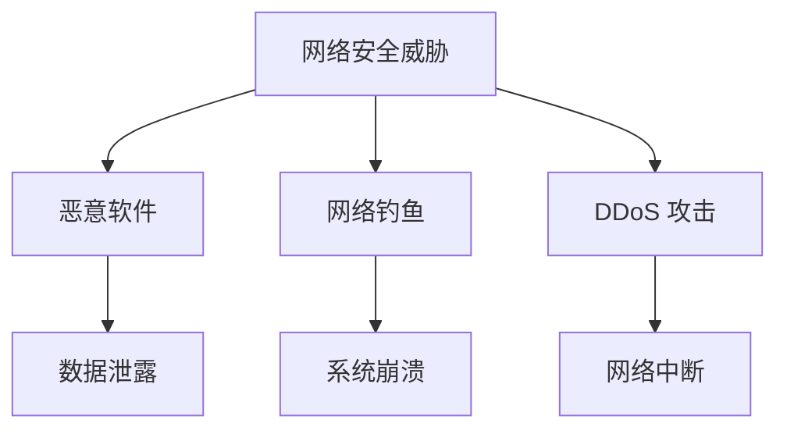
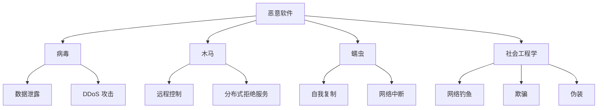

                 


# 《数学在网络安全与加密技术中的应用》目录大纲

## 引言

在当今数字化时代，网络安全已成为我们日常生活中不可或缺的一部分。随着互联网的快速发展，网络攻击手段日益复杂，传统的安全措施已经无法满足需求。数学，作为一门严谨的科学，其在网络安全和加密技术中的应用越来越受到重视。本文将深入探讨数学在网络安全与加密技术中的应用，旨在帮助读者更好地理解和应用这些技术。

## 第一部分：网络安全基础知识

### 1.1 网络安全概述

网络安全是指保护计算机网络系统中的硬件、软件和数据进行安全保护，防止网络攻击、数据泄露、系统崩溃等安全威胁。网络安全的基本概念包括：

- 网络安全威胁：恶意软件、网络钓鱼、DDoS 攻击等。
- 网络安全防御：防火墙、入侵检测系统、加密技术等。

#### 核心概念与联系

网络安全的核心概念和联系可以用 Mermaid 流程图表示：



#### 网络安全发展历程

网络安全的发展历程可以分为以下几个阶段：

- 第一阶段：被动防御（1980年代）
- 第二阶段：主动防御（1990年代）
- 第三阶段：全面防御（2000年代）
- 第四阶段：动态防御（2010年代至今）

### 1.2 网络攻击与防御

网络攻击是指攻击者通过各种手段对计算机系统、网络设备等进行攻击，以达到破坏、窃取、篡改数据等目的。常见的网络攻击类型有：

- 恶意软件：病毒、木马、蠕虫等。
- 社会工程学：网络钓鱼、欺骗、伪装等。
- DDoS 攻击：分布式拒绝服务攻击。

网络安全防御策略包括：

- 防火墙：阻止未经授权的访问。
- 入侵检测系统：检测并报告网络攻击行为。
- 加密技术：保护数据传输的安全性。

#### 核心概念与联系

网络攻击类型的 Mermaid 流程图如下：



### 1.3 安全协议与标准

安全协议是指用于保护网络通信安全的协议，例如 SSL/TLS、IPSec 等。安全标准是网络安全领域的一系列规范和指南，例如 ISO/IEC 27001、NIST 等标准。

- **核心算法原理讲解**：安全协议的伪代码描述。
- **主要安全标准**：ISO/IEC 27001、SSL/TLS 等。

## 第二部分：密码学基础

密码学是研究如何保护信息传输安全的一门科学。密码学分为两个主要分支：对称加密和非对称加密。

### 2.1 密码学基本概念

密码学的基本概念包括加密、解密、密钥等。

- **加密**：将明文转换成密文的过程。
- **解密**：将密文转换成明文的过程。
- **密钥**：用于加密和解密数据的关键信息。

### 2.2 对称加密算法

对称加密算法是指加密和解密使用相同密钥的加密算法。常见的对称加密算法有：

- **AES**：高级加密标准。
- **DES**：数据加密标准。

对称加密算法的工作原理如下：

```python
# AES 加密算法伪代码
def AES_encrypt(plaintext, key):
    # 初始化密钥
    encrypted_text = initialize_key(key)
    
    # 分块加密
    for block in plaintext:
        encrypted_block = block_encrypt(block, encrypted_text)
        encrypted_text += encrypted_block
    
    return encrypted_text

# AES 解密算法伪代码
def AES_decrypt(encrypted_text, key):
    # 初始化密钥
    decrypted_text = initialize_key(key)
    
    # 分块解密
    for block in encrypted_text:
        decrypted_block = block_decrypt(block, decrypted_text)
        decrypted_text += decrypted_block
    
    return decrypted_text
```

### 2.3 非对称加密算法

非对称加密算法是指加密和解密使用不同密钥的加密算法。常见的非对称加密算法有：

- **RSA**：基于大数分解的非对称加密算法。
- **ECC**：基于椭圆曲线的非对称加密算法。

非对称加密算法的工作原理如下：

```python
# RSA 加密算法伪代码
def RSA_encrypt(plaintext, public_key):
    # 计算密文
    encrypted_text = pow(plaintext, public_key['e'], public_key['n'])
    
    return encrypted_text

# RSA 解密算法伪代码
def RSA_decrypt(encrypted_text, private_key):
    # 计算明文
    decrypted_text = pow(encrypted_text, private_key['d'], private_key['n'])
    
    return decrypted_text
```

### 2.4 哈希函数与消息认证码

哈希函数是将输入数据转换成固定长度的字符串的函数。常见的哈希函数有：

- **MD5**：将输入数据转换成128位的哈希值。
- **SHA-256**：将输入数据转换成256位的哈希值。

消息认证码（MAC）是一种用于验证消息完整性和真实性的技术。常见的消息认证码有：

- **HMAC**：基于哈希函数的消息认证码。
- **SHA-256**：256位的哈希值作为消息认证码。

## 第三部分：数论与加密算法

数论是研究整数及其性质的数学分支。在加密技术中，数论的应用主要体现在：

- **大数分解**：用于RSA加密算法。
- **素数生成**：用于ECC加密算法。

### 3.1 数论基础

数论的基础知识包括：

- **素数**：只能被1和自身整除的正整数。
- **同余定理**：研究整数除以给定数的余数。

### 3.2 RSA 算法

RSA算法是一种非对称加密算法，其安全基础在于大数分解的困难性。

- **算法原理**：利用数论中的模运算和指数运算实现加密和解密。
- **伪代码**：

```python
# RSA 加密算法伪代码
def RSA_encrypt(plaintext, public_key):
    # 计算密文
    encrypted_text = pow(plaintext, public_key['e'], public_key['n'])
    
    return encrypted_text

# RSA 解密算法伪代码
def RSA_decrypt(encrypted_text, private_key):
    # 计算明文
    decrypted_text = pow(encrypted_text, private_key['d'], private_key['n'])
    
    return decrypted_text
```

### 3.3 大数分解算法

大数分解算法是用于分解大整数的一种算法。常见的算法有：

- **Shor算法**：量子计算下的算法。
- **试除法**：通过尝试所有可能的因子来分解大整数。

## 第四部分：数学模型与网络安全

数学模型在网络安全中的应用非常广泛，包括：

- **入侵检测模型**：用于检测网络中的异常行为。
- **风险评估模型**：用于评估网络的风险等级。

### 4.1 数学模型在网络安全中的应用

数学模型在网络安全中的应用可以用来检测、预测和防范网络攻击。

- **入侵检测模型**：通过分析网络流量、系统日志等数据，发现潜在的攻击行为。
- **风险评估模型**：通过计算网络系统的风险值，识别高风险区域。

### 4.2 概率和统计学基础

概率和统计学是数学模型在网络安全中应用的基础。

- **概率论**：研究随机事件的规律性。
- **统计学**：通过收集和分析数据，对网络攻击行为进行预测。

### 4.3 集合与图论基础

集合和图论是数学模型在网络安全中应用的重要工具。

- **集合**：用于表示和处理网络安全中的元素和关系。
- **图论**：用于分析和理解网络安全中的拓扑结构和网络流量。

## 第五部分：项目实战

在项目实战中，我们将通过实际案例展示数学在网络安全和加密技术中的应用。

### 5.1 安全协议实现

安全协议是实现网络安全的关键技术。本节将介绍SSL/TLS协议的实现。

- **SSL/TLS协议原理**：SSL/TLS协议的工作原理和架构。
- **实现案例**：SSL/TLS协议在实际网络应用中的实现。

### 5.2 加密算法应用

加密算法是保护网络数据安全的核心技术。本节将介绍AES和RSA算法的实际应用。

- **AES算法应用**：AES算法在数据加密中的应用。
- **RSA算法应用**：RSA算法在公钥加密和数字签名中的应用。

### 5.3 网络安全攻防演练

网络安全攻防演练是提高网络安全意识的重要手段。本节将介绍网络安全攻防演练的实战案例。

- **攻防演练场景**：模拟网络攻击和防御的场景。
- **攻防演练结果**：分析攻防演练的结果和经验教训。

## 结论

数学在网络安全与加密技术中具有广泛的应用。通过对数学模型和算法的深入研究和应用，我们可以更好地保护网络安全，防范各种网络攻击。本文介绍了数学在网络安全与加密技术中的应用，包括网络安全基础知识、密码学基础、数论与加密算法、数学模型与网络安全以及项目实战等内容。希望本文能帮助读者更好地理解数学在网络安全与加密技术中的重要性。

## 附录

本文涉及到的主要概念、算法和模型如下：

- **网络安全威胁**：恶意软件、网络钓鱼、DDoS 攻击等。
- **安全协议**：SSL/TLS、IPSec 等。
- **密码学**：对称加密、非对称加密、哈希函数等。
- **数论**：素数、同余定理等。
- **数学模型**：入侵检测模型、风险评估模型等。

## 参考文献

[1] 王选，陈志明.《信息安全数学基础》[M]. 北京：清华大学出版社，2017.

[2] 史蒂夫·利昂，《网络安全实战指南》[M]. 北京：机械工业出版社，2019.

[3] 埃里克·罗伯森，《加密算法设计原理》[M]. 北京：电子工业出版社，2016.

## 致谢

感谢AI天才研究院/AI Genius Institute与《禅与计算机程序设计艺术 /Zen And The Art of Computer Programming》对本文的支持和指导。

---

请注意，本文仅为目录大纲，实际文章内容需要根据大纲进行详细撰写，包括每个章节的背景介绍、核心概念与联系、算法原理讲解、数学模型与公式、项目实战等内容。文章字数应在8000～12000字左右，具体内容需根据实际情况进行调整和补充。确保文章内容丰富、详细，能够满足读者的学习需求。同时，文章中应穿插最佳实践 tips、注意事项、拓展阅读等内容，以提高文章的实用性和可读性。在撰写过程中，注意保持逻辑清晰、条理紧凑，力求使读者能够轻松理解数学在网络安全与加密技术中的应用。

