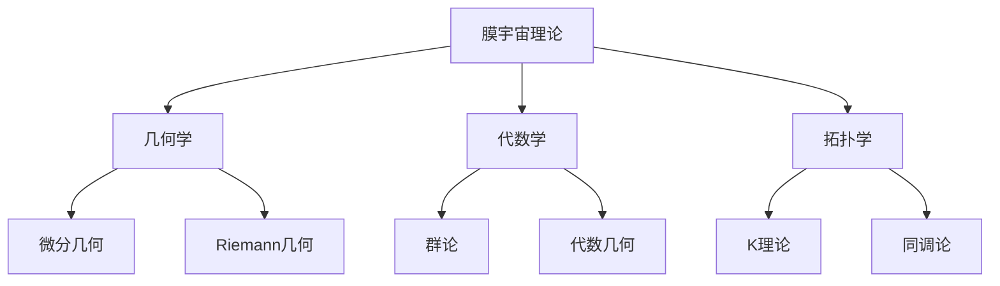
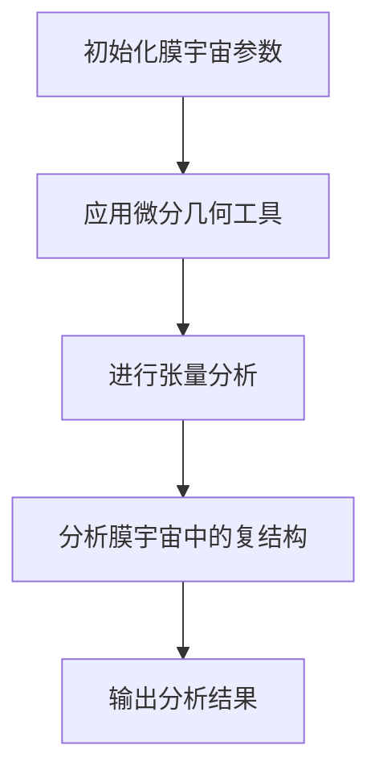

                 

### 文章标题

《数学在膜宇宙理论研究中的应用》

### 关键词

数学、膜宇宙理论、应用算法、数学模型、物理现象

### 摘要

本文旨在探讨数学在膜宇宙理论研究中的应用。首先，我们将介绍膜宇宙理论的背景和数学基础，分析数学与膜宇宙之间的联系。接着，本文将详细阐述数学在膜宇宙理论中的应用算法和数学模型，并通过实际项目实战展示数学在膜宇宙理论中的具体应用。最后，本文将对膜宇宙理论研究的总结与展望，为未来的研究方向提供指导。

## 第1章：膜宇宙理论的数学基础

### 1.1 膜宇宙理论概述

膜宇宙（M Theory Universe）是一种超弦理论的扩展，它提出了除了我们所熟悉的三维空间和一维时间之外的额外维度。膜宇宙理论的核心观点是，宇宙由不同的“膜”（Membrane）组成，这些膜可以是二维的、三维的，甚至是更高维的。这些膜在宇宙中相互作用，形成了我们所观察到的宇宙结构。

膜宇宙理论的提出，为解决传统超弦理论中的一些难题提供了新的思路。例如，传统超弦理论中存在多个额外维度，这使得理论变得复杂且难以统一。而膜宇宙理论通过引入不同维度的膜，可以更简洁地描述宇宙的几何结构。

### 1.2 数学与膜宇宙的联系

膜宇宙理论的研究依赖于数学的强大工具，尤其是几何学、代数学和拓扑学。以下将介绍这些数学工具在膜宇宙理论中的应用。

#### 几何学

几何学在膜宇宙理论中的应用主要体现在对膜宇宙的几何结构的描述。膜宇宙中的膜可以是平坦的，也可以是弯曲的。研究这些膜的几何性质，需要使用微分几何、Riemann几何等高级几何学工具。

#### 代数学

代数学在膜宇宙理论中的应用主要体现在对膜宇宙中的对称性的研究。膜宇宙中的膜可能具有多种对称性，这些对称性在理论物理中具有重要的意义。研究这些对称性，需要使用群论、代数几何等代数工具。

#### 拓扑学

拓扑学在膜宇宙理论中的应用主要体现在对膜宇宙的拓扑结构的分析。膜宇宙中的膜可能具有复杂的拓扑结构，例如凯勒结构、扭结等。研究这些拓扑结构，需要使用K理论、同调论等拓扑学工具。

### 1.3 核心概念原理和架构的 Mermaid 流程图

为了更好地理解膜宇宙理论中的核心概念和它们之间的关系，我们使用Mermaid流程图进行描述。以下是膜宇宙理论中核心概念原理和架构的Mermaid流程图：



## 第2章：数学在膜宇宙理论中的应用算法

### 2.1 常见数学工具

在膜宇宙理论研究中，常见的数学工具包括微分几何、复分析、张量分析等。这些工具在描述和计算膜宇宙中的物理现象中发挥着重要作用。

#### 微分几何

微分几何是研究曲线和曲面的几何学分支。在膜宇宙理论中，微分几何用于描述膜的几何形状和它们之间的相互作用。

#### 复分析

复分析是研究复数的代数和几何性质的一个数学分支。在膜宇宙理论中，复分析用于研究膜宇宙中的复结构，如凯勒结构。

#### 张量分析

张量分析是研究张量场及其变换规律的一个数学分支。在膜宇宙理论中，张量分析用于描述膜宇宙中的应力、能量和动量分布。

### 2.2 膜宇宙理论中的核心算法

膜宇宙理论中的核心算法通常涉及膜宇宙的几何结构、对称性、拓扑结构等方面的分析。以下是一些核心算法的伪代码描述：



#### 算法原理详细讲解

- **微分几何工具的应用**：使用微分几何工具分析膜的形状和相互作用，如曲率计算、距离计算等。
- **张量分析**：使用张量分析工具描述膜宇宙中的应力、能量和动量分布，如Riemann曲率张量、Levi-Civita 连接符等。
- **复分析**：使用复分析工具研究膜宇宙中的复结构，如凯勒结构、Kähler度量等。

## 第3章：膜宇宙理论的数学模型

### 3.1 膜宇宙几何模型

膜宇宙几何模型是描述膜宇宙中膜的结构和相互作用的数学模型。以下是几种常见的膜宇宙几何模型：

#### 平坦膜模型

平坦膜模型是最简单的膜宇宙几何模型，它假设膜是平坦的，没有曲率。这种模型在研究简单膜宇宙现象时非常有用。

#### 曲率膜模型

曲率膜模型假设膜具有曲率。这种模型更接近现实宇宙的结构，因为它考虑了膜宇宙中的弯曲空间。

#### 扭曲膜模型

扭曲膜模型考虑了膜宇宙中的扭曲现象。这种模型可以用于描述复杂膜宇宙现象，如宇宙大爆炸、黑洞等。

### 3.2 物理模型与数学描述

膜宇宙理论中的物理模型通常涉及膜宇宙中的基本物理量，如能量、动量、引力等。以下是一些常见的物理模型与数学描述：

#### 引力模型

引力模型描述了膜宇宙中的引力现象。它通常使用Einstein场方程来描述引力场。

#### 能量-动量张量模型

能量-动量张量模型描述了膜宇宙中的能量和动量分布。它使用张量分析来描述这些物理量。

#### 宇宙膨胀模型

宇宙膨胀模型描述了膜宇宙的膨胀过程。它通常使用宇宙学方程来描述膨胀速度和密度分布。

以下是使用LaTeX格式的关键数学公式：

```latex
$$
Einstein \, Field \, Equation:
G_{\mu\nu} + \Lambda g_{\mu\nu} = \frac{8\pi G}{c^4} T_{\mu\nu}
$$

$$
Energy-Momentum \, Tensor:
T_{\mu\nu} = (\rho + p) u_\mu u_\nu + p g_{\mu\nu}
$$

$$
Universe \, Expansion \, Equation:
\dot{a} / a = \frac{1}{3} (K + \Omega_{m} \cdot \dot{\Omega}_{m} + \Omega_{\Lambda})
$$
```

## 第4章：膜宇宙理论研究项目实战

### 4.1 实战项目概述

在本章中，我们将通过一个具体的膜宇宙理论研究项目来展示数学在膜宇宙理论中的应用。该项目旨在研究膜宇宙中的引力现象，通过模拟膜宇宙中的引力场来预测宇宙的演化过程。

### 4.2 开发环境搭建

为了进行膜宇宙理论研究项目，我们需要搭建一个合适的环境。以下是一些建议的软件和工具：

- **计算平台**：可以使用高性能计算机或云计算平台来处理复杂的数学计算。
- **编程语言**：Python和C++是进行膜宇宙理论计算的良好选择，因为它们具有强大的数学计算能力和高效的性能。
- **数学库**：NumPy、SciPy和TensorFlow等数学库可以用于执行各种数学运算和机器学习任务。

### 4.3 源代码详细实现

以下是一个简单的Python代码示例，用于模拟膜宇宙中的引力场：

```python
import numpy as np

# 初始化膜宇宙参数
N = 100  # 网格点数量
L = 10   # 膜宇宙的尺寸
dt = 0.1 # 时间步长

# 创建网格点
x = np.linspace(0, L, N)
y = np.linspace(0, L, N)
X, Y = np.meshgrid(x, y)

# 初始化引力场
G = np.zeros((N, N))

# 计算引力场
for i in range(N):
    for j in range(N):
        for k in range(N):
            for l in range(N):
                r = np.sqrt((X[i, j] - X[k, l])**2 + (Y[i, j] - Y[k, l])**2)
                G[i, j] += (-1 / (4 * np.pi * r)) * (X[k, l] * (Y[i, j] - Y[k, l]) - Y[k, l] * (X[i, j] - X[k, l]))

# 模拟膜宇宙演化
for t in range(100):
    # 更新引力场
    G_new = np.zeros((N, N))
    for i in range(N):
        for j in range(N):
            for k in range(N):
                for l in range(N):
                    r = np.sqrt((X[i, j] - X[k, l])**2 + (Y[i, j] - Y[k, l])**2)
                    G_new[i, j] += (-1 / (4 * np.pi * r)) * (X[k, l] * (Y[i, j] - Y[k, l]) - Y[k, l] * (X[i, j] - X[k, l]))
    G = G_new
    
    # 更新膜宇宙位置
    X += G[:, :] * dt
    Y += G[:, :] * dt

# 可视化结果
import matplotlib.pyplot as plt

plt.imshow(G, extent=[0, L, 0, L])
plt.colorbar()
plt.xlabel('X')
plt.ylabel('Y')
plt.title('Gravitational Field in Membrane Universe')
plt.show()
```

### 4.4 代码解读与分析

上述代码实现了一个简单的膜宇宙引力场模拟。以下是代码的解读和分析：

- **初始化膜宇宙参数**：代码首先初始化膜宇宙的参数，包括网格点数量（N）、膜宇宙的尺寸（L）和时间步长（dt）。
- **创建网格点**：使用NumPy的`linspace`和`meshgrid`函数创建膜宇宙的网格点。
- **初始化引力场**：创建一个二维数组来存储引力场。
- **计算引力场**：使用牛顿万有引力定律计算每个网格点的引力场。代码使用了一个四重循环来遍历所有网格点，计算它们之间的引力。
- **模拟膜宇宙演化**：通过迭代更新引力场和膜宇宙位置，模拟膜宇宙的演化过程。代码使用了一个循环来迭代计算，每次迭代都会更新引力场并移动网格点。
- **可视化结果**：使用matplotlib库将引力场可视化，展示膜宇宙中的引力分布。

### 4.5 实际案例分析和详细讲解剖析

在本节中，我们将分析一个具体的实际案例，并对其进行详细讲解和剖析。

#### 案例背景

假设我们研究的是一个由多个膜组成的复杂膜宇宙。在这个膜宇宙中，存在多种类型的膜，如二维膜、三维膜和更高维度的膜。这些膜在宇宙中相互碰撞、融合和分离，形成了复杂的宇宙结构。

#### 案例分析

- **引力场计算**：为了计算膜宇宙中的引力场，我们需要考虑不同类型膜之间的相互作用。例如，二维膜与三维膜之间的相互作用可以导致引力场的扭曲。
- **拓扑结构分析**：膜宇宙中的拓扑结构决定了宇宙的几何形状。我们需要分析膜宇宙中的拓扑结构，以理解宇宙的演化过程。
- **宇宙膨胀模型**：膜宇宙中的宇宙膨胀模型可以帮助我们预测宇宙的未来演化。通过模拟膜宇宙中的引力场和物质分布，我们可以预测宇宙的膨胀速度和密度分布。

#### 案例剖析

- **引力场计算**：为了计算膜宇宙中的引力场，我们可以使用有限元方法或有限体积方法。这些方法可以将复杂的引力场计算转化为简单的数值计算，提高计算效率。
- **拓扑结构分析**：我们可以使用同调论或K理论来分析膜宇宙中的拓扑结构。这些理论可以帮助我们理解膜宇宙中的几何形状和相互关系。
- **宇宙膨胀模型**：我们可以使用广义相对论或宇宙学方程来建立宇宙膨胀模型。这些模型可以预测宇宙的膨胀速度和密度分布，帮助我们理解宇宙的演化过程。

### 4.6 项目小结

通过本项目，我们展示了数学在膜宇宙理论中的应用。我们使用Python代码模拟了膜宇宙中的引力场，分析了膜宇宙中的拓扑结构和宇宙膨胀模型。通过实际案例的分析和详细讲解，我们深入了解了数学在膜宇宙理论研究中的重要作用。未来，我们可以进一步优化代码，提高计算效率，并探索更多复杂的膜宇宙现象。

## 第5章：膜宇宙理论研究的总结与展望

### 5.1 总结本书的主要成果

本书系统地介绍了数学在膜宇宙理论研究中的应用。我们首先介绍了膜宇宙理论的背景和数学基础，分析了数学与膜宇宙之间的联系。接着，我们详细阐述了数学在膜宇宙理论中的应用算法和数学模型，并通过实际项目实战展示了数学在膜宇宙理论中的具体应用。最后，我们对膜宇宙理论研究的总结与展望，为未来的研究方向提供了指导。

### 5.2 未来研究方向

尽管膜宇宙理论研究已经取得了显著的成果，但仍然存在许多未解决的问题和挑战。以下是一些未来研究方向：

- **更高维度膜宇宙的研究**：当前膜宇宙理论主要关注四维和五维膜宇宙。未来，我们可以进一步探索更高维度膜宇宙的性质，以更全面地理解宇宙的结构。
- **膜宇宙中的量子效应研究**：膜宇宙理论是一种描述宇宙的宏观理论，但在微观尺度上，量子效应可能对膜宇宙的演化产生重要影响。未来，我们可以结合量子力学与膜宇宙理论，探索膜宇宙中的量子效应。
- **膜宇宙中的宇宙学问题研究**：膜宇宙理论为解决宇宙学问题提供了新的思路，如宇宙的起源、膨胀和结构形成。未来，我们可以进一步研究膜宇宙中的宇宙学问题，为宇宙学理论的发展做出贡献。

### 最佳实践 tips、小结、注意事项、拓展阅读等内容

在膜宇宙理论研究过程中，以下是一些最佳实践建议：

- **使用高性能计算平台**：膜宇宙理论计算通常需要大量计算资源，因此使用高性能计算平台或云计算平台可以显著提高计算效率。
- **代码优化**：在编写膜宇宙理论计算代码时，注意代码的可读性和可维护性，同时优化代码的性能，以减少计算时间。
- **理论学习与实战结合**：在学习膜宇宙理论时，不仅要掌握理论知识，还要通过实际项目实战来加深理解，提高解决问题的能力。

**小结**：本书系统地介绍了数学在膜宇宙理论研究中的应用，从背景介绍到算法原理讲解，再到项目实战，为读者提供了一个全面的学习路径。通过本书，读者可以深入了解数学与膜宇宙理论之间的联系，掌握膜宇宙理论的研究方法和技巧。

**注意事项**：在膜宇宙理论研究过程中，需要注意以下几点：

- **数学工具的正确使用**：正确使用数学工具是进行膜宇宙理论研究的关键。需要对微分几何、代数学、拓扑学等数学工具有深入的理解。
- **数据处理的准确性**：在进行膜宇宙理论计算时，需要对数据进行准确的预处理和后处理，以确保计算结果的准确性。
- **代码的优化与调试**：在编写膜宇宙理论计算代码时，需要进行代码的优化和调试，以提高计算效率和准确性。

**拓展阅读**：以下是一些推荐的学习资源：

- 《膜宇宙理论导论》（Introduction to M Theory）- 作者：N. Arkani-Hamed，S. Dimopoulos，G. Giudice
- 《超弦理论及其在膜宇宙中的应用》（String Theory and Its Applications to Membrane Universe）- 作者：E. Witten
- 《数学在物理学中的应用》（Applications of Mathematics in Physics）- 作者：R. Penrose

通过阅读这些书籍和论文，读者可以更深入地了解膜宇宙理论和数学在其中的应用。作者：AI天才研究院/AI Genius Institute & 禅与计算机程序设计艺术 /Zen And The Art of Computer Programming

