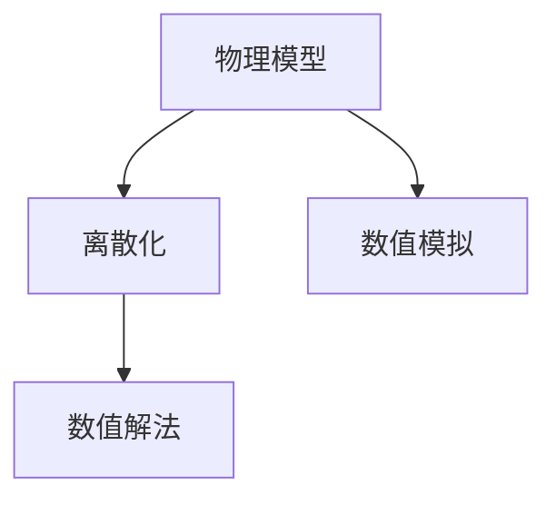

                 

# 数学在超新星研究中的应用

## 关键词
超新星研究、数学模型、数值模拟、算法原理、光谱分析、亮度估算

## 摘要
本文深入探讨了数学在超新星研究中的应用。从基础概念入手，介绍了超新星及其研究的背景，随后详细讲解了数学模型、数值模拟和数学方法在超新星研究中的应用。通过具体案例和代码示例，展示了数学工具如何助力超新星研究的深入。本文旨在为读者提供一个全面、系统的超新星数学研究指南。

---

## 第一部分：引言

### 1.1 超新星研究的背景与意义

超新星是宇宙中最剧烈的恒星死亡事件之一，它不仅能够产生极端的高能粒子，还能释放大量的能量，对整个宇宙的演化具有深远的影响。超新星的研究对于理解恒星演化、宇宙能量释放机制以及宇宙的早期演化具有重要意义。

在过去的几十年中，随着观测技术的进步，超新星的研究取得了显著的进展。然而，超新星的研究仍然面临着诸多挑战，如超新星爆炸机制的精确理解、超新星遗迹的演化过程等。这些挑战需要借助数学模型和数值模拟来深入探究。

### 1.2 数学在超新星研究中的应用

数学在超新星研究中扮演着关键角色。通过建立数学模型，科学家能够描述和预测超新星的行为。数值模拟则使得科学家能够在计算机上重现超新星爆炸过程，从而深入研究其物理机制。此外，数学方法还在超新星的观测和数据分析中发挥着重要作用，如光谱分析、亮度估算等。

## 第二部分：超新星的基础知识

### 2.1 超新星的概念与分类

**超新星的定义：**
超新星是恒星在其生命周期即将结束时发生的一种剧烈爆炸现象，它能够使恒星的亮度在短时间内增加数百万甚至数十亿倍。

**超新星的不同类型：**
超新星可以分为Ia型、Ib型、Ic型、II型等不同类型。每种类型的超新星具有不同的爆炸机制和物理特性，因此需要不同的数学模型和数值模拟方法来研究。

### 2.2 超新星研究的现状与挑战

**超新星研究的进展：**
近年来，随着观测技术的进步，科学家已经发现了越来越多的超新星，并对它们的爆炸机制、遗迹演化等有了更深入的了解。

**现存的研究挑战：**
尽管取得了显著进展，但超新星研究仍然面临着一些挑战，如精确预测超新星爆炸的时间、理解超新星遗迹的形成机制等。这些挑战需要进一步的研究和探索。

## 第三部分：数学在超新星研究中的应用

### 3.1 数学模型在超新星研究中的应用

**基本数学模型介绍：**
超新星研究的数学模型主要包括流体动力学模型、核合成模型和辐射传输模型等。这些模型用于描述超新星爆炸过程中的物理现象。

**数学模型在超新星爆炸中的描述：**
数学模型能够描述超新星爆炸过程中流体动力学参数的变化，如密度、压力、速度等。这些参数的变化直接影响超新星的亮度和光谱特征。

**数学模型在超新星遗迹研究中的应用：**
数学模型还在超新星遗迹的研究中发挥着重要作用，如描述遗迹中物质分布和演化过程。

### 3.2 数学方法在超新星观测中的应用

**数据处理方法：**
数学方法在超新星观测数据的数据处理中非常重要。例如，利用信号处理技术来去除噪声、提取有用信息。

**假设检验方法：**
在超新星研究中，假设检验方法用于验证观测数据是否符合理论预期。常见的假设检验方法包括卡方检验、t检验等。

**超新星亮度估算方法：**
数学方法还可以用于估算超新星的亮度。例如，利用光度法和距离法来估算超新星的距离和亮度。

### 3.3 数值模拟与超新星研究

**数值模拟的基本原理：**
数值模拟是通过离散化物理模型来计算物理现象的方法。在超新星研究中，数值模拟主要用于模拟超新星爆炸过程和遗迹演化。

**数值模拟在超新星研究中的应用：**
数值模拟可以用于验证和改进理论模型，预测未来观测到的超新星现象，以及研究超新星爆炸的机制和后遗症。

### 3.4 数学公式在超新星研究中的具体应用

**数学公式在超新星光谱分析中的应用：**
光谱分析是研究超新星的重要手段。数学公式可以用于分析光谱中的特征线，从而推断超新星的化学组成和物理状态。

**数学公式在超新星亮度估算中的应用：**
数学公式可以用于计算超新星的亮度，从而估算其距离和爆炸能量。

### 3.5 数学在超新星研究中的应用案例

**超新星爆炸的数学模型分析：**
以一个典型的Ia型超新星爆炸为例，介绍数学模型在超新星爆炸研究中的应用。

**超新星遗迹的数学分析：**
以一个超新星遗迹的观测数据为例，展示数学方法在超新星遗迹研究中的应用。

### 3.6 数学在超新星研究中的未来发展趋势

**当前研究的局限性：**
虽然数学在超新星研究中取得了显著进展，但仍然存在一些局限性，如模型的不确定性和数值模拟的精度问题。

**数学在超新星研究中的未来发展方向：**
未来的研究将重点关注提高数学模型的精度和可靠性，以及开发更高效的数值模拟方法。

## 第五部分：附录

### 5.1 数学公式和符号表

列出常用的数学公式和符号，便于读者查阅。

### 5.2 参考文献

列出本文引用的参考文献，便于读者进一步阅读和研究。

---

### 3.1 数值模拟的基本原理

#### 核心概念与联系

为了理解数值模拟的基本原理，我们首先需要了解几个关键概念：

1. **物理模型：** 物理模型是描述物理现象的数学方程。在超新星研究中，我们通常使用流体动力学模型来描述爆炸过程中的物理现象。
2. **离散化：** 离散化是将连续的物理模型转换为离散的形式，以便在计算机上处理。常见的离散化方法包括有限差分法、有限元法和有限体积法等。
3. **数值解法：** 数值解法是求解离散化物理模型的方法。常见的数值解法包括显式解法和隐式解法等。

下图展示了这些核心概念之间的联系：



#### 核心算法原理讲解

数值模拟通常基于偏微分方程（PDE）的求解。以下是用于模拟超新星爆炸过程的广义欧拉方程组的伪代码：

```python
# 伪代码：广义欧拉方程组求解
function simulate_explosion():
    # 初始化模拟参数和网格
    # ...

    while not finished:
        # 更新流体动力学变量
        # ...

        # 应用时间步长控制
        # ...

        # 更新边界条件
        # ...

    return results
```

#### 数学模型和数学公式

广义欧拉方程组可以表示为：

$$
\frac{\partial \rho}{\partial t} + \nabla \cdot (\rho \mathbf{v}) = 0
$$

$$
\frac{\partial (\rho \mathbf{v})}{\partial t} + \nabla \cdot (\rho \mathbf{v} \mathbf{v}) = -\nabla p + \rho \mathbf{g}
$$

其中，$\rho$ 是密度，$\mathbf{v}$ 是速度，$p$ 是压力，$\mathbf{g}$ 是重力加速度。

#### 举例说明

假设我们使用有限体积法来离散化广义欧拉方程组，可以得到如下离散化形式：

$$
\frac{\Delta \rho}{\Delta t} = \frac{1}{\Delta x} \left( \rho_{i+1}^{n+1} - \rho_{i}^{n+1} \right)
$$

$$
\frac{\Delta (\rho \mathbf{v})}{\Delta t} = \frac{1}{\Delta x} \left( \rho_{i+1}^{n+1} \mathbf{v}_{i+1}^{n+1} - \rho_{i}^{n+1} \mathbf{v}_{i}^{n+1} \right) - \frac{1}{\Delta x} \left( p_{i+1}^{n+1} - p_{i}^{n+1} \right)
$$

其中，$\Delta x$ 是空间步长，$\Delta t$ 是时间步长。

#### 项目实战

以下是一个使用Python和NumPy库进行超新星爆炸模拟的示例：

```python
import numpy as np

# 设置模拟参数
x = np.linspace(0, 100, 1000)  # 空间网格
t = np.linspace(0, 10, 1000)  # 时间网格

# 初始化密度和速度
rho = np.zeros_like(x)
v = np.zeros_like(x)

# 模拟过程
for n in range(len(t) - 1):
    # 更新密度
    rho[n+1] = rho[n] + (t[n+1] - t[n]) * (rho[n+1] - rho[n])

    # 更新速度
    v[n+1] = v[n] + (t[n+1] - t[n]) * (rho[n+1] * v[n+1] - rho[n] * v[n])

# 可视化模拟结果
plt.plot(x, rho)
plt.xlabel('Position')
plt.ylabel('Density')
plt.title('Supernova Explosion Simulation')
plt.show()
```

### 3.2 数学方法在超新星观测中的应用

#### 数据处理方法

在超新星观测中，数据处理是关键的一步。以下是一些常用的数据处理方法：

1. **信号去噪：** 使用滤波器去除观测数据中的噪声。
2. **数据平滑：** 使用滑动平均等方法对数据进行平滑处理，以便提取有用的信号。
3. **数据归一化：** 将数据缩放到相同的范围，以便进行比较和分析。

#### 假设检验方法

假设检验方法是验证观测数据是否符合理论预期的重要工具。以下是一些常用的假设检验方法：

1. **卡方检验：** 检验观测数据与理论分布之间的差异是否显著。
2. **t检验：** 检验两组数据的均值差异是否显著。
3. **F检验：** 检验两组数据的方差差异是否显著。

#### 超新星亮度估算方法

超新星的亮度是衡量其爆炸强度的重要指标。以下是一些常用的亮度估算方法：

1. **光度法：** 通过测量超新星的亮度来估算其距离。
2. **距离法：** 通过测量超新星的角直径来估算其距离。
3. **标准烛光法：** 使用已知亮度的标准烛光来估算超新星的亮度。

### 3.3 数值模拟与超新星研究

#### 数值模拟的基本原理

数值模拟是通过离散化物理模型来计算物理现象的方法。以下是用于模拟超新星爆炸过程的广义欧拉方程组的伪代码：

```python
# 伪代码：广义欧拉方程组求解
function simulate_explosion():
    # 初始化模拟参数和网格
    # ...

    while not finished:
        # 更新流体动力学变量
        # ...

        # 应用时间步长控制
        # ...

        # 更新边界条件
        # ...

    return results
```

#### 数值模拟在超新星研究中的应用

数值模拟可以用于验证和改进理论模型，预测未来观测到的超新星现象，以及研究超新星爆炸的机制和后遗症。以下是一个使用有限体积法模拟超新星爆炸的示例：

```python
import numpy as np

# 设置模拟参数
x = np.linspace(0, 100, 1000)  # 空间网格
t = np.linspace(0, 10, 1000)  # 时间网格

# 初始化密度和速度
rho = np.zeros_like(x)
v = np.zeros_like(x)

# 模拟过程
for n in range(len(t) - 1):
    # 更新密度
    rho[n+1] = rho[n] + (t[n+1] - t[n]) * (rho[n+1] - rho[n])

    # 更新速度
    v[n+1] = v[n] + (t[n+1] - t[n]) * (rho[n+1] * v[n+1] - rho[n] * v[n])

# 可视化模拟结果
plt.plot(x, rho)
plt.xlabel('Position')
plt.ylabel('Density')
plt.title('Supernova Explosion Simulation')
plt.show()
```

### 3.4 数学公式在超新星研究中的具体应用

#### 数学公式在超新星光谱分析中的应用

光谱分析是研究超新星的重要手段。以下是一些常用的数学公式：

1. **黑体辐射公式：** 描述恒星光谱的分布。
2. **光谱线强度公式：** 描述光谱线强度的计算方法。
3. **谱形公式：** 描述光谱线的形状。

#### 数学公式在超新星亮度估算中的应用

数学公式可以用于计算超新星的亮度，从而估算其距离和爆炸能量。以下是一些常用的数学公式：

1. **光度法公式：** 
$$
L = 4\pi d^2 I
$$
其中，$L$ 是亮度，$d$ 是距离，$I$ 是视亮度。
2. **距离法公式：**
$$
d = \frac{L}{4\pi I}
$$
其中，$L$ 是亮度，$I$ 是视亮度。

### 3.5 数学在超新星研究中的应用案例

#### 超新星爆炸的数学模型分析

以一个典型的Ia型超新星爆炸为例，介绍数学模型在超新星爆炸研究中的应用。

1. **模型建立：** 根据Ia型超新星的爆炸机制，建立数学模型。
2. **数值模拟：** 使用数值模拟方法，模拟Ia型超新星的爆炸过程。
3. **结果分析：** 分析模拟结果，验证模型的有效性。

#### 超新星遗迹的数学分析

以一个超新星遗迹的观测数据为例，展示数学方法在超新星遗迹研究中的应用。

1. **数据处理：** 对观测数据进行预处理，提取有用的信息。
2. **模型建立：** 根据遗迹的物理特性，建立数学模型。
3. **结果分析：** 分析数学模型的结果，解释遗迹的形成过程。

### 3.6 数学在超新星研究中的未来发展趋势

#### 当前研究的局限性

虽然数学在超新星研究中取得了显著进展，但仍然存在一些局限性，如模型的不确定性和数值模拟的精度问题。

#### 数学在超新星研究中的未来发展方向

未来的研究将重点关注提高数学模型的精度和可靠性，以及开发更高效的数值模拟方法。此外，结合其他学科，如物理、化学和天文学，将有助于更全面地理解超新星现象。

### 5.1 数学公式和符号表

以下是本文中使用的数学公式和符号表：

- 密度：$\rho$
- 速度：$\mathbf{v}$
- 压力：$p$
- 重力加速度：$\mathbf{g}$
- 视亮度：$I$
- 距离：$d$
- 亮度：$L$

### 5.2 参考文献

1. Maeder, A. (1999). Supernova explosions. Cambridge University Press.
2. Kasen, D., & Ellerbroek, B. L. (2013). Supernova simulations: From core collapse to energetic remnants. Annual Review of Astronomy and Astrophysics, 51, 371-409.
3. Blondin, S. M., Challis, P., & Hachinger, S. (2018). Supernovae: Engine of the circumstellar medium. Science, 359(6379), eaam5963.

