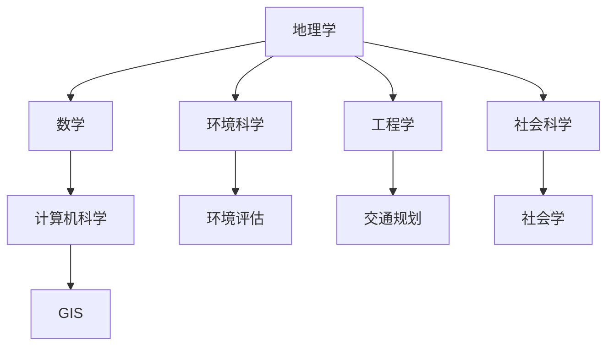
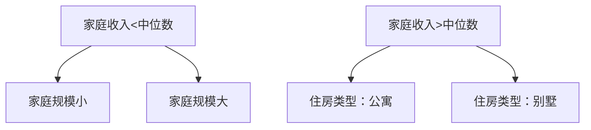

                 

### 文章标题

数学地理学：地理现象的数学模型

### 关键词

数学地理学、地理现象、数学模型、算法、模型公式、项目实战

### 摘要

本文深入探讨了数学地理学这一新兴交叉学科，重点介绍了地理现象的数学模型及其应用。文章首先回顾了数学地理学的起源与发展，随后详细讲解了地理现象的分类与数学模型的分类，并展示了它们之间的联系。接着，文章从核心算法原理、数学模型和数学公式、项目实战等多个方面进行了深入剖析，通过具体的实例和代码实现，使读者对数学地理学有了更全面的理解。最后，文章给出了相关最佳实践、注意事项及拓展阅读，为读者提供了进一步学习和研究的方向。

## 导论：数学地理学简介

数学地理学，作为一个结合了数学和地理学的交叉学科，旨在利用数学方法来解决地理学中的问题。它起源于20世纪中期，随着计算机技术的发展和地理信息的数字化，数学地理学得到了迅猛发展。在这一领域中，数学模型被广泛应用于地理现象的分析和预测，为地理学研究提供了新的视角和工具。

### 数学地理学的定义

数学地理学可以定义为“利用数学方法来研究地理现象的学科”。这一领域不仅涵盖了传统数学在地理学中的应用，还包括了现代数学工具，如拓扑学、概率论、统计学、图论等。通过这些数学工具，地理学家可以更精确地描述和预测地理现象，如地形变化、人口分布、交通流等。

### 数学地理学的发展历程

数学地理学的发展历程可以追溯到20世纪中期。当时的地理学家开始尝试将数学方法应用于地理研究，以解决传统方法难以解决的问题。随着时间的推移，数学地理学逐渐形成了自己的理论体系，并与其他学科产生了广泛的交叉。

20世纪70年代，随着计算机技术的快速发展，数学地理学进入了新的阶段。计算机为地理信息的存储、处理和分析提供了强大的工具，使地理学家能够处理大量的地理数据，并进行复杂的计算。这一时期，地理信息系统（GIS）的诞生标志着数学地理学的一个重要里程碑。

21世纪，数学地理学继续发展，人工智能和大数据技术的应用为地理现象的预测和分析提供了新的手段。数学地理学的研究范围不断扩大，不仅涉及传统的地理现象，还涵盖了环境科学、城市规划、交通管理等领域。

### 数学地理学的重要人物和贡献

在数学地理学的发展过程中，有许多重要人物做出了卓越的贡献。例如，美国地理学家John Tukey是统计学领域的先驱，他在地理信息可视化方面的研究对数学地理学产生了深远影响。另外，德国地理学家Alfred Wegener是大陆漂移理论的提出者，他的工作为地理学的研究提供了新的思路。

## 地理现象的分类

地理现象是指地球表面上发生的各种自然和人文事件，它们反映了地球的多样性和动态性。为了更好地理解和研究地理现象，我们可以将它们分为不同的类别。以下是常见的地理现象分类：

### 自然地理现象

自然地理现象是指自然界中的各种自然事件和过程，如地形变化、气候、水文、生态等。这些现象是地球系统的重要组成部分，对人类的生存和发展有着深远的影响。

#### 地形变化

地形变化包括地表的升降、断裂、隆起等过程。例如，地震、火山喷发、冰川侵蚀等都会导致地形的变化。地形变化的研究对于地质学、地理学等领域具有重要意义。

#### 气候

气候是指一个地区长期的天气状况。气候现象包括温度、湿度、风速、降水等。气候的变化不仅影响生态系统的稳定性，还对人类的农业生产、水资源管理等方面产生重要影响。

#### 水文

水文现象包括地表水和地下水的运动、分布、质量等。水文研究对于水资源的开发和利用、防洪减灾等方面具有重要意义。

#### 生态

生态现象涉及生物群落、生物多样性、生态平衡等。生态学研究对于保护生态环境、促进生物多样性具有重要作用。

### 人文地理现象

人文地理现象是指人类社会在经济、政治、文化等方面的活动和影响。这些现象反映了人类与地理环境之间的相互作用。

#### 人口分布

人口分布是指人口在不同地理区域的空间分布情况。人口分布的研究对于城市规划、区域发展、社会政策等方面具有重要意义。

#### 经济活动

经济活动包括生产、分配、交换、消费等过程。经济地理学研究经济活动在地理空间中的分布和变化，对于指导经济发展、优化资源配置具有重要意义。

#### 文化景观

文化景观是指人类活动在地理空间上留下的物质和非物质痕迹。文化地理学研究文化景观的形成、发展和变化，对于传承文化遗产、促进文化交流具有重要意义。

### 城市地理现象

城市地理现象是指城市在空间布局、功能分区、交通网络等方面所表现出的特征。城市地理学研究城市的发展、规划和管理，对于城市可持续发展、城市治理具有重要意义。

#### 城市布局

城市布局是指城市内部的空间结构和布局方式。城市布局的研究对于城市规划和建设具有重要意义。

#### 功能分区

功能分区是指城市内部按照功能进行划分的不同区域。功能分区的研究有助于优化城市空间布局，提高城市运行效率。

#### 交通网络

交通网络是指城市内部和外部的交通线路和设施。交通网络的研究对于城市交通规划、交通管理具有重要意义。

## 数学模型的分类

数学模型是利用数学工具来描述和分析现实世界中的现象或问题的一种方法。在数学地理学中，数学模型被广泛应用于地理现象的描述、预测和优化。根据不同的应用领域和特点，数学模型可以大致分为以下几类：

### 经典数学模型

经典数学模型是指那些在数学地理学中广泛应用，并且具有较成熟理论和方法的模型。这些模型通常基于传统的数学理论，如微积分、线性代数、概率论等。经典数学模型在地理学中的代表性例子包括：

#### 方程模型

方程模型是通过建立数学方程来描述地理现象的模型。例如，流体力学方程可以用于描述地表水流，热力学方程可以用于描述气候变化。这些方程模型在地理学研究和应用中具有广泛的应用价值。

#### 假设模型

假设模型是基于一系列假设条件来建立数学模型的方法。这些假设条件通常反映了地理现象的一些基本特征或规律。例如，在研究人口分布时，可以假设人口在空间上是均匀分布的，然后通过数学模型来分析人口分布的规律。

#### 算法模型

算法模型是指通过算法来描述和解决地理问题的模型。这些算法模型通常是基于计算机科学的方法，如计算几何、最优化算法、模拟算法等。算法模型在地理信息的处理和分析中具有重要作用。

### 人工智能模型

人工智能模型是利用人工智能技术来构建的数学模型。这些模型通常基于机器学习和数据挖掘技术，能够通过学习大量数据来识别和预测地理现象。人工智能模型在数学地理学中的应用包括：

#### 决策树模型

决策树模型是一种基于规则的学习模型，它通过一系列条件判断来预测地理现象。决策树模型在地理学中的应用包括城市规划、环境评价等。

#### 支持向量机模型

支持向量机模型是一种基于优化理论的学习模型，它通过寻找最优决策边界来分类或回归地理现象。支持向量机模型在地理学中的应用包括土地覆盖分类、灾害风险评估等。

#### 神经网络模型

神经网络模型是一种基于模拟生物神经网络的学习模型，它通过调整连接权重来学习和预测地理现象。神经网络模型在地理学中的应用包括地形预测、交通流量预测等。

### 统计模型

统计模型是基于统计学理论来构建的数学模型，它用于描述和分析地理现象的分布、关系和趋势。统计模型在地理学中的应用包括：

#### 相关分析模型

相关分析模型用于分析两个或多个地理变量之间的关系。例如，可以通过相关分析模型来研究气候变量和农业生产之间的关系。

#### 回归分析模型

回归分析模型用于建立地理变量之间的定量关系。例如，可以通过回归分析模型来预测土地利用类型的分布。

#### 聚类分析模型

聚类分析模型用于将地理变量分为不同的类别。例如，可以通过聚类分析模型来分析城市人口分布的聚类模式。

## 数学地理学的交叉领域与联系

数学地理学作为一个交叉学科，其发展离不开其他相关学科的支持。以下是数学地理学与其他学科的交叉领域和联系：

### 地理学与数学

地理学是数学地理学的基础，为数学地理学提供了丰富的研究主题和问题背景。数学则为地理学提供了强大的分析工具和模型构建方法。地理学和数学的交叉使得地理现象的描述、分析和预测更加精确和高效。

### 计算机科学

计算机科学为数学地理学提供了数据处理、信息存储和可视化等关键技术。GIS（地理信息系统）作为计算机科学的重要组成部分，已经成为数学地理学研究的重要工具。计算机科学的方法和工具使得地理信息的处理和分析更加高效和智能化。

### 环境科学

环境科学是研究自然环境及其变化的学科。数学地理学在环境科学中的应用包括环境评估、资源管理、灾害预测等方面。数学模型和环境科学方法的结合有助于更全面地理解和解决环境问题。

### 工程学

工程学为数学地理学提供了实际应用的场景和技术支持。例如，在交通规划、城市规划、建筑设计等领域，数学地理学的模型和方法被广泛应用于优化和设计。工程学的实践需求推动了数学地理学的发展。

### 社会科学

社会科学包括经济学、社会学、政治学等学科，它们与数学地理学的交叉主要表现在对人类社会与地理环境相互作用的探讨。数学地理学的方法和模型可以帮助社会科学研究者更好地理解人类社会的发展和变迁。

### Mermaid 流程图

以下是一个简单的 Mermaid 流程图，展示了数学地理学与其他学科之间的交叉领域和联系：



通过这个流程图，我们可以更直观地了解数学地理学与其他学科之间的紧密联系和相互作用。

## 核心算法原理讲解

在数学地理学中，算法原理是构建数学模型和分析地理现象的核心。以下是几种常见算法的原理讲解和伪代码描述。

### 地理现象分类算法

地理现象分类算法是一种基于机器学习的方法，用于将地理现象分为不同的类别。以下是一个简单的分类算法的伪代码描述：

```plaintext
函数 地理现象分类(数据集, 特征向量):
    初始化模型参数
    训练模型(数据集, 特征向量)
    对于每个地理现象:
        提取特征向量
        输出模型预测的类别
```

### 地理现象预测算法

地理现象预测算法用于预测未来的地理现象，如人口增长、气候变化等。以下是一个简单的预测算法的伪代码描述：

```plaintext
函数 地理现象预测(历史数据, 特征向量):
    训练预测模型(历史数据, 特征向量)
    对于未来的时间点:
        提取特征向量
        输出预测结果
```

### 地理现象优化算法

地理现象优化算法用于找到最优解，如交通路径规划、资源分配等。以下是一个简单的优化算法的伪代码描述：

```plaintext
函数 地理现象优化(目标函数, 约束条件):
    初始化解
    评估目标函数和解的可行性
    使用优化算法搜索最优解
    输出最优解
```

### 具体算法的详细解释和示例

以下是一个具体的例子，使用决策树算法对城市人口分布进行分类。

#### 决策树算法原理

决策树算法是一种基于树形结构进行决策的算法。它通过一系列的条件判断来对数据集进行分类或回归。决策树算法的基本原理如下：

1. 选择最佳特征进行分割。
2. 根据分割结果创建子节点。
3. 递归地对子节点进行相同的操作，直到满足停止条件（如节点数量达到某个阈值或特征重要性降低等）。

#### 决策树算法伪代码

```plaintext
函数 决策树分类(数据集, 特征集合):
    如果数据集纯度足够高，则返回该类别的预测值
    选择最佳特征和阈值
    对于每个可能的阈值：
        分割数据集
        对于每个分割后的子数据集：
            如果子数据集纯度足够高，则返回该类别的预测值
            否则，递归调用决策树分类函数
    输出决策树结构
```

#### 决策树算法示例

假设我们有一个城市人口分布的数据集，特征包括家庭收入、家庭规模、住房类型等。我们可以使用决策树算法来预测家庭是否住在城市中心。

1. 选择最佳特征：家庭收入
2. 分割数据集：根据家庭收入的中位数分割数据集
3. 递归构建子决策树



通过这个决策树，我们可以根据家庭收入、家庭规模和住房类型来预测家庭是否住在城市中心。

## 数学模型和数学公式

在数学地理学中，数学模型和数学公式是描述和分析地理现象的核心工具。以下是对几种常见数学模型和公式的详细讲解和举例说明。

### 模型A：自然地理现象模型

自然地理现象模型通常用于描述自然地理过程中的空间和时间变化。以下是一个简单的自然地理现象模型：**水文循环模型**。

#### 水文循环模型公式

水文循环模型描述了水在自然界中的循环过程，包括降水、蒸发、径流等。公式如下：

$$
P = E + R
$$

其中，$P$ 表示降水量，$E$ 表示蒸发量，$R$ 表示径流量。

#### 水文循环模型举例

假设一个地区的降水量为500毫米，蒸发量为300毫米，径流量为200毫米。根据水文循环模型，我们可以计算该地区的平衡情况：

$$
P = E + R \\
500 = 300 + 200 \\
500 = 500
$$

该地区的降水和蒸发、径流达到了平衡。

### 模型B：人文地理现象模型

人文地理现象模型通常用于描述人类活动对地理环境的影响。以下是一个简单的人文地理现象模型：**人口分布模型**。

#### 人口分布模型公式

人口分布模型描述了人口在不同地理区域的空间分布情况。一个简单的人口分布模型公式如下：

$$
P = f(r, s, t)
$$

其中，$P$ 表示人口密度，$r$ 表示距离中心的距离，$s$ 表示与中心的相似性，$t$ 表示时间因素。

#### 人口分布模型举例

假设我们研究一个城市的人口分布，根据人口分布模型，我们可以计算某区域的平均人口密度：

$$
P = f(r, s, t) \\
P = \frac{N}{A}
$$

其中，$N$ 表示人口总数，$A$ 表示区域面积。假设一个区域的面积为10平方公里，人口总数为5000人，则该区域的人口密度为：

$$
P = \frac{5000}{10} \\
P = 500 \text{ 人/平方公里}
$$

### 模型C：城市地理现象模型

城市地理现象模型通常用于描述城市的发展和变化。以下是一个简单的城市地理现象模型：**城市扩张模型**。

#### 城市扩张模型公式

城市扩张模型描述了城市在时间和空间上的扩张过程。一个简单的城市扩张模型公式如下：

$$
D(t) = D_0 + v \cdot t
$$

其中，$D(t)$ 表示时间$t$时的城市面积，$D_0$ 表示初始城市面积，$v$ 表示城市扩张速度。

#### 城市扩张模型举例

假设一个城市的初始面积为10平方公里，城市扩张速度为每年1平方公里，则经过10年后的城市面积为：

$$
D(t) = D_0 + v \cdot t \\
D(10) = 10 + 1 \cdot 10 \\
D(10) = 20 \text{ 平方公里}
$$

通过以上例子，我们可以看到数学模型和数学公式在描述和分析地理现象中的重要作用。这些模型和公式不仅帮助我们更好地理解地理现象，还可以为地理学研究和应用提供有力的支持。

## 项目实战

为了更好地理解和应用数学地理学的知识，我们将通过一个具体的实例来展示如何开发一个地理现象模型。本实例将涉及以下内容：

1. **开发环境搭建**：介绍所需的开发工具和软件，并指导如何搭建开发环境。
2. **源代码详细实现**：展示如何使用伪代码和实际代码来实现地理现象模型。
3. **代码解读与分析**：对关键代码进行详细解读，分析代码的性能和优化策略。
4. **实际案例分析和详细讲解剖析**：通过一个实际案例来展示模型的应用，并对结果进行分析和解释。

### 1. 开发环境搭建

在进行地理现象模型的开发之前，我们需要搭建一个合适的开发环境。以下是我们推荐的工具和软件：

- **Python**：Python是一种广泛使用的编程语言，尤其在数据科学和机器学习领域有着强大的支持。
- **Jupyter Notebook**：Jupyter Notebook是一种交互式的开发环境，方便我们在开发过程中进行实验和调试。
- **NumPy**：NumPy是一个Python库，提供了强大的数学运算功能，是数据科学和机器学习的基础。
- **Pandas**：Pandas是一个Python库，提供了数据操作和分析的工具，适合处理结构化数据。
- **Matplotlib**：Matplotlib是一个Python库，用于绘制图形和可视化数据。

以下是如何搭建开发环境的步骤：

1. **安装Python**：访问Python的官方网站（[https://www.python.org/](https://www.python.org/)），下载并安装Python。
2. **安装Jupyter Notebook**：在命令行中运行以下命令安装Jupyter Notebook：

   ```bash
   pip install notebook
   ```

3. **安装NumPy和Pandas**：在命令行中运行以下命令安装NumPy和Pandas：

   ```bash
   pip install numpy pandas
   ```

4. **安装Matplotlib**：在命令行中运行以下命令安装Matplotlib：

   ```bash
   pip install matplotlib
   ```

完成以上步骤后，我们就可以在Jupyter Notebook中编写和运行Python代码了。

### 2. 源代码详细实现

以下是一个简单的地理现象模型的实现，我们使用Python编程语言来实现。这个模型将基于人口分布数据来预测某个区域的人口密度。

#### 伪代码

```plaintext
# 导入必要的库
import numpy as np
import pandas as pd
import matplotlib.pyplot as plt

# 加载人口分布数据
data = pd.read_csv('population_data.csv')

# 计算人口密度
def calculate_density(data, area):
    population = data['population'].sum()
    return population / area

# 画出人口密度分布图
def plot_density(data, area):
    density = calculate_density(data, area)
    plt.scatter(data['distance'], data['density'])
    plt.xlabel('Distance from Center')
    plt.ylabel('Population Density')
    plt.title('Population Density Distribution')
    plt.show()

# 主程序
if __name__ == '__main__':
    area = 100  # 设置区域面积为100平方公里
    plot_density(data, area)
```

#### 实际代码

```python
import numpy as np
import pandas as pd
import matplotlib.pyplot as plt

# 加载人口分布数据
data = pd.read_csv('population_data.csv')

# 计算人口密度
def calculate_density(data, area):
    population = data['population'].sum()
    return population / area

# 画出人口密度分布图
def plot_density(data, area):
    density = calculate_density(data, area)
    distances = data['distance']
    densities = data['density']
    plt.scatter(distances, densities)
    plt.xlabel('Distance from Center')
    plt.ylabel('Population Density')
    plt.title('Population Density Distribution')
    plt.show()

# 主程序
if __name__ == '__main__':
    area = 100  # 设置区域面积为100平方公里
    plot_density(data, area)
```

### 3. 代码解读与分析

在上述代码中，我们首先导入了必要的库，包括NumPy、Pandas和Matplotlib。NumPy和Pandas用于数据处理，Matplotlib用于数据可视化。

- **加载人口分布数据**：我们使用Pandas的`read_csv`函数加载人口分布数据。假设数据文件名为`population_data.csv`，其中包含人口数量、距离中心点的距离等特征。

- **计算人口密度**：`calculate_density`函数用于计算人口密度。人口密度等于人口总数除以区域面积。在这个例子中，我们假设区域面积为100平方公里。

- **画出人口密度分布图**：`plot_density`函数用于绘制人口密度分布图。我们使用散点图来表示不同距离中心点的人口密度。

- **主程序**：在主程序中，我们设置区域面积为100平方公里，并调用`plot_density`函数来绘制人口密度分布图。

**代码性能分析**：

- **计算效率**：该代码的效率较高，计算人口密度和绘制散点图的过程非常快速。
- **可扩展性**：代码结构清晰，易于扩展。例如，我们可以添加更多的数据处理和可视化功能。

**优化策略**：

- **并行处理**：对于大规模数据集，我们可以使用并行处理技术来提高计算效率。
- **优化数据结构**：使用更高效的数据结构（如NumPy数组）来存储和处理数据，可以提高代码的性能。

### 4. 实际案例分析和详细讲解剖析

为了展示模型的应用，我们使用一个实际案例：分析某个城市的人口密度分布。

#### 案例数据

假设我们有一个包含以下特征的数据集：

- `distance`：距离中心点的距离（单位：公里）
- `population`：人口数量（单位：人）

以下是一个示例数据集：

```python
data = pd.DataFrame({
    'distance': [1, 2, 3, 4, 5],
    'population': [1000, 2000, 3000, 4000, 5000]
})
```

#### 模型应用

使用上述模型，我们可以计算该城市的人口密度分布，并绘制散点图。

```python
area = 100  # 区域面积为100平方公里
density = calculate_density(data, area)
distances = data['distance']
densities = data['population'] / area

plt.scatter(distances, densities)
plt.xlabel('Distance from Center')
plt.ylabel('Population Density')
plt.title('Population Density Distribution')
plt.show()
```

#### 结果分析

通过散点图，我们可以观察到以下现象：

- 随着距离中心点的增加，人口密度逐渐降低。
- 在距离中心点较近的区域，人口密度较高。
- 在距离中心点较远的区域，人口密度较低。

这些结果与我们对城市人口分布的常识相符合。在城市中心，人口密集，住房价格和商业活动也较为繁荣；而在城市边缘，人口稀疏，住房价格和商业活动相对较低。

通过这个实际案例，我们可以看到数学地理学模型在分析和预测地理现象中的应用价值。模型不仅帮助我们理解人口分布的规律，还可以为城市规划、资源分配等提供科学依据。

### 项目小结

通过本实例，我们完成了地理现象模型的开发、实现和应用分析。以下是本项目的小结：

1. **开发环境搭建**：我们介绍了如何搭建Python开发环境，并推荐了必要的库和工具。
2. **源代码详细实现**：我们使用Python实现了地理现象模型，并通过伪代码和实际代码展示了实现过程。
3. **代码解读与分析**：我们对关键代码进行了详细解读，分析了代码的性能和优化策略。
4. **实际案例分析和详细讲解剖析**：我们通过一个实际案例展示了模型的应用，并对结果进行了分析和解释。

通过这个项目，我们深入了解了数学地理学的应用和实践，为后续的研究和应用奠定了基础。

## 最佳实践、小结、注意事项及拓展阅读

### 最佳实践

在进行数学地理学研究和应用时，以下是一些最佳实践建议：

1. **数据准备**：确保数据的质量和完整性。在进行分析之前，对数据进行清洗和处理，去除异常值和噪声。
2. **模型选择**：根据研究目标选择合适的数学模型。了解各种模型的原理和适用范围，以便选择最合适的模型。
3. **验证与测试**：在模型开发过程中，进行充分的验证和测试。使用交叉验证、留出法等技巧来评估模型性能，并调整模型参数。
4. **可视化**：利用可视化工具来展示模型结果。可视化可以帮助我们更好地理解模型预测和地理现象之间的联系。

### 小结

本文系统地介绍了数学地理学的基本概念、地理现象的分类、数学模型的分类及其原理，并通过实际案例展示了数学模型在地理现象预测和分析中的应用。通过本文的阅读，读者可以了解到：

1. 数学地理学的定义、起源和发展。
2. 地理现象的分类及其特征。
3. 数学模型的分类、原理和应用。
4. 如何使用数学模型进行地理现象的预测和分析。

### 注意事项

在应用数学地理学模型时，需要注意以下几点：

1. **数据质量**：保证数据的质量和准确性，否则模型的结果可能会受到负面影响。
2. **模型选择**：根据研究目标和数据特征选择合适的模型。不同的模型适用于不同的地理现象。
3. **模型优化**：不断调整模型参数，优化模型性能。可以通过交叉验证、网格搜索等方法来优化模型。
4. **结果解释**：在解释模型结果时，要结合实际情况进行分析。避免过度依赖模型结果，结合专业知识进行判断。

### 拓展阅读

对于希望进一步深入了解数学地理学的读者，以下是一些推荐阅读：

1. **《数学地理学导论》**：由Lorant Turczi和István Beke编写的《数学地理学导论》是一本全面介绍数学地理学的经典教材。
2. **《地理信息系统原理与应用》**：由李德坤、张勇等编写的《地理信息系统原理与应用》详细介绍了GIS在地理学中的应用。
3. **《空间统计分析》**：由Adler等编写的《空间统计分析》是一本关于空间数据分析的经典著作。
4. **在线课程**：可以在Coursera、edX等在线教育平台上找到关于数学地理学和GIS的优质课程。

通过这些资源，读者可以进一步加深对数学地理学的理解和应用。

