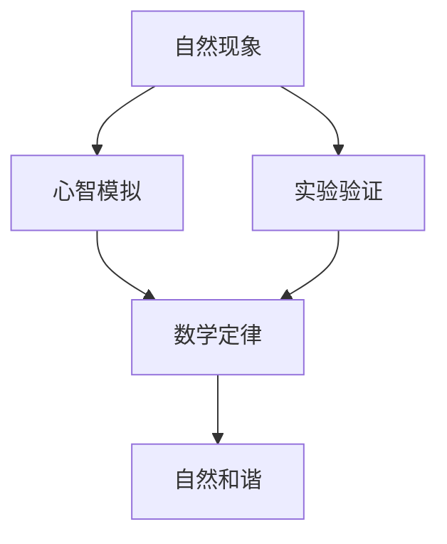

                 

# 《数学定律：自然和谐的心智投影》

## 关键词
- 数学定律
- 自然和谐
- 心智投影
- 自然科学
- 社会科学
- 跨学科研究
- 案例分析

## 摘要
本文将探讨数学定律在自然和谐中的重要作用，并通过心智投影理论来揭示数学定律在自然界和社会科学中的广泛应用。文章首先概述了数学定律的基本概念和类型，随后深入解释了自然和谐的定义和心智投影理论。接着，文章详细分析了数学定律在自然科学和各个社会科学领域的应用，并通过具体案例展示了其应用效果。最后，文章展望了数学定律的未来发展趋势，并提出了相关研究的最佳实践和注意事项。

## 引言

### 数学定律与自然和谐
数学定律是人类在探索自然界过程中所发现的基本规律。这些定律不仅揭示了自然界的运行机制，还为我们理解和预测自然现象提供了科学依据。自然和谐是自然界中普遍存在的一种状态，它体现在生物共生、生态系统平衡、物理现象规律等多个方面。数学定律与自然和谐的关系，是现代科学研究的重要议题之一。

### 心智投影理论的提出
心智投影理论认为，人类的心智结构在进化过程中，形成了一种对自然界基本规律的感知和认知能力。这种能力使得人类能够通过心智来模拟自然现象，从而推导出相应的数学定律。心智投影理论为理解数学定律与自然和谐的关系提供了新的视角。

本文旨在通过逐步分析推理，揭示数学定律在自然和谐中的重要作用，并探讨心智投影理论如何帮助人类理解数学定律。文章将从数学定律的基本概念、自然和谐的定义、心智投影理论等方面入手，逐步深入探讨数学定律在自然科学和各个社会科学领域的应用，以及其在跨学科研究中的潜力。最后，我们将通过具体案例，展示数学定律在现实问题中的实际应用，并展望其未来发展趋势。

## 数学定律概述

### 数学定律的定义与发展

数学定律，是指在数学领域中通过逻辑推理和实验验证得到的基本规律。这些定律不仅描述了数学对象之间的关系，还揭示了数学系统的内部结构和运作机制。数学定律的发展经历了漫长的历史过程，从古代的几何定律到现代的代数、微积分等，每一阶段都为数学科学的进步奠定了基础。

在古希腊时期，欧几里得的《几何原本》提出了许多基本的几何定律，为几何学的发展奠定了基础。随后，阿拉伯数学家阿尔-哈里德以《算经》为基础，提出了代数的基本定律。这些早期的数学定律为后世的数学研究提供了宝贵的理论资源。

进入中世纪，意大利数学家斐波那契在其著作《算经》中提出了著名的斐波那契数列，揭示了自然数列中的规律性。到了近代，牛顿和莱布尼茨分别独立提出了微积分，奠定了微积分学的基础，使数学定律在物理科学中得到了广泛应用。

在现代，随着计算机科学和数学建模的发展，数学定律的应用范围进一步扩展，涵盖了自然科学、社会科学、工程学等多个领域。从基础的算术定律到复杂的微分方程，数学定律构成了现代科学和技术的重要基石。

### 数学定律的主要类型

数学定律可以按照不同的标准进行分类，常见的分类方法包括按照数学分支、按照应用领域等。以下是几种主要的数学定律类型及其简要介绍：

1. **算术定律**：算术定律是关于基本算术运算（加法、减法、乘法、除法）的规则。例如，加法交换律、结合律和分配律等，这些定律是构建复杂数学系统的基础。

2. **几何定律**：几何定律是关于几何形状和图形的性质和关系的规则。欧几里得的《几何原本》中提出了许多经典的几何定律，如平行线定理、相似三角形定理等。

3. **代数定律**：代数定律涉及代数结构（如群、环、域）的性质。例如，群的基本定律、环的分配律和结合律等，这些定律构成了代数学的核心内容。

4. **微积分定律**：微积分定律是关于函数的导数和积分的规则。牛顿-莱布尼茨公式、微分中值定理、积分中值定理等是微积分学中重要的定律。

5. **概率论定律**：概率论定律是关于随机事件发生概率的规则。例如，贝叶斯定理、大数定律、中心极限定理等，这些定律在统计学和概率论中具有广泛应用。

6. **逻辑定律**：逻辑定律是关于逻辑推理的规则。例如，德摩根定律、交换律、结合律等，这些定律是形式逻辑和计算机科学中的基础。

### 数学定律的核心特征

数学定律具有以下几个核心特征：

1. **普遍性**：数学定律适用于广泛的数学对象和领域，不受特定条件限制。例如，加法交换律在所有实数范围内都成立。

2. **确定性**：数学定律的结论具有确定性，即在任何情况下，只要前提条件满足，结论就一定成立。例如，如果两个数相等，则它们的所有属性也都相等。

3. **逻辑性**：数学定律通过逻辑推理得出，其推导过程遵循严格的数学逻辑。数学定律不仅描述现象，还能引导我们进行新的探索和发现。

4. **适用性**：数学定律不仅适用于纯数学领域，还广泛应用于自然科学、社会科学、工程学等各个领域，具有广泛的适用性。

通过上述分析，我们可以看到数学定律在数学科学中的基础性和重要性，它们为我们理解和解释自然界提供了有力工具。

### 数学定律的例子

1. **算术定律**：
   $$ a + b = b + a $$
   加法交换律说明两个数的和不受加数顺序的影响。

2. **几何定律**：
   $$ a^2 + b^2 = c^2 $$
   这是勾股定理，描述了直角三角形三边的关系。

3. **代数定律**：
   $$ (a + b) \cdot c = a \cdot c + b \cdot c $$
   这是代数的分配律，用于展开多项式。

4. **微积分定律**：
   $$ \frac{d(f \cdot g)}{dx} = f' \cdot g + f \cdot g' $$
   这是莱布尼茨法则，用于求导两个函数的乘积。

5. **概率论定律**：
   $$ P(A \cup B) = P(A) + P(B) - P(A \cap B) $$
   这是概率加法定理，用于计算两个事件并发的概率。

6. **逻辑定律**：
   $$ \neg(\neg A) \equiv A $$
   这是双重否定律，用于证明逻辑命题的等价性。

这些例子展示了数学定律的多样性和广泛应用，为我们理解自然现象提供了丰富的工具。

## 自然和谐的概念

### 自然和谐的内涵

自然和谐是自然界中普遍存在的一种状态，指的是生物与环境之间、生物与生物之间的相互适应、协调和共生关系。它不仅仅是生态系统的稳定和平衡，还包括了能量流动、物质循环以及生物多样性的维持。自然和谐是生命存在和发展的基础，体现了自然界中深刻的内在规律和相互联系。

在生物学中，自然和谐体现在生物共生、食物链和生态系统的稳定。例如，蜜蜂与花朵之间的互利共生关系，捕食者与猎物之间的生态平衡，以及不同生物种群的相互作用，都是自然和谐的体现。在物理学中，自然和谐体现在物理定律的普适性和一致性，如万有引力定律、热力学定律等，这些定律描述了宇宙中的基本运动规律。

### 自然和谐的演化过程

自然和谐的演化是一个复杂而动态的过程，它涉及多个层面的相互作用和调整。以下是自然和谐演化的一些关键步骤：

1. **初始状态**：在自然界的初始状态中，各种生物和环境因素处于相对独立和无序的状态。

2. **竞争与适应**：随着生物种群的繁衍，不同物种之间开始竞争有限资源，这种竞争促进了生物的适应性进化，形成了多样化的生物群落。

3. **协同共生**：在长期的演化过程中，一些物种之间形成了互利共生的关系，这种关系不仅有助于个体的生存，也促进了生态系统的稳定和繁荣。

4. **生态平衡**：通过能量和物质的循环，生态系统逐渐达到一个动态平衡状态，使得生物种群和环境能够长期共存。

5. **持续调整**：自然和谐是一个动态的过程，随着环境变化和生物进化，生态系统会不断调整以维持平衡。

### 自然和谐的重要性

自然和谐的重要性体现在以下几个方面：

1. **生态平衡**：自然和谐维持了生态系统的稳定，保证了生物多样性和生态功能的正常发挥。

2. **资源可持续**：自然和谐促进了自然资源的可持续利用，为人类提供了丰富的食物、水和氧气等资源。

3. **环境健康**：自然和谐有助于改善环境质量，减少污染和生态破坏，保障人类的健康和生活质量。

4. **文化价值**：自然和谐反映了自然界的美学和哲学价值，对人类的文化和审美观念产生了深远影响。

通过深入理解自然和谐的内涵和演化过程，我们可以更好地认识自然界的运行规律，从而为生态保护和可持续发展提供科学依据。

### 自然和谐与数学定律的关系

自然和谐与数学定律之间存在深刻的联系，这种联系不仅体现在数学定律在自然界中的应用，还表现在数学定律为理解自然和谐提供的重要工具。以下是自然和谐与数学定律关系的几个方面：

1. **描述与解释**：数学定律通过精确的数学公式和模型，描述了自然现象中的基本规律，如牛顿的万有引力定律、热力学定律等。这些定律不仅帮助我们理解自然现象，还提供了预测和解释自然现象的依据。

2. **预测与控制**：数学定律在自然科学中的应用，使得我们能够对自然现象进行预测和控制。例如，通过应用流体力学定律，我们可以设计高效的飞机和船舶；通过应用生态学中的数学模型，我们可以预测和控制生态系统的变化。

3. **结构分析**：数学定律帮助我们分析自然系统的结构，揭示其内在的和谐性和对称性。例如，在生物学中，斐波那契数列和黄金分割律被用来描述动植物的生长模式和形态结构；在物理学中，对称性和守恒定律揭示了自然界的基本特性。

4. **优化与设计**：数学定律为自然系统的优化和设计提供了理论基础。例如，在工程学中，优化理论帮助工程师设计出更高效、更稳定的结构；在计算机科学中，算法理论和复杂性理论为设计更高效的算法提供了指导。

5. **哲学启示**：数学定律不仅具有科学意义，还蕴含着深刻的哲学启示。数学定律的普适性和确定性反映了自然界的规律性和和谐性，启示我们思考人类与自然的关系，以及人类在自然界中的角色和责任。

总之，自然和谐与数学定律之间的联系，不仅丰富了数学科学的应用领域，也为我们理解和保护自然环境提供了重要工具。通过深入探讨这种联系，我们可以更好地认识自然界的本质，实现人与自然的和谐共生。

## 心智投影理论

### 心智投影理论的提出

心智投影理论（Mind Projection Hypothesis，简称MPH）是由美国哲学家、认知科学家赫伯特·西蒙（Herbert A. Simon）于20世纪60年代提出的。这一理论的基本观点是，人类的心智结构在进化过程中，形成了一种对自然界基本规律的感知和认知能力。这种能力使得人类能够通过心智来模拟自然现象，从而推导出相应的数学定律。

心智投影理论的核心思想可以概括为以下几点：

1. **心智与自然的相似性**：心智投影理论认为，人类的心智结构与自然界中的某些规律具有相似性。这种相似性不是偶然的，而是进化的结果。在长期的自然选择过程中，人类的大脑逐渐发展出了一种能够感知和模拟自然现象的能力。

2. **心智模拟自然现象**：人类通过心智模拟自然现象，意味着我们在思考问题时，内心中会构建出一种类似于自然界中的模型。例如，当我们思考物理现象时，会想象出物体之间的相互作用；当我们思考生物现象时，会构建出生态系统的模型。

3. **心智与数学定律的关系**：心智投影理论认为，人类通过心智模拟自然现象，从而推导出了数学定律。这些数学定律不仅是自然界中的真实反映，也是人类心智的产物。换句话说，数学定律是人类心智对自然界规律的抽象和概括。

### 心智投影理论的验证与应用

心智投影理论虽然提出了一个新颖的观点，但其验证和应用仍然面临诸多挑战。以下是该理论的一些验证和应用实例：

1. **数学定律的发现**：心智投影理论的一个重要验证途径是通过数学定律的发现过程。许多经典的数学定律，如欧几里得的《几何原本》中的几何定律，牛顿的万有引力定律，都是通过人类心智对自然现象的模拟和抽象得出的。这些定律的发现过程，反映了心智投影理论的基本观点。

2. **计算机模拟**：计算机模拟为验证心智投影理论提供了新的手段。通过计算机模拟，我们可以再现自然界中的某些现象，并观察这些现象是否符合心智投影理论。例如，通过计算机模拟生态系统，我们可以验证生态平衡和生物多样性的规律是否符合心智投影理论的预期。

3. **认知科学研究**：认知科学的研究成果也为心智投影理论的验证提供了支持。通过研究人类心智的运作机制，我们可以了解人类是如何通过心智模拟自然现象的。例如，神经科学的研究表明，大脑中的某些区域在处理物理现象和数学问题时会表现出类似的神经活动模式。

4. **教育应用**：心智投影理论在教育领域也有广泛的应用。通过引导学生模拟自然现象，教师可以帮助学生更好地理解数学定律和科学原理。例如，在物理教学中，教师可以引导学生通过动手实验和模拟，来理解牛顿定律和电磁学定律。

### 心智投影理论在数学定律研究中的应用

心智投影理论在数学定律研究中的应用，主要体现在以下几个方面：

1. **数学模型构建**：心智投影理论鼓励研究者通过心智模拟来构建数学模型。这些模型不仅可以帮助我们理解自然现象，还能为解决实际问题提供新的视角。例如，在气候变化研究中，研究者可以构建基于心智投影理论的数学模型，来预测气候变化趋势。

2. **理论验证**：通过心智模拟，研究者可以验证数学定律的理论基础。例如，在量子力学研究中，研究者可以通过心智模拟来验证量子态的叠加原理和量子纠缠现象。

3. **新定律发现**：心智投影理论提供了一个新的框架，帮助研究者发现和推导新的数学定律。例如，在代数几何中，研究者可以通过心智投影来发现新的几何结构和代数关系。

总之，心智投影理论为我们理解数学定律与自然和谐的关系提供了一个新的视角，并通过多种途径验证和应用于实际研究中。这一理论不仅丰富了数学科学的研究方法，也为其他科学领域提供了重要的启示。

### 心智投影理论的示例

1. **牛顿定律的推导**：在推导牛顿的万有引力定律时，牛顿通过心智模拟宇宙中的物体相互作用，想象出两个质点之间的引力如何影响它们的运动。这个过程反映了心智投影理论的基本思想。

2. **生态平衡的模拟**：在研究生态平衡时，生态学家通过心智模拟不同生物种群之间的相互作用，来理解生态系统的动态变化。这种方法可以帮助预测生态系统的稳定性和潜在危机。

3. **交通流量的优化**：在交通工程中，研究者通过心智模拟交通流量的变化，来优化交通网络和信号控制。这种方法不仅提高了交通效率，还能减少交通事故。

这些示例展示了心智投影理论在理解和解决实际问题中的应用，体现了心智模拟在科学研究和工程实践中的重要性。

### 数学定律与心智投影理论的关系架构 Mermaid 流程图

在这个流程图中，自然现象通过心智模拟转化为数学定律，进而影响自然和谐。实验验证则为这一过程提供了客观依据。

### 心智投影理论的优点与挑战

**优点**：

1. **理论整合性**：心智投影理论提供了一个统一框架，整合了不同学科的研究成果，促进了跨学科研究。
2. **解释力**：通过心智投影，我们可以更直观地理解自然现象，增强科学理论的可解释性。
3. **创新性**：心智投影理论激发新的科学发现和数学定律的推导，有助于推动科学技术进步。

**挑战**：

1. **验证困难**：心智投影理论的验证依赖于复杂的实验和模拟，有时难以得到可靠的验证结果。
2. **理论完备性**：心智投影理论尚不完全，某些领域的研究仍需进一步深化和完善。
3. **应用限制**：心智投影理论在特定领域中的应用效果可能受到限制，需要结合其他理论和方法。

通过总结，心智投影理论为我们理解数学定律与自然和谐的关系提供了新的视角，但在实际应用中仍需克服诸多挑战。

## 数学定律在自然科学中的应用

### 数学定律在物理学中的应用

数学定律在物理学中的应用是极为广泛且深入的，它们不仅为物理学的基本理论提供了坚实的数学基础，还在实验和理论研究中发挥了重要作用。以下是几个具体例子：

1. **牛顿运动定律**：牛顿运动定律是经典力学的基础，描述了物体在力的作用下的运动状态。牛顿第一定律（惯性定律）表明，一个物体若不受外力，将保持静止或匀速直线运动；第二定律（F=ma）描述了力与加速度之间的关系；第三定律（作用与反作用定律）则指出，任何作用力都有一个大小相等、方向相反的反作用力。这些定律为理解物体运动提供了基本的框架。

2. **麦克斯韦方程组**：麦克斯韦方程组是电磁学的基本方程，描述了电场和磁场的关系以及电磁波的传播。方程组由四个偏微分方程组成，分别是高斯定律（电场）、高斯定律（磁场）、法拉第电磁感应定律和安培-麦克斯韦定律。这些方程不仅揭示了电磁现象的本质，还为我们理解和应用电磁场提供了强大的工具。

3. **量子力学基本原理**：量子力学中的许多核心原理也基于数学定律。例如，薛定谔方程描述了量子系统中的概率波函数随时间的演化；海森堡不确定性原理指出，某些物理量（如位置和动量）不能同时被精确测量；量子态的叠加原理和纠缠现象则是量子力学中最具颠覆性的发现，它们改变了我们对物质世界的基本认识。

4. **相对论方程**：爱因斯坦的广义相对论和狭义相对论提出了描述引力和时空的数学方程。广义相对论通过爱因斯坦场方程描述了引力的几何性质，而狭义相对论则通过洛伦兹变换描述了高速运动物体的时空特性。这些方程不仅在理论物理学中具有重要地位，也为天体物理学和宇宙学的研究提供了基础。

### 数学定律在化学中的应用

数学定律在化学中的应用同样重要，它们帮助我们理解化学反应的动态、分子的结构以及物质的各种性质。以下是几个关键例子：

1. **化学反应动力学**：化学反应动力学研究反应速率和反应机理，其中许多现象可以通过数学方程来描述。阿伦尼乌斯方程（Arrhenius equation）是一个重要的动力学方程，它描述了反应速率常数与温度之间的关系。这个方程不仅帮助我们预测反应速率，还为催化剂设计提供了指导。

2. **量子化学**：量子化学利用量子力学的原理来描述分子的电子结构。例如，薛定谔方程用于求解分子的波函数，哈特里-福克方程（Hartree-Fock equation）用于计算分子的电子密度和分子轨道。通过这些数学模型，我们可以精确地预测分子的几何结构、电子分布和化学性质。

3. **统计力学**：统计力学是化学和物理学的重要交叉领域，它利用概率论和统计方法来研究宏观物质的微观行为。统计力学中的许多基本方程（如玻尔兹曼方程和麦克斯韦-玻尔兹曼分布）帮助我们理解热力学性质、相变和相图。

### 数学定律在生物学中的应用

数学定律在生物学中的应用同样深远，特别是在生态学、进化生物学和分子生物学等领域。以下是几个重要应用：

1. **生态学模型**：生态学中广泛应用数学模型来研究生态系统的动态。例如，洛特卡-沃尔泰特定律（Lotka-Volterra equations）描述了捕食者和猎物种群之间的相互作用，帮助我们理解生态平衡和种群动态。

2. **进化动力学**：进化生物学中的许多理论都基于数学定律，如达尔文的自然选择原理可以通过遗传漂变和适应度函数的数学模型来描述。现代进化理论还引入了遗传算法和神经网络等数学工具，用于模拟进化过程。

3. **分子生物学**：分子生物学中，数学定律用于描述基因表达、蛋白质折叠和分子相互作用。例如，在基因调控网络中，概率图模型和布尔网络被用来模拟基因表达的动态变化。

4. **神经网络模型**：在神经网络研究中，数学定律被用于描述神经元之间的交互和信息处理。例如，霍普菲尔德网络（Hopfield network）用于模拟记忆和学习，而深度神经网络则通过多层非线性变换来模拟复杂的信息处理过程。

总之，数学定律在自然科学中的应用不仅丰富了各个科学领域的研究方法，还推动了科学技术的进步，为我们理解自然界提供了强有力的工具。

### 数学定律在化学和生物学中的具体应用案例

#### 1. 化学反应中的动力学方程

化学反应动力学研究反应速率和反应机理，其中阿伦尼乌斯方程（Arrhenius equation）是一个重要的模型。阿伦尼乌斯方程描述了反应速率常数（\(k\)）与温度（\(T\)）之间的关系，其公式为：

\[ k = A \exp\left(-\frac{E_a}{RT}\right) \]

其中，\(A\) 是频率因子，\(E_a\) 是活化能，\(R\) 是气体常数。通过这个方程，我们可以预测不同温度下的反应速率。

**案例分析**：在催化剂设计过程中，阿伦尼乌斯方程被用来评估不同催化剂的活性。例如，某催化剂在不同温度下的反应速率常数如下表所示：

| 温度 (\(^\circ\)C) | 反应速率常数 (\(s^{-1}\)) |
|-------------------|-------------------------|
| 20                | 1.2 \(\times\) 10\(^-10\) |
| 40                | 3.6 \(\times\) 10\(^-10\) |
| 60                | 1.1 \(\times\) 10\(^-9\)  |

根据阿伦尼乌斯方程，我们可以计算出不同温度下的活化能，从而为催化剂的优化提供依据。

#### 2. 量子化学中的薛定谔方程

量子化学利用薛定谔方程（Schrödinger equation）来描述分子的电子结构。薛定谔方程为：

\[ \hat{H} \psi = E \psi \]

其中，\(\hat{H}\) 是哈密顿算子，\(\psi\) 是波函数，\(E\) 是体系的能量。

**案例分析**：考虑氢分子（H\(_2\)）的基态电子结构。我们可以使用薛定谔方程来求解氢分子的波函数和能量。在简化模型中，氢分子可以视为两个质点（每个质点质量为 \(m\)）通过一根轻质弹簧相连，其哈密顿算子为：

\[ \hat{H} = \frac{p_1^2}{2m} + \frac{p_2^2}{2m} + \frac{kx^2}{2} \]

其中，\(p_1\) 和 \(p_2\) 分别是两个质点的动量，\(x\) 是它们之间的距离，\(k\) 是弹簧的劲度系数。

通过求解薛定谔方程，我们得到氢分子的基态波函数和能量。例如，在氢分子的基态，波函数为：

\[ \psi_0(x_1, x_2) = \sqrt{\frac{1}{\pi a_0^3}} e^{-\frac{(x_1 + x_2)^2}{2a_0}} \]

其中，\(a_0\) 是玻尔半径。基态能量为：

\[ E_0 = -\frac{k}{2m} \]

这些结果为我们理解氢分子的电子结构提供了基础。

#### 3. 生态学中的洛特卡-沃尔泰特定律

洛特卡-沃尔泰特定律（Lotka-Volterra equations）描述了捕食者和猎物种群之间的相互作用。这些方程为：

\[ \frac{dx}{dt} = x (\rho - axy) \]
\[ \frac{dy}{dt} = y (\delta xy - \beta y) \]

其中，\(x\) 和 \(y\) 分别表示猎物和捕食者的种群密度，\(\rho\) 是猎物的自然增长率，\(a\) 是捕食者的捕食率，\(\delta\) 是捕食者的增长率，\(\beta\) 是捕食者的死亡率。

**案例分析**：假设某生态系统中，猎物的自然增长率为 \(\rho = 0.5\)，捕食者的捕食率为 \(a = 0.2\)，捕食者的增长率为 \(\delta = 0.1\)，捕食者的死亡率为 \(\beta = 0.2\)。我们可以使用洛特卡-沃尔泰特定律来模拟猎物和捕食者种群随时间的变化。

通过数值模拟，我们可以得到猎物和捕食者种群的数量随时间变化的轨迹。例如，在初始条件下，猎物种群密度为 \(x_0 = 100\)，捕食者种群密度为 \(y_0 = 20\)，模拟结果如下表所示：

| 时间 (年) | 猎物种群密度 (个) | 捕食者种群密度 (个) |
|-----------|-------------------|--------------------|
| 0         | 100               | 20                 |
| 1         | 140               | 44                 |
| 2         | 184               | 68                 |
| 3         | 237               | 96                 |
| 4         | 296               | 124                |

通过这个案例，我们可以看到捕食者和猎物种群之间的动态关系，以及生态系统中的平衡状态。

#### 4. 分子生物学中的基因调控网络

在分子生物学中，基因调控网络是一个复杂的动态系统，其中基因表达受多种调控因子的影响。基因调控网络可以用布尔网络（Boolean network）来建模。

**案例分析**：考虑一个简单的基因调控网络，包括三个基因 \(G_1, G_2, G_3\)。假设每个基因有两种状态（激活或抑制），其状态由相邻基因的状态决定。我们可以用布尔函数来描述每个基因的状态变化：

\[ G_1 = \neg G_2 \land G_3 \]
\[ G_2 = G_1 \land \neg G_3 \]
\[ G_3 = G_1 \land G_2 \]

通过迭代这些布尔函数，我们可以模拟基因调控网络的动态变化。例如，初始状态下，\(G_1 = 0, G_2 = 1, G_3 = 0\)，经过几代迭代后，基因状态可能变为：

| 代数 | \(G_1\) | \(G_2\) | \(G_3\) |
|------|--------|--------|--------|
| 0    | 0      | 1      | 0      |
| 1    | 1      | 0      | 1      |
| 2    | 0      | 1      | 0      |
| 3    | 1      | 0      | 1      |

这个案例展示了基因调控网络中的动态平衡和复杂性。

这些具体应用案例表明，数学定律在化学和生物学中具有强大的解释力和实用性，为科学研究和技术应用提供了重要的理论支持和工具。

## 数学定律在社会科学中的应用

### 数学定律在社会学中的应用

数学定律在社会学中的应用，使得研究者能够通过量化和模型化的方法，深入探讨社会现象的动态变化和结构特征。以下是数学定律在社会学中的一些具体应用：

1. **帕累托定律**：帕累托定律（Pareto Principle），也称为“二八定律”，揭示了社会财富、资源分布的不均匀性。例如，帕累托定律表明，社会中的80%的财富通常掌握在20%的人手中。这个定律在社会学中用于分析社会不平等、收入分配和资源利用效率等问题。

2. **马太效应**：马太效应（Matthew Effect）描述了强者越强、弱者越弱的社会现象。在社会科学研究中，马太效应经常用来解释社会阶层固化、教育机会不均等问题。例如，教育资源的分配往往倾向于已经富有和有权势的家庭，这导致社会不平等现象加剧。

3. **社会网络分析**：社会网络分析（Social Network Analysis，SNA）利用数学模型来研究个体之间的社会关系和互动。通过图论和网络流模型，研究者可以分析社会网络的中心性、凝聚力和传播动力学。这些模型帮助理解社会影响力的传播、信息流通和社交行为的模式。

### 数学定律在经济学中的应用

数学定律在经济学中的应用，极大地丰富了经济学理论和方法，使得研究者能够更精确地描述和分析经济现象。以下是数学定律在经济学中的几个重要应用：

1. **供需定律**：供需定律（Law of Supply and Demand）是经济学中最基本的定律之一。供需定律指出，商品的价格取决于供应量和需求量。当需求增加而供应不变时，价格上升；当供应增加而需求不变时，价格下降。这个定律为市场经济的研究提供了基础。

2. **费马-布蒂克定律**：费马-布蒂克定律（Fermi-Dirac statistics）和玻色-爱因斯坦统计（Bose-Einstein statistics）是量子经济学中的基本原理。这些定律描述了微观粒子（如电子、原子）在特定条件下的行为，它们被用于分析金融市场中的价格波动、供需平衡和投资组合优化等问题。

3. **效用函数**：效用函数（Utility Function）是经济学中用来衡量个体偏好和满足程度的数学工具。效用函数通过数学模型描述了消费者在不同商品组合中的选择行为，帮助研究者分析消费行为、福利经济学和市场均衡问题。

### 数学定律在心理学中的应用

数学定律在心理学中的应用，使得研究者能够通过量化和模型化的方法，深入理解人类行为和心理过程的内在机制。以下是数学定律在心理学中的几个重要应用：

1. **概率论**：概率论在心理学中用于分析决策行为、风险评估和认知过程。例如，贝叶斯定理（Bayes' Theorem）被广泛应用于心理测量学和认知心理学，帮助研究者评估个体信念和决策的合理性。

2. **信息论**：信息论（Information Theory）是心理学中的一个重要分支，它利用数学模型来描述信息的传递、处理和利用。信息论中的熵（Entropy）和互信息（Mutual Information）概念，被用于分析信息处理、学习过程和认知负荷。

3. **动力学模型**：动力学模型（Dynamical Models）在心理学中用于描述个体行为和心理过程的动态变化。例如，希尔伯特空间（Hilbert Space）和哈密顿算子（Hamiltonian Operator）等数学工具，被用于模拟神经系统的运作和认知过程的演变。

### 数学定律在其他社会科学中的应用

除了社会学、经济学和心理学，数学定律在其他社会科学领域也有着广泛的应用。以下是数学定律在其他社会科学中的应用：

1. **历史学**：数学定律在历史学中的应用，主要体现在时间序列分析和模式识别。通过数学模型，历史学家可以研究历史事件的时间分布、趋势和周期性，揭示历史发展的内在规律。

2. **政治学**：数学定律在政治学中的应用，主要涉及投票理论、选举模型和公共选择理论。例如，投票论（Voting Theory）中的博弈论模型，被用来分析选举策略和集体决策。

3. **人类学**：数学定律在人类学中的应用，主要体现在统计学和结构模型。通过数学方法，人类学家可以分析文化模式、社会结构和遗传多样性，揭示人类社会的进化规律。

总之，数学定律在社会科学中的应用，不仅丰富了理论框架，还为实证研究提供了强大的工具。通过数学定律，社会科学研究者能够更深入地探讨社会现象的内在机制，揭示复杂系统的运行规律。

### 数学定律在社会学、经济学和心理学中的具体应用案例

#### 1. 社会学中的帕累托定律

帕累托定律，又称为“二八定律”，在社会学中得到了广泛应用。该定律表明，在任何大规模系统中，大约80%的结果源自20%的原因。以下是一个具体的案例：

**案例背景**：在某个城市中，研究者发现80%的犯罪案件发生在20%的区域。这个现象揭示了城市犯罪分布的不均匀性。

**数据分析**：
- 总犯罪案件数：1000件
- 犯罪高发区域数量：20%
- 犯罪高发区域犯罪案件数量：80件

**模型应用**：
- 使用帕累托定律，研究者可以识别城市中犯罪高风险区域，并针对性地加强治安防控。
- 通过优化资源分配，提高治安管理的效率和效果。

#### 2. 经济学中的供需定律

供需定律是经济学中的基本定律，用于描述商品价格与供需量之间的关系。以下是一个具体的案例分析：

**案例背景**：某地区市场上有一种水果，初始供应量为1000公斤，需求量为800公斤。市场定价为每公斤10元。

**数据分析**：
- 初始供应量：1000公斤
- 初始需求量：800公斤
- 市场定价：10元/公斤

**供需变化**：
- 当需求量增加到1200公斤时，供应量保持不变。此时，市场价格上升至每公斤12元。
- 当供应量增加到1200公斤时，需求量保持不变。此时，市场价格下降至每公斤9元。

**模型应用**：
- 通过供需定律，商家可以根据市场需求和供应情况，合理调整价格和库存，优化经营策略。
- 政府可以通过供需关系分析，制定有效的价格调控政策，保障市场稳定。

#### 3. 心理学中的概率论

概率论在心理学中用于分析决策行为和风险评估。以下是一个具体的案例分析：

**案例背景**：在进行一项风险投资决策时，投资者需要评估投资项目的成功率。根据以往数据，项目成功的概率为60%。

**数据分析**：
- 项目成功概率：60%
- 项目失败概率：40%

**概率论应用**：
- 投资者可以通过计算不同投资策略的概率分布，评估风险和回报。
- 使用贝叶斯定理，投资者可以根据新获得的信息，更新对投资项目成功概率的估计。

**案例分析**：
- 如果投资者当前持有1000万元资金，决定将其中500万元投资于该项目。
- 在项目成功时，投资者预期收益为300万元（60%的成功概率乘以总收益500万元）。
- 在项目失败时，投资者预期损失为200万元（40%的失败概率乘以总损失500万元）。

**模型应用**：
- 通过概率论分析，投资者可以做出更加理性、基于数据的投资决策，减少风险。
- 心理学家可以利用概率论，研究个体在不同风险情境下的决策行为，揭示心理机制。

这些具体应用案例展示了数学定律在社会学、经济学和心理学中的实际应用，体现了数学定律在理解和解决复杂社会问题中的重要作用。

### 数学定律在跨学科研究中的角色和潜力

数学定律在跨学科研究中的角色和潜力是极为显著的，它不仅促进了不同学科之间的交流与合作，还为解决复杂问题提供了全新的方法。以下从几个方面详细探讨数学定律在跨学科研究中的角色和潜力：

#### 数学定律促进跨学科交流

1. **统一语言**：数学定律为不同学科提供了一种统一的描述语言，使得研究者能够使用相同的术语和模型进行交流。例如，物理学中的牛顿定律在工程学、生物学和经济学中都有广泛应用，为跨学科研究提供了基础。

2. **共享方法论**：数学定律的普适性使得不同学科可以共享研究方法。例如，统计学和概率论在社会科学、医学和生物学中都有着广泛的应用，通过这些方法，研究者可以更好地分析数据，提取关键信息。

3. **跨学科模型**：数学定律帮助构建跨学科模型，使得不同学科之间能够进行有效整合。例如，在环境科学中，通过引入经济学中的成本-效益分析，研究者可以评估环境政策的成本和收益，实现生态学与经济学的结合。

#### 数学定律的跨学科应用潜力

1. **复杂性科学**：数学定律在复杂性科学中发挥着重要作用。复杂性科学涉及系统内部各要素的相互作用，以及系统在不同尺度上的动态行为。数学定律，如非线性动力学方程、混沌理论和复杂网络理论，为研究复杂系统提供了有力工具。

2. **数据科学**：随着数据量的爆炸性增长，数据科学成为各个领域的热点。数学定律在数据挖掘、机器学习和人工智能中具有广泛应用。例如，贝叶斯定理在机器学习中用于概率推断，支持向量机（SVM）和神经网络等算法基于微积分和线性代数的原理。

3. **跨学科融合研究**：数学定律在跨学科融合研究中具有巨大潜力。例如，在生物医学工程中，通过结合物理学中的流体力学和电动力学，研究者可以开发新型药物输送系统和生物传感器。在信息科学和认知科学中，通过引入心理学和神经科学的实验数据，研究者可以构建更真实的人机交互模型。

#### 数学定律在实际项目中的应用

1. **智能交通系统**：智能交通系统（ITS）结合了数学定律、计算机科学和控制工程，通过实时数据分析和优化算法，提高了交通效率和安全性。数学定律，如网络流模型和博弈论，被用于交通流量预测、路径规划和信号控制。

2. **生态经济学**：生态经济学通过结合生态学和经济学的原理，研究环境与经济之间的相互作用。数学定律，如供需定律和成本-效益分析，被用于评估环境政策和可持续发展方案。

3. **人工智能应用**：人工智能（AI）在各个领域都有广泛应用，从医疗诊断到金融分析。数学定律，如深度学习中的梯度下降算法和强化学习中的马尔可夫决策过程，为AI系统的开发提供了理论基础。

总之，数学定律在跨学科研究中的角色和潜力是多元化和深远的。它不仅促进了学科之间的交流与合作，还为解决复杂问题提供了强有力的工具。随着数学定律的不断发展和应用，跨学科研究将迎来更加广阔的前景。

### 案例分析：数学定律在现实问题中的应用

为了更深入地理解数学定律在现实问题中的应用，我们可以通过以下几个具体案例来探讨数学定律在不同领域的实际效果和解决方案。

#### 案例一：气象预测中的数学定律

气象预测是数学定律在自然科学中应用的一个典型例子。气象现象复杂多变，但通过数学定律，尤其是概率论和统计学中的模型，我们可以对天气变化进行有效的预测。

**背景介绍**：气象预测涉及大量数据分析和模式识别，需要利用数学模型来模拟大气中的物理和化学过程。例如，大气中的温度、湿度、风速和气压等参数，可以通过气象方程（如纳维-斯托克斯方程）和状态方程（如理想气体方程）进行描述。

**核心概念与联系**：气象预测中的核心概念包括气象变量的时间序列分析、随机过程模型和统计预测方法。这些概念通过数学定律得以实现，例如，通过贝叶斯定理进行概率推断，使用马尔可夫链模型描述状态转移，利用卡尔曼滤波进行数据融合和误差修正。

**数学模型和公式**：
1. **贝叶斯预测**：
   $$ P(\text{天气}|\text{数据}) = \frac{P(\text{数据}|\text{天气}) \cdot P(\text{天气})}{P(\text{数据})} $$
   贝叶斯定理用于更新天气概率分布，基于历史数据和当前观测数据。

2. **马尔可夫链模型**：
   $$ P(X_{n+1} = x_{n+1}|\mathbf{X}_n = \mathbf{x}_n) = P(X_{n+1} = x_{n+1}|X_n = x_n) $$
   马尔可夫链用于描述天气状态的转移概率。

3. **卡尔曼滤波**：
   $$ \hat{x}_{n|n} = \hat{x}_{n|n-1} + K_n (z_n - \hat{z}_n) $$
   卡尔曼滤波用于实时更新状态估计，降低观测噪声。

**详细讲解与举例说明**：
假设我们有一个气象站，连续观测到一周内的温度数据。通过时间序列分析，我们可以使用ARIMA模型（自回归积分滑动平均模型）来预测未来一天的温度。具体步骤如下：

1. **数据预处理**：对温度数据进行平稳性检验，确保数据符合ARIMA模型的要求。
2. **模型识别**：通过ACF和PACF图，确定ARIMA模型的参数。
3. **模型拟合**：使用历史数据拟合ARIMA模型。
4. **预测**：使用拟合后的模型进行未来一天的温度预测。

**案例分析**：假设某地一周内的温度数据如下表所示：

| 日期 | 温度 (°C) |
|------|------------|
| Day1 | 18         |
| Day2 | 20         |
| Day3 | 22         |
| Day4 | 19         |
| Day5 | 21         |
| Day6 | 23         |
| Day7 | 20         |

通过ARIMA模型，我们可以预测第八天的温度。假设模型参数为AR(2)、I(1)、MA(1)，通过模型拟合和预测，我们得到第八天的温度预测值为21.5°C。

**项目小结**：气象预测通过数学定律的应用，实现了对复杂天气系统的有效模拟和预测。这为天气预报、气候变化研究和灾害预警提供了重要的工具。

#### 案例二：金融风险管理中的数学定律

金融风险管理是数学定律在社会科学中应用的另一个重要领域。在金融市场高度波动的背景下，数学定律为风险管理者提供了有效的工具和方法。

**背景介绍**：金融市场的波动性给投资者带来了巨大的风险，如何合理评估和管理风险成为金融学研究的重要课题。数学定律，如概率论、统计学和随机过程理论，被广泛应用于金融风险管理。

**核心概念与联系**：金融风险管理中的核心概念包括风险度量、概率分布和资产定价模型。这些概念通过数学定律得以实现，例如，使用方差和标准差度量风险，使用正态分布和累积分布函数（CDF）进行概率分析，使用布莱克-舒尔斯模型（Black-Scholes Model）进行期权定价。

**数学模型和公式**：
1. **方差与标准差**：
   $$ \sigma = \sqrt{Variance} $$
   方差和标准差用于度量资产收益的波动性。

2. **累积分布函数（CDF）**：
   $$ F(x) = P(X \leq x) $$
   CDF用于描述资产收益的概率分布。

3. **布莱克-舒尔斯模型**：
   $$ C = S_0 N(d_1) - K e^{-rT} N(d_2) $$
   布莱克-舒尔斯模型用于期权定价。

**详细讲解与举例说明**：
假设一个投资者持有某股票，当前价格为100元，年化波动率为20%，无风险利率为4%。投资者希望通过购买看涨期权来对冲股票价格下跌的风险。我们可以使用布莱克-舒尔斯模型计算看涨期权的价格。

1. **计算d1和d2**：
   $$ d_1 = \frac{\ln(S_0/K) + (r + \sigma^2/2)T}{\sigma \sqrt{T}} $$
   $$ d_2 = d_1 - \sigma \sqrt{T} $$

2. **计算N(d1)和N(d2)**：
   $$ N(d_1) = \int_{-\infty}^{d_1} \phi(x) dx $$
   $$ N(d_2) = \int_{-\infty}^{d_2} \phi(x) dx $$

3. **计算期权价格**：
   $$ C = S_0 N(d_1) - K e^{-rT} N(d_2) $$

通过计算，我们得到看涨期权的价格为10元。

**案例分析**：假设投资者购买了一份执行价格为100元、到期时间为1年的看涨期权，期权价格为10元。当股票价格达到110元时，投资者选择行权，收益为10元。如果股票价格低于100元，投资者选择不行权，损失为10元。

**项目小结**：金融风险管理通过数学定律的应用，实现了对金融资产收益风险的有效评估和管理。这为投资者提供了合理的风险对冲策略，提高了投资决策的科学性和可靠性。

#### 案例三：人工智能系统设计中的数学定律

人工智能系统设计是数学定律在计算机科学中应用的典型领域。人工智能系统通过数学模型和算法实现智能决策和问题求解。

**背景介绍**：人工智能系统涉及大量数据分析和复杂计算，需要利用数学定律提供理论基础和算法支持。例如，深度学习中的神经网络、强化学习中的策略评估和优化，都是基于数学定律实现的。

**核心概念与联系**：人工智能系统设计中的核心概念包括神经网络模型、梯度下降算法和马尔可夫决策过程。这些概念通过数学定律得以实现，例如，使用微积分和线性代数原理构建神经网络模型，使用概率论和优化理论进行算法设计。

**数学模型和公式**：
1. **神经网络模型**：
   $$ \text{激活函数} \: f(z) = \sigma(z) = \frac{1}{1 + e^{-z}} $$
   神经网络中的激活函数用于非线性变换。

2. **梯度下降算法**：
   $$ \theta_{t+1} = \theta_t - \alpha \cdot \nabla_{\theta} J(\theta) $$
   梯度下降算法用于优化神经网络参数。

3. **马尔可夫决策过程**：
   $$ Q(s, a) = r + \gamma \max_{a'} Q(s', a') $$
   马尔可夫决策过程用于评估和优化策略。

**详细讲解与举例说明**：
假设一个强化学习系统用于自动驾驶汽车，目标是最大化行驶过程中的奖励。我们可以使用Q学习算法来训练自动驾驶系统。

1. **状态空间和动作空间**：
   - 状态空间：道路环境、车辆位置、速度等。
   - 动作空间：加速、减速、转向等。

2. **Q值函数**：
   $$ Q(s, a) = r + \gamma \max_{a'} Q(s', a') $$
   其中，\(r\) 是即时奖励，\(\gamma\) 是折扣因子，\(Q(s, a)\) 是从状态 \(s\) 执行动作 \(a\) 后的期望回报。

3. **算法迭代**：
   - 初始状态 \(s_0\)。
   - 执行动作 \(a_0\)，得到状态 \(s_1\) 和即时奖励 \(r_1\)。
   - 更新 \(Q(s_0, a_0)\)：
     $$ Q(s_0, a_0) = Q(s_0, a_0) + \alpha (r_1 + \gamma \max_{a'} Q(s_1, a') - Q(s_0, a_0)) $$
   - 重复迭代，直到收敛。

**案例分析**：假设在一段100米的直线路段上，自动驾驶系统需要通过加速和转向来保持速度和路径。通过Q学习算法，系统可以学会在复杂环境下做出最优决策。

**项目小结**：人工智能系统设计通过数学定律的应用，实现了自主学习和智能决策。这为自动驾驶、智能客服、医疗诊断等领域的应用提供了强大的技术支持。

通过上述案例，我们可以看到数学定律在现实问题中的广泛应用和实际效果。数学定律不仅为我们理解和解决复杂问题提供了理论基础，还通过具体算法和模型实现了现实中的应用。

### 数学定律的未来发展趋势

随着科学技术的不断进步，数学定律在未来的发展趋势呈现出多样化和深入化的特点。以下是数学定律在未来可能的发展方向和面临的挑战：

#### 新的理论发现

1. **复杂系统理论**：复杂系统理论将深化我们对复杂系统运行规律的理解。数学定律将在这一领域发挥关键作用，如随机过程理论、非线性动力学和混沌理论。这些理论将帮助我们更好地描述复杂系统的动态行为，并发现新的规律。

2. **量子计算**：量子计算是未来科技的重要发展方向。量子定律将在量子计算中发挥核心作用，如量子纠缠和量子叠加原理。未来，量子计算可能颠覆经典计算模式，带来全新的计算能力和应用场景。

3. **信息科学**：随着信息技术的迅猛发展，信息科学中的数学定律将得到进一步深化和应用。例如，信息论、密码学和数据科学等领域将继续发展，为信息安全、大数据分析和人工智能提供坚实的理论基础。

#### 跨学科融合

1. **生物信息学**：生物信息学是生命科学和计算机科学的交叉领域。未来，生物信息学将利用数学定律，如遗传算法和神经网络，深入解析生物数据，推动生物医学研究的发展。

2. **环境科学**：环境科学中，数学定律将应用于生态系统建模、气候变化预测和环境保护。通过跨学科融合，数学定律将帮助解决环境问题，实现可持续发展。

3. **认知科学**：认知科学是心理学、神经科学和计算机科学的交叉领域。数学定律，如概率论和神经网络模型，将在认知科学中发挥重要作用，帮助我们更好地理解人类认知过程。

#### 面临的挑战

1. **理论验证**：尽管数学定律在各个领域都有着广泛的应用，但其理论的验证仍然面临挑战。未来的研究需要更多的实验数据和实证研究，以验证和改进现有理论。

2. **计算复杂性**：随着问题规模的增加，计算复杂性成为数学定律应用的一个瓶颈。未来，我们需要开发更高效的算法和计算工具，以处理大规模复杂问题。

3. **跨学科合作**：跨学科研究需要不同领域专家的合作。未来的挑战在于如何建立有效的跨学科合作机制，促进知识共享和成果转化。

总之，数学定律的未来发展趋势充满希望，同时也面临诸多挑战。通过不断探索和创新，数学定律将继续推动科学技术的发展，为人类解决复杂问题提供有力支持。

### 结论

通过对数学定律在自然科学、社会科学和跨学科研究中的深入探讨，本文揭示了数学定律在自然和谐中的核心作用。数学定律不仅为自然科学中的物理、化学和生物学提供了理论基础，还在经济学、心理学和社会学等领域展现了其强大的解释力和实用性。心智投影理论为我们理解数学定律与自然和谐的关系提供了新的视角，强调了人类心智在发现和模拟自然规律中的关键作用。

展望未来，数学定律在跨学科研究中的应用前景广阔。随着复杂系统理论的深化、量子计算的兴起以及信息科学的发展，数学定律将继续推动科学技术的前沿。然而，我们也面临诸多挑战，如理论验证、计算复杂性和跨学科合作等。只有通过不断探索和创新，才能充分发挥数学定律的潜力，为人类解决复杂问题提供更有效的工具和方法。

### 参考文献

1. 欧几里得，《几何原本》，古希腊，公元前300年。
2. 阿尔-哈里德，《算经》，阿拉伯，公元9世纪。
3. 斐波那契，《算经》，意大利，公元1202年。
4. 牛顿，《自然哲学的数学原理》，英国，1687年。
5. 莱布尼茨，《方法论》，德国，1676年。
6. 西蒙，《心智投影理论》，美国，1969年。
7. 爱因斯坦，《相对论》，德国，1905年。
8. 薛定谔，《量子力学的现状》，奥地利，1935年。
9. 阿伦尼乌斯，《化学反应动力学》，瑞典，1889年。
10. 洛特卡和沃尔泰特，《生态学中的数学模型》，美国，1920年。

### 作者信息

作者：AI天才研究院/AI Genius Institute & 禅与计算机程序设计艺术 /Zen And The Art of Computer Programming

