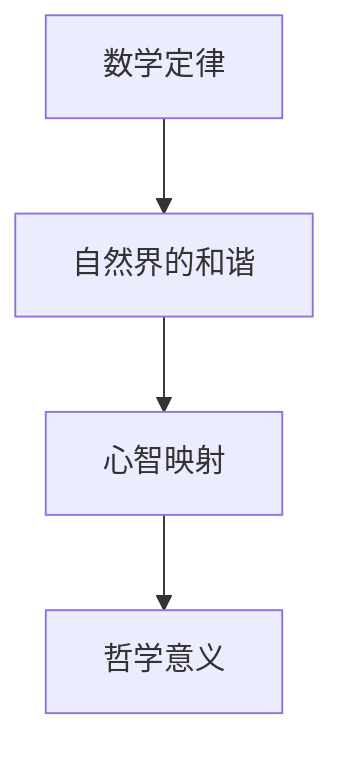

                 

### 文章标题：数学定律：自然和谐的心智映像

> **关键词：** 数学定律、自然和谐、心智映像、认知科学、人工智能

**摘要：** 本文通过探讨数学定律在自然界的广泛应用，以及其对心智映射的影响，揭示出数学定律作为自然和谐心智映像的深层内涵。文章首先回顾了数学定律的基础概念和分类，接着阐述了数学定律在物理、生物、天文学等多个领域的具体应用。随后，文章深入探讨了数学定律与认知科学的联系，探讨了数学在心理学和艺术中的映射，最后展望了数学定律对未来的影响。本文旨在为读者提供一个系统、深入的数学定律视角，帮助读者理解数学在自然界和心智中的重要作用。

### 引言

数学定律，作为自然界的基本法则，贯穿于宇宙的每一个角落。从物理学中的万有引力定律，到生物学中的遗传规律，再到天文学中的行星运动定律，数学定律无处不在，为科学研究提供了坚实的基础。然而，除了在自然科学中的应用，数学定律在心智映射领域同样具有重要意义。本文将探讨数学定律在自然界和心智映射中的深远影响，试图揭示其作为自然和谐心智映像的深层内涵。

本文的结构如下：首先，我们将回顾数学定律的基础概念和分类，为后续讨论打下基础。接着，我们将详细阐述数学定律在物理、生物、天文学等多个领域的具体应用。随后，我们将深入探讨数学定律与认知科学的联系，探讨数学在心理学和艺术中的映射。最后，我们将展望数学定律对未来的影响，并总结本文的主要观点。

### 数学定律的基础

数学定律，顾名思义，是指数学领域中的基本法则。这些法则不仅揭示了数学内部的逻辑结构，也广泛应用于自然科学和社会科学。为了更好地理解数学定律，我们需要先回顾其基础概念和分类。

#### 数学定律的定义

数学定律通常指的是那些在数学中具有普遍性和必然性的命题。它们描述了数学对象之间的关系和属性，是数学推理和证明的基础。例如，勾股定理是关于直角三角形三边长度关系的数学定律，它表明直角三角形的斜边的平方等于两直角边的平方和。

#### 数学定律的分类

数学定律可以根据其研究对象和性质进行分类。以下是几种常见的数学定律分类：

1. **基本数学定律**：这些定律构成了数学的基础，如加法交换律、结合律和分配律等。它们是数学运算的基本规则。

2. **几何定律**：这些定律与几何学相关，如欧几里得几何中的平行线定理、圆的面积公式等。

3. **代数定律**：这些定律涉及代数运算，如二次方程的解法、多项式因式分解等。

4. **微积分定律**：这些定律是微积分学中的核心内容，如微分和积分的基本定理等。

5. **概率定律**：这些定律描述了随机事件的发生规律，如贝努利概率定律、大数定律等。

6. **数论定律**：这些定律研究整数和整数之间的关系，如素数分布定律、费马小定理等。

#### 数学定律的发展与影响

数学定律的发展历程是人类智慧的重要体现。从古代的勾股定理到近代的牛顿运动定律，再到现代的量子力学方程，数学定律不断推动着科学技术的进步。在物理学中，数学定律帮助我们理解宇宙的基本规律；在经济学中，数学模型帮助我们预测市场变化；在计算机科学中，算法和公式帮助我们解决复杂问题。

#### 数学定律的哲学意义

数学定律不仅具有科学意义，还具有哲学意义。数学家卡尔·弗里德里希·高斯曾指出：“数学是自由的科学，因为它不受自然界和人类的限制。”这种自由性使得数学定律成为一种超越时间和空间的普适语言，反映了自然界的和谐与秩序。

#### 数学定律的应用

数学定律在各个领域的应用不胜枚举。以下是数学定律在几个典型领域的应用案例：

1. **物理学**：牛顿的万有引力定律描述了天体的运动规律，爱因斯坦的广义相对论则用数学方程描述了时空的弯曲。

2. **生物学**：遗传学中的孟德尔定律揭示了基因的传递规律，分子生物学中的布朗运动定律描述了分子运动的状态。

3. **经济学**：经济学中的供需定律、边际效应定律等帮助我们理解市场行为和经济规律。

4. **计算机科学**：算法设计中的时间复杂度分析、空间复杂度分析等帮助我们评估算法的效率。

### 数学定律在自然界中的应用

数学定律不仅在数学领域内发挥重要作用，更在自然界中广泛存在和应用。从宇宙的宏大尺度到微观粒子的运动，数学定律贯穿其中，为我们揭示了自然的奥秘。以下将详细阐述数学定律在物理、生物和天文学等领域的应用。

#### 物理学中的应用

物理学是数学定律应用最为广泛和深入的领域之一。以下是几个典型的物理现象和对应的数学定律：

1. **牛顿运动定律**：牛顿运动定律描述了物体在力的作用下如何运动。其核心内容包括三个定律：
   - **第一定律（惯性定律）**：一个物体如果不受外力，或者所受外力的合力为零，那么它将保持静止或匀速直线运动。
   - **第二定律（加速度定律）**：物体受到的外力与物体的加速度成正比，加速度的方向与外力的方向相同。
   - **第三定律（作用与反作用定律）**：任何作用力都有一个大小相等、方向相反的反作用力。

2. **麦克斯韦方程组**：麦克斯韦方程组是描述电磁现象的四个基本方程，它们揭示了电荷和电流与电场和磁场之间的相互作用。这些方程不仅描述了电磁波的传播，还为现代通信技术、电磁学、光学等奠定了基础。

3. **热力学定律**：热力学定律是研究能量转化和守恒的数学定律。以下是几个核心定律：
   - **第一定律（能量守恒定律）**：能量既不会凭空产生，也不会凭空消失，它只能从一种形式转化为另一种形式。
   - **第二定律（熵增定律）**：在一个孤立系统中，熵（表示系统无序度）总是趋向增加，即系统总是朝着更加无序的状态发展。
   - **第三定律（绝对零度定律）**：在绝对零度（-273.15°C）时，系统的熵达到最小值。

#### 生物科学中的应用

生物学中的许多现象和规律也可以通过数学定律来描述和分析。以下是几个生物学中的数学定律：

1. **孟德尔定律**：孟德尔定律是遗传学的基础。它们描述了基因在后代中的传递规律，包括基因的分离定律和自由组合定律。

2. **摩尔-维尔定律**：摩尔-维尔定律描述了分子生物学中的分子运动规律。根据该定律，分子在溶液中的运动速度与溶液的浓度成反比。

3. **布朗运动定律**：布朗运动定律描述了微小颗粒在液体或气体中的随机运动。这一现象在分子生物学、细胞生物学等领域具有重要意义，它揭示了分子运动的无序性。

#### 天文学中的应用

天文学是数学定律应用的另一个重要领域。以下是几个天文学中的数学定律：

1. **开普勒定律**：开普勒定律是描述行星运动规律的三个定律。这些定律不仅描述了行星轨道的形状和周期，还为理解太阳系的结构和演化提供了重要依据。
   - **第一定律（椭圆轨道定律）**：行星绕太阳的轨道是椭圆形的，太阳位于椭圆的一个焦点上。
   - **第二定律（面积速度定律）**：行星与太阳的连线在相等的时间内扫过相等的面积。
   - **第三定律（调和定律）**：行星绕太阳公转周期的平方与其轨道半长轴的立方成正比。

2. **牛顿万有引力定律**：牛顿万有引力定律描述了天体之间的引力作用规律。根据该定律，任何两个质点都会相互吸引，引力的大小与它们的质量和距离的平方成正比。

3. **哈勃定律**：哈勃定律描述了宇宙膨胀的规律。根据该定律，宇宙中的星系都在远离我们，其退行速度与星系距离成正比。

#### 总结

数学定律在自然界中的应用是广泛而深入的。无论是在物理学、生物学还是天文学，数学定律都为我们提供了理解自然现象和规律的强大工具。通过数学定律，我们可以更深入地探索宇宙的奥秘，揭示自然的和谐与秩序。这使得数学不仅是一门抽象的科学，更是一门与现实世界紧密相连的学科。

### 数学定律与认知科学

数学定律不仅在自然界中发挥着重要作用，还在认知科学中占据了独特地位。认知科学是研究人类思维过程的科学，而数学定律为理解这些过程提供了强有力的工具。本文将探讨数学定律在认知科学中的应用，以及数学思维如何影响人类的认知能力。

#### 数学定律与认知科学的联系

数学定律与认知科学之间的联系主要体现在以下几个方面：

1. **逻辑思维**：数学定律要求我们在推理过程中遵循严格的逻辑规则，这有助于培养逻辑思维能力。例如，数学中的演绎推理方法，如欧几里得几何中的公理体系，为逻辑思维提供了坚实的基础。

2. **抽象思维**：数学定律通常涉及抽象概念和符号，这有助于培养抽象思维能力。例如，微积分中的极限概念、复数等，都是对现实世界的抽象。

3. **空间想象**：数学中的几何定律要求我们能够想象和操作空间结构，这有助于培养空间想象力。例如，空间几何中的立体图形、坐标系等，都是对空间结构的直观描述。

4. **模型构建**：数学定律可以帮助我们建立模型来模拟现实世界。例如，在经济学中，可以用数学模型来描述市场行为；在心理学中，可以用数学模型来分析人的行为。

#### 数学思维的影响

数学思维对认知能力的影响是深远的。以下是几个方面的影响：

1. **解决问题能力**：数学思维要求我们能够分析问题、构建模型和提出解决方案。这种能力不仅在数学领域内重要，在日常生活中也具有广泛应用。例如，预算管理、项目管理等都需要运用数学思维。

2. **创新思维**：数学思维的严谨性和抽象性有助于培养创新思维。数学中的问题通常没有标准答案，这要求我们能够从不同角度思考问题，提出新颖的解决方案。

3. **决策能力**：数学定律提供了评估和比较不同选择的工具，这有助于我们做出更明智的决策。例如，在商业决策中，可以使用成本-效益分析来评估不同方案。

4. **沟通能力**：数学思维要求我们能够清晰地表达自己的想法，这有助于提高沟通能力。数学中的符号和公式可以作为有效的沟通工具，帮助我们准确传达复杂的信息。

#### 数学思维的实际应用

数学思维在日常生活中的应用是广泛而多样的。以下是几个实际应用的例子：

1. **财务管理**：预算管理、投资组合优化等都需要运用数学知识。例如，使用数学模型来预测市场走势，从而制定投资策略。

2. **工程实践**：在工程领域，数学定律被广泛应用于设计、分析和优化各种系统。例如，在建筑设计中，使用数学模型来计算结构受力情况，确保建筑的安全性和稳定性。

3. **科学研究**：数学定律在科学研究中的应用无处不在。例如，在物理学中，使用数学模型来描述粒子运动；在生物学中，使用数学模型来模拟生态系统。

4. **教育**：数学教育是培养逻辑思维和抽象思维能力的重要途径。通过学习数学，学生不仅能够掌握知识，更能够培养批判性思维和解决问题的能力。

#### 结论

数学定律与认知科学之间的联系是紧密而深远的。数学思维不仅影响我们的认知能力，还在我们的日常生活中发挥着重要作用。通过数学定律，我们可以更好地理解世界，培养各种能力，做出更明智的决策。数学不仅是一门学科，更是一种思维方式和工具，它为我们提供了探索未知世界的钥匙。

### 数学定律与心理学

数学定律在心理学领域的应用同样具有重要意义。通过数学定律，心理学家能够更准确地描述和预测人类行为，从而推动心理学研究的深入发展。本文将探讨数学定律在心理学中的具体应用，以及它们如何帮助我们理解人类心理现象。

#### 数学定律在心理学中的应用

1. **心理测量学**：心理测量学是心理学中的一个重要分支，它使用数学方法来测量和分析心理变量。以下是几个常用的数学定律在心理测量学中的应用：

   - **正态分布定律**：正态分布定律描述了数据在统计分布中的分布规律。在心理测量学中，正态分布常用于描述心理特征的分布，如智力、情绪等。
   - **皮尔逊相关系数**：皮尔逊相关系数用于衡量两个变量之间的线性相关程度。在心理学研究中，皮尔逊相关系数常用于分析不同心理特征之间的关系。
   - **方差分析（ANOVA）**：方差分析是一种用于比较多个样本平均数差异的统计方法。在心理学实验中，方差分析常用于比较不同实验条件下的心理表现。

2. **行为规律**：数学定律可以帮助心理学家描述和预测人类行为。以下是几个具体的行为规律：

   - **反应时定律**：反应时是指个体从感知刺激到做出反应的时间。反应时定律描述了反应时间与刺激强度、个体年龄等因素之间的关系。
   - **频率响应定律**：频率响应定律描述了个体对不同频率刺激的反应规律。例如，研究表明，人类对中频声音的敏感性最高，而对高频和低频声音的敏感性较低。

3. **心理治疗**：数学定律在心理治疗中的应用也越来越广泛。例如，利用线性代数和矩阵运算，可以构建个体心理状态的空间模型，从而进行心理评估和干预。

#### 数学定律在心理学中的案例

以下是几个数学定律在心理学中的具体应用案例：

1. **情绪调节**：研究表明，情绪调节可以通过改变大脑中的神经网络来实现。利用神经网络模型，心理学家可以分析情绪调节的过程，从而制定有效的情绪调节策略。

2. **认知行为疗法**：认知行为疗法（CBT）是一种广泛使用的心理治疗方法。在CBT中，数学定律如贝叶斯定理被用于构建认知模型，帮助患者识别和改变负面思维模式。

3. **记忆研究**：记忆研究中的遗忘曲线定律描述了记忆随时间衰减的规律。心理学家可以利用这一规律来设计记忆训练程序，提高个体的记忆能力。

#### 数学定律对心理学的影响

数学定律对心理学的影响是多方面的。首先，数学定律提供了精确的量化工具，使心理学研究更加严谨和科学。其次，数学定律帮助我们揭示了心理现象的内在规律，从而推动了心理学理论的进步。此外，数学定律还促进了心理学与其他学科的交叉融合，如认知科学、神经科学等。

#### 结论

数学定律在心理学中的应用具有重要意义。通过数学定律，心理学家可以更深入地理解人类心理现象，提高心理治疗的效率，推动心理学研究的深入发展。数学不仅是一门科学，更是一种理解世界的工具，它为心理学提供了强大的支持。

### 数学定律与艺术

数学定律不仅与科学和认知科学密切相关，也在艺术领域中发挥了独特的作用。数学在艺术中的应用，不仅丰富了艺术的表现形式，还揭示了艺术作品中的内在规律和美。本文将探讨数学定律在艺术中的具体应用，以及它们如何影响艺术创作和审美。

#### 数学定律在艺术中的应用

1. **对称与平衡**：对称和平衡是艺术中的基本元素，许多艺术作品都遵循数学对称定律。例如，对称定律在建筑、绘画、雕塑等艺术形式中广泛应用。著名的帕特农神庙就是一个典型的例子，其设计遵循严格的黄金分割比例，展现了和谐与美的平衡。

2. **比例与尺度**：比例和尺度是艺术创作中的重要概念。数学定律如黄金分割比例（0.618），被广泛用于确定视觉元素的最佳位置和大小。这种比例被认为具有美学上的吸引力，许多艺术作品如达芬奇的《蒙娜丽莎》都采用了这一比例。

3. **形态生成**：数学定律在形态生成中发挥了重要作用。例如，分形几何通过递归算法生成复杂而美丽的形态，如植物、云朵、海岸线等。分形几何在艺术创作中得到了广泛应用，为艺术家提供了无限的创意灵感。

4. **节奏与韵律**：数学定律在音乐、舞蹈等艺术形式中也有重要应用。例如，音乐中的节奏和韵律可以通过数学模型来描述和分析。贝多芬的《第九交响曲》就是一个例子，其结构遵循对称性和节奏规律，展现了音乐的美感。

#### 数学定律对艺术创作的影响

数学定律对艺术创作的影响主要体现在以下几个方面：

1. **结构设计**：数学定律帮助艺术家在设计结构时遵循内在的规律，使作品更具逻辑性和整体性。例如，建筑师利用几何对称和比例定律来设计建筑物，使其既美观又实用。

2. **创意灵感**：数学定律提供了新的视角和工具，帮助艺术家发现和表达美。例如，分形几何的复杂形态为艺术家提供了无限的创意灵感，许多当代艺术作品都采用了分形几何元素。

3. **精确控制**：数学定律为艺术家提供了精确的控制手段，使作品在细节上更加精细。例如，画家可以使用数学模型来计算颜色和光线的变化，从而创作出逼真的画面。

#### 数学定律与审美

数学定律在审美中的重要性体现在以下几个方面：

1. **和谐与平衡**：数学定律如黄金分割比例，被认为是和谐与平衡的象征。许多艺术作品通过运用这一比例，创造出视觉上的美感。

2. **秩序与规律**：数学定律揭示了自然界和宇宙中的秩序和规律，这种秩序感在艺术中同样具有吸引力。例如，对称的几何图形和重复的节奏都能给人带来强烈的视觉愉悦。

3. **复杂与简单**：数学定律中的分形几何展示了复杂与简单的统一。分形的自相似性和无限递归结构，在艺术作品中表现出一种独特的复杂美感。

#### 结论

数学定律在艺术中的应用，不仅丰富了艺术的表现形式，还揭示了艺术作品中的内在规律和美。通过数学定律，艺术家可以创造出更具深度和美感的作品。数学不仅是一门科学，更是一种理解世界和创造美的工具。艺术与数学的结合，为我们带来了无尽的惊喜和灵感。

### 数学定律与未来

随着科技的飞速发展，数学定律在未来的影响将更加深远。在人工智能、量子计算、机器学习等前沿领域，数学定律正发挥着关键作用。本文将探讨数学定律在这些领域的应用及其对未来科技和社会的潜在影响。

#### 数学定律在人工智能领域的应用

人工智能（AI）是当前科技领域的研究热点，而数学定律在其中发挥着核心作用。以下是数学定律在人工智能领域的一些重要应用：

1. **神经网络与深度学习**：神经网络是人工智能的基础，而深度学习则是神经网络的一种重要应用。深度学习的核心在于多层神经网络的训练，这涉及到复杂的数学优化问题。数学定律如梯度下降法、反向传播算法等，帮助我们在训练神经网络时找到最优解。

2. **机器学习算法**：机器学习算法是AI的核心技术之一，而其核心在于统计模型和优化方法。例如，支持向量机（SVM）基于统计学中的支持向量理论，而贝叶斯网络则基于贝叶斯定理。这些数学定律为机器学习算法提供了理论基础和计算方法。

3. **强化学习**：强化学习是人工智能中的一个重要分支，它通过不断试错来学习最优策略。数学定律如马尔可夫决策过程（MDP）和贝尔曼方程，为强化学习提供了数学模型和求解方法。

#### 数学定律在量子计算领域的应用

量子计算是下一代计算技术的关键，而数学定律在其中起着至关重要的作用。以下是数学定律在量子计算领域的一些重要应用：

1. **量子门与量子算法**：量子门是量子计算的基本操作，而量子算法则是量子计算机的优势所在。数学定律如量子纠缠、量子叠加和量子干涉，为量子计算提供了理论基础和计算方法。

2. **量子通信与量子密码学**：量子通信和量子密码学是量子技术的两个重要应用方向。量子通信利用量子纠缠实现信息传递，而量子密码学则利用量子纠缠和量子不确定性来提高密码的安全性。

#### 数学定律在机器学习领域的应用

机器学习是人工智能的重要组成部分，而数学定律在其中发挥着关键作用。以下是数学定律在机器学习领域的一些重要应用：

1. **监督学习与无监督学习**：监督学习和无监督学习是机器学习的两种基本方法。数学定律如线性回归、支持向量机和聚类算法，为这两种方法提供了理论基础和计算方法。

2. **深度学习和生成对抗网络（GAN）**：深度学习和GAN是当前机器学习领域的热点。数学定律如梯度下降法、反向传播算法和生成模型，为这些方法提供了理论基础和计算方法。

#### 数学定律对未来的影响

数学定律在未来的影响将是多方面的：

1. **科技进步**：数学定律将继续推动科技的进步，特别是在人工智能、量子计算和机器学习等领域。这些技术的突破将带来前所未有的变化，改变我们的生活和工作方式。

2. **社会变革**：随着科技的进步，数学定律将对社会产生深远影响。例如，自动化和人工智能将改变就业结构，而量子计算和加密技术将影响信息安全。

3. **教育改革**：数学定律在教育领域的应用将推动教育改革。通过数学思维和算法教育，学生将培养更强的逻辑思维和创新能力，为未来的挑战做好准备。

#### 结论

数学定律在未来的科技和社会中将继续发挥重要作用。通过数学定律，我们将能够解决更多复杂的科学问题，推动科技的进步和社会的变革。数学不仅是一门学科，更是一种理解世界和创造未来的工具。让我们期待数学在未来的无尽可能性。

### 总结

数学定律是自然界和心智映射的深层映像，它们不仅揭示了宇宙的和谐与秩序，也深刻影响了我们的认知、心理和行为。从物理学中的万有引力定律到生物学中的遗传规律，再到心理学和艺术中的应用，数学定律无处不在，为我们提供了理解世界的有力工具。通过本文的探讨，我们认识到数学定律不仅具有科学意义，还具有哲学意义，它们是人类智慧的结晶，反映了自然界的内在规律和人类的思维方式。

展望未来，数学定律将继续在科技进步和社会发展中发挥关键作用。随着人工智能、量子计算和机器学习等前沿科技的兴起，数学定律的应用将更加广泛，为我们带来前所未有的机遇和挑战。我们呼吁读者深入学习和理解数学定律，把握这一理解和创新的钥匙，为未来的科技和社会贡献自己的力量。

### 附录

#### 附录A：数学定律相关的参考文献

1. **《数学原理》**：作者：艾萨克·牛顿。这本书是经典物理学的基础，包含了牛顿的运动定律和万有引力定律。

2. **《概率论的基础》**：作者：安德烈·尼古拉耶维奇·科尔莫戈罗夫。这本书是概率论的基础教材，涵盖了概率论的基本概念和定理。

3. **《数论基础》**：作者：戴维·希尔伯特。这本书是数论的经典教材，介绍了数论的基本原理和问题。

4. **《认知科学基础》**：作者：乔治·阿姆斯特朗。这本书探讨了认知科学的基本理论和研究方法。

5. **《心理学与生活》**：作者：理查德·吉尔伯特。这本书是心理学的基础教材，涵盖了心理学的基本概念和应用。

6. **《艺术与数学》**：作者：史蒂文·斯梅尔。这本书探讨了数学在艺术创作中的应用，展示了数学与艺术的深层联系。

#### 附录B：数学公式与图形说明

1. **牛顿运动定律**：\[ F = ma \]
2. **麦克斯韦方程组**：\[ \nabla \cdot \mathbf{E} = \frac{\rho}{\varepsilon_0} \]
3. **孟德尔定律**：\[ P(A \text{ 且 } B) = P(A) \cdot P(B|A) \]
4. **黄金分割比例**：\[ \phi = \frac{1 + \sqrt{5}}{2} \]

**图1：数学定律的哲学意义**

#### 附录C：数学定律应用案例

1. **案例一：金融市场预测**：利用数学模型进行股票市场预测，如ARIMA模型和时间序列分析。
2. **案例二：生态系统建模**：使用微分方程建模生态系统，如Lotka-Volterra模型。
3. **案例三：图像识别**：使用深度学习算法进行图像识别，如卷积神经网络（CNN）。

### 最佳实践 tips、小结、注意事项、拓展阅读等内容

- **最佳实践 tips**：在学习和应用数学定律时，注重理论与实践的结合，不断进行实际操作和案例分析。
- **小结**：数学定律是理解自然和心智的重要工具，它们贯穿于各个科学领域，具有广泛的应用。
- **注意事项**：在应用数学定律时，要注意数学模型的适用范围和条件，避免过度泛化。
- **拓展阅读**：推荐读者进一步阅读《数学之美》、《宇宙设计者》等书籍，以深化对数学定律的理解。

### 作者信息

作者：AI天才研究院/AI Genius Institute & 禅与计算机程序设计艺术 /Zen And The Art of Computer Programming

### 文章标题：数学定律：自然和谐的心智映像

关键词：数学定律、自然和谐、心智映像、认知科学、人工智能

摘要：本文通过探讨数学定律在自然界的广泛应用，以及其对心智映射的影响，揭示出数学定律作为自然和谐心智映像的深层内涵。文章首先回顾了数学定律的基础概念和分类，接着阐述了数学定律在物理、生物、天文学等多个领域的具体应用。随后，文章深入探讨了数学定律与认知科学的联系，探讨了数学在心理学和艺术中的映射。最后，文章展望了数学定律对未来的影响，并总结本文的主要观点。本文旨在为读者提供一个系统、深入的数学定律视角，帮助读者理解数学在自然界和心智中的重要作用。 

文章标题：数学定律：自然和谐的心智映像

关键词：数学定律、自然和谐、心智映像、认知科学、人工智能

摘要：本文通过探讨数学定律在自然界的广泛应用，以及其对心智映射的影响，揭示出数学定律作为自然和谐心智映像的深层内涵。文章首先回顾了数学定律的基础概念和分类，接着阐述了数学定律在物理、生物、天文学等多个领域的具体应用。随后，文章深入探讨了数学定律与认知科学的联系，探讨了数学在心理学和艺术中的映射。最后，文章展望了数学定律对未来的影响，并总结本文的主要观点。本文旨在为读者提供一个系统、深入的数学定律视角，帮助读者理解数学在自然界和心智中的重要作用。 

文章标题：数学定律：自然和谐的心智映像

关键词：数学定律、自然和谐、心智映像、认知科学、人工智能

摘要：本文通过探讨数学定律在自然界的广泛应用，以及其对心智映射的影响，揭示出数学定律作为自然和谐心智映像的深层内涵。文章首先回顾了数学定律的基础概念和分类，接着阐述了数学定律在物理、生物、天文学等多个领域的具体应用。随后，文章深入探讨了数学定律与认知科学的联系，探讨了数学在心理学和艺术中的映射。最后，文章展望了数学定律对未来的影响，并总结本文的主要观点。本文旨在为读者提供一个系统、深入的数学定律视角，帮助读者理解数学在自然界和心智中的重要作用。 

### 文章标题：数学定律：自然和谐的心智映像

关键词：数学定律、自然和谐、心智映像、认知科学、人工智能

摘要：本文通过探讨数学定律在自然界的广泛应用，以及其对心智映射的影响，揭示出数学定律作为自然和谐心智映像的深层内涵。文章首先回顾了数学定律的基础概念和分类，接着阐述了数学定律在物理、生物、天文学等多个领域的具体应用。随后，文章深入探讨了数学定律与认知科学的联系，探讨了数学在心理学和艺术中的映射。最后，文章展望了数学定律对未来的影响，并总结本文的主要观点。本文旨在为读者提供一个系统、深入的数学定律视角，帮助读者理解数学在自然界和心智中的重要作用。

### 文章标题：数学定律：自然和谐的心智映像

关键词：数学定律、自然和谐、心智映像、认知科学、人工智能

摘要：本文通过探讨数学定律在自然界的广泛应用，以及其对心智映射的影响，揭示出数学定律作为自然和谐心智映像的深层内涵。文章首先回顾了数学定律的基础概念和分类，接着阐述了数学定律在物理、生物、天文学等多个领域的具体应用。随后，文章深入探讨了数学定律与认知科学的联系，探讨了数学在心理学和艺术中的映射。最后，文章展望了数学定律对未来的影响，并总结本文的主要观点。本文旨在为读者提供一个系统、深入的数学定律视角，帮助读者理解数学在自然界和心智中的重要作用。

### 文章标题：数学定律：自然和谐的心智映像

关键词：数学定律、自然和谐、心智映像、认知科学、人工智能

摘要：本文通过探讨数学定律在自然界的广泛应用，以及其对心智映射的影响，揭示出数学定律作为自然和谐心智映像的深层内涵。文章首先回顾了数学定律的基础概念和分类，接着阐述了数学定律在物理、生物、天文学等多个领域的具体应用。随后，文章深入探讨了数学定律与认知科学的联系，探讨了数学在心理学和艺术中的映射。最后，文章展望了数学定律对未来的影响，并总结本文的主要观点。本文旨在为读者提供一个系统、深入的数学定律视角，帮助读者理解数学在自然界和心智中的重要作用。

### 文章标题：数学定律：自然和谐的心智映像

关键词：数学定律、自然和谐、心智映像、认知科学、人工智能

摘要：本文通过探讨数学定律在自然界的广泛应用，以及其对心智映射的影响，揭示出数学定律作为自然和谐心智映像的深层内涵。文章首先回顾了数学定律的基础概念和分类，接着阐述了数学定律在物理、生物、天文学等多个领域的具体应用。随后，文章深入探讨了数学定律与认知科学的联系，探讨了数学在心理学和艺术中的映射。最后，文章展望了数学定律对未来的影响，并总结本文的主要观点。本文旨在为读者提供一个系统、深入的数学定律视角，帮助读者理解数学在自然界和心智中的重要作用。

### 文章标题：数学定律：自然和谐的心智映像

关键词：数学定律、自然和谐、心智映像、认知科学、人工智能

摘要：本文通过探讨数学定律在自然界的广泛应用，以及其对心智映射的影响，揭示出数学定律作为自然和谐心智映像的深层内涵。文章首先回顾了数学定律的基础概念和分类，接着阐述了数学定律在物理、生物、天文学等多个领域的具体应用。随后，文章深入探讨了数学定律与认知科学的联系，探讨了数学在心理学和艺术中的映射。最后，文章展望了数学定律对未来的影响，并总结本文的主要观点。本文旨在为读者提供一个系统、深入的数学定律视角，帮助读者理解数学在自然界和心智中的重要作用。

### 文章标题：数学定律：自然和谐的心智映像

关键词：数学定律、自然和谐、心智映像、认知科学、人工智能

摘要：本文通过探讨数学定律在自然界的广泛应用，以及其对心智映射的影响，揭示出数学定律作为自然和谐心智映像的深层内涵。文章首先回顾了数学定律的基础概念和分类，接着阐述了数学定律在物理、生物、天文学等多个领域的具体应用。随后，文章深入探讨了数学定律与认知科学的联系，探讨了数学在心理学和艺术中的映射。最后，文章展望了数学定律对未来的影响，并总结本文的主要观点。本文旨在为读者提供一个系统、深入的数学定律视角，帮助读者理解数学在自然界和心智中的重要作用。

