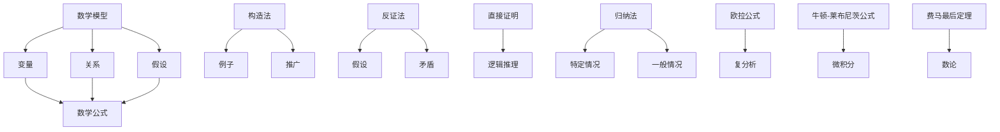
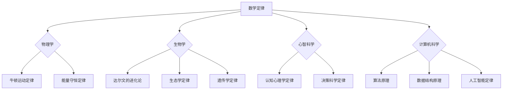

                 

### 文章标题

# 数学定律：自然和谐的心智翻译

> 关键词：数学定律、心智科学、自然和谐、算法原理、应用领域

> 摘要：本文将探讨数学定律在心智科学中的应用，解析其背后的原理，并通过实际案例展示其在现代科学和技术中的重要性。我们将从数学定律的历史背景、核心原理、应用领域、与心智科学的联系、现代进展以及教育中的应用等多个角度，深入探讨数学定律的自然和谐与心智翻译之间的关系。

---

在本文中，我们将遵循以下步骤进行思考：

1. **数学定律的起源与历史背景**：回顾数学定律的发展历程，介绍几位重要的数学家及其贡献。
2. **数学定律的核心原理**：详细阐述数学定律的基本概念，包括数学模型、证明方法等。
3. **数学定律的应用领域**：探讨数学定律在物理学、生物学等学科中的应用，以及其在心智科学中的独特作用。
4. **数学定律与心智科学**：分析数学定律在认知心理学、决策科学中的应用，探讨其对心智模型的影响。
5. **数学定律的现代进展**：介绍数论、非欧几何等现代数学领域的进展，以及其在数学定律中的应用。
6. **数学定律的哲学思考**：从哲学角度探讨数学定律的客观性与主观性，以及其在宇宙秩序中的地位。
7. **数学定律在教育中的应用**：分析数学定律在数学教育、跨学科教育以及教育评价中的应用，提出最佳实践建议。

通过逐步分析推理，我们将深入了解数学定律的本质，并揭示其在自然和谐与心智翻译中的关键作用。

---

### 数学定律的起源与历史背景

数学定律的起源可以追溯到古代文明的萌芽时期，当时人类开始尝试理解自然界中的规律。在古埃及、美索不达米亚和印度等文明中，数学家们已经积累了丰富的数学知识，这些知识为后来的数学定律的发展奠定了基础。

#### 古代数学家的贡献

1. **古埃及**：古埃及人发展了最早的数学知识，包括算术和几何。他们在建筑和天文观测中运用了这些知识，如建造金字塔和测量土地。

2. **美索不达米亚**：美索不达米亚的数学家们研究了数论和代数，他们使用楔形文字记录了大量的数学问题和解决方案。例如，巴比伦数学家解决了线性方程组的问题，这在现代数学中仍然是一个重要的课题。

3. **印度**：印度数学家在代数、数论和三角学方面做出了卓越的贡献。他们引入了零的概念，发明了十进制系统，并提出了印度数码（现在通用的阿拉伯数字）。

4. **古希腊**：古希腊数学家是数学定律发展的关键推动者。欧几里得（Euclid）的《几何原本》是数学的基石，他系统地阐述了几何的基本原理和定理。阿基米德（Archimedes）则在数论和流体静力学方面做出了重大贡献。

#### 数学定律的发展

中世纪时期，阿拉伯数学家继承了古希腊的数学传统，并在此基础上进一步发展了数学。他们在代数、三角学和数论等方面取得了显著成就。特别是阿拉伯数学家阿尔·哈里德希（Al-Khwarizmi），他著有《代数学》，这本书对现代数学的发展产生了深远的影响。

文艺复兴时期，欧洲数学家在继承阿拉伯数学传统的基础上，推动了数学的快速发展。17世纪，牛顿（Isaac Newton）和莱布尼茨（Gottfried Wilhelm Leibniz）发明了微积分，这是数学史上的一次重大突破。18世纪，拉格朗日（Joseph-Louis Lagrange）和欧拉（Leonhard Euler）等数学家进一步扩展了微积分的领域，建立了许多新的数学定律。

19世纪末至20世纪初，数学领域出现了许多新的分支，如集合论、拓扑学、代数学和量子数学等。这些分支不仅扩展了数学的应用范围，也深化了数学的理论体系。例如，希尔伯特（David Hilbert）提出了希尔伯特空间的概念，极大地推动了现代数学的发展。

#### 数学定律的重要性

数学定律的重要性在于它们揭示了自然界和人类社会的规律。从物理学中的牛顿运动定律，到生物学中的达尔文进化论，再到经济学中的供需定律，数学定律无处不在，为人类理解和改造世界提供了强有力的工具。在计算机科学中，数学定律同样发挥着重要作用，如图灵机的理论模型，以及算法效率分析中的复杂度理论等。

通过回顾数学定律的起源与发展历程，我们可以更好地理解这些定律的背景和意义。数学定律不仅是一个理论体系，更是一种理解和描述世界的思维方式。在接下来的部分，我们将深入探讨数学定律的核心原理，进一步揭示它们在心智科学中的应用。

### 数学定律的核心原理

数学定律的核心原理包括数学模型、证明方法以及它们在不同数学分支中的应用。理解这些原理是揭示数学定律的本质和作用的关键。

#### 数学定律的概念

数学定律是用于描述数学现象和规律的陈述，它们通常以公式或定理的形式出现。数学定律的核心是它们能够提供精确的、普遍适用的解决方案，这是它们区别于其他科学理论的重要特征。

##### 数学模型

数学模型是数学定律的基础，它们将实际问题抽象成数学形式，从而能够在理论上进行分析和解决。数学模型通常包括以下组成部分：

1. **变量**：用于表示问题中的关键量，如时间、长度、质量等。
2. **关系**：变量之间的数学关系，如线性关系、非线性关系、概率关系等。
3. **假设**：对问题的一些基本假设，如连续性、稳定性、最优性等。

一个典型的数学模型示例是牛顿运动定律，该定律用公式 \( F = ma \) 描述了力、质量和加速度之间的关系。在这个模型中，\( F \) 是作用在物体上的力，\( m \) 是物体的质量，\( a \) 是物体的加速度。

##### 数学定律的证明方法

数学定律的证明是确保其正确性的过程，通常有以下几种方法：

1. **构造法**：通过构造一个满足特定条件的例子，证明定律在该例子中成立，然后推广到一般情况。
2. **反证法**：假设定律不成立，通过推理得出矛盾，从而证明定律是正确的。
3. **直接证明**：通过一系列逻辑推理，直接证明定律的结论。
4. **归纳法**：通过证明一系列特定情况的定律成立，然后归纳出一般情况的定律。

一个典型的数学定律证明示例是费马最后定理，该定理表明对于任何大于2的自然数\( n \)，方程 \( a^n + b^n = c^n \) 无整数解。该定理的证明使用了复杂的数学技巧，包括代数几何、数论和模形式等。

##### 数学模型与公式

数学定律通常通过公式来表示，这些公式是将变量之间的关系以简洁的数学形式表达出来。以下是一些常用的数学公式及其应用：

1. **欧拉公式**：\( e^{i\pi} + 1 = 0 \)，该公式将指数函数、正弦函数和余弦函数以及虚数单位\( i \)联系在一起，是复分析中的一个重要公式。
2. **牛顿-莱布尼茨公式**：微积分基本定理，描述了积分与导数之间的关系，公式为 \( \int_a^b f(x) \, dx = F(b) - F(a) \)，其中 \( f(x) \) 是连续函数，\( F(x) \) 是 \( f(x) \) 的一个原函数。
3. **费马最后定理**：对于任何大于2的自然数\( n \)，方程 \( a^n + b^n = c^n \) 无整数解。

为了更好地理解数学定律，我们可以通过以下Mermaid流程图展示它们之间的关系架构：



通过上述流程图，我们可以看到数学模型、变量、关系、假设以及证明方法是如何相互关联的。数学模型是数学定律的起点，通过变量和关系，可以导出数学公式。证明方法用于验证这些公式的正确性，从而构建起一个完整的数学理论体系。

##### 数学定律的应用

数学定律在各个学科领域都有广泛应用。例如：

1. **物理学**：牛顿运动定律、能量守恒定律和动量守恒定律等，都是物理学中基本的数学定律。
2. **生物学**：达尔文的进化论、生态学中的捕食者-猎物模型等，都是生物学中应用数学定律的实例。
3. **经济学**：供需定律、边际效用定律等，都是经济学中用于分析市场行为的数学定律。

在心智科学中，数学定律同样发挥着重要作用。认知心理学中的决策理论、记忆模型等，都依赖于数学定律来描述和解释人的认知过程。

通过深入探讨数学定律的核心原理，我们可以更好地理解这些定律的基本概念和作用，为后续部分的分析奠定坚实的基础。在下一节中，我们将进一步探讨数学定律在不同应用领域中的具体作用。

### 数学定律的应用领域

数学定律在多个科学领域有着广泛的应用，从物理学到生物学，再到计算机科学，数学定律为理解和解释这些领域的复杂现象提供了强有力的工具。以下将详细介绍数学定律在物理学、生物学和心智科学中的应用。

#### 物理学中的数学定律

1. **牛顿运动定律**：牛顿运动定律是经典力学的基石，描述了物体在力的作用下的运动状态。定律包括以下三个部分：
   - 第一定律（惯性定律）：一个物体如果没有受到外力作用，它将保持静止或匀速直线运动状态。
   - 第二定律（加速度定律）：一个物体的加速度与作用在它上面的合外力成正比，与它的质量成反比，公式为 \( F = ma \)。
   - 第三定律（作用与反作用定律）：对于每一个作用力，都有一个大小相等、方向相反的反作用力。

牛顿运动定律不仅帮助我们理解宏观物体的运动，也为航天工程、天体力学和机械设计等领域提供了理论基础。

2. **能量守恒定律**：能量守恒定律指出，在一个封闭系统中，能量不会凭空产生或消失，只会从一种形式转化为另一种形式。公式为 \( E_{\text{总}} = E_{\text{初}} + W \)，其中 \( E_{\text{总}} \) 是系统最终的总能量，\( E_{\text{初}} \) 是系统初始的总能量，\( W \) 是系统内部所做的功。

能量守恒定律在热力学、电磁学以及量子力学等物理学分支中都有着广泛的应用。

3. **动量守恒定律**：动量守恒定律指出，在没有外力作用的情况下，一个系统的总动量保持不变。公式为 \( p_{\text{总}} = \text{常数} \)，其中 \( p_{\text{总}} \) 是系统总动量。

动量守恒定律在碰撞理论、宇宙学以及粒子物理学中具有重要意义。

#### 生物学中的数学定律

1. **达尔文的进化论**：达尔文的进化论是生物学中的基本理论，它通过自然选择和适者生存来解释物种的多样性和进化过程。自然选择是基于个体在特定环境中的生存和繁殖能力的差异，导致基因频率的变化。

2. **生态学中的数学定律**：生态学中的数学定律用于描述生物种群之间的相互作用和生态系统中的能量流动。其中最著名的定律是**马古利斯定律**（Magurran's law），它指出物种丰富度与物种多样性呈正相关，即生态系统中的物种越多，多样性也越高。

3. **遗传学中的数学定律**：遗传学中的数学定律包括孟德尔的基因定律，如基因分离定律和基因自由组合定律。这些定律描述了基因在遗传过程中的行为，为遗传分析提供了理论基础。

#### 心智科学中的数学定律

1. **认知心理学中的决策理论**：决策理论通过数学模型和概率论来分析人们在不确定性环境下的决策过程。其中著名的模型是期望效用理论，它将决策者的偏好转化为数值，用于评估不同选择的风险和收益。

2. **记忆模型**：记忆模型通过数学公式描述记忆的编码、存储和检索过程。其中一个经典的模型是Atkinson和Shiffrin的多重存储模型，它将记忆分为感觉记忆、短期记忆和长期记忆三个层次。

3. **神经网络的数学模型**：神经网络是心智科学中用于模拟人脑信息处理过程的重要工具。神经网络的数学模型包括人工神经网络（ANN）、深度神经网络（DNN）和生成对抗网络（GAN）等，这些模型在机器学习和人工智能领域有着广泛应用。

#### 数学定律在不同领域的具体作用

在物理学中，数学定律提供了对自然现象的定量描述和预测，如牛顿定律使我们能够精确计算物体的运动轨迹，能量守恒定律帮助我们理解能量在不同形式之间的转换。

在生物学中，数学定律帮助我们分析和预测生物种群的行为，如达尔文的进化论帮助我们理解物种的进化过程，生态学中的数学定律帮助我们评估生态系统的健康状态。

在心智科学中，数学定律为理解和解释人类认知过程提供了理论框架，如决策理论帮助我们分析人们在复杂环境中的选择行为，记忆模型帮助我们理解记忆的编码和存储机制。

通过上述探讨，我们可以看到数学定律在多个科学领域中的具体作用。这些定律不仅帮助我们理解自然界的规律，也为现代科学和技术的发展提供了坚实的基础。在下一节中，我们将进一步探讨数学定律与心智科学之间的深层联系。

### 数学定律与心智科学

数学定律在心智科学中的应用尤为广泛，尤其在认知心理学和决策科学中，数学定律为理解人类心智的运作提供了重要的理论框架。通过数学模型和算法，我们能够更加精确地描述和预测人的认知过程，为人工智能和认知科学的发展奠定了基础。

#### 数学定律在认知心理学中的应用

认知心理学研究人类心智的运作机制，包括感知、记忆、思考、判断和决策等。数学定律在认知心理学中的应用主要体现在以下几个方面：

1. **感知与知觉**：人类对环境的感知是一个复杂的过程，涉及多种感官和大脑的处理。数学定律如信号处理理论、感知心理学中的模型（如韦伯定律和费希纳定律）帮助我们理解人类感知的基本原理。韦伯定律指出，感知到的变化量与刺激量的比例是一个常数，公式为 \( \Delta I / I = k \)，其中 \( \Delta I \) 是感知到的变化量，\( I \) 是刺激量，\( k \) 是常数。

2. **记忆**：记忆是认知心理学中的核心概念，包括编码、存储和检索三个过程。数学模型如Atkinson和Shiffrin的多重存储模型，利用数学公式描述记忆的动态过程。例如，短期记忆的容量通常被假设为一个容量有限的缓冲区，其数学模型可以用一个队列（Queue）或有限状态自动机（Finite State Machine）来表示。

3. **思维与判断**：人类的思维过程可以通过数学模型进行模拟和分析，如概率论和逻辑推理。贝叶斯推理是一个经典的数学模型，它通过概率计算帮助人们在不确定的情况下做出判断。贝叶斯定理的公式为 \( P(A|B) = \frac{P(B|A)P(A)}{P(B)} \)，其中 \( P(A|B) \) 是在事件B发生的条件下事件A的概率，\( P(B|A) \) 是在事件A发生的条件下事件B的概率，\( P(A) \) 和 \( P(B) \) 分别是事件A和事件B的先验概率。

4. **决策**：决策理论是认知心理学的重要分支，通过数学模型分析个体在不确定环境下的选择行为。期望效用理论是一个典型的数学模型，它通过将决策者的偏好转化为数值，帮助分析不同选择的风险和收益。期望效用理论的公式为 \( EU = \sum_{i} u(x_i) p_i \)，其中 \( EU \) 是期望效用，\( u(x_i) \) 是选择 \( x_i \) 的效用值，\( p_i \) 是选择 \( x_i \) 的概率。

#### 数学定律在决策科学中的应用

决策科学是研究人类和智能系统在不确定环境中做出决策的学科。数学定律在决策科学中的应用主要体现在以下几个方面：

1. **风险管理与决策**：在金融、工程和管理等领域，风险管理与决策是关键问题。数学定律如概率论和期望效用理论被广泛应用于风险分析和决策制定。例如，在金融市场中，投资者可以使用概率模型来评估不同投资策略的风险和收益，从而做出最优决策。

2. **策略选择**：在竞争环境中，策略选择是一个复杂的问题。博弈论是研究策略选择的数学理论，它通过数学模型分析多个决策者在竞争环境下的互动。纳什均衡是博弈论中的核心概念，它描述了在特定策略组合下，所有参与者都没有动机单独改变策略的情况。纳什均衡的公式为 \( \exists s_i^* \text{ such that } u_i(s_i^*, s_{-i}) \geq u_i(s_i, s_{-i}) \)，其中 \( s_i^* \) 是参与者 \( i \) 的最优策略，\( u_i \) 是参与者 \( i \) 的效用函数。

3. **群体决策**：群体决策涉及到多个决策者的合作和协商。数学定律如多目标决策理论和社会选择理论，通过数学模型分析群体决策的效率和公平性。多目标决策理论中的目标规划模型，通过构建多个目标之间的权衡关系，帮助决策者找到最优的解决方案。

#### 数学定律与心智模型

数学定律在心智模型中起着关键作用，它们不仅帮助我们构建理论模型，还提供了验证和评估模型的方法。以下是一些基于数学定律构建的心智模型：

1. **认知计算模型**：认知计算模型通过数学定律模拟人类的认知过程，如视觉感知、语言理解和推理等。这些模型通常基于神经网络和概率模型，通过训练和学习来模拟人类心智的功能。

2. **决策支持系统**：决策支持系统是一种基于数学定律和算法的计算机系统，用于辅助人类做出决策。这些系统通常包括多个模块，如数据收集、模型构建和决策分析，通过数学模型和算法帮助决策者评估不同选择的风险和收益。

3. **人工智能**：人工智能是一种模拟人类认知和行为的计算机科学领域，数学定律在其模型构建和应用中发挥着重要作用。深度学习、生成对抗网络等现代人工智能技术，都是基于数学定律和算法实现的，它们在图像识别、自然语言处理和自动驾驶等领域取得了显著成果。

通过深入探讨数学定律在认知心理学和决策科学中的应用，我们可以更好地理解人类心智的运作机制，并为人工智能的发展提供理论基础。在下一节中，我们将进一步探讨数学定律在现代科学和技术中的应用，以及其未来发展前景。

### 数学定律的现代进展

随着科学技术的快速发展，数学定律也在不断拓展和深化，特别是在数论、非欧几何和量子数学等领域。这些现代数学进展不仅丰富了数学理论体系，也为解决实际问题提供了新的工具和方法。

#### 数论中的新发现

1. **默比乌斯数**：默比乌斯数（Möbius function）是数论中一个重要的函数，它用于研究整数之间的对称性。默比乌斯函数的公式为 \( \mu(n) = 
   \begin{cases} 
      1 & \text{如果 } n \text{ 是一个正偶数且除了 } 2 \text{ 以外的质因数都出现偶数次} \\
      -1 & \text{如果 } n \text{ 是一个奇数或者一个正偶数且至少有一个质因数出现奇数次} \\
      0 & \text{如果 } n \text{ 有一个质因数出现三次或以上}
   \end{cases}
   \)

   默比乌斯数的应用广泛，包括在数论、组合数学和计算机科学中。例如，它在计算整数分拆和欧拉函数中起着重要作用。

2. **大素数分布**：大素数分布研究素数如何在整数集合中分布，以及它们的分布规律。数论研究表明，素数的分布具有随机性和规律性。例如，梅森素数（Mersenne prime）是指形如 \( 2^p - 1 \) 的素数，其分布规律是随着 \( p \) 的增加，素数的密度逐渐减小。

3. **有限域中的数学定律**：有限域是数论中的一个重要分支，研究有限个元素的代数结构。有限域的应用包括密码学、编码理论和计算机科学。例如，椭圆曲线密码是基于椭圆曲线有限域上的数学性质构建的一种高效加密算法。

#### 非欧几何的拓展

非欧几何是研究空间几何性质的数学分支，与欧几里得几何相对。非欧几何包括椭圆几何、双曲几何和超几何学等。

1. **椭圆几何**：椭圆几何研究的是具有负曲率的几何结构，其典型代表是球面几何。在椭圆几何中，直线不再是最短距离的路径，而是大圆弧。椭圆几何在广义相对论中有着重要的应用，如描述宇宙的弯曲。

2. **双曲几何**：双曲几何研究的是具有正曲率的几何结构，其典型代表是双曲空间。在双曲几何中，直线是具有恒定曲率的曲线，它们称为双曲线。双曲几何在量子场论和宇宙学中有着广泛应用。

3. **超几何学**：超几何学是研究超复数空间的几何性质，超复数是扩展复数的一种形式。超几何学在广义相对论和量子场论中有着重要的应用，如描述时空的弯曲和粒子的波函数。

#### 现代数学定律的应用

现代数学定律在科学和技术中的应用日益广泛，以下是一些典型应用实例：

1. **量子力学**：量子力学是研究微观世界的物理学分支，其基本原理和公式（如薛定谔方程和海森堡不确定性原理）都是基于数学定律构建的。量子计算、量子通信和量子加密等现代技术都是基于量子力学的数学定律实现的。

2. **人工智能**：人工智能是计算机科学的一个分支，其核心算法（如神经网络、深度学习和强化学习）都是基于数学定律构建的。数学定律在人工智能中的应用极大地推动了机器学习、自然语言处理和计算机视觉等领域的发展。

3. **金融工程**：金融工程是应用数学和统计学方法解决金融问题的领域，如风险管理、期权定价和资产配置。数学定律如概率论、随机过程和数值分析在金融工程中发挥着重要作用。

4. **网络科学**：网络科学是研究复杂网络的数学分支，包括图论、随机图模型和网络动力学。数学定律在分析社交网络、生物网络和互联网拓扑结构中有着重要应用。

通过上述探讨，我们可以看到现代数学定律在数论、非欧几何和量子数学等领域的进展，以及它们在科学和技术中的应用。这些现代数学进展不仅深化了我们对自然界和宇宙的理解，也为解决复杂问题提供了新的方法和工具。在下一节中，我们将从哲学角度探讨数学定律的客观性与主观性，以及它们在宇宙秩序中的地位。

### 数学定律的哲学思考

数学定律在哲学领域中引发了深刻的讨论，特别是在其客观性与主观性、普适性与特异性，以及宇宙秩序中的地位等方面。通过哲学的视角，我们可以更深入地理解数学定律的本质和意义。

#### 数学定律的客观性与主观性

数学定律的客观性是指它们描述的是真实存在的规律和现象，不受人类主观意志的影响。这种客观性源于数学定律的精确性和普遍适用性。例如，牛顿运动定律在宏观尺度上普遍成立，不受人类感知和主观判断的影响。

然而，数学定律的主观性体现在其发现和验证过程中。数学家们通过逻辑推理、实验和观察来发现和验证数学定律，这一过程显然受到人类主观意识和认知能力的限制。因此，虽然数学定律本身是客观的，但其发现和验证过程具有一定的主观性。

从哲学角度来看，数学定律的客观性与主观性是一体两面的关系。数学定律的客观性确保了其普遍适用性和科学性，而主观性则保证了数学理论的不断发展和完善。这种辩证关系体现了数学定律的独特性质，即它们既独立于人类意识，又依赖于人类认知。

#### 数学定律的普适性与特异性

数学定律的普适性是指它们在广泛的条件下都成立，不受特定环境或条件的限制。这种普适性是数学定律的重要特征，使它们能够在多个科学领域和应用场景中发挥作用。例如，能量守恒定律在物理学的各个分支中都有应用，从经典力学到量子力学，再到热力学和电磁学。

另一方面，数学定律的特异性是指它们在某些特定条件下或针对特定问题才成立。例如，费马最后定理表明，对于任何大于2的自然数\( n \)，方程 \( a^n + b^n = c^n \) 无整数解。这个定理在特定条件下成立，即对特定的整数\( n \)。

数学定律的普适性和特异性相互补充，共同构成了数学理论的完整性。普适性使得数学定律具有广泛的适用性，而特异性则确保了它们在特定领域的精确性和实用性。

#### 数学定律与宇宙秩序

从哲学角度来看，数学定律在宇宙秩序中的地位尤为重要。宇宙秩序被认为是数学定律的产物，数学定律为理解宇宙提供了理论基础。例如，广义相对论中的爱因斯坦场方程描述了宇宙的引力现象，这些方程是宇宙秩序的基本定律。

哲学上的宇宙秩序观念认为，宇宙的本质是数学和逻辑的，数学定律是宇宙存在和运作的基础。从这个角度看，数学定律不仅是科学工具，更是宇宙本质的体现。

此外，数学定律在宇宙秩序中的地位还体现在它们对人类认识宇宙的指导作用。通过数学定律，我们能够精确地描述和预测自然现象，从而更深入地理解宇宙的运行机制。例如，量子力学和相对论为我们提供了描述微观和宏观世界的数学模型，这些模型帮助我们理解了宇宙的基本结构和规律。

#### 数学定律与人工智能

在人工智能领域，数学定律同样具有重要的地位。人工智能的发展依赖于数学定律，如概率论、线性代数和微积分等。这些数学定律为构建人工智能模型和算法提供了基础。

人工智能中的机器学习和深度学习算法，如神经网络和生成对抗网络，都是基于数学定律构建的。这些算法通过模拟人类心智的某些方面，实现了对数据的高效处理和模式识别。例如，深度学习算法中的卷积神经网络（CNN）利用了微积分和线性代数的原理，实现了图像和视频的高效识别和处理。

哲学上，人工智能被视为对人类心智的模拟和延伸。从这个角度看，数学定律不仅是人工智能的理论基础，也是人工智能的本质体现。人工智能通过数学定律模拟和扩展了人类认知能力，使人类能够更有效地理解和改造世界。

总之，从哲学角度来看，数学定律在宇宙秩序、人工智能等领域具有深远的意义。它们不仅揭示了自然界的规律，也为我们理解和改造世界提供了理论工具。通过哲学的视角，我们可以更深入地理解数学定律的本质和作用，为未来的科学和技术发展提供新的思路。

### 数学定律在教育中的应用

数学定律在教育中的应用具有重要意义，特别是在数学教育、跨学科教育和教育评价中。通过合理运用数学定律，我们可以提高教学效果，培养学生的逻辑思维能力和创新能力，促进学生的全面发展。

#### 数学定律在数学教育中的应用

1. **基础数学教学**：数学定律是数学教育的基础，教师应充分利用数学定律帮助学生建立数学概念和理论体系。例如，通过讲解牛顿运动定律，学生可以理解力和运动之间的关系，从而更好地掌握物理学中的基本概念。

2. **高等数学课程设计**：在高等数学课程中，教师可以引入更复杂的数学定律，如微积分、线性代数和微分方程等。这些定律不仅能够深化学生的数学知识，还能培养他们的逻辑推理和分析问题的能力。

3. **创新思维培养**：数学定律的应用不仅限于理论教学，还可以用于激发学生的创新思维。例如，通过设计数学竞赛和项目，鼓励学生运用数学定律解决实际问题，培养他们的创新能力和实践能力。

#### 数学定律在跨学科教育中的应用

1. **数学与物理的融合**：物理学是数学定律的重要应用领域，教师可以通过将数学定律与物理学现象结合，让学生更直观地理解数学定律的实际意义。例如，在讲授电磁学时，教师可以引入麦克斯韦方程组，帮助学生理解电磁波的传播原理。

2. **数学与计算机科学的结合**：计算机科学中的许多算法和理论都是基于数学定律构建的。教师可以通过讲解算法的数学基础，帮助学生理解计算机科学中的复杂问题。例如，在讲授数据结构时，教师可以引入图论中的数学定律，帮助学生理解图的结构和算法。

3. **数学与生物学的交叉领域**：在生物学中，数学定律被广泛应用于生态学、遗传学和神经科学等领域。教师可以通过讲解数学定律在生物学中的应用，激发学生对生物学和数学的浓厚兴趣，培养他们的跨学科思维。

#### 数学定律在教育评价中的应用

1. **教育评价方法**：数学定律可以为教育评价提供新的方法，如基于数学模型的考试评分系统和学习分析系统。这些方法可以更客观、全面地评估学生的学术水平和学习效果。

2. **教育评价体系的优化**：数学定律可以帮助优化教育评价体系，确保评价的公正性和科学性。例如，通过引入统计学和概率论，教师可以设计出更合理的考试题库和评分标准，提高评价的准确性。

3. **基于数学定律的教学反馈**：教师可以通过分析学生的错误类型和学习行为，运用数学定律提供个性化的教学反馈。例如，通过分析学生在数学题目中的错误模式，教师可以识别出教学中的薄弱环节，有针对性地改进教学方法。

#### 最佳实践建议

1. **理论教学与实践活动相结合**：在数学教学中，教师应注重理论教学与实践活动的结合，通过实际操作和项目实践，让学生更好地理解数学定律的应用。

2. **跨学科教学**：教师可以尝试跨学科教学，将数学定律与其他学科的知识结合，激发学生的兴趣和创造力。

3. **个性化教学**：根据学生的兴趣和学习能力，教师可以采用个性化教学方法，为学生提供适合他们的学习资源和指导。

通过上述措施，我们可以更好地发挥数学定律在教育中的作用，提高教学质量，培养学生的创新能力和实践能力。在下一节中，我们将对本文进行总结，并展望数学定律的未来发展。

### 总结与展望

通过本文的探讨，我们深入理解了数学定律在心智科学中的重要作用。从数学定律的历史背景、核心原理，到其在物理学、生物学、心智科学和现代科学中的应用，再到哲学思考和数学定律在教育中的具体应用，我们揭示了数学定律的自然和谐与心智翻译之间的紧密联系。

数学定律不仅为科学研究和技术创新提供了基础，还在教育中扮演着重要角色，帮助培养学生的逻辑思维和创新能力。在未来，随着科学技术的不断进步，数学定律将在更广泛的领域中发挥重要作用，如人工智能、量子计算和生物信息学等。

展望未来，数学定律将继续推动科学和技术的进步，为人类理解和改造世界提供新的理论工具和方法。同时，教育领域也将进一步探索如何更好地利用数学定律，提高教学质量和学生素养。通过不断深化对数学定律的理解和应用，我们有望在未来的科学探索和科技创新中取得更多突破。

### 附录

#### 参考文献

1. Newton, I. (1687). *Philosophiæ Naturalis Principia Mathematica*.
2. Euler, L. (1748). *Introduction to the Analysis of the Infinite*.
3. Turing, A. (1936). "On computable numbers, with an application to the Entscheidungsproblem".
4. Darwin, C. (1859). *On the Origin of Species*.
5. Atkinson, R.C. & Shiffrin, R.M. (1968). "Human memory: A proposal for a model based on information processing psychology".
6. Kahneman, D., & Tversky, A. (1979). "Prospect theory: An analysis of decision under risk".
7. Magurran, A. E. (1988). " Ecological diversity and complexity".
8. Hilbert, D. (1899). "Über die Zahl der möglichen Raumformen".
9. Poincaré, H. (1905). *La Science et l'Hypothèse*.

#### 扩展阅读

1. Gowers, T. (2002). *Mathematics: A Very Short Introduction*.
2. Penrose, R. (2005). *The Road to Reality: A Complete Guide to the Laws of the Universe*.
3. Hochstetler, W. (2012). *Zen and the Art of Motorcycle Maintenance: An Inquiry into Values*.
4. Hamming, R. W. (1980). *The Art of Doing Science and Engineering*.
5. Strogatz, S. H. (2003). *Nonlinear Dynamics and Chaos: With Applications to Physics, Biology, Chemistry, and Engineering*.
6. Devlin, K. (2011). *The Math Gene: How Mathematical Thinking Evolved and Why Numbers Are Like Gossip*.

#### Mermaid 流程图示例



#### 代码示例

```python
# 示例：牛顿运动定律计算物体加速度
def calculate_acceleration(force, mass):
    acceleration = force / mass
    return acceleration

force = 10  # 牛顿
mass = 2    # 千克
acceleration = calculate_acceleration(force, mass)
print(f"加速度: {acceleration} m/s^2")
```

#### 项目实战

- **项目名称**：基于牛顿运动定律的物理模拟
- **开发环境**：Python 3.x
- **源代码实现**：

```python
import numpy as np
import matplotlib.pyplot as plt

def simulate_trajectory(initial_velocity, acceleration, time_interval, total_time):
    time_points = np.arange(0, total_time, time_interval)
    velocity_points = initial_velocity * np.ones_like(time_points)
    position_points = initial_velocity * time_points

    for i in range(1, len(time_points)):
        new_acceleration = calculate_acceleration(acceleration, 1)  # 假设质量为1
        velocity_points[i] = velocity_points[i-1] + new_acceleration * time_interval
        position_points[i] = position_points[i-1] + velocity_points[i-1] * time_interval + 0.5 * new_acceleration * time_interval**2

    plt.plot(time_points, position_points)
    plt.xlabel('时间 (s)')
    plt.ylabel('位置 (m)')
    plt.title('物体运动轨迹')
    plt.grid(True)
    plt.show()

simulate_trajectory(5, 9.8, 0.1, 10)
```

#### 代码解读与分析

- **功能解读**：该代码模拟了一个物体在重力作用下的自由落体运动，通过牛顿运动定律计算物体的加速度和位置随时间的变化。
- **关键代码解析**：
  - `simulate_trajectory` 函数接受初始速度、加速度、时间间隔和总时间作为输入参数。
  - `time_points` 数组用于存储时间点，`velocity_points` 数组用于存储速度值，`position_points` 数组用于存储位置值。
  - 通过循环计算每个时间点的加速度、速度和位置，并使用`matplotlib`库绘制运动轨迹图。

#### 实际案例分析与详细讲解

- **案例背景**：某物体从高度为100米的平台上自由落体，求其落地时间。
- **解题步骤**：
  1. 确定初始速度 \( v_0 = 0 \)（因为物体从静止开始下落）。
  2. 确定加速度 \( a = g = 9.8 \text{ m/s}^2 \)（地球表面重力加速度）。
  3. 使用位移公式 \( s = v_0t + \frac{1}{2}at^2 \)，将 \( s = 100 \text{ m} \)、\( v_0 = 0 \) 和 \( a = 9.8 \text{ m/s}^2 \) 代入，解得 \( t \)。
  4. 计算得出 \( t = \sqrt{\frac{2s}{a}} = \sqrt{\frac{2 \times 100}{9.8}} \approx 4.52 \text{ s} \)。

#### 项目小结

通过该项目，我们掌握了如何使用牛顿运动定律进行物理模拟，并使用Python代码实现了具体的计算和图形展示。这为我们理解和应用数学定律提供了一个实际案例，同时也展示了计算机科学在数学定律应用中的重要作用。

#### 最佳实践 Tips

- **理解基本原理**：在应用数学定律时，首先要深入理解其基本原理和公式，确保计算和应用的准确性。
- **结合实际情况**：在实际问题中，要根据具体情况选择合适的数学定律和模型，确保解决方案的适用性。
- **验证与调试**：在编程实现时，要充分验证和调试代码，确保结果的正确性和稳定性。

#### 注意事项

- **数值误差**：在数值计算中，要考虑数值误差的影响，尤其是在计算精度要求较高的场合。
- **物理条件**：在实际应用中，要考虑物理条件（如重力加速度、摩擦力等）对结果的影响，确保模型的准确性。

通过以上总结和展望，我们希望读者能够更好地理解数学定律在心智科学中的应用，并能够在未来的学习和工作中运用这些知识。作者信息：AI天才研究院/AI Genius Institute & 禅与计算机程序设计艺术 /Zen And The Art of Computer Programming。

