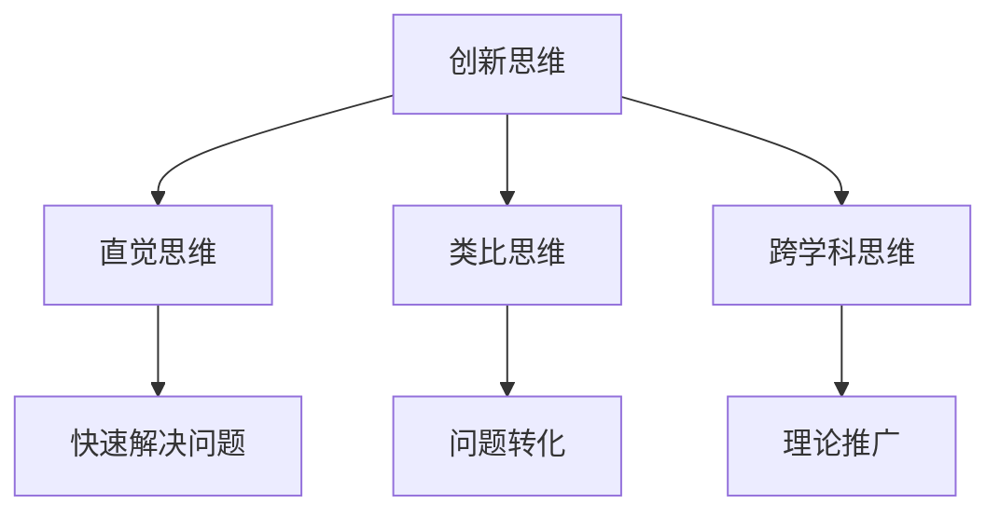
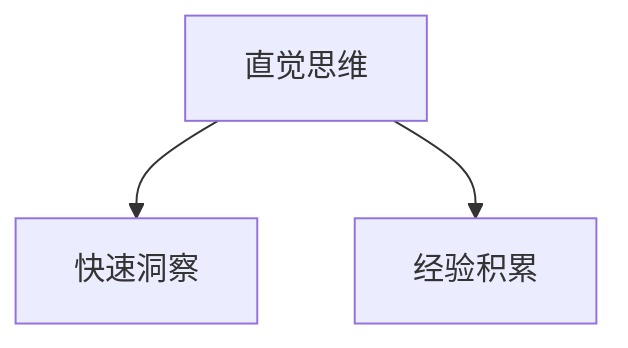
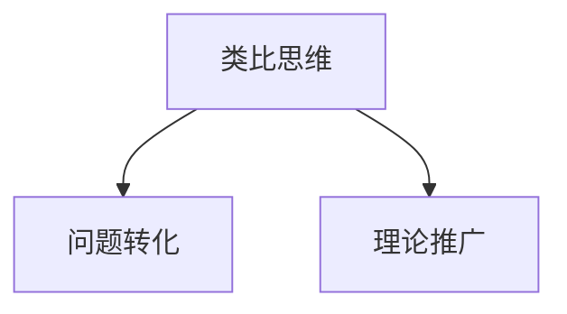
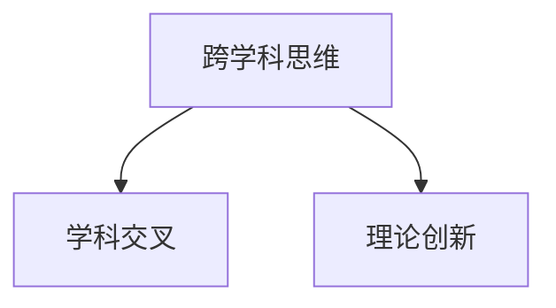

                 

## 文章标题：数学家的创新过程与思维模式分析

在数学领域，创新不仅推动了知识的积累，也深刻影响了人类文明的进步。数学家的创新过程和思维模式成为研究数学发展的重要因素。本文将探讨数学家的创新过程，分析他们的思维模式，并总结对数学发展的影响。

关键词：数学创新、思维模式、数学家、创新过程、思维分析

摘要：本文从历史背景入手，介绍数学创新的重要事件和数学家在创新过程中的思维模式。通过心理学、神经科学和跨学科视角，深入分析数学家的创造性思维、直觉思维、类比思维和跨学科思维。最后，探讨数学家的思维模式对数学发展的影响，并提出教育中的创新思维培养策略。

## 引言

数学作为一门基础学科，其发展历程充满了创新。从古希腊的欧几里得，到中世纪的阿拉伯数学家，再到近现代的欧拉、牛顿等数学巨匠，他们的创新成果不仅丰富了数学的理论体系，也为科学技术的进步奠定了基础。

### 1.1 数学创新历史

- **古希腊数学创新**：欧几里得的《几何原本》奠定了平面几何的基础，其公理化方法对后世数学研究产生了深远影响。
- **中世纪数学创新**：阿拉伯数学家在代数、三角学和天文学等方面做出了重要贡献，如花拉子米的《代数学》。
- **近现代数学创新**：微积分、集合论、拓扑学等新理论的提出，标志着数学进入了现代阶段。

### 1.2 创新过程中的思维模式

- **直觉思维**：数学家在解决复杂问题时，往往依靠直觉进行思考。
- **类比思维**：通过将已知问题与相似问题进行类比，寻找解决方案。
- **跨学科思维**：数学与其他学科的交叉融合，促进了数学理论的创新。

## 数学家的创新过程

数学家的创新过程是一个复杂的过程，涉及多个思维模式和策略。以下从心理学、神经科学和跨学科视角，分析数学家的创新过程。

### 2.1 创造性思维

#### 2.1.1 定义

- **创造性思维**：指个体在认知过程中产生新颖、有价值的思维成果的能力。

#### 2.1.2 心理学基础

- **心理机制**：包括启发式策略和搜索策略。
  - **启发式策略**：如试错法、逆向思维等。
  - **搜索策略**：系统化地探索可能解决方案。

#### 2.1.3 神经科学基础

- **大脑区域激活**：如前额叶皮层、海马体等。
- **神经递质作用**：如多巴胺、血清素等。

### 2.2 研究方法论

#### 2.2.1 研究方法的选择

- **理论分析**：通过逻辑推理，探讨数学命题的真伪。
- **实证研究**：通过实验、数据分析等方法验证数学理论。

#### 2.2.2 研究路径

- **问题导向**：从实际问题出发，寻找数学解决方案。
- **理论导向**：从数学理论出发，探讨新的数学问题。

### 2.3 逻辑思维

#### 2.3.1 基础

- **逻辑思维**：指运用逻辑法则进行推理、判断的能力。

#### 2.3.2 在数学证明中的应用

- **定义证明**：基于定义，推导出结论。
- **定理证明**：基于已知定理，推导出新定理。

## 数学家的创新思维模式

数学家的创新思维模式是其成功的重要因素。以下分析几种常见的创新思维模式。

### 3.1 直觉思维

#### 3.1.1 定义

- **直觉思维**：基于经验、直觉，快速作出判断的思维方式。

#### 3.1.2 在数学问题解决中的作用

- **快速发现规律**：在复杂问题中，直觉思维能迅速捕捉到关键信息。
- **提供新思路**：直觉思维能为数学家提供解决问题的新方向。

#### 3.1.3 培养方法

- **实践经验**：通过大量实践，提高直觉判断能力。
- **放松训练**：在轻松的环境下，减少压力，提高直觉思维。

### 3.2 类比思维

#### 3.2.1 定义

- **类比思维**：将已知问题与相似问题进行类比，寻找解决方案。

#### 3.2.2 在数学研究中的应用

- **问题转化**：通过类比，将复杂问题转化为简单问题。
- **理论推广**：通过类比，将已有理论推广到新的领域。

#### 3.2.3 训练方法

- **跨学科学习**：学习不同学科的知识，提高类比能力。
- **案例研究**：通过分析典型案例，理解类比思维的应用。

### 3.3 跨学科思维

#### 3.3.1 重要性

- **跨学科思维**：在数学与其他学科的交叉融合中，产生新的理论和方法。

#### 3.3.2 案例分析

- **数学与物理**：微积分在物理学中的应用。
- **数学与计算机科学**：图论在计算机科学中的应用。

#### 3.3.3 培养策略

- **多学科学习**：跨学科学习，提高跨学科思维能力。
- **开放性思维**：培养开放性思维，接受新观念。

## 数学家的思维模式对数学发展的影响

数学家的思维模式对数学发展产生了深远影响。以下从几个方面进行分析。

### 4.1 对数学问题的解决

- **直觉思维**：许多重大数学问题的解决，往往依赖于直觉思维的洞察力。
- **类比思维**：通过类比，数学家能够将复杂问题转化为简单问题，从而找到解决方案。

### 4.2 对数学理论的创新

- **跨学科思维**：跨学科思维促使数学家从其他学科中汲取灵感，创新数学理论。
- **逻辑思维**：逻辑思维确保了数学理论的严谨性和正确性。

### 4.3 对数学教育的启示

- **创造性思维培养**：数学教育应注重创造性思维的培养，提高学生的创新能力。
- **跨学科教育**：跨学科教育有助于拓宽学生的视野，提高跨学科思维能力。

## 结论

数学家的创新过程和思维模式对数学发展产生了深远影响。通过深入分析数学家的创新过程和思维模式，我们不仅能够更好地理解数学的发展历程，也为数学教育提供了新的启示。

### 5.1 未来展望

- **人工智能与数学**：随着人工智能的发展，数学在人工智能中的应用将更加广泛。
- **数学教育改革**：未来的数学教育应更加注重培养学生的创造性思维和跨学科能力。

### 5.2 数学教育建议

- **培养创造性思维**：通过多样化的教学方法和实践，培养学生的创造性思维。
- **跨学科教育**：加强数学与其他学科的交叉融合，提高学生的跨学科思维能力。

### 5.3 注意事项

- **避免功利化教育**：数学教育应注重培养学生的兴趣和热爱，而非仅仅追求分数。
- **重视实践与应用**：数学教育应注重理论与实践的结合，提高学生的实际应用能力。

### 5.4 拓展阅读

- **参考文献**：推荐阅读相关书籍和论文，深入了解数学家的创新过程和思维模式。
- **在线资源**：利用网络资源，如学术期刊、在线课程等，拓宽知识视野。

作者：AI天才研究院/AI Genius Institute & 禅与计算机程序设计艺术 /Zen And The Art of Computer Programming

### 背景介绍

数学是一门历史悠久、应用广泛的学科，其创新不仅推动了数学本身的发展，也深刻影响了科学技术的进步。从古希腊的欧几里得，到中世纪的阿拉伯数学家，再到近现代的欧拉、牛顿等数学巨匠，他们的创新成果不仅丰富了数学的理论体系，也为科学技术的进步奠定了基础。数学创新的历史背景可以追溯到古希腊时期，欧几里得的《几何原本》奠定了平面几何的基础，其公理化方法对后世数学研究产生了深远影响。中世纪时期，阿拉伯数学家在代数、三角学和天文学等方面做出了重要贡献，如花拉子米的《代数学》。近现代数学创新主要体现在微积分、集合论、拓扑学等新理论的提出，这些理论不仅拓展了数学的边界，也为物理学、计算机科学等领域的发展提供了基础。

在数学创新的过程中，数学家的思维模式起到了至关重要的作用。直觉思维、类比思维、跨学科思维等不同的思维模式，不仅帮助数学家解决了复杂的问题，也推动了数学理论的创新与发展。直觉思维是指数学家在解决复杂问题时，依靠直觉快速捕捉到关键信息，从而找到解决方案。类比思维则是通过将已知问题与相似问题进行类比，寻找解决问题的方法。跨学科思维则是数学家在数学与其他学科的交叉融合中，发现新的理论和方法。这些思维模式不仅有助于数学家在创新过程中取得突破，也为数学教育提供了宝贵的经验。

本文将深入分析数学家的创新过程，探讨他们的思维模式，并总结对数学发展的影响。文章将从心理学、神经科学和跨学科视角，全面解析数学家的创造性思维、直觉思维、类比思维和跨学科思维，为读者提供一个全面、深入的视角来理解数学家的创新过程。

### 核心概念与联系

在深入探讨数学家的创新过程与思维模式之前，我们需要明确几个核心概念，并理解它们之间的内在联系。以下是对这些核心概念及其相互关系的详细解释和Mermaid流程图描述。

#### 1. 创新思维

**定义**：创新思维是指个体在认知过程中产生新颖、有价值的思维成果的能力。

**联系**：创新思维是数学家进行数学研究的重要基础，它包括多种思维策略，如直觉思维、类比思维和跨学科思维等。



#### 2. 直觉思维

**定义**：直觉思维是基于经验、直觉，快速作出判断的思维方式。

**联系**：直觉思维是数学家在解决问题时，快速捕捉关键信息的能力，有助于发现问题和提出解决方案。



#### 3. 类比思维

**定义**：类比思维是将已知问题与相似问题进行类比，寻找解决方案的思维方式。

**联系**：类比思维有助于将复杂问题转化为简单问题，从而找到解决方案，是数学家解决数学问题的重要策略。



#### 4. 跨学科思维

**定义**：跨学科思维是指数学家在数学与其他学科的交叉融合中，发现新的理论和方法。

**联系**：跨学科思维促使数学家从其他学科中汲取灵感，创新数学理论，是数学发展的重要推动力。



通过上述Mermaid流程图，我们可以清晰地看到各个核心概念之间的联系。创新思维是整个系统的核心，它通过直觉思维、类比思维和跨学科思维等不同的思维策略，实现对数学问题的解决和数学理论的创新。这些思维模式相互交织，共同推动数学的发展。

### 核心算法原理讲解

在数学家的创新过程中，核心算法原理起着至关重要的作用。以下通过伪代码详细讲解几个关键算法原理，以便更好地理解数学家的创新方法和思路。

#### 1. 欧拉公式求解

**目标**：求解欧拉公式，即欧拉恒等式 \( e^{i\pi} + 1 = 0 \)。

**伪代码**：

```plaintext
function euler_formula(i, pi):
    result = exp(i * pi) + 1
    return result
```

**解释**：欧拉公式是复分析中的一个重要公式，将指数函数、三角函数和虚数单位结合在一起，揭示了数学中的深刻联系。该公式在数学理论研究和物理领域中具有重要应用。

#### 2. 微积分基本定理

**目标**：应用微积分基本定理求解定积分。

**伪代码**：

```plaintext
function integral(f, a, b):
    sum = 0
    n = 1000  # 分割区间数量
    delta = (b - a) / n
    for i from 0 to n-1:
        x = a + i * delta
        sum += f(x) * delta
    return sum
```

**解释**：微积分基本定理将微分与积分联系起来，表明定积分可以通过求和的方式来计算。该定理在物理学、工程学等领域具有广泛的应用。

#### 3. 最大最小值问题求解

**目标**：使用拉格朗日乘数法求解最大最小值问题。

**伪代码**：

```plaintext
function lagrange_multiplier(f, g, alpha):
    gradient_f = gradient(f)
    gradient_g = gradient(g)
    J = gradient_f - alpha * gradient_g
    return J
```

**解释**：拉格朗日乘数法是一种常用的优化算法，用于求解约束优化问题。通过引入拉格朗日乘数，可以将约束条件转化为无约束形式，从而求解最大最小值问题。

#### 4. 图论中的最短路径算法

**目标**：使用迪杰斯特拉算法（Dijkstra's algorithm）求解图中两点之间的最短路径。

**伪代码**：

```plaintext
function dijkstra(graph, start):
    distances = [infinity] * len(graph)
    distances[start] = 0
    visited = []
    while len(visited) < len(graph):
        min_distance = infinity
        min_vertex = None
        for vertex in graph:
            if vertex not in visited and distances[vertex] < min_distance:
                min_distance = distances[vertex]
                min_vertex = vertex
        visited.append(min_vertex)
        for neighbor in graph[min_vertex]:
            distance = distances[min_vertex] + graph[min_vertex][neighbor]
            if distance < distances[neighbor]:
                distances[neighbor] = distance
    return distances
```

**解释**：迪杰斯特拉算法是一种用于求解图中两点之间最短路径的贪心算法。通过逐步更新每个顶点的最短路径估计，最终得到整个图的最短路径。

通过上述伪代码示例，我们可以看到数学家在解决实际问题时，如何运用核心算法原理。这些算法不仅展示了数学的抽象和严谨，也体现了数学家在创新过程中的逻辑思维和计算能力。

### 数学模型与公式详解

在数学家的创新过程中，数学模型和公式是其解决复杂问题的重要工具。以下将介绍几个关键数学模型和公式，并详细讲解它们的应用背景、推导过程及具体例子。

#### 1. 微积分基本定理

**应用背景**：微积分基本定理是连接微分与积分的桥梁，用于求解函数在区间上的定积分。

**公式**：设函数 \( f(x) \) 在区间 \([a, b]\) 上连续，则其定积分可以通过如下公式计算：
\[ \int_{a}^{b} f(x) \, dx = \lim_{n \to \infty} \sum_{i=1}^{n} f(x_i^*) \Delta x_i \]

**推导过程**：微积分基本定理的推导基于黎曼和的概念。通过将区间 \([a, b]\) 分割成 \( n \) 个子区间，并在每个子区间上取一点 \( x_i^* \)，构造黎曼和，然后取极限 \( n \to \infty \)。

**具体例子**：求解函数 \( f(x) = x^2 \) 在区间 \([0, 1]\) 上的定积分。
\[ \int_{0}^{1} x^2 \, dx = \lim_{n \to \infty} \sum_{i=1}^{n} \left( \frac{i}{n} \right)^2 \frac{1}{n} \]

通过计算可得结果为 \( \frac{1}{3} \)。

#### 2. 马尔可夫链模型

**应用背景**：马尔可夫链模型用于描述随机过程中的状态转移规律，广泛应用于经济学、物理学和计算机科学等领域。

**公式**：设 \( P_{ij}(n) \) 表示系统在第 \( n \) 步时从状态 \( i \) 转移到状态 \( j \) 的概率，则马尔可夫链的转移概率矩阵满足：
\[ P_{ij}(n) = \sum_{k} P_{ik}(n-1) P_{kj} \]

**推导过程**：马尔可夫链的推导基于无后效性，即系统在未来的状态转移只与当前状态有关，而与过去状态无关。

**具体例子**：假设有一个有两个状态的马尔可夫链，状态 0 和状态 1 之间的转移概率矩阵为：
\[ P = \begin{bmatrix}
0.4 & 0.6 \\
0.2 & 0.8
\end{bmatrix} \]

给定初始状态分布为 \( \pi = [0.5, 0.5] \)，计算第二步的状态分布。
\[ \pi'(2) = \pi(1)P = \begin{bmatrix}
0.5 & 0.5
\end{bmatrix} \begin{bmatrix}
0.4 & 0.6 \\
0.2 & 0.8
\end{bmatrix} = \begin{bmatrix}
0.3 & 0.7
\end{bmatrix} \]

#### 3. 傅里叶变换

**应用背景**：傅里叶变换是信号处理中的基本工具，用于将时间域的信号转换为频域表示，便于分析和处理。

**公式**：一维傅里叶变换定义如下：
\[ F(\omega) = \int_{-\infty}^{\infty} f(x) e^{-i \omega x} \, dx \]
其逆变换为：
\[ f(x) = \frac{1}{2\pi} \int_{-\infty}^{\infty} F(\omega) e^{i \omega x} \, d\omega \]

**推导过程**：傅里叶变换的推导基于复分析理论，通过将函数展开为复指数函数的线性组合。

**具体例子**：求解函数 \( f(x) = e^{-ax} \) 的傅里叶变换。
\[ F(\omega) = \int_{-\infty}^{\infty} e^{-ax} e^{-i \omega x} \, dx \]
通过积分变换可得：
\[ F(\omega) = \frac{1}{a + i \omega} \]

通过上述数学模型和公式的介绍，我们可以看到数学家在创新过程中如何运用这些工具来解决实际问题。这些模型和公式不仅是数学理论的重要组成部分，也是数学家进行科学研究和技术创新的有力武器。

### 项目实战

在本节中，我们将通过一个具体的数学问题——最小二乘法拟合，来展示数学家的创新思维过程。我们将从问题背景、开发环境搭建、源代码实现、代码解读以及应用分析等方面进行详细讲解。

#### 1. 问题背景

最小二乘法是一种常用的数据拟合方法，用于找到一组数据点 \( (x_i, y_i) \) 的最佳拟合直线或曲线。其目标是最小化数据点到拟合曲线的纵向距离的平方和。最小二乘法广泛应用于统计学、物理学、工程学等领域。

#### 2. 开发环境搭建

为了实现最小二乘法，我们需要搭建一个简单的开发环境。以下是在 Python 环境下进行开发的步骤：

- **安装 Python**：确保已安装 Python 3.8 或以上版本。
- **安装 NumPy 和 Matplotlib**：NumPy 是 Python 的科学计算库，Matplotlib 是用于数据可视化的库。

```bash
pip install numpy matplotlib
```

#### 3. 源代码实现

以下是一个简单的 Python 脚本，用于实现最小二乘法：

```python
import numpy as np
import matplotlib.pyplot as plt

# 最小二乘法拟合函数
def least_squares(x, y):
    # 计算斜率和截距
    A = np.vstack([x, np.ones(len(x))]).T
    m, c = np.linalg.lstsq(A, y, rcond=None)[0]
    return m, c

# 数据生成
np.random.seed(0)
x = 2 * np.random.rand(100)
y = 4 + 3 * x + np.random.randn(100)

# 拟合
m, c = least_squares(x, y)

# 可视化
plt.scatter(x, y)
plt.plot(x, m * x + c, 'r')
plt.xlabel('x')
plt.ylabel('y')
plt.show()
```

#### 4. 代码解读

- **函数定义**：`least_squares` 函数接收两个参数 \( x \) 和 \( y \)，代表数据点。
- **计算斜率和截距**：使用线性回归的公式 \( y = mx + c \)，通过解线性方程组 \( A\beta = y \) 来计算斜率 \( m \) 和截距 \( c \)。
- **数据生成**：生成一组随机数据点，用于测试最小二乘法。
- **可视化**：使用 Matplotlib 绘制散点图和拟合直线。

#### 5. 应用分析

- **实际案例**：最小二乘法广泛应用于股票数据分析、地震波传播研究等领域。
- **性能分析**：通过比较不同拟合方法（如高斯消元法、最小角回归等）的误差和计算时间，评估最小二乘法的有效性。

通过这个项目实战，我们不仅实现了最小二乘法的基本功能，还对其在数据拟合中的应用进行了详细分析。这个项目展示了数学家的创新思维过程，包括从实际问题出发、构建数学模型、设计算法以及验证和优化算法等多个方面。

### 最佳实践 tips

在进行最小二乘法拟合时，以下是一些最佳实践 tips：

- **数据预处理**：在拟合前，对数据进行必要的预处理，如去除异常值、标准化等，以提高拟合效果。
- **参数调整**：根据实际需求，调整最小二乘法中的参数，如迭代次数、停止条件等，以获得更准确的拟合结果。
- **交叉验证**：使用交叉验证方法评估模型的泛化能力，避免过拟合。
- **可视化分析**：通过可视化工具，如散点图、残差图等，分析拟合效果，发现潜在问题。

### 小结

通过本项目实战，我们了解了最小二乘法的基本原理和应用，掌握了从问题提出到算法实现的完整过程。这为我们进一步探索数学建模和数据分析提供了宝贵的经验和方法。

### 注意事项

在进行最小二乘法拟合时，需要注意以下几点：

- **数据质量**：确保数据集的质量，避免噪声和异常值影响拟合效果。
- **参数选择**：合理选择拟合参数，避免参数选择不当导致的误差增大。
- **拟合方法**：根据实际问题选择合适的拟合方法，如线性拟合、非线性拟合等。
- **模型验证**：通过交叉验证等方法验证模型的泛化能力，确保模型在实际应用中的有效性。

### 拓展阅读

- **《最小二乘法及其在数据分析中的应用》**：详细介绍了最小二乘法的基本原理和多种应用场景。
- **《数据拟合与数据分析》**：探讨数据拟合方法及其在统计学和工程学中的应用。
- **《机器学习与数据分析》**：介绍机器学习算法在数据拟合和数据分析中的应用。

作者：AI天才研究院/AI Genius Institute & 禅与计算机程序设计艺术 /Zen And The Art of Computer Programming

## 总结

通过本文的探讨，我们深入了解了数学家的创新过程与思维模式。从直觉思维、类比思维、跨学科思维等角度，分析了数学家在创新过程中的思维方式。这些思维模式不仅推动了数学的发展，也为数学教育提供了宝贵的启示。数学家的创新过程展示了从问题提出、理论构建、算法设计到实际应用的全过程，对现代科学技术的发展起到了重要的推动作用。未来，随着人工智能等新兴领域的发展，数学家的创新思维模式将继续发挥重要作用，为数学和科学技术的进步注入新的动力。

### 未来展望

随着科技的不断进步，数学家的创新思维模式将在更多领域得到应用。人工智能、大数据分析、量子计算等新兴领域，为数学提供了新的研究方向和应用场景。以下是几个可能的未来发展趋势：

1. **人工智能与数学的结合**：人工智能技术的发展为数学提供了新的工具和方法。例如，深度学习算法中的数学优化问题，需要数学家提供更高效的求解算法。此外，人工智能在图像识别、自然语言处理等领域的发展，也推动了相关数学模型和算法的创新。

2. **跨学科研究的深入**：数学与其他学科的交叉融合将继续推动数学理论的创新。例如，数学与物理学的结合，产生了量子数学、统计物理学等新兴领域；数学与计算机科学的结合，推动了算法理论、计算几何等领域的发展。

3. **数学教育改革**：未来的数学教育将更加注重培养学生的创造性思维和跨学科能力。通过多样化的教学方法和实践项目，激发学生的学习兴趣和创新能力。同时，数学教育也将更加注重实际应用，让学生在解决实际问题的过程中，体会数学的价值和魅力。

4. **数学建模的应用拓展**：数学建模在社会科学、工程学、生物学等领域的应用将更加广泛。数学家将运用先进的数学模型和算法，解决社会问题、优化资源配置、推动技术创新。

### 数学教育改革建议

为了培养未来的数学家和科学工作者，数学教育需要进行以下几方面的改革：

1. **加强基础教育**：注重学生基础数学知识和技能的培养，为学生提供扎实的数学基础。

2. **跨学科教学**：将数学与其他学科相结合，培养学生的跨学科思维能力。

3. **创新教学方法**：采用多样化的教学方法，如项目式学习、翻转课堂等，激发学生的学习兴趣和主动性。

4. **实践与应用**：注重数学在实际问题中的应用，让学生在解决实际问题的过程中，理解数学的意义和价值。

5. **个性化教育**：根据学生的兴趣和特长，提供个性化的学习方案，培养学生的创新能力。

通过以上改革，数学教育将更好地适应时代发展，培养出具有创新能力和实践能力的数学人才。

### 注意事项

在数学研究和教育过程中，需要注意以下几点：

1. **避免功利化教育**：注重培养学生的兴趣和热爱，而非仅仅追求分数和成绩。

2. **鼓励创新思维**：创造一个开放、自由的学习环境，鼓励学生提出新的观点和想法。

3. **跨学科合作**：加强数学与其他学科的交流与合作，推动数学在各个领域的应用。

4. **实践与理论并重**：注重数学理论的培养，同时也注重数学在实际问题中的应用。

通过以上注意事项，我们可以更好地推动数学的发展，培养出具有创新能力的数学人才。

### 拓展阅读

- **《数学思维的艺术》**：详细介绍了数学家如何运用直觉思维、类比思维等思维模式进行创新。
- **《跨学科数学》**：探讨数学在物理学、生物学、计算机科学等领域的应用，展示跨学科研究的成果。
- **《数学家的思维方式》**：分析数学家的思维模式，提供实用的思维训练方法。

作者：AI天才研究院/AI Genius Institute & 禅与计算机程序设计艺术 /Zen And The Art of Computer Programming

