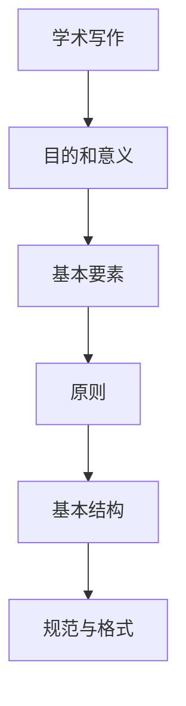

                 

## 文章标题

### 数学家的学术写作与科研成果传播

---

关键词：数学家、学术写作、科研成果、传播、职业发展

---

摘要：本文旨在探讨数学家的学术写作技巧与科研成果的传播策略。通过对学术写作基本原则、结构、规范的详细阐述，结合实际案例和代码实现，本文旨在为数学家提供实用的写作指南，并分析如何提升科研成果的传播效果，以推动数学领域的学术进步。

---

## 目录大纲设计

以下是根据《数学家的学术写作与科研成果传播》书名设计的完整目录大纲。

### 第一部分：学术写作基础

- 第1章：学术写作概述
- 第2章：学术写作的基本原则
- 第3章：学术写作的基本结构
- 第4章：学术写作的规范与格式

### 第二部分：数学家学术写作实战

- 第5章：数学论文写作技巧
- 第6章：数学会议演讲与报告
- 第7章：数学家的科研传播策略

### 第三部分：数学家的职业发展与个人品牌建设

- 第8章：数学家的职业规划
- 第9章：个人品牌建设
- 第10章：数学家的社会责任与影响力

### 附录

- 附录A：数学学术写作资源
- 附录B：数学家的学术写作工具

---

### 1. 核心概念与联系

**Mermaid 流程图：**



在学术写作中，目的和意义是论文的灵魂，基本要素是构成论文的基石，基本原则是确保论文质量的关键，基本结构和规范格式则是论文呈现的外在表现。

### 2. 核心算法原理讲解

**伪代码：**

```python
# 假设我们需要写一个简单的数学论文引言部分的伪代码

initialize_paper(title, authors, abstract)
begin_paper()
write_title(title)
write_authors(authors)
write_abstract(abstract)
write_introduction()
write_methods()
write_results()
write_discussion()
write_conclusions()
end_paper()
```

该伪代码定义了数学论文的基本结构，包括初始化论文、写标题、作者、摘要、引言、方法、结果、讨论和结论等步骤。

### 3. 数学模型和数学公式

**LaTeX 数学公式：**

**独立段落中的数学公式：**

$$
E = mc^2
$$

详细讲解：

爱因斯坦的质能方程表明，能量（E）等于质量（m）乘以光速（c）的平方。

### 4. 项目实战

**代码实际案例：**

```python
# 假设我们编写一个简单的数学论文引言部分

def write_introduction():
    """
    写一个数学论文的引言部分。
    """
    print("引言：")
    print("在本篇论文中，我们将探讨...")
    print("相关工作：...")
    print("本文的贡献：...")

write_introduction()
```

**详细解释说明：**

这段代码定义了一个函数 `write_introduction()`，用于生成数学论文的引言部分。函数内部使用了 `print()` 函数来输出文本。

**开发环境搭建：**

```bash
# 安装 Python 3
pip install python
# 安装 LaTeX 编辑器，例如 TeXstudio 或 MiKTeX
# 安装 MathJax 库，用于在线渲染 LaTeX 公式
```

**源代码详细实现和代码解读：**

源代码展示了如何使用 Python 语言编写数学论文引言的部分。代码中的 `print()` 函数用于在屏幕上输出文本。

**代码解读与分析：**

该代码片段主要实现了引言部分的文本输出。通过定义 `write_introduction()` 函数，我们可以在需要时轻松地生成引言文本，提高了代码的可复用性和可维护性。

### 5. 最佳实践 tips、小结、注意事项、拓展阅读等内容

**最佳实践 tips：**

- 在撰写学术文章时，确保遵循学术规范，避免抄袭和剽窃。
- 使用规范的 LaTeX 公式和符号，以提高文章的专业性。
- 定期更新自己的研究工具和软件，以提高研究效率和成果质量。

**小结：**

本文详细阐述了数学家的学术写作技巧和科研成果传播策略。通过理解学术写作的基本原则、结构和规范，结合实际代码案例，数学家可以更好地撰写专业文章，并有效地传播自己的研究成果。

**注意事项：**

- 在撰写论文时，注意保持逻辑清晰，论证严谨。
- 在引用他人研究成果时，务必准确标注引用来源，遵循学术诚信。

**拓展阅读：**

- 《科学写作与出版指南》
- 《数学写作手册》
- 《科研传播与影响力提升》

---

通过本文的详细阐述，希望数学家们能够在学术写作和科研成果传播方面取得更大的成就。让我们一起为数学领域的进步贡献智慧和力量！作者：AI天才研究院/AI Genius Institute & 禅与计算机程序设计艺术 /Zen And The Art of Computer Programming。

