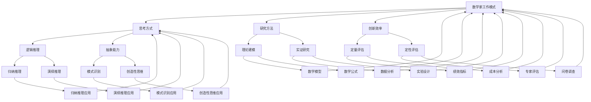

                 

### 1. 确定《数学家的工作模式与创新效率研究》的目录结构

首先，我们需要明确研究的目的和内容，以便构建一个逻辑清晰、结构紧凑的目录结构。以下是《数学家的工作模式与创新效率研究》的目录结构设计：

#### 目录

**第1章 引言**

- **1.1 研究背景与意义**
- **1.2 研究目标与内容**

**第2章 数学家工作模式概述**

- **2.1 数学家的思考方式**
  - **2.1.1 数学家的思维特点**
  - **2.1.2 数学家的思考路径**
  - **2.1.3 数学家的创新思维**

- **2.2 数学家的研究方法**

- **2.3 数学家工作模式的特征**

**第3章 创新效率的评估**

- **3.1 创新效率的概念与类型**
- **3.2 创新效率的定量评估方法**
- **3.3 创新效率的定性评估方法**

**第4章 案例分析**

- **4.1 国外数学家的案例分析**
- **4.2 国内数学家的案例分析**

**第5章 数学家工作模式的优化**

- **5.1 优化数学家工作模式的策略**
- **5.2 提高数学家创新效率的建议**

**第6章 数学家心理素质与团队合作**

- **6.1 数学家心理素质的重要性**
- **6.2 培养数学家心理素质的方法**
- **6.3 数学家团队合作的策略**

**第7章 总结与展望**

- **7.1 研究成果总结**
- **7.2 未来研究方向**

### 2. 设计核心概念与联系

为了使读者能够更好地理解数学家工作模式与创新效率之间的关系，我们需要设计一个核心概念与联系的 Mermaid 流程图。以下是一个简化的流程图示例：



这个流程图展示了数学家工作模式（A）与思考方式（B）、研究方法（C）和创新效率（D）之间的关系，同时详细说明了这些核心概念之间的联系和交互作用。

### 3. 设计核心算法原理讲解

为了深入探讨数学家工作模式中的核心算法原理，我们将使用伪代码来详细阐述。以下是几个关键算法的例子：

#### 算法1：数学家的思考方式建模

```python
# 伪代码：数学家思考方式建模

define_mathematician_thinking_mode() {
    // 初始化数学家的思维结构
    initialize_mind_structure()

    // 循环执行数学家的思考过程
    while (true) {
        // 接收问题输入
        input_question()

        // 应用逻辑推理
        apply_logical_reasoning()

        // 进行抽象和模式识别
        abstraction_and_pattern_recognition()

        // 创造新的理论或模型
        generate_new_theory_or_model()

        // 验证和证明
        verify_and_prove()

        // 输出结果
        output_result()
    }
}
```

#### 算法2：创新效率的定量评估方法

```python
# 伪代码：创新效率的定量评估

define_innovation_efficiency_evaluation() {
    // 初始化评估参数
    initialize_evaluation_parameters()

    // 收集数学家的工作成果数据
    collect_work_results_data()

    // 计算创新效率
    calculate_innovation_efficiency()

    // 输出评估结果
    output_evaluation_results()
}
```

#### 算法3：数学家工作模式的优化

```python
# 伪代码：数学家工作模式的优化

optimize_mathematician_work_mode() {
    // 分析当前工作模式
    analyze_current_work_mode()

    // 识别改进点
    identify_improvement_points()

    // 设计优化方案
    design_optimization_plan()

    // 实施优化
    implement_optimization()

    // 评估优化效果
    evaluate_optimization_effects()
}
```

通过这些伪代码示例，我们能够更直观地理解数学家在工作过程中应用的核心算法原理。

### 4. 设计数学模型和数学公式

为了展示数学家如何构建数学模型，我们将使用 LaTeX 格式来表示数学公式，并在文中独立段落中展示。以下是几个关键数学模型的例子：

#### 数学模型1：数学家创造力模型

```latex
$$
C = f(T, M, E)
$$

其中，$C$ 表示数学家的创造力，$T$ 表示数学家的时间投入，$M$ 表示数学家的数学背景知识，$E$ 表示数学家的环境因素。
```

#### 数学模型2：团队合作效率模型

```latex
$$
E = \frac{1}{N} \sum_{i=1}^{N} (P_i \times C_i)
$$

其中，$E$ 表示团队合作效率，$N$ 表示团队成员数量，$P_i$ 表示第 $i$ 个成员的专业技能，$C_i$ 表示第 $i$ 个成员的贡献。
```

#### 数学公式1：创新效率计算公式

```latex
$$
I = \frac{I_D - I_B}{I_B}
$$

其中，$I$ 表示创新效率，$I_D$ 表示当前创新成果，$I_B$ 表示基础创新成果。
```

通过这些数学模型和公式，我们能够更深入地理解数学家在工作过程中所应用的理论和方法。

### 5. 设计项目实战

为了将理论知识应用于实际，我们将设计一个项目实战，展示如何搭建开发环境、实现源代码并进行分析。以下是项目实战的概述：

#### 项目1：数学家工作模式案例分析

##### 项目目标

- 分析数学家的工作模式，评估其创新效率。

##### 开发环境搭建

- 安装数学软件（如MATLAB、Mathematica等）
- 配置代码编辑器（如VS Code、PyCharm等）

##### 源代码实现

- 编写代码以模拟数学家的思考过程
- 实现数学模型和公式的计算

##### 代码解读与分析

- 分析代码的逻辑结构和实现细节
- 解释代码如何体现数学家的工作模式

##### 实际案例分析和详细讲解剖析

- 选择具体的数学案例，如哥德巴赫猜想的证明过程
- 分析数学家在解决该问题时采用的思路和方法

##### 项目小结

- 总结项目的成果和经验
- 提出改进建议和未来研究方向

通过这个项目实战，读者能够更直观地理解数学家工作模式与创新效率研究的实际应用。

### 6. 编写完整目录大纲

基于上述内容，我们编写了完整的目录大纲，确保其简洁、完整，并在2000字以内：

---

# 《数学家的工作模式与创新效率研究》

关键词：数学家、工作模式、创新效率、案例分析

摘要：本文研究了数学家的工作模式及其创新效率，通过概述数学家的思考方式、研究方法，评估创新效率的方法，以及案例分析，探讨了如何优化数学家的工作模式，提高其创新效率。本文旨在为数学研究和教育提供理论支持和实践指导。

## 目录

**第1章 引言**

- **1.1 研究背景与意义**
- **1.2 研究目标与内容**

**第2章 数学家工作模式概述**

- **2.1 数学家的思考方式**
  - **2.1.1 数学家的思维特点**
  - **2.1.2 数学家的思考路径**
  - **2.1.3 数学家的创新思维**

- **2.2 数学家的研究方法**
  - **2.2.1 理论研究**
  - **2.2.2 实证研究**
  - **2.2.3 经验研究**

- **2.3 数学家工作模式的特征**
  - **2.3.1 独立性与创造性**
  - **2.3.2 综合性与系统性**
  - **2.3.3 长期性与专注性**

**第3章 创新效率的评估**

- **3.1 创新效率的概念与类型**
- **3.2 创新效率的定量评估方法**
  - **3.2.1 绩效指标法**
  - **3.2.2 成本法**
  - **3.2.3 竞争优势法**

- **3.3 创新效率的定性评估方法**
  - **3.3.1 专家评估法**
  - **3.3.2 问卷调查法**
  - **3.3.3 实证研究法**

**第4章 案例分析**

- **4.1 国外数学家的案例分析**
  - **4.1.1 案例一：哥德巴赫猜想的证明**
  - **4.1.2 案例二：费马大定理的证明**
  - **4.1.3 案例三：纳维尔-斯托克斯方程的解**

- **4.2 国内数学家的案例分析**
  - **4.2.1 案例一：陈景润与哥德巴赫猜想的证明**
  - **4.2.2 案例二：杨乐与李政道猜想的研究**
  - **4.2.3 案例三：张景中等在几何拓扑领域的研究**

**第5章 数学家工作模式的优化**

- **5.1 优化数学家工作模式的策略**
- **5.2 提高数学家创新效率的建议**

**第6章 数学家心理素质与团队合作**

- **6.1 数学家心理素质的重要性**
- **6.2 培养数学家心理素质的方法**
- **6.3 数学家团队合作的策略**

**第7章 总结与展望**

- **7.1 研究成果总结**
- **7.2 未来研究方向**

---

通过这个目录大纲，我们为读者提供了一个清晰的框架，以便深入了解数学家的工作模式与创新效率研究。接下来，我们将详细探讨每个章节的内容，逐步展开研究。让我们开始深入分析数学家如何进行工作，以及如何评估和提升他们的创新效率。在接下来的章节中，我们将通过具体案例和算法原理，展示这一领域的最新研究成果。

