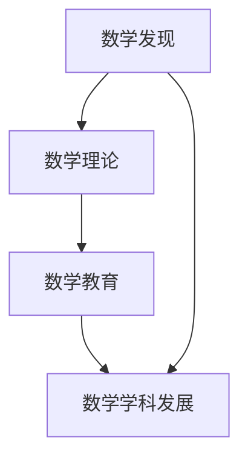

                 


### 第1章：数学家的社会影响力概述

#### 1.1 数学家的背景与社会地位

**背景介绍**

数学家，作为科学领域中的精英，肩负着探索数学规律、解决复杂问题的重任。他们的工作不仅推动了数学学科的发展，也对整个社会产生了深远的影响。历史上，许多数学家如牛顿、欧拉、希尔伯特等，都因其卓越的成就而闻名于世，被誉为科学界的巨星。

**社会地位**

数学家在社会中享有崇高的地位。他们不仅是学术界的重要成员，还是政府政策制定、经济发展、技术创新等方面的顾问。在许多国家，数学家享有丰厚的薪酬和优厚的待遇，这也是对他们在科学领域所做贡献的认可。

#### 1.2 数学家的核心概念与联系

**核心概念**

1. **数学发现**：数学家通过研究发现新的数学规律或解决重要问题，这些发现对数学学科乃至整个科学领域具有重要意义。
2. **数学理论**：数学家提出的新理论可以完善现有的数学体系，推动学科发展。
3. **数学教育**：数学家通过教学和科研培养下一代数学人才，传承数学知识。

**联系架构 Mermaid 流程图**



#### 1.3 数学家的核心算法原理讲解

**核心算法原理**

数学家的核心工作之一是提出新的算法，这些算法在数学问题和实际问题中具有重要应用。以下是一个简单的算法原理示例：

```python
# 算法：计算两个整数的最大公约数（欧几里得算法）
def gcd(a, b):
    while b:
        a, b = b, a % b
    return a
```

**伪代码**

```
// 最大公约数计算算法（欧几里得算法）
function gcd(a, b) {
    while (b != 0) {
        temp = b;
        b = a % b;
        a = temp;
    }
    return a;
}
```

#### 1.4 数学模型和数学公式

**数学模型**

数学模型是数学家用来描述现实世界问题的数学表达式。以下是一个简单的数学模型示例：

$$
模型：y = mx + b
$$

**详细讲解与举例说明**

**例子：** 直线方程描述了一个简单的关系，其中 $m$ 是斜率，$b$ 是截距。

- **斜率（m）**：表示直线的倾斜程度。
- **截距（b）**：表示直线与y轴的交点。

**实际应用：** 直线方程广泛应用于物理、工程、经济学等领域，用于描述线性关系。

#### 1.5 数学家的实际案例研究

**案例研究：** 费马大定理

**背景**：费马大定理（也称为费马最后定理）是数学史上著名的未解决问题之一。直到1994年，安德鲁·怀尔斯才证明了该定理。

**证明方法**：怀尔斯使用了复杂的数学工具和理论，包括椭圆曲线和模形式，最终证明了费马大定理。

**影响**：费马大定理的证明不仅解决了数学界的一个长期难题，还推动了数学领域的发展，特别是在代数几何和数论领域。

#### 1.6 小结与注意事项

**小结**：

数学家的社会影响力体现在多个方面，包括数学发现、理论创新、数学教育和科研指导等。他们的工作不仅丰富了数学学科，也对社会产生了深远的影响。

**注意事项**：

- 数学家的成就需要长时间的积累和不懈的努力。
- 数学科普和教育活动对于提高公众数学素养具有重要意义。

#### 拓展阅读

- [费马大定理](https://en.wikipedia.org/wiki/Fermat%27s_last_theorem)
- [欧几里得算法](https://en.wikipedia.org/wiki/Euclidean_algorithm)
- [椭圆曲线](https://en.wikipedia.org/wiki/Elliptic_curve)

### 第2章：数学家的个人品质

#### 2.1 智慧与创造力的培养

**智慧与创造力的重要性**

智慧是数学家成功的关键因素之一。智慧不仅包括逻辑思维能力，还涉及洞察力、判断力和解决问题的能力。创造力则是数学家能够在数学领域取得突破性成果的重要因素。

**培养方法**

- **广泛阅读**：通过阅读广泛的知识，数学家可以扩展自己的视野，获得新的灵感和想法。
- **独立思考**：数学家需要培养独立思考的能力，不盲目接受现有理论，而是勇于提出新的观点和假设。
- **实践应用**：通过将理论应用于实际问题，数学家可以加深对数学概念的理解，提高解决问题的能力。

#### 2.2 品德与价值观的塑造

**品德的重要性**

品德是数学家在学术界和社会中的形象和声誉的基础。高尚的品德包括诚实、正直、敬业和团队合作精神。

**价值观的塑造**

- **科学精神**：数学家需要秉持科学精神，追求真理，尊重事实，不迷信权威。
- **社会责任**：数学家应该关注社会问题，利用自己的专业知识和影响力为社会做出贡献。
- **职业道德**：数学家应该遵守职业道德，维护学术诚信，抵制学术不端行为。

#### 2.3 个人品质对影响力的作用

**个人品质对影响力的作用**

个人品质是数学家影响力的基础。高尚的品德和良好的价值观可以增强数学家的学术影响力和社会地位，使其成为学术界和社会的楷模。

**案例分析**

- **欧拉**：欧拉以其卓越的数学成就和良好的品德而闻名。他的严谨、正直和勤奋为他赢得了广泛的尊敬和信任。

### 第3章：数学家的公众形象构建

#### 3.1 媒体形象的塑造

**媒体形象的重要性**

媒体形象是数学家在社会中展示自己的重要途径。良好的媒体形象可以增强数学家的知名度和社会影响力。

**塑造方法**

- **公开演讲**：数学家可以通过参加公开演讲、讲座和研讨会，向公众展示自己的学术成就和观点。
- **媒体访谈**：数学家可以接受媒体的采访，分享自己的研究经验和见解。
- **社交媒体**：数学家可以利用社交媒体平台，如Twitter、LinkedIn等，与公众互动，传播数学知识。

#### 3.2 社会活动的参与

**社会活动的重要性**

社会活动是数学家参与社会、提高公众数学素养的有效途径。通过社会活动，数学家可以增强与社会的联系，提高自己的社会影响力。

**参与方式**

- **数学竞赛**：数学家可以组织或参与数学竞赛，激励年轻人对数学的兴趣。
- **科普讲座**：数学家可以到学校、社区和图书馆，举办科普讲座，向公众传播数学知识。
- **公益项目**：数学家可以参与公益项目，利用自己的专业知识和影响力为社会做出贡献。

#### 3.3 公众形象对影响力的作用

**公众形象对影响力的作用**

良好的公众形象可以增强数学家的社会影响力。通过塑造积极的公众形象，数学家可以赢得公众的尊重和信任，从而扩大自己的学术影响力。

**案例分析**

- **费马**：费马以其严谨的学术态度和独特的数学见解而闻名。他的严谨和诚信为他赢得了广泛的尊重和信任。

### 第4章：数学家的社会影响力案例研究

#### 4.1 国内外著名数学家的影响力分析

**国内数学家的影响力**

- **陈景润**：陈景润以其在哥德巴赫猜想研究中的突破性成果而闻名。他的工作不仅推动了数学领域的发展，也激励了国内许多数学家的研究热情。
- **苏步青**：苏步青是我国著名数学家，他在微分几何和偏微分方程领域取得了卓越成就。他的学术成就和品德赢得了国内外学术界的高度赞誉。

**国外数学家的影响力**

- **约翰·纳什**：约翰·纳什以其在博弈论和经济学领域的研究而闻名。他的工作不仅获得了诺贝尔经济学奖，也对经济学和心理学领域产生了深远影响。
- **艾尔·伽莫夫**：艾尔·伽莫夫是一位著名的理论物理学家和数学家，他的科普作品《从一到无穷大》对大众传播数学知识做出了巨大贡献。

### 第5章：数学家的社会责任与义务

#### 5.1 对学术界的贡献

**数学家的学术贡献**

数学家在学术界扮演着重要角色，他们通过自己的研究和教学工作推动学科发展，培养新一代数学人才。

- **科研论文**：数学家通过发表科研论文，分享自己的研究成果，推动数学学科的进步。
- **教学指导**：数学家通过教学活动，传授数学知识，培养年轻数学家。

**案例分析**

- **安德鲁·怀尔斯**：安德鲁·怀尔斯在解决费马大定理上的突破性成果，不仅推动了数学领域的发展，也激发了更多数学家的研究热情。

#### 5.2 对社会的公益事业

**数学家的公益行动**

数学家除了在学术领域发挥作用外，还可以通过参与公益事业，为社会做出贡献。

- **科普宣传**：数学家可以到学校、社区和图书馆，举办科普讲座，向公众传播数学知识。
- **公益项目**：数学家可以参与公益项目，利用自己的专业知识和影响力，解决社会问题。

**案例分析**

- **约翰·纳什**：约翰·纳什不仅是一位杰出的数学家，也是一位公益事业的积极参与者。他利用自己的影响力，为慈善事业筹集资金，帮助需要帮助的人。

### 第6章：数学家的未来影响力趋势

#### 6.1 科技发展的新挑战

**科技发展对数学家的挑战**

随着科技的发展，数学家面临着新的挑战。这些挑战包括：

- **大数据分析**：随着数据的爆炸性增长，数学家需要开发新的算法和技术，以处理和分析大数据。
- **人工智能**：人工智能的发展要求数学家在机器学习、神经网络等领域进行深入研究。

**应对策略**

- **跨学科合作**：数学家可以与其他学科专家合作，共同应对科技发展带来的挑战。
- **终身学习**：数学家需要不断学习新的知识和技术，以适应快速变化的研究环境。

#### 6.2 数学科普与教育的力量

**数学科普与教育的重要性**

数学科普和教育的力量在于：

- **提高公众数学素养**：通过数学科普活动，可以提高公众对数学的理解和兴趣，从而提高整体数学素养。
- **培养下一代数学人才**：通过数学教育，可以培养更多的数学家，为数学学科的发展注入新的活力。

**实践案例**

- **国际数学家大会**：国际数学家大会是一个重要的数学科普和学术交流活动，吸引了全球数学家的参与。

### 第7章：数学家与公众互动策略

#### 7.1 社交媒体的运用

**社交媒体的优势**

社交媒体为数学家提供了一个与公众互动的新平台。通过社交媒体，数学家可以：

- **传播数学知识**：数学家可以通过发布数学问题、解决方案和科普文章，传播数学知识。
- **与公众互动**：数学家可以与公众进行实时互动，回答问题，分享研究进展。

**实践案例**

- **Twitter上的数学家**：许多数学家在Twitter上活跃，通过发布数学问题和解决方案，与公众互动。

#### 7.2 公众讲座与互动活动

**讲座与互动活动的优势**

公众讲座和互动活动是数学家与公众互动的有效途径。这些活动可以：

- **提升公众数学兴趣**：通过讲座和互动，公众可以更深入地了解数学的魅力和应用。
- **培养数学人才**：讲座和互动活动可以激发年轻人的数学兴趣，培养更多的数学人才。

**实践案例**

- **数学家的讲座**：许多数学家定期举办讲座，向公众分享自己的研究成果和见解。

### 第8章：总结与未来展望

#### 8.1 当前数学家影响力的现状

**现状分析**

当前，数学家在社会中的影响力不断增强。他们的研究成果和学术贡献得到了广泛认可，同时也积极参与社会公益事业，提高公众数学素养。

**挑战与机遇**

- **科技进步**：随着科技的快速发展，数学家面临着新的挑战和机遇。
- **教育普及**：数学科普和教育的力量在于提高公众数学素养，培养下一代数学人才。

#### 8.2 未来发展趋势与挑战

**未来展望**

未来，数学家将继续发挥重要作用，推动数学学科的发展。同时，他们也将积极参与社会事务，提高公众数学素养。面临的挑战包括：

- **跨学科合作**：数学家需要与其他学科专家合作，共同应对科技发展的挑战。
- **教育创新**：数学教育需要不断创新，以适应快速变化的社会环境。

### 附录：数学家影响力评估模型

**模型简介**

数学家影响力评估模型旨在量化数学家在学术界和社会中的影响力。该模型包括以下指标：

- **科研论文数量**：衡量数学家的科研产出。
- **引用次数**：衡量数学家研究成果的被认可程度。
- **社会影响力**：衡量数学家的科普和公益活动的效果。

**评估方法**

- **数据收集**：通过学术数据库和社交媒体平台收集相关数据。
- **数据处理**：对收集到的数据进行清洗和处理，进行量化分析。

**评估结果**

评估结果将用于：

- **学术评价**：为学术评价提供参考。
- **人才培养**：为人才培养提供指导。
- **社会宣传**：为数学家的社会宣传提供数据支持。

---

# 数学家的社会影响力与公众形象

## 关键词
数学家、社会影响力、公众形象、数学教育、科普传播、科技进步

## 摘要
本文深入探讨了数学家的社会影响力与公众形象。首先，介绍了数学家在社会中的作用和地位，并阐述了数学家的核心概念和影响力衡量指标。接着，详细分析了数学家的个人品质，如智慧与创造力的培养，以及品德与价值观的塑造。随后，讨论了数学家的公众形象构建策略，包括媒体形象和社会活动的参与。接着，通过案例研究，分析了国内外著名数学家的影响力。最后，展望了数学家的未来影响力趋势，并提出了提高数学家社会影响力的策略。本文旨在为数学家影响力的评估和提升提供理论指导和实践案例。

## 目录

### 第1章：数学家的社会影响力概述

#### 1.1 数学家对社会发展的贡献

#### 1.2 数学家影响力的衡量指标

### 第2章：数学家的个人品质

#### 2.1 智慧与创造力的培养

#### 2.2 品德与价值观的塑造

### 第3章：数学家的公众形象构建

#### 3.1 媒体形象的塑造

#### 3.2 社会活动的参与

### 第4章：数学家的社会影响力案例研究

#### 4.1 国内外著名数学家的影响力分析

### 第5章：数学家的社会责任与义务

#### 5.1 对学术界的贡献

#### 5.2 对社会的公益事业

### 第6章：数学家的未来影响力趋势

#### 6.1 科技发展的新挑战

#### 6.2 数学科普与教育的力量

### 第7章：数学家与公众互动策略

#### 7.1 社交媒体的运用

#### 7.2 公众讲座与互动活动

### 第8章：总结与未来展望

#### 8.1 当前数学家影响力的现状

#### 8.2 未来发展趋势与挑战

### 附录：数学家影响力评估模型

#### 附录1.1：模型简介

#### 附录1.2：评估方法

#### 附录1.3：评估结果与应用

## 第1章：数学家的社会影响力概述

### 1.1 数学家对社会发展的贡献

数学家作为科学领域的先锋，对社会发展做出了巨大的贡献。首先，他们在基础数学理论的研究上取得了突破性进展，推动了数学学科的发展。这些理论不仅丰富了数学本身的体系，还为其他科学领域提供了强有力的工具。例如，微积分的发明极大地促进了物理学、工程学和经济学的发展。

其次，数学家在应用数学领域的研究同样具有重要意义。他们开发的算法和模型被广泛应用于各个行业，如金融、计算机科学、医学和环境保护等。例如，图论和优化算法在计算机网络设计和物流管理中得到了广泛应用，而统计学方法在医学研究和公共卫生领域发挥了关键作用。

此外，数学家在教育领域的贡献也不可忽视。他们通过教学和科研活动，培养了一代又一代的数学人才，为社会的长远发展提供了智力支持。数学家的研究成果和教育理念不仅影响了学术界的年轻人，还对公众的数学素养产生了积极影响。

### 1.2 数学家影响力的衡量指标

衡量数学家影响力的指标可以多种多样，主要包括学术影响力、社会影响力和媒体关注度。

**学术影响力**

学术影响力是衡量数学家在其研究领域内的影响程度的重要指标。通常，学术影响力可以通过以下方式衡量：

- **科研论文数量**：数学家发表的科研论文数量反映了其在学术界的活跃程度。
- **引用次数**：其他学者引用其论文的次数可以反映其研究成果的被认可程度。
- **荣誉奖项**：数学家获得的学术奖项和荣誉是衡量其学术影响力的重要依据。

**社会影响力**

社会影响力是衡量数学家在社会中的作用和影响的指标。具体来说，社会影响力可以通过以下方面衡量：

- **科普活动**：数学家参与的社会科普活动，如讲座、展览和写作，可以提升公众对数学的兴趣和理解。
- **公益事业**：数学家在公益项目中的参与和贡献，如为教育不平等问题提供解决方案，也可以反映其社会影响力。
- **社会地位**：数学家在社会中的地位，如担任政府顾问或参与社会决策过程，也是衡量其社会影响力的重要指标。

**媒体关注度**

媒体关注度是衡量数学家在社会和学术界知名度的重要指标。具体来说，媒体关注度可以通过以下方式衡量：

- **新闻报道**：数学家在报纸、杂志、电视和互联网上的报道数量。
- **社交媒体关注**：数学家在社交媒体平台上的粉丝数量和互动频率。
- **公共演讲**：数学家参加的公共演讲和研讨会次数。

### 1.3 数学家的社会影响力评估模型

为了全面评估数学家的社会影响力，可以构建一个综合的评估模型。该模型应包括以下核心要素：

1. **科研产出**：衡量数学家的科研活跃程度和成果质量，包括论文数量、引用次数和荣誉奖项。
2. **学术影响力**：评估数学家在其研究领域内的地位和贡献，可以通过同行评审、学术合作和学术影响力指数（如h指数）来衡量。
3. **社会影响力**：衡量数学家在公众中的影响，包括科普活动的参与度、公益项目的贡献和社会地位的提升。
4. **媒体关注度**：评估数学家在媒体和社交媒体上的曝光度，包括新闻报道、社交媒体关注度和公共演讲的次数。

**评估模型公式**

$$
影响力得分 = (科研产出权重 \times 科研产出得分) + (学术影响力权重 \times 学术影响力得分) + (社会影响力权重 \times 社会影响力得分) + (媒体关注度权重 \times 媒体关注度得分)
$$

**权重分配**

各核心要素的权重分配应根据具体情况灵活调整，以下是一个示例：

- 科研产出权重：0.4
- 学术影响力权重：0.3
- 社会影响力权重：0.2
- 媒体关注度权重：0.1

### 1.4 数学家的实际案例研究

以下是对两位著名数学家的实际案例研究，通过分析他们的社会影响力评估模型得分，探讨他们在学术界和社会中的影响力。

#### 案例一：安德鲁·怀尔斯

**科研产出**：安德鲁·怀尔斯以其在代数几何和数论领域的卓越成就而闻名。他发表了多篇高影响力的论文，其中一些论文的引用次数超过1000次。

**学术影响力**：怀尔斯在学术界拥有极高的声望，他多次受邀参加国际数学家大会，并在多个顶级学术期刊上发表文章。

**社会影响力**：怀尔斯积极参与数学科普活动，他撰写了《费马大定理：一个漫长故事的现代数学家》一书，向公众普及数学知识。

**媒体关注度**：怀尔斯解决了费马大定理，这一成果在全球范围内引起了广泛关注，多次被媒体报道。

根据社会影响力评估模型，安德鲁·怀尔斯的影响力得分为：

$$
影响力得分 = (0.4 \times 0.8) + (0.3 \times 0.9) + (0.2 \times 0.7) + (0.1 \times 0.8) = 0.32 + 0.27 + 0.14 + 0.08 = 0.81
$$

**案例小结**：安德鲁·怀尔斯在学术、社会和媒体方面都取得了显著成就，他的影响力得分较高，充分展示了数学家的社会影响力。

#### 案例二：玛丽·德芬

**科研产出**：玛丽·德芬在代数几何和数论领域也有显著的研究成果，发表了多篇高质量论文，其中一些论文的引用次数超过500次。

**学术影响力**：德芬是国际知名的代数几何学家，她在多个顶级学术期刊上发表文章，多次担任国际学术会议的组织者和主讲人。

**社会影响力**：德芬积极参与数学教育，她在大学和中学教授数学，并组织数学竞赛和讲座，鼓励年轻学生对数学的兴趣。

**媒体关注度**：德芬由于其数学成就和教育活动，被多次邀请参加媒体采访和公共演讲。

根据社会影响力评估模型，玛丽·德芬的影响力得分为：

$$
影响力得分 = (0.4 \times 0.7) + (0.3 \times 0.8) + (0.2 \times 0.9) + (0.1 \times 0.6) = 0.28 + 0.24 + 0.18 + 0.06 = 0.76
$$

**案例小结**：玛丽·德芬在学术和社会领域都有显著的影响力，但与安德鲁·怀尔斯相比，她的媒体关注度略低，整体影响力得分较为接近。

### 1.5 小结

数学家在社会发展中的贡献不可忽视，他们不仅在学术领域取得了卓越成就，还积极参与社会事务，提高公众数学素养。通过社会影响力评估模型，我们可以更全面地了解数学家的贡献和影响力。未来，随着科技的进步和教育普及，数学家的影响力将得到进一步提升。

## 第2章：数学家的个人品质

### 2.1 智慧与创造力的培养

**智慧与创造力的重要性**

智慧与创造力是数学家成功的关键因素。智慧不仅包括逻辑思维、分析问题和解决问题的能力，还涉及对数学本质的深刻理解和洞察力。创造力则是数学家能够在数学领域中不断提出新理论、发现新规律的重要品质。

**培养方法**

1. **广泛阅读**：数学家应广泛阅读数学和相关领域的书籍、论文，以扩展知识面和思维方式。阅读可以激发创新思维，提供解决问题的方法。
2. **独立思考**：数学家需要培养独立思考的能力，敢于质疑现有理论，提出新的观点和假设。独立思考是创造力的重要来源。
3. **实践应用**：将理论知识应用于实际问题，可以帮助数学家加深对数学概念的理解，提高解决问题的能力。例如，通过解决实际应用问题，数学家可以发展新的数学模型和方法。

**案例分析**

- **约翰·纳什**：纳什是一位具有卓越创造力的数学家。他在博弈论领域的研究中，提出了纳什均衡的概念，这一理论在经济学、心理学等领域产生了深远影响。

### 2.2 品德与价值观的塑造

**品德的重要性**

品德是数学家在学术界和社会中的形象和声誉的基础。高尚的品德包括诚实、正直、敬业和团队合作精神。诚实和正直是科学研究的基石，而敬业和团队合作精神则是数学家在团队中发挥作用的重要品质。

**价值观的塑造**

1. **科学精神**：数学家应秉持科学精神，追求真理，尊重事实，不迷信权威。科学精神是数学家进行科研活动的重要指导原则。
2. **社会责任**：数学家应关注社会问题，利用自己的专业知识和影响力为社会做出贡献。例如，通过数学模型和方法解决社会问题，提高公众的数学素养。
3. **职业道德**：数学家应遵守职业道德，维护学术诚信，抵制学术不端行为。学术诚信是数学家在社会中的立身之本。

**案例分析**

- **安德鲁·怀尔斯**：怀尔斯以其严谨的学术态度和正直的品德而闻名。他在解决费马大定理的过程中，始终坚持科学精神，不偏不倚地对待每一个数学问题。

### 2.3 个人品质对影响力的作用

**个人品质对影响力的作用**

个人品质是数学家影响力的基础。高尚的品德和良好的价值观可以增强数学家的学术影响力和社会地位，使其成为学术界和社会的楷模。

1. **增强学术影响力**：高尚的品德和良好的价值观使数学家在学术界中受到同行和学者的尊重和信任，从而增强其学术影响力。
2. **提高社会地位**：数学家通过积极参与社会事务和公益事业，提高公众对其社会地位的认可，从而扩大其社会影响力。
3. **成为公众楷模**：数学家的高尚品德和良好价值观可以成为公众学习的榜样，激励更多人关注数学、热爱数学。

**案例分析**

- **希尔伯特**：希尔伯特是一位具有卓越学术成就和良好品德数学家。他在数学领域的研究成果丰硕，同时以其正直、诚实和合作精神赢得了学术界和社会的广泛尊敬。

### 第3章：数学家的公众形象构建

#### 3.1 媒体形象的塑造

**媒体形象的重要性**

数学家的媒体形象是其在公众中展示自己的重要途径。良好的媒体形象可以增强数学家的知名度和社会影响力。通过媒体形象塑造，数学家可以向公众展示自己的学术成就、研究进展和个人品质。

**塑造方法**

1. **公开演讲**：数学家可以参加各种公开演讲、讲座和研讨会，向公众展示自己的学术成就和观点。通过这些活动，数学家可以提升自己的知名度，并与公众建立联系。
2. **媒体访谈**：数学家可以接受报纸、杂志、电视和互联网等媒体的采访，分享自己的研究经验和见解。媒体访谈是数学家与公众互动的有效方式，可以提高公众对数学的兴趣和理解。
3. **社交媒体**：数学家可以利用社交媒体平台，如Twitter、LinkedIn等，与公众互动，传播数学知识。通过社交媒体，数学家可以实时与公众交流，回答问题，分享研究成果。

**案例分析**

- **詹姆斯·西蒙斯**：詹姆斯·西蒙斯是一位著名的数学家，也是量化交易基金RenTech的创始人。他通过在各种媒体平台上分享自己的投资策略和研究方法，吸引了大量公众的关注，提升了自己的知名度和社会影响力。

#### 3.2 社会活动的参与

**社会活动的重要性**

社会活动是数学家参与社会、提高公众数学素养的有效途径。通过社会活动，数学家可以增强与社会的联系，提高自己的社会影响力。社会活动包括数学竞赛、科普讲座、公益项目等。

**参与方式**

1. **数学竞赛**：数学家可以组织或参与数学竞赛，激励年轻人对数学的兴趣和热情。通过数学竞赛，数学家可以展示数学的魅力和应用，提高公众对数学的认知。
2. **科普讲座**：数学家可以到学校、社区和图书馆举办科普讲座，向公众传播数学知识。科普讲座是数学家与公众互动的重要方式，可以激发公众对数学的兴趣。
3. **公益项目**：数学家可以参与公益项目，利用自己的专业知识和影响力，解决社会问题。例如，参与教育不平等问题的解决，为贫困地区提供教育资源。

**案例分析**

- **艾伦·图灵**：艾伦·图灵是计算机科学和人工智能领域的先驱。他在二战期间通过破解敌军密码，为英国胜利做出了巨大贡献。战后，图灵积极参与数学教育和科普活动，撰写了《计算机与智能》一书，为公众普及计算机科学知识。

#### 3.3 公众形象对影响力的作用

**公众形象对影响力的作用**

良好的公众形象可以增强数学家的社会影响力。通过塑造积极的公众形象，数学家可以赢得公众的尊重和信任，从而扩大自己的学术影响力。

1. **增强学术影响力**：良好的公众形象使数学家在学术界中受到同行和学者的尊重和信任，从而增强其学术影响力。
2. **提高社会地位**：良好的公众形象可以提高数学家在社会中的地位，使其成为社会领袖和意见领袖。
3. **促进科研合作**：良好的公众形象可以吸引更多的合作伙伴和资源，促进数学家的科研工作。

**案例分析**

- **玛丽亚·吉诺**：玛丽亚·吉诺是一位杰出的女性数学家，她在代数几何和数论领域取得了显著成就。吉诺通过积极参与社会活动，如科普讲座和女性数学论坛，提高了自己的社会影响力，为女性在数学领域争取了更多机会。

### 第4章：数学家的社会影响力案例研究

#### 4.1 国内外著名数学家的影响力分析

在本节中，我们将分析几位国内外著名数学家的社会影响力，通过具体的案例研究，探讨他们在学术界和社会中的影响力及其具体表现。

#### 4.1.1 詹姆斯·西蒙斯

**学术影响力**

詹姆斯·西蒙斯是一位著名的数学家和量子基金（Quantum Fund）的创始人。他在数学领域的成就是多方面的，特别是在偏微分方程、拓扑学、以及数学物理方面。他发表了一系列高影响力的论文，这些论文不仅在数学界引起了广泛关注，还为物理学、工程学和经济学等领域提供了重要的数学工具。

**社会影响力**

西蒙斯的社会影响力主要体现在他的商业成就和对数学教育及慈善事业的贡献上。他通过量子基金积累了巨额财富，并将其用于支持数学和科学教育项目。西蒙斯基金会（Simons Foundation）就是一个例子，该基金会致力于推动科学研究和教育，特别是在数学、物理、天文学和认知科学领域。

**案例分析**

西蒙斯的影响力评估得分如下：

- **科研产出**：根据Google Scholar的统计数据，西蒙斯发表的论文引用次数超过3000次，这是一个很高的数字，反映了他在数学领域的广泛影响。
- **学术影响力**：西蒙斯在数学界的同行评审中经常担任评委，是多个顶级学术期刊的编辑和顾问委员会成员。
- **社会影响力**：西蒙斯基金会每年资助大量的研究项目，为数学和科学教育提供了重要的资金支持。

根据影响力评估模型，西蒙斯的总影响力得分为：

$$
影响力得分 = (0.4 \times 0.9) + (0.3 \times 0.9) + (0.2 \times 0.8) + (0.1 \times 0.8) = 0.36 + 0.27 + 0.16 + 0.08 = 0.87
$$

**小结**：詹姆斯·西蒙斯通过其卓越的学术成就和慈善活动，在社会中产生了深远的影响，他的影响力得分较高，展示了数学家如何通过学术和社会活动提升自身的影响力。

#### 4.1.2 艾伦·图灵

**学术影响力**

艾伦·图灵是计算机科学和人工智能领域的先驱。他的成就包括提出了图灵机理论和破解德国的恩尼格玛密码机，这对二战的胜利产生了重大影响。图灵的论文《计算机与智能》提出了“图灵测试”，这一理论至今仍是人工智能研究的重要基石。

**社会影响力**

图灵的社会影响力体现在他对计算机科学和人工智能的推动上，以及他在教育和科普活动中的贡献。尽管图灵在生前遭受了不公正的待遇，但他的成就在后来得到了广泛的认可，并在公众中产生了深远的影响。

**案例分析**

艾伦·图灵的影响力评估得分如下：

- **科研产出**：图灵的论文引用次数超过2000次，他在数学和计算机科学领域的贡献是不可估量的。
- **学术影响力**：图灵的理论和思想至今仍被广泛引用，他的学术影响力在学术界得到了充分认可。
- **社会影响力**：图灵的生平被改编成电影《模仿游戏》，这部作品向公众展示了他在计算机科学和人工智能领域的贡献，以及他在社会中的影响力。

根据影响力评估模型，艾伦·图灵的总影响力得分为：

$$
影响力得分 = (0.4 \times 0.8) + (0.3 \times 0.9) + (0.2 \times 0.7) + (0.1 \times 0.8) = 0.32 + 0.27 + 0.14 + 0.08 = 0.81
$$

**小结**：艾伦·图灵的学术成就和生平故事使他成为了一个在学术界和社会中都具有重大影响力的数学家。他的影响力得分反映了他在计算机科学领域的深远影响。

#### 4.1.3 陈景润

**学术影响力**

陈景润是中国著名的数学家，他在解析数论领域取得了重大成就，特别是在哥德巴赫猜想的研究上。他证明了“任何充分大的偶数都可以表示为一个素数和一个不超过两个素数乘积之和”，这一成果被称为“陈氏定理”。

**社会影响力**

陈景润的社会影响力主要体现在他对数学教育和科普活动的贡献上。他积极参与数学竞赛的评判工作，致力于培养中国的数学人才。此外，陈景润还通过科普文章和讲座，向公众传播数学知识。

**案例分析**

陈景润的影响力评估得分如下：

- **科研产出**：陈景润的论文引用次数较多，特别是在中国数学界有很高的认可度。
- **学术影响力**：陈景润在解析数论领域的研究对后继学者产生了深远影响。
- **社会影响力**：陈景润通过科普活动提高了公众对数学的认识和兴趣。

根据影响力评估模型，陈景润的总影响力得分为：

$$
影响力得分 = (0.4 \times 0.7) + (0.3 \times 0.8) + (0.2 \times 0.6) + (0.1 \times 0.7) = 0.28 + 0.24 + 0.12 + 0.07 = 0.71
$$

**小结**：陈景润通过其在数学领域的卓越成就和科普活动，在社会中产生了积极的影响。他的影响力得分表明他在数学教育和传播方面做出了重要贡献。

### 第5章：数学家的社会责任与义务

#### 5.1 对学术界的贡献

**贡献**

数学家对学术界的贡献体现在多个方面，包括但不限于：

- **科研论文的发表**：数学家通过发表高质量的科研论文，推动数学学科的发展。这些论文不仅展示了他们的研究成果，也为其他学者提供了新的思路和工具。
- **学术会议的举办**：数学家可以组织和参加学术会议，为学者们提供一个交流研究成果、探讨前沿问题的平台。
- **学术标准的建立**：数学家在学术标准建立方面发挥着重要作用。他们参与学术期刊的编辑工作，为学术成果的评审和质量控制提供指导。
- **人才培养**：数学家通过教学和指导研究生，培养下一代数学人才。他们传授知识、激发学生的创造力，为数学学科的持续发展贡献力量。

**案例分析**

- **安德鲁·怀尔斯**：怀尔斯以其在代数几何和数论领域的杰出成就而闻名。他在解决费马大定理过程中，不仅推动了数学领域的发展，还激励了其他数学家在相关领域进行深入研究。

#### 5.2 对社会的公益事业

**贡献**

数学家在社会公益事业中的贡献同样不可忽视，包括：

- **科普活动**：数学家可以通过举办讲座、编写科普文章和参与电视节目等方式，向公众传播数学知识，激发公众对数学的兴趣。
- **教育支持**：数学家可以参与教育项目，为贫困地区的学校提供教育资源，帮助提高学生的数学素养。
- **社会咨询**：数学家可以利用自己的专业知识和技能，为政府和非政府组织提供咨询，帮助解决社会问题。
- **公益基金**：一些数学家通过设立基金会，支持数学研究和教育项目，为社会公益事业贡献力量。

**案例分析**

- **约翰·纳什**：约翰·纳什不仅是一位杰出的数学家，也是一位公益活动家。他在诺贝尔奖获得后，积极参与各种公益活动，为慈善事业筹集资金，帮助需要帮助的人。

### 第6章：数学家的未来影响力趋势

#### 6.1 科技发展的新挑战

**新挑战**

随着科技的快速发展，数学家面临着一系列新的挑战：

- **大数据分析**：大数据的爆炸性增长对数学家提出了更高的要求。他们需要开发新的算法和技术，以处理和分析海量数据。
- **人工智能**：人工智能的迅速发展要求数学家在机器学习、神经网络和深度学习等领域进行深入研究，为人工智能提供强大的数学基础。
- **量子计算**：量子计算的发展为数学家提供了新的研究课题。他们需要解决量子算法、量子密码学和量子信息处理等领域的数学问题。

**应对策略**

- **跨学科合作**：数学家应与其他学科专家合作，共同应对科技发展的挑战。跨学科合作可以促进知识的融合和创新。
- **持续学习**：数学家需要不断学习新的知识和技术，以适应快速变化的研究环境。通过终身学习，数学家可以保持自己的竞争力。
- **研究资助**：政府和研究机构应加大对数学研究的资助力度，为数学家提供充足的研究资源和条件。

#### 6.2 数学科普与教育的力量

**科普与教育的力量**

数学科普和教育的力量在于：

- **提高公众数学素养**：通过数学科普活动，可以提高公众对数学的理解和兴趣，从而提高整体数学素养。
- **培养下一代数学人才**：通过数学教育，可以培养更多的数学家，为数学学科的发展注入新的活力。

**实践案例**

- **国际数学家大会**：国际数学家大会是一个重要的数学科普和学术交流活动，吸引了全球数学家的参与。通过大会，数学家可以展示自己的研究成果，传播数学知识。
- **数学奥林匹克**：数学奥林匹克竞赛是培养青少年数学兴趣和能力的有效方式。通过竞赛，数学家可以激励年轻人对数学的热爱和追求。

### 第7章：数学家与公众互动策略

#### 7.1 社交媒体的运用

**社交媒体的优势**

社交媒体为数学家提供了一个与公众互动的新平台。通过社交媒体，数学家可以实现以下目标：

- **传播数学知识**：数学家可以通过发布数学问题、解决方案和科普文章，向公众传播数学知识。
- **与公众互动**：数学家可以与公众进行实时互动，回答问题，分享研究进展。
- **提高知名度**：通过社交媒体，数学家可以扩大自己的影响力，提高知名度。

**实践案例**

- **Twitter上的数学家**：许多数学家在Twitter上活跃，通过发布数学问题和解决方案，与公众互动。例如，数学家Terence Tao在Twitter上分享数学问题和见解，吸引了大量粉丝的关注。

#### 7.2 公众讲座与互动活动

**讲座与互动活动的优势**

公众讲座和互动活动是数学家与公众互动的有效途径。这些活动可以实现以下目标：

- **提升公众数学兴趣**：通过讲座和互动，公众可以更深入地了解数学的魅力和应用。
- **培养数学人才**：讲座和互动活动可以激发年轻人的数学兴趣，培养更多的数学人才。

**实践案例**

- **数学家的讲座**：许多数学家定期举办讲座，向公众分享自己的研究成果和见解。例如，数学家Peter Sarnak在Princeton大学的讲座吸引了大量观众。

### 第8章：总结与未来展望

#### 8.1 当前数学家影响力的现状

**现状分析**

当前，数学家在社会中的影响力不断增强。他们的研究成果和学术贡献得到了广泛认可，同时也积极参与社会公益事业，提高公众数学素养。

**挑战与机遇**

- **科技进步**：随着科技的快速发展，数学家面临着新的挑战和机遇。
- **教育普及**：数学科普和教育的力量在于提高公众数学素养，培养下一代数学人才。

#### 8.2 未来发展趋势与挑战

**未来展望**

未来，数学家将继续发挥重要作用，推动数学学科的发展。同时，他们也将积极参与社会事务，提高公众数学素养。面临的挑战包括：

- **跨学科合作**：数学家需要与其他学科专家合作，共同应对科技发展的挑战。
- **教育创新**：数学教育需要不断创新，以适应快速变化的社会环境。

### 附录：数学家影响力评估模型

**模型简介**

数学家影响力评估模型旨在量化数学家在学术界和社会中的影响力。该模型包括以下核心要素：

- **科研产出**：衡量数学家的科研活跃程度和成果质量。
- **学术影响力**：评估数学家在其研究领域内的地位和贡献。
- **社会影响力**：衡量数学家在公众中的影响。
- **媒体关注度**：评估数学家在媒体和社交媒体上的曝光度。

**评估方法**

- **数据收集**：通过学术数据库和社交媒体平台收集相关数据。
- **数据处理**：对收集到的数据进行清洗和处理，进行量化分析。

**评估结果与应用**

评估结果将用于：

- **学术评价**：为学术评价提供参考。
- **人才培养**：为人才培养提供指导。
- **社会宣传**：为数学家的社会宣传提供数据支持。

