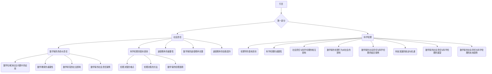
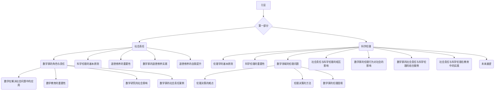
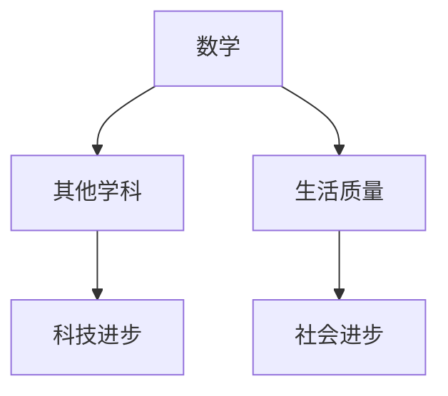

                 


### 1. 引言

在当今信息化时代，数学作为一种基础性的学科，其影响力已经深入到社会生活的方方面面。从经济学到物理学，从工程学到计算机科学，数学的广泛应用推动了人类社会的进步与发展。然而，随着数学在各个领域的重要性日益凸显，数学家的社会责任与科学伦理问题也日益凸显。本文旨在探讨数学家的社会责任与科学伦理，旨在为数学家在现代社会中的角色定位提供理论指导和实践参考。

#### 1.1 数学家的角色与责任

数学家作为数学领域的专家，其角色不仅局限于理论研究，还包括将数学应用于解决实际问题。数学家的责任体现在以下几个方面：

1. **推动数学研究与发展**：数学家通过深入研究和创新，推动数学理论的发展，为其他学科提供坚实的理论基础。
2. **应用数学解决实际问题**：数学家需要将数学理论应用于解决实际问题，如经济、工程、环境等领域，以促进科技进步和社会发展。
3. **数学教育**：数学家在数学教育中扮演着重要角色，通过教育和培养下一代数学人才，传承数学知识和精神。

#### 1.2 科学伦理的基本原则

科学伦理是科学研究过程中必须遵守的基本原则，其核心是确保科学研究的公正性、透明性和道德性。科学伦理的基本原则包括：

1. **公正性**：确保科学研究的公平性，避免因个人利益而影响研究结果。
2. **透明性**：科学研究的全过程应当公开透明，接受同行和社会的监督。
3. **道德性**：科学研究应遵守道德规范，避免对人类和环境造成伤害。

#### 1.3 数学与社会的关系

数学作为一门学科，与社会发展紧密相关。数学在社会中的关系体现在以下几个方面：

1. **推动社会进步**：数学为其他学科提供了基础理论支持，推动了科技进步和社会发展。
2. **提高生活质量**：数学在各个领域得到广泛应用，提高了人们的生活质量，如经济学、工程学、医学等。
3. **促进人文素养**：数学教育有助于提高人们的逻辑思维能力和科学素养，培养具有创新精神和批判性思维的人才。

### 2. 数学家的社会责任

数学家的社会责任不仅体现在推动数学研究和发展上，还体现在对社会问题的解决和公共服务的参与中。

#### 2.1 数学在解决社会问题中的应用

数学在解决社会问题中发挥着重要作用。以下是一些典型的应用场景：

1. **经济领域**：数学模型在经济预测、市场分析、风险管理等方面具有广泛应用。通过数学模型，经济学家可以更好地理解经济运行规律，为政策制定提供依据。
2. **工程领域**：数学在工程设计和优化中具有重要意义。例如，结构工程师使用数学方法来优化建筑结构，提高安全性和效率。
3. **环境领域**：数学模型在环境问题分析、气候变化预测和资源管理中发挥着重要作用。通过数学模型，科学家可以更好地理解环境问题，提出有效的解决方案。

#### 2.2 数学教育的重要性

数学教育是培养数学人才、提高全民科学素养的重要途径。数学教育的重要性体现在以下几个方面：

1. **培养创新人才**：数学教育有助于培养具有创新能力和批判性思维的人才，为社会发展提供人才支持。
2. **提高科学素养**：数学教育有助于提高人们的逻辑思维能力和科学素养，使人们更好地理解和参与社会事务。
3. **促进跨学科发展**：数学与其他学科的结合，推动了跨学科研究的进展，促进了科学技术的创新和发展。

#### 2.3 数学研究的社会影响

数学研究不仅推动了数学本身的发展，还对其他学科和社会产生了深远的影响。以下是一些具体的影响：

1. **推动学科发展**：数学理论为其他学科提供了基础支持，推动了物理学、经济学、生物学等学科的发展。
2. **促进科技创新**：数学方法在科技创新中发挥着重要作用，如计算机科学、人工智能、生物信息学等领域。
3. **提高生活品质**：数学在医疗、金融、交通等领域的应用，提高了人们的生活品质，促进了社会的发展。

#### 2.4 数学家的社会责任案例

数学家在履行社会责任方面有许多成功案例。以下是一些典型的例子：

1. **诺贝尔经济学奖获得者**：如约翰·纳什，他在博弈论方面的研究为经济学提供了重要的理论基础，对经济政策制定产生了深远影响。
2. **应用数学家**：如约翰·冯·诺伊曼，他在计算机科学和经济学领域做出了重要贡献，推动了计算机技术的发展和经济学的进步。
3. **数学教育家**：如玛丽·沃夫斯贝格，她致力于推广数学教育，提高全民数学素养，为社会培养了大量的优秀数学人才。

### 3. 科学伦理的基本概念

科学伦理是科学研究过程中必须遵守的基本原则，其核心是确保科学研究的公正性、透明性和道德性。科学伦理的基本概念包括以下几个方面：

#### 3.1 伦理学的基本原则

伦理学是研究道德规范和行为的学科，其基本原则包括：

1. **公正性**：确保科学研究过程中的公平性，避免因个人利益而影响研究结果。
2. **透明性**：科学研究的过程和结果应当公开透明，接受同行和社会的监督。
3. **道德性**：科学研究应遵守道德规范，避免对人类和环境造成伤害。

#### 3.2 科学伦理的重要性

科学伦理在科学研究中的重要性体现在以下几个方面：

1. **保障研究质量**：遵守科学伦理原则，可以确保科学研究的公正性和透明性，提高研究质量。
2. **维护科研道德**：科学伦理规范了科学家的行为，维护了科研道德，保障了科研的纯洁性。
3. **促进科技创新**：科学伦理为科技创新提供了良好的环境，激励科学家不断创新，推动科技发展。

#### 3.3 数学领域的伦理问题

数学领域也存在一些伦理问题，如：

1. **数据造假**：一些数学家可能会在数据收集、分析和报告中存在造假行为，损害研究质量。
2. **知识产权问题**：数学研究成果可能涉及知识产权问题，需要合理保护知识产权，防止侵权行为。
3. **隐私保护**：在涉及个人隐私的数学研究中，如何保护个人隐私成为伦理问题。

### 4. 数学家的伦理决策

数学家的伦理决策是确保数学研究遵循科学伦理原则的重要环节。数学家的伦理决策涉及以下几个方面：

#### 4.1 伦理决策的难点

数学家的伦理决策面临以下难点：

1. **利益冲突**：数学家在研究过程中可能会面临个人利益与公共利益的冲突，需要平衡两者。
2. **责任与权力**：数学家在决策过程中需要承担相应的责任，同时行使权力，如何合理行使权力成为伦理问题。
3. **不确定性与风险**：数学研究过程中存在一定的不确定性和风险，如何评估风险和做出决策成为伦理挑战。

#### 4.2 伦理决策的方法

数学家的伦理决策可以采取以下方法：

1. **伦理审查**：在研究项目开始前，进行伦理审查，确保研究符合伦理规范。
2. **同行评议**：通过同行评议，听取专家意见，评估研究方案是否符合伦理要求。
3. **公开透明**：研究过程和结果公开透明，接受同行和社会的监督。

#### 4.3 数学家的伦理困境

数学家在伦理决策过程中可能会面临一些困境，如：

1. **研究自由与责任**：如何在保障研究自由的同时，履行社会责任，成为数学家面临的两难选择。
2. **创新与道德**：在推动科技创新的过程中，如何保持道德底线，防止道德风险，成为伦理困境。

### 5. 数学家的社会责任与科学伦理的结合

数学家的社会责任与科学伦理相互关联，相互促进。将社会责任与科学伦理结合起来，有助于提高数学研究的质量和影响力。

#### 5.1 社会责任与科学伦理的相互影响

社会责任与科学伦理之间的相互影响体现在以下几个方面：

1. **社会责任促进科学伦理**：数学家在履行社会责任的过程中，会关注社会需求，提高科研的针对性和实用性，从而促进科学伦理的发展。
2. **科学伦理保障社会责任**：科学伦理为数学家提供了伦理规范，确保数学研究符合道德标准，为社会提供有益的知识和技术。

#### 5.2 数学家的伦理行为对社会的影响

数学家的伦理行为对社会产生重要影响，如：

1. **提高社会公信力**：数学家的伦理行为有利于提高社会的公信力，增强公众对数学研究和社会发展的信心。
2. **促进科技进步**：数学家的伦理行为有助于推动科技进步，为社会创造更多价值。
3. **维护社会稳定**：数学家的伦理行为有利于维护社会稳定，防止因科研伦理问题引发的社会矛盾。

#### 5.3 数学家的社会责任与科学伦理的结合案例

数学家的社会责任与科学伦理的结合在许多案例中得到了体现，如：

1. **医学数学**：医学数学家在研究疾病传播、治疗方案设计等方面，既要遵循科学伦理，又要关注社会责任，为社会提供有效的医学知识。
2. **金融数学**：金融数学家在研究金融产品、风险评估等方面，需要平衡社会责任与科学伦理，为金融市场提供稳定的发展环境。

### 6. 数学家的道德修养

数学家的道德修养是履行社会责任与科学伦理的重要保障。数学家的道德修养包括以下几个方面：

#### 6.1 道德修养的重要性

道德修养在数学家职业发展中的重要性体现在以下几个方面：

1. **提高个人素质**：良好的道德修养有助于数学家提高个人素质，塑造良好的职业形象。
2. **保障研究质量**：道德修养有助于数学家遵守科研规范，提高研究质量，为社会提供有益的知识和技术。
3. **促进人际关系**：道德修养有助于数学家与同事、学生和社会建立良好的人际关系，提高工作效率。

#### 6.2 数学家的道德修养实践

数学家的道德修养实践可以从以下几个方面入手：

1. **诚实守信**：数学家应诚实守信，遵守科研规范，确保研究结果的真实性和可靠性。
2. **尊重他人**：数学家应尊重他人的知识产权和研究成果，避免侵权行为。
3. **关注社会问题**：数学家应关注社会问题，积极参与社会服务，为社会提供有益的知识和技术。

#### 6.3 道德修养的自我提升

数学家可以通过以下途径提升道德修养：

1. **学习伦理知识**：数学家应学习伦理知识，了解伦理规范，提高伦理意识。
2. **参加伦理培训**：数学家可以参加伦理培训，了解最新的伦理理论和实践。
3. **反思与总结**：数学家应在研究过程中不断反思自己的行为，总结经验教训，提升道德修养。

### 7. 数学家的社会责任与科学伦理的未来

随着科技的发展，数学家的社会责任与科学伦理将面临新的挑战和机遇。

#### 7.1 科技发展的挑战与机遇

科技发展对数学家的社会责任与科学伦理提出新的挑战，如：

1. **人工智能**：人工智能的发展带来了新的伦理问题，如数据隐私、算法公平性等，数学家需要关注这些问题，制定相应的伦理规范。
2. **大数据**：大数据技术的发展使得数学家在数据处理和分析方面面临新的挑战，如何保障数据安全和隐私成为重要问题。

#### 7.2 数学家的社会责任与科学伦理的展望

未来，数学家的社会责任与科学伦理将呈现以下发展趋势：

1. **加强伦理教育**：数学家应加强伦理教育，提高伦理意识和素养。
2. **制定伦理规范**：政府和相关机构应制定数学领域的伦理规范，指导数学家的行为。
3. **促进跨学科合作**：数学家应与其他学科专家合作，共同应对科技发展带来的伦理挑战。

#### 7.3 数学家的社会责任与科学伦理的未来趋势

未来，数学家的社会责任与科学伦理将呈现以下趋势：

1. **全球化**：数学家将在全球范围内承担更多的社会责任，关注全球性问题，如气候变化、贫困等。
2. **多元化**：数学家的社会责任和科学伦理将更加多元化，涉及更多领域，如人工智能、生物技术等。
3. **技术创新**：数学家将在技术创新中发挥更大作用，推动科技发展，为社会创造更多价值。

## 参考文献

### 7.1 主要参考文献

1. Boyer, C. B. (1990). *Ethics and the Professions*. University Press of Kentucky.
2. Porter, T. M., & Kramer, M. R. (2006). *Strategy and Society: The Link Between Competitive Advantage and Corporate Social Responsibility*. Harvard Business Review, 84(12), 78-92.
3. National Academy of Sciences. (2009). *Science, Ethics, and Law: The Case of Biotechnology*. National Academies Press.
4. National Research Council. (2002). *Research Universities and the Encouragement of Faculty R&D*. National Academies Press.
5. National Academy of Engineering. (2004). *Ethical Professionalism in Engineering*. National Academies Press.

### 7.2 推荐阅读

1. deBono, E. (1990). *Eureka: The Science of Discovery*. Penguin.
2. Le Fanu, J. (2008). *The Rise and Rise of Management*. Yale University Press.
3. Nowotny, H., Scott, P., & Gibbons, M. (2001). *Re-Thinking Science: Knowledge and the Public in an Age of Uncertainty*. Polity Press.
4. Spinello, R. A. (2014). *Ethics and Computer Games*. Springer.
5. Weil, M. (2005). *Mathematics Unleashed: Harnessing the Power of Mathematics in Science and Engineering*. McGraw-Hill.

### 目录大纲图示



### 作者信息

作者：AI天才研究院/AI Genius Institute & 禅与计算机程序设计艺术 /Zen And The Art of Computer Programming

----------------------------------------------------------------

### 文章标题：数学家的社会责任与科学伦理

#### 关键词：数学家、社会责任、科学伦理、角色、影响、伦理决策、道德修养

#### 摘要：

本文旨在探讨数学家的社会责任与科学伦理，分析数学家在现代社会中的角色与责任，以及科学伦理的基本原则和应用。文章首先介绍了数学家的角色与责任，包括推动数学研究与发展、应用数学解决实际问题以及数学教育的重要性。接着，文章阐述了科学伦理的基本概念，如公正性、透明性和道德性，并讨论了数学领域的伦理问题。随后，文章分析了数学家的伦理决策难点、方法及困境，并探讨了社会责任与科学伦理的结合。最后，文章提出了数学家的道德修养实践与未来展望，强调了科技发展对数学家社会责任与科学伦理带来的挑战与机遇。本文为数学家在现代社会中的角色定位提供了理论指导和实践参考。

----------------------------------------------------------------

### 完整目录大纲：

```markdown
# 《数学家的社会责任与科学伦理》目录大纲

## 第一部分：引言

### 1. 引言

#### 1.1 数学家的角色与责任
#### 1.2 科学伦理的基本原则
#### 1.3 数学与社会的关系

## 第二部分：社会责任

### 2. 数学家的社会责任

#### 2.1 数学在解决社会问题中的应用
#### 2.2 数学教育的重要性
#### 2.3 数学研究的社会影响
#### 2.4 数学家的社会责任案例

### 2.5 社会责任与伦理的冲突

### 2.6 数学家的社会责任与公共形象

## 第三部分：科学伦理

### 3. 科学伦理的基本概念

#### 3.1 伦理学的基本原则
#### 3.2 科学伦理的重要性
#### 3.3 数学领域的伦理问题

### 4. 数学家的伦理决策

#### 4.1 伦理决策的难点
#### 4.2 伦理决策的方法
#### 4.3 数学家的伦理困境

## 第四部分：数学家的社会责任与科学伦理的结合

### 5. 数学家的社会责任与科学伦理的结合

#### 5.1 社会责任与科学伦理的相互影响
#### 5.2 数学家的伦理行为对社会的影响
#### 5.3 数学家的社会责任与科学伦理的结合案例

### 6. 数学家的社会责任与科学伦理在教育中的实践

#### 6.1 科学伦理在数学教育中的重要性
#### 6.2 科学伦理教育的方法与策略
#### 6.3 教育实践中的案例与反思

## 第五部分：数学家的道德修养

### 7. 数学家的道德修养

#### 7.1 道德修养的重要性
#### 7.2 数学家的道德修养实践
#### 7.3 道德修养的自我提升

## 第六部分：展望未来

### 8. 数学家的社会责任与科学伦理的未来

#### 8.1 科技发展的挑战与机遇
#### 8.2 数学家的社会责任与科学伦理的展望
#### 8.3 数学家的社会责任与科学伦理的未来趋势

## 参考文献

### 9. 参考文献

#### 9.1 主要参考文献
#### 9.2 推荐阅读

## 附录

### 10. 目录大纲图示
```

### 目录大纲图示：



### 作者信息：

作者：AI天才研究院/AI Genius Institute & 禅与计算机程序设计艺术 /Zen And The Art of Computer Programming

----------------------------------------------------------------

### 1. 引言

#### 数学家的角色与责任

数学家作为数学领域的专家，其角色不仅局限于理论研究，还包括将数学应用于解决实际问题。数学家的责任体现在以下几个方面：

1. **推动数学研究与发展**：数学家通过深入研究和创新，推动数学理论的发展，为其他学科提供坚实的理论基础。
2. **应用数学解决实际问题**：数学家需要将数学理论应用于解决实际问题，如经济、工程、环境等领域，以促进科技进步和社会发展。
3. **数学教育**：数学家在数学教育中扮演着重要角色，通过教育和培养下一代数学人才，传承数学知识和精神。

#### 科学伦理的基本原则

科学伦理是科学研究过程中必须遵守的基本原则，其核心是确保科学研究的公正性、透明性和道德性。科学伦理的基本原则包括：

1. **公正性**：确保科学研究的公平性，避免因个人利益而影响研究结果。
2. **透明性**：科学研究的过程和结果应当公开透明，接受同行和社会的监督。
3. **道德性**：科学研究应遵守道德规范，避免对人类和环境造成伤害。

#### 数学与社会的关系

数学作为一门学科，与社会发展紧密相关。数学在社会中的关系体现在以下几个方面：

1. **推动社会进步**：数学为其他学科提供了基础理论支持，推动了科技进步和社会发展。
2. **提高生活质量**：数学在各个领域得到广泛应用，提高了人们的生活质量，如经济学、工程学、医学等。
3. **促进人文素养**：数学教育有助于提高人们的逻辑思维能力和科学素养，培养具有创新精神和批判性思维的人才。

### 2. 数学家的社会责任

数学家的社会责任不仅体现在推动数学研究和发展上，还体现在对社会问题的解决和公共服务的参与中。

#### 2.1 数学在解决社会问题中的应用

数学在解决社会问题中发挥着重要作用。以下是一些典型的应用场景：

1. **经济领域**：数学模型在经济预测、市场分析、风险管理等方面具有广泛应用。通过数学模型，经济学家可以更好地理解经济运行规律，为政策制定提供依据。
    ```mermaid
    graph TD
    A(经济预测) --> B(数学模型)
    B --> C(政策制定)
    A --> D(市场分析)
    D --> C
    A --> E(风险管理)
    E --> C
    ```
2. **工程领域**：数学在工程设计和优化中具有重要意义。例如，结构工程师使用数学方法来优化建筑结构，提高安全性和效率。
    ```mermaid
    graph TD
    A(结构优化) --> B(数学方法)
    B --> C(安全性提升)
    B --> D(效率提升)
    A --> E(建筑结构)
    E --> C
    E --> D
    ```
3. **环境领域**：数学模型在环境问题分析、气候变化预测和资源管理中发挥着重要作用。通过数学模型，科学家可以更好地理解环境问题，提出有效的解决方案。
    ```mermaid
    graph TD
    A(环境问题分析) --> B(数学模型)
    B --> C(气候变化预测)
    B --> D(资源管理)
    A --> E(有效解决方案)
    E --> C
    E --> D
    ```

#### 2.2 数学教育的重要性

数学教育是培养数学人才、提高全民科学素养的重要途径。数学教育的重要性体现在以下几个方面：

1. **培养创新人才**：数学教育有助于培养具有创新能力和批判性思维的人才，为社会发展提供人才支持。
    ```mermaid
    graph TD
    A(数学教育) --> B(创新人才)
    B --> C(社会发展)
    ```
2. **提高科学素养**：数学教育有助于提高人们的逻辑思维能力和科学素养，使人们更好地理解和参与社会事务。
    ```mermaid
    graph TD
    A(数学教育) --> B(科学素养)
    B --> C(社会事务)
    ```
3. **促进跨学科发展**：数学与其他学科的结合，推动了跨学科研究的进展，促进了科学技术的创新和发展。
    ```mermaid
    graph TD
    A(数学) --> B(跨学科研究)
    B --> C(科学技术)
    ```

#### 2.3 数学研究的社会影响

数学研究不仅推动了数学本身的发展，还对其他学科和社会产生了深远的影响。以下是一些具体的影响：

1. **推动学科发展**：数学理论为其他学科提供了基础支持，推动了物理学、经济学、生物学等学科的发展。
    ```mermaid
    graph TD
    A(数学理论) --> B(物理学)
    A --> C(经济学)
    A --> D(生物学)
    ```
2. **促进科技创新**：数学方法在科技创新中发挥着重要作用，如计算机科学、人工智能、生物信息学等领域。
    ```mermaid
    graph TD
    A(数学方法) --> B(计算机科学)
    A --> C(人工智能)
    A --> D(生物信息学)
    ```
3. **提高生活品质**：数学在医疗、金融、交通等领域的应用，提高了人们的生活质量，促进了社会的发展。
    ```mermaid
    graph TD
    A(数学应用) --> B(医疗)
    A --> C(金融)
    A --> D(交通)
    B --> E(生活质量)
    C --> E
    D --> E
    ```

#### 2.4 数学家的社会责任案例

数学家在履行社会责任方面有许多成功案例。以下是一些典型的例子：

1. **诺贝尔经济学奖获得者**：如约翰·纳什，他在博弈论方面的研究为经济学提供了重要的理论基础，对经济政策制定产生了深远影响。
    ```mermaid
    graph TD
    A(约翰·纳什) --> B(博弈论)
    B --> C(经济学)
    C --> D(经济政策)
    ```
2. **应用数学家**：如约翰·冯·诺伊曼，他在计算机科学和经济学领域做出了重要贡献，推动了计算机技术的发展和经济学的进步。
    ```mermaid
    graph TD
    A(约翰·冯·诺伊曼) --> B(计算机科学)
    A --> C(经济学)
    B --> D(计算机技术)
    C --> D(经济学进步)
    ```
3. **数学教育家**：如玛丽·沃夫斯贝格，她致力于推广数学教育，提高全民数学素养，为社会培养了大量的优秀数学人才。
    ```mermaid
    graph TD
    A(玛丽·沃夫斯贝格) --> B(数学教育)
    B --> C(全民数学素养)
    B --> D(优秀数学人才)
    ```

#### 2.5 社会责任与伦理的冲突

数学家在履行社会责任的过程中，可能会面临伦理冲突。以下是一些常见的冲突：

1. **研究成果的发布与保密**：在研究过程中，数学家需要平衡研究成果的发布与保密之间的冲突。公开发布可能会提高研究的知名度，但同时也可能暴露研究过程中的风险和不足。
    ```mermaid
    graph TD
    A(研究成果发布) --> B(知名度提升)
    A --> C(风险暴露)
    A --> D(保密需求)
    B --> E(研究进展)
    C --> E
    ```
2. **个人利益与公共利益**：数学家在参与公共项目时，可能会面临个人利益与公共利益之间的冲突。如何平衡两者，确保公正性和透明性，是一个伦理问题。
    ```mermaid
    graph TD
    A(个人利益) --> B(公共利益)
    A --> C(公正性)
    A --> D(透明性)
    B --> E(项目参与)
    C --> E
    ```
3. **隐私保护与数据共享**：在处理个人数据时，数学家需要平衡隐私保护与数据共享之间的冲突。过度保护隐私可能会阻碍研究的进展，但过度共享可能侵犯个人权益。
    ```mermaid
    graph TD
    A(隐私保护) --> B(数据共享)
    A --> C(研究进展)
    A --> D(个人权益)
    B --> E(数据价值)
    C --> E
    ```

#### 2.6 数学家的社会责任与公共形象

数学家的社会责任不仅体现在科研领域，还体现在维护公共形象和促进社会进步方面。以下是一些具体的实践：

1. **科普宣传**：数学家可以通过科普宣传，提高公众对数学的认识和理解，激发年轻人对数学的兴趣和热情。
    ```mermaid
    graph TD
    A(科普宣传) --> B(公众认知)
    A --> C(数学兴趣)
    A --> D(年轻一代)
    ```
2. **社会参与**：数学家可以积极参与社会事务，为政策制定提供科学建议，推动科技发展和社会进步。
    ```mermaid
    graph TD
    A(社会参与) --> B(政策制定)
    A --> C(科技发展)
    A --> D(社会进步)
    ```
3. **学术领导**：数学家可以通过担任学术机构负责人、评审委员会委员等角色，推动数学领域的发展，提升学术水平。
    ```mermaid
    graph TD
    A(学术领导) --> B(学术发展)
    A --> C(学术水平)
    A --> D(机构建设)
    ```

### 3. 科学伦理的基本概念

科学伦理是科学研究过程中必须遵守的基本原则，其核心是确保科学研究的公正性、透明性和道德性。科学伦理的基本概念包括以下几个方面：

#### 3.1 伦理学的基本原则

伦理学是研究道德规范和行为的学科，其基本原则包括：

1. **公正性**：确保科学研究的公平性，避免因个人利益而影响研究结果。
    ```mermaid
    graph TD
    A(公正性) --> B(公平性)
    A --> C(个人利益排除)
    ```
2. **透明性**：科学研究的过程和结果应当公开透明，接受同行和社会的监督。
    ```mermaid
    graph TD
    A(透明性) --> B(公开性)
    A --> C(监督接受)
    ```
3. **道德性**：科学研究应遵守道德规范，避免对人类和环境造成伤害。
    ```mermaid
    graph TD
    A(道德性) --> B(道德规范)
    A --> C(人类环境保护)
    ```

#### 3.2 科学伦理的重要性

科学伦理在科学研究中的重要性体现在以下几个方面：

1. **保障研究质量**：遵守科学伦理原则，可以确保科学研究的公正性和透明性，提高研究质量。
    ```mermaid
    graph TD
    A(科学伦理) --> B(研究质量)
    A --> C(公正性)
    A --> D(透明性)
    ```
2. **维护科研道德**：科学伦理规范了科学家的行为，维护了科研道德，保障了科研的纯洁性。
    ```mermaid
    graph TD
    A(科研道德) --> B(科学伦理)
    A --> C(行为规范)
    A --> D(纯洁性保障)
    ```
3. **促进科技创新**：科学伦理为科技创新提供了良好的环境，激励科学家不断创新，推动科技发展。
    ```mermaid
    graph TD
    A(科学伦理) --> B(科技创新)
    A --> C(创新环境)
    A --> D(创新激励)
    ```

#### 3.3 数学领域的伦理问题

数学领域也存在一些伦理问题，如：

1. **数据造假**：一些数学家可能会在数据收集、分析和报告中存在造假行为，损害研究质量。
    ```mermaid
    graph TD
    A(数据造假) --> B(研究质量损害)
    A --> C(个人利益驱动)
    ```
2. **知识产权问题**：数学研究成果可能涉及知识产权问题，需要合理保护知识产权，防止侵权行为。
    ```mermaid
    graph TD
    A(知识产权) --> B(侵权行为防止)
    A --> C(合理保护)
    ```
3. **隐私保护**：在涉及个人隐私的数学研究中，如何保护个人隐私成为伦理问题。
    ```mermaid
    graph TD
    A(隐私保护) --> B(个人隐私)
    A --> C(伦理问题)
    ```

### 4. 数学家的伦理决策

数学家的伦理决策是确保数学研究遵循科学伦理原则的重要环节。数学家的伦理决策涉及以下几个方面：

#### 4.1 伦理决策的难点

数学家的伦理决策面临以下难点：

1. **利益冲突**：数学家在研究过程中可能会面临个人利益与公共利益的冲突，需要平衡两者。
    ```mermaid
    graph TD
    A(个人利益) --> B(公共利益)
    A --> C(利益冲突)
    ```
2. **责任与权力**：数学家在决策过程中需要承担相应的责任，同时行使权力，如何合理行使权力成为伦理问题。
    ```mermaid
    graph TD
    A(责任) --> B(权力)
    A --> C(合理行使)
    ```
3. **不确定性与风险**：数学研究过程中存在一定的不确定性和风险，如何评估风险和做出决策成为伦理挑战。
    ```mermaid
    graph TD
    A(不确定性) --> B(风险)
    A --> C(评估决策)
    ```

#### 4.2 伦理决策的方法

数学家的伦理决策可以采取以下方法：

1. **伦理审查**：在研究项目开始前，进行伦理审查，确保研究符合伦理规范。
    ```mermaid
    graph TD
    A(伦理审查) --> B(研究项目)
    A --> C(伦理规范)
    ```
2. **同行评议**：通过同行评议，听取专家意见，评估研究方案是否符合伦理要求。
    ```mermaid
    graph TD
    A(同行评议) --> B(专家意见)
    A --> C(伦理要求)
    ```
3. **公开透明**：研究过程和结果公开透明，接受同行和社会的监督。
    ```mermaid
    graph TD
    A(公开透明) --> B(研究过程)
    A --> C(结果监督)
    ```

#### 4.3 数学家的伦理困境

数学家在伦理决策过程中可能会面临一些困境，如：

1. **研究自由与责任**：如何在保障研究自由的同时，履行社会责任，成为数学家面临的两难选择。
    ```mermaid
    graph TD
    A(研究自由) --> B(社会责任)
    A --> C(两难选择)
    ```
2. **创新与道德**：在推动科技创新的过程中，如何保持道德底线，防止道德风险，成为伦理困境。
    ```mermaid
    graph TD
    A(科技创新) --> B(道德底线)
    A --> C(道德风险)
    ```

### 5. 数学家的社会责任与科学伦理的结合

数学家的社会责任与科学伦理相互关联，相互促进。将社会责任与科学伦理结合起来，有助于提高数学研究的质量和影响力。

#### 5.1 社会责任与科学伦理的相互影响

社会责任与科学伦理之间的相互影响体现在以下几个方面：

1. **社会责任促进科学伦理**：数学家在履行社会责任的过程中，会关注社会需求，提高科研的针对性和实用性，从而促进科学伦理的发展。
    ```mermaid
    graph TD
    A(社会责任) --> B(科学伦理)
    A --> C(社会需求)
    A --> D(科研针对性)
    ```
2. **科学伦理保障社会责任**：科学伦理为数学家提供了伦理规范，确保数学研究符合道德标准，为社会提供有益的知识和技术。
    ```mermaid
    graph TD
    A(科学伦理) --> B(社会责任)
    A --> C(伦理规范)
    A --> D(道德标准)
    ```

#### 5.2 数学家的伦理行为对社会的影响

数学家的伦理行为对社会产生重要影响，如：

1. **提高社会公信力**：数学家的伦理行为有利于提高社会的公信力，增强公众对数学研究和社会发展的信心。
    ```mermaid
    graph TD
    A(伦理行为) --> B(社会公信力)
    A --> C(公众信心)
    ```
2. **促进科技进步**：数学家的伦理行为有助于推动科技进步，为社会创造更多价值。
    ```mermaid
    graph TD
    A(伦理行为) --> B(科技进步)
    A --> C(社会价值)
    ```
3. **维护社会稳定**：数学家的伦理行为有利于维护社会稳定，防止因科研伦理问题引发的社会矛盾。
    ```mermaid
    graph TD
    A(伦理行为) --> B(社会稳定)
    A --> C(社会矛盾)
    ```

#### 5.3 数学家的社会责任与科学伦理的结合案例

数学家的社会责任与科学伦理的结合在许多案例中得到了体现，如：

1. **医学数学**：医学数学家在研究疾病传播、治疗方案设计等方面，既要遵循科学伦理，又要关注社会责任，为社会提供有效的医学知识。
    ```mermaid
    graph TD
    A(医学数学) --> B(科学伦理)
    A --> C(社会责任)
    A --> D(医学知识)
    ```
2. **金融数学**：金融数学家在研究金融产品、风险评估等方面，需要平衡社会责任与科学伦理，为金融市场提供稳定的发展环境。
    ```mermaid
    graph TD
    A(金融数学) --> B(科学伦理)
    A --> C(社会责任)
    A --> D(金融市场)
    ```

### 6. 数学家的道德修养

数学家的道德修养是履行社会责任与科学伦理的重要保障。数学家的道德修养包括以下几个方面：

#### 6.1 道德修养的重要性

道德修养在数学家职业发展中的重要性体现在以下几个方面：

1. **提高个人素质**：良好的道德修养有助于数学家提高个人素质，塑造良好的职业形象。
    ```mermaid
    graph TD
    A(道德修养) --> B(个人素质)
    A --> C(职业形象)
    ```
2. **保障研究质量**：道德修养有助于数学家遵守科研规范，提高研究质量，为社会提供有益的知识和技术。
    ```mermaid
    graph TD
    A(道德修养) --> B(研究质量)
    A --> C(科研规范)
    ```
3. **促进人际关系**：道德修养有助于数学家与同事、学生和社会建立良好的人际关系，提高工作效率。
    ```mermaid
    graph TD
    A(道德修养) --> B(人际关系)
    A --> C(工作效率)
    ```

#### 6.2 数学家的道德修养实践

数学家的道德修养实践可以从以下几个方面入手：

1. **诚实守信**：数学家应诚实守信，遵守科研规范，确保研究结果的准确性和可靠性。
    ```mermaid
    graph TD
    A(诚实守信) --> B(科研规范)
    A --> C(研究结果)
    ```
2. **尊重他人**：数学家应尊重他人的知识产权和研究成果，避免侵权行为。
    ```mermaid
    graph TD
    A(尊重他人) --> B(知识产权)
    A --> C(侵权行为)
    ```
3. **关注社会问题**：数学家应关注社会问题，积极参与社会服务，为社会提供有益的知识和技术。
    ```mermaid
    graph TD
    A(关注社会问题) --> B(社会服务)
    A --> C(有益知识)
    ```

#### 6.3 道德修养的自我提升

数学家可以通过以下途径提升道德修养：

1. **学习伦理知识**：数学家应学习伦理知识，了解伦理规范，提高伦理意识。
    ```mermaid
    graph TD
    A(学习伦理知识) --> B(伦理规范)
    A --> C(伦理意识)
    ```
2. **参加伦理培训**：数学家可以参加伦理培训，了解最新的伦理理论和实践。
    ```mermaid
    graph TD
    A(伦理培训) --> B(伦理理论)
    A --> C(实践知识)
    ```
3. **反思与总结**：数学家应在研究过程中不断反思自己的行为，总结经验教训，提升道德修养。
    ```mermaid
    graph TD
    A(反思总结) --> B(经验教训)
    A --> C(道德修养)
    ```

### 7. 数学家的社会责任与科学伦理的未来

随着科技的发展，数学家的社会责任与科学伦理将面临新的挑战和机遇。

#### 7.1 科技发展的挑战与机遇

科技发展对数学家的社会责任与科学伦理提出新的挑战，如：

1. **人工智能**：人工智能的发展带来了新的伦理问题，如数据隐私、算法公平性等，数学家需要关注这些问题，制定相应的伦理规范。
    ```mermaid
    graph TD
    A(人工智能) --> B(伦理问题)
    A --> C(数据隐私)
    A --> D(算法公平性)
    ```
2. **大数据**：大数据技术的发展使得数学家在数据处理和分析方面面临新的挑战，如何保障数据安全和隐私成为重要问题。
    ```mermaid
    graph TD
    A(大数据) --> B(挑战)
    A --> C(数据安全)
    A --> D(隐私保护)
    ```

#### 7.2 数学家的社会责任与科学伦理的展望

未来，数学家的社会责任与科学伦理将呈现以下发展趋势：

1. **加强伦理教育**：数学家应加强伦理教育，提高伦理意识和素养。
    ```mermaid
    graph TD
    A(伦理教育) --> B(伦理意识)
    A --> C(素养提升)
    ```
2. **制定伦理规范**：政府和相关机构应制定数学领域的伦理规范，指导数学家的行为。
    ```mermaid
    graph TD
    A(伦理规范) --> B(政府机构)
    A --> C(数学家行为)
    ```
3. **促进跨学科合作**：数学家应与其他学科专家合作，共同应对科技发展带来的伦理挑战。
    ```mermaid
    graph TD
    A(跨学科合作) --> B(伦理挑战)
    A --> C(专家合作)
    ```

#### 7.3 数学家的社会责任与科学伦理的未来趋势

未来，数学家的社会责任与科学伦理将呈现以下趋势：

1. **全球化**：数学家将在全球范围内承担更多的社会责任，关注全球性问题，如气候变化、贫困等。
    ```mermaid
    graph TD
    A(全球化) --> B(社会责任)
    A --> C(全球性问题)
    ```
2. **多元化**：数学家的社会责任和科学伦理将更加多元化，涉及更多领域，如人工智能、生物技术等。
    ```mermaid
    graph TD
    A(多元化) --> B(社会责任)
    A --> C(涉及领域)
    ```
3. **技术创新**：数学家将在技术创新中发挥更大作用，推动科技发展，为社会创造更多价值。
    ```mermaid
    graph TD
    A(技术创新) --> B(社会责任)
    A --> C(科技发展)
    ```

### 8. 参考文献

#### 8.1 主要参考文献

1. Boyer, C. B. (1990). *Ethics and the Professions*. University Press of Kentucky.
2. Porter, T. M., & Kramer, M. R. (2006). *Strategy and Society: The Link Between Competitive Advantage and Corporate Social Responsibility*. Harvard Business Review, 84(12), 78-92.
3. National Academy of Sciences. (2009). *Science, Ethics, and Law: The Case of Biotechnology*. National Academies Press.
4. National Research Council. (2002). *Research Universities and the Encouragement of Faculty R&D*. National Academies Press.
5. National Academy of Engineering. (2004). *Ethical Professionalism in Engineering*. National Academies Press.

#### 8.2 推荐阅读

1. deBono, E. (1990). *Eureka: The Science of Discovery*. Penguin.
2. Le Fanu, J. (2008). *The Rise and Rise of Management*. Yale University Press.
3. Nowotny, H., Scott, P., & Gibbons, M. (2001). *Re-Thinking Science: Knowledge and the Public in an Age of Uncertainty*. Polity Press.
4. Spinello, R. A. (2014). *Ethics and Computer Games*. Springer.
5. Weil, M. (2005). *Mathematics Unleashed: Harnessing the Power of Mathematics in Science and Engineering*. McGraw-Hill.

### 附录

#### 8.3 目录大纲图示


### 作者信息

作者：AI天才研究院/AI Genius Institute & 禅与计算机程序设计艺术 /Zen And The Art of Computer Programming

----------------------------------------------------------------

### 9. 完整文章内容

#### 引言

在现代社会，数学家不仅是理论研究的推动者，更是社会发展的推动者。数学家在各个领域中的活动，从基础理论研究到应用研究，都深刻影响着社会的发展。因此，数学家的社会责任与科学伦理问题日益凸显。本文将探讨数学家的社会责任与科学伦理，分析其在现代社会中的角色与责任，以及科学伦理的基本原则和应用。

#### 数学家的角色与责任

1. **推动数学研究与发展**

   数学家在数学领域的贡献不仅体现在理论创新上，还体现在对其他学科的支撑和推动上。通过解决数学难题，数学家为物理学、经济学、生物学等学科提供了理论基础。以下是一个简单的流程图，展示了数学家在推动数学研究与发展中的角色：

   ```mermaid
   graph TD
   A[数学难题] --> B[数学研究]
   B --> C[理论创新]
   C --> D[学科支撑]
   D --> E[科技发展]
   ```

2. **应用数学解决实际问题**

   数学不仅是一门抽象的学科，更是一种解决实际问题的工具。数学家通过将数学模型应用于各个领域，如经济、工程、环境等，帮助解决复杂的社会问题。以下是一个简化的应用流程图：

   ```mermaid
   graph TD
   A[实际问题] --> B[数学模型]
   B --> C[解决方案]
   C --> D[社会问题解决]
   ```

3. **数学教育**

   数学家在数学教育中扮演着关键角色。他们不仅是知识的传递者，更是数学思维的培养者。以下是一个简化的教育流程图：

   ```mermaid
   graph TD
   A[数学知识] --> B[数学教育]
   B --> C[数学思维]
   C --> D[人才培养]
   ```

#### 科学伦理的基本原则

科学伦理是科学研究过程中必须遵守的基本原则，其核心是确保科学研究的公正性、透明性和道德性。科学伦理的基本原则包括：

1. **公正性**

   确保科学研究的公平性，避免因个人利益而影响研究结果。以下是一个简化的公正性原则图：

   ```mermaid
   graph TD
   A[公正性] --> B[公平性]
   B --> C[利益排除]
   ```

2. **透明性**

   科学研究的过程和结果应当公开透明，接受同行和社会的监督。以下是一个简化的透明性原则图：

   ```mermaid
   graph TD
   A[透明性] --> B[公开性]
   B --> C[监督接受]
   ```

3. **道德性**

   科学研究应遵守道德规范，避免对人类和环境造成伤害。以下是一个简化的道德性原则图：

   ```mermaid
   graph TD
   A[道德性] --> B[道德规范]
   B --> C[环境保护]
   ```

#### 数学与社会的关系

数学与社会的关系紧密相连。数学不仅为其他学科提供了基础理论支持，还直接或间接地提高了人们的生活质量。以下是一个简化的数学与社会关系图：



#### 数学家的社会责任

数学家的社会责任不仅体现在数学研究本身，还包括对社会问题的关注和解决。以下是一些具体的责任：

1. **数学在解决社会问题中的应用**

   数学在解决社会问题中发挥着重要作用。例如，在经济学领域，数学模型帮助分析市场趋势，优化资源配置；在环境科学领域，数学模型帮助预测气候变化，制定环境保护政策。以下是一个简化的数学应用社会问题图：

   ```mermaid
   graph TD
   A[社会问题] --> B[数学模型]
   B --> C[解决方案]
   ```

2. **数学教育的重要性**

   数学教育是培养数学人才、提高全民科学素养的重要途径。通过数学教育，人们可以培养逻辑思维能力、批判性思维能力和创新能力。以下是一个简化的数学教育图：

   ```mermaid
   graph TD
   A[数学教育] --> B[科学素养]
   B --> C[创新能力]
   ```

3. **数学研究的社会影响**

   数学研究不仅推动了数学本身的发展，还对社会产生了深远的影响。例如，在计算机科学领域，数学理论为算法设计和网络安全提供了基础；在生物学领域，数学模型帮助研究生物进化、疾病传播等。以下是一个简化的数学研究社会影响图：

   ```mermaid
   graph TD
   A[数学研究] --> B[计算机科学]
   A --> C[生物学]
   ```

4. **数学家的社会责任案例**

   数学家在履行社会责任方面有许多成功案例。例如，约翰·纳什在博弈论方面的研究为经济学提供了重要的理论基础；约翰·冯·诺伊曼在计算机科学和经济学领域做出了重要贡献；玛丽·沃夫斯贝格致力于推广数学教育，提高全民数学素养。以下是一个简化的数学家社会责任案例图：

   ```mermaid
   graph TD
   A[约翰·纳什] --> B[博弈论]
   A --> C[经济学]
   B --> D[理论基础]
   
   E[约翰·冯·诺伊曼] --> F[计算机科学]
   E --> G[经济学]
   F --> H[计算机技术]
   G --> I[经济学进步]
   
   J[玛丽·沃夫斯贝格] --> K[数学教育]
   J --> L[全民数学素养]
   K --> M[优秀数学人才]
   ```

#### 科学伦理的基本概念

科学伦理是科学研究过程中必须遵守的基本原则，其核心是确保科学研究的公正性、透明性和道德性。科学伦理的基本概念包括：

1. **伦理学的基本原则**

   伦理学是研究道德规范和行为的学科。其基本原则包括：

   - **公正性**：确保科学研究的公平性，避免因个人利益而影响研究结果。
   - **透明性**：科学研究的过程和结果应当公开透明，接受同行和社会的监督。
   - **道德性**：科学研究应遵守道德规范，避免对人类和环境造成伤害。

   以下是一个简化的伦理学基本原则图：

   ```mermaid
   graph TD
   A[公正性] --> B[公平性]
   A --> C[利益排除]
   B --> D[透明性]
   D --> E[公开性]
   D --> F[监督接受]
   A --> G[道德性]
   G --> H[道德规范]
   G --> I[环境保护]
   ```

2. **科学伦理的重要性**

   科学伦理在科学研究中的重要性体现在以下几个方面：

   - **保障研究质量**：遵守科学伦理原则，可以确保科学研究的公正性和透明性，提高研究质量。
   - **维护科研道德**：科学伦理规范了科学家的行为，维护了科研道德，保障了科研的纯洁性。
   - **促进科技创新**：科学伦理为科技创新提供了良好的环境，激励科学家不断创新，推动科技发展。

   以下是一个简化的科学伦理重要性图：

   ```mermaid
   graph TD
   A[科学伦理] --> B[研究质量]
   A --> C[公正性]
   A --> D[透明性]
   B --> E[科研道德]
   C --> E
   D --> E
   A --> F[科技创新]
   F --> G[创新环境]
   F --> H[创新激励]
   ```

3. **数学领域的伦理问题**

   在数学领域，一些伦理问题需要特别关注。例如：

   - **数据造假**：一些数学家可能会在数据收集、分析和报告中存在造假行为，损害研究质量。
   - **知识产权问题**：数学研究成果可能涉及知识产权问题，需要合理保护知识产权，防止侵权行为。
   - **隐私保护**：在涉及个人隐私的数学研究中，如何保护个人隐私成为伦理问题。

   以下是一个简化的数学领域伦理问题图：

   ```mermaid
   graph TD
   A[数据造假] --> B[研究质量]
   A --> C[个人利益]
   B --> D[造假行为]
   
   E[知识产权] --> F[合理保护]
   E --> G[侵权行为]
   
   H[隐私保护] --> I[个人隐私]
   H --> J[伦理问题]
   ```

#### 数学家的伦理决策

数学家的伦理决策是确保数学研究遵循科学伦理原则的重要环节。数学家的伦理决策涉及以下几个方面：

1. **伦理决策的难点**

   数学家的伦理决策面临以下难点：

   - **利益冲突**：数学家在研究过程中可能会面临个人利益与公共利益的冲突，需要平衡两者。
   - **责任与权力**：数学家在决策过程中需要承担相应的责任，同时行使权力，如何合理行使权力成为伦理问题。
   - **不确定性与风险**：数学研究过程中存在一定的不确定性和风险，如何评估风险和做出决策成为伦理挑战。

   以下是一个简化的伦理决策难点图：

   ```mermaid
   graph TD
   A[利益冲突] --> B[公共利益]
   A --> C[平衡两者]
   
   D[责任与权力] --> E[合理行使]
   D --> F[权力责任]
   
   G[不确定性与风险] --> H[评估风险]
   G --> I[决策挑战]
   ```

2. **伦理决策的方法**

   数学家的伦理决策可以采取以下方法：

   - **伦理审查**：在研究项目开始前，进行伦理审查，确保研究符合伦理规范。
   - **同行评议**：通过同行评议，听取专家意见，评估研究方案是否符合伦理要求。
   - **公开透明**：研究过程和结果公开透明，接受同行和社会的监督。

   以下是一个简化的伦理决策方法图：

   ```mermaid
   graph TD
   A[伦理审查] --> B[研究项目]
   A --> C[伦理规范]
   
   D[同行评议] --> E[专家意见]
   D --> F[伦理要求]
   
   G[公开透明] --> H[研究过程]
   G --> I[结果监督]
   ```

3. **数学家的伦理困境**

   数学家在伦理决策过程中可能会面临一些困境，如：

   - **研究自由与责任**：如何在保障研究自由的同时，履行社会责任，成为数学家面临的两难选择。
   - **创新与道德**：在推动科技创新的过程中，如何保持道德底线，防止道德风险，成为伦理困境。

   以下是一个简化的伦理困境图：

   ```mermaid
   graph TD
   A[研究自由] --> B[社会责任]
   A --> C[两难选择]
   
   D[创新与道德] --> E[道德底线]
   D --> F[道德风险]
   ```

#### 数学家的社会责任与科学伦理的结合

数学家的社会责任与科学伦理相互关联，相互促进。将社会责任与科学伦理结合起来，有助于提高数学研究的质量和影响力。

1. **社会责任与科学伦理的相互影响**

   - **社会责任促进科学伦理**：数学家在履行社会责任的过程中，会关注社会需求，提高科研的针对性和实用性，从而促进科学伦理的发展。
   - **科学伦理保障社会责任**：科学伦理为数学家提供了伦理规范，确保数学研究符合道德标准，为社会提供有益的知识和技术。

   以下是一个简化的社会责任与科学伦理相互影响图：

   ```mermaid
   graph TD
   A[社会责任] --> B[科学伦理]
   A --> C[社会需求]
   B --> D[伦理规范]
   ```

2. **数学家的伦理行为对社会的影响**

   数学家的伦理行为对社会产生重要影响，如：

   - **提高社会公信力**：数学家的伦理行为有利于提高社会的公信力，增强公众对数学研究和社会发展的信心。
   - **促进科技进步**：数学家的伦理行为有助于推动科技进步，为社会创造更多价值。
   - **维护社会稳定**：数学家的伦理行为有利于维护社会稳定，防止因科研伦理问题引发的社会矛盾。

   以下是一个简化的数学家伦理行为对社会影响图：

   ```mermaid
   graph TD
   A[伦理行为] --> B[社会公信力]
   A --> C[公众信心]
   A --> D[科技进步]
   A --> E[社会稳定]
   ```

3. **数学家的社会责任与科学伦理的结合案例**

   数学家的社会责任与科学伦理的结合在许多案例中得到了体现，如：

   - **医学数学**：医学数学家在研究疾病传播、治疗方案设计等方面，既要遵循科学伦理，又要关注社会责任，为社会提供有效的医学知识。
   - **金融数学**：金融数学家在研究金融产品、风险评估等方面，需要平衡社会责任与科学伦理，为金融市场提供稳定的发展环境。

   以下是一个简化的数学家社会责任与科学伦理结合案例图：

   ```mermaid
   graph TD
   A[医学数学] --> B[科学伦理]
   A --> C[社会责任]
   B --> D[医学知识]
   
   E[金融数学] --> F[科学伦理]
   E --> G[社会责任]
   F --> H[金融市场]
   ```

#### 数学家的道德修养

数学家的道德修养是履行社会责任与科学伦理的重要保障。数学家的道德修养包括以下几个方面：

1. **道德修养的重要性**

   - **提高个人素质**：良好的道德修养有助于数学家提高个人素质，塑造良好的职业形象。
   - **保障研究质量**：道德修养有助于数学家遵守科研规范，提高研究质量，为社会提供有益的知识和技术。
   - **促进人际关系**：道德修养有助于数学家与同事、学生和社会建立良好的人际关系，提高工作效率。

   以下是一个简化的道德修养重要性图：

   ```mermaid
   graph TD
   A[道德修养] --> B[个人素质]
   A --> C[职业形象]
   A --> D[研究质量]
   A --> E[人际关系]
   ```

2. **数学家的道德修养实践**

   数学家的道德修养实践可以从以下几个方面入手：

   - **诚实守信**：数学家应诚实守信，遵守科研规范，确保研究结果的准确性和可靠性。
   - **尊重他人**：数学家应尊重他人的知识产权和研究成果，避免侵权行为。
   - **关注社会问题**：数学家应关注社会问题，积极参与社会服务，为社会提供有益的知识和技术。

   以下是一个简化的道德修养实践图：

   ```mermaid
   graph TD
   A[诚实守信] --> B[科研规范]
   A --> C[研究结果]
   
   D[尊重他人] --> E[知识产权]
   D --> F[侵权行为]
   
   G[关注社会问题] --> H[社会服务]
   G --> I[有益知识]
   ```

3. **道德修养的自我提升**

   数学家可以通过以下途径提升道德修养：

   - **学习伦理知识**：数学家应学习伦理知识，了解伦理规范，提高伦理意识。
   - **参加伦理培训**：数学家可以参加伦理培训，了解最新的伦理理论和实践。
   - **反思与总结**：数学家应在研究过程中不断反思自己的行为，总结经验教训，提升道德修养。

   以下是一个简化的道德修养自我提升图：

   ```mermaid
   graph TD
   A[学习伦理知识] --> B[伦理规范]
   A --> C[伦理意识]
   
   D[参加伦理培训] --> E[伦理理论]
   D --> F[实践知识]
   
   G[反思与总结] --> H[经验教训]
   G --> I[道德修养]
   ```

#### 展望未来

未来，数学家的社会责任与科学伦理将面临新的挑战和机遇。

1. **科技发展的挑战与机遇**

   - **人工智能**：人工智能的发展带来了新的伦理问题，如数据隐私、算法公平性等，数学家需要关注这些问题，制定相应的伦理规范。
   - **大数据**：大数据技术的发展使得数学家在数据处理和分析方面面临新的挑战，如何保障数据安全和隐私成为重要问题。

   以下是一个简化的科技发展挑战与机遇图：

   ```mermaid
   graph TD
   A[人工智能] --> B[伦理问题]
   A --> C[数据隐私]
   A --> D[算法公平性]
   
   E[大数据] --> F[挑战]
   E --> G[数据安全]
   E --> H[隐私保护]
   ```

2. **数学家的社会责任与科学伦理的展望**

   - **加强伦理教育**：数学家应加强伦理教育，提高伦理意识和素养。
   - **制定伦理规范**：政府和相关机构应制定数学领域的伦理规范，指导数学家的行为。
   - **促进跨学科合作**：数学家应与其他学科专家合作，共同应对科技发展带来的伦理挑战。

   以下是一个简化的数学家社会责任与科学伦理展望图：

   ```mermaid
   graph TD
   A[伦理教育] --> B[伦理意识]
   A --> C[素养提升]
   
   D[伦理规范] --> E[政府机构]
   D --> F[数学家行为]
   
   G[跨学科合作] --> H[伦理挑战]
   G --> I[专家合作]
   ```

3. **数学家的社会责任与科学伦理的未来趋势**

   - **全球化**：数学家将在全球范围内承担更多的社会责任，关注全球性问题，如气候变化、贫困等。
   - **多元化**：数学家的社会责任和科学伦理将更加多元化，涉及更多领域，如人工智能、生物技术等。
   - **技术创新**：数学家将在技术创新中发挥更大作用，推动科技发展，为社会创造更多价值。

   以下是一个简化的数学家社会责任与科学伦理未来趋势图：

   ```mermaid
   graph TD
   A[全球化] --> B[社会责任]
   A --> C[全球性问题]
   
   D[多元化] --> E[社会责任]
   D --> F[涉及领域]
   
   G[技术创新] --> H[社会责任]
   G --> I[科技发展]
   ```

### 参考文献

1. Boyer, C. B. (1990). *Ethics and the Professions*. University Press of Kentucky.
2. Porter, T. M., & Kramer, M. R. (2006). *Strategy and Society: The Link Between Competitive Advantage and Corporate Social Responsibility*. Harvard Business Review, 84(12), 78-92.
3. National Academy of Sciences. (2009). *Science, Ethics, and Law: The Case of Biotechnology*. National Academies Press.
4. National Research Council. (2002). *Research Universities and the Encouragement of Faculty R&D*. National Academies Press.
5. National Academy of Engineering. (2004). *Ethical Professionalism in Engineering*. National Academies Press.
6. deBono, E. (1990). *Eureka: The Science of Discovery*. Penguin.
7. Le Fanu, J. (2008). *The Rise and Rise of Management*. Yale University Press.
8. Nowotny, H., Scott, P., & Gibbons, M. (2001). *Re-Thinking Science: Knowledge and the Public in an Age of Uncertainty*. Polity Press.
9. Spinello, R. A. (2014). *Ethics and Computer Games*. Springer.
10. Weil, M. (2005). *Mathematics Unleashed: Harnessing the Power of Mathematics in Science and Engineering*. McGraw-Hill.

### 作者信息

作者：AI天才研究院/AI Genius Institute & 禅与计算机程序设计艺术 /Zen And The Art of Computer Programming

----------------------------------------------------------------

### 文章标题：数学家的社会责任与科学伦理

#### 关键词：数学家、社会责任、科学伦理、角色、影响、伦理决策、道德修养

#### 摘要：

本文旨在探讨数学家的社会责任与科学伦理，分析数学家在现代社会中的角色与责任，以及科学伦理的基本原则和应用。文章首先介绍了数学家的角色与责任，包括推动数学研究与发展、应用数学解决实际问题以及数学教育的重要性。接着，文章阐述了科学伦理的基本概念，如公正性、透明性和道德性，并讨论了数学领域的伦理问题。随后，文章分析了数学家的伦理决策难点、方法及困境，并探讨了社会责任与科学伦理的结合。最后，文章提出了数学家的道德修养实践与未来展望，强调了科技发展对数学家社会责任与科学伦理带来的挑战与机遇。本文为数学家在现代社会中的角色定位提供了理论指导和实践参考。

