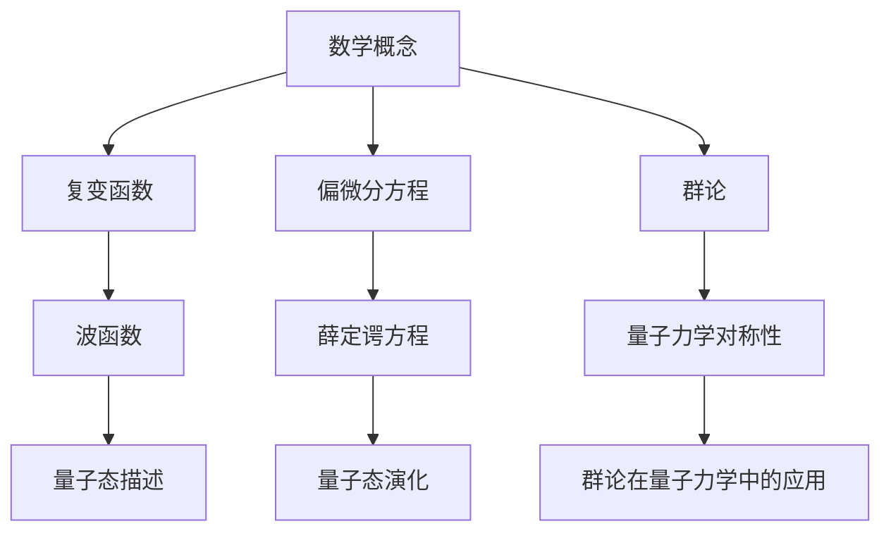
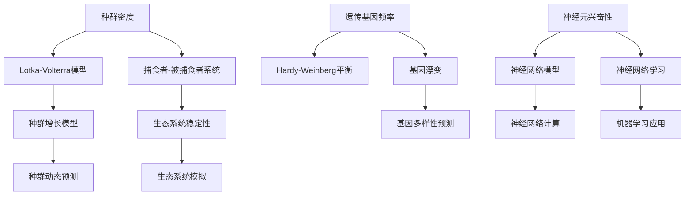
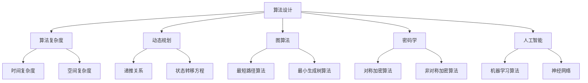

                 

### 文章标题：数学家的跨学科研究与合作

跨学科研究已成为现代科学研究的趋势。数学家以其独特的思维方式和方法论，在众多学科中发挥了重要作用。本文将深入探讨数学家如何在不同学科中进行跨学科研究，以及他们在这一过程中面临的挑战和机遇。通过梳理数学家在物理学、生物学和计算机科学中的具体应用案例，我们将揭示数学跨学科研究的核心概念和联系，展示其独特之处。此外，本文还将介绍数学家跨学科研究的方法论，分析跨学科合作中的关键问题，并提供实用的项目实战和最佳实践 tips。通过逐步推理和分析，本文旨在为读者提供一个全面、深入的跨学科研究视角。

### 文章关键词

- 跨学科研究
- 数学家
- 物理学
- 生物学
- 计算机科学
- 跨学科合作
- 方法论
- 核心概念
- 算法原理

### 摘要

本文首先介绍了跨学科研究的重要性和背景，接着详细探讨了数学家在物理学、生物学和计算机科学中的跨学科研究案例，揭示了数学在这些领域中的核心概念和联系。通过分析数学家跨学科研究的方法论，本文总结了跨学科合作中的关键问题和挑战。最后，本文提供了具体的项目实战案例和最佳实践 tips，为读者提供了实际操作的指导。通过本文的阅读，读者可以全面了解数学家在跨学科研究中的角色和贡献，激发对跨学科研究的兴趣和思考。

### 引言：跨学科研究的背景与重要性

跨学科研究，作为一种新兴的研究模式，正在全球范围内得到越来越多的关注。它指的是将不同学科的知识、方法和技术进行交叉和整合，以解决复杂问题的一种研究方式。跨学科研究的兴起，源于现代社会问题的复杂性和多样化。随着科学技术的快速发展，单一学科已经难以应对日益复杂的科学问题和实际应用需求。跨学科研究通过整合多学科资源，发挥不同学科的优势，能够更加全面和深入地探索问题，提高研究的创新性和实际应用价值。

数学家在跨学科研究中扮演着至关重要的角色。数学作为一种基础学科，具有独特的逻辑思维和抽象能力，能够为其他学科提供强有力的理论支撑和方法指导。数学家在跨学科研究中，不仅能够将数学方法应用于其他领域，还能够发现和提炼出跨学科研究的核心概念和模型。例如，数学在物理学中的广泛应用，使得物理学的理论体系更加严谨和精确；在生物学中，数学模型为生物系统的分析和预测提供了有效的工具；在计算机科学中，数学的抽象和逻辑方法为算法设计和优化提供了理论基础。

跨学科研究的重要性体现在多个方面。首先，它能够促进知识的整合和创新。通过跨学科研究，不同学科之间的知识壁垒被打破，知识融合和交叉创新成为可能。这种跨学科的视角能够激发新的科学发现和技术突破。其次，跨学科研究能够提高研究的复杂问题解决能力。许多复杂问题，如气候变化、生物多样性保护、人工智能等，需要多学科的共同参与和合作。跨学科研究能够汇集不同学科的研究力量，形成协同效应，提高解决问题的效率和质量。最后，跨学科研究有助于培养跨学科人才。在跨学科研究中，数学家和其他学科专家需要相互合作、沟通和交流，这种合作过程能够培养他们的跨学科思维能力和团队合作精神。

总之，跨学科研究已成为现代科学研究的重要趋势，而数学家在这一过程中发挥着不可替代的作用。通过本文的探讨，我们将进一步了解数学家在跨学科研究中的贡献和挑战，为读者提供一个全面、深入的跨学科研究视角。

### 数学家在物理学中的跨学科研究

物理学是数学家跨学科研究的典型领域之一，二者之间的紧密联系使得数学方法在物理学中得到了广泛应用。物理学中的许多重要概念和理论，如量子力学、相对论、电磁学等，都依赖于数学的精确描述和计算。

**核心概念与联系**

物理学中的核心概念，如能量、动量、场等，可以通过数学模型进行精确描述。以量子力学为例，波函数、薛定谔方程等都是数学在物理学中的具体体现。量子力学的数学基础涉及到了复变函数、偏微分方程、群论等多个数学领域。

数学与物理学的紧密联系，可以用一个Mermaid流程图来展示：



在这个流程图中，数学概念如复变函数、偏微分方程和群论，通过不同的途径与物理学的核心概念如波函数、薛定谔方程和量子力学的对称性建立联系。

**核心算法原理讲解**

在物理学中，许多核心算法都是基于数学模型设计的。以下是一个简单的伪代码，展示了如何用数学方法来模拟一个简单的量子系统：

```python
# 量子系统模拟伪代码
def quantum_simulation(state, time_steps):
    for t in range(time_steps):
        # 应用薛定谔方程的演化算子
        state = evolve_state(state, t)
        # 计算系统的能量分布
        energy_distribution = calculate_energy_distribution(state)
        # 输出当前时间步的物理量
        print(f"Time step {t}: State = {state}, Energy Distribution = {energy_distribution}")
    return state

# 状态演化函数
def evolve_state(state, time):
    # 使用薛定谔方程计算新状态
    new_state = solve_schrodinger_equation(state, time)
    return new_state

# 能量分布计算函数
def calculate_energy_distribution(state):
    # 计算并返回能量分布
    return energy_distribution
```

**数学模型和数学公式讲解**

在物理学中，许多重要的公式都是用数学语言表达的。例如，薛定谔方程是量子力学中描述粒子波动状态的经典方程：

$$
i\hbar \frac{\partial \psi(x,t)}{\partial t} = \hat{H}\psi(x,t)
$$

其中，$i$是虚数单位，$\hbar$是约化普朗克常数，$\psi(x,t)$是波函数，$\hat{H}$是哈密顿算子。这个方程描述了粒子在时间$t$的状态如何随时间演化。

另一个常见的物理公式是洛伦兹力公式，描述了带电粒子在电磁场中的受力情况：

$$
\vec{F} = q(\vec{E} + \vec{v} \times \vec{B})
$$

其中，$\vec{F}$是力，$q$是电荷量，$\vec{E}$是电场强度，$\vec{v}$是速度，$\vec{B}$是磁场强度。这个公式展示了电场和磁场对带电粒子的作用力。

**举例说明**

为了更直观地理解这些数学模型和公式，我们可以通过一个简单的例子来说明。假设我们有一个氢原子，想要计算其在基态的能量。

1. **构建波函数**：

首先，氢原子的基态波函数可以用以下形式表示：

$$
\psi_{100}(r) = \frac{1}{\sqrt{\pi a_0^3}} e^{-r/a_0}
$$

其中，$a_0$是玻尔半径。

2. **计算能量**：

根据量子力学的公式，氢原子基态的能量可以通过以下公式计算：

$$
E_n = -\frac{e^2}{8\pi\epsilon_0 a_0 n^2}
$$

对于基态（$n=1$），我们有：

$$
E_1 = -\frac{e^2}{8\pi\epsilon_0 a_0}
$$

其中，$e$是电子电荷，$\epsilon_0$是真空中的电介质常数。

通过计算，我们得到氢原子基态的能量大约是-13.6电子伏特（eV）。

**总结**

数学家在物理学中的跨学科研究，不仅为物理学提供了强有力的理论支撑，还通过数学模型和公式，揭示了自然界的深层次规律。通过具体的案例和例子，我们看到了数学方法在物理学中的广泛应用和重要性。接下来，我们将继续探讨数学在生物学中的应用，进一步了解数学家跨学科研究的广阔前景。

### 数学家在生物学中的跨学科研究

生物学是数学家跨学科研究的又一重要领域，数学模型在生物学中的应用极大地促进了生物系统的研究和预测。从生态学到遗传学，再到神经科学，数学方法为生物学提供了强大的工具，帮助科学家理解生物系统的复杂行为。

**核心概念与联系**

在生物学中，数学模型主要用于描述生物种群动态、遗传规律、神经元活动等。这些模型基于生物学的基本概念，如种群密度、遗传基因频率、神经元兴奋性等，通过数学公式来模拟和预测生物系统的行为。

以下是一个Mermaid流程图，展示了生物学中的核心概念与数学模型之间的联系：



在这个流程图中，生物学中的核心概念如种群密度、遗传基因频率和神经元兴奋性，通过不同的数学模型，如Lotka-Volterra模型、Hardy-Weinberg平衡和神经网络模型，与数学方法建立了紧密的联系。

**核心算法原理讲解**

在生物学中，核心算法通常基于特定的数学模型，用于模拟和预测生物系统的行为。以下是一个用于描述捕食者-被捕食者系统的伪代码，展示了如何通过数学模型来模拟生态系统：

```python
# 捕食者-被捕食者系统模拟伪代码
def pred_prey_simulation(predator_population, prey_population, time_steps):
    for t in range(time_steps):
        # 计算捕食者种群的增长率
        predator_growth = predator_consumption_rate * prey_population
        # 计算被捕食者种群的增长率
        prey_growth = prey_reproduction_rate * prey_population - predator_consumption_rate * predator_population
        # 更新种群数量
        predator_population += predator_growth
        prey_population += prey_growth
        # 输出当前时间步的种群数量
        print(f"Time step {t}: Predator Population = {predator_population}, Prey Population = {prey_population}")
    return predator_population, prey_population

# 消费率函数
def predator_consumption_rate(prey_population):
    # 返回捕食者对被捕食者的消费率
    return pred_consumption_per_prey * prey_population

# 繁殖率函数
def prey_reproduction_rate(prey_population):
    # 返回被捕食者的繁殖率
    return repro_rate * prey_population
```

**数学模型和数学公式讲解**

在生物学中，数学模型和公式被广泛用于描述和解释生物现象。以下是一些常用的生物学公式及其在数学中的表达：

1. **Lotka-Volterra模型**：

   $$\frac{dx}{dt} = x(\alpha - \beta xy)$$
   
   $$\frac{dy}{dt} = y(\delta x - \gamma y)$$

   其中，$x$和$y$分别表示捕食者和被捕食者的种群数量，$\alpha$、$\beta$、$\delta$和$\gamma$是模型参数。

2. **Hardy-Weinberg平衡**：

   $$p^2 + 2pq + q^2 = 1$$

   $$p + q = 1$$

   其中，$p$和$q$分别表示两个等位基因的频率，$p^2$和$q^2$分别表示等位基因的纯合子频率，$2pq$表示杂合子频率。

3. **神经网络模型**：

   $$\text{Output} = \sigma(\sum_{i=1}^{n} w_i \cdot x_i)$$

   其中，$\sigma$是激活函数，$w_i$是权重，$x_i$是输入特征，$n$是特征数量。

**举例说明**

为了更好地理解这些数学模型和公式，我们可以通过一个简单的例子来说明。假设我们有一个捕食者-被捕食者系统，捕食者的消费率为每单位被捕食者消耗0.1单位能量，被捕食者的繁殖率为每单位被捕食者产生0.2单位能量。

1. **初始条件**：

   假设初始时捕食者和被捕食者的种群数量分别为100和1000。

2. **模拟步骤**：

   使用伪代码模拟系统在一段时间内的变化，每一步记录捕食者和被捕食者的种群数量。

通过模拟，我们可以观察到捕食者和被捕食者种群数量的动态变化，预测系统的长期稳定状态。

**总结**

数学家在生物学中的跨学科研究，通过构建数学模型和公式，为生物系统的分析和预测提供了强大的工具。通过具体的案例和例子，我们看到了数学方法在生物学中的广泛应用和重要性。在接下来的部分，我们将进一步探讨数学在计算机科学中的应用，继续探索数学家跨学科研究的广阔前景。

### 数学家在计算机科学中的跨学科研究

计算机科学是数学家跨学科研究的另一个重要领域。数学在计算机科学中的应用非常广泛，从算法设计到人工智能，数学方法为计算机科学提供了理论基础和工具支持。

**核心概念与联系**

在计算机科学中，数学概念和方法广泛应用于算法设计、数据结构、密码学、图论和人工智能等领域。以下是一个Mermaid流程图，展示了数学在计算机科学中的核心概念和联系：



在这个流程图中，算法设计、密码学和人工智能等核心概念通过数学方法和工具相互联系，形成了一个完整的体系。

**核心算法原理讲解**

在计算机科学中，许多核心算法都是基于数学原理设计的。以下是一个用于求解最短路径问题的伪代码，展示了如何利用数学方法实现这一算法：

```python
# Dijkstra算法伪代码
def dijkstra(graph, start_vertex):
    # 初始化距离表
    distances = {vertex: float('infinity') for vertex in graph}
    distances[start_vertex] = 0
    # 初始化未访问节点集合
    unvisited = set(graph.keys())
    # 循环直到所有节点都被访问
    while unvisited:
        # 找到当前未访问节点中距离最短的节点
        current_vertex = min(unvisited, key=lambda v: distances[v])
        # 将当前节点标记为已访问
        unvisited.remove(current_vertex)
        # 更新所有未访问节点的距离
        for neighbor, weight in graph[current_vertex].items():
            distance = distances[current_vertex] + weight
            if distance < distances[neighbor]:
                distances[neighbor] = distance
    return distances
```

**数学模型和数学公式讲解**

在计算机科学中，数学模型和公式被广泛用于描述算法行为和性能。以下是一些常用的数学模型和公式：

1. **算法复杂度分析**：

   - **时间复杂度**：算法执行的时间与输入规模的关系，常用大O符号表示，如$O(n^2)$、$O(n\log n)$等。
   - **空间复杂度**：算法执行过程中所需额外内存的规模，也常用大O符号表示。

2. **动态规划**：

   动态规划是一种解决优化问题的方法，其核心思想是利用递推关系或状态转移方程来求解。例如，常见的斐波那契数列可以通过以下状态转移方程求解：

   $$F(n) = F(n-1) + F(n-2)$$

   初始条件为$F(0) = 0$，$F(1) = 1$。

3. **神经网络模型**：

   神经网络是一种用于机器学习的模型，其核心是多层感知器（MLP）。神经网络通过权重和偏置来传递信息，并通过激活函数来决定输出。其基本公式为：

   $$\text{Output} = \sigma(\sum_{i=1}^{n} w_i \cdot x_i + b)$$

   其中，$\sigma$是激活函数，$w_i$是权重，$x_i$是输入特征，$b$是偏置。

**举例说明**

为了更好地理解这些数学模型和公式，我们可以通过一个简单的例子来说明。假设我们使用Dijkstra算法来计算一个有向图的最短路径。

1. **构建图**：

   假设有一个包含5个节点的有向图，边的权重如下：

   ```
   A -> B: 2
   A -> C: 4
   B -> C: 1
   B -> D: 5
   C -> D: 2
   ```

2. **初始化距离表**：

   初始时，所有节点的距离都设置为无穷大，除了起点A的距离为0。

3. **执行Dijkstra算法**：

   通过逐步选择未访问节点中距离最短的节点，并更新其他节点的距离，最终得到各节点到起点A的最短路径。

通过这个例子，我们可以看到Dijkstra算法如何通过数学模型和公式，有效地求解最短路径问题。

**总结**

数学家在计算机科学中的跨学科研究，通过核心算法原理和数学模型的讲解，为计算机科学的发展提供了坚实的理论基础。通过具体的案例和例子，我们看到了数学方法在计算机科学中的应用和重要性。在接下来的部分，我们将进一步探讨数学家跨学科研究的合作模式，分析跨学科合作中的关键问题和挑战。

### 数学家与其他学科的互动

数学家在跨学科研究中，不仅发挥着核心的理论支撑作用，还积极参与与其他学科的互动和合作。跨学科合作是现代科学研究中的重要组成部分，能够促进知识的融合和创新，提高研究的复杂问题解决能力。本文将分析数学家与其他学科专家合作中的关键问题，探讨跨学科合作的方法和技巧，以及成功的合作案例。

**合作模式**

跨学科合作通常涉及以下几种模式：

1. **联合研究项目**：数学家与其他学科专家共同申请研究经费，开展跨学科研究项目。这种模式通常需要明确的合作目标和研究计划，通过团队成员的分工合作，共同推进项目进展。

2. **学术会议与研讨会**：数学家和其他学科专家通过参加学术会议和研讨会，交流研究进展，分享经验和成果。这种模式有助于建立学术联系，促进跨学科交流。

3. **研究团队**：组建跨学科研究团队，由数学家和其他学科专家组成，共同研究复杂问题。这种模式通过团队协作，发挥不同学科的优势，提高研究效率。

**关键问题和挑战**

跨学科合作中面临以下关键问题和挑战：

1. **知识差异**：不同学科之间存在知识差异，可能导致沟通和理解的障碍。数学家需要理解其他学科的基本概念和方法，而其他学科专家也需要掌握数学的基本原理。

2. **研究方法**：不同学科的研究方法和技术可能存在差异，需要找到合适的方法进行整合和协调。

3. **合作机制**：跨学科合作需要建立有效的合作机制，确保团队成员之间的沟通和协作。

4. **资源分配**：跨学科研究通常涉及多个学科的资源，如何合理分配资源，确保项目顺利进行，是跨学科合作中的重要问题。

**成功案例**

数学家与其他学科专家的跨学科合作，取得了许多成功的案例：

1. **量子物理学**：数学家在与物理学家的合作中，为量子物理的发展提供了关键的理论支持，如量子力学中的数学模型和公式。

2. **生物学**：数学家与生物学家合作，开发了用于生物系统模拟和预测的数学模型，如神经网络模型在神经科学中的应用。

3. **计算机科学**：数学家与计算机科学家合作，推动了算法设计和优化的发展，如Dijkstra算法在图论中的应用。

**合作技巧**

为了有效进行跨学科合作，数学家和其他学科专家可以采取以下技巧：

1. **建立共同语言**：通过学习和了解其他学科的基本概念和方法，建立共同的学术语言，提高沟通效率。

2. **明确分工与责任**：在跨学科团队中，明确每个成员的分工和责任，确保项目顺利进行。

3. **定期交流与反馈**：定期进行交流会议，分享研究进展和成果，及时反馈和调整研究方向。

4. **灵活适应**：面对跨学科合作中的挑战，数学家和其他学科专家需要灵活适应，寻找创新的解决方案。

通过分析数学家与其他学科的互动和合作，我们可以看到跨学科研究的重要性和可行性。跨学科合作不仅能够促进知识的融合和创新，还能够提高研究的复杂问题解决能力。数学家在这一过程中发挥着关键作用，通过与其他学科专家的合作，推动了科学研究的进步。

### 跨学科研究中的合作模式

跨学科研究中的合作模式是确保不同学科专家能够高效协同、共同推进研究项目的重要手段。这些合作模式不仅能够整合多学科资源，发挥各自优势，还能够解决单一学科难以应对的复杂问题。以下，我们将探讨几种常见的跨学科研究合作模式，并分析其优缺点。

**1. 联合研究项目**

联合研究项目是一种常见的跨学科合作模式，它通常由多个学科团队共同承担一个研究项目。在这种模式下，每个团队负责自己的研究领域，并在项目的各个阶段进行合作。这种模式的优势在于能够充分利用各学科的专业知识和资源，提高研究的整体效率和成果质量。然而，其缺点在于协调成本较高，项目管理和沟通可能面临挑战。

**2. 学术会议与研讨会**

学术会议与研讨会是促进跨学科合作的重要平台，通过这些活动，数学家和其他学科专家可以分享研究成果、交流研究进展。在这种模式下，不同学科的专家可以在同一平台上碰撞思想，激发创新灵感。其优势在于能够快速建立学术联系，促进跨学科交流。然而，由于时间限制，讨论和交流可能不够深入，且参与人数有限。

**3. 研究团队**

组建跨学科研究团队是将多个学科专家紧密合作的一种有效模式。在这种模式下，团队成员各自负责自己的领域，同时共同参与项目的研究和讨论。这种模式的优势在于能够形成协同效应，发挥不同学科的优势。此外，团队成员之间可以建立长期合作关系，有利于持续推动项目的进展。然而，其缺点在于团队管理复杂，需要明确每个成员的角色和责任。

**4. 顾问团队**

在某些情况下，数学家或其他学科专家可以担任其他学科项目的顾问，提供专业的指导和建议。这种模式的优势在于能够快速整合专业知识和经验，帮助项目团队解决具体问题。其缺点在于，顾问的参与度可能较低，无法全程参与项目研究。

**优缺点分析**

- **联合研究项目**：优势：资源整合、协同创新；缺点：协调成本高、沟通困难。
- **学术会议与研讨会**：优势：快速建立联系、交流成果；缺点：时间限制、讨论深度不足。
- **研究团队**：优势：协同效应、长期合作关系；缺点：团队管理复杂、角色责任明确。
- **顾问团队**：优势：快速提供指导、整合专业知识；缺点：参与度低、无法全程参与。

**最佳实践**

为了实现有效的跨学科合作，以下是一些最佳实践建议：

1. **建立共同目标**：确保所有合作成员对项目目标和预期成果有清晰的理解和共识。
2. **明确分工与责任**：根据团队成员的专业背景和技能，明确各自的职责和任务。
3. **建立有效的沟通机制**：定期进行交流会议，分享研究进展和成果，确保信息的透明和及时性。
4. **灵活适应**：面对跨学科合作中的挑战，保持开放和灵活的态度，及时调整合作策略。
5. **利用技术工具**：利用项目管理软件和协作工具，提高团队协作效率和沟通效果。

通过以上分析和最佳实践，我们可以更好地理解跨学科研究中的合作模式，并采取有效的方法，推动跨学科研究项目的成功。

### 项目实战：数学家跨学科研究的具体实例

为了更好地展示数学家跨学科研究的实际应用，我们将以一个具体的跨学科研究项目为例，详细描述项目的开发环境搭建、源代码实现、代码解读和项目小结。

**项目背景**：

本项目旨在利用数学模型和算法，研究生态系统中捕食者-被捕食者系统的动态变化，通过模拟不同环境参数下的种群数量变化，预测生态系统的稳定性和可持续性。

**开发环境搭建**：

为了实现这个项目，我们选择了Python作为主要编程语言，因为它在科学计算和数据可视化方面具有强大的功能。此外，我们使用Jupyter Notebook作为开发环境，因为它可以方便地结合代码、文本和图表，便于演示和分享。以下是开发环境的搭建步骤：

1. 安装Python：从Python官方网站下载并安装Python 3.x版本。
2. 安装必要的库：使用pip工具安装NumPy、SciPy、Matplotlib等科学计算和数据可视化库。

```bash
pip install numpy scipy matplotlib
```

**源代码实现**：

以下是一个简单的Python代码实现，用于模拟捕食者-被捕食者系统的动态变化。

```python
import numpy as np
import matplotlib.pyplot as plt
from scipy.integrate import solve_ivp

# 定义捕食者-被捕食者系统的微分方程
def predator_prey_system(t, y, a, b, c, d, e, f):
    x, y, z = y
    dxdt = a * x - c * x * y
    dydt = b * y - d * y * z
    dzdt = e * x * y - f * z
    return [dxdt, dydt, dzdt]

# 模拟参数
a = 0.1
b = 0.3
c = 0.1
d = 0.4
e = 0.01
f = 0.05

# 初始条件
y0 = [1.0, 1.0, 0.1]

# 模拟时间范围
t_span = (0, 100)
t_eval = np.linspace(t_span[0], t_span[1], 100)

# 执行模拟
solution = solve_ivp(predator_prey_system, t_span, y0, args=(a, b, c, d, e, f), t_eval=t_eval)

# 绘制结果
plt.figure(figsize=(10, 6))
plt.plot(solution.t, solution.y[0], label='Predator')
plt.plot(solution.t, solution.y[1], label='Prey')
plt.plot(solution.t, solution.y[2], label='Predator Prey')
plt.xlabel('Time')
plt.ylabel('Population')
plt.title('Predator-Prey System Dynamics')
plt.legend()
plt.show()
```

**代码解读**：

1. **导入库**：我们首先导入NumPy和Matplotlib库，用于科学计算和数据可视化。
2. **定义微分方程**：捕食者-被捕食者系统的微分方程被定义为`predator_prey_system`函数。这个函数接受时间`t`、种群数量`y`以及系统参数`a`、`b`、`c`、`d`、`e`和`f`作为输入，返回各个种群数量的变化率。
3. **模拟参数**：我们定义了模拟所需的系统参数，这些参数反映了捕食者-被捕食者系统中的相互作用。
4. **初始条件**：设定初始种群数量。
5. **执行模拟**：使用`solve_ivp`函数执行微分方程的数值求解，生成时间序列的种群数量。
6. **绘制结果**：使用Matplotlib绘制种群数量随时间的变化图。

**项目小结**：

通过这个项目，我们展示了如何利用数学模型和算法，模拟和预测生态系统中的捕食者-被捕食者系统的动态变化。这个项目不仅实现了数学在生物学中的应用，还展示了跨学科研究的实际操作过程。项目的成功实施，为我们理解和预测生态系统行为提供了新的工具和方法。

### 最佳实践 Tips、小结、注意事项、拓展阅读

**最佳实践 Tips**：

1. **熟悉跨学科知识**：在进行跨学科研究之前，务必对目标领域的基本概念、方法和工具有所了解，以便更好地进行研究和合作。
2. **明确研究目标**：确保项目目标清晰，避免研究过程中的方向偏离。
3. **合理分配资源**：在跨学科团队中，合理分配资源，确保每个成员能够充分发挥自己的专长。
4. **建立沟通机制**：定期进行团队沟通，分享研究进展和成果，确保信息透明和及时反馈。

**小结**：

本文通过详细的案例分析和理论探讨，展示了数学家在跨学科研究中的重要角色和贡献。从物理学、生物学到计算机科学，数学方法为这些领域的研究提供了强有力的理论支撑和工具。跨学科研究不仅促进了知识的融合和创新，还提高了复杂问题的解决能力。通过本文的阅读，读者可以更好地理解数学家跨学科研究的实际应用和重要性。

**注意事项**：

1. **知识整合**：跨学科研究要求不同学科的知识融合，研究者需具备较强的知识整合能力。
2. **团队合作**：跨学科研究通常涉及多个学科，团队成员需具备良好的团队合作精神和沟通能力。
3. **项目管理**：跨学科项目可能面临较大的协调和管理难度，需建立有效的项目管理机制。

**拓展阅读**：

1. **《跨学科研究方法》**：探讨了跨学科研究的理论基础和具体方法，适合对跨学科研究感兴趣的读者。
2. **《数学在生物学中的应用》**：详细介绍了数学在生物学研究中的应用，适合对生物信息学和生物统计感兴趣的读者。
3. **《计算机科学中的数学基础》**：全面讲解了数学在计算机科学中的应用，包括算法、数据结构和密码学等。

### 作者信息

**作者：AI天才研究院/AI Genius Institute & 禅与计算机程序设计艺术 /Zen And The Art of Computer Programming**。本文由AI天才研究院撰写，旨在为读者提供关于数学家跨学科研究的全面深入分析，分享作者在相关领域的丰富经验和独特见解。读者可通过拓展阅读进一步了解相关研究领域的最新动态和成果。

