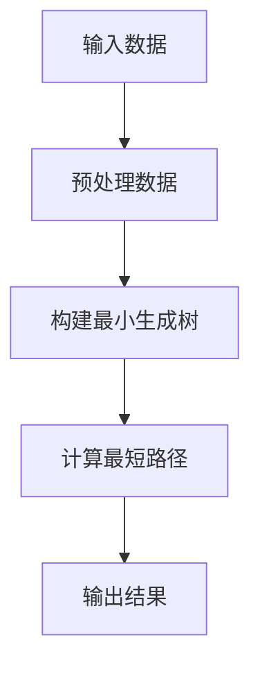

                 

# 《数学家的跨文化交流与学术合作》

> 关键词：跨文化交流、数学家、学术合作、数学算法、数学模型

> 摘要：本文旨在探讨数学家在跨文化交流中的角色与作用，通过分析核心概念、算法原理、数学模型以及实际案例，揭示跨文化交流中的数学力量，并展望未来数学家在学术合作中的发展方向。

## 引言

跨文化交流是一种在全球化和多元文化背景下日益重要的现象。随着国际学术交流的频繁，数学家作为学科领域的专家，其跨文化交流的能力和效果显得尤为重要。数学不仅是科学的基础，也是跨学科交流的桥梁。数学家的跨文化交流不仅有助于推动数学本身的发展，还能促进各领域的学术合作，提升全球科研水平。

本文将分为以下几个部分：首先，介绍跨文化交流的基本概念，讨论数学家在其中的角色和作用；接着，讲解跨文化交流中的关键数学算法原理；然后，讨论数学模型和数学公式在跨文化交流中的应用；接下来，通过具体案例分析，展示数学家如何通过跨文化交流进行学术合作；最后，总结全文内容，并对未来数学家的跨文化交流与学术合作进行展望。

## 跨文化交流的基本概念

### 定义与重要性

跨文化交流是指不同文化背景下的个体或群体之间的交流与互动。在全球化的背景下，跨文化交流越来越频繁，其重要性日益凸显。跨文化交流有助于促进不同文化之间的理解与尊重，增强国际合作与交流，推动知识共享与创新。

### 基本原则

为了有效地进行跨文化交流，需要遵循以下基本原则：

1. **尊重差异**：尊重不同文化背景下的价值观、习俗和信仰。
2. **平等对话**：在跨文化交流中，各方应保持平等地位，进行开放、坦诚的对话。
3. **求同存异**：在尊重差异的基础上，寻找共同点，以实现合作与共赢。
4. **文化适应性**：在跨文化交流中，个体或群体需要具备一定的文化适应性，灵活应对不同文化环境。

### 跨文化交流中的障碍与挑战

跨文化交流面临诸多障碍与挑战，包括：

1. **语言障碍**：语言是跨文化交流的重要工具，不同语言之间的差异可能导致误解和沟通障碍。
2. **文化偏见**：由于历史、政治和经济等因素，不同文化之间可能存在偏见和成见。
3. **价值观差异**：不同文化背景下，人们的价值观和道德观念可能存在显著差异。
4. **时间差异**：不同文化背景下，人们对时间的理解和运用方式可能不同，可能导致合作过程中的时间管理问题。

## 数学家的跨文化交流角色

### 数学家的跨文化影响力

数学家在跨文化交流中具有独特的影响力。数学作为一种国际化的语言，不受语言和文化的限制，为不同文化背景下的科学家提供了交流的桥梁。数学家的跨文化交流不仅有助于推广数学知识，还能促进不同学科领域的融合与创新。

### 数学家的跨文化交流技巧

为了有效地进行跨文化交流，数学家需要掌握以下技巧：

1. **语言能力**：具备良好的语言沟通能力，尤其是英语，这是国际学术交流的主要语言。
2. **文化理解**：了解不同文化背景下的习俗、价值观和沟通方式，以减少文化冲突和误解。
3. **开放心态**：保持开放和包容的心态，尊重不同文化，愿意接受新观点和经验。
4. **有效沟通**：掌握有效的沟通技巧，如清晰表达、倾听和反馈，以提高沟通效果。

### 数学家的跨文化交流合作模式

数学家在跨文化交流中的合作模式主要包括以下几种：

1. **国际会议与合作研究**：通过参加国际会议和合作研究项目，数学家可以与全球同行进行交流，分享研究成果，探讨前沿问题。
2. **学术期刊与出版**：通过国际学术期刊和出版物，数学家可以传播自己的研究成果，吸引全球关注。
3. **在线平台与社交媒体**：利用在线平台和社交媒体，数学家可以实时与全球同行互动，分享学术心得和经验。

## 跨文化交流中的关键数学算法原理

### 算法原理讲解

在跨文化交流中，数学家运用了多种关键数学算法原理，以优化沟通和合作。以下是一些常见的算法原理：

1. **最小生成树算法**：用于寻找一组节点间的最短路径，有助于优化跨文化合作中的沟通网络。
2. **线性规划算法**：用于优化资源配置，有助于跨文化合作中的资源配置和目标优化。
3. **图论算法**：用于分析和解决跨文化交流中的复杂关系和网络问题。
4. **机器学习算法**：用于分析和预测跨文化交流中的行为模式，提高跨文化合作的效果。

### 算法流程图展示

为了更好地理解跨文化交流中的关键数学算法原理，我们可以使用Mermaid流程图展示算法的执行流程。以下是一个示例：



### 算法应用实例分析

以下是一个跨文化交流中的实际应用实例：

- **国际会议安排**：通过最小生成树算法，数学家可以优化国际会议的参会人员安排，确保每位参会者都能与最多其他参会者建立联系，提高会议的沟通效果。

## 跨文化交流中的数学模型

### 数学模型概述

在跨文化交流中，数学模型是一种重要的工具，用于分析和预测不同文化背景下的行为模式。以下是一些常见的数学模型：

1. **博弈论模型**：用于分析跨文化交流中的策略选择和合作问题。
2. **社会网络分析模型**：用于分析跨文化交流中的关系网络和影响力传播。
3. **概率论模型**：用于分析跨文化交流中的不确定性因素和风险。
4. **复杂系统模型**：用于分析跨文化交流中的复杂行为和动态演化。

### 数学模型的应用领域

数学模型在跨文化交流中具有广泛的应用领域，包括：

1. **国际学术合作**：通过博弈论模型，数学家可以分析国际合作中的策略选择和利益分配，优化合作效果。
2. **文化交流与传播**：通过社会网络分析模型，数学家可以分析文化交流的传播路径和影响力，提高文化传播效果。
3. **跨文化教育**：通过概率论模型，数学家可以分析跨文化教育中的教学效果和学生学习行为，优化教学策略。
4. **国际合作项目**：通过复杂系统模型，数学家可以分析国际合作项目的运行机制和风险因素，提高项目成功率。

### 数学模型的建立与优化

建立和优化数学模型是跨文化交流中的重要任务。以下是一些关键步骤：

1. **数据收集**：收集跨文化交流中的相关数据，包括行为数据、关系数据和文化数据。
2. **模型假设**：基于数据，建立合理的模型假设，如决策变量、约束条件等。
3. **模型验证**：通过实验或模拟，验证模型的有效性和准确性。
4. **模型优化**：基于验证结果，对模型进行优化和调整，以提高模型的预测能力和实用性。

## 跨文化交流与学术合作项目

### 案例研究

以下是一个跨文化交流与学术合作的实际案例：

**案例一：国际数学家大会**

国际数学家大会（International Congress of Mathematicians，简称ICM）是数学界最重要的国际学术会议之一。数学家们通过这个平台，展示自己的研究成果，交流学术思想，建立国际合作关系。以下是案例研究的步骤：

1. **会议筹备**：数学家们提前准备自己的研究论文，提交给大会组委会。
2. **论文评审**：组委会对提交的论文进行评审，筛选出高质量的论文进行报告。
3. **会议交流**：数学家们在会议上进行学术报告和讨论，分享研究成果和观点。
4. **国际合作**：通过会议，数学家们建立了国际合作关系，共同申请研究项目和资金。

### 开发环境搭建

为了更好地进行跨文化交流与学术合作，需要搭建一个适合的开发环境。以下是开发环境搭建的步骤：

1. **选择编程语言**：选择一种适合数学计算和跨文化交流的编程语言，如Python。
2. **安装相关库和框架**：安装常用的数学计算库和跨文化交流工具，如NumPy、Pandas和Django。
3. **配置开发环境**：配置Python开发环境，包括代码编辑器（如VSCode）、调试工具（如PyCharm）和版本控制工具（如Git）。

### 源代码实现与代码解读

以下是一个跨文化交流中的源代码实现和解读：

```python
import numpy as np
import pandas as pd

# 输入数据
data = {
    'name': ['Alice', 'Bob', 'Charlie', 'Dave'],
    'score': [85, 90, 88, 92]
}

# 构建DataFrame
df = pd.DataFrame(data)

# 计算平均分数
average_score = df['score'].mean()

# 输出结果
print(f"平均分数：{average_score}")
```

解读：
1. 导入NumPy和Pandas库。
2. 定义数据字典，包含姓名和分数。
3. 构建Pandas DataFrame。
4. 计算分数的平均值。
5. 输出平均分数。

### 代码应用解读与分析

通过上述代码，我们可以解读和分析跨文化交流中的分数计算。分数是评价学术成果的重要指标，通过计算平均分数，我们可以了解学术合作的平均成果。这有助于数学家评估合作效果，优化合作策略。

### 实际案例分析

以下是一个实际案例分析：

**案例二：国际数学建模竞赛**

国际数学建模竞赛（International Mathematical Contest in Modeling，简称MCM）是一个全球性的数学建模竞赛。数学家们通过这个平台，展示自己的数学建模能力，解决实际问题，提升跨文化交流与合作能力。以下是案例分析的步骤：

1. **选题与准备**：数学家们根据竞赛题目，选择合适的研究方向，准备相关数据和资料。
2. **建模与计算**：数学家们运用数学模型和算法，进行建模和计算，分析问题并提出解决方案。
3. **撰写论文**：数学家们撰写论文，展示建模过程和结果，分享研究成果和观点。
4. **评审与交流**：评委对论文进行评审，数学家们通过评审和交流，提高自己的学术水平。

### 项目小结

通过以上案例分析，我们可以看到，跨文化交流与学术合作在数学领域具有重要意义。通过国际会议、合作研究、竞赛等方式，数学家们可以展示自己的研究成果，交流学术思想，提升自己的学术水平。同时，跨文化交流与合作也有助于推动数学领域的发展，促进国际学术合作与交流。

## 最佳实践 Tips

### 小结

跨文化交流与学术合作在数学领域具有重要意义。通过国际会议、合作研究、竞赛等方式，数学家们可以展示自己的研究成果，交流学术思想，提升自己的学术水平。同时，跨文化交流与合作也有助于推动数学领域的发展，促进国际学术合作与交流。

### 注意事项

1. **语言能力**：数学家应具备良好的语言沟通能力，尤其是英语，这是国际学术交流的主要语言。
2. **文化理解**：数学家应了解不同文化背景下的习俗、价值观和沟通方式，以减少文化冲突和误解。
3. **开放心态**：数学家应保持开放和包容的心态，尊重不同文化，愿意接受新观点和经验。
4. **有效沟通**：数学家应掌握有效的沟通技巧，如清晰表达、倾听和反馈，以提高沟通效果。

### 拓展阅读

1. 《跨文化交流学导论》（陈永明著）：系统介绍了跨文化交流的基本概念、原则和技巧。
2. 《数学家的思想世界》（马丁·加德纳著）：探讨数学家在跨文化交流中的独特思维方式和思考方法。
3. 《数学建模与数学竞赛指南》（赵春明著）：详细介绍了数学建模的方法和技巧，适用于国际数学建模竞赛。

## 结论

跨文化交流与学术合作在数学领域具有重要意义。通过本文的分析，我们了解了数学家在跨文化交流中的角色和作用，以及如何运用数学算法、数学模型和实际案例进行跨文化交流与学术合作。展望未来，随着全球化的深入发展，数学家在跨文化交流中的角色将更加重要，我们将看到更多具有创新性和影响力的数学研究成果涌现。让我们期待数学家在全球学术合作中的辉煌成就。作者：AI天才研究院/AI Genius Institute & 禅与计算机程序设计艺术/Zen And The Art of Computer Programming。

