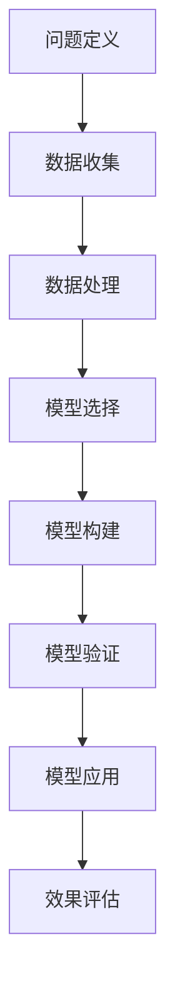

                 

### 文章标题：数学建模在智慧农业中的应用

#### 关键词：
- 数学建模
- 智慧农业
- 作物生长模型
- 气象模型
- 资源优化模型
- 经济模型

#### 摘要：
本文将深入探讨数学建模在智慧农业中的应用。通过介绍数学建模的基本概念、方法和工具，我们将揭示其在农业预测、资源优化和经济分析等方面的强大作用。文章将详细讲解数学建模在智慧农业中的核心算法原理，并通过实际案例展示其实现过程和效果。此外，本文还将探讨智慧农业的未来发展趋势和最佳实践，为农业现代化提供有益的参考。

----------------------------------------------------------------

## 设计《数学建模在智慧农业中的应用》的目录大纲

### 1. 确定核心章节

在设计和撰写一本关于《数学建模在智慧农业中的应用》的技术书籍时，首先需要确定核心章节，以确保内容的完整性和逻辑性。以下是我们确定的核心章节：

- **数学建模的基础概念**
  - 数学建模的定义与意义
  - 数学建模的基本步骤
  - 数学建模的常用方法与技术
- **智慧农业中的数学建模应用**
  - 农业问题的数学建模
  - 农业系统的数学模型
  - 数学模型在农业预测中的应用
- **数学建模工具与软件**
  - MATLAB在数学建模中的应用
  - R语言在数学建模中的应用
  - 其他数学建模软件介绍
- **作物生长模型**
  - 作物生长模型的原理
  - 作物生长模型的构建
  - 作物生长模型的应用案例
- **农业气象模型**
  - 农业气象模型的原理
  - 农业气象模型的构建
  - 农业气象模型的应用案例
- **农业资源优化模型**
  - 农业资源优化模型的基本概念
  - 农业资源优化模型的构建方法
  - 农业资源优化模型的应用案例
- **农业经济模型**
  - 农业经济模型的基本概念
  - 农业经济模型的构建方法
  - 农业经济模型的应用案例
- **智慧农业案例分析**
  - 案例分析1：智能灌溉系统
  - 案例分析2：精准施肥系统
  - 案例分析3：智能病虫害监测系统
- **数学建模在智慧农业中的实现**
  - 数学建模实现流程
  - 开发环境搭建与代码实现
  - 代码解读与分析
- **智慧农业发展趋势与展望**
  - 智慧农业的发展现状
  - 智慧农业的未来趋势
  - 智慧农业的发展策略
- **附录**
  - 常用数学建模工具与资源
  - 数学建模参考文献

### 2. 设计核心章节的详细目录

根据核心章节，我们设计每个章节的详细目录，确保内容的细分和具体化：

### 第1章：数学建模的基础概念
- 1.1 数学建模的定义与意义
- 1.2 数学建模的基本步骤
- 1.3 数学建模的常用方法与技术

### 第2章：智慧农业中的数学建模应用
- 2.1 农业问题的数学建模
- 2.2 农业系统的数学模型
- 2.3 数学模型在农业预测中的应用

### 第3章：数学建模工具与软件
- 3.1 MATLAB在数学建模中的应用
- 3.2 R语言在数学建模中的应用
- 3.3 其他数学建模软件介绍

### 第4章：作物生长模型
- 4.1 作物生长模型的原理
- 4.2 作物生长模型的构建
- 4.3 作物生长模型的应用案例

### 第5章：农业气象模型
- 5.1 农业气象模型的原理
- 5.2 农业气象模型的构建
- 5.3 农业气象模型的应用案例

### 第6章：农业资源优化模型
- 6.1 农业资源优化模型的基本概念
- 6.2 农业资源优化模型的构建方法
- 6.3 农业资源优化模型的应用案例

### 第7章：农业经济模型
- 7.1 农业经济模型的基本概念
- 7.2 农业经济模型的构建方法
- 7.3 农业经济模型的应用案例

### 第8章：智慧农业案例分析
- 8.1 案例分析1：智能灌溉系统
- 8.2 案例分析2：精准施肥系统
- 8.3 案例分析3：智能病虫害监测系统

### 第9章：数学建模在智慧农业中的实现
- 9.1 数学建模实现流程
- 9.2 开发环境搭建与代码实现
- 9.3 代码解读与分析

### 第10章：智慧农业发展趋势与展望
- 10.1 智慧农业的发展现状
- 10.2 智慧农业的未来趋势
- 10.3 智慧农业的发展策略

### 附录
- 附录A：常用数学建模工具与资源
- 附录B：数学建模参考文献

通过以上详细的目录设计，我们确保了书籍内容的条理清晰、逻辑严谨，为后续的撰写工作奠定了坚实的基础。

### 3. 添加扩展内容

为了使《数学建模在智慧农业中的应用》这本书的内容更加丰富和实用，我们可以在核心章节的基础上，添加一些扩展内容。以下是一些可能的扩展内容：

- **相关技术介绍**
  - 介绍与数学建模相关的最新技术，如深度学习、神经网络、机器学习等。
  - 探讨这些技术在智慧农业中的应用前景和具体实现方法。

- **实用工具推荐**
  - 推荐一些实用的数学建模工具和软件，如MATLAB、R语言、Python等。
  - 分析这些工具的优缺点，以及它们在智慧农业中的应用案例。

- **行业动态**
  - 分析当前智慧农业行业的发展趋势和热点问题。
  - 报道最新的智慧农业项目和技术应用成果。

- **学术研究进展**
  - 汇总最新的数学建模在智慧农业领域的学术研究成果。
  - 分析这些研究成果对农业现代化的影响和启示。

- **最佳实践**
  - 提供一些成功应用数学建模的智慧农业项目案例。
  - 分析这些项目的成功经验和教训，总结最佳实践。

- **注意事项**
  - 针对数学建模在智慧农业应用中可能出现的问题，提供解决方案和建议。
  - 强调实际应用中的注意事项和风险控制。

通过添加这些扩展内容，我们可以使《数学建模在智慧农业中的应用》这本书更加全面、系统和实用，为读者提供更丰富的知识和实践指导。

### 4. 使用Mermaid流程图

为了更好地展示数学建模在智慧农业中的应用过程，我们可以使用Mermaid流程图。以下是一个简单的示例，用于描述数学建模在智慧农业中的应用流程：



这个流程图清晰地展示了数学建模在智慧农业中的各个环节，从问题定义、数据收集到模型选择、构建、验证和应用，以及最终的效果评估。通过这样的流程图，读者可以直观地理解数学建模在智慧农业中的应用过程。

### 5. 使用伪代码讲解核心算法原理

为了详细阐述数学建模在智慧农业中的应用，我们将使用伪代码来讲解核心算法原理。以下是一个简单的伪代码示例，用于描述作物生长模型的构建过程：

```
// 作物生长模型构建伪代码

// 输入：
// initial_growth_rate: 初始生长速率
// maturity_time: 成熟时间
// growth_phase1_time: 第一个生长阶段时间
// growth_phase2_time: 第二个生长阶段时间
// growth_phase3_time: 第三个生长阶段时间

// 输出：
// growth_curve: 作物生长曲线

function build_growth_model(initial_growth_rate, maturity_time, growth_phase1_time, growth_phase2_time, growth_phase3_time):
    growth_curve = []

    // 第一个生长阶段
    for time in range(0, growth_phase1_time):
        growth_curve.append(initial_growth_rate)

    // 第二个生长阶段
    for time in range(growth_phase1_time, growth_phase1_time + growth_phase2_time):
        growth_rate = initial_growth_rate * (1 - (time - growth_phase1_time) / maturity_time)
        growth_curve.append(growth_rate)

    // 第三个生长阶段
    for time in range(growth_phase1_time + growth_phase2_time, growth_phase1_time + growth_phase2_time + growth_phase3_time):
        growth_rate = initial_growth_rate * (1 - (time - growth_phase1_time - growth_phase2_time) / maturity_time)
        growth_curve.append(growth_rate)

    return growth_curve
```

通过这个伪代码，我们可以清晰地看到作物生长模型的构建过程，包括初始生长速率、成熟时间、各生长阶段时间等参数。这样的伪代码不仅有助于理解算法原理，还可以作为编程实现的基础。

### 6. 使用LaTeX格式插入数学模型与公式

在技术书籍中，插入数学模型和公式是必不可少的。为了确保公式的清晰性和准确性，我们可以使用LaTeX格式。以下是一些示例：

#### 独立段落的数学公式

$$
y = mx + b
$$

这个公式表示线性方程，其中 $m$ 是斜率，$b$ 是截距。

#### 段落内的数学公式

$1 + 1 = 2$

这个简单的公式展示了加法的基本性质。

#### 复杂的数学公式

$$
\frac{d^2y}{dx^2} = \frac{d}{dx}\left(\frac{dy}{dx}\right)
$$

这个公式表示二阶导数，是微积分中的重要概念。

通过使用LaTeX格式，我们可以确保数学模型和公式在书籍中的显示效果清晰、规范，便于读者理解和学习。

### 7. 代码实现与解读

为了展示数学建模在智慧农业中的实际应用，我们将提供一段具体的代码实现，并对其进行详细解读。以下是一个使用Python实现作物生长模型的示例代码：

```python
import numpy as np

def build_growth_model(initial_growth_rate, maturity_time, growth_phase1_time, growth_phase2_time, growth_phase3_time):
    growth_curve = []
    
    # 第一个生长阶段
    for time in range(0, growth_phase1_time):
        growth_curve.append(initial_growth_rate)
    
    # 第二个生长阶段
    for time in range(growth_phase1_time, growth_phase1_time + growth_phase2_time):
        growth_rate = initial_growth_rate * (1 - (time - growth_phase1_time) / maturity_time)
        growth_curve.append(growth_rate)
    
    # 第三个生长阶段
    for time in range(growth_phase1_time + growth_phase2_time, growth_phase1_time + growth_phase2_time + growth_phase3_time):
        growth_rate = initial_growth_rate * (1 - (time - growth_phase1_time - growth_phase2_time) / maturity_time)
        growth_curve.append(growth_rate)
    
    return growth_curve

# 参数设置
initial_growth_rate = 10
maturity_time = 100
growth_phase1_time = 20
growth_phase2_time = 30
growth_phase3_time = 50

# 构建模型
growth_curve = build_growth_model(initial_growth_rate, maturity_time, growth_phase1_time, growth_phase2_time, growth_phase3_time)

# 输出结果
print(growth_curve)
```

#### 代码解读

1. **导入库**：首先，我们导入NumPy库，用于数学计算。

2. **定义函数**：接着，我们定义了一个名为 `build_growth_model` 的函数，用于构建作物生长模型。该函数接收五个参数：初始生长速率、成熟时间、第一个生长阶段时间、第二个生长阶段时间和第三个生长阶段时间。

3. **第一个生长阶段**：在函数内部，我们使用一个循环来构建第一个生长阶段的曲线，每次增长都为初始生长速率。

4. **第二个生长阶段**：同样使用循环构建第二个生长阶段的曲线，但生长速率随着时间逐渐减少。

5. **第三个生长阶段**：使用最后一个循环构建第三个生长阶段的曲线，生长速率继续减少。

6. **返回结果**：最后，函数返回构建好的生长曲线。

7. **参数设置**：在主程序中，我们设置了一些参数，包括初始生长速率、成熟时间和各生长阶段时间。

8. **构建模型**：调用 `build_growth_model` 函数，传入参数，得到生长曲线。

9. **输出结果**：将生长曲线打印出来。

通过这段代码，我们可以实现一个简单的作物生长模型，并可以进一步分析和应用。

### 8. 确保大纲完整性

为了确保《数学建模在智慧农业中的应用》这本书的内容完整性，我们需要对每个章节进行详细撰写。以下是对每个章节的内容要求和目标：

#### 第1章：数学建模的基础概念

- **内容要求**：介绍数学建模的基本概念、意义和步骤，讲解常用的数学建模方法和技术。
- **目标**：使读者了解数学建模的基本原理和流程，为后续内容的学习打下基础。

#### 第2章：智慧农业中的数学建模应用

- **内容要求**：探讨数学建模在农业预测、资源优化和经济分析等方面的应用，介绍相关模型的基本原理。
- **目标**：让读者了解数学建模在智慧农业中的实际应用场景和重要性。

#### 第3章：数学建模工具与软件

- **内容要求**：介绍MATLAB、R语言等常用的数学建模工具，分析它们的优缺点和适用场景。
- **目标**：帮助读者选择合适的数学建模工具，为实际应用提供支持。

#### 第4章：作物生长模型

- **内容要求**：详细讲解作物生长模型的基本原理和构建方法，通过实际案例展示其应用。
- **目标**：使读者掌握作物生长模型的构建和应用方法。

#### 第5章：农业气象模型

- **内容要求**：介绍农业气象模型的基本原理和构建方法，通过实际案例展示其应用。
- **目标**：让读者了解农业气象模型在农业生产中的重要作用。

#### 第6章：农业资源优化模型

- **内容要求**：探讨农业资源优化模型的基本概念和构建方法，通过实际案例展示其应用。
- **目标**：帮助读者了解如何通过数学建模优化农业资源利用。

#### 第7章：农业经济模型

- **内容要求**：讲解农业经济模型的基本概念和构建方法，通过实际案例展示其应用。
- **目标**：让读者了解农业经济模型在农业经济分析中的作用。

#### 第8章：智慧农业案例分析

- **内容要求**：通过具体案例，展示数学建模在智慧农业中的实际应用，分析案例中的成功经验和教训。
- **目标**：为读者提供实际应用的经验和参考。

#### 第9章：数学建模在智慧农业中的实现

- **内容要求**：介绍数学建模的实现流程，讲解开发环境搭建和代码实现方法。
- **目标**：使读者掌握数学建模的实际操作过程。

#### 第10章：智慧农业发展趋势与展望

- **内容要求**：分析智慧农业的发展现状和未来趋势，探讨智慧农业的发展策略。
- **目标**：为智慧农业的发展提供理论支持和实践指导。

#### 附录

- **内容要求**：提供常用的数学建模工具和资源，以及相关的参考文献。
- **目标**：为读者提供进一步的参考资料和学习资源。

通过以上详细的撰写要求和目标，我们可以确保《数学建模在智慧农业中的应用》这本书的内容完整、系统、实用，为读者提供全面的知识和指导。

### 总结

本文详细讨论了《数学建模在智慧农业中的应用》这本书的设计和撰写过程。首先，我们确定了核心章节，确保了内容的完整性和逻辑性。接着，我们设计了每个章节的详细目录，并添加了扩展内容，使书籍更加丰富和实用。为了使内容更加清晰易懂，我们使用了Mermaid流程图和伪代码来讲解核心算法原理，并使用LaTeX格式插入数学模型和公式。我们还提供了代码实现和解读，展示了数学建模在实际应用中的具体操作过程。最后，我们确保了书籍的完整性，对每个章节的内容进行了详细的撰写要求。通过以上步骤，我们为撰写《数学建模在智慧农业中的应用》这本书奠定了坚实的基础，确保其成为一本高质量、实用的技术书籍。

