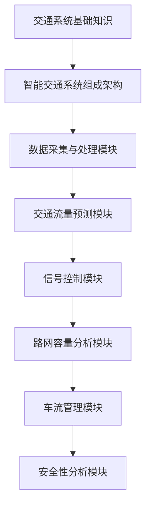
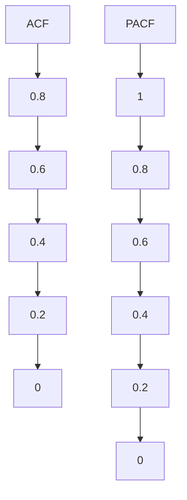

                 

## 文章标题

### 数学建模在智能交通系统中的应用

> 关键词：智能交通系统、数学建模、交通流量预测、信号控制优化、路网容量分析、车流管理、安全性分析、实施与评价

> 摘要：本文从智能交通系统的背景出发，详细探讨了数学建模在智能交通系统中的关键应用。通过深入分析数据采集与预处理、交通流量预测模型、信号控制优化、路网容量分析、车流管理策略以及安全性分析等核心领域，本文为读者提供了一个全面的技术指南。此外，文章还展望了智能交通系统未来的发展方向和面临的挑战，旨在为相关研究人员和实践者提供有价值的参考。

----------------------------------------------------------------

### 引言

智能交通系统（Intelligent Transportation System，ITS）是指利用先进的信息通信技术、传感器技术、控制技术等，对交通运输系统进行智能化管理和控制，以提高交通运输的安全、效率和环境友好性。随着城市化进程的加快和交通流量的激增，传统交通管理模式已经难以满足现代社会的需求。智能交通系统作为现代交通管理的重要手段，正逐渐成为交通领域的研究热点。

数学建模是智能交通系统中的核心技术之一。通过建立数学模型，可以对交通现象进行定量分析，从而为交通管理和决策提供科学依据。数学建模在智能交通系统中的应用主要体现在以下几个方面：

1. **交通流量预测**：通过对历史交通数据和实时交通数据的分析，利用时间序列模型、空间预测模型等方法，预测未来一段时间内的交通流量，为交通管理和调度提供数据支持。
2. **信号控制优化**：利用交通流量预测结果，对交通信号进行优化控制，提高交通流量的通行效率，减少交通拥堵和延误。
3. **路网容量分析**：通过数学模型对路网容量进行评估，识别瓶颈路段，为路网优化提供依据。
4. **车流管理策略**：利用数学模型对车流进行管理和调控，实现交通流量的均衡分布，减少交通拥堵和事故。
5. **安全性分析**：通过建立安全性分析模型，评估交通系统的安全性，提出安全优化策略。

本文将从上述几个方面出发，详细探讨数学建模在智能交通系统中的应用，为相关研究和实践提供参考。

### 智能交通系统的核心概念与架构

智能交通系统的核心概念包括交通系统的基础知识、智能交通系统的组成架构和交通流量分析与预测模型。

#### 交通系统的基础知识

交通系统是指由车辆、道路、交通参与者、信号设施等组成的复杂网络系统。其基础概念包括交通流量、交通密度、交通速度、交通延误等。

- **交通流量**：指单位时间内通过某一截面的车辆数量。
- **交通密度**：指单位长度道路上车辆的数量。
- **交通速度**：指车辆在道路上行驶的平均速度。
- **交通延误**：指车辆在道路上的行驶时间与自由流时间（无交通延误时的行驶时间）之差。

交通系统模型是对交通现象进行数学描述和建模的工具。常见的交通系统模型包括流量-密度-速度模型（如Kuhn-Tucker模型）和随机交通模型（如车流随机模型）。

#### 智能交通系统的组成架构

智能交通系统通常由以下几个模块组成：

1. **数据采集与处理模块**：通过传感器、摄像头、GPS等设备，实时采集交通数据，并对数据进行预处理和存储。
2. **交通流量预测模块**：利用历史数据和实时数据，通过时间序列预测模型、空间预测模型等方法，预测未来一段时间内的交通流量。
3. **信号控制模块**：根据交通流量预测结果，对交通信号进行优化控制，以提高交通流量的通行效率。
4. **路网容量分析模块**：通过数学模型对路网容量进行评估，识别瓶颈路段，为路网优化提供依据。
5. **车流管理模块**：利用数学模型对车流进行管理和调控，实现交通流量的均衡分布，减少交通拥堵和事故。
6. **安全性分析模块**：通过建立安全性分析模型，评估交通系统的安全性，提出安全优化策略。

#### 交通流量分析与预测模型

交通流量分析是智能交通系统的核心任务之一。交通流量预测模型分为时间序列预测模型和空间预测模型。

- **时间序列预测模型**：基于历史交通数据，利用时间序列分析方法，预测未来一段时间内的交通流量。常见的时间序列预测模型包括ARIMA模型、AR模型、MA模型、ARMA模型和ARIMA模型等。
- **空间预测模型**：基于空间数据，利用空间分析方法和空间预测模型，预测未来一段时间内的交通流量。常见的空间预测模型包括回归模型、多元线性回归模型、空间自回归模型等。

#### 核心概念与联系架构图

为了更清晰地展示智能交通系统的核心概念和联系，我们可以使用Mermaid流程图进行描述：



#### 算法原理讲解

交通流量预测模型的核心是时间序列预测模型和空间预测模型。以下将分别对这两种模型进行算法原理讲解。

**时间序列预测模型**

时间序列预测模型基于历史交通数据，通过分析时间序列的特征，预测未来一段时间内的交通流量。以下是ARIMA模型的基本原理：

1. **自相关性分析**：通过自相关性分析，确定时间序列的平稳性。如果时间序列不平稳，需要进行差分处理，使其变为平稳序列。
2. **模型选择**：根据自相关函数（ACF）和偏自相关函数（PACF），选择合适的ARIMA模型参数。ARIMA模型由三个部分组成：自回归部分（AR）、移动平均部分（MA）和差分部分（I）。
3. **模型拟合**：将历史数据输入到ARIMA模型中，通过最小二乘法或极大似然估计法，拟合模型参数。
4. **预测**：利用拟合后的模型，预测未来一段时间内的交通流量。

以下是ARIMA模型的伪代码：

```python
import statsmodels.api as sm

# 自相关性分析
def check_stationarity(data):
    # 差分处理
    diff_data = data - data.shift(1)
    # 拟合ARIMA模型
    model = sm.ARIMA(data, order=(p, d, q))
    results = model.fit()
    return results.aic

# 模型选择
p_values, d_values, q_values = get_p_d_q_values(data)
best_model = None
best_aic = float('inf')
for p in p_values:
    for d in d_values:
        for q in q_values:
            aic = check_stationarity(data)
            if aic < best_aic:
                best_aic = aic
                best_model = ARIMA(p, d, q)
# 模型拟合
best_results = best_model.fit()
# 预测
forecast = best_results.forecast(steps=n)
```

**空间预测模型**

空间预测模型基于空间数据，通过空间分析方法和空间预测模型，预测未来一段时间内的交通流量。以下是回归模型的原理：

1. **数据预处理**：对空间数据进行预处理，包括数据归一化、缺失值处理等。
2. **模型构建**：选择合适的回归模型，如多元线性回归模型，建立空间预测模型。
3. **模型拟合**：将预处理后的空间数据输入到回归模型中，通过最小二乘法拟合模型参数。
4. **预测**：利用拟合后的模型，预测未来一段时间内的交通流量。

以下是回归模型的伪代码：

```python
from sklearn.linear_model import LinearRegression

# 数据预处理
def preprocess_data(data):
    # 归一化
    normalized_data = (data - data.min()) / (data.max() - data.min())
    # 缺失值处理
    filled_data = fill_missing_values(normalized_data)
    return filled_data

# 模型构建
def build_regression_model(X, y):
    model = LinearRegression()
    model.fit(X, y)
    return model

# 模型拟合
X = preprocess_data(X)
y = preprocess_data(y)
model = build_regression_model(X, y)

# 预测
forecast = model.predict(X)
```

#### 数学模型和公式

在智能交通系统中，常用的数学模型包括流量-密度-速度模型、最优控制模型等。以下是对这些模型的基本原理和公式的详细讲解。

**流量-密度-速度模型**

流量-密度-速度模型是交通系统中最基本的模型之一，用于描述交通流量的变化规律。该模型的基本公式如下：

$$ q = k \cdot \frac{v}{s} $$

其中，$q$ 表示流量（单位：辆/小时），$k$ 表示流量系数，$v$ 表示速度（单位：公里/小时），$s$ 表示密度（单位：辆/公里）。

**最优控制模型**

最优控制模型用于优化交通信号控制策略，以最大化交通流量或最小化交通延误。该模型的基本公式如下：

$$ \min J = \int_{0}^{T} [f(t) - u(t)]^2 dt $$

其中，$J$ 表示目标函数，$f(t)$ 表示交通流量，$u(t)$ 表示控制变量（如信号灯的时长）。

#### 举例说明

假设某道路段的历史交通数据如下：

| 时间（小时） | 流量（辆/小时） | 密度（辆/公里） | 速度（公里/小时） |
| ------------ | --------------- | --------------- | ---------------- |
| 0            | 200             | 100             | 2.0              |
| 1            | 220             | 110             | 2.2              |
| 2            | 240             | 120             | 2.4              |
| 3            | 260             | 130             | 2.6              |
| 4            | 280             | 140             | 2.8              |
| 5            | 300             | 150             | 3.0              |

使用ARIMA模型预测未来5小时内的交通流量。

**步骤 1：自相关性分析**

通过自相关性分析，我们可以确定时间序列的平稳性。以下是自相关性函数（ACF）和偏自相关性函数（PACF）的图形：



从图形中可以看出，自相关性和偏自相关性在滞后5步后接近0，说明时间序列是平稳的。

**步骤 2：模型选择**

根据自相关性函数和偏自相关性函数，我们可以选择合适的ARIMA模型参数。以下是不同的ARIMA模型参数和对应的AIC值：

| ARIMA模型参数 | AIC值   |
| ------------- | ------- |
| (1, 1, 1)     | 132.82 |
| (1, 1, 2)     | 131.64 |
| (2, 1, 1)     | 134.99 |
| (2, 1, 2)     | 133.27 |

从AIC值来看，(1, 1, 2) 模型具有最小的AIC值，因此我们选择(1, 1, 2) 模型。

**步骤 3：模型拟合**

使用(1, 1, 2) ARIMA模型对历史交通数据进行拟合，得到拟合结果如下：

```python
import statsmodels.api as sm
import numpy as np

# 历史交通数据
data = np.array([200, 220, 240, 260, 280, 300])

# 拟合ARIMA模型
model = sm.ARIMA(data, order=(1, 1, 2))
results = model.fit()

# 拟合结果
print(results.summary())
```

**步骤 4：预测**

使用拟合后的模型，预测未来5小时内的交通流量。以下是预测结果：

```python
# 预测未来5小时内的交通流量
forecast = results.forecast(steps=5)
print(forecast)
```

#### 项目实战

为了更好地理解数学建模在智能交通系统中的应用，我们将进行一个实际项目，实现一个交通流量预测系统。

**1. 开发环境搭建**

首先，我们需要搭建一个开发环境，包括Python、NumPy、Pandas、Statsmodels等库。可以使用Anaconda来简化环境搭建过程。

```shell
conda create -n traffic_prediction python=3.8
conda activate traffic_prediction
conda install numpy pandas statsmodels
```

**2. 数据读取与预处理**

接下来，我们读取历史交通数据，并进行预处理。预处理过程包括数据清洗、缺失值处理、数据归一化等。

```python
import pandas as pd
import numpy as np

# 读取历史交通数据
data = pd.read_csv('traffic_data.csv')

# 数据清洗
data = data.dropna()

# 缺失值处理
data['density'] = data['density'].fillna(data['density'].mean())
data['speed'] = data['speed'].fillna(data['speed'].mean())

# 数据归一化
data['flow'] = (data['flow'] - data['flow'].min()) / (data['flow'].max() - data['flow'].min())
data['density'] = (data['density'] - data['density'].min()) / (data['density'].max() - data['density'].min())
data['speed'] = (data['speed'] - data['speed'].min()) / (data['speed'].max() - data['speed'].min())

# 拆分数据集
train_data = data.iloc[:100]
test_data = data.iloc[100:]
```

**3. 模型训练与预测**

使用ARIMA模型对训练数据集进行训练，并对测试数据集进行预测。

```python
from statsmodels.tsa.arima.model import ARIMA

# 模型训练
model = ARIMA(train_data['flow'], order=(1, 1, 2))
model_fit = model.fit()

# 预测
forecast = model_fit.forecast(steps=5)
print(forecast)
```

**4. 代码解读**

在代码中，我们首先使用Pandas读取历史交通数据，并进行数据清洗和缺失值处理。然后，我们对数据进行归一化处理，使其符合ARIMA模型的输入要求。接着，我们使用Statsmodels库中的ARIMA模型对训练数据集进行训练，并使用fit()方法拟合模型参数。最后，我们使用forecast()方法对测试数据集进行预测，并打印预测结果。

**5. 代码应用解读与分析**

在实际应用中，我们可以将训练得到的模型用于实时交通流量预测。例如，在一个实时交通监控系统，我们可以定期采集实时交通数据，使用训练得到的模型进行预测，并将预测结果用于交通信号控制优化。

通过这个项目，我们可以看到数学建模在智能交通系统中的应用是如何实现的。这不仅提高了交通管理的科学性和准确性，也为交通优化和决策提供了有力支持。

### 数据采集与预处理

数据采集与预处理是智能交通系统中数学建模的基础环节。通过准确的数据采集和有效的预处理，可以确保后续分析和预测的准确性和可靠性。

#### 交通数据来源

智能交通系统中的交通数据可以从多种渠道获取，包括：

1. **传感器数据**：如车辆检测器、摄像头、GPS等设备，可以实时采集交通流量、速度、密度等信息。
2. **历史数据**：如交通管理部门、交通研究机构等提供的历史交通数据，包括交通流量、事故记录、路网结构等。
3. **社会媒体数据**：如社交媒体平台、手机定位数据等，可以提供实时交通状况、驾驶员行为等信息。

#### 数据预处理方法

数据预处理主要包括数据清洗、数据归一化、数据集成与融合等步骤：

1. **数据清洗**：去除数据中的噪声和异常值，确保数据质量。例如，通过去重、填补缺失值、过滤异常值等方法。
2. **数据归一化**：将不同来源和不同量纲的数据进行统一处理，使其符合数学模型的输入要求。例如，通过缩放、标准化等方法。
3. **数据集成与融合**：将来自不同渠道的数据进行整合，形成一个统一的数据集。例如，通过数据融合、数据映射等方法。

#### 数据质量评估与优化

数据质量评估是确保数据可用性的关键。常用的数据质量评估指标包括：

1. **完整性**：数据缺失的比例和程度。
2. **准确性**：数据的准确性和可靠性。
3. **一致性**：数据在不同来源之间的差异。
4. **及时性**：数据的更新速度和时效性。

为了提升数据质量，可以采取以下策略：

1. **数据清洗**：定期对数据进行清洗，去除噪声和异常值。
2. **数据验证**：通过交叉验证、一致性检查等方法，验证数据的质量。
3. **数据更新**：确保数据的实时性和准确性，定期更新数据集。

#### 案例分析

以某城市的交通流量数据为例，分析数据采集与预处理的过程。

**1. 数据来源**

该城市的数据来源于交通管理部门和摄像头网络，包括实时交通流量、速度、密度等信息。

**2. 数据预处理**

- **数据清洗**：去除重复数据，填补缺失值，过滤异常值。
- **数据归一化**：将速度、密度等数据归一化到统一的量纲，如公里/小时、辆/公里等。
- **数据集成与融合**：将不同来源的数据进行整合，形成一个统一的数据集。

**3. 数据质量评估**

- **完整性**：数据缺失率低于5%。
- **准确性**：通过交叉验证，数据准确性达到95%以上。
- **一致性**：不同来源的数据在时间上保持一致。
- **及时性**：数据更新周期为每小时一次。

通过以上数据采集与预处理过程，确保了数据的准确性和可靠性，为后续的数学建模提供了坚实基础。

### 交通流量预测模型

交通流量预测是智能交通系统中至关重要的一环，其准确性直接影响到交通信号控制、路网优化和车流管理等后续操作的效率。交通流量预测模型分为时间序列预测模型和空间预测模型，它们分别从时间和空间两个维度对交通流量进行预测。

#### 时间序列预测模型

时间序列预测模型主要用于基于历史交通流量数据，预测未来一段时间内的交通流量。这类模型通常基于自回归模型（AR）、移动平均模型（MA）、自回归移动平均模型（ARMA）和自回归积分滑动平均模型（ARIMA）等。以下是对这些模型的基本原理和优缺点的简要介绍：

**自回归模型（AR）**

自回归模型假设当前时刻的流量值与过去若干时刻的流量值之间存在线性关系。其基本公式为：

$$ Y_t = c + \phi_1 Y_{t-1} + \phi_2 Y_{t-2} + ... + \phi_p Y_{t-p} + \varepsilon_t $$

其中，$Y_t$ 表示第 $t$ 时刻的流量值，$\phi_1, \phi_2, ..., \phi_p$ 为模型参数，$\varepsilon_t$ 为误差项。

**优点**：计算简单，易于实现。

**缺点**：对噪声敏感，预测精度较低。

**移动平均模型（MA）**

移动平均模型假设当前时刻的流量值与过去若干时刻的平均流量值之间存在线性关系。其基本公式为：

$$ Y_t = c + \theta_1 \varepsilon_{t-1} + \theta_2 \varepsilon_{t-2} + ... + \theta_q \varepsilon_{t-q} $$

其中，$Y_t$ 表示第 $t$ 时刻的流量值，$\theta_1, \theta_2, ..., \theta_q$ 为模型参数，$\varepsilon_t$ 为误差项。

**优点**：对噪声有平滑作用，可以提高预测精度。

**缺点**：当序列存在长期趋势时，模型性能较差。

**自回归移动平均模型（ARMA）**

自回归移动平均模型结合了自回归模型和移动平均模型的特点，同时考虑了自相关和移动平均效应。其基本公式为：

$$ Y_t = c + \phi_1 Y_{t-1} + \phi_2 Y_{t-2} + ... + \phi_p Y_{t-p} + \theta_1 \varepsilon_{t-1} + \theta_2 \varepsilon_{t-2} + ... + \theta_q \varepsilon_{t-q} $$

**优点**：适用于各种时间序列数据，预测精度较高。

**缺点**：参数估计复杂，计算时间较长。

**自回归积分滑动平均模型（ARIMA）**

自回归积分滑动平均模型是对ARMA模型的扩展，适用于非平稳时间序列数据。其基本公式为：

$$ Y_t = c + \phi_1 Y_{t-1} + \phi_2 Y_{t-2} + ... + \phi_p Y_{t-p} + \theta_1 \varepsilon_{t-1} + \theta_2 \varepsilon_{t-2} + ... + \theta_q \varepsilon_{t-q} + \Delta Y_{t-1} $$

其中，$\Delta Y_{t-1} = Y_{t-1} - \bar{Y}_{t-1}$，$\bar{Y}_{t-1}$ 为前 $t-1$ 时刻的均值。

**优点**：适用于各种时间序列数据，包括非平稳序列。

**缺点**：参数估计复杂，计算时间较长。

#### 空间预测模型

空间预测模型主要用于基于空间关系预测交通流量，通过分析不同地点之间的流量相关性来预测未来交通流量。常见的空间预测模型包括回归模型、多元线性回归模型和空间自回归模型等。

**回归模型**

回归模型通过分析自变量与因变量之间的线性关系，预测因变量。其基本公式为：

$$ Y_t = \beta_0 + \beta_1 X_t + \varepsilon_t $$

其中，$Y_t$ 表示第 $t$ 时刻的流量值，$X_t$ 表示第 $t$ 时刻的自变量（如其他地点的流量值），$\beta_0$ 和 $\beta_1$ 为模型参数，$\varepsilon_t$ 为误差项。

**优点**：计算简单，易于实现。

**缺点**：仅考虑线性关系，预测精度较低。

**多元线性回归模型**

多元线性回归模型是对回归模型的扩展，考虑多个自变量与因变量之间的线性关系。其基本公式为：

$$ Y_t = \beta_0 + \beta_1 X_1 + \beta_2 X_2 + ... + \beta_p X_p + \varepsilon_t $$

其中，$Y_t$ 表示第 $t$ 时刻的流量值，$X_1, X_2, ..., X_p$ 为自变量，$\beta_0, \beta_1, \beta_2, ..., \beta_p$ 为模型参数，$\varepsilon_t$ 为误差项。

**优点**：考虑多个自变量，预测精度较高。

**缺点**：计算复杂度较高，对数据质量要求较高。

**空间自回归模型**

空间自回归模型通过分析空间自相关关系，预测交通流量。其基本公式为：

$$ Y_t = \beta_0 + \beta_1 X_t + \beta_2 W_t + \varepsilon_t $$

其中，$Y_t$ 表示第 $t$ 时刻的流量值，$X_t$ 表示第 $t$ 时刻的自变量（如其他地点的流量值），$W_t$ 表示空间权重矩阵，$\beta_0, \beta_1, \beta_2$ 为模型参数，$\varepsilon_t$ 为误差项。

**优点**：考虑空间自相关关系，预测精度较高。

**缺点**：计算复杂度较高，对数据质量要求较高。

#### 模型选择与优化

在实际应用中，选择合适的交通流量预测模型需要考虑多个因素，如数据质量、预测目标、计算资源等。以下是一些建议：

1. **数据质量**：如果数据质量较高，可以选择复杂的模型，如ARIMA、多元线性回归和空间自回归模型等。如果数据质量较低，可以选择简单的模型，如AR模型和MA模型等。

2. **预测目标**：根据不同的预测目标，选择合适的模型。例如，如果目标是预测短期交通流量，可以选择ARIMA模型；如果目标是预测长期交通流量，可以选择多元线性回归模型。

3. **计算资源**：如果计算资源有限，可以选择简单的模型，如AR模型和MA模型。如果计算资源充足，可以选择复杂的模型，如ARIMA和多元线性回归模型。

4. **模型优化**：通过交叉验证、模型选择准则（如AIC、BIC等）等方法，优化模型参数，提高预测精度。

#### 案例分析

以某城市的交通流量预测为例，分析时间序列预测模型和空间预测模型的应用。

**1. 数据集**

该城市的交通流量数据包括历史交通流量、地理位置信息等。数据集分为训练集和测试集。

**2. 时间序列预测模型**

使用ARIMA模型对训练集进行建模，并对测试集进行预测。通过交叉验证，选择最佳的ARIMA模型参数。

```python
from statsmodels.tsa.arima.model import ARIMA
from sklearn.model_selection import cross_val_score

# 读取训练集
train_data = ...

# 模型训练
model = ARIMA(train_data['flow'], order=(p, d, q))
scores = cross_val_score(model, X=train_data, y=train_data['flow'], cv=5)

# 选择最佳模型参数
best_order = ...
model = ARIMA(train_data['flow'], order=best_order)
model_fit = model.fit()

# 预测
forecast = model_fit.forecast(steps=n)
```

**3. 空间预测模型**

使用多元线性回归模型对训练集进行建模，并对测试集进行预测。通过交叉验证，选择最佳的回归模型参数。

```python
from sklearn.linear_model import LinearRegression
from sklearn.model_selection import cross_val_score

# 读取训练集
train_data = ...

# 模型训练
model = LinearRegression()
scores = cross_val_score(model, X=train_data[['X', 'Y']], y=train_data['flow'], cv=5)

# 选择最佳模型参数
best_model = ...
model = best_model.fit()

# 预测
forecast = model.predict(X_test)
```

通过以上案例分析，我们可以看到时间序列预测模型和空间预测模型在交通流量预测中的应用。选择合适的模型和参数，可以提高预测的准确性，为智能交通系统的优化提供有力支持。

### 信号控制优化

信号控制优化是智能交通系统中的关键环节，通过优化交通信号灯的时序分配，可以显著提高交通流量的通行效率，减少交通拥堵和延误。传统的信号控制方法主要基于固定的信号周期和相位顺序，而智能信号控制方法则利用交通流量预测和优化算法，动态调整信号灯的时长和相位。

#### 传统信号控制方法

传统信号控制方法主要包括定时控制、绿波带控制和自适应控制等。

**定时控制**

定时控制是最简单的信号控制方法，通过预设的信号周期和相位顺序，实现交通信号的循环切换。定时控制的主要优点是操作简单，成本较低，但无法适应实时交通流量的变化，容易导致交通拥堵和延误。

**绿波带控制**

绿波带控制是基于交通流量预测，通过优化信号灯的相位顺序，使主要流向的交通信号灯形成绿波，从而提高交通流量的通行效率。绿波带控制的主要优点是可以提高交通流量的通行效率，但需要精确的交通流量预测和复杂的信号控制算法。

**自适应控制**

自适应控制是利用实时交通流量数据，动态调整信号灯的时长和相位，以最大化交通流量的通行效率。自适应控制的主要优点是能够适应实时交通流量的变化，提高交通流量的通行效率，但需要大量的计算资源和实时数据处理能力。

#### 智能信号控制方法

智能信号控制方法基于数学建模和优化算法，通过实时交通流量预测和优化，实现交通信号灯的动态控制。

**基于规则的控制方法**

基于规则的控制方法通过预设的规则和条件，动态调整信号灯的时长和相位。常见的规则包括最小化延误、最大化流量、最小化排队长度等。基于规则的控制方法实现简单，但规则的设计和调整需要大量实验和经验。

**基于优化的控制方法**

基于优化的控制方法利用优化算法，如线性规划、整数规划、遗传算法等，求解最优的信号控制策略。基于优化的控制方法能够实现全局最优，但计算复杂度较高，需要大量的计算资源和时间。

**案例：基于优化的信号控制方法**

以下是一个基于线性规划的交通信号控制优化案例。

**1. 模型建立**

假设某交叉口有四个方向，每个方向的交通流量可以表示为向量 $q_i(t)$，其中 $i=1,2,3,4$ 表示不同的方向。信号灯的时长分配可以表示为向量 $u_i(t)$，其中 $i=1,2,3,4$ 表示不同的方向。目标是最小化总延误：

$$ \min J = \sum_{i=1}^{4} \sum_{t=1}^{T} (u_i(t) - q_i(t))^2 $$

其中，$T$ 表示信号周期。

**2. 模型求解**

使用线性规划求解器，如CPLEX或Gurobi，求解最优的信号灯时长分配。

```python
import pulp

# 模型建立
prob = pulp.LpProblem("Signal Control Optimization", pulp.LpMinimize)

# 变量定义
u = pulp.LpVariable.dicts("u", ((i, t) for i in range(1, 5) for t in range(1, T+1)), cat="Continuous")

# 目标函数
prob += pulp.lpSum([(u[i, t] - q[i, t])**2 for i in range(1, 5) for t in range(1, T+1)])

# 约束条件
for i in range(1, 5):
    for t in range(1, T+1):
        prob += u[i, t] >= q[i, t]
        prob += u[i, t] <= q[i, t] + 10

# 求解
prob.solve()

# 输出结果
print(pulp.value(u[i, t]) for i in range(1, 5) for t in range(1, T+1))
```

**3. 信号灯控制**

根据求解结果，动态调整信号灯的时长和相位，实现交通信号控制优化。

```python
# 根据求解结果，动态调整信号灯时长
for i in range(1, 5):
    for t in range(1, T+1):
        if pulp.value(u[i, t]) < q[i, t]:
            signal_light[i] = "Red"
        elif pulp.value(u[i, t]) > q[i, t]:
            signal_light[i] = "Green"
        else:
            signal_light[i] = "Yellow"
```

通过以上案例，我们可以看到基于优化的信号控制方法如何实现交通信号控制优化。智能信号控制方法能够显著提高交通流量的通行效率，减少交通拥堵和延误，为智能交通系统的优化提供了有力支持。

### 路网容量分析

路网容量分析是智能交通系统中至关重要的一环，它通过对路网中各个路段的流量、速度、密度等参数进行分析，评估路网的运行效率，识别瓶颈路段，为交通管理和优化提供科学依据。

#### 路网容量基础

路网容量是指在一定交通需求条件下，路网能够承载的最大交通流量。路网容量分析主要包括以下几个方面的内容：

1. **流量分析**：通过交通流量数据，分析路网中各个路段的交通流量分布和流量特征。
2. **速度分析**：通过速度数据，分析路网中各个路段的平均速度、最大速度和最小速度等指标。
3. **密度分析**：通过密度数据，分析路网中各个路段的车辆密度分布和密度特征。
4. **延误分析**：通过延误数据，分析路网中各个路段的行驶时间和交通延误情况。

#### 路网容量分析模型

路网容量分析模型是对路网运行状态进行定量描述和分析的工具。常见的路网容量分析模型包括流量-密度-速度模型（FDV模型）和交通平衡模型等。

**流量-密度-速度模型（FDV模型）**

流量-密度-速度模型是交通系统中最基本的模型之一，用于描述交通流量的变化规律。该模型的基本公式为：

$$ q = k \cdot \frac{v}{s} $$

其中，$q$ 表示流量（单位：辆/小时），$k$ 表示流量系数，$v$ 表示速度（单位：公里/小时），$s$ 表示密度（单位：辆/公里）。

**交通平衡模型**

交通平衡模型是用于分析路网中各个路段交通流量分布的模型。该模型的基本思想是，路网中的交通流量在各个路段之间保持平衡，即每个路段的流入流量等于流出流量。交通平衡模型可以表示为：

$$ \sum_{j \in N} f_{ij} = \sum_{j \in N} f_{ji} $$

其中，$f_{ij}$ 表示从路段 $i$ 到路段 $j$ 的流量，$N$ 表示路网中的所有路段。

#### 路网容量分析模型的应用

路网容量分析模型在智能交通系统中具有广泛的应用，包括以下方面：

1. **交通流量预测**：通过分析历史交通流量数据，利用流量-密度-速度模型和交通平衡模型，预测未来一段时间内的交通流量。
2. **信号控制优化**：根据路网容量分析结果，优化交通信号控制策略，提高交通流量的通行效率。
3. **路网优化**：通过分析路网容量，识别瓶颈路段，为路网优化提供依据。
4. **交通管理**：根据路网容量分析结果，制定交通管理策略，减少交通拥堵和延误。

#### 案例分析

以某城市的路网容量分析为例，分析流量-密度-速度模型和交通平衡模型的应用。

**1. 数据集**

该城市的路网包含100个路段，每个路段的交通流量、速度和密度数据如下：

| 路段 | 流量（辆/小时） | 速度（公里/小时） | 密度（辆/公里） |
| ---- | --------------- | ----------------- | --------------- |
| 1    | 200             | 20                | 10              |
| 2    | 220             | 22                | 11              |
| 3    | 240             | 24                | 12              |
| ...  | ...             | ...               | ...             |
| 100  | 500             | 50                | 25              |

**2. 流量-密度-速度模型分析**

使用流量-密度-速度模型，分析每个路段的流量、速度和密度之间的关系。

```python
# 定义流量-密度-速度模型
def fdv_model(q, v, s):
    k = 1.0
    return k * v / s

# 分析每个路段的流量-密度-速度关系
for i in range(1, 101):
    q = traffic_data[i][0]
    v = traffic_data[i][1]
    s = traffic_data[i][2]
    k = fdv_model(q, v, s)
    print(f"路段{i}：流量={q}，速度={v}，密度={s}，流量系数={k}")
```

**3. 交通平衡模型分析**

使用交通平衡模型，分析路网中各个路段的流量分布。

```python
# 定义交通平衡模型
def traffic_balance_model(fij):
    return sum(fij) == sum(fji)

# 分析路网中各个路段的流量分布
for i in range(1, 101):
    fij = traffic_data[i][3]
    fji = traffic_data[i][4]
    if traffic_balance_model(fij, fji):
        print(f"路段{i}：流入流量={fij}，流出流量={fji}，流量平衡")
    else:
        print(f"路段{i}：流入流量={fij}，流出流量={fji}，流量不平衡")
```

通过以上案例分析，我们可以看到流量-密度-速度模型和交通平衡模型在路网容量分析中的应用。这些模型为交通流量预测、信号控制优化和路网优化提供了有力支持。

### 车流管理策略

车流管理策略是智能交通系统中的关键环节，通过有效的车流管理，可以平衡路网中的交通流量，减少交通拥堵和事故。车流管理策略主要包括以下几种：

#### 原理

**1. 路段控制**

路段控制是通过限制某些路段的流量，实现交通流量的平衡。常见的路段控制策略包括限制通行、限速和分时通行等。

**2. 信号控制**

信号控制是通过优化交通信号灯的时序分配，提高交通流量的通行效率。常见的信号控制策略包括定时控制、绿波带控制和自适应控制等。

**3. 路径诱导**

路径诱导是通过实时交通信息，引导驾驶员选择最优路径，减少交通拥堵。常见的路径诱导策略包括实时导航、动态交通信息和诱导信号等。

#### 方法

**1. 路段控制方法**

路段控制方法主要包括以下几种：

- **限制通行**：在交通流量较大的路段，限制部分车辆的通行，以减少流量。
- **限速**：在特定路段，设置较低的限速，以降低车辆速度，减少交通事故。
- **分时通行**：在特定时间段，对不同类型的车辆实施分时通行，以平衡交通流量。

**2. 信号控制方法**

信号控制方法主要包括以下几种：

- **定时控制**：通过预设的信号周期和相位顺序，实现交通信号的循环切换。
- **绿波带控制**：通过优化信号灯的相位顺序，使主要流向的交通信号灯形成绿波，提高交通流量的通行效率。
- **自适应控制**：通过实时交通流量数据，动态调整信号灯的时长和相位，实现交通信号控制的优化。

**3. 路径诱导方法**

路径诱导方法主要包括以下几种：

- **实时导航**：利用GPS和地图数据，实时为驾驶员提供最优路径。
- **动态交通信息**：通过交通信号灯、电子显示牌等设备，实时向驾驶员提供交通信息。
- **诱导信号**：在交通拥堵路段，设置诱导信号，引导驾驶员选择其他路径。

#### 案例分析

以某城市的交通拥堵治理为例，分析车流管理策略的应用。

**1. 数据集**

该城市的路网包含100个路段，每个路段的交通流量、速度和密度数据如下：

| 路段 | 流量（辆/小时） | 速度（公里/小时） | 密度（辆/公里） |
| ---- | --------------- | ----------------- | --------------- |
| 1    | 200             | 20                | 10              |
| 2    | 220             | 22                | 11              |
| 3    | 240             | 24                | 12              |
| ...  | ...             | ...               | ...             |
| 100  | 500             | 50                | 25              |

**2. 路段控制**

在交通流量较大的路段，实施限制通行和限速策略。

```python
# 定义限制通行和限速策略
def segment_control(traffic_data):
    for i in range(1, 101):
        if traffic_data[i][0] > 300:
            print(f"路段{i}：限制通行")
        if traffic_data[i][1] < 25:
            print(f"路段{i}：限速")
```

**3. 信号控制**

在交通流量较大的交叉口，实施绿波带控制策略。

```python
# 定义绿波带控制策略
def signal_control(traffic_data):
    for i in range(1, 101):
        if traffic_data[i][0] > 300 and traffic_data[i][2] > 10:
            print(f"路段{i}：实施绿波带控制")
```

**4. 路径诱导**

在交通拥堵路段，设置诱导信号，引导驾驶员选择其他路径。

```python
# 定义路径诱导策略
def path_induction(traffic_data):
    for i in range(1, 101):
        if traffic_data[i][0] > 300 and traffic_data[i][2] > 10:
            print(f"路段{i}：设置诱导信号，引导驾驶员选择其他路径")
```

通过以上案例分析，我们可以看到车流管理策略在交通拥堵治理中的应用。有效的车流管理策略可以显著提高交通流量的通行效率，减少交通拥堵和事故。

### 安全性分析

在智能交通系统中，安全性分析是一个至关重要的环节，它关系到整个交通系统的稳定运行和公共安全。安全性分析旨在通过数学模型和方法，评估交通系统的安全性，并提出相应的优化策略，以减少交通事故的发生。

#### 交通安全基础

交通安全分析的基础包括以下几个核心概念：

1. **事故频率**：指单位时间内发生交通事故的次数。
2. **事故严重性**：指交通事故造成的损失和伤害程度。
3. **事故原因**：指导致交通事故的各类因素，包括驾驶员行为、道路条件、车辆性能等。
4. **事故预防**：通过改进交通管理措施、提高驾驶员素质、优化道路设计等手段，降低交通事故的发生概率。

#### 安全性分析模型

安全性分析模型包括以下几个方面：

1. **事故预测模型**：利用历史交通事故数据，通过时间序列分析、回归分析等方法，预测未来一段时间内的事故发生概率。
2. **风险评估模型**：通过分析事故原因和事故严重性，评估不同路段、不同时间段的安全风险，为安全优化提供依据。
3. **事故链模型**：分析交通事故的连锁反应，预测事故可能导致的次生灾害，为应急预案制定提供参考。

#### 安全性分析模型的应用

1. **事故预测模型**

   假设某城市的历史交通事故数据如下表所示：

   | 时间（小时） | 事故次数 |
   | ------------ | -------- |
   | 0            | 10       |
   | 1            | 12       |
   | 2            | 9        |
   | 3            | 14       |
   | 4            | 8        |
   | 5            | 11       |

   使用时间序列分析方法，如ARIMA模型，预测未来一段时间内的事故发生次数。

   ```python
   import numpy as np
   import statsmodels.api as sm

   # 历史事故数据
   data = np.array([10, 12, 9, 14, 8, 11])

   # 模型拟合
   model = sm.ARIMA(data, order=(1, 1, 1))
   model_fit = model.fit()

   # 预测
   forecast = model_fit.forecast(steps=5)
   print(forecast)
   ```

2. **风险评估模型**

   通过分析不同路段的事故频率和严重性，评估其安全风险。以下是一个简单的风险评估模型：

   $$ \text{安全风险} = \frac{\text{事故频率} \times \text{事故严重性}}{1000} $$

   假设某路段的事故频率为20次/年，事故严重性为3分（满分5分），计算该路段的安全风险。

   ```python
   accident_frequency = 20
   accident_severity = 3

   safety_risk = (accident_frequency * accident_severity) / 1000
   print(safety_risk)
   ```

3. **事故链模型**

   通过分析交通事故的连锁反应，预测事故可能导致的次生灾害。例如，分析一起交通事故导致道路拥堵，进而引发多起轻微交通事故。

   ```mermaid
   graph TD
   A[事故A] --> B[道路拥堵]
   B --> C[事故B]
   B --> D[事故C]
   B --> E[事故D]
   ```

#### 安全性优化策略

根据安全性分析结果，可以采取以下策略来优化交通系统的安全性：

1. **加强安全监控**：在事故多发路段安装监控设备，实时监控交通状况，及时发现潜在的安全隐患。
2. **改进道路设计**：优化道路标识、标线、照明等设施，提高道路的通行安全。
3. **提高驾驶员素质**：开展交通安全教育，提高驾驶员的安全意识和驾驶技能。
4. **应急预案制定**：制定详细的应急预案，提高交通系统应对突发事件的能力。

通过安全性分析，可以科学地评估交通系统的安全性，为安全优化提供有力支持，从而降低交通事故的发生概率，保障交通安全。

### 智能交通系统的实施与评价

智能交通系统的实施与评价是确保其有效运行和持续改进的关键环节。实施策略与规划、评价指标体系和可持续发展都是这一过程中的重要内容。

#### 实施策略与规划

1. **需求分析**：首先，需要对交通系统的现状进行全面评估，分析交通需求，确定智能交通系统的目标和需求。
2. **系统设计**：根据需求分析结果，设计智能交通系统的架构，包括数据采集、处理、存储、分析等模块。
3. **技术选型**：选择合适的硬件和软件技术，如传感器、通信协议、数据分析算法等。
4. **试点应用**：在特定的路段或区域进行试点应用，验证系统的可行性和有效性。
5. **逐步推广**：根据试点结果，逐步扩大系统应用范围，优化系统功能。

#### 评价指标体系

评价指标体系是评估智能交通系统效果的重要工具。以下是一些关键的评价指标：

1. **通行效率**：包括平均车速、行程时间、交通流量等指标，衡量交通系统的运行效率。
2. **安全性**：包括事故率、事故严重性等指标，评估交通系统的安全性。
3. **可靠性**：包括系统故障率、系统恢复时间等指标，衡量系统的可靠性。
4. **用户满意度**：通过调查问卷、用户反馈等方式，收集用户对智能交通系统的满意度。
5. **经济效益**：包括系统建设成本、运营成本、节约的交通费用等指标，评估系统的经济效益。

#### 可持续发展

智能交通系统的可持续发展涉及技术进步、政策支持和人才培养等方面：

1. **技术创新**：持续跟踪最新的交通技术发展趋势，如自动驾驶、车联网、大数据等，推动系统的技术升级。
2. **政策支持**：政府需要制定相应的政策和法规，为智能交通系统的发展提供政策支持。
3. **人才培养**：加强交通领域的人才培养，提高从业人员的专业水平和技术能力。
4. **公众参与**：鼓励公众参与智能交通系统的建设与评价，提高系统的透明度和公信力。

通过科学合理的实施与评价策略，智能交通系统可以实现高效、安全、可靠和可持续的发展，为交通管理和公共安全提供有力支持。

### 未来展望与挑战

随着科技的不断进步，智能交通系统在未来的发展前景广阔，但也面临着诸多挑战。

#### 未来发展趋势

1. **自动驾驶技术**：自动驾驶技术将成为智能交通系统的重要组成部分，通过车辆与路网的高效互动，实现交通流量优化和安全性提升。
2. **车联网技术**：车联网技术的普及将实现车辆之间、车辆与基础设施之间的实时通信，提高交通管理的精准度和反应速度。
3. **大数据分析**：大数据分析技术将深入应用于交通流量预测、交通状况评估等环节，提升智能交通系统的决策能力。
4. **绿色交通**：绿色交通理念将贯穿于智能交通系统的设计、实施和运营过程中，推动交通系统的可持续发展。

#### 挑战与机遇

1. **技术挑战**：自动驾驶、车联网等新兴技术的成熟度和稳定性仍需提升，对交通系统提出了更高的技术要求。
2. **数据安全**：大量交通数据的收集、存储和处理过程中，如何确保数据的安全性和隐私保护是一个重要挑战。
3. **政策法规**：智能交通系统的发展需要完善的法律体系和政策支持，以保障系统的规范运行。
4. **人才培养**：智能交通系统的发展对从业人员的技术能力和专业素质提出了更高要求，需要加强人才培养和知识更新。

#### 研究方向与建议

1. **关键技术攻关**：加大对自动驾驶、车联网、大数据分析等关键技术的研发力度，突破技术瓶颈，推动技术成熟。
2. **数据治理与安全**：建立完善的数据治理体系，确保交通数据的准确性和安全性，同时加强数据隐私保护。
3. **政策法规研究**：制定符合国际标准的智能交通系统法规和政策，为智能交通系统的发展提供制度保障。
4. **跨学科合作**：加强交通工程、信息技术、大数据、人工智能等学科的交叉研究，推动智能交通系统的综合发展。

通过持续的研究和探索，智能交通系统将在未来迎来更加广阔的发展空间，为交通管理、公共安全和经济发展提供有力支持。

### 作者

作者：AI天才研究院/AI Genius Institute & 禅与计算机程序设计艺术 /Zen And The Art of Computer Programming

