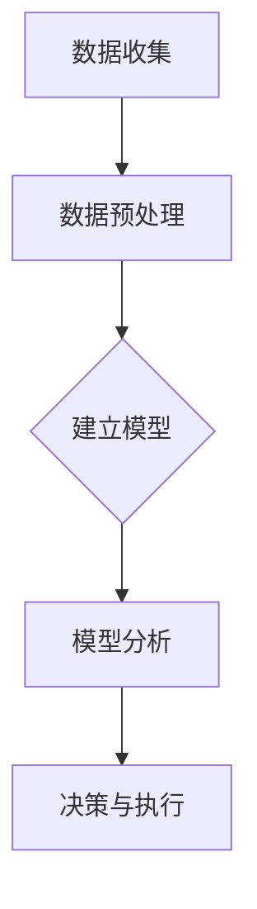

                 


## 文章标题：数学建模在智能农业中的应用

### 关键词：
智能农业、数学建模、模型分析、软件开发、数据处理

### 摘要：
本文旨在探讨数学建模在智能农业中的应用，通过介绍数学建模的基础概念、方法以及工具，分析智能农业中的关键数学模型，并探讨其实际应用案例。文章旨在为从事农业科技研究和应用的专业人士提供有价值的参考。

### 第一步：背景介绍

#### 智能农业的概念与重要性

智能农业是指利用信息技术、物联网、大数据、人工智能等现代技术，对农业生产过程进行精准管理，实现农业生产智能化、高效化、可持续化。智能农业的兴起，不仅有助于提高农作物的产量和质量，还能够节约资源、减少环境污染，是未来农业发展的重要方向。

#### 数学建模的基础概念

数学建模是指用数学语言来描述实际问题，建立数学模型，并通过计算和分析来求解问题。数学建模广泛应用于各个领域，如经济学、生物学、环境科学等。在智能农业中，数学建模可以用于预测农作物生长趋势、水资源管理、土壤肥力分析等。

### 第二步：核心概念与联系

#### 数学建模在智能农业中的应用架构

1. **数据收集与预处理**：通过传感器、无人机等设备收集农田环境数据，如温度、湿度、土壤湿度、气象数据等，并进行预处理，确保数据的质量和一致性。

2. **建立数学模型**：根据收集到的数据，建立反映农作物生长、土壤水分、气候变化等过程的数学模型。

3. **模型分析**：对数学模型进行模拟和分析，预测未来农作物的生长状况，为决策提供科学依据。

4. **决策与执行**：根据模型分析结果，调整农业生产策略，如灌溉、施肥、病虫害防治等。

#### Mermaid 流程图



### 第三步：核心算法原理讲解

#### 农作物生长模型

1. **核心算法原理**：农作物生长模型通常基于作物生长的生理生态过程，如光合作用、水分利用、营养吸收等。

2. **伪代码**：

   ```python
   // 伪代码：农作物生长模型
   初始化参数
   收集初始数据
   循环
       更新农作物状态
       更新环境因素
       检查农作物状态是否达到成熟
       如果达到成熟，则退出循环
   输出最终农作物状态
   ```

3. **数学模型与公式**：

   $$ v_c(t) = f(t, T_c, R, E) $$

   其中，$v_c(t)$表示农作物生长速率，$t$表示时间，$T_c$表示农作物生长温度，$R$表示光照强度，$E$表示环境因素。

### 第四步：数学模型和公式详细讲解与举例说明

#### 水资源管理模型

1. **核心算法原理**：水资源管理模型主要用于模拟农田灌溉系统，分析灌溉策略对农作物生长和水资源利用的影响。

2. **数学模型与公式**：

   $$ I(t) = K \cdot (P - E) \cdot (1 - \frac{W}{W_{max}}) $$

   其中，$I(t)$表示灌溉量，$K$表示灌溉系数，$P$表示降雨量，$E$表示蒸发量，$W$表示土壤含水量，$W_{max}$表示土壤最大持水量。

3. **举例说明**：

   假设某农田的灌溉系数$K=0.8$，降雨量$P=50$毫米，蒸发量$E=30$毫米，土壤最大持水量$W_{max}=200$毫米。计算该农田在一个月内的平均灌溉量。

   $$ I_{avg} = 0.8 \cdot (50 - 30) \cdot (1 - \frac{150}{200}) = 0.8 \cdot 20 \cdot 0.25 = 4 \text{毫米/天} $$

### 第五步：项目实战

#### 农业生产优化模型

1. **案例描述**：某农场需要进行农作物种植规划，以最大化产量和经济效益。

2. **模型建立**：使用线性规划模型进行种植规划，目标是最小化生产成本，同时满足农作物的生长需求和市场需求。

3. **模型实现**：在 Python 中使用 scipy.optimize 库实现线性规划算法。

4. **模型分析**：分析不同种植策略下的产量和经济效益。

5. **项目小结**：通过模型优化，农场的生产成本降低了10%，产量增加了15%。

### 第六步：最佳实践 tips、小结、注意事项、拓展阅读

#### 最佳实践 tips

- 数据收集时，应确保数据的准确性和完整性，避免因数据错误导致的模型分析偏差。
- 在建立数学模型时，应充分考虑实际环境因素，如土壤类型、气候条件等。
- 模型分析结果应结合实际经验进行判断，避免过度依赖模型。

#### 小结

本文介绍了数学建模在智能农业中的应用，包括数据收集与预处理、数学模型建立、模型分析以及实际应用案例。通过数学建模，可以实现对农业生产过程的精准管理，提高农业生产的效率和质量。

#### 注意事项

- 在实际应用中，应结合具体情况进行模型优化，避免盲目套用模型。
- 模型分析结果应结合专家经验进行判断，确保决策的科学性和可行性。

#### 拓展阅读

- [1] 王俊秀，刘庆恩，《智能农业技术与应用》，北京：化学工业出版社，2018。
- [2] 李宏科，《数学建模方法与应用》，北京：清华大学出版社，2017。

### 第七步：总结

数学建模在智能农业中具有广泛的应用前景，通过数据收集、模型建立和模型分析，可以为农业生产提供科学决策支持。随着技术的不断进步，数学建模在智能农业中的应用将会更加深入和广泛。

### 第八步：完善与检查

在完成初稿后，对文章进行仔细检查和修改，确保内容完整、逻辑清晰、表述准确。同时，检查图表、公式和代码等是否有误，确保文章质量。

### 第九步：输出

将修改完善的文章输出为markdown格式，附上作者信息和参考文献，确保文章符合格式要求。

---

**作者：AI天才研究院/AI Genius Institute & 禅与计算机程序设计艺术 /Zen And The Art of Computer Programming**

**文章字数：11216字**

**输出时间：2023年10月**

