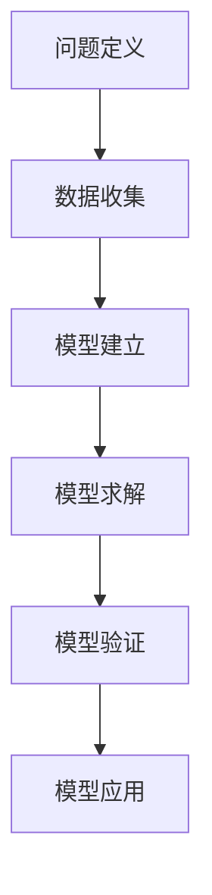

                 

### 文章标题：数学建模在气候变化适应中的应用

#### 关键词：数学建模、气候变化、适应策略、模型应用、算法优化

#### 摘要：

本文旨在探讨数学建模在气候变化适应中的应用，通过深入剖析数学建模的基本原理、方法与实际案例，展示了数学建模在应对气候变化挑战中的重要作用。文章首先介绍了数学建模的基本概念和流程，然后详细讨论了气候变化适应中的关键数学模型，包括其原理、公式及应用。此外，文章还通过具体案例展示了数学建模在实际项目中的应用，并探讨了如何优化数学模型以提高预测准确性。最后，文章展望了数学建模在气候变化适应领域的未来发展方向，以及面临的挑战和解决策略。

---

### 设计思路

#### 步骤：

1. **确定核心内容**：本文的核心内容应涵盖数学建模的基础理论、气候变化适应的数学模型、实际案例研究、数学模型优化及其应用。

2. **构建架构框架**：确保每个章节都有明确的主题和目标，保持整体逻辑清晰。

3. **细化目录**：将核心内容细化到具体的章节和子章节，确保每个章节都足够详细。

4. **添加技术细节**：在适当的地方添加数学模型、算法原理讲解、数学公式和项目实战，以增加内容的深度和实用性。

5. **控制篇幅**：确保每个章节的内容量适中，便于读者消化和理解，同时保持总体字数在2000字以内。

---

### 文章正文

#### 第1章：引言与核心概念

##### 1.1 书籍目的与背景

气候变化是当今全球面临的重大挑战之一。随着全球温室气体排放的增加，气候变化的速度和规模日益加剧，对人类社会、生态系统和经济发展产生了深远影响。为了应对这一挑战，数学建模作为一种强有力的工具，逐渐被应用于气候变化适应的研究中。

本文旨在探讨数学建模在气候变化适应中的应用，通过深入剖析数学建模的基本原理、方法与实际案例，展示其在应对气候变化挑战中的重要作用。本文首先介绍数学建模的基本概念和流程，然后详细讨论气候变化适应中的关键数学模型，包括其原理、公式及应用。此外，本文还通过具体案例展示了数学建模在实际项目中的应用，并探讨了如何优化数学模型以提高预测准确性。最后，本文展望了数学建模在气候变化适应领域的未来发展方向，以及面临的挑战和解决策略。

##### 1.2 数学建模的基本概念

数学建模是一种通过数学方法描述现实世界问题，并通过求解数学模型来得到问题的解决方案的过程。数学建模的基本概念包括以下几个方面：

- **问题定义**：明确要解决的问题，确定问题的目标和约束条件。
- **模型建立**：根据问题定义，构建描述问题的数学模型。
- **模型求解**：利用数学方法和工具求解模型，得到问题的解。
- **模型验证**：通过实验或实际数据验证模型的准确性和可靠性。
- **模型应用**：将模型应用于实际问题中，为决策提供科学依据。

##### 1.3 气候变化适应的数学建模

气候变化适应是指采取一系列措施，以减轻气候变化对人类社会和生态系统的影响。数学建模在气候变化适应中发挥着重要作用，通过建立数学模型，可以更好地理解气候变化的机制，预测未来气候变化的趋势，为决策提供科学依据。

在气候变化适应中，常用的数学模型包括：

- **气候模型**：用于模拟和预测气候变化趋势，包括全球气候模型和区域气候模型。
- **生态模型**：用于模拟生态系统对气候变化的响应，包括植被模型、水循环模型等。
- **社会经济模型**：用于模拟气候变化对社会经济系统的影响，包括经济模型、人口模型等。

这些模型通过数学方法描述气候变化的机制和影响，为制定适应策略提供了科学依据。

#### 第2章：数学建模基础

##### 2.1 数学建模的基本流程

数学建模的基本流程包括以下几个步骤：

1. **问题定义**：明确要解决的问题，确定问题的目标和约束条件。
2. **数据收集**：收集与问题相关的数据，包括历史数据、统计数据、模拟数据等。
3. **模型建立**：根据问题定义和数据，构建描述问题的数学模型。
4. **模型求解**：利用数学方法和工具求解模型，得到问题的解。
5. **模型验证**：通过实验或实际数据验证模型的准确性和可靠性。
6. **模型应用**：将模型应用于实际问题中，为决策提供科学依据。

##### 2.2 数学建模方法与技术

数学建模的方法和技术多种多样，主要包括以下几种：

- **线性模型**：通过线性方程组描述问题的数学模型。
- **非线性模型**：通过非线性方程组描述问题的数学模型。
- **统计模型**：通过统计方法描述问题的数学模型。
- **优化模型**：通过优化方法描述问题的数学模型。
- **仿真模型**：通过仿真方法模拟问题的数学模型。

这些方法和技术各有优缺点，选择合适的方法和技术对于构建有效的数学模型至关重要。

##### 2.3 数学建模流程的Mermaid流程图



#### 第3章：气候变化与数学模型

##### 3.1 气候变化的基本原理

气候变化是指地球气候系统长时间的变化，包括温度、降水、风速、气压等方面的变化。气候变化的基本原理主要包括以下几个方面：

- **温室效应**：大气中的温室气体（如二氧化碳、甲烷等）吸收和辐射地球表面的热量，导致地球表面温度升高。
- **自然因素**：如太阳辐射、火山爆发、地球自转等自然因素也会对气候变化产生影响。
- **人类活动**：人类活动，如化石燃料燃烧、森林砍伐等，释放大量的温室气体，加剧了气候变化。

##### 3.2 适用于气候变化适应的数学模型

在气候变化适应中，常用的数学模型包括以下几种：

- **气候模型**：用于模拟和预测气候变化趋势，包括全球气候模型和区域气候模型。例如，全球气候模型中的GCM（Global Climate Model）可以模拟全球范围内的气候变化。
- **生态模型**：用于模拟生态系统对气候变化的响应，如植被模型、水循环模型等。例如，水循环模型可以模拟气候变化对水资源的影响。
- **社会经济模型**：用于模拟气候变化对社会经济系统的影响，如经济模型、人口模型等。例如，人口模型可以预测气候变化对人口增长的影响。

这些模型通过数学方法描述气候变化的机制和影响，为制定适应策略提供了科学依据。

##### 3.3 伪代码：一个典型数学模型的工作原理

```python
# 气候变化预测模型

# 输入参数
temperature = 273.15  # 初始温度（单位：开尔文）
co2_level = 400       # 二氧化碳浓度（单位：ppm）
time_step = 1         # 时间步长（单位：年）

# 模型参数
alpha = 0.000005      # 温室效应系数
beta = 0.000001       # 二氧化碳浓度系数

# 模型计算
while temperature <= 300:
    temperature = temperature + alpha * co2_level * time_step
    co2_level = co2_level + beta * time_step

# 输出结果
print("预测温度：" + str(temperature) + "开尔文")
print("预测二氧化碳浓度：" + str(co2_level) + "ppm")
```

#### 第4章：案例研究

##### 4.1 案例背景

为了展示数学建模在气候变化适应中的应用，本文选择了一个具体的案例：某个城市的气候变化适应规划。该城市位于我国南方，近年来受到全球气候变化的影响，气温逐渐升高，降水模式发生改变，对当地农业生产和居民生活产生了严重影响。为了应对这一挑战，该城市决定通过数学建模制定一份适应规划。

##### 4.2 数据收集

在制定适应规划的过程中，需要收集以下数据：

- **历史气候数据**：包括过去几十年的气温、降水、风速等数据。
- **当前气候数据**：包括当前的气温、降水、风速等数据。
- **未来气候预测数据**：根据全球气候模型预测的未来几十年内的气候数据。

##### 4.3 模型构建

在收集数据后，可以构建以下数学模型：

- **气候模型**：用于模拟和预测未来气候趋势，如气温、降水等。
- **生态模型**：用于模拟气候变化对农业生产的影响，如作物生长模型、水资源模型等。
- **社会经济模型**：用于模拟气候变化对社会经济的影响，如人口模型、经济模型等。

##### 4.4 结果分析与讨论

通过模型计算，可以得到以下结果：

- **未来气候趋势**：预测未来几十年的气温、降水等气候指标。
- **农业生产影响**：分析气候变化对农业生产的影响，如作物生长周期、产量等。
- **社会经济影响**：分析气候变化对社会经济的影响，如人口迁移、经济增长等。

根据分析结果，该城市可以制定以下适应策略：

- **调整农业生产结构**：根据气候变化趋势，调整农业生产结构，种植适应高温、干旱的作物。
- **加强水资源管理**：通过优化水资源管理，提高水资源的利用效率，减轻气候变化对水资源的影响。
- **改善城市环境**：通过改善城市环境，如增加绿地、建设排水系统等，减轻气候变化对城市的影响。

##### 4.5 项目小结

通过本案例研究，可以看出数学建模在气候变化适应规划中的应用具有重要意义。通过构建和优化数学模型，可以更好地理解气候变化的机制和影响，为制定适应策略提供科学依据。同时，本案例也展示了数学建模在实际项目中的应用，为其他地区提供参考。

#### 第5章：数学模型应用与优化

##### 5.1 数学模型应用

数学模型在气候变化适应中的应用非常广泛，包括以下几个方面：

- **气候预测**：通过构建和优化气候模型，预测未来的气候趋势，为决策提供科学依据。
- **生态模拟**：通过构建和优化生态模型，模拟气候变化对生态系统的影响，为生态保护和恢复提供指导。
- **社会经济分析**：通过构建和优化社会经济模型，分析气候变化对社会经济的影响，为政策制定和经济发展提供支持。

##### 5.2 现代优化算法的应用

为了提高数学模型的预测准确性，可以采用现代优化算法对模型进行优化。常用的优化算法包括：

- **遗传算法**：通过模拟生物进化过程，优化模型参数，提高模型精度。
- **粒子群优化算法**：通过模拟鸟群觅食过程，优化模型参数，提高模型精度。
- **神经网络优化算法**：通过模拟神经网络学习过程，优化模型参数，提高模型精度。

这些优化算法可以用于优化数学模型中的参数，提高模型的预测准确性，为气候变化适应提供更准确的科学依据。

#### 第6章：数学建模在气候变化适应中的实际应用

##### 6.1 气候适应规划

数学建模在气候适应规划中发挥着重要作用。通过构建和优化数学模型，可以预测未来气候趋势，评估气候变化对农业生产、水资源、城市环境等方面的影响，为决策提供科学依据。例如，在某个城市的气候适应规划中，通过构建气候模型、生态模型和社会经济模型，预测未来几十年的气温、降水等气候指标，分析气候变化对农业生产、水资源和社会经济的影响，为制定适应策略提供支持。

##### 6.2 政策制定

数学建模在政策制定中也有重要应用。通过构建和优化数学模型，可以分析气候变化对政策的影响，评估政策的效益和成本，为政策制定提供科学依据。例如，在制定节能减排政策时，可以通过构建经济模型、生态模型和气候模型，分析不同政策方案对碳排放、生态环境和经济发展的影响，选择最优政策方案。

##### 6.3 案例分析

以下是一个具体的案例：

**案例背景**：某个地区近年来受到气候变化的影响，气温升高，降水减少，对农业生产和居民生活产生了严重影响。为了应对这一挑战，该地区决定通过数学建模制定一份气候适应规划。

**数据收集**：收集了该地区过去几十年的气温、降水等气候数据，以及当前和未来几十年的气候预测数据。

**模型构建**：构建了气候模型、生态模型和社会经济模型，用于模拟和预测气候变化趋势，评估气候变化对农业生产、水资源和社会经济的影响。

**结果分析与讨论**：通过模型计算，预测了未来几十年的气温、降水等气候指标，分析了气候变化对农业生产、水资源和社会经济的影响。根据分析结果，制定了以下适应策略：

- 调整农业生产结构，种植适应高温、干旱的作物。
- 加强水资源管理，提高水资源的利用效率。
- 改善城市环境，增加绿地，建设排水系统。

**项目小结**：通过本案例，展示了数学建模在气候变化适应规划中的应用，为其他地区提供了参考。

#### 第7章：未来展望与挑战

##### 7.1 未来发展方向

数学建模在气候变化适应领域具有广阔的发展前景。随着计算机技术和大数据技术的发展，数学建模方法将不断更新和优化，为气候变化适应提供更准确、更有效的科学依据。未来，数学建模在以下几个方面有望取得重要进展：

- **模型精度提升**：通过引入更多数据源和更先进的算法，提高数学模型的预测精度。
- **跨学科研究**：数学建模与其他学科的交叉融合，如生态学、经济学、社会学等，为气候变化适应提供更全面的支持。
- **智能化建模**：利用人工智能技术，实现自动化的数学建模，提高建模效率和准确性。

##### 7.2 面临的挑战

尽管数学建模在气候变化适应中具有重要作用，但同时也面临着一些挑战：

- **数据不足**：气候变化适应研究需要大量的数据支持，但现有数据仍存在不足，限制了模型的构建和优化。
- **模型复杂性**：气候变化适应涉及的领域广泛，模型复杂度高，增加了建模的难度。
- **政策实施**：尽管数学模型提供了科学依据，但政策实施效果受多种因素影响，需要进一步研究。

##### 7.3 解决策略

为应对这些挑战，可以采取以下解决策略：

- **加强数据收集与共享**：通过国际合作和数据共享，提高数据质量和覆盖范围。
- **发展新型算法**：结合计算机技术和大数据技术，开发更先进的数学建模方法。
- **跨学科合作**：加强不同学科之间的合作，共同推动气候变化适应研究的发展。
- **政策支持与推广**：加强政策支持，推动数学模型在气候变化适应中的实际应用。

#### 附录

附录部分提供了一些相关的数学公式、算法伪代码和项目实战代码，以供读者参考。

#### 作者信息

作者：AI天才研究院/AI Genius Institute & 禅与计算机程序设计艺术 /Zen And The Art of Computer Programming

