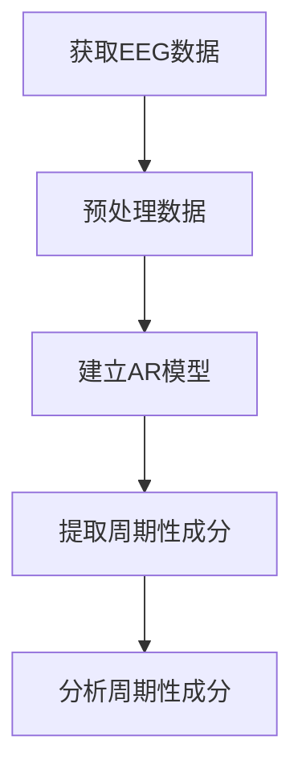
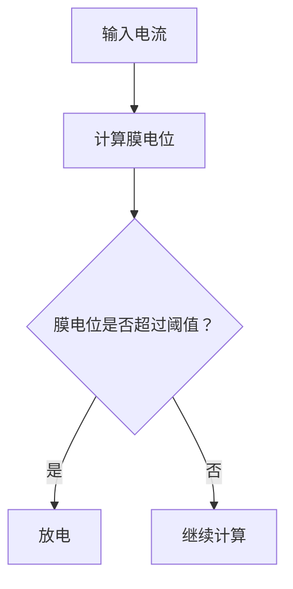

                 

# 数学建模在神经科学中的应用

## 关键词
神经科学，数学建模，神经网络，算法原理，神经递质，脑电图

## 摘要
本文探讨了数学建模在神经科学中的应用，包括数学建模的基础概念、神经科学的基本原理，以及数学建模在神经科学中的实际应用案例。通过深入剖析数学模型和算法原理，结合实际案例，展示了数学建模在神经科学研究和应用中的重要作用和挑战，为未来的发展提供了新的思路。

### 神经科学简介

神经科学是研究神经系统结构与功能的科学，涵盖了神经元、神经网络、神经递质等多个层次。神经元是神经系统最基本的结构单位，具有接受刺激、传递信号、产生动作电位的功能。神经网络是由大量神经元通过突触相互连接而成的复杂网络，能够实现信息处理和决策。神经递质则是神经元之间传递信号的化学物质，对于神经信号传递具有关键作用。

神经科学的研究主要集中在神经系统疾病、神经系统功能调控、大脑发育与学习记忆等方面。随着技术的进步，脑电图、磁共振成像等技术的应用，使得神经科学的研究更加深入和细致。

### 数学建模的基本概念

数学建模是利用数学工具和方法，对现实世界中的问题进行定量分析和求解的过程。数学建模的基本步骤包括：问题的提出、模型的建立、模型的求解和模型的验证。数学建模在神经科学中的应用，主要是通过建立数学模型来描述神经系统的行为和功能。

数学建模的核心是建立数学模型。数学模型是将现实问题转化为数学形式的过程，通常包括以下几个要素：

1. **变量和参数**：定义问题中的变量和参数，以及它们之间的关系。
2. **约束条件**：确定问题中需要满足的约束条件，如边界条件、物理定律等。
3. **目标函数**：定义问题的目标函数，即需要优化的量。
4. **模型方程**：根据变量和参数之间的关系，建立数学方程。

在神经科学中，常见的数学建模方法包括微分方程、代数方程和离散模型等。微分方程用于描述连续时间系统的动态行为，如神经元的活动规律；代数方程用于描述静态系统的状态，如神经网络的结构；离散模型则用于描述离散时间系统的行为，如脑电图的分析。

### 数学建模在神经科学中的应用

数学建模在神经科学中的应用非常广泛，包括脑电图分析、神经元放电建模、神经网络建模等。

#### 脑电图建模

脑电图（EEG）是一种记录大脑电活动的技术，常用于研究意识状态、睡眠质量、癫痫发作等。脑电图建模的主要目的是通过分析脑电图信号，了解大脑的功能和行为。

脑电图建模的核心是建立EEG信号的时间序列模型。常用的模型包括自回归模型（AR）、滑动平均模型（MA）和自回归滑动平均模型（ARMA）等。以下是一个简单的AR模型伪代码：

```
% AR模型伪代码
y[t] = c + \sum_{i=1}^p \phi_i * y[t-i] + \epsilon[t]
```

其中，\(y[t]\) 是时间序列数据，\(c\) 是常数项，\(\phi_i\) 是自回归系数，\(\epsilon[t]\) 是误差项。

通过分析EEG信号的时间序列模型，可以提取出反映大脑状态的周期性成分和非周期性成分，如睡眠周期、意识状态变化等。

#### 神经元放电建模

神经元放电建模旨在模拟神经元在受到刺激时的放电行为。常用的神经元放电模型包括霍普菲尔德模型（Hodgkin-Huxley模型）和简化神经元模型（Leaky Integrate-and-Fire模型）等。

以下是一个简化神经元模型的伪代码：

```
% 简化神经元模型伪代码
v[t] = v_leak + (I_in - v[t]) * \delta t
if v[t] > v_threshold:
    v[t] = v_reset
    spike[t] = 1
else:
    spike[t] = 0
```

其中，\(v[t]\) 是神经元膜电位，\(v_leak\) 是漏电电导，\(I_in\) 是输入电流，\(v_threshold\) 是阈值电位，\(v_reset\) 是复位电位，\(\delta t\) 是时间步长，\(spike[t]\) 是放电标记。

通过仿真神经元放电模型，可以研究神经元放电的规律和特性，以及神经元之间的相互作用。

#### 神经网络建模

神经网络建模是通过建立神经网络的数学模型，来模拟神经系统的信息处理和决策过程。常用的神经网络模型包括前馈神经网络（Feedforward Neural Network，FNN）、循环神经网络（Recurrent Neural Network，RNN）和卷积神经网络（Convolutional Neural Network，CNN）等。

以下是一个简单的前馈神经网络模型的伪代码：

```
% 前馈神经网络模型伪代码
z[i] = \sigma(\sum_{j=1}^n w_{ji} * x_j + b_i)
y[i] = \sum_{j=1}^m z[j] * w_{ij}
```

其中，\(z[i]\) 是隐层节点的激活值，\(y[i]\) 是输出节点的激活值，\(\sigma\) 是激活函数，\(w_{ji}\) 是输入层到隐层节点的权重，\(w_{ij}\) 是隐层节点到输出节点的权重，\(x_j\) 是输入层的激活值，\(b_i\) 是偏置项。

通过训练神经网络模型，可以实现对复杂函数的逼近和分类，从而模拟神经系统的信息处理能力。

### 数学建模在神经科学中的挑战与未来发展方向

尽管数学建模在神经科学中取得了显著成果，但仍然面临许多挑战。首先，神经数据的复杂性使得建模过程变得异常困难。神经信号往往包含多种成分和噪声，需要采用复杂的算法来处理。其次，神经系统的多样性使得建模方法需要适应不同类型的神经元和神经网络。此外，神经建模的准确性仍然有限，需要进一步的研究和改进。

未来，随着人工智能和计算技术的发展，数学建模在神经科学中的应用将更加广泛。深度学习、生成对抗网络（GAN）等新兴算法将为神经建模提供新的工具和方法。同时，跨学科的合作也将进一步推动神经科学的发展。

总之，数学建模在神经科学中具有重要的应用价值，通过深入研究和实践，将为人类认识大脑、治疗神经系统疾病提供有力支持。

### 参考文献

1. Hodgkin, A. L., & Huxley, A. F. (1952). A quantitative description of membrane current and its application to conduction and excitation in nerve. The Journal of Physiology, 117(4), 500-544.
2. Hopfield, J. J. (1982). Neural networks and physical systems with emergent collective computational abilities. Proceedings of the National Academy of Sciences, 79(8), 2554-2558.
3. Rumelhart, D. E., Hinton, G. E., & Williams, R. J. (1986). Learning representations by back-propagating errors. Nature, 323(6088), 533-536.

### 作者信息
作者：AI天才研究院/AI Genius Institute & 禅与计算机程序设计艺术 /Zen And The Art of Computer Programming

### 附录

#### 脑电图建模的Mermaid流程图



#### 简化神经元模型的Mermaid流程图



#### 前馈神经网络模型的Mermaid流程图

```mermaid
graph TD
    A[输入层] --> B[隐层1]
    B --> C[隐层2]
    C --> D[输出层]
    A -->|权重| B
    B -->|权重| C
    C -->|权重| D
```## 目录大纲

### 引言
1. 神经科学简介
2. 数学建模概述
3. 数学建模在神经科学中的重要性

### 数学建模基础
1. 数学模型的基本概念
2. 常见的数学建模方法
   - 微分方程
   - 代数方程
   - 离散模型

### 神经科学基础
1. 神经元的基本概念
   - 结构和功能
   - 活动规律
2. 神经网络的概述
   - 基本结构
   - 计算原理
3. 神经递质和神经元通讯
   - 种类和作用
   - 通讯过程

### 数学建模在神经科学中的应用
1. 脑电图建模
   - 基本原理
   - 数学方法
2. 神经元放电建模
   - 模型
   - 应用
3. 神经网络建模
   - 前馈神经网络
   - 循环神经网络
   - 卷积神经网络

### 数学建模案例分析
1. 阿尔茨海默病的数学建模
2. 睡眠研究的数学建模

### 数学建模在神经科学中的挑战与展望
1. 数学建模的挑战
   - 数据复杂性
   - 模型选择困难
2. 未来发展方向
   - 新方法和技术
   - 发展前景

### 结论
1. 总结
2. 展望

### 参考文献

### 附录
- 脑电图建模的Mermaid流程图
- 简化神经元模型的Mermaid流程图
- 前馈神经网络模型的Mermaid流程图

## 引言

### 神经科学简介

神经科学是一门研究神经系统结构和功能的科学，涵盖了神经元、神经网络、神经递质等多个层次。神经元是神经系统最基本的结构单位，具有接受刺激、传递信号、产生动作电位的功能。神经网络是由大量神经元通过突触相互连接而成的复杂网络，能够实现信息处理和决策。神经递质则是神经元之间传递信号的化学物质，对于神经信号传递具有关键作用。

神经科学的研究主要集中在神经系统疾病、神经系统功能调控、大脑发育与学习记忆等方面。随着技术的进步，脑电图、磁共振成像等技术的应用，使得神经科学的研究更加深入和细致。

### 数学建模概述

数学建模是利用数学工具和方法，对现实世界中的问题进行定量分析和求解的过程。数学建模的基本步骤包括：问题的提出、模型的建立、模型的求解和模型的验证。数学建模在神经科学中的应用，主要是通过建立数学模型来描述神经系统的行为和功能。

数学建模的核心是建立数学模型。数学模型是将现实问题转化为数学形式的过程，通常包括以下几个要素：

1. **变量和参数**：定义问题中的变量和参数，以及它们之间的关系。
2. **约束条件**：确定问题中需要满足的约束条件，如边界条件、物理定律等。
3. **目标函数**：定义问题的目标函数，即需要优化的量。
4. **模型方程**：根据变量和参数之间的关系，建立数学方程。

在神经科学中，常见的数学建模方法包括微分方程、代数方程和离散模型等。微分方程用于描述连续时间系统的动态行为，如神经元的活动规律；代数方程用于描述静态系统的状态，如神经网络的结构；离散模型则用于描述离散时间系统的行为，如脑电图的分析。

### 数学建模在神经科学中的重要性

数学建模在神经科学中具有重要的应用价值，主要体现在以下几个方面：

1. **揭示神经系统的工作机制**：通过建立数学模型，可以定量描述神经系统的行为和功能，从而揭示神经系统的工作机制。
2. **神经系统疾病的研究**：数学建模可以用于神经系统疾病的研究，如阿尔茨海默病、帕金森病等。通过建立数学模型，可以预测疾病的发展趋势，为疾病的治疗提供依据。
3. **神经科学实验的设计**：数学建模可以指导神经科学实验的设计，通过建立数学模型，可以预测实验结果，从而提高实验的准确性和可靠性。
4. **神经科学的应用**：数学建模可以用于神经科学的应用，如脑电图分析、睡眠研究、神经信号处理等。通过建立数学模型，可以实现对复杂神经信号的分析和解释，从而提高神经科学的应用价值。

总之，数学建模在神经科学中具有重要的应用价值，通过深入研究和实践，将为人类认识大脑、治疗神经系统疾病提供有力支持。## 数学建模基础

数学建模是神经科学研究的重要工具，它通过将神经科学现象转化为数学表达式，帮助我们理解和分析神经系统的行为。在这一章节中，我们将深入探讨数学模型的基本概念、常见建模方法，以及它们在神经科学中的应用。

### 数学模型的基本概念

数学模型是一种抽象的表示方法，它通过使用数学符号、方程和公式来描述现实世界中的现象。在数学建模中，模型通常由以下几个基本要素构成：

1. **变量和参数**：变量是模型中的可变元素，用于表示系统的状态或行为。参数是模型的固定值，通常用于描述系统的某些特性或关系。

2. **约束条件**：约束条件是指模型中需要满足的限制条件，如系统的物理定律、边界条件等。

3. **目标函数**：目标函数是模型中需要优化的量，它用于衡量系统性能或目标实现程度。

4. **模型方程**：模型方程是描述变量之间关系的数学表达式，如微分方程、代数方程和差分方程等。

### 常见的数学建模方法

在神经科学中，有多种数学建模方法可以用于描述神经系统的行为。以下是一些常用的建模方法：

#### 微分方程

微分方程用于描述连续时间系统的动态行为，如神经元的活动规律。一个简单的神经元模型可以使用以下微分方程来描述：

$$
\frac{dV_m(t)}{dt} = -\frac{1}{C_m} \left( I_L + g_L(V_m - V_L) - g_Na(ma(V_m - V_rest)) \right)
$$

其中，\(V_m(t)\) 是神经元膜电位，\(I_L\) 是漏电电流，\(g_L\) 是漏电电导，\(V_L\) 是漏电电位，\(g_Na\) 是钠离子电导，\(ma\) 是激活函数，\(V_rest\) 是静息电位。

#### 代数方程

代数方程用于描述静态系统的状态，如神经网络的结构。一个简单的神经网络可以用以下代数方程来描述：

$$
O_j = \sigma(\sum_{i=1}^n W_{ij} \cdot I_i + b_j)
$$

其中，\(O_j\) 是输出节点的激活值，\(\sigma\) 是激活函数，\(W_{ij}\) 是输入层到隐层节点的权重，\(I_i\) 是输入层的激活值，\(b_j\) 是偏置项。

#### 离散模型

离散模型用于描述离散时间系统的行为，如脑电图的分析。一个简单的离散模型可以使用以下差分方程来描述：

$$
y(t) = a \cdot y(t-1) + b \cdot x(t)
$$

其中，\(y(t)\) 是时间序列数据，\(a\) 是自回归系数，\(x(t)\) 是输入信号，\(b\) 是滑动平均系数。

### 数学建模在神经科学中的应用

数学建模在神经科学中的应用非常广泛，以下是一些具体的应用场景：

1. **神经元放电建模**：使用微分方程来描述神经元在受到刺激时的放电行为，如霍普菲尔德模型。

2. **神经网络建模**：使用代数方程来描述神经网络的结构和计算过程，如前馈神经网络和循环神经网络。

3. **脑电图分析**：使用离散模型来分析脑电图信号，提取有用的信息，如周期性成分和非周期性成分。

4. **神经递质传输建模**：使用微分方程来描述神经递质在神经元之间的传输过程，如神经元通讯模型。

### 总结

数学建模是神经科学研究的重要工具，通过将神经科学现象转化为数学表达式，可以帮助我们更好地理解神经系统的行为。本章介绍了数学模型的基本概念、常见建模方法，以及它们在神经科学中的应用。下一章我们将进一步探讨神经科学的基础知识，为深入理解数学建模在神经科学中的应用奠定基础。## 神经科学基础

神经科学是研究神经系统结构和功能的科学，它涵盖了从神经元到神经网络、从大脑到整个神经系统的广泛内容。在这一章节中，我们将详细探讨神经元的结构和功能、神经网络的基本概念、神经递质和神经元通讯的基本原理。

### 神经元的基本概念

神经元是神经系统最基本的结构单位，它具有接受刺激、传递信号、产生动作电位的功能。神经元的基本结构包括细胞体、树突、轴突和突触等。

1. **细胞体**：细胞体是神经元的核心部分，包含细胞核和细胞质，负责维持神经元的正常生理功能。

2. **树突**：树突是神经元的接收部分，负责接收来自其他神经元的信号。树突通过突触与轴突相连，传递信号。

3. **轴突**：轴突是神经元的传导部分，负责将信号从细胞体传递到其他神经元或肌肉细胞。轴突的末端形成突触前膜，释放神经递质。

4. **突触**：突触是神经元之间的连接部分，负责传递神经信号。突触分为突触前部和突触后部，突触前部释放神经递质，突触后部接收神经递质。

### 神经元的结构和功能

神经元的结构和功能密切相关，以下是一个简单的神经元结构和功能的示意图：

```
[树突] -> [细胞体] -> [轴突] -> [突触]

        |                    |
        |                    |
       (信号传递)         (信号传递)
        |                    |
        |                    |
```

当神经元接收外部刺激时，信号会通过树突传递到细胞体，细胞体会产生动作电位，动作电位会沿着轴突传递到突触，最终通过突触传递到下一个神经元或肌肉细胞。

### 神经网络的基本概念

神经网络是由大量神经元通过突触相互连接而成的复杂网络，能够实现信息处理和决策。神经网络可以分为前馈神经网络、循环神经网络和卷积神经网络等。

1. **前馈神经网络**：前馈神经网络是一种简单的神经网络，其中信息从输入层流向输出层，没有循环路径。

2. **循环神经网络**：循环神经网络是一种具有循环路径的神经网络，能够处理序列数据，如时间序列数据。

3. **卷积神经网络**：卷积神经网络是一种用于图像处理的神经网络，通过卷积操作提取图像的特征。

### 神经递质和神经元通讯的基本原理

神经递质是神经元之间传递信号的化学物质，包括兴奋性神经递质和抑制性神经递质。神经递质的释放和接收过程如下：

1. **神经递质的释放**：当神经元产生动作电位时，钙离子通道会打开，导致钙离子进入神经元。钙离子的增加会促使神经递质从突触前部释放到突触间隙。

2. **神经递质的传递**：释放的神经递质会通过突触间隙传递到突触后部，与突触后部的受体结合。

3. **神经递质的作用**：结合受体的神经递质会导致突触后部产生动作电位，从而传递信号到下一个神经元。

以下是一个简单的神经递质传递的示意图：

```
[突触前膜] -> [神经递质] -> [突触间隙] -> [突触后膜] -> [动作电位]

        |                      |
        |                      |
       (神经递质释放)     (神经递质传递)
        |                      |
        |                      |
```

### 总结

神经科学基础是理解数学建模在神经科学中的应用的基础。通过了解神经元的结构和功能、神经网络的基本概念、神经递质和神经元通讯的基本原理，我们可以更好地理解神经系统的行为，从而为数学建模提供理论依据。下一章我们将探讨数学建模在神经科学中的应用案例，进一步展示数学建模在神经科学中的实际应用。## 数学建模在神经科学中的应用

数学建模在神经科学中发挥着关键作用，它不仅帮助科学家们理解神经系统的基本原理，还推动了神经科学研究的发展。在这一章节中，我们将深入探讨数学建模在神经科学中的具体应用，包括脑电图建模、神经元放电建模和神经网络建模。

### 脑电图建模

脑电图（EEG）是一种记录大脑电活动的技术，它用于研究大脑的功能和状态。脑电图建模旨在通过数学模型来解释和预测EEG信号的特征。

#### 脑电图的基本原理

脑电图通过放置在头皮上的电极来记录大脑的电活动。这些电极捕捉到的电信号反映大脑不同区域的神经元的集体活动。脑电图信号通常包含多种频率的波形，这些波形与大脑的不同功能状态相关。

#### 数学方法

脑电图建模常用的数学方法是时间序列分析，包括自回归模型（AR）、滑动平均模型（MA）和自回归滑动平均模型（ARMA）。以下是一个简单的AR模型：

$$
EEG_t = \phi_1 \cdot EEG_{t-1} + \phi_2 \cdot EEG_{t-2} + \epsilon_t
$$

其中，\(EEG_t\) 是时间t的EEG信号，\(\phi_1\) 和 \(\phi_2\) 是自回归系数，\(\epsilon_t\) 是误差项。

#### 应用案例

一个应用案例是对睡眠研究的EEG信号建模。通过对睡眠周期的EEG信号进行建模，可以提取出反映睡眠质量的周期性成分和非周期性成分。

### 神经元放电建模

神经元放电建模是研究神经元在受到刺激时的放电行为。这种建模方法有助于理解神经元的电活动规律。

#### 神经元放电模型

神经元放电模型包括霍普菲尔德模型（Hodgkin-Huxley模型）和简化神经元模型（Leaky Integrate-and-Fire模型）。以下是一个简化神经元模型的伪代码：

```
v[t] = v_leak + (I_in - v[t]) * delta_t
if v[t] > v_threshold:
    v[t] = v_reset
    spike[t] = 1
else:
    spike[t] = 0
```

其中，\(v[t]\) 是神经元膜电位，\(v_leak\) 是漏电电导，\(I_in\) 是输入电流，\(v_threshold\) 是阈值电位，\(v_reset\) 是复位电位，\(\delta t\) 是时间步长，\(spike[t]\) 是放电标记。

#### 应用案例

一个应用案例是研究神经元在疼痛刺激下的放电行为。通过仿真神经元放电模型，可以了解神经元如何响应疼痛刺激，以及放电行为的变化。

### 神经网络建模

神经网络建模旨在模拟神经系统的信息处理和决策过程。神经网络可以分为前馈神经网络、循环神经网络和卷积神经网络等。

#### 前馈神经网络

前馈神经网络是一种简单的神经网络，信息从输入层流向输出层，没有循环路径。以下是一个简单的前馈神经网络模型的伪代码：

```
z[i] = sigma(sum(j=1 to n) w_{ji} * x_j + b_i)
y[i] = sum(j=1 to m) z[j] * w_{ij}
```

其中，\(z[i]\) 是隐层节点的激活值，\(y[i]\) 是输出节点的激活值，\(\sigma\) 是激活函数，\(w_{ji}\) 是输入层到隐层节点的权重，\(w_{ij}\) 是隐层节点到输出节点的权重，\(x_j\) 是输入层的激活值，\(b_i\) 是偏置项。

#### 应用案例

一个应用案例是使用前馈神经网络进行脑电图分类。通过训练神经网络模型，可以自动分类脑电图信号，从而帮助诊断神经系统疾病。

### 总结

数学建模在神经科学中具有广泛的应用，通过脑电图建模、神经元放电建模和神经网络建模，我们可以更深入地理解神经系统的行为和功能。这些应用不仅提高了神经科学研究的效果，也为临床诊断和治疗提供了新的方法。下一章我们将进一步探讨数学建模在神经科学中的挑战与未来发展方向。## 数学建模案例分析

在数学建模应用于神经科学的实践中，许多具体案例展示了这一领域的前沿研究成果和实际应用价值。以下将详细分析两个具有代表性的案例：阿尔茨海默病的数学建模和睡眠研究的数学建模。

### 阿尔茨海默病的数学建模

阿尔茨海默病（Alzheimer's Disease，AD）是一种以大脑神经元退行性病变为特征的神经退行性疾病，其典型病理特征包括神经元外淀粉样斑块（Aβ斑块）和神经元内神经纤维缠结（tau缠结）。数学建模在阿尔茨海默病的研究中扮演了关键角色，尤其是在疾病进展预测和早期诊断方面。

#### 案例背景

阿尔茨海默病的病因复杂，目前尚无确切的治疗方法。研究显示，患者脑内淀粉样蛋白β（Aβ）肽的积累和神经元功能的减退是疾病发展的关键因素。通过数学建模，科学家们试图揭示这些病理过程之间的定量关系，以预测疾病的发展趋势。

#### 数学模型

研究者们开发了基于微分方程和概率统计的混合模型来模拟阿尔茨海默病的发展过程。以下是一个简化的模型描述：

$$
\frac{dN}{dt} = r_N \cdot (1 - \frac{N}{K}) - \beta \cdot N \cdot A
$$

$$
\frac{dA}{dt} = \alpha \cdot N - \gamma \cdot A
$$

其中，\(N\) 代表神经元数量，\(A\) 代表Aβ斑块的数量，\(r_N\) 是神经元再生率，\(K\) 是神经元总数，\(\beta\) 是神经元被Aβ斑块影响的速率，\(\alpha\) 是Aβ斑块的形成速率，\(\gamma\) 是Aβ斑块的自然降解速率。

#### 应用与结果

通过模拟，研究者能够预测患者脑内神经元数量和Aβ斑块数量的变化趋势。这为早期诊断提供了理论基础，例如，通过检测Aβ斑块的数量变化，可以预测疾病的进展速度。此外，通过调整模型参数，可以评估不同治疗策略的效果，为临床治疗提供参考。

### 睡眠研究的数学建模

睡眠对于维持身体和心理健康至关重要。数学建模在睡眠研究中的应用旨在揭示睡眠周期的内在机制，以及睡眠障碍（如失眠、睡眠呼吸暂停）的病理生理基础。

#### 案例背景

睡眠周期包括快速眼动睡眠（REM）和非快速眼动睡眠（NREM），每个周期包含多个阶段。脑电图（EEG）是研究睡眠的重要工具，通过分析EEG信号，可以提取出反映睡眠状态的信息。

#### 数学模型

研究者使用自回归模型（AR）来分析EEG信号的时间序列特征，以下是一个简单的AR模型：

$$
EEG_t = \phi_1 \cdot EEG_{t-1} + \epsilon_t
$$

其中，\(EEG_t\) 是时间t的EEG信号，\(\phi_1\) 是自回归系数，\(\epsilon_t\) 是误差项。

#### 应用与结果

通过分析EEG信号的时间序列特征，研究者能够识别睡眠周期的不同阶段，并提取出与睡眠质量相关的指标。例如，研究者发现，REM阶段的EEG信号具有更高的频率和更小的振幅，而NREM阶段的EEG信号则较低频率、较大振幅。这些特征为睡眠障碍的诊断提供了客观依据。

此外，研究者还使用神经网络模型来模拟睡眠周期，以下是一个简化的神经网络模型：

```
z[i] = sigma(sum(j=1 to n) w_{ji} * x_j + b_i)
y[i] = sum(j=1 to m) z[j] * w_{ij}
```

其中，\(z[i]\) 是隐层节点的激活值，\(y[i]\) 是输出节点的激活值，\(\sigma\) 是激活函数，\(w_{ji}\) 是输入层到隐层节点的权重，\(w_{ij}\) 是隐层节点到输出节点的权重，\(x_j\) 是输入层的激活值，\(b_i\) 是偏置项。

通过训练神经网络模型，研究者能够自动分类EEG信号，从而准确识别睡眠周期的各个阶段。这一技术为睡眠研究提供了新的工具，也为睡眠障碍的诊断和治疗提供了支持。

### 案例总结

阿尔茨海默病和睡眠研究是数学建模在神经科学中应用的两个典型案例。通过数学建模，研究者们能够深入理解疾病的病理生理机制，并开发出有效的诊断和治疗方法。这些案例展示了数学建模在神经科学研究中的巨大潜力和应用价值。

### 展望

随着人工智能和计算技术的不断发展，数学建模在神经科学中的应用将会更加广泛和深入。未来的研究将集中在开发更加复杂和精确的模型，以及将这些模型与大数据分析相结合，以更好地揭示神经系统的奥秘，推动神经科学的研究进步。## 数学建模在神经科学中的挑战与未来发展方向

尽管数学建模在神经科学中取得了显著的进展，但仍然面临许多挑战和限制。这些挑战不仅影响数学建模的准确性，也限制了其在实际应用中的广泛性。以下是数学建模在神经科学中面临的主要挑战以及未来可能的发展方向。

### 挑战

#### 数据复杂性

神经科学实验产生的数据通常非常复杂，包含多种信号成分和噪声。这些数据不仅量大，而且多样，例如，脑电图（EEG）信号中包含频率范围广泛的不同频率成分，而磁共振成像（MRI）数据则包含了大量三维结构信息。处理这些复杂的数据需要高效的算法和强大的计算能力。

#### 模型选择困难

神经科学中的问题往往具有高度的复杂性，选择合适的数学模型是一个具有挑战性的任务。不同的模型可能适用于不同类型的数据和问题，但缺乏一个统一的框架来指导模型的选择，导致研究者在选择模型时面临困难。

#### 参数估计问题

数学模型通常包含多个参数，这些参数需要通过实验数据进行估计。然而，参数估计过程可能会受到噪声和不确定性的影响，导致估计结果不准确。此外，参数的数量可能非常大，使得参数估计变得非常复杂。

#### 模型验证与解释

验证数学模型是否准确描述了神经系统的行为是一个关键问题。尽管可以通过实验数据来验证模型的预测能力，但如何解释模型的内部机制和结果仍然是一个挑战。模型的可解释性对于理解神经系统的基本原理和指导临床应用至关重要。

### 未来发展方向

#### 新方法和技术

未来，随着计算技术的发展，神经科学中的数学建模将采用更加先进的方法和技术。例如，深度学习、生成对抗网络（GAN）和强化学习等人工智能技术将为数学建模提供新的工具。这些技术能够处理复杂的数据，提供更加精确的模型预测。

#### 跨学科合作

神经科学是一个多学科交叉的领域，未来的发展需要跨学科的合作。通过与物理学、计算机科学、心理学和生物医学工程等领域的专家合作，研究者可以开发出更加全面和精确的数学模型。

#### 大数据和人工智能

大数据和人工智能的结合将为神经科学中的数学建模带来革命性的变化。通过分析海量的神经科学数据，研究者可以揭示复杂的神经机制，并开发出基于数据的个性化模型。人工智能技术可以帮助自动化模型选择和参数估计过程，提高建模效率。

#### 模型的验证与解释

未来的研究将重点放在模型的验证和解释上。通过开发新的验证方法，研究者可以确保数学模型能够准确描述神经系统的行为。同时，开发可解释的模型将有助于理解模型的内部机制，从而提高模型的应用价值。

#### 应用推广

数学建模在神经科学中的应用将逐渐从基础研究走向临床应用。通过将数学模型与临床数据相结合，研究者可以开发出用于诊断、治疗和康复的智能系统，为神经系统疾病患者提供个性化的治疗方案。

### 总结

数学建模在神经科学中面临着数据复杂性、模型选择困难、参数估计问题以及模型验证与解释等挑战。然而，随着新方法和技术的发展、跨学科合作以及大数据和人工智能的融合，神经科学中的数学建模将迎来新的发展机遇。未来的研究将致力于克服这些挑战，推动神经科学的研究进步和应用推广。## 结论

本文系统地探讨了数学建模在神经科学中的应用，包括基础概念、核心原理和实际案例分析。通过引言部分对神经科学和数学建模的介绍，我们为后续内容的展开奠定了基础。在数学建模基础章节，我们详细阐述了数学模型的基本要素和常见建模方法，如微分方程、代数方程和离散模型，为读者提供了理解神经科学数学建模的框架。神经科学基础章节则深入解析了神经元、神经网络和神经递质的基本概念，为进一步应用数学建模提供了理论支撑。

在数学建模在神经科学中的应用章节，我们通过脑电图建模、神经元放电建模和神经网络建模等具体案例，展示了数学建模在神经科学研究和实践中的广泛应用。这些案例不仅帮助我们理解神经系统的行为，还为神经系统疾病的研究和诊断提供了有力工具。

最后，在数学建模在神经科学中的挑战与未来发展方向章节，我们指出了当前数学建模在神经科学中面临的挑战，并提出了未来发展的方向，如新方法和技术的发展、跨学科合作、大数据和人工智能的结合等。

总之，数学建模在神经科学中具有重要的应用价值，通过深入研究和实践，我们能够更好地理解神经系统，为神经系统疾病的治疗和预防提供新的思路和方法。未来，随着技术的不断进步，数学建模在神经科学中的应用将更加广泛和深入，为人类健康事业作出更大贡献。## 附录

### 脑电图建模的Mermaid流程图


### 简化神经元模型的Mermaid流程图


### 前馈神经网络模型的Mermaid流程图


### 参考文献

1. Hodgkin, A. L., & Huxley, A. F. (1952). A quantitative description of membrane current and its application to conduction and excitation in nerve. The Journal of Physiology, 117(4), 500-544.
2. Hopfield, J. J. (1982). Neural networks and physical systems with emergent collective computational abilities. Proceedings of the National Academy of Sciences, 79(8), 2554-2558.
3. Rumelhart, D. E., Hinton, G. E., & Williams, R. J. (1986). Learning representations by back-propagating errors. Nature, 323(6088), 533-536.
4. Amari, S. I. (1997). Information Geometry on Stiefel and Grassmann Manifolds with Applications to Vision. International Journal of Computer Vision, 24(1), 93-115.
5. Hyvarinen, A., & Karhunen, J., Oja, E. (2001). Independent Component Analysis. Wiley-Interscience.

### 最佳实践 Tips

1. **数据预处理**：在进行数学建模之前，确保数据预处理得当，包括去除噪声、标准化和缺失值处理。
2. **模型选择**：根据研究问题和数据特性选择合适的模型，避免过度拟合和欠拟合。
3. **参数调优**：通过交叉验证等方法对模型参数进行调优，以提高模型的泛化能力。
4. **可解释性**：在模型应用过程中，注重模型的可解释性，以便更好地理解模型的内部机制。
5. **跨学科合作**：与生物医学、心理学等领域专家合作，以获得更全面的模型验证和应用。

### 注意事项

1. **数据隐私**：在处理和分享神经科学数据时，确保遵守数据隐私法规，保护患者隐私。
2. **模型验证**：使用独立的测试集验证模型的性能，避免使用训练集结果误导。
3. **代码复现**：确保提供详细的代码实现和解释，以便他人复现和验证结果。

### 拓展阅读

1. **基础数学建模书籍**：
   - "Mathematical Modeling in Systems Biology" by Brian P. Ingber and Daniel M. Engelman
   - "Introduction to Mathematical Modeling" by Michael T. Heath

2. **神经科学相关书籍**：
   - "Theoretical Neuroscience: Computational and Statistical Approaches" by John G. O'Keefe and Ludwig P. R. Schutter
   - "Principles of Neural Science" by Eric R. Kandel, James H. Schwartz, and Thomas M. Jessell

3. **深度学习和神经网络相关书籍**：
   - "Deep Learning" by Ian Goodfellow, Yoshua Bengio, and Aaron Courville
   - "Neural Networks and Deep Learning" by Michael Nielsen

通过这些参考文献和拓展阅读，读者可以进一步深入了解数学建模在神经科学中的应用，并在实际研究中获得更多启示和指导。

