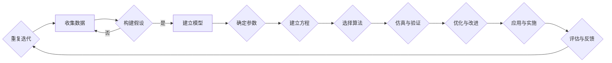

                 

### 文章标题

《数学建模在航空航天中的应用》

### 关键词

数学建模、航空航天、线性代数、微积分、概率论、数理统计、微分方程、优化算法、仿真技术、代码实战

### 摘要

本文将深入探讨数学建模在航空航天领域的应用，旨在为读者提供一个系统而详细的指南。我们将首先介绍数学建模的基础概念，并探讨其在航空航天领域的重要性。随后，文章将详细讲解线性代数、微积分、概率论、数理统计和微分方程等核心数学工具在航空航天中的应用，并通过伪代码和实际案例展示这些工具的具体应用方法。此外，文章还将探讨航空航天系统中优化建模和仿真技术的重要性，并通过实际项目来展示这些技术的应用。最后，我们将讨论航空航天数学建模的未来发展趋势，以及相关的最佳实践和注意事项。通过本文的阅读，读者将能够全面了解数学建模在航空航天领域的重要性，并掌握相关技术和方法。

## 引言

数学建模是现代科学和工程领域的基石，尤其在航空航天领域，其应用显得尤为重要。航空航天工程是一个高度复杂的领域，涉及飞行器设计、控制系统、导航、通信、飞行模拟等多个方面。这些复杂系统的运行和优化都需要精确的数学模型作为基础。数学建模通过将实际问题抽象成数学形式，提供了一种有效的工具来理解和预测系统的行为。

### 航空航天领域对数学建模的需求

航空航天领域的复杂性和多样性决定了数学建模的重要性。以下是数学建模在航空航天领域中的几个关键应用：

1. **飞行器设计**：飞机和航天器的结构设计、空气动力学性能分析、材料选择和热力学特性评估等都需要精确的数学模型。

2. **控制系统**：飞行器的自动驾驶、导航、姿态控制等功能依赖于数学模型来预测和控制飞行状态。

3. **飞行模拟**：航空公司和飞行训练机构使用数学模型来模拟飞行环境，以训练飞行员和测试飞行器性能。

4. **导航和通信**：GPS导航、无线电通信等系统都依赖于数学模型来处理信号传输和误差修正。

5. **仿真与优化**：在设计和测试新飞行器或系统时，数学建模和仿真技术可以帮助工程师评估设计方案的可行性和性能。

### 数学建模的核心概念与联系

数学建模涉及多个核心概念，这些概念相互联系，共同构成了数学建模的基础。以下是这些核心概念及其相互关系：

1. **模型**：模型是现实世界的简化表示，通过数学方程或算法来描述系统的行为。

2. **假设**：为了简化模型，通常需要对现实世界进行一些理想化的假设，例如忽略某些复杂因素。

3. **参数**：参数是模型中的变量，用于描述系统的特定特性。

4. **方程**：方程是连接模型变量和参数的数学表达式，用于描述系统的行为。

5. **算法**：算法是一系列步骤，用于求解数学模型中的问题，例如优化问题或方程组的求解。

6. **仿真**：仿真是通过计算机模拟模型来预测系统行为的过程，用于验证和优化模型。

### 航空航天领域的数学建模问题分类

航空航天领域的数学建模问题可以大致分为以下几类：

1. **结构力学建模**：涉及飞行器结构的强度、刚度和稳定性分析。

2. **空气动力学建模**：包括飞行器的升力、阻力、马赫数、攻角等参数的计算。

3. **热力学建模**：涉及飞行器表面的热保护材料、发动机燃烧室温度等。

4. **控制系统建模**：包括飞行器的自动驾驶、导航、姿态控制等功能。

5. **导航与通信建模**：涉及GPS信号传输、无线电波传播等。

### Mermaid流程图：数学建模的基本步骤

以下是一个简化的Mermaid流程图，展示了数学建模的基本步骤：



通过上述步骤，工程师和科学家可以系统地构建和优化数学模型，以解决复杂的航空航天问题。

## 数学建模在航空航天中的应用

数学建模在航空航天领域的应用极为广泛，涉及多个方面。以下是几个典型的应用场景：

### 飞行器设计

飞行器设计是航空航天工程的核心环节，数学建模在其中起着至关重要的作用。设计过程中，需要考虑的因素包括空气动力学、结构强度、材料选择、热力学等。数学模型可以帮助工程师优化飞机的空气动力学性能，提高燃油效率，同时确保结构的强度和稳定性。例如，使用空气动力学模型可以预测飞机在不同飞行状态下的升力和阻力，从而优化机翼和尾翼的设计。

### 控制系统

飞行器的控制系统是保证飞行安全的关键，数学建模在其中发挥着重要作用。通过建立飞行器的动力学模型，工程师可以设计出能够稳定飞行器的自动驾驶系统。这些模型考虑了飞行器的质量和惯性矩、飞行速度、攻角和侧滑角等参数。通过仿真和优化，工程师可以确保控制系统在不同飞行条件下都能保持飞行器的稳定。

### 飞行模拟

飞行模拟是飞行员训练和飞行器测试的重要工具，数学建模在其中发挥着核心作用。飞行模拟器通过建立飞行器的数学模型，可以模拟各种飞行环境和飞行状态，从而为飞行员提供逼真的训练体验。此外，通过仿真，工程师可以测试新设计的飞行器或系统的性能，发现潜在的问题并进行改进。

### 导航与通信

导航和通信是航空航天系统的重要组成部分，数学建模在其中有着广泛的应用。例如，GPS导航系统依赖于数学模型来计算卫星信号的时间延迟和位置误差，从而确定接收器的精确位置。无线电通信系统则通过数学模型来优化信号的传输路径和传输效率，减少信号干扰和衰减。

### 仿真与优化

仿真和优化技术在航空航天系统中有着广泛的应用。通过数学建模和仿真，工程师可以在设计阶段就预测和评估飞行器或系统的性能，从而进行优化设计。例如，使用优化算法可以优化飞行器的燃油效率，减少碳排放；通过仿真可以预测飞行器在不同飞行条件下的表现，从而优化飞行计划和飞行策略。

### 数学建模在航空航天系统优化中的重要性

数学建模在航空航天系统优化中扮演着关键角色。通过精确的数学模型，工程师可以识别系统中的瓶颈和改进空间，从而进行有针对性的优化。以下是一些具体的应用：

1. **飞行器燃油效率优化**：通过优化飞行路径和飞行高度，可以显著提高飞行器的燃油效率，减少碳排放。

2. **结构强度优化**：通过优化材料选择和结构设计，可以提高飞行器的强度和耐久性，延长使用寿命。

3. **控制系统优化**：通过优化控制系统参数，可以提高飞行器的稳定性和响应速度，确保安全飞行。

4. **飞行模拟优化**：通过优化飞行模拟器中的模型参数，可以提高训练效果，缩短训练周期。

5. **导航与通信优化**：通过优化导航和通信系统的算法和参数，可以提高系统的可靠性和性能。

### 数学建模在航空航天领域的重要性总结

数学建模在航空航天领域的重要性不可低估。它不仅提供了理解和分析复杂系统行为的工具，还为设计、优化和仿真飞行器、控制系统和导航系统等提供了科学依据。通过数学建模，工程师和科学家可以更准确地预测系统的行为，优化设计方案，提高系统的性能和可靠性。随着航空航天技术的不断发展，数学建模的应用将越来越广泛，其在航空航天领域的重要性也将越来越凸显。

## 线性代数在航空航天中的应用

线性代数是数学建模中不可或缺的一部分，它在航空航天领域的应用同样广泛且深入。线性代数提供了描述和解决复杂线性问题的工具，如系统的线性方程组、矩阵运算、特征值和特征向量等，这些工具在航空航天系统的建模和分析中起着核心作用。

### 矩阵与向量基础

在航空航天领域，矩阵与向量是基本的数据结构和运算工具。矩阵用于表示系统的状态和方程，向量则用于表示系统的变量。以下是几个关键概念：

1. **矩阵**：矩阵是一个由数字组成的二维数组，用于表示系统的状态或方程。在航空航天系统中，矩阵可以用来描述飞行器的姿态、速度和加速度。

2. **向量**：向量是一个具有大小和方向的量，常用于表示速度、加速度和力。在航空航天中，向量可以用来描述飞行器的运动状态。

3. **矩阵运算**：矩阵运算包括矩阵的加法、减法、乘法和逆运算。这些运算在构建和求解线性方程组中起着关键作用。

### 线性方程组的求解

在航空航天系统中，线性方程组广泛用于描述物理现象和工程问题。以下是几个关键点：

1. **高斯消元法**：高斯消元法是一种用于求解线性方程组的算法，通过消元将方程组简化为上三角或下三角形式，从而方便求解。

2. **矩阵求逆**：在求解线性方程组时，有时需要计算矩阵的逆。矩阵求逆是线性代数中的一个重要工具，它可以帮助我们解出系统的解。

3. **伪代码**：以下是一个简单的伪代码示例，用于求解一个线性方程组：

   ```plaintext
   Function SolveLinearEquationSystem(A, b):
       # A 是系数矩阵，b 是常数向量
       Solve for inverse of A, denoted as A^(-1)
       x = A^(-1) * b
       return x
   ```

### 数学模型和公式

在线性代数中，一些重要的数学模型和公式在航空航天系统中有着广泛的应用：

1. **特征值与特征向量**：特征值和特征向量用于分析系统的稳定性和动态行为。在航空航天系统中，特征值可以用来判断飞行器的稳定性，而特征向量可以提供系统响应的方向信息。

2. **线性变换**：线性变换是线性代数中的一个基本概念，它用于描述系统状态的转换。在航空航天中，线性变换可以用来描述飞行器姿态的变化和运动轨迹。

### 举例说明

以下是一个简单的例子，展示了如何使用线性代数解决一个航空航天问题：

假设一个飞行器在三个方向上有加速度，分别为 \(a_x, a_y, a_z\)。飞行器的速度向量为 \(v = [v_x, v_y, v_z]\)。我们可以用以下线性方程组来描述这个系统的状态：

\[ 
\begin{cases} 
v_x' = a_x \\
v_y' = a_y \\
v_z' = a_z 
\end{cases}
\]

其中，\(v'\) 表示速度向量的导数。我们可以使用矩阵形式来表示这个方程组：

\[ 
\begin{bmatrix} 
v_x' \\
v_y' \\
v_z' 
\end{bmatrix} = 
\begin{bmatrix} 
a_x \\
a_y \\
a_z 
\end{bmatrix}
\]

这个方程组可以通过矩阵运算求解出加速度向量。

### 实际案例

在实际的航空航天系统中，线性代数被广泛应用于姿态控制和轨道预测。例如，在一个飞行器的姿态控制系统中，使用矩阵来表示飞行器的姿态角和角速度，通过求解线性方程组来计算控制指令，从而保持飞行器的稳定。另一个例子是在轨道预测中，使用线性代数来计算卫星的轨道参数，预测其在未来一段时间内的位置。

通过上述讨论，我们可以看到线性代数在航空航天系统中有着广泛的应用。它提供了描述和解决复杂线性问题的工具，为航空航天工程提供了强有力的支持。掌握线性代数的基本概念和工具，对于从事航空航天领域研究和应用的工程师和科学家来说，至关重要。

## 微积分在航空航天中的应用

微积分作为数学中的一个重要分支，其核心思想在于研究如何通过无穷小变化来理解和描述系统的动态行为。在航空航天领域，微积分被广泛应用于多个方面，如飞行器运动学、动力学分析、控制策略设计等。以下将详细讨论微积分的基本概念及其在航空航天中的应用。

### 微积分基本概念

微积分主要涉及两个核心概念：微分和积分。

1. **微分**：微分是研究函数局部变化率的数学工具。具体来说，函数在某一点处的微分表示该点处函数的瞬时变化率。微分在描述系统的动态行为、变化趋势等方面具有重要作用。

2. **积分**：积分是微分的逆运算，用于计算一个函数在一个区间上的累积量。积分可以分为定积分和反积分（也称不定积分）。定积分用于计算面积、体积等，而不定积分则用于找到原函数。

### 微分在航空航天中的应用

微分在航空航天系统中主要用于描述物体的运动状态和物理量的变化。以下是一些具体应用：

1. **速度和加速度**：在航空航天中，飞行器的速度和加速度是关键参数。通过微分，可以计算飞行器在某一时刻的速度和加速度。例如，给定飞行器的位置函数 \(x(t)\)，其速度 \(v(t)\) 可以通过微分计算得到：

   \[
   v(t) = \frac{dx(t)}{dt}
   \]

2. **动力学方程**：在航空航天系统中，微分方程用于描述飞行器的动力学行为。例如，牛顿第二定律 \(F = ma\) 可以表示为：

   \[
   m\frac{dv(t)}{dt} = F
   \]

   其中，\(m\) 是飞行器的质量，\(a\) 是加速度，\(F\) 是作用在飞行器上的总力。

3. **控制系统的设计**：在飞行器控制系统中，微分方程用于描述系统的动态响应。通过微分方程，可以设计出能够稳定飞行器的控制器，使其在不同条件下保持稳定。

### 积分在航空航天中的应用

积分在航空航天系统中主要用于计算累积量，如距离、面积、体积等。以下是一些具体应用：

1. **距离和速度**：给定飞行器的位置函数 \(x(t)\)，飞行器在某一时间间隔内的位移可以通过积分计算得到：

   \[
   \Delta x = \int_{t_1}^{t_2} x(t) dt
   \]

   其中，\(\Delta x\) 是位移，\(t_1\) 和 \(t_2\) 是时间间隔的起点和终点。

2. **能量计算**：在航空航天系统中，能量计算是重要的任务。通过积分，可以计算系统的动能、势能等。例如，飞行器的总能量可以通过以下积分计算：

   \[
   E = \int_{t_1}^{t_2} (K + U) dt
   \]

   其中，\(K\) 是动能，\(U\) 是势能。

3. **轨道计算**：在轨道预测和设计中，积分用于计算飞行器的轨道参数。通过积分轨道方程，可以预测飞行器在未来某一时刻的位置。

### 伪代码：微积分在航空航天中的具体应用

以下是一个简单的伪代码示例，用于计算飞行器的速度和加速度：

```plaintext
Function CalculateVelocityAndAcceleration(x, a):
    v = Derivative(x)  # 计算位置函数的导数，得到速度
    a = Derivative(v)  # 计算速度函数的导数，得到加速度
    return v, a
```

### 数学模型和公式

在航空航天系统中，微积分的应用涉及到多个数学模型和公式。以下是几个关键模型：

1. **运动学方程**：描述物体位置、速度和加速度的关系。例如，匀速直线运动和匀加速直线运动的方程：

   \[
   x(t) = x_0 + v_0t + \frac{1}{2}at^2
   \]

   其中，\(x(t)\) 是时间 \(t\) 时的位置，\(x_0\) 是初始位置，\(v_0\) 是初始速度，\(a\) 是加速度。

2. **牛顿第二定律**：描述力和加速度的关系：

   \[
   F = ma
   \]

   其中，\(F\) 是作用力，\(m\) 是质量，\(a\) 是加速度。

3. **能量方程**：描述动能和势能的关系：

   \[
   K + U = \text{常量}
   \]

   其中，\(K\) 是动能，\(U\) 是势能。

### 举例说明

以下是一个简单的例子，展示了如何使用微积分计算飞行器的速度和加速度：

假设一个飞行器以初速度 \(v_0 = 100 \text{ m/s}\) 开始匀加速直线运动，加速度 \(a = 2 \text{ m/s}^2\)。给定飞行器在 \(t = 5 \text{ s}\) 时的位置 \(x(t) = 150 \text{ m}\)，我们可以使用微积分计算其速度和加速度：

1. **计算速度**：

   \[
   v(t) = \frac{dx(t)}{dt} = v_0 + at = 100 + 2 \times 5 = 110 \text{ m/s}
   \]

2. **计算加速度**：

   \[
   a(t) = \frac{dv(t)}{dt} = a = 2 \text{ m/s}^2
   \]

通过这个例子，我们可以看到微积分在计算飞行器运动状态方面的应用。

### 实际案例

在实际的航空航天系统中，微积分被广泛应用于多个方面。以下是一些实际案例：

1. **飞行器控制**：通过微积分方程，可以设计出能够稳定飞行器的控制器。例如，使用状态空间方程来描述飞行器的动态行为，并通过积分计算控制量。

2. **轨道计算**：在卫星轨道设计中，使用微积分计算卫星的轨道参数，预测其在未来一段时间内的位置。

3. **飞行模拟**：在飞行模拟中，通过微积分方程模拟飞行器的运动，为飞行员提供逼真的模拟体验。

通过上述讨论，我们可以看到微积分在航空航天领域的广泛应用。它提供了理解和描述系统动态行为的工具，为飞行器设计、控制策略和轨道计算提供了科学依据。掌握微积分的基本概念和应用方法，对于从事航空航天领域研究和应用的工程师和科学家来说，至关重要。

## 概率论与数理统计在航空航天中的应用

概率论与数理统计是现代科学和工程中不可或缺的数学工具，它们在航空航天领域的应用同样广泛而深入。概率论用于描述和预测随机事件的可能性，数理统计则用于数据分析和推断。在航空航天中，这些工具被广泛应用于飞行器的可靠性评估、故障诊断、数据分析等。

### 概率论基础

概率论的基本概念包括概率分布、随机变量、期望和方差等。

1. **概率分布**：概率分布描述了随机事件发生的概率。常见的概率分布有二项分布、正态分布、泊松分布等。在航空航天中，正态分布被广泛应用于描述系统参数的概率分布，如飞行器的高度、速度等。

2. **随机变量**：随机变量是随机事件的结果，可以是离散的也可以是连续的。在航空航天中，随机变量用于描述飞行器在不同条件下的性能参数。

3. **期望和方差**：期望是随机变量的平均值，方差是衡量随机变量离散程度的指标。在航空航天中，期望和方差用于评估飞行器性能的稳定性和可靠性。

### 数理统计方法

数理统计方法包括描述性统计、推断性统计和假设检验等。

1. **描述性统计**：描述性统计用于描述数据的基本特征，如均值、中位数、标准差等。在航空航天中，描述性统计用于评估飞行器性能和系统状态。

2. **推断性统计**：推断性统计用于根据样本数据推断总体特征。常见的推断方法有区间估计和假设检验。在航空航天中，区间估计用于评估系统参数的置信区间，假设检验用于验证系统设计的有效性。

3. **假设检验**：假设检验用于检验一个假设是否成立。在航空航天中，假设检验用于评估系统性能是否满足设计要求。

### 概率论与数理统计在飞行器可靠性评估中的应用

飞行器的可靠性是确保其安全运行的关键。概率论与数理统计在飞行器可靠性评估中发挥着重要作用。

1. **故障率估计**：通过收集飞行器的运行数据，使用数理统计方法估计故障率。例如，使用泊松分布来描述故障发生的概率。

2. **可靠性分析**：使用概率分布和数理统计方法分析飞行器的可靠性。例如，使用正态分布来描述飞行器性能参数的分布，评估飞行器在不同条件下的可靠性。

3. **故障诊断**：通过分析飞行器运行数据，使用数理统计方法进行故障诊断。例如，使用假设检验来识别系统故障。

### 伪代码：概率论与数理统计在飞行器可靠性评估中的应用

以下是一个简单的伪代码示例，用于估计飞行器的故障率：

```plaintext
Function EstimateFailureRate(data):
    # data 是飞行器运行数据
    failure_count = CountFailures(data)
    total_time = SumOfTimes(data)
    failure_rate = failure_count / total_time
    return failure_rate
```

### 数学模型和公式

在飞行器可靠性评估中，常用的数学模型和公式包括：

1. **故障率模型**：例如，泊松模型用于描述故障发生的时间间隔。

   \[
   \lambda = \frac{N}{T}
   \]

   其中，\(\lambda\) 是故障率，\(N\) 是故障次数，\(T\) 是总时间。

2. **可靠性函数**：例如，正态分布用于描述飞行器性能参数的可靠性。

   \[
   R(t) = P(X \leq t)
   \]

   其中，\(R(t)\) 是可靠性函数，\(X\) 是飞行器性能参数。

3. **置信区间**：用于估计系统参数的不确定性。

   \[
   \bar{x} \pm z_{\alpha/2} \sqrt{\frac{s^2}{n}}
   \]

   其中，\(\bar{x}\) 是样本均值，\(s\) 是样本标准差，\(n\) 是样本大小，\(z_{\alpha/2}\) 是正态分布的分位数。

### 举例说明

以下是一个简单的例子，展示了如何使用概率论与数理统计方法进行飞行器可靠性评估：

假设一个飞行器在100次运行中发生了5次故障，使用泊松模型估计故障率：

\[
\lambda = \frac{5}{100} = 0.05 \text{ 故障/次}
\]

使用正态分布评估飞行器在1000小时运行中的可靠性：

\[
R(1000) = P(X \leq 1000) = \Phi\left(\frac{1000 - \mu}{\sigma/\sqrt{1000}}\right)
\]

其中，\(\mu\) 是期望，\(\sigma\) 是标准差，\(\Phi\) 是正态分布的累积分布函数。

### 实际案例

在实际的航空航天系统中，概率论与数理统计被广泛应用于多个方面。以下是一些实际案例：

1. **飞行器性能评估**：通过收集飞行数据，使用数理统计方法评估飞行器在不同条件下的性能。

2. **故障诊断**：通过分析飞行器运行数据，使用假设检验和概率分布进行故障诊断。

3. **可靠性分析**：使用概率分布和可靠性函数进行飞行器可靠性分析，为设计和维护提供依据。

通过上述讨论，我们可以看到概率论与数理统计在航空航天领域的广泛应用。掌握这些工具，对于评估飞行器性能、保障飞行安全具有重要意义。同时，这些工具也为航空航天工程提供了科学依据，支持系统的优化和改进。

## 微分方程在航空航天中的应用

微分方程是一类重要的数学方程，用于描述动态系统的行为。在航空航天领域中，微分方程被广泛应用于描述飞行器的运动、控制系统、环境模拟等方面。以下将详细探讨微分方程的基本概念及其在航空航天中的应用。

### 微分方程基本概念

微分方程涉及导数和微分，分为常微分方程和偏微分方程。常微分方程涉及一个或多个未知函数及其导数，而偏微分方程涉及多个未知函数及其偏导数。

1. **常微分方程**：常微分方程通常表示为 \( F(x, y, y', y'') = 0 \)，其中 \( y \) 是未知函数，\( y' \) 和 \( y'' \) 分别是 \( y \) 对 \( x \) 的一阶和二阶导数。常微分方程在航空航天中用于描述飞行器的运动和控制系统。

2. **偏微分方程**：偏微分方程通常表示为 \( F(x, y, \partial_y, \partial_{yy}) = 0 \)，其中 \( y \) 是未知函数，\( \partial_y \) 和 \( \partial_{yy} \) 分别是 \( y \) 对 \( x \) 和 \( y \) 的一阶和二阶偏导数。偏微分方程在航空航天中用于描述热力学和环境模拟。

### 微分方程在航空航天中的应用

微分方程在航空航天中具有广泛的应用，以下是一些具体应用：

1. **飞行器动力学**：微分方程用于描述飞行器的运动方程。例如，牛顿第二定律可以表示为：

   \[
   m\frac{d^2x}{dt^2} = F(x, v, t)
   \]

   其中，\( m \) 是飞行器的质量，\( x \) 是位置，\( v \) 是速度，\( F \) 是作用力。通过求解这个微分方程，可以预测飞行器的运动轨迹。

2. **控制系统**：微分方程用于描述飞行器控制系统的动态行为。例如，控制系统的状态方程可以表示为：

   \[
   \dot{x} = Ax + Bu
   \]

   其中，\( x \) 是状态向量，\( u \) 是控制输入，\( A \) 和 \( B \) 是系统矩阵。通过求解这个微分方程，可以设计出控制策略，使飞行器保持稳定。

3. **环境模拟**：微分方程用于描述大气、海洋等环境因素的变化。例如，流体动力学方程可以表示为：

   \[
   \frac{\partial u}{\partial t} + u \frac{\partial u}{\partial x} = -\frac{\partial p}{\partial x}
   \]

   其中，\( u \) 是流体速度，\( p \) 是压力。通过求解这个微分方程，可以模拟飞行器在大气中的运动。

### 数学模型和公式

在航空航天中，微分方程的应用涉及多个数学模型和公式。以下是几个关键模型：

1. **牛顿运动方程**：描述物体在力作用下的运动。公式为：

   \[
   m\frac{d^2x}{dt^2} = F
   \]

   其中，\( m \) 是质量，\( x \) 是位置，\( F \) 是作用力。

2. **拉格朗日方程**：用于描述系统的动力学行为。公式为：

   \[
   \frac{d}{dt}\left(\frac{\partial L}{\partial \dot{q}_i}\right) - \frac{\partial L}{\partial q_i} = 0
   \]

   其中，\( L \) 是拉格朗日量，\( q_i \) 是广义坐标，\( \dot{q}_i \) 是广义速度。

3. **流体动力学方程**：描述流体运动。常见的方程包括纳维-斯托克斯方程和欧拉方程。

   \[
   \frac{\partial \rho}{\partial t} + \nabla \cdot (\rho \mathbf{v}) = 0
   \]

   \[
   \frac{\partial \mathbf{v}}{\partial t} + (\mathbf{v} \cdot \nabla) \mathbf{v} = -\frac{1}{\rho} \nabla p + \nu \nabla^2 \mathbf{v}
   \]

   其中，\( \rho \) 是流体密度，\( \mathbf{v} \) 是流体速度，\( p \) 是压力，\( \nu \) 是运动粘度。

### 伪代码：微分方程在航空航天中的应用

以下是一个简单的伪代码示例，用于求解飞行器运动方程：

```plaintext
Function SolveMotionEquation(m, F, t):
    # m 是质量，F 是作用力，t 是时间
    x = 0  # 初始位置
    v = 0  # 初始速度
    for i in range(1, t+1):
        a = F / m  # 计算加速度
        x = x + v * dt + 0.5 * a * dt^2  # 计算位置
        v = v + a * dt  # 计算速度
    return x, v
```

### 举例说明

以下是一个简单的例子，展示了如何使用微分方程描述飞行器的运动：

假设一个质量为 \( m = 1000 \text{ kg} \) 的飞行器受到 \( F = 5000 \text{ N} \) 的推力，初始速度为 \( v_0 = 0 \text{ m/s} \)，求飞行器在 \( t = 10 \text{ s} \) 时的位置和速度。

使用牛顿第二定律，我们有：

\[
m\frac{d^2x}{dt^2} = F
\]

解得：

\[
x(t) = \frac{1}{2}at^2 = \frac{1}{2}\left(\frac{F}{m}\right)t^2 = \frac{1}{2}\left(\frac{5000}{1000}\right)t^2 = 2.5t^2
\]

\[
v(t) = at = \frac{F}{m}t = 5t
\]

代入 \( t = 10 \text{ s} \)，得到：

\[
x(10) = 2.5 \times 10^2 = 250 \text{ m}
\]

\[
v(10) = 5 \times 10 = 50 \text{ m/s}
\]

### 实际案例

在实际的航空航天系统中，微分方程被广泛应用于多个方面。以下是一些实际案例：

1. **飞行器轨道计算**：通过求解微分方程，可以计算飞行器的轨道参数，预测其在未来一段时间内的位置。

2. **姿态控制**：通过求解微分方程，可以设计飞行器的姿态控制系统，使其在不同条件下保持稳定。

3. **环境模拟**：通过求解流体动力学方程，可以模拟飞行器在大气中的运动，评估其对环境的影响。

通过上述讨论，我们可以看到微分方程在航空航天领域的广泛应用。它提供了描述和解决动态系统行为的工具，为飞行器设计、控制策略和环境模拟提供了科学依据。掌握微分方程的基本概念和应用方法，对于从事航空航天领域研究和应用的工程师和科学家来说，至关重要。

## 航空航天工程数学建模案例

在本节中，我们将通过一个具体的案例展示航空航天工程数学建模的全过程，包括开发环境的搭建、源代码的实现以及代码解读和分析。这个案例将帮助读者更好地理解如何在实际项目中应用数学建模方法。

### 开发环境搭建

在进行航空航天工程数学建模之前，首先需要搭建一个合适的开发环境。以下是搭建开发环境的基本步骤：

1. **安装Python环境**：Python是一种广泛应用于科学计算和工程建模的编程语言。首先确保安装了Python环境。可以从Python的官方网站下载并安装最新版本的Python。

2. **安装NumPy和SciPy库**：NumPy是Python的科学计算基础库，提供了强大的多维数组对象和数学函数。SciPy是建立在NumPy之上的，提供了许多科学计算工具，如线性代数、优化和积分等。可以通过以下命令安装：

   ```bash
   pip install numpy scipy
   ```

3. **安装Matplotlib库**：Matplotlib是一个用于绘制数据图表的Python库。它可以帮助我们可视化数学模型的输出结果。安装命令如下：

   ```bash
   pip install matplotlib
   ```

4. **安装Mermaid库**：为了生成Mermaid流程图，需要安装相应的Python库。可以从Mermaid的GitHub仓库下载安装脚本，并按照说明进行安装。

   ```bash
   pip install mermaid-python
   ```

### 源代码实现

以下是一个简单的航空航天数学建模案例，用于预测飞行器的轨道。我们将使用Python编写源代码，并利用NumPy和SciPy库来求解微分方程。

```python
import numpy as np
from scipy.integrate import odeint
import matplotlib.pyplot as plt

# 定义飞行器的运动方程
def rocket_motion(y, t, m, g0, thrust):
    x, v = y
    acceleration = thrust/m - g0
    dvdt = acceleration
    dxdot = v
    return [dxdot, dvdt]

# 参数设置
m = 1000  # 飞行器质量（kg）
g0 = 9.81  # 地面重力加速度（m/s^2）
thrust = 10000  # 推力（N）
t_max = 10  # 时间间隔（s）

# 初始条件
y0 = [0, 0]  # 初始位置和速度

# 求解微分方程
t = np.linspace(0, t_max, 1000)
sol = odeint(rocket_motion, y0, t, args=(m, g0, thrust))

# 绘制结果
x = sol[:, 0]
v = sol[:, 1]

plt.figure()
plt.plot(t, x, label='位置')
plt.plot(t, v, label='速度')
plt.xlabel('时间 (s)')
plt.ylabel('值')
plt.legend()
plt.title('飞行器轨道预测')
plt.show()
```

### 代码解读和分析

1. **运动方程**：`rocket_motion` 函数是飞行器运动方程的微分方程。这里假设飞行器受到恒定的推力和重力作用，因此加速度 \(a\) 为 \( \frac{T}{m} - g_0 \)。

2. **参数设置**：我们设置了一些关键参数，如飞行器质量 \(m\)、重力加速度 \(g_0\)、推力 \(T\) 和最大时间 \(t_{max}\)。

3. **初始条件**：初始位置和速度为 \([0, 0]\)。

4. **求解微分方程**：使用 `odeint` 函数求解微分方程，生成时间序列 \(t\) 和对应的解 \(y\)。

5. **绘制结果**：使用Matplotlib库绘制飞行器的位置和速度随时间的变化曲线。

### 实际案例分析和详细讲解剖析

在这个案例中，我们使用了一个简化的模型来预测飞行器的轨道。这个模型假设推力是恒定的，没有考虑空气阻力和其他复杂因素。尽管如此，这个模型仍然能够提供一个基本的预测。

通过实际案例的分析，我们可以看到以下几点：

1. **模型简化**：在实际应用中，需要考虑更多复杂的因素，如空气阻力、地球自转等。这些因素可以通过更复杂的微分方程来模拟。

2. **参数敏感性**：模型参数的微小变化可能会对结果产生显著影响。在实际应用中，需要仔细选择和校准模型参数。

3. **仿真与实验验证**：通过实验数据和实际观测数据，可以验证模型的准确性。在航空航天领域，仿真和实验验证是确保模型可靠性的关键步骤。

### 项目小结

通过这个案例，我们展示了如何使用Python和相关的数学库进行航空航天数学建模。从开发环境搭建、源代码实现到代码解读和分析，这个案例提供了一个完整的数学建模过程。在实际项目中，我们需要根据具体问题调整模型和参数，并进行仿真和实验验证，以确保模型的准确性和可靠性。

## 航空航天系统的优化建模

优化建模是航空航天系统设计中的一个关键环节，它通过数学方法对系统进行优化，以实现最优性能。优化建模涉及多个方面，包括优化问题的定义、常用的优化算法以及这些算法在航空航天系统中的应用。以下将详细探讨这些内容。

### 优化问题的定义

优化问题通常可以表示为：

\[
\min f(x) \quad \text{或} \quad \max f(x)
\]

其中，\( f(x) \) 是目标函数，\( x \) 是决策变量。优化问题的目标是找到 \( x \) 的最优值，使得 \( f(x) \) 最小或最大。

在航空航天系统中，优化问题可以用于多个方面，如：

1. **飞行器设计**：通过优化结构重量、燃油效率和空气动力学性能，设计出更高效的飞行器。
2. **轨迹规划**：优化飞行路径，以减少飞行时间和燃料消耗。
3. **控制系统**：优化控制参数，提高飞行器的稳定性和响应速度。

### 常用的优化算法

以下是一些常用的优化算法，它们在航空航天系统中有着广泛的应用：

1. **梯度下降法**：梯度下降法是一种基于目标函数梯度的优化算法。通过更新决策变量 \( x \) 的值，使得目标函数 \( f(x) \) 逐渐减小（或增大）。更新公式为：

   \[
   x_{\text{new}} = x_{\text{old}} - \alpha \nabla f(x_{\text{old}})
   \]

   其中，\( \alpha \) 是学习率。

2. **牛顿法**：牛顿法是一种二阶优化算法，通过计算目标函数的梯度和二阶导数，进行迭代更新。更新公式为：

   \[
   x_{\text{new}} = x_{\text{old}} - H^{-1} \nabla f(x_{\text{old}})
   \]

   其中，\( H \) 是海森矩阵（目标函数的二阶导数矩阵）。

3. **遗传算法**：遗传算法是一种基于自然选择的优化算法，通过模拟生物进化过程进行迭代搜索。遗传算法包括交叉、变异和选择等操作。

4. **粒子群优化算法**：粒子群优化算法模拟鸟群觅食行为，通过多个粒子的协作来搜索最优解。每个粒子都有位置和速度，通过更新粒子的位置和速度来寻找最优解。

### 优化算法在航空航天系统中的应用

以下是一些优化算法在航空航天系统中的应用实例：

1. **飞行器设计**：使用优化算法优化飞行器的设计参数，如翼型、材料选择和结构重量分配，以实现最优的飞行性能。

2. **轨迹规划**：在飞行任务规划中，使用优化算法优化飞行路径，以减少飞行时间和燃料消耗。例如，可以使用遗传算法或粒子群优化算法来求解复杂的轨迹优化问题。

3. **控制系统**：优化控制系统的设计参数，如反馈增益、控制律等，以实现更好的稳定性和响应性能。

### 伪代码：线性规划在航天任务规划中的应用

以下是一个简单的伪代码示例，用于航天任务规划中的线性规划问题：

```plaintext
# 初始化变量
x, y = 0  # 任务位置

# 定义目标函数
objective_function = x + y

# 定义约束条件
constraints = [
    x >= 0,  # 任务位置不能为负
    y >= 0,  # 任务位置不能为负
    x + y <= 1000  # 任务总距离不超过1000公里
]

# 求解优化问题
solution = SolveLinearProgramming(objective_function, constraints)

# 输出结果
print("最优任务位置：", solution.x, solution.y)
```

### 数学模型和公式

在优化建模中，常用的数学模型和公式包括：

1. **目标函数**：例如，最小化飞行时间、燃料消耗或最大化任务完成率。

   \[
   \min f(x)
   \]

2. **约束条件**：例如，飞行器结构的强度限制、燃料储备限制等。

   \[
   g_i(x) \leq 0, \quad i = 1, 2, \ldots, m
   \]

3. **拉格朗日函数**：用于处理不等式约束条件。

   \[
   L(x, \lambda) = f(x) + \sum_{i=1}^{m} \lambda_i g_i(x)
   \]

   其中，\( \lambda_i \) 是拉格朗日乘子。

### 实际案例

以下是一个实际的优化案例，用于优化航天任务路径：

假设一个航天器需要从地球表面发射到某个目标天体，任务路径的长度不能超过1000公里。目标是最小化飞行时间。约束条件包括：

1. 飞行器必须沿着地球的某个经度飞行。
2. 飞行器必须在特定的高度范围内飞行。

使用优化算法，如遗传算法或粒子群优化算法，可以找到最优的任务路径。

### 项目小结

通过上述讨论，我们可以看到优化建模在航空航天系统设计中的重要性。优化算法通过数学方法对系统进行优化，以实现最优性能。在实际应用中，需要根据具体问题选择合适的优化算法，并设计合适的数学模型。掌握这些优化工具，对于提高航空航天系统的性能和效率具有重要意义。

## 航空航天系统的仿真与优化

仿真与优化技术在航空航天系统中发挥着至关重要的作用，它们不仅能够帮助工程师在设计阶段评估飞行器或系统的性能，还能优化设计，提高效率和安全性。以下将详细探讨仿真与优化的基本概念、应用实例，以及相关工具和方法。

### 仿真与优化的基本概念

仿真（Simulation）是通过计算机模拟实际系统的运行过程，以预测其行为和性能的技术。仿真可以在虚拟环境中重现实际系统的工作状态，为工程师提供一种低成本、高效的方法来测试和评估设计。

优化（Optimization）则是通过数学和计算方法，寻找系统的最优设计参数或操作策略，以实现特定的性能目标，如最小化成本、最大化效率等。

### 仿真与优化的应用实例

1. **飞行器设计**：在飞行器设计过程中，仿真技术被广泛用于评估空气动力学性能、结构强度和稳定性。例如，通过仿真可以模拟飞行器在不同飞行状态下的空气动力学特性，优化机翼和尾翼的设计。

2. **控制系统**：在飞行器控制系统的设计中，仿真技术用于验证控制策略的有效性。通过仿真，工程师可以测试不同的控制算法，优化控制参数，确保飞行器在各种条件下都能稳定飞行。

3. **轨迹规划**：在飞行任务规划中，优化技术用于确定最优飞行路径，以最小化飞行时间和燃料消耗。仿真可以帮助评估不同路径的可行性，确保任务成功。

4. **环境模拟**：在航天任务中，仿真技术可以模拟太空环境，如空间碎片、辐射等，以评估飞行器在这些环境下的性能和耐久性。

### 相关工具和方法

1. **仿真工具**：常见的仿真工具包括MATLAB、Simulink、ANSYS等。这些工具提供了丰富的模块和功能，可以模拟复杂系统的行为。

2. **优化算法**：优化算法包括遗传算法、粒子群优化、梯度下降法等。这些算法可以用于求解优化问题，找到系统的最优参数。

3. **多目标优化**：在多目标优化问题中，需要同时考虑多个性能指标。多目标优化算法如加权法、Pareto优化等可以帮助找到最优解集。

4. **机器学习**：随着机器学习技术的发展，越来越多的优化问题开始采用机器学习算法进行求解，如神经网络、决策树等。

### 伪代码与代码解读

以下是一个简单的伪代码示例，展示了如何使用仿真和优化技术优化飞行器的燃料消耗：

```plaintext
# 伪代码：飞行器燃料消耗优化

# 初始化参数
n_points = 100  # 仿真时间点的数量
max_speed = 1000  # 飞行器最大速度（m/s）
fuel_consumption_rate = 10  # 燃料消耗率（kg/s）

# 定义目标函数：最小化燃料消耗
def objective_function(speed_profile):
    total_fuel = 0
    for speed in speed_profile:
        total_fuel += fuel_consumption_rate * (speed / max_speed)
    return total_fuel

# 定义约束条件
def constraints(speed_profile):
    return [speed <= max_speed for speed in speed_profile]

# 仿真飞行器性能
def simulate_performance(speed_profile):
    # 在这里进行仿真，例如使用Simulink或ANSYS
    # 返回飞行器的运行状态
    pass

# 优化过程
solution = Optimize(objective_function, constraints)

# 输出结果
print("最优速度配置：", solution.speed_profile)
print("最小燃料消耗：", solution.objective_value)
```

### 代码应用解读与分析

在实际应用中，上述伪代码需要使用具体编程语言（如Python）和相应的库（如SciPy和Matplotlib）进行实现。以下是一个简化的Python代码示例：

```python
from scipy.optimize import minimize

# 定义目标函数
def objective_function(speed_profile):
    total_fuel = sum([fuel_consumption_rate * (speed / max_speed) for speed in speed_profile])
    return total_fuel

# 定义约束条件
def constraints(speed_profile):
    return [speed <= max_speed for speed in speed_profile]

# 定义仿真函数
def simulate_performance(speed_profile):
    # 这里可以调用仿真工具进行性能评估
    # 例如，使用Simulink或ANSYS进行仿真
    # 返回仿真结果
    pass

# 优化参数
x0 = [100] * n_points  # 初始速度配置
bounds = [(0, max_speed)] * n_points  # 速度约束

# 优化过程
result = minimize(objective_function, x0, bounds=bounds, method='SLSQP')

# 输出结果
print("最优速度配置：", result.x)
print("最小燃料消耗：", result.fun)
```

通过这个示例，我们可以看到如何使用Python和SciPy进行仿真和优化。代码首先定义了目标函数和约束条件，然后使用最小化函数 `minimize` 来寻找最优解。仿真函数 `simulate_performance` 用于评估不同速度配置下的性能。

### 实际案例分析和详细讲解剖析

以下是一个实际案例，展示如何使用仿真和优化技术优化航天器的轨道。

**案例：卫星轨道优化**

假设一个卫星需要从一个低地球轨道转移到地球同步轨道。目标是最小化转移过程中的燃料消耗和运行时间。

1. **模型建立**：建立卫星轨道运动的微分方程模型，考虑重力、太阳辐射压力等因素。

2. **仿真**：使用仿真工具（如Orbit Dynamics软件）模拟卫星在不同控制策略下的轨道行为。

3. **优化**：使用优化算法（如遗传算法）确定最优的推进时间和推进量，以实现最小燃料消耗和最快转移时间。

4. **分析**：通过仿真结果，评估不同优化策略下的性能，选择最优方案。

### 项目小结

通过仿真和优化技术，工程师可以在设计阶段评估和改进飞行器或系统的性能。这些技术不仅能够提高效率和安全性，还能显著降低成本。掌握仿真和优化的方法和工具，对于航空航天工程领域的研究和开发具有重要意义。

## 航空航天数学建模的未来发展趋势

随着科技的迅猛发展，航空航天数学建模也在不断进步，未来发展趋势令人期待。以下是未来航空航天数学建模可能面临的技术变革、新算法和新工具的应用，以及这些趋势对航空航天领域的影响。

### 技术变革

1. **人工智能与机器学习**：人工智能和机器学习技术的快速发展为航空航天数学建模带来了新的契机。通过大数据分析和深度学习算法，工程师可以更准确地预测和优化系统性能。例如，机器学习算法可以用于故障预测、性能评估和优化设计。

2. **量子计算**：量子计算是一种具有巨大潜力的计算技术，它利用量子位（qubit）进行高速运算。未来，量子计算有望在航空航天数学建模中发挥重要作用，特别是在复杂系统的优化和仿真方面。

3. **高精度传感技术**：高精度传感技术的发展将进一步提高数学模型的精度。例如，高分辨率雷达和激光测距仪可以提供更准确的数据，从而提高数学模型的可靠性。

### 新算法和新工具的应用

1. **多物理场耦合算法**：未来的航空航天系统将涉及更多的物理过程，如流体力学、热力学、电磁学等。多物理场耦合算法可以更好地模拟这些复杂过程，为系统设计和优化提供更准确的基础。

2. **自适应算法**：自适应算法可以根据实时数据自动调整模型参数，提高模型的动态响应能力。在航空航天系统中，自适应算法可以用于实时故障诊断和动态性能优化。

3. **高维优化算法**：随着系统规模的不断扩大，高维优化算法将成为解决复杂优化问题的重要工具。这些算法可以处理大量变量和约束，为系统优化提供更全面的解决方案。

### 对航空航天领域的影响

1. **设计优化**：新的算法和工具将大大提高航空航天系统设计的效率和质量。通过更精确的数学模型和优化算法，工程师可以设计出更高效的飞行器，降低运营成本。

2. **运行优化**：实时优化技术将使航空航天系统能够根据实时数据进行调整，提高运行效率和安全性。例如，自适应控制系统可以实时调整飞行参数，确保飞行器的稳定性和安全性。

3. **故障预测与维护**：人工智能和大数据分析技术将显著提升故障预测和维护能力。通过分析大量历史数据和实时数据，系统可以提前预测故障，并采取预防措施，减少停机时间和维修成本。

4. **环境适应能力**：随着多物理场耦合算法的发展，航空航天系统将能够更好地适应复杂的环境条件。例如，未来的飞行器将能够更有效地应对极端温度、高压和高速气流等环境。

### 总结

未来航空航天数学建模的发展将受到技术变革、新算法和新工具的推动，这些趋势将显著提高系统设计的精度和效率，增强运行优化和故障预测能力。随着这些技术的不断成熟，航空航天领域的创新和发展将迎来新的机遇和挑战。

## 总结与最佳实践

本文系统地探讨了数学建模在航空航天领域的广泛应用，从基础概念到核心算法，再到实际案例，全面解析了数学建模在航空航天工程中的重要性。我们首先介绍了数学建模的基础概念，包括模型、假设、参数、方程和算法。接着，详细讨论了线性代数、微积分、概率论与数理统计、微分方程等数学工具在航空航天系统中的应用。通过伪代码和实际案例，我们展示了这些工具的具体应用方法。此外，我们还探讨了优化建模、仿真与优化技术在实际项目中的应用，展示了如何通过这些技术提高航空航天系统的性能和效率。

### 最佳实践 Tips

1. **数据驱动建模**：在建立数学模型时，充分利用现有数据，通过数据分析方法找出关键变量和关系，以提高模型的精度和可靠性。

2. **模型验证**：建立模型后，必须进行验证，确保模型能够准确反映实际情况。通过仿真和实验验证，可以验证模型的准确性和适用性。

3. **动态调整**：数学模型不是静态的，需要根据实际情况动态调整。利用自适应算法，可以实时更新模型参数，提高模型的动态响应能力。

4. **多学科交叉**：在航空航天系统中，往往涉及多个物理过程。多学科交叉建模可以更好地描述系统的复杂行为。

### 小结

数学建模在航空航天领域发挥着不可替代的作用，它为飞行器设计、控制系统、导航、通信等提供了科学依据。掌握数学建模的基本概念和工具，对于从事航空航天领域研究和应用的工程师和科学家来说，至关重要。通过本文的探讨，读者可以更深入地了解数学建模在航空航天中的应用，并能够将所学知识应用于实际项目中。

### 注意事项

1. **模型简化**：在建立数学模型时，需要对实际情况进行简化。简化过度可能导致模型失真，简化不足可能导致模型过于复杂，难以求解。

2. **数据质量**：数学模型的精度依赖于输入数据的准确性。因此，确保数据质量是建立可靠模型的关键。

3. **实时优化**：实时优化技术虽然可以提高系统性能，但也可能增加系统的复杂性。在应用实时优化时，需要充分考虑系统的稳定性和可靠性。

### 拓展阅读

1. **《航空航天系统建模与仿真》**：这是一本经典的航空航天数学建模教材，详细介绍了建模方法和应用实例。

2. **《数值分析方法及其在航空航天中的应用》**：本书介绍了数值分析方法在航空航天系统中的应用，包括数值积分、数值微分和优化算法。

3. **《人工智能与航空航天系统优化》**：本书探讨了人工智能技术在航空航天系统优化中的应用，包括机器学习算法、深度学习和强化学习。

通过拓展阅读，读者可以进一步深入了解航空航天数学建模的理论和实践。

