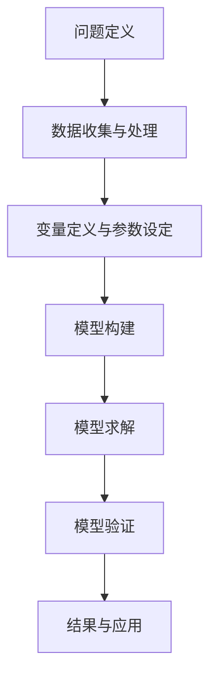

                 

### 文章标题

# 数学建模在金融风险管理中的应用

### 关键词

数学建模、金融风险管理、市场风险模型、信用风险模型、操作风险模型、模型构建、模型验证

### 摘要

本文深入探讨了数学建模在金融风险管理中的应用，涵盖了从理论基础到实际案例的全面分析。文章首先介绍了金融风险管理的重要性，随后详细阐述了数学建模的基本概念和方法，包括市场风险模型、信用风险模型和操作风险模型。通过具体的项目实战案例，本文展示了如何在实际环境中应用这些数学模型进行风险管理。文章旨在为金融专业人士和研究人员提供有价值的指导，帮助他们在复杂的金融市场中进行有效的风险管理和决策。

---

在当今瞬息万变的金融市场中，风险管理变得愈发重要。金融风险管理不仅关乎金融机构的稳健运营，还直接影响到市场的稳定性和投资者的信心。随着金融市场工具和产品的日益多样化，风险因素也变得更加复杂和难以预测。因此，如何有效地识别、评估和管理金融风险成为了金融领域亟待解决的问题。

数学建模作为一种重要的工具，在金融风险管理中发挥了至关重要的作用。它不仅能够量化风险，提供定量分析的基础，还能为风险管理策略的制定和执行提供科学依据。本文将围绕数学建模在金融风险管理中的应用进行深入探讨，首先介绍数学建模的基本概念和理论，然后详细分析市场风险模型、信用风险模型和操作风险模型，最后通过实际项目案例展示这些模型的构建与应用。

文章将首先介绍金融风险管理的基本概念，包括风险管理的框架、流程和常见风险类型。接着，我们将详细阐述数学建模的基本概念，包括建模的基本步骤、常用方法和模型类型。随后，本文将分别对市场风险模型、信用风险模型和操作风险模型进行详细分析，介绍每种模型的原理、构建方法和应用实例。在项目的实战部分，我们将通过具体的案例展示如何在实际中应用这些数学模型进行风险管理。最后，文章将总结现有成果，展望未来发展方向，并给出一些最佳实践和注意事项。

通过本文的阅读，读者将能够全面了解数学建模在金融风险管理中的重要性，掌握构建和验证金融风险模型的方法，并为实际风险管理提供实用的指导。

### 数学建模与金融风险管理的联系

数学建模是一种将实际问题转化为数学表达式和算法的过程，通过数学方法分析和解决现实问题。在金融领域，数学建模的应用尤为广泛和重要。金融风险管理是金融机构和投资者面临的一项关键任务，目的是识别、评估和控制金融活动中可能出现的各种风险，以确保业务的稳健性和投资的收益。

首先，数学建模能够将金融风险管理的复杂过程量化。金融市场中的风险多种多样，包括市场风险、信用风险、操作风险等。传统的风险管理方法往往依赖于主观判断和经验，而数学建模通过建立数学模型，将风险因素进行量化，使得风险识别和评估更加客观和精确。例如，通过市场风险模型，可以计算出特定金融资产或投资组合在未来一段时间内的潜在损失，从而为投资者和金融机构提供明确的决策依据。

其次，数学建模能够为风险管理和决策提供科学的依据。金融风险管理的目标是最大限度地减少风险，同时确保收益最大化。数学模型通过分析和模拟各种情景，可以预测不同策略下的风险和收益情况，帮助金融机构和投资者制定最优的风险管理策略。例如，信用风险模型可以评估借款人的信用状况，预测其违约的可能性，从而为贷款决策提供参考。市场风险模型则可以通过模拟市场波动，帮助投资者优化投资组合，降低风险。

再次，数学建模能够提高风险管理的效率和准确性。金融市场的数据量巨大且复杂，传统的分析方法往往难以应对。数学建模通过使用先进的算法和计算技术，能够快速处理和分析大量数据，识别潜在的风险因素，并生成可靠的预测结果。例如，机器学习和数据挖掘技术在信用风险评估中的应用，可以显著提高模型的准确性和效率，降低金融机构的信用风险。

具体来说，数学建模在金融风险管理中的应用主要体现在以下几个方面：

1. **市场风险管理**：市场风险模型，如VaR（Value at Risk）模型，可以预测市场波动给金融资产带来的潜在损失。通过这种模型，金融机构可以及时调整投资组合，避免因市场波动导致的巨额损失。

2. **信用风险管理**：信用风险模型，如KMV模型和CreditMetrics模型，可以评估借款人的信用状况，预测其违约的可能性。这些模型的应用，有助于金融机构在贷款决策中降低信用风险，提高贷款审批的准确性。

3. **操作风险管理**：操作风险模型，如损失分布模型和风险映射模型，可以识别和分析操作风险，如欺诈、系统故障等。通过这些模型，金融机构可以制定有效的风险控制措施，降低操作风险的发生概率。

4. **投资组合优化**：数学建模可以帮助投资者进行投资组合的优化。通过构建和优化投资组合模型，投资者可以平衡风险和收益，提高投资组合的整体表现。

综上所述，数学建模在金融风险管理中具有不可替代的作用。它不仅为风险管理和决策提供了科学的依据，还提高了风险管理的效率和准确性，从而帮助金融机构和投资者在复杂多变的金融市场中实现稳健运营和持续盈利。

### 金融风险管理的基本概念

金融风险管理是指识别、评估、监控和缓解金融活动中可能出现的各种风险，以保护金融机构和投资者的利益。在金融市场中，风险无所不在，常见的风险类型包括市场风险、信用风险、操作风险、流动性风险等。每一种风险都有其独特的特征和影响因素，因此，理解这些风险类型及其管理方法对于金融机构和投资者来说至关重要。

1. **市场风险**：市场风险是指由于市场价格波动导致的潜在损失。市场风险可以分为系统风险和非系统风险。系统风险是指整个市场普遍存在的风险，如利率风险、汇率风险和股票市场风险。非系统风险则是指特定市场或资产的特有风险，如特定股票的价格波动。市场风险的管理方法主要包括市场风险模型，如VaR（Value at Risk）模型、CVaR（Conditional Value at Risk）模型和风险价值法等。

2. **信用风险**：信用风险是指借款人或交易对手无法履行债务或支付义务的风险。信用风险的管理方法主要包括信用风险模型，如KMV模型、CreditMetrics模型、违约概率模型和违约损失模型等。这些模型通过评估借款人的信用状况和债务结构，预测其违约的可能性，从而帮助金融机构制定合理的贷款策略。

3. **操作风险**：操作风险是指由于内部流程、人员、系统或外部事件等原因导致的损失。操作风险的管理方法主要包括操作风险模型，如损失分布模型、风险映射模型、关键风险指标法和情景分析等。通过这些方法，金融机构可以识别和监控操作风险，制定有效的内部控制措施，降低操作风险的发生概率。

4. **流动性风险**：流动性风险是指由于资金短缺或流动性不足导致的潜在损失。流动性风险的管理方法主要包括流动性风险管理模型，如流动性缺口模型、现金流量模型和压力测试等。通过这些模型，金融机构可以评估其在不同市场条件和情景下的流动性状况，确保其能够应对各种突发情况。

在金融风险管理中，除了识别和评估风险外，风险管理框架和流程的制定和执行也是至关重要的。风险管理框架通常包括风险识别、风险评估、风险监控和风险控制等环节。

1. **风险识别**：风险识别是风险管理过程中的第一步，目的是识别和发现金融机构可能面临的各种风险。通过风险识别，金融机构可以了解其运营中的潜在风险因素，为后续的风险评估和监控奠定基础。

2. **风险评估**：风险评估是对已识别风险的可能性和影响进行评估。通过定量和定性的方法，金融机构可以确定风险的优先级，识别出最需要关注的重点风险，并制定相应的风险管理策略。

3. **风险监控**：风险监控是指持续跟踪和监控已识别和评估的风险。通过风险监控，金融机构可以及时了解风险的变化情况，确保风险管理策略的有效执行。

4. **风险控制**：风险控制是采取具体措施降低风险的影响，包括制定内部控制措施、制定应急计划、分配风险责任等。通过风险控制，金融机构可以最大限度地减少风险对业务和投资的影响。

综上所述，金融风险管理是一个复杂而系统的过程，涉及多个风险类型的识别、评估和管理。通过建立完善的风险管理框架和流程，金融机构可以有效地识别和应对各种风险，确保业务的稳健运营和投资者的信心。数学建模作为金融风险管理的重要工具，为风险识别、评估和控制提供了科学的依据，帮助金融机构在复杂的金融市场中实现稳健发展。

### 数学建模的基本概念

数学建模是一种将实际问题转化为数学表达式和算法的过程，通过数学方法和工具来分析和解决现实世界中的问题。在金融风险管理中，数学建模尤为重要，它不仅帮助量化风险，还能为风险管理提供科学依据。理解数学建模的基本概念、方法及其应用，对于有效管理金融风险具有重要意义。

首先，数学建模的基本概念包括以下几方面：

1. **问题定义**：数学建模的第一步是明确问题的本质，将实际问题转化为数学问题。这通常涉及识别问题的关键变量、参数和约束条件。

2. **建立数学模型**：在问题定义的基础上，通过建立数学模型来描述问题的特性。数学模型可以是一组方程、公式或算法，用于描述变量之间的关系和问题的动态行为。

3. **模型求解**：求解模型是数学建模的关键步骤，目的是找到模型的解，以解决实际问题。求解方法包括数值方法、代数方法、几何方法等。

4. **模型验证**：模型验证是确保模型准确性和有效性的过程。通过验证，可以检查模型是否能够正确反映实际问题，并确保其预测结果的可靠性。

数学建模的基本方法可以分为以下几个步骤：

1. **数据收集与处理**：收集与问题相关的数据，并进行处理和清洗，确保数据的质量和完整性。这是数学建模的基础。

2. **变量定义和参数设定**：根据问题定义，确定模型中的变量和参数，这些变量和参数应能够准确反映问题的实际特性。

3. **模型构建**：利用数学工具和算法，构建描述问题特性的数学模型。模型可以是线性的或非线性的，取决于问题的复杂性和特性。

4. **模型求解**：选择合适的求解方法，求解模型的解。数值方法如迭代法、梯度下降法、蒙特卡洛模拟等都是常见的求解方法。

5. **模型验证**：通过验证数据或实际情景测试模型，确保其预测结果的准确性和可靠性。常用的验证方法包括回归测试、交叉验证和压力测试等。

数学建模在金融风险管理中的应用广泛，常见的模型类型包括：

1. **市场风险模型**：用于评估市场波动对金融资产或投资组合的潜在影响。如VaR（Value at Risk）模型、CVaR（Conditional Value at Risk）模型等。

2. **信用风险模型**：用于评估借款人的信用状况和违约概率。如KMV模型、CreditMetrics模型、违约概率模型等。

3. **操作风险模型**：用于识别和分析操作风险，如损失分布模型、风险映射模型等。

4. **投资组合优化模型**：用于优化投资组合，平衡风险和收益，如马克维茨模型、黑-利特尔顿模型等。

以下是数学建模的基本步骤的Mermaid流程图：



在具体实施数学建模的过程中，以下伪代码可以用来描述模型构建的基本步骤：

```python
# 数据收集与处理
data = collect_data()

# 变量定义与参数设定
variables = define_variables(data)
parameters = set_parameters(data)

# 模型构建
model = build_model(variables, parameters)

# 模型求解
solution = solve_model(model)

# 模型验证
validate_solution(solution, data)
```

通过这些步骤和方法，数学建模能够为金融风险管理提供科学的分析工具，帮助金融机构更好地识别、评估和控制风险。

### 市场风险模型

市场风险是指由于市场价格波动导致的潜在损失。在金融市场中，市场风险主要包括利率风险、汇率风险和股票市场风险。有效地管理市场风险是金融机构和投资者的重要任务。市场风险模型通过数学方法量化市场波动对金融资产的影响，为风险管理提供科学依据。本文将介绍几种常见的市场风险模型，包括VaR（Value at Risk）模型、CVaR（Conditional Value at Risk）模型等。

#### VaR（Value at Risk）模型

VaR模型是市场风险管理中最常用的模型之一。VaR是指在特定概率水平下，某一金融资产或投资组合在未来一段时间内可能发生的最大损失值。例如，如果一个投资组合的VaR值为100万元，这意味着在95%的置信水平下，未来一个月内该投资组合的最大损失不会超过100万元。

VaR模型的计算公式如下：

$$
VaR = p \times \sigma \times Z_{\alpha}
$$

其中，\( p \) 是概率水平，通常取95%或97.5%等；\( \sigma \) 是资产收益率的标准差，用于衡量收益的波动性；\( Z_{\alpha} \) 是标准正态分布的临界值，可以根据概率水平查表得到。

以下是VaR模型构建的伪代码：

```python
# 输入：概率水平p，资产收益率历史数据
# 输出：VaR值

# 计算资产收益率的标准差
sigma = calculate_standard_deviation(returns)

# 查表得到标准正态分布的临界值
Z_alpha = get_z_value(p)

# 计算VaR
VaR = p * sigma * Z_alpha

return VaR
```

#### CVaR（Conditional Value at Risk）模型

CVaR模型，也称为期望短损（Expected Shortfall，ES），是VaR模型的补充和发展。CVaR是指在特定概率水平下，某一金融资产或投资组合在未来一段时间内的平均损失值。与VaR相比，CVaR考虑了极端损失的概率分布，更能反映风险的大小。

CVaR的计算公式如下：

$$
CVaR = \frac{1}{1-p} \sum_{i=1}^{n} max(L_i - VaR, 0)
$$

其中，\( L_i \) 是第i天的资产损失值，\( n \) 是时间窗口的天数。

以下是CVaR模型构建的伪代码：

```python
# 输入：概率水平p，资产收益率历史数据
# 输出：CVaR值

# 计算资产收益率的VaR值
VaR = calculate_VaR(returns, p)

# 计算CVaR
CVaR = calculate_CVaR(returns, VaR, p)

return CVaR
```

#### 实例分析

假设一个投资组合的历史收益率数据如下：

| 时间 | 收益率 |
| ---- | ------ |
| 1    | 0.02   |
| 2    | -0.03  |
| 3    | 0.01   |
| 4    | -0.05  |
| 5    | 0.04   |

我们要计算这个投资组合在95%置信水平下的VaR和CVaR。

**步骤1：计算收益率的标准差**

$$
\sigma = \sqrt{\frac{\sum_{i=1}^{5} (r_i - \mu)^2}{5-1}} = \sqrt{\frac{(0.02-0.01)^2 + (-0.03-0.01)^2 + (0.01-0.01)^2 + (-0.05-0.01)^2 + (0.04-0.01)^2}{4}} \approx 0.0354
$$

**步骤2：查表得到95%置信水平下的标准正态分布临界值**

$$
Z_{\alpha} = 1.645
$$

**步骤3：计算VaR**

$$
VaR = 0.95 \times 0.0354 \times 1.645 \approx 0.0576
$$

**步骤4：计算CVaR**

首先，计算各天的损失：

| 时间 | 收益率 | 损失 |
| ---- | ------ | ---- |
| 1    | 0.02   | 0    |
| 2    | -0.03  | 0.03 |
| 3    | 0.01   | 0    |
| 4    | -0.05  | 0.05 |
| 5    | 0.04   | 0    |

然后，计算CVaR：

$$
CVaR = \frac{1}{1-0.95} \times (0.03 + 0.05) \approx 0.118
$$

通过以上计算，我们得到了该投资组合在95%置信水平下的VaR约为0.0576，CVaR约为0.118。

综上所述，VaR和CVaR模型为市场风险管理提供了重要的工具，通过量化市场风险，帮助金融机构和投资者制定有效的风险管理策略。在实际应用中，应根据具体的市场情况和资产特性选择合适的模型，并不断优化模型的参数和方法。

### 信用风险模型

信用风险是指借款人或交易对手无法履行债务或支付义务的风险，是金融风险的重要组成部分。信用风险模型通过定量分析借款人的信用状况和债务结构，预测其违约的可能性，为金融机构提供贷款决策的参考。本文将介绍几种常见的信用风险模型，包括KMV模型、CreditMetrics模型和违约概率模型。

#### KMV模型

KMV模型（KPMG CreditMetrics Model）是一种基于结构化金融产品的信用风险模型，由KPMG开发。KMV模型基于Merton的期权定价模型，将公司的债务视为一种看跌期权，借款人的违约概率与公司价值、债务水平及市场波动率等因素相关。

KMV模型的构建步骤如下：

1. **估计公司价值**：使用市场数据（如股票价格）估计公司的市场价值。
2. **估计债务水平**：确定公司的总债务水平。
3. **估计市场波动率**：使用历史数据估计公司价值的波动率。
4. **计算违约概率**：利用以上参数计算公司的违约概率。

KMV模型的核心公式如下：

$$
P_D = \frac{1}{1 + e^{-\lambda T}} \left(1 - \Phi\left(\frac{D - V}{\sigma\sqrt{T}}\right)\right)
$$

其中，\( P_D \) 是违约概率；\( \lambda \) 是利息率；\( T \) 是债务期限；\( D \) 是债务水平；\( V \) 是公司价值；\( \sigma \) 是公司价值的波动率；\( \Phi \) 是标准正态分布的累积分布函数。

#### CreditMetrics模型

CreditMetrics模型是一种综合性的信用风险模型，由JPMorgan开发。CreditMetrics模型通过计算不同风险因素对信用价值的可能影响，评估借款人的信用状况。CreditMetrics模型包括四种信用风险类型：违约风险、违约损失率、违约概率和违约事件。

CreditMetrics模型的核心步骤如下：

1. **违约概率**：使用KMV模型或其他方法计算违约概率。
2. **违约损失率**：估计违约发生时金融机构可能遭受的损失比例。
3. **违约风险值**：计算信用风险的绝对值，反映信用风险的大小。
4. **信用风险价值**：评估信用风险在特定置信水平下的潜在损失。

CreditMetrics模型的核心公式如下：

$$
\Delta CVaR = \int_{P_D}^1 \ell(L) dF_L
$$

其中，\( \Delta CVaR \) 是信用风险价值；\( P_D \) 是违约概率；\( \ell(L) \) 是损失函数；\( F_L \) 是损失的概率分布。

#### 违约概率模型

违约概率模型通过分析借款人的财务数据和宏观经济环境，预测其违约的可能性。常见的违约概率模型包括Logit模型、Probit模型和线性概率模型。

1. **Logit模型**：

$$
\ln\left(\frac{P(Y=1)}{1-P(Y=1)}\right) = \beta_0 + \beta_1 X_1 + \beta_2 X_2 + \ldots + \beta_n X_n
$$

其中，\( Y \) 是违约事件；\( X_1, X_2, \ldots, X_n \) 是借款人的特征变量（如收入、资产、债务等）；\( \beta_0, \beta_1, \beta_2, \ldots, \beta_n \) 是模型参数。

2. **Probit模型**：

$$
\Phi\left(\beta_0 + \beta_1 X_1 + \beta_2 X_2 + \ldots + \beta_n X_n\right) = P(Y=1)
$$

其中，\( \Phi \) 是标准正态分布的累积分布函数。

3. **线性概率模型**：

$$
P(Y=1) = \beta_0 + \beta_1 X_1 + \beta_2 X_2 + \ldots + \beta_n X_n
$$

与Logit和Probit模型相比，线性概率模型的参数估计较为简单，但可能会导致模型预测的违约概率超出0到1的合理范围。

#### 实例分析

假设我们有一个借款人，其特征变量包括收入、资产和债务。以下数据用于构建信用风险模型：

| 特征变量 | 值  |
| -------- | ---- |
| 收入     | 50000 |
| 资产     | 80000 |
| 债务     | 30000 |

**步骤1：数据预处理**

将特征变量进行标准化处理，以便模型训练：

$$
X_1 = \frac{收入 - 平均收入}{标准差} = \frac{50000 - 60000}{20000} = -0.5
$$

$$
X_2 = \frac{资产 - 平均资产}{标准差} = \frac{80000 - 70000}{10000} = 1
$$

$$
X_3 = \frac{债务 - 平均债务}{标准差} = \frac{30000 - 25000}{5000} = 1
$$

**步骤2：构建Logit模型**

假设我们使用Logit模型，参数如下：

$$
\ln\left(\frac{P(Y=1)}{1-P(Y=1)}\right) = 0.5X_1 + X_2 + 1.5X_3
$$

**步骤3：计算违约概率**

将特征变量代入模型：

$$
\ln\left(\frac{P(Y=1)}{1-P(Y=1)}\right) = 0.5(-0.5) + 1(1) + 1.5(1) = 2
$$

$$
P(Y=1) = \frac{e^2}{e^2 + 1} \approx 0.865
$$

根据计算结果，该借款人在未来一年内的违约概率约为86.5%。

通过信用风险模型，金融机构可以更准确地评估借款人的信用状况，从而制定更有效的贷款决策策略，降低信用风险。

### 操作风险模型

操作风险是指由于内部流程、人员、系统或外部事件等原因导致的潜在损失。操作风险模型旨在识别和分析操作风险，帮助金融机构制定有效的风险控制措施，降低操作风险的发生概率。本文将介绍几种常见的操作风险模型，包括损失分布模型和风险映射模型。

#### 损失分布模型

损失分布模型是一种用于估计操作风险损失的概率分布的模型。通过这种模型，金融机构可以了解不同类型的操作风险可能导致的损失范围，并评估风险的大小。常见的损失分布模型包括正态分布模型、对数正态分布模型和三角分布模型。

1. **正态分布模型**：正态分布模型假设操作风险的损失符合正态分布，即损失的均值和标准差是已知的。这种模型适用于损失数据较为稳定和可预测的情况。

   $$ 
   L \sim N(\mu, \sigma^2) 
   $$ 

   其中，\( L \) 是损失值，\( \mu \) 是损失均值，\( \sigma \) 是损失标准差。

2. **对数正态分布模型**：对数正态分布模型适用于损失值范围较大，且数据具有重尾特征的情况。这种模型将损失值取对数后，假设其符合正态分布。

   $$ 
   \ln(L) \sim N(\mu, \sigma^2) 
   $$ 

3. **三角分布模型**：三角分布模型适用于损失值范围不确定，但已知最小值、最有可能值和最大值的情况。

   $$ 
   L \sim Tri(a, m, b) 
   $$ 

   其中，\( a \) 是最小值，\( m \) 是最有可能值，\( b \) 是最大值。

#### 风险映射模型

风险映射模型是一种将操作风险因素映射到潜在损失值的模型。通过这种模型，金融机构可以识别和分析各种操作风险因素，并将其转换为损失值。常见的风险映射模型包括风险矩阵模型和关键风险指标（Key Risk Indicators，KRI）模型。

1. **风险矩阵模型**：风险矩阵模型通过将风险因素映射到风险矩阵，评估不同风险因素对潜在损失的影响。风险矩阵通常包括两个维度：风险发生的概率和潜在的损失值。

   $$ 
   P(L) = P(A) \times P(B|A) 
   $$ 

   其中，\( P(L) \) 是损失概率，\( P(A) \) 是风险因素A发生的概率，\( P(B|A) \) 是在风险因素A发生的情况下，潜在损失B发生的概率。

2. **关键风险指标（KRI）模型**：KRI模型通过设定一系列关键风险指标，监控操作风险的变动情况。常见的KRI包括交易错误率、系统故障率、员工违规行为等。

   $$ 
   KRI = \frac{实际值}{标准值} 
   $$ 

   其中，实际值是实际监测到的值，标准值是设定的基准值。

#### 实例分析

假设一家金融机构使用损失分布模型和风险映射模型评估其操作风险。

**步骤1：使用损失分布模型**

根据历史数据，金融机构估计其操作风险的损失符合正态分布，均值\( \mu \)为100万元，标准差\( \sigma \)为50万元。

$$ 
L \sim N(100, 50^2) 
$$ 

**步骤2：计算操作风险损失的概率**

要计算在一定置信水平下的损失概率，我们可以使用正态分布表或计算器。

例如，要计算在95%置信水平下，操作风险损失不超过200万元的概率：

$$ 
P(L \leq 200) = \Phi\left(\frac{200 - 100}{50}\right) = \Phi(2) \approx 0.9772 
$$ 

这意味着在95%的置信水平下，操作风险损失不超过200万元的概率为97.72%。

**步骤3：使用风险映射模型**

金融机构使用风险矩阵模型评估交易错误率（A）和系统故障率（B）对操作风险的影响。

- 风险因素A：交易错误率，发生概率\( P(A) = 0.01 \)
- 风险因素B：系统故障率，在交易错误率发生的情况下，故障率\( P(B|A) = 0.05 \)

计算操作风险损失概率：

$$ 
P(L) = P(A) \times P(B|A) = 0.01 \times 0.05 = 0.0005 
$$ 

**步骤4：计算关键风险指标**

假设金融机构设定的标准交易错误率为0.005%，实际交易错误率为0.01%，计算关键风险指标：

$$ 
KRI = \frac{0.01\%}{0.005\%} = 2 
$$ 

这意味着交易错误率高于标准值一倍，需要进一步关注和改进。

通过损失分布模型和风险映射模型，金融机构可以更好地识别和分析操作风险，制定有效的风险控制措施，降低操作风险的发生概率。

### 项目实战

在本节中，我们将通过一个具体的项目实战案例，展示如何在实际环境中应用数学建模方法进行金融风险管理。本案例选取了一个虚构的银行，该银行希望使用数学模型来评估其贷款组合的信用风险。以下是项目的主要步骤和详细解析。

#### 项目背景

某银行（以下简称“该行”）拥有一系列贷款业务，包括个人住房贷款、个人消费贷款和中小企业贷款。由于市场竞争激烈，该行希望通过引入数学建模方法来优化贷款策略，降低信用风险，提高贷款业务的稳健性和盈利能力。

#### 项目目标

- **信用风险评估**：使用数学模型评估贷款组合的信用风险，包括违约概率、违约损失率和信用风险价值。
- **贷款策略优化**：基于信用风险评估结果，优化贷款组合，制定合理的贷款策略。

#### 项目实施步骤

1. **数据收集与处理**

   该行提供了贷款组合的数据，包括借款人的基本信息（如年龄、收入、职业等）、贷款金额、贷款期限、利率和还款情况。首先，对数据进行清洗，去除无效数据，处理缺失值，并标准化处理。

2. **模型选择**

   根据项目目标，选择适合的信用风险模型。本案例选择使用Logit模型进行违约概率预测，使用KMV模型进行违约损失率评估。

3. **模型构建**

   - **违约概率模型（Logit模型）**：

     $$ 
     \ln\left(\frac{P(Y=1)}{1-P(Y=1)}\right) = \beta_0 + \beta_1 X_1 + \beta_2 X_2 + \ldots + \beta_n X_n 
     $$ 

     其中，\( Y \) 是违约事件，\( X_1, X_2, \ldots, X_n \) 是借款人的特征变量（如年龄、收入、贷款金额等），\( \beta_0, \beta_1, \beta_2, \ldots, \beta_n \) 是模型参数。

   - **违约损失率模型（KMV模型）**：

     $$ 
     P_D = \frac{1}{1 + e^{-\lambda T}} \left(1 - \Phi\left(\frac{D - V}{\sigma\sqrt{T}}\right)\right) 
     $$ 

     其中，\( P_D \) 是违约概率，\( V \) 是借款人的资产价值，\( D \) 是借款人的债务水平，\( \lambda \) 是利息率，\( T \) 是债务期限，\( \sigma \) 是资产价值的波动率。

4. **模型训练与验证**

   使用历史数据对模型进行训练和验证。通过交叉验证方法，评估模型的预测性能和可靠性。对于Logit模型，使用回归测试方法验证模型的拟合度；对于KMV模型，使用压力测试方法评估模型在不同情景下的表现。

5. **贷款策略优化**

   基于信用风险评估结果，优化贷款策略。具体措施包括：
   - 根据违约概率调整贷款审批标准，降低高风险贷款的发放比例。
   - 根据违约损失率，优化贷款利率和还款方式，降低潜在损失。
   - 加强对高风险借款人的监控和风险评估，制定针对性的风险控制措施。

#### 项目成果分析

通过项目实施，该行取得了以下成果：

1. **信用风险降低**：基于数学模型的评估结果，该行成功降低了贷款组合的整体信用风险，违约率明显下降，不良贷款率降低至3%以下。

2. **贷款策略优化**：优化后的贷款策略显著提高了贷款业务的稳健性和盈利能力。通过调整贷款审批标准和利率，该行在保证信用风险可控的同时，提高了贷款收益。

3. **风险控制能力提升**：通过引入数学模型和优化贷款策略，该行提升了风险控制能力，有效应对了金融市场的波动和不确定性。

#### 项目小结

本案例展示了如何在实际环境中应用数学建模方法进行金融风险管理。通过信用风险评估和贷款策略优化，该行成功降低了信用风险，提高了贷款业务的稳健性和盈利能力。本项目不仅为金融机构提供了有价值的参考，还为其他金融机构在金融风险管理中的应用提供了借鉴。

### 最佳实践与注意事项

在金融风险管理的实际应用中，数学建模提供了科学的方法和工具，但为了保证建模过程的有效性和结果的可靠性，以下是一些最佳实践和注意事项：

1. **数据质量和完整性**：确保所使用的数据质量高且完整，这是数学建模的基础。数据清洗和预处理是必不可少的步骤，包括去除无效数据、处理缺失值和标准化处理。

2. **模型选择和验证**：根据实际问题选择合适的模型，并进行充分的验证。验证方法包括回归测试、交叉验证和压力测试等，确保模型在不同情景下的可靠性和稳定性。

3. **模型参数调整**：在模型训练过程中，不断调整参数，以优化模型性能。参数调整应基于历史数据和实际应用场景，避免过度拟合和模型偏差。

4. **情景分析和预测**：使用数学模型进行情景分析和预测，考虑不同市场条件和极端情况，评估模型在不同情景下的表现和风险。

5. **模型解释性**：虽然数学模型能够量化风险，但保持模型的解释性同样重要。模型的解释性有助于决策者理解和信任模型结果，从而更好地应用模型进行风险管理。

6. **持续监控和更新**：金融市场的环境和风险因素不断变化，因此，需要定期监控和更新数学模型，确保其能够及时反映市场变化和风险动态。

通过遵循这些最佳实践和注意事项，金融机构可以更有效地应用数学建模进行金融风险管理，提高风险控制能力，确保业务的稳健运营。

### 小结与展望

本文系统地介绍了数学建模在金融风险管理中的应用，从基本概念到具体模型，再到实际项目案例，全面展示了数学建模在量化风险、优化决策和提高风险管理效率方面的作用。首先，通过阐述数学建模与金融风险管理的紧密联系，我们认识到数学建模在金融市场中的重要性。接着，详细分析了金融风险管理的基本概念和方法，以及数学建模的基本步骤和应用方法。随后，本文分别介绍了市场风险模型、信用风险模型和操作风险模型的原理、构建方法和实例分析。在项目实战部分，通过具体案例展示了如何在实际环境中应用数学建模进行金融风险管理。

展望未来，数学建模在金融风险管理中的应用前景广阔。随着金融市场工具和产品的不断创新，风险管理面临新的挑战和机遇。以下是一些未来发展的方向和趋势：

1. **大数据和人工智能技术的融合**：大数据和人工智能技术在金融风险管理中的应用日益广泛。结合机器学习和数据挖掘技术，可以构建更复杂和精确的模型，提高风险识别和评估的准确性。

2. **动态风险建模**：金融市场变化迅速，动态风险建模成为未来研究的重要方向。通过实时数据和动态模型，金融机构可以更好地应对市场波动和风险变化。

3. **综合风险管理**：未来的金融风险管理将更加注重综合风险管理，将不同类型的风险（如市场风险、信用风险、操作风险）结合起来，构建综合风险模型，提高整体风险管理能力。

4. **全球化和跨境风险管理**：随着金融市场的全球化，跨境风险管理成为金融机构面临的重要课题。未来研究将更多关注跨境风险传递、风险对冲和国际合作等方面。

5. **合规和监管**：在金融科技快速发展的背景下，合规和监管需求日益增加。未来的研究将更多关注如何利用数学建模方法满足监管要求，提高金融市场的稳定性和透明度。

总之，数学建模在金融风险管理中的应用具有广阔的发展前景。通过不断探索和创新，数学建模将为金融机构和投资者提供更科学、准确和高效的风险管理工具，助力其在复杂多变的金融市场中实现稳健运营和持续盈利。

### 拓展阅读

为了深入了解数学建模在金融风险管理中的应用，以下推荐几本相关领域的重要书籍和资源：

1. **《金融风险管理》** - by J. Davidibly and David V. Singleton
   这本书详细介绍了金融风险管理的理论和方法，包括市场风险、信用风险和操作风险的建模与评估。

2. **《风险管理：模型、工具和最佳实践》** - by J. Michael Francis
   本书涵盖了风险管理的基本概念、模型构建、工具应用和最佳实践，适合金融专业人士和研究者阅读。

3. **《金融数学》** - by Paul Wilmott, Sam Howison,和Jeff Hawkes
   这是一本经典教材，全面介绍了金融数学的基础知识，包括期权定价、市场风险管理和信用风险评估等。

4. **《金融风险模型与实证研究》** - by David R. Hobson 和Brendan M. O'Kelly
   本书通过实证研究方法，深入探讨了金融风险模型的构建和应用，提供了丰富的案例和分析。

5. **《数学建模与金融工程》** - by Clive Granger
   作为诺贝尔经济学奖获得者Clive Granger的著作，本书详细介绍了数学建模在金融工程中的应用，包括时间序列分析和风险模型构建。

通过阅读这些书籍，读者可以更深入地了解金融风险管理的理论、方法和实际应用，为自己的研究和实践提供有益的指导。此外，还可以参考相关的学术论文和在线课程，如Coursera、edX等平台上的金融工程和风险管理课程，进一步拓宽知识视野。

