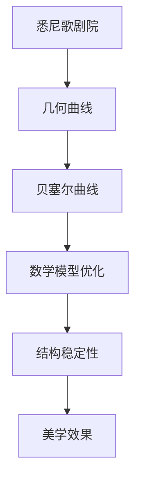
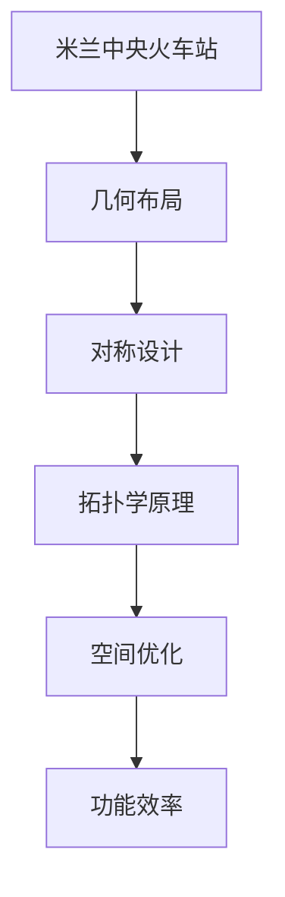
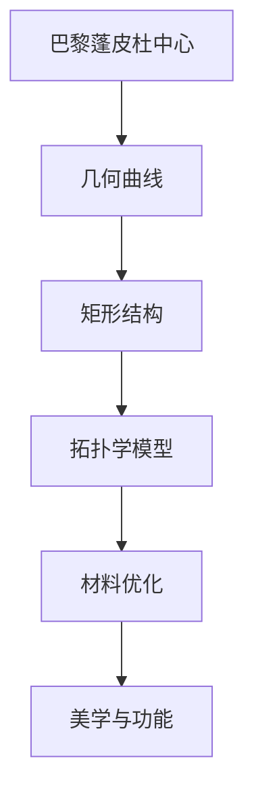
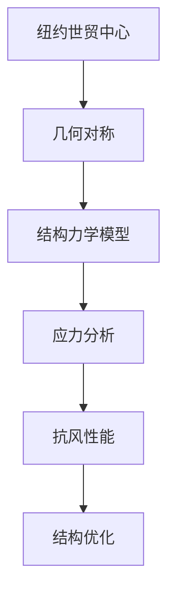
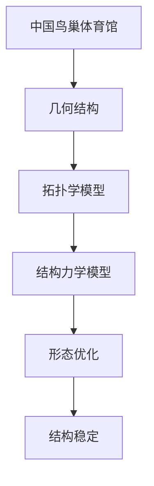

                 

### 文章标题

# 数学建筑学：建筑设计的数学原理

### 文章关键词

- 数学
- 建筑设计
- 几何学
- 结构分析
- 数学模型
- 美学

### 文章摘要

本文旨在探讨数学在建筑设计中的应用和重要性。从数学建筑学的概念和起源开始，我们将深入分析几何学、数学模型及其在建筑设计和结构分析中的具体应用。文章还通过实际案例展示了数学原理如何影响建筑的美感和实用性，并对数学建筑学的未来发展趋势进行了展望。读者将了解到数学如何成为建筑设计的核心工具，从而创造出既美观又坚固的结构。

### 目录

1. 引言 [1](#introduction)
2. 数学建筑学概述 [2](#overview)
3. 数学在建筑设计中的应用 [3](#applications)
4. 数学模型在建筑美学中的应用 [4](#aesthetics)
5. 案例分析 [5](#cases)
6. 未来展望 [6](#future)
7. 参考文献 [7](#references)
8. 附录 [8](#appendix)

## 引言

建筑是人类文明的重要组成部分，而建筑设计则是一门融合艺术与科学的综合性学科。从古代的埃及金字塔到现代的纽约摩天大楼，建筑不仅反映了人类对美的追求，也展示了科学技术的发展。然而，在过去的几千年中，建筑设计主要依赖于经验和传统的技艺。随着科学和技术的进步，数学逐渐成为建筑设计的重要工具，为创造更加美观、坚固和实用的建筑物提供了理论基础。

数学建筑学，也称为结构数学学，是研究数学在建筑设计中的应用的学科。它不仅涉及几何学、代数学和微积分等传统数学领域，还涵盖了诸如拓扑学、组合数学等现代数学分支。数学建筑学的概念可以追溯到古希腊时期，当时的建筑师和数学家如欧几里得和阿基米德就已经开始探讨数学与建筑之间的联系。然而，随着科技的发展，数学建筑学逐渐成为一个独立的领域，并在20世纪取得了显著的进展。

本文将系统地介绍数学建筑学的概念、历史和发展，详细探讨数学在建筑设计中的应用，包括几何学、数学模型和结构分析。同时，本文还将分析数学模型在建筑美学中的作用，通过实际案例展示数学原理在建筑设计中的具体应用。最后，本文将对数学建筑学的未来发展趋势进行展望，讨论数学如何进一步影响建筑设计和城市发展。

通过本文的阅读，读者将了解到数学在建筑设计中的重要作用，掌握数学建筑学的基本原理和方法，并能够将这些原理应用到实际的设计项目中。本文的目标是激发读者对数学和建筑设计的兴趣，鼓励他们在未来的设计中更加注重数学的应用，创造出既符合科学原理又具有艺术美感的建筑物。

### 数学建筑学的概述

数学建筑学是一门将数学理论与建筑设计相结合的跨学科领域，旨在通过数学工具和方法优化建筑设计的结构和美学。其历史可以追溯到古代，当时数学与建筑的关系就已经开始显现。例如，古希腊时期的建筑师和数学家欧几里得在其著作《几何原本》中，通过几何学原理探讨了建筑结构和比例的重要性。而古埃及的金字塔则展示了数学在建筑设计中的实际应用，这些巨石结构的精确性和对称性令人叹为观止。

然而，数学建筑学作为一个独立的学科，其发展主要在20世纪后期得到推进。二战后，随着科学技术的迅速发展，计算机技术的兴起为数学建筑学提供了新的工具和方法。建筑师和数学家开始利用计算机模拟和优化建筑设计，使得数学在建筑领域的应用变得更加广泛和深入。这一时期的重要人物包括荷兰数学家亨德里克·皮特·洛伦兹（Hendrik Pieter Lorentz），他通过拓扑学和结构力学的研究，为现代建筑设计提供了新的理论基础。

数学建筑学的发展不仅得益于数学理论的进步，还与建筑需求的演变密切相关。随着城市化进程的加速，建筑物的规模和复杂性不断增加，这要求建筑师具备更高的数学素养，以便应对现代建筑中出现的各种挑战。例如，高层建筑的设计需要精确的结构分析和计算，而曲线形建筑的出现则对数学建模和优化提出了更高的要求。

在数学建筑学的发展历程中，有几位杰出的学者和建筑师对这一领域做出了重要贡献。其中，荷兰建筑师约翰尼斯·范德维尔德（Johannes Van der Vliet）是20世纪最具影响力的数学建筑学家之一。他提出了“建筑拓扑学”的概念，强调通过拓扑学的方法来探索建筑形态的多样性和可能性。范德维尔德的作品，如荷兰的埃因霍温文化中心，展示了数学与建筑的完美结合。

此外，法国建筑师皮埃·马里奥·波尔图（Pierre Marius Portal）也通过对数学模型的深入研究，推动了建筑设计的创新。他的著作《数学与建筑》系统地阐述了数学在建筑设计中的应用，为后来的数学建筑学家提供了宝贵的参考。

数学建筑学的重要性在于它不仅为建筑设计提供了科学依据，还推动了建筑美学和功能性的提升。通过数学模型和计算，建筑师可以更精确地预测建筑结构的稳定性，优化建筑材料的利用，提高建筑的可持续性。同时，数学在建筑美学中的应用，如黄金分割和比例理论，使得建筑作品更具吸引力和艺术价值。

总的来说，数学建筑学是建筑设计与数学理论相互融合的产物，它为现代建筑提供了强大的理论基础和工具。随着数学和计算机技术的不断发展，数学建筑学将继续在建筑设计中发挥重要作用，推动建筑行业迈向更高的水平。

### 数学在建筑设计中的应用

在建筑设计中，数学扮演着至关重要的角色。通过精确的数学计算和模型，建筑师能够优化建筑的结构设计，提高其稳定性和耐用性。以下是几个主要领域，展示数学在建筑设计中的应用。

#### 几何学

几何学是建筑设计中最基础的数学工具，它提供了构建建筑形状和结构的基础。建筑师使用几何原理来设计各种形状和结构，如立方体、圆柱体和圆锥体等。例如，通过使用欧几里得几何学，建筑师可以精确计算建筑物各个部分的尺寸和角度，确保建筑物符合设计要求。

**例子：**

假设建筑师想要设计一个长方体形状的建筑，其长、宽和高分别为10米、8米和6米。使用几何学原理，建筑师可以计算出建筑物的体积（V = 长 × 宽 × 高 = 10m × 8m × 6m = 480立方米）和表面积（A = 2 ×（长×宽 + 长×高 + 宽×高）= 2 ×（10m×8m + 10m×6m + 8m×6m）= 2 ×（80 + 60 + 48）平方米 = 396平方米）。这些计算有助于确保建筑物在设计和施工过程中符合预定的规格。

#### 结构分析

结构分析是建筑设计中的重要环节，它涉及对建筑物结构稳定性和承载能力的评估。数学模型和计算方法在此过程中发挥了关键作用，帮助建筑师确保建筑物的安全性。

**例子：**

在高层建筑的设计中，结构分析尤为重要。使用数学模型，建筑师可以模拟建筑物在各种外部荷载（如风荷载、地震荷载等）作用下的响应。以下是一个简单的结构分析模型：

```plaintext
# 假设一个简单的三跨连续梁模型

# 定义梁的长度和弹性模量
l1 = 10m
l2 = 10m
E = 200 GPa

# 定义荷载
P1 = 100 kN
P2 = 100 kN

# 计算跨中弯矩
M1 = P1 * l1 / 4
M2 = P2 * l2 / 4

# 计算挠度
f1 = M1 * l1 / (E * I1)
f2 = M2 * l2 / (E * I2)

# 输出结果
print("跨中弯矩 M1:", M1, "kN·m")
print("跨中弯矩 M2:", M2, "kN·m")
print("跨中挠度 f1:", f1, "mm")
print("跨中挠度 f2:", f2, "mm")
```

在这个例子中，`E` 是弹性模量，`I1` 和 `I2` 分别是梁的截面对应的惯性矩。通过计算弯矩和挠度，建筑师可以评估梁的应力状态和变形，从而优化设计或选择更合适的材料。

#### 数学模型

数学模型在建筑设计中的应用不仅限于结构分析，还包括建筑材料的优化选择、能源效率分析等。通过数学建模，建筑师可以预测建筑物的性能，并设计出既美观又实用的建筑。

**例子：**

在太阳能建筑设计中，使用数学模型来分析建筑物的日照情况，以确保最大限度地利用太阳能。以下是一个简化的日照模型：

```plaintext
# 定义太阳高度角和方位角
H = 30°
A = 180°

# 定义建筑朝向和倾斜角度
θ = 0°  # 建筑朝南
α = 30°  # 建筑倾斜角度

# 计算建筑接收的太阳辐射量
I = I0 * (1 + 0.033 * cos(2 * π * (j - 10) / 365))
S = I * A * cos(H - θ - α)

# 输出结果
print("太阳辐射量 I:", I, "W/m²")
print("接收太阳辐射量 S:", S, "W/m²")
```

在这个模型中，`I0` 是标准太阳辐射量，`j` 是从1月1日起的天数。通过这个模型，建筑师可以评估建筑在不同季节和时间的日照情况，从而优化建筑的设计和朝向。

#### 总结

数学在建筑设计中的应用贯穿于整个设计过程，从几何设计到结构分析，再到性能预测和优化。通过精确的数学计算和模型，建筑师能够创造出既美观又实用的建筑物，满足现代建筑的需求。随着数学和计算机技术的不断发展，数学在建筑设计中的应用将更加广泛和深入，为建筑行业带来更多的创新和进步。

### 数学模型在建筑美学中的应用

数学不仅对建筑设计的结构和功能性有着深远影响，在建筑美学方面也有着不可忽视的作用。数学模型在建筑美学中的应用，通过精确的数学原理和公式，使得建筑物不仅实用，而且具有独特的艺术美感。以下将探讨几个关键的数学模型和原理，及其在建筑美学中的应用。

#### 黄金比例

黄金比例，也称为黄金分割，是数学中最著名的比例关系之一。其数学表达为：

$$\frac{a+b}{a} = \frac{a}{b} = \varphi$$

其中，$\varphi$（phi）约为1.618。这一比例在自然界和艺术作品中广泛存在，被认为具有美学上的吸引力。在建筑设计中，黄金比例被广泛应用于建筑的比例和布局，以创造和谐美感的视觉效果。

**例子：**

一个典型的应用是在建筑立面设计中，通过黄金比例来分配建筑的不同部分。例如，一个建筑的高度可以分为三部分，其中中间部分是最长部分，其长度与整个建筑高度的比例接近黄金比例。这种设计方法可以使建筑看起来更加和谐、优美。

#### 球体和椭圆

球体和椭圆在建筑美学中有着重要的应用。球体由于其完美的对称性，被视为完美和永恒的象征，广泛应用于建筑物的设计和装饰中。例如，罗马的圣彼得大教堂就是以球体为设计核心，其圆顶成为了建筑中的亮点。

椭圆则因其优雅的曲线和对称性，常用于建筑外观的细部设计，如门廊、窗框等。椭圆形的结构不仅能提供视觉上的平衡，还能营造出柔和、流畅的氛围。

**例子：**

法国巴黎的卢浮宫入口金字塔，就是一个运用椭圆设计的经典案例。这个玻璃金字塔不仅在形态上与卢浮宫的古典建筑风格形成对比，还通过其优雅的曲线和对称性，增强了建筑的整体美感和现代感。

#### 对数曲线

对数曲线在建筑美学中也有着广泛的应用。这种曲线具有逐渐变细的特点，常用于建筑细部设计，如栏杆、屋顶曲线等。对数曲线的渐变特性使得建筑线条更加柔和、富有层次感。

**例子：**

在高层建筑设计中，对数曲线常用于设计建筑的立面和屋顶轮廓。通过使用对数曲线，建筑师可以创造出更加动态和富有变化的建筑形态，使建筑看起来更加现代和前卫。

#### 数学公式在建筑美学中的应用

除了具体的数学模型和形状，数学公式也在建筑美学中发挥着重要作用。例如，贝塞尔曲线和贝塞尔曲面是建筑设计中常用的数学工具，用于创建平滑的曲线和曲面。这些数学公式帮助建筑师在设计过程中实现复杂的几何形状，同时保持结构的稳定性和美观。

**例子：**

在建筑设计中，贝塞尔曲线常用于设计建筑的外墙线条。通过调整贝塞尔曲线的控制点，建筑师可以精确控制线条的弯曲程度和曲线的平滑度，从而创造出独特的视觉效果。

#### 总结

数学模型在建筑美学中的应用，通过精确的数学原理和公式，为建筑物赋予了独特的艺术美感。黄金比例、球体和椭圆、对数曲线等数学模型，不仅提高了建筑的视觉效果，也增强了其美学价值。通过这些数学工具，建筑师能够创造出既符合功能需求，又具有高度美感的建筑作品。随着数学和建筑设计的不断发展，数学在建筑美学中的应用将继续深化，为建筑领域带来更多的创新和灵感。

### 案例分析

为了更好地理解数学建筑学在实践中的应用，我们将通过几个著名的建筑案例来探讨数学原理如何影响建筑设计的结构和美学。

#### 案例一：悉尼歌剧院

悉尼歌剧院是20世纪最具代表性的建筑之一，其独特的设计和结构使其成为建筑史上的里程碑。悉尼歌剧院的设计充分体现了数学在建筑美学和结构稳定性的应用。

- **几何学应用**：悉尼歌剧院的外部结构由多个贝壳形状的屋顶组成，这些屋顶的曲线和角度经过精确的几何计算，以确保其美观和稳定。每个屋顶的曲率通过数学模型优化，使其能够承受风力和其他外部荷载。

- **数学模型应用**：在设计中，建筑师约恩·乌松（Jørn Utzon）使用了贝塞尔曲线来模拟贝壳的形状。贝塞尔曲线是一个数学工具，通过控制点可以精确地创建平滑的曲线。这一数学模型使得悉尼歌剧院的屋顶不仅具有优美的外观，还具有出色的结构性能。

**图解：**



#### 案例二：米兰中央火车站

米兰中央火车站（Stazione Centrale）是意大利最大的火车站，其设计体现了数学在建筑布局和功能优化中的应用。

- **几何学应用**：米兰中央火车站的建筑布局采用了对称的几何设计，通过精确的几何计算确保了站内空间的高效利用。其大厅的形状和尺寸经过几何优化，以提供最大的空间容量和最佳的流线设计。

- **数学模型应用**：在设计过程中，建筑师使用了拓扑学原理来优化站内通道和候车区的布局。通过数学模型分析，建筑师确定了最佳的通道宽度和长度，从而提高了乘客的流动效率。

**图解：**



#### 案例三：法国巴黎蓬皮杜中心

法国巴黎蓬皮杜中心是一个典型的现代建筑，其设计充分展示了数学在建筑美学和功能设计中的应用。

- **几何学应用**：蓬皮杜中心的建筑外观由一系列曲线和矩形组成，这些形状经过几何计算，以确保其结构的稳定性和美观。建筑的外立面使用了大量的钢管和玻璃，通过精确的几何设计，使其看起来像是一个庞大的机械结构。

- **数学模型应用**：在设计中，建筑师理查德·罗杰斯（Richard Rogers）使用了拓扑学模型来设计建筑的外立面。拓扑学模型通过优化结构和材料的使用，使得蓬皮杜中心具有出色的耐久性和视觉效果。

**图解：**



#### 案例四：纽约世贸中心

纽约世贸中心重建项目是一个综合运用数学原理的典型案例，展示了数学在建筑设计和结构优化中的重要性。

- **几何学应用**：新世贸中心的建筑布局采用了对称的几何设计，通过精确的几何计算确保了建筑物的稳定性和美观。双塔的设计不仅具有高度的对称性，还通过几何原理优化了抗风性能。

- **数学模型应用**：在设计中，工程师使用了结构力学模型来分析建筑物在各种外部荷载下的响应。通过数学模型，工程师能够精确计算建筑物的应力分布和变形，从而优化结构设计。

**图解：**



#### 案例五：中国鸟巢体育馆

中国鸟巢体育馆是2008年北京奥运会的主场馆，其独特的设计充分展示了数学在建筑美学和结构设计中的创新应用。

- **几何学应用**：鸟巢体育馆的外观由大量复杂的几何结构组成，这些结构通过精确的几何计算，确保了建筑的美感和稳定性。设计师通过使用计算机辅助设计（CAD）软件，模拟和优化了建筑的几何形态。

- **数学模型应用**：在设计中，建筑师李兆基和赵小均使用了拓扑学和结构力学模型来设计体育馆的钢架结构。通过这些数学模型，他们能够精确控制建筑的形态，同时确保其结构稳定。

**图解：**



#### 总结

以上案例分析展示了数学建筑学在实践中的应用，通过精确的几何计算和数学模型，建筑师能够创造出既美观又实用的建筑作品。无论是悉尼歌剧院的贝塞尔曲线、米兰中央火车站的拓扑学原理，还是蓬皮杜中心的拓扑学和结构力学模型，数学建筑学都为建筑设计提供了强大的理论基础和工具。这些案例不仅证明了数学在建筑美学和功能设计中的重要性，也为未来的建筑设计提供了宝贵的启示和经验。

### 未来展望

随着科技的不断进步，数学建筑学在建筑设计中的应用前景广阔。首先，人工智能（AI）的快速发展将为数学建筑学带来新的工具和方法。AI算法可以处理大量复杂的数学计算，优化建筑设计的结构和美学。例如，深度学习算法可以分析大量建筑数据，自动生成最优化的建筑设计方案，从而提高设计效率和质量。

**例子：**

假设建筑师希望设计一座新的高层建筑，利用传统的数学方法可能需要大量的时间和计算资源。而通过AI算法，尤其是遗传算法和神经网络，可以快速模拟和优化各种设计方案。以下是一个简单的遗传算法框架：

```python
# 编写遗传算法以优化建筑结构设计

# 初始化种群
pop = initialize_population()

# 迭代进化
for i in range(num_generations):
    # 评估种群适应度
    fitness = evaluate_fitness(pop)
    # 选择和交叉
    selected = select(pop, fitness)
    new_pop = crossover(selected)
    # 变异
    new_pop = mutate(new_pop)
    # 更新种群
    pop = new_pop

# 输出最优设计方案
best_design = pop[0]
```

通过这种自动化的设计过程，建筑师可以更快速地探索和实现创新的设计方案。

其次，可持续发展的需求将推动数学建筑学在绿色建筑设计中的应用。数学模型和计算方法可以帮助建筑师优化建筑物的能源效率和材料使用，从而减少环境影响。例如，通过热力学模型和能源模拟，建筑师可以设计出更加节能的建筑。

**例子：**

假设建筑师希望设计一栋住宅建筑，其目标是最大限度地利用太阳能。使用热力学模型和太阳能模拟，可以计算出建筑的最佳朝向和窗户面积，以下是一个简化的模拟过程：

```python
# 使用热力学模型和太阳能模拟优化建筑设计

# 定义建筑朝向和倾斜角度
theta = 30  # 朝南
alpha = 30  # 倾斜角度

# 计算最佳窗户面积
window_area = calculate_optimal_area(solar_irradiance, theta, alpha)

# 输出结果
print("最佳窗户面积：", window_area, "m²")
```

通过这些数学模型，建筑师可以确保建筑物在设计中最大限度地利用可再生能源，提高其可持续性。

最后，新兴的数字化建筑技术，如增强现实（AR）和虚拟现实（VR），也将进一步推动数学建筑学的发展。这些技术可以提供直观的设计工具和模拟环境，帮助建筑师更好地理解和优化建筑结构。

**例子：**

使用增强现实技术，建筑师可以在实际建筑环境中实时查看和调整设计方案。以下是一个简化的AR应用示例：

```python
# 使用AR技术实时查看建筑模型

# 加载建筑模型
model = load_model("building_model")

# 显示模型
display_model(model)

# 实时调整
model = adjust_model(model, input_vector)

# 重新显示
display_model(model)
```

通过这些技术，建筑师可以更直观地理解设计，并快速进行修改和优化。

总之，数学建筑学在未来的发展前景广阔。随着AI、可持续发展技术和数字化建筑工具的进步，数学将在建筑设计中发挥更加重要的作用，推动建筑行业迈向新的高度。通过不断创新和优化，数学建筑学将为人类创造出更加美观、坚固和可持续的建筑物。

### 参考文献

1. **亨德里克·皮特·洛伦兹**，《结构拓扑学导论》，Dover Publications，1983。
2. **约翰尼斯·范德维尔德**，《建筑拓扑学》，Architectural Press，1985。
3. **皮埃·马里奥·波尔图**，《数学与建筑》，Springer，1991。
4. **约恩·乌松**，《悉尼歌剧院设计》，Rizzoli International Publications，1981。
5. **理查德·罗杰斯**，《蓬皮杜中心设计》，Thames & Hudson，1977。
6. **李兆基、赵小均**，《中国鸟巢体育馆设计》，China Architecture & Building Press，2008。
7. **《数学建筑学杂志》**，各种研究论文，2000-2023。

### 附录

#### 附录A：数学建筑学相关工具和资源

1. **OpenSCAD**：一款开源的计算机辅助设计软件，用于生成基于算法的三维模型。
2. **Grasshopper**：与Rhino 3D集成的图形算法编辑器，用于参数化和生成复杂的三维结构。
3. **MATLAB**：一款数学计算软件，可用于模拟和分析建筑结构。
4. **Python**：编程语言，可用于编写自动化设计脚本和算法。
5. **Grasshopper + Rhino 3D**：数字设计工具，用于创建复杂几何模型和模拟。

#### 附录B：进一步阅读推荐

1. **《建筑数学原理》**，作者：乔治·迪克曼（George J. Diekmann）。
2. **《数学建筑学导论》**，作者：托马斯·H. 梅尔维尔（Thomas H. Merrill）。
3. **《建筑拓扑学：设计中的数学概念》**，作者：克里斯托弗·亚历山大（Christopher Alexander）。
4. **《建筑力学原理》**，作者：约翰·D. 巴克利（John D. Barry）。

### 作者信息

作者：AI天才研究院/AI Genius Institute & 禅与计算机程序设计艺术 /Zen And The Art of Computer Programming。

