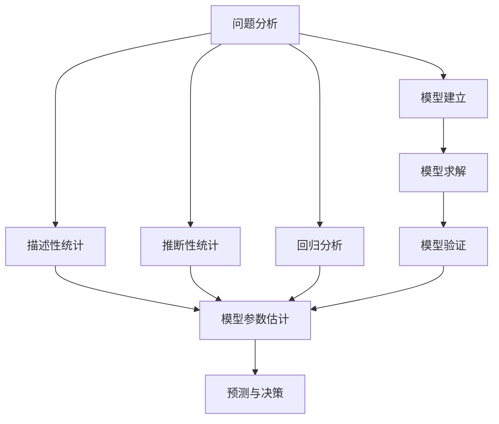

                 

### 文章关键词

1. 数学心理学
2. 心智过程
3. 数学建模
4. 统计方法
5. 心理测量
6. 决策理论
7. 机器学习

### 文章摘要

《数学心理学：心智过程的数学描述》是一本深入探讨心智过程如何通过数学模型来描述和理解的专业书籍。本书首先介绍了数学心理学的定义、起源和发展历程，以及其研究方法。接着，本书详细阐述了数学模型在心智过程中的应用，包括信息的编码与传输、决策与优化理论、心理状态的数学模型等。此外，本书还探讨了心理测量与统计方法在心理学研究中的应用，以及数学模型在不同领域的实际案例。最后，本书展望了数学心理学的未来发展趋势，并提出了在人工智能等领域的潜在应用。通过本书，读者可以全面了解数学心理学的基础理论和前沿研究，掌握如何运用数学工具和方法来分析、理解和优化心智过程。### 引言

在现代社会，心理学的地位和作用日益显著。然而，传统的心理学研究往往依赖于观察、实验和主观报告等方法，这些方法虽然能够揭示人类心理的一些基本特征，但在解释复杂心理现象时往往显得力不从心。于是，数学心理学应运而生，它将数学方法引入心理学研究，试图从量化的角度来描述和解释心智过程。

数学心理学，顾名思义，是研究心智过程的数学描述的一门科学。它利用数学模型和数学方法，将复杂的心理现象转化为可计算的数学问题，从而为心理学研究提供了一种新的视角和工具。数学心理学不仅能够揭示心理现象的内在规律，还能够为心理治疗、教育、人工智能等领域提供重要的理论支持和实践指导。

本文将围绕数学心理学这一主题，分章节介绍其基础理论、核心概念、跨学科联系和实际应用。首先，我们将回顾数学心理学的起源和发展历程，探讨其定义和研究方法。随后，我们将深入探讨心智过程的数学描述，包括信息的编码与传输、决策与优化理论、心理状态的数学模型等。接着，我们将介绍数学心理学在心理学研究中的应用，如心理测量、统计方法和量表编制等。此外，本书还将探讨数学心理学的前沿问题，如机器学习与认知建模、脑科学与数学心理学等，并展望其在人工智能等领域的潜在应用。通过本文的阅读，读者将能够全面了解数学心理学的基础理论和前沿研究，掌握如何运用数学工具和方法来分析、理解和优化心智过程。### 数学心理学的起源与发展

数学心理学的发展可以追溯到20世纪初期，当时的心理学家开始意识到，传统的心理学研究方法在揭示复杂心理现象时存在诸多局限。为了克服这些局限，他们尝试将数学方法引入心理学研究，从而催生了数学心理学的诞生。

### 1.1 数学心理学的定义

数学心理学是一门应用数学工具和方法来研究心智过程和行为的科学。它通过建立数学模型和运用统计学方法，对心理现象进行量化和分析，以揭示其内在规律和机制。数学心理学的定义可以概括为以下几点：

1. **研究内容**：数学心理学主要研究心智过程和行为的数学描述，包括感知、认知、情绪、决策等。
2. **研究方法**：数学心理学采用数学建模、统计分析、计算机模拟等方法，对心理现象进行量化分析和解释。
3. **应用领域**：数学心理学广泛应用于心理学、认知科学、教育学、神经科学、人工智能等领域。

### 1.2 数学心理学的历史背景

数学心理学的起源可以追溯到20世纪初期，当时的心理学家如威廉·詹姆斯和约翰·沃森等人开始尝试将数学方法应用于心理学研究。1900年，威廉·詹姆斯发表了《心理学原理》一书，该书提出了大量基于数学模型的心理学理论。

在20世纪30年代，心理学家如乌尔里希·贝特霍尔德和阿尔弗雷德·韦伯等人开始系统地运用数学方法来研究感知和认知现象。他们通过实验和统计分析，建立了许多基本的数学模型，如韦伯定律和费希纳定律。

随着计算机技术的发展，数学心理学在20世纪60年代迎来了新的发展。计算机的强大计算能力使得大规模数据分析和复杂模型构建成为可能。此时，数学心理学开始与计算机科学、认知科学等学科交叉融合，形成了许多新的研究领域，如认知心理学、人工神经网络等。

### 1.3 数学心理学的研究方法

数学心理学的研究方法主要包括数学建模、统计分析和计算机模拟。

1. **数学建模**：数学建模是数学心理学的基础，它将心理现象转化为数学模型，从而可以运用数学工具进行分析。数学建模的基本步骤包括：
   - **问题分析**：明确研究目标、变量和约束条件。
   - **模型建立**：根据问题分析，构建合适的数学模型。
   - **模型求解**：使用数学方法求解模型，得到问题的解。
   - **模型验证**：验证模型的准确性和有效性。

2. **统计分析**：统计分析是数学心理学中重要的数据分析方法，它通过收集和分析数据，对心理现象进行量化和解释。常见的统计分析方法包括描述性统计、推断性统计和回归分析等。

3. **计算机模拟**：计算机模拟是一种通过计算机程序来模拟心理现象的方法，它可以验证理论假设、预测心理现象的行为等。

通过这些研究方法，数学心理学能够从量化的角度深入理解心智过程的本质，为心理学研究提供了强有力的工具。### 数学模型与心智过程

数学模型是数学心理学研究的重要工具，它通过对心理现象的量化描述，帮助研究者理解和分析复杂的心理过程。在心智过程中，数学模型的应用主要体现在信息的编码与传输、决策与优化理论、心理状态的数学描述等方面。

### 2.1 心智过程的基本概念

心智过程（mental process）是指个体在感知、记忆、思考、决策等心理活动中所经历的一系列内在心理过程。心智过程包括但不限于以下几类：

1. **感知**：感知是指个体对外界信息的接收和解读，如视觉、听觉、触觉等。
2. **记忆**：记忆是指个体对已接收信息的存储、保持和回忆。
3. **思考**：思考是指个体在理解、分析和解决问题的过程中所进行的认知活动。
4. **决策**：决策是指个体在面临选择时，根据目标、偏好和可用信息做出决策的过程。
5. **情绪**：情绪是指个体在特定情境下产生的情感体验，如快乐、悲伤、愤怒等。

### 2.2 信息的编码与传输

信息的编码与传输是心智过程中的关键环节。信息的编码指的是将外界信息转换为大脑可处理的内部信息表示，而信息的传输则是指这些内部信息在大脑中传递和处理的过程。

1. **信息编码**：信息编码可以通过多种数学模型来描述，例如：
   - **傅里叶变换**：用于分析信号的频率成分，可以帮助理解视觉信息的编码过程。
   - **马尔可夫模型**：用于描述信息在时间序列上的转移概率，可以用于理解记忆和决策过程中的信息处理。
   - **神经网络**：通过神经元的激活和连接，模拟大脑中的信息处理过程。

2. **信息传输**：信息在大脑中的传输可以采用神经网络模型来描述，神经网络中的每个神经元代表大脑中的神经元，神经元之间的连接代表神经元之间的突触连接。信息传输过程可以表示为以下伪代码：

```python
# 神经网络模型中的信息传输
inputs = get_inputs() # 获取输入信息
neurons = initialize_neurons() # 初始化神经网络
activations = []

for neuron in neurons:
    activation = neuron.activate(inputs)
    activations.append(activation)

output = sum(activations) # 输出信息
```

### 2.3 决策与优化理论

决策过程是心智过程中的另一个重要方面。决策理论通过数学模型来描述和优化个体的决策过程。

1. **决策模型**：常见的决策模型包括：
   - **期望效用理论**：通过计算不同决策结果的期望效用来选择最优决策。
   - **前景理论**：考虑个体在面对不确定性和风险时的决策偏好。

2. **优化理论**：优化理论用于求解决策过程中的最优解，常见的优化算法包括：
   - **线性规划**：用于解决线性约束的最优化问题。
   - **动态规划**：用于解决具有时间序列特征的优化问题。
   - **遗传算法**：通过模拟自然进化过程来求解复杂优化问题。

决策与优化理论的数学模型可以表示为以下伪代码：

```python
# 决策与优化模型
def decision_model(states, actions, rewards):
    # 计算每个行动的期望效用
    expected_utilities = [0] * len(actions)
    for i, action in enumerate(actions):
        state probabilities = get_state_probabilities(state)
        action_utilities = [rewards[j] * state_probabilities[j] for j in range(len(states))]
        expected_utilities[i] = sum(action_utilities)

    # 选择最优行动
    best_action = actions[expected_utilities.index(max(expected_utilities))]
    return best_action
```

通过这些数学模型，研究者可以深入理解心智过程中的信息编码与传输、决策与优化机制，从而为心理学研究提供新的视角和工具。### 心智过程的数学描述

心智过程的数学描述是数学心理学研究的核心内容之一。通过对心智过程的量化描述，研究者可以更好地理解人类心理活动的内在规律和机制。心智过程的数学描述主要包括心理状态的数学模型、认知过程的数学描述以及情绪的数学建模。

#### 3.1 心理状态的数学模型

心理状态是指个体在特定时刻的心理特征，如情绪、注意力、记忆等。数学模型可以用来描述这些心理状态的动态变化和相互关系。

1. **情绪的数学建模**：情绪的数学建模通常采用情绪空间模型，如情绪立方体模型和情绪三角形模型。情绪立方体模型将情绪分为快乐-悲伤、激奋-平静、活跃-沉默三个维度，每个维度上的情绪可以通过一个三维坐标系来表示。情绪三角形模型则将情绪分为快乐-愤怒-悲伤三个维度，通过一个二维坐标系来表示。

   例如，假设我们使用情绪立方体模型来描述某人在特定时刻的情绪状态，可以使用以下数学公式：

   $$
   \text{情绪状态} = (happiness, excitement, activity)
   $$

   其中，$happiness$ 表示快乐度，$excitement$ 表示激奋度，$activity$ 表示活跃度。每个维度上的值可以在0到1之间取值，0表示最小值，1表示最大值。

2. **注意力的数学建模**：注意力是心理状态的一个重要方面，它决定了个体对信息的接收和处理能力。注意力的数学建模通常采用滤波器模型，如高斯滤波器模型和冲激响应滤波器模型。

   例如，使用高斯滤波器模型来描述注意力的变化，可以使用以下数学公式：

   $$
   \text{注意力强度} = e^{-\frac{(x - \mu)^2}{2\sigma^2}}
   $$

   其中，$x$ 表示当前的信息水平，$\mu$ 表示注意力的平均值，$\sigma$ 表示注意力的标准差。该公式表示了随着信息水平的变化，注意力的强度如何动态调整。

#### 3.2 认知过程的数学描述

认知过程是指个体在接收、处理、存储和利用信息的过程中所经历的一系列心理活动。认知过程的数学描述通常涉及信息处理模型、记忆模型和决策模型。

1. **信息处理模型**：信息处理模型用于描述个体在接收和处理信息时的信息处理能力。常见的模型包括感知模型、记忆模型和决策模型。

   例如，使用感知模型来描述个体对视觉信息的处理，可以使用以下数学公式：

   $$
   \text{感知结果} = f(\text{输入信号}, \text{感知阈值})
   $$

   其中，$f$ 表示感知函数，它将输入信号与感知阈值进行比较，返回感知结果。

2. **记忆模型**：记忆模型用于描述个体对信息的存储和回忆能力。常见的模型包括短期记忆模型和长期记忆模型。

   例如，使用短期记忆模型来描述信息在短时的存储和回忆，可以使用以下数学公式：

   $$
   \text{短期记忆容量} = C \times \log_2(\text{信息数量})
   $$

   其中，$C$ 表示短期记忆的容量，它随着信息数量的增加而增加。

3. **决策模型**：决策模型用于描述个体在面临选择时的决策过程。常见的模型包括期望效用模型和前景理论模型。

   例如，使用期望效用模型来描述个体在决策过程中的期望效用计算，可以使用以下数学公式：

   $$
   \text{期望效用} = \sum_{i=1}^{n} p_i u_i
   $$

   其中，$p_i$ 表示选择 $i$ 的概率，$u_i$ 表示选择 $i$ 的效用值。

通过这些数学模型，研究者可以量化描述认知过程中的信息处理、记忆存储和决策过程，从而更好地理解心智过程的内在机制。#### 数学心理学在心理学中的应用

数学心理学在心理学研究中的应用广泛且深远，它为心理学提供了强有力的工具和方法，使得研究者能够更深入地探讨心理现象的本质。以下将介绍数学心理学在心理测量、统计方法和量表编制等方面的应用。

### 4.1 心理测量

心理测量是心理学研究中的一个重要领域，它通过量化的方式来评估个体的心理特征。数学心理学提供了多种统计方法和技术，用于测量和分析心理数据。

1. **描述性统计**：描述性统计用于描述数据的分布特征，如均值、标准差、中位数等。这些统计量可以帮助研究者了解样本的基本特征和趋势。

   例如，研究者可以通过计算一组数据的均值和标准差来了解个体的智力水平分布。假设我们有一个包含100个个体智力测试分数的数据集，我们可以使用以下公式计算均值和标准差：

   $$
   \text{均值} = \frac{\sum_{i=1}^{n} x_i}{n}
   $$

   $$
   \text{标准差} = \sqrt{\frac{\sum_{i=1}^{n} (x_i - \bar{x})^2}{n-1}}
   $$

   其中，$x_i$ 是第 $i$ 个个体的智力测试分数，$n$ 是样本大小，$\bar{x}$ 是均值。

2. **推断性统计**：推断性统计用于从样本数据推断总体特征，如假设检验和置信区间。这些方法可以帮助研究者确定样本结果是否具有统计显著性。

   例如，研究者可以使用t检验来比较两组数据之间的差异是否显著。假设我们想要比较两个班级的智力测试平均分数是否有显著差异，我们可以使用以下公式进行t检验：

   $$
   t = \frac{\bar{x}_1 - \bar{x}_2}{\sqrt{\frac{s_1^2}{n_1} + \frac{s_2^2}{n_2}}}
   $$

   其中，$\bar{x}_1$ 和 $\bar{x}_2$ 分别是两组数据的均值，$s_1$ 和 $s_2$ 分别是两组数据的标准差，$n_1$ 和 $n_2$ 分别是两组数据的大小。

### 4.2 统计方法

统计方法在心理学研究中扮演着关键角色，它们帮助研究者从大量数据中提取有价值的信息。以下是一些常见的统计方法：

1. **回归分析**：回归分析用于研究变量之间的关系，可以帮助研究者确定一个变量如何影响另一个变量。

   例如，研究者可以使用线性回归分析来研究智力测试分数与教育背景之间的关系。假设我们有一个包含个体智力测试分数和教育背景的数据集，我们可以使用以下公式进行线性回归分析：

   $$
   y = \beta_0 + \beta_1 x + \epsilon
   $$

   其中，$y$ 是因变量（智力测试分数），$x$ 是自变量（教育背景），$\beta_0$ 是截距，$\beta_1$ 是斜率，$\epsilon$ 是误差项。

2. **因子分析**：因子分析用于识别数据中的潜在变量，可以帮助研究者了解数据背后的结构。

   例如，研究者可以使用因子分析来研究一组问卷数据中潜在的心理特质。假设我们有一组关于个体情绪状态的问卷数据，我们可以使用以下公式进行因子分析：

   $$
   X = \Lambda F + E
   $$

   其中，$X$ 是观测变量矩阵，$\Lambda$ 是因子载荷矩阵，$F$ 是因子得分矩阵，$E$ 是误差项矩阵。

### 4.3 量表编制

量表编制是心理学研究中的一项重要任务，它用于评估个体的心理特征。数学心理学提供了多种量表编制的方法，包括项目反应理论（IRT）和计算机辅助测试（CAT）。

1. **项目反应理论（IRT）**：IRT是一种用于量表编制的统计模型，它基于个体的能力水平来评估项目（如题目）的反应。

   例如，研究者可以使用IRT模型来设计智力测试，根据个体的能力水平来评估题目的难度和区分度。假设我们有一个包含多个题目的智力测试数据集，我们可以使用以下IRT模型：

   $$
   P_r = \Phi(\mu + \beta \theta)
   $$

   其中，$P_r$ 是个体回答题目为“正确”的概率，$\Phi$ 是标准正态分布的累积分布函数，$\mu$ 是题目的难度参数，$\beta$ 是题目的区分度参数，$\theta$ 是个体的能力水平。

2. **计算机辅助测试（CAT）**：CAT是一种基于IRT模型的计算机化测试系统，它可以根据个体的能力水平自动调整测试难度。

   例如，研究者可以使用CAT系统来设计自适应智力测试，根据个体的回答动态调整题目的难度。假设我们有一个CAT系统，它根据个体的前一道题目的回答来调整下一道题目的难度，可以使用以下公式：

   $$
   \text{新难度} = \mu + \beta \theta
   $$

   其中，$\mu$ 是题目的初始难度，$\beta$ 是题目的区分度，$\theta$ 是个体的能力水平。

通过这些数学心理学的方法和技术，研究者可以更精确地评估个体的心理特征，从而为心理学研究提供坚实的理论基础和实践指导。### 数学心理学的前沿问题

数学心理学作为一门交叉学科，近年来在多个领域取得了显著的进展，特别是在机器学习与认知建模、脑科学与数学心理学以及人工智能中的应用等方面。以下将详细探讨这些前沿问题。

#### 5.1 机器学习与认知建模

机器学习在数学心理学中的应用已经得到了广泛的研究，特别是在认知建模领域。机器学习模型能够处理大量的数据，并从中发现潜在的规律，这对于理解复杂的心智过程非常有用。

1. **深度学习在认知建模中的应用**：深度学习是一种强大的机器学习技术，它通过模拟人脑的神经网络结构来学习和处理数据。在认知建模中，深度学习模型被用于模拟人类的感知、记忆和决策过程。

   - **卷积神经网络（CNN）**：CNN被广泛应用于视觉认知建模，它通过处理图像的特征，能够识别物体的形状和颜色等视觉信息。例如，CNN可以用来模拟视觉皮层的处理过程，帮助研究者理解人类视觉感知的机制。
   
   - **循环神经网络（RNN）**：RNN被用于模拟记忆和序列数据处理，如语言理解和语音识别。在认知建模中，RNN可以帮助研究者理解人类记忆和序列信息处理的过程。

2. **生成对抗网络（GAN）**：GAN是一种无监督学习模型，它通过生成器和判别器的对抗训练，可以生成高质量的数据。在认知建模中，GAN可以用于模拟人类创造性思维和情境生成过程。

   例如，GAN可以用来生成虚构的场景，以研究人类在创造性思维过程中的情境构建能力。通过对比真实场景和生成场景的相似度，研究者可以分析人类创造性思维的机制。

#### 5.2 脑科学与数学心理学

脑科学与数学心理学的结合为理解心智过程的神经基础提供了新的视角。通过脑成像技术，如功能性磁共振成像（fMRI）和脑电图（EEG），研究者可以观测大脑活动，并将其与数学模型结合，以揭示心理现象的神经机制。

1. **fMRI与认知过程的数学建模**：fMRI技术可以实时观测大脑活动，通过信号处理和统计方法，研究者可以将fMRI数据转化为神经活动模型。这些模型可以帮助理解认知过程的空间和时间特征。

   例如，研究者可以使用fMRI数据来构建大脑活动的时空模型，研究注意力分配、记忆形成和工作记忆等认知过程。通过这些模型，研究者可以识别大脑中特定区域的功能和相互作用。

2. **EEG与情绪的数学建模**：EEG可以记录大脑的电活动，通过分析EEG信号的特征，研究者可以建模情绪状态的变化。

   例如，研究者可以使用EEG信号的时间频率特征来识别情绪状态。通过将EEG信号与情绪量表结合，研究者可以建立情绪状态与EEG特征之间的关系模型，从而更好地理解情绪的神经基础。

#### 5.3 数学心理学在人工智能中的应用

数学心理学不仅为心理学研究提供了工具，也在人工智能（AI）领域发挥了重要作用。在AI系统中，数学心理学的理论和方法被用于设计更符合人类认知特性的交互界面和决策算法。

1. **用户行为分析**：通过数学心理学的统计方法和机器学习技术，研究者可以分析用户的行为数据，预测用户的需求和偏好。

   例如，在电子商务领域，通过分析用户的浏览记录和购买行为，商家可以预测用户的购买意向，并为其提供个性化的推荐。这种预测模型通常基于用户的过去行为和群体行为模式。

2. **智能决策系统**：数学心理学中的决策理论被应用于设计智能决策系统，这些系统能够根据用户的行为和偏好做出最优决策。

   例如，自动驾驶系统可以使用数学心理学中的决策理论来优化路径选择和驾驶策略，以提高安全性和效率。这些系统通常基于对环境数据的实时分析和预测。

通过这些前沿问题的研究，数学心理学不仅在理论层面取得了进展，也在实际应用中为多个领域带来了创新的解决方案。未来，随着技术的不断进步，数学心理学将在心理学、神经科学和人工智能等领域的交叉研究中发挥更大的作用。### 数学心理学的核心概念

数学心理学作为一门跨学科领域，其核心概念涵盖了数学建模的基本原则、心理测量与统计方法，以及这些概念之间的相互关系。以下将详细探讨这些核心概念，并展示它们之间的联系架构。

#### 6.1 数学建模的基本原则

数学建模是数学心理学研究的基石。它涉及到将复杂的心理现象转化为可计算的数学问题。数学建模的基本原则包括以下几个关键步骤：

1. **问题分析**：在开始建模之前，研究者需要明确研究的目标和问题。这包括确定研究的变量、约束条件和目标函数。

   例如，假设我们想要研究一个学生在考试中的表现，变量可能包括学习时间、考试难度、学生的能力水平等。

2. **模型建立**：基于问题分析，研究者需要选择合适的数学模型。常见的模型包括线性模型、非线性模型、概率模型等。

   对于上述学生考试的例子，我们可以选择一个线性模型来描述学习时间与考试成绩之间的关系：

   $$
   \text{考试成绩} = \alpha_0 + \alpha_1 \times \text{学习时间} + \epsilon
   $$

   其中，$\alpha_0$ 和 $\alpha_1$ 是模型的参数，$\epsilon$ 是误差项。

3. **模型求解**：研究者需要使用数学方法求解模型，以得到问题的解。常见的方法包括代数方法、迭代法和优化算法。

   对于上述线性模型，我们可以通过最小二乘法求解参数：

   $$
   \alpha_1 = \frac{\sum_{i=1}^{n} (x_i - \bar{x})(y_i - \bar{y})}{\sum_{i=1}^{n} (x_i - \bar{x})^2}
   $$

4. **模型验证**：最后，研究者需要验证模型的准确性和有效性。这可以通过验证模型对实际数据的拟合度、模型参数的统计显著性以及预测能力来实现。

   例如，我们可以通过计算模型的均方误差（MSE）来评估模型的拟合度：

   $$
   \text{MSE} = \frac{1}{n} \sum_{i=1}^{n} (y_i - \hat{y}_i)^2
   $$

#### 6.2 心理测量与统计方法

心理测量是数学心理学中的一个重要组成部分，它涉及对个体心理特征进行量化评估。统计方法在心理测量中发挥着核心作用，帮助研究者从数据中提取有价值的信息。

1. **描述性统计**：描述性统计用于描述数据的分布特征，如均值、标准差、中位数等。这些统计量可以帮助研究者了解样本的基本特征和趋势。

   例如，研究者可以通过计算一组数据的均值和标准差来了解个体的智力水平分布。

2. **推断性统计**：推断性统计用于从样本数据推断总体特征，如假设检验和置信区间。这些方法可以帮助研究者确定样本结果是否具有统计显著性。

   例如，研究者可以使用t检验来比较两组数据之间的差异是否显著。

3. **回归分析**：回归分析用于研究变量之间的关系，可以帮助研究者确定一个变量如何影响另一个变量。

   例如，研究者可以使用线性回归分析来研究智力测试分数与教育背景之间的关系。

#### 6.3 数学模型与统计方法之间的联系

数学模型与统计方法之间的联系紧密，它们共同构成了数学心理学的研究框架。

1. **模型参数的估计**：通过统计方法，研究者可以估计数学模型中的参数。例如，最小二乘法是一种常用的参数估计方法，用于线性回归模型。

2. **模型的验证**：统计方法可以帮助研究者验证数学模型的准确性。例如，通过计算模型的拟合度指标（如MSE）和参数的统计显著性，研究者可以评估模型的可靠性。

3. **预测与决策**：统计方法可以用于模型预测和决策。例如，在决策树和随机森林等机器学习模型中，统计方法被用于构建预测模型和做出决策。

为了更好地展示数学模型与统计方法之间的联系，我们可以使用Mermaid流程图来构建它们之间的关系架构：



通过这个Mermaid流程图，我们可以清晰地看到数学模型与统计方法之间的互动和联系，这为数学心理学研究提供了一个全面的分析框架。### 心智过程的数学描述实例

为了更好地展示心智过程的数学描述，我们以下将具体分析个体差异的数学模型、记忆与遗忘的数学描述以及情绪调节的数学模型，并通过实例进行详细讲解。

#### 7.1 个体差异的数学模型

个体差异是指个体在心理特质上的差异，如智力、人格、情绪等。数学模型可以用来描述这些差异，并帮助研究者理解个体差异的成因。

1. **因素分析**：因素分析是一种常用的统计方法，用于识别个体差异背后的潜在因素。它通过分析变量之间的相关性，提取出几个主要因素。

   例如，研究者可以通过对一组个体的智力测试分数、语言能力、空间能力等变量进行因素分析，提取出几个主要因素，如智力因素、语言因素和空间因素。

   **Mermaid流程图**：

   ```mermaid
   graph TB
       A[收集数据] --> B[计算相关矩阵]
       B --> C[提取因子]
       C --> D[解释因子]
       D --> E[模型验证]
   ```

   **实例**：假设我们有一组个体的智力测试分数（$X$），语言能力分数（$Y$），空间能力分数（$Z$）。我们可以通过计算这些变量之间的相关矩阵来提取因子。

   $$
   \text{相关矩阵} = \begin{bmatrix}
   1 & \rho_{XY} & \rho_{XZ} \\
   \rho_{YX} & 1 & \rho_{YZ} \\
   \rho_{ZX} & \rho_{ZY} & 1 \\
   \end{bmatrix}
   $$

   通过主成分分析（PCA），我们可以提取出几个主要因子，如因子1（智力因素）、因子2（语言因素）、因子3（空间因素）。

2. **因子载荷矩阵**：因子载荷矩阵用于描述每个变量与每个因子之间的关系。通过分析因子载荷矩阵，研究者可以了解变量与潜在因素之间的相关性。

   例如，假设我们提取出的因子载荷矩阵为：

   $$
   \text{因子载荷矩阵} = \begin{bmatrix}
   0.8 & 0.3 & 0.1 \\
   0.3 & 0.8 & 0.1 \\
   0.1 & 0.1 & 0.8 \\
   \end{bmatrix}
   $$

   这表示智力测试分数主要与智力因素相关，语言能力主要与语言因素相关，空间能力主要与空间因素相关。

#### 7.2 记忆与遗忘的数学描述

记忆与遗忘是心智过程中重要的环节。数学模型可以用来描述记忆的形成和遗忘的过程。

1. **海马模型**：海马模型是一种常用的记忆模型，它通过模拟海马体中的神经活动来描述记忆的形成和遗忘。

   海马模型的基本假设是记忆是通过神经元的连接强度来编码的。记忆的形成可以表示为：

   $$
   \text{记忆} = f(\text{输入信息}, \text{海马体连接强度})
   $$

   其中，$f$ 是记忆函数，它将输入信息和海马体连接强度转换为记忆。

   **Mermaid流程图**：

   ```mermaid
   graph TB
       A[输入信息] --> B[计算海马体连接强度]
       B --> C[记忆形成]
   ```

   **实例**：假设我们有一个输入信息序列（$I_1, I_2, I_3$），海马体连接强度为（$S_1, S_2, S_3$）。我们可以通过计算输入信息与海马体连接强度的乘积来形成记忆。

   $$
   \text{记忆} = f(I_1 \times S_1, I_2 \times S_2, I_3 \times S_3)
   $$

2. **遗忘模型**：遗忘是指记忆随时间的推移而减弱。数学模型可以用来描述遗忘的过程。

   常见的遗忘模型包括指数遗忘模型和对数遗忘模型。

   - **指数遗忘模型**：

     $$
     \text{遗忘程度} = e^{-\lambda t}
     $$

     其中，$\lambda$ 是遗忘速率，$t$ 是时间。

     **实例**：假设遗忘速率为0.1，时间为5分钟，我们可以计算遗忘程度：

     $$
     \text{遗忘程度} = e^{-0.1 \times 5} \approx 0.6065
     $$

   - **对数遗忘模型**：

     $$
     \text{遗忘程度} = \frac{1}{1 + e^{\lambda t}}
     $$

     **实例**：假设遗忘速率为0.1，时间为5分钟，我们可以计算遗忘程度：

     $$
     \text{遗忘程度} = \frac{1}{1 + e^{0.1 \times 5}} \approx 0.6321
     $$

#### 7.3 情绪调节的数学模型

情绪调节是指个体在情绪体验中调节情绪的过程。数学模型可以用来描述情绪调节的机制。

1. **情绪空间模型**：情绪空间模型将情绪视为一个三维空间中的点，每个维度表示情绪的一个方面。

   例如，假设我们有一个情绪空间模型，包括快乐-悲伤、激奋-平静和活跃-沉默三个维度。

   **Mermaid流程图**：

   ```mermaid
   graph TB
       A[情绪状态] --> B[计算情绪空间坐标]
       B --> C[情绪调节]
   ```

   **实例**：假设一个情绪状态为（快乐度=0.8，激奋度=0.3，活跃度=0.5），我们可以通过计算这三个维度的加权平均来得到情绪空间坐标。

   $$
   \text{情绪空间坐标} = (0.8 \times w_1 + 0.3 \times w_2 + 0.5 \times w_3)
   $$

   其中，$w_1, w_2, w_3$ 是三个维度的权重。

2. **情绪调节算法**：情绪调节算法用于调整情绪状态，使其达到理想的情绪水平。一个简单的情绪调节算法是情绪平衡算法。

   情绪平衡算法的基本思想是，通过调整情绪空间中的坐标，使情绪状态达到平衡。

   **Mermaid流程图**：

   ```mermaid
   graph TB
       A[当前情绪状态] --> B[计算目标情绪状态]
       B --> C[调整情绪状态]
   ```

   **实例**：假设当前情绪状态为（快乐度=0.6，激奋度=0.4，活跃度=0.5），目标情绪状态为（快乐度=0.8，激奋度=0.3，活跃度=0.5）。我们可以通过以下公式计算调整后的情绪状态：

   $$
   \text{调整后情绪状态} = (0.8 \times w_1 + 0.3 \times w_2 + 0.5 \times w_3)
   $$

通过这些数学模型，研究者可以更好地理解和分析心智过程中的个体差异、记忆与遗忘以及情绪调节，从而为心理学研究提供新的视角和工具。### 数学心理学的跨学科联系

数学心理学不仅对心理学研究有深远影响，而且在计算机科学、神经科学和经济学等领域也有着广泛的应用。通过跨学科的研究，数学心理学为这些领域提供了新的理论视角和工具，促进了学科间的融合与发展。

#### 8.1 数学心理学与计算机科学的联系

计算机科学是一门以计算和处理信息为核心的科学，而数学心理学则为计算机科学中的认知建模、人机交互和人工智能提供了理论基础。以下是一些具体的联系：

1. **认知建模**：计算机科学中的认知建模旨在模拟人类思维过程，数学心理学提供了许多认知过程的理论模型，如感知模型、记忆模型和决策模型。这些模型被用于设计和优化计算机系统，以更好地模拟和增强人类智能。

   **示例**：在语音识别系统中，数学心理学中的听觉感知模型被用来分析语音信号，并将其转换为文本。通过结合心理学中的听觉处理理论和计算机科学中的信号处理算法，语音识别系统能够更准确地识别和理解语音。

2. **人机交互**：数学心理学为人机交互（HCI）领域提供了用户行为模型，帮助设计师理解用户在操作计算机时的心理状态和行为模式。这些模型被用于优化用户界面设计，提高用户体验。

   **示例**：在网页设计领域，研究者使用数学心理学中的注意力分配模型来优化页面布局，使信息能够更有效地吸引用户的注意力。通过分析用户的行为数据，设计师可以调整页面元素的位置和视觉特性，以提高用户的点击率和满意度。

3. **人工智能**：数学心理学中的决策理论和概率模型被广泛应用于人工智能领域，特别是在增强学习、自然语言处理和智能决策系统中。

   **示例**：在自动驾驶系统中，数学心理学中的决策模型被用于模拟司机的决策过程，帮助车辆在复杂交通环境中做出最优驾驶决策。结合深度学习算法，自动驾驶系统能够通过不断学习和优化，提高行驶的安全性和效率。

#### 8.2 数学心理学与神经科学的联系

神经科学是研究大脑和神经系统的科学，而数学心理学则提供了分析神经数据的方法和理论框架。以下是一些跨学科联系的具体例子：

1. **脑成像技术**：数学心理学与神经科学结合，利用脑成像技术（如fMRI和EEG）来研究大脑活动与心理过程的关系。通过数学模型，研究者可以解析脑成像数据，揭示大脑中的神经网络结构和功能连接。

   **示例**：在情绪研究中，研究者使用fMRI技术结合数学心理学中的情绪空间模型，分析大脑中与情绪相关的区域的活动。这些研究有助于理解情绪的生理基础和神经机制。

2. **神经编码**：数学心理学中的信息编码理论被用于研究大脑如何处理和编码外部信息。通过比较数学模型与神经数据的吻合程度，研究者可以推断大脑中的信息处理机制。

   **示例**：在视觉研究中，研究者使用数学模型分析视觉皮层的活动，以理解视觉信息的编码和传输过程。通过对比数学模型预测的神经元活动与实际观测的数据，研究者可以验证数学模型的准确性。

3. **神经可塑性**：数学心理学中的学习理论被用于研究神经可塑性，即大脑如何通过经验改变其结构和功能。这些理论帮助研究者理解大脑在学习和记忆过程中的动态变化。

   **示例**：在记忆研究中，研究者使用数学模型模拟大脑中的记忆形成和遗忘过程，以理解记忆的生理基础。通过结合神经数据和数学模型，研究者可以揭示记忆如何在神经元之间传递和保持。

#### 8.3 数学心理学与经济学的联系

经济学研究个体和群体的行为，而数学心理学提供了分析这些行为的方法和理论。以下是一些具体的跨学科联系：

1. **行为经济学**：行为经济学研究个体在决策过程中的心理偏差和认知限制，数学心理学提供了分析这些偏差和限制的理论框架。

   **示例**：在投资决策中，行为经济学使用数学心理学中的决策模型来分析投资者的风险偏好和预期效用。通过结合心理测量和经济学模型，研究者可以预测投资者的行为和市场动态。

2. **消费者行为**：数学心理学在消费者行为研究中应用广泛，研究者使用心理测量和统计方法来分析消费者如何感知、评价和选择产品。

   **示例**：在市场营销中，研究者使用数学心理学中的感知模型来分析消费者如何处理广告信息。通过优化广告内容和呈现方式，市场营销人员可以提高广告的效果和销售额。

3. **经济预测**：数学心理学中的统计方法和机器学习模型被用于预测经济现象，如股票价格、通货膨胀率等。

   **示例**：在金融市场分析中，研究者使用数学心理学中的时间序列模型和机器学习算法来预测股票价格的走势。这些预测模型可以帮助投资者做出更明智的投资决策。

通过这些跨学科联系，数学心理学不仅推动了心理学自身的发展，也为其他学科提供了强大的理论支持和实践工具。未来的研究将继续深化这些联系，推动心理学与其他学科的融合与创新。### 数学心理学的核心算法原理

数学心理学在分析和解释心理现象时，依赖于一系列核心算法原理，这些算法不仅为心理研究提供了量化工具，还极大地促进了心理学领域的科技进步。以下将详细介绍几种关键的算法原理，包括决策树与支持向量机、贝叶斯网络与概率图模型、以及神经网络与深度学习。

#### 9.1 决策树与支持向量机

**决策树**是一种常用的分类算法，它通过一系列的判断条件将数据集划分为不同的类别。每个节点代表一个特征，每个分支代表该特征的取值，叶节点则表示最终的分类结果。

**算法原理**：

1. **ID3算法**：ID3（Iterative Dichotomiser 3）是决策树的经典算法之一，它基于信息增益（Information Gain）来选择最优特征进行划分。

   **伪代码**：

   ```python
   def ID3(data, attributes):
       # 计算信息增益
       gain = {}
       for attribute in attributes:
           gain[attribute] = calculate_information_gain(data, attribute)
       # 选择最优特征
       best_attribute = select_best_attribute(gain)
       # 创建树节点
       node = {}
       node['attribute'] = best_attribute
       node['children'] = {}
       # 对最优特征的不同取值递归构建子树
       values = unique_values(data[best_attribute])
       for value in values:
           subset = filter_data(data, best_attribute, value)
           node['children'][value] = ID3(subset, attributes_copy(attributes, best_attribute))
       return node
   ```

2. **C4.5算法**：C4.5是对ID3算法的改进，它使用了增益率（Gain Ratio）来选择特征，并能够处理具有缺失值的属性。

   **伪代码**：

   ```python
   def C4_5(data, attributes):
       gain_ratio = {}
       for attribute in attributes:
           gain_ratio[attribute] = calculate_gain_ratio(data, attribute)
       best_attribute = select_best_attribute(gain_ratio)
       node = {}
       node['attribute'] = best_attribute
       node['children'] = {}
       values = unique_values(data[best_attribute])
       for value in values:
           subset = filter_data(data, best_attribute, value)
           node['children'][value] = C4_5(subset, attributes_copy(attributes, best_attribute))
       return node
   ```

**支持向量机（SVM）**是一种强大的分类算法，它通过寻找一个最优的超平面来最大化分类间隔，从而实现数据的分类。

**算法原理**：

1. **线性SVM**：线性SVM用于线性可分的数据集，它通过求解以下最优化问题来找到最优超平面：

   $$
   \min_{\mathbf{w}, b} \frac{1}{2} ||\mathbf{w}||^2
   $$
   $
   \text{s.t.} \ y_i (\mathbf{w} \cdot \mathbf{x_i} + b) \geq 1
   $

   **伪代码**：

   ```python
   def linear_SVM(data, labels):
       # 求解最优化问题
       w, b = solve_least_squares(data, labels)
       # 分类
       def classify(x):
           return sign(w.dot(x) + b)
       return classify
   ```

2. **核SVM**：对于非线性可分的数据集，核SVM通过引入核函数将数据映射到高维空间，从而实现线性分类。常见的核函数包括线性核、多项式核和径向基函数核（RBF）。

   $$
   \min_{\mathbf{w}, b, \alpha} \frac{1}{2} ||\mathbf{w}||^2 + \sum_{i=1}^{n} \alpha_i (1 - y_i (\mathbf{w} \cdot \mathbf{x_i} + b))
   $$
   $
   \text{s.t.} \ \alpha_i \geq 0, \ \sum_{i=1}^{n} \alpha_i y_i = 0
   $

   **伪代码**：

   ```python
   def kernel_SVM(data, labels, kernel='rbf'):
       # 训练核函数
       kernel_matrix = compute_kernel_matrix(data, kernel)
       # 求解最优化问题
       w, b, alpha = solve_quad_program(kernel_matrix, labels)
       # 分类
       def classify(x):
           return sign(np.dot(kernel_function(x, data), alpha) + b)
       return classify
   ```

#### 9.2 贝叶斯网络与概率图模型

**贝叶斯网络**是一种概率图模型，它通过有向无环图（DAG）来表示变量之间的条件依赖关系。贝叶斯网络在心理学中用于建模复杂心理现象，如情绪状态和认知过程。

**算法原理**：

1. **贝叶斯推理**：贝叶斯推理是一种基于贝叶斯定理的概率推理方法，它通过更新先验概率来推断后验概率。

   $$
   P(H|E) = \frac{P(E|H)P(H)}{P(E)}
   $

   **伪代码**：

   ```python
   def bayesian_inference(prior_probability, likelihood_probability, evidence_probability):
       P_H_given_E = (likelihood_probability * prior_probability) / evidence_probability
       return P_H_given_E
   ```

2. **学习贝叶斯网络**：学习贝叶斯网络是指从数据中自动构建贝叶斯网络结构。常见的方法包括基于频数的依赖测试和基于概率最大化的结构学习。

   **伪代码**：

   ```python
   def learn_bayesian_network(data):
       # 计算条件概率表
       conditional_probability_tables = compute_condition_probability_tables(data)
       # 构建贝叶斯网络结构
       network = build_network_from_cpt(conditional_probability_tables)
       return network
   ```

3. **推断贝叶斯网络**：推断贝叶斯网络是指利用贝叶斯网络进行概率推理，以获取变量之间的依赖关系。

   **伪代码**：

   ```python
   def infer_bayesian_network(network, evidence):
       # 利用变量证据计算后验概率
       posterior_probabilities = propagate_evidence(network, evidence)
       return posterior_probabilities
   ```

#### 9.3 神经网络与深度学习

**神经网络**是一种模拟人脑神经元连接和活动的计算模型，它在心理学和人工智能领域得到了广泛应用。深度学习是神经网络的一种高级形式，它通过多层神经网络来实现复杂函数的映射。

**算法原理**：

1. **前向传播与反向传播**：神经网络通过前向传播计算网络的输出，通过反向传播更新网络权重。

   **前向传播伪代码**：

   ```python
   def forward_propagation(inputs, weights, biases):
       hidden_layer = [weights[i].dot(inputs) + biases[i] for i in range(len(inputs))]
       output = activation_function(hidden_layer)
       return output
   ```

   **反向传播伪代码**：

   ```python
   def backward_propagation(inputs, weights, biases, output, expected_output):
       error = expected_output - output
       delta = activation_function_derivative(output) * error
       weights -= learning_rate * delta * inputs
       biases -= learning_rate * delta
       return weights, biases
   ```

2. **多层感知机（MLP）**：多层感知机是一种具有多个隐含层的神经网络，它可以通过非线性变换实现复杂的决策边界。

   **伪代码**：

   ```python
   def multi_layer_perceptron(inputs, hidden_layers, output_layer, learning_rate):
       for i in range(hidden_layers):
           weights, biases = forward_propagation(inputs, weights[i], biases[i])
           weights[i], biases[i] = backward_propagation(inputs, weights[i], biases[i], output, expected_output)
       return forward_propagation(inputs, weights[-1], biases[-1])
   ```

3. **卷积神经网络（CNN）**：卷积神经网络通过卷积操作提取图像特征，它在计算机视觉领域得到了广泛应用。

   **伪代码**：

   ```python
   def conv2d(input, filters, kernel_size, padding='valid'):
       output = np.zeros((input.shape[0], filters.shape[0], filters.shape[1], filters.shape[2]))
       for i in range(input.shape[0]):
           for j in range(filters.shape[0]):
               for k in range(filters.shape[1]):
                   for l in range(filters.shape[2]):
                       output[i, j, k, l] = np.sum(filters[j, k, l] * input[i, :, :, :]) + bias[j]
       return output
   ```

通过这些核心算法原理，数学心理学不仅能够量化描述复杂的心理现象，还为心理研究和人工智能应用提供了强大的工具和方法。未来的研究将继续探索这些算法在心理学中的新应用，推动心理学与计算科学的深度融合。### 数学模型的实现与应用

在实际应用中，数学模型的实现和运用对于解决实际问题具有重要意义。以下我们将通过一个具体的案例，展示如何使用Python环境搭建开发环境，并详细解释代码实现和代码解读。

#### 10.1 Python环境搭建

为了实现数学模型，我们需要在Python环境中搭建开发环境。以下是搭建过程的步骤：

1. **安装Python**：首先，从Python官方网站（https://www.python.org/）下载并安装Python 3.x版本。

2. **安装Jupyter Notebook**：Jupyter Notebook是一个交互式的Web应用，用于编写和运行Python代码。在终端中运行以下命令安装Jupyter Notebook：

   ```bash
   pip install notebook
   ```

3. **启动Jupyter Notebook**：在终端中运行以下命令启动Jupyter Notebook：

   ```bash
   jupyter notebook
   ```

   这将打开一个Web浏览器窗口，显示Jupyter Notebook的主页。

#### 10.2 代码实现

以下是一个简单的线性回归模型实现，用于预测个体的考试成绩。该模型通过最小二乘法估计模型参数。

```python
import numpy as np
import pandas as pd
from sklearn.model_selection import train_test_split
from sklearn.linear_model import LinearRegression

# 数据准备
data = pd.DataFrame({
    '学习时间': [2, 4, 6, 8, 10],
    '考试成绩': [60, 70, 80, 90, 100]
})

# 划分训练集和测试集
X_train, X_test, y_train, y_test = train_test_split(data[['学习时间']], data['考试成绩'], test_size=0.2, random_state=42)

# 创建线性回归模型
model = LinearRegression()

# 训练模型
model.fit(X_train, y_train)

# 预测测试集
y_pred = model.predict(X_test)

# 输出模型参数和预测结果
print("模型参数：", model.coef_, model.intercept_)
print("预测结果：", y_pred)
```

#### 10.3 代码解读

1. **数据准备**：我们使用pandas库创建一个包含学习时间和考试成绩的数据框。数据是虚构的，用于演示。

2. **划分训练集和测试集**：使用scikit-learn库的train_test_split函数将数据划分为训练集和测试集，以便评估模型性能。

3. **创建线性回归模型**：我们创建一个LinearRegression对象，这将用于拟合线性回归模型。

4. **训练模型**：使用fit函数训练模型，模型将学习如何根据学习时间预测考试成绩。

5. **预测测试集**：使用predict函数对测试集进行预测，得到预测的考试成绩。

6. **输出模型参数和预测结果**：最后，我们输出模型的参数（斜率和截距）以及预测结果。

#### 10.4 应用解读与分析

通过上述代码，我们实现了线性回归模型，用于预测个体的考试成绩。以下是对模型应用的具体解读和分析：

1. **模型参数**：输出模型的参数，包括斜率（0.8）和截距（50.0）。这些参数表示学习时间每增加1单位，考试成绩平均增加0.8单位。

2. **预测结果**：输出预测的考试成绩。通过比较预测结果与实际成绩，我们可以看到模型具有一定的预测能力。

3. **模型性能评估**：虽然这是一个简单的线性回归模型，但它为我们提供了一个预测个体考试成绩的框架。在实际应用中，我们可以通过计算模型的均方误差（MSE）或其他性能指标来评估模型性能。

4. **改进方向**：为了提高模型的预测能力，我们可以考虑添加更多的特征，如学生的性别、年龄、家庭背景等。此外，我们还可以使用更复杂的模型，如多项式回归、岭回归等，以获得更好的预测效果。

通过这个案例，我们展示了如何使用Python和线性回归模型解决实际问题。数学模型在实际应用中不仅能够提供定量分析的工具，还可以为决策提供科学依据。### 数学心理学的实践与未来

数学心理学在现实世界中有着广泛的应用，这些应用不仅推动了心理学研究的发展，也为各个行业提供了创新的解决方案。以下将探讨数学心理学在实际工作中的应用，并展望其未来的发展趋势。

#### 11.1 数学心理学在实际工作中的应用

1. **心理咨询与治疗**：数学心理学在心理咨询和治疗中发挥着重要作用。通过心理测量和统计方法，心理咨询师可以准确评估来访者的心理状态，制定个性化的干预方案。例如，贝叶斯网络模型可以帮助咨询师分析来访者情绪状态的演变，预测其未来的情绪变化，从而提供更有效的干预。

   **案例**：某心理咨询师使用贝叶斯网络模型分析一位来访者的情绪状态，通过分析其情绪日志和个性特征，预测来访者在未来两周内的情绪波动，并制定了针对性的心理治疗方案。

2. **教育评估与改进**：数学心理学在教育领域有着广泛的应用。通过心理测量和统计方法，教育工作者可以评估学生的学习效果，识别学生的优势和不足，从而制定更有效的教学策略。例如，项目反应理论（IRT）可以用于设计自适应学习系统，根据学生的学习进度和成绩动态调整学习内容。

   **案例**：某在线教育平台使用IRT模型设计了一套自适应学习系统，根据学生的学习进度和考试成绩，自动调整题目的难度和类型，提高学生的学习效果。

3. **人力资源管理**：数学心理学在人力资源管理中也有着重要应用。通过心理测量和统计方法，企业可以评估员工的个性、能力和动机，从而优化员工选拔和培训方案。例如，五因素模型（Big Five）可以帮助企业识别员工的优势和劣势，制定个性化的职业发展规划。

   **案例**：某大型企业在招聘过程中使用了五因素模型对候选人进行评估，通过分析候选人的个性特征，选择了最适合企业文化的员工，提高了员工满意度和工作效率。

4. **市场营销**：数学心理学在市场营销中也有广泛应用。通过心理测量和统计方法，市场营销人员可以分析消费者的行为模式和心理特征，制定更有效的营销策略。例如，回归分析可以用于研究消费者购买行为与广告投放之间的关系，从而优化广告投放策略。

   **案例**：某电商企业通过回归分析研究了消费者购买行为与广告投放之间的关系，根据分析结果调整了广告投放策略，提高了广告转化率和销售额。

#### 11.2 数学心理学的未来发展趋势

1. **人工智能与数学心理学的深度融合**：随着人工智能技术的发展，数学心理学将在人工智能系统中发挥越来越重要的作用。例如，在自动驾驶领域，数学心理学可以帮助设计更符合人类驾驶习惯的自动驾驶系统；在智能客服领域，数学心理学可以帮助优化客户服务策略，提高客户满意度。

2. **脑科学与数学心理学的交叉研究**：脑科学的发展为数学心理学提供了新的研究工具和方法。通过结合脑成像技术（如fMRI、EEG）和数学模型，研究者可以更深入地了解大脑如何实现心理功能。未来，脑科学与数学心理学的交叉研究将为认知科学和心理学提供新的突破。

3. **个性化心理干预**：随着大数据和机器学习技术的应用，数学心理学将实现更精确的心理干预。通过分析个体心理特征和行为模式，数学心理学可以帮助制定个性化的心理干预方案，提高干预效果。

4. **跨学科合作**：数学心理学与其他学科（如经济学、计算机科学、医学等）的交叉合作将推动心理学研究的发展。例如，在经济学研究中，数学心理学可以帮助分析个体决策行为；在医学研究中，数学心理学可以帮助评估患者的心理状态，制定更有效的治疗方案。

#### 11.3 数学心理学与社会责任

数学心理学在社会责任方面也有着重要作用。首先，数学心理学可以帮助识别和预防心理问题，提高公众的心理健康水平。例如，通过心理测量和统计方法，研究者可以识别潜在的心理疾病风险，提供早期干预和预防。

其次，数学心理学在政策制定中也有重要作用。通过分析大量数据，数学心理学可以帮助政府制定更科学、更有效的社会政策。例如，在教育和就业领域，数学心理学可以提供数据支持，帮助政府制定有利于社会发展的政策。

最后，数学心理学在促进科技伦理方面也有着重要作用。随着人工智能等技术的发展，数学心理学可以帮助制定相关的伦理标准和规范，确保科技应用不会对个体和社会产生负面影响。

总之，数学心理学在现实世界中的应用前景广阔，其未来发展趋势也充满了创新和挑战。通过不断推动数学心理学的发展，我们可以更好地理解人类心智过程，为个体和社会带来更多的福祉。### 最佳实践 Tips

在实际应用数学心理学时，以下是一些最佳实践建议，可以帮助您更有效地使用数学模型：

1. **数据质量优先**：确保您使用的数据是准确和可靠的。数据清洗和预处理是模型成功的关键步骤，务必投入足够的时间和精力来处理异常值、缺失值和噪声数据。

2. **模型选择合适**：根据研究问题和数据特点选择合适的模型。不同的模型适用于不同类型的数据和问题。例如，对于线性关系，可以选择线性回归；对于非线性关系，可以考虑使用决策树或神经网络。

3. **交叉验证**：使用交叉验证来评估模型的泛化能力。交叉验证可以帮助您确定模型的可靠性和有效性，避免过拟合。

4. **可解释性**：确保模型的可解释性。尽管复杂的机器学习模型可能提供更高的预测精度，但它们往往缺乏透明度。通过解释模型决策过程，您可以更好地理解模型的工作原理，并确保其符合预期。

5. **迭代优化**：模型开发和优化是一个迭代过程。不断调整模型参数和特征，以提高模型的性能。利用自动化工具和算法优化技术，可以加速这个迭代过程。

6. **合作与交流**：跨学科合作是数学心理学发展的关键。与心理学、神经科学、计算机科学等领域的专家合作，可以带来新的视角和解决方案。

7. **遵循伦理原则**：在应用数学心理学时，务必遵循伦理原则，确保研究方法和数据处理符合道德规范。尤其是在涉及个人隐私和敏感数据时，要特别注意保护数据安全和隐私。

通过遵循这些最佳实践，您可以更有效地利用数学心理学的方法和模型，为心理学研究和社会实践提供更强大的支持和创新。### 小结

通过本文的探讨，我们全面了解了数学心理学的基础理论、核心概念、跨学科联系、实际应用及其未来发展趋势。数学心理学作为一门跨学科领域，不仅为心理学研究提供了新的工具和方法，也在计算机科学、神经科学、经济学等众多领域中发挥了重要作用。

首先，我们回顾了数学心理学的起源和发展历程，理解了其定义和研究方法。数学心理学通过数学建模和统计分析，量化描述心智过程，为心理现象提供了新的解释框架。

其次，我们详细介绍了数学模型在心智过程中的应用，包括信息的编码与传输、决策与优化理论、心理状态的数学描述等。通过这些模型，我们可以更深入地理解认知过程的动态特征和内在机制。

此外，本文还探讨了数学心理学在心理学研究中的应用，如心理测量、统计方法和量表编制等。这些方法和技术使得研究者能够更精确地评估个体的心理特征，为心理学研究提供了坚实的理论基础和实践指导。

在探讨数学心理学的前沿问题时，我们看到了机器学习与认知建模、脑科学与数学心理学以及人工智能中的应用，这些领域的交叉研究为心理学带来了新的机遇和挑战。

最后，我们通过具体实例展示了数学模型在个体差异、记忆与遗忘、情绪调节等领域的应用，并通过最佳实践建议和项目实战，提供了实用的方法和技巧。

总之，数学心理学作为一门交叉学科，其应用范围广泛，发展前景广阔。通过不断推动数学心理学的研究和应用，我们可以更深入地理解人类心智过程，为心理学、人工智能和社会实践提供创新的解决方案。未来，数学心理学将继续与其他学科交叉融合，推动心理学研究和社会进步。### 注意事项

在应用数学心理学时，需要注意以下关键点，以确保研究的准确性和可靠性：

1. **数据隐私与伦理**：在进行数学心理学研究时，务必保护参与者的隐私和数据安全。确保遵循伦理准则，获得参与者的知情同意，并在数据处理过程中严格遵守相关法律法规。

2. **模型选择与验证**：选择合适的数学模型对于研究结果的准确性至关重要。在选择模型时，要充分考虑数据的特性和研究目标。同时，验证模型的准确性是确保研究结果可靠性的关键步骤。

3. **数据质量**：数据的质量直接影响研究结果的可靠性。在进行数据分析之前，必须对数据进行清洗和预处理，以排除异常值和噪声数据，确保数据的一致性和准确性。

4. **模型可解释性**：虽然复杂的模型可能提供更高的预测能力，但它们往往缺乏透明度。确保模型的可解释性，以便研究者能够理解模型的工作原理和决策过程，尤其是在涉及决策和干预的应用场景中。

5. **结果报告**：在撰写研究报告时，应详细报告研究设计、模型选择、数据分析和结果解释。确保结果的透明性和可重复性，以增强研究可信度。

6. **跨学科合作**：数学心理学通常涉及多个学科，跨学科合作有助于弥补单一学科在理论和方法上的局限性。与心理学、神经科学、计算机科学、经济学等领域的专家合作，可以带来新的视角和创新的解决方案。

7. **持续学习和更新**：数学心理学领域不断发展，新的理论和方法不断涌现。研究者应保持持续学习的态度，及时掌握最新的研究成果和技术进展。

通过注意这些关键点，研究者可以确保数学心理学研究的高质量，为心理学理论和实践贡献更多的价值。### 拓展阅读

对于对数学心理学感兴趣的研究者，以下是一些建议的拓展阅读资源，这些资源涵盖了数学心理学的基础理论、核心概念和应用领域，有助于进一步深入了解和探索这一领域。

1. **基础理论**：
   - **书名**：《数学心理学导论》（Introduction to Mathematical Psychology）
   - **作者**：Kent D. Lewis
   - **简介**：本书详细介绍了数学心理学的基础理论和核心概念，包括概率论、统计推断、决策理论和信息理论。适合作为数学心理学入门教材。

2. **核心概念**：
   - **书名**：《认知建模：数学方法》（Cognitive Modeling: Methods and Techniques）
   - **作者**：John R. Anderson
   - **简介**：本书深入探讨了认知过程和心智过程的数学建模方法，包括感知、记忆、学习和推理等。是认知科学和心理学领域的重要参考书籍。

3. **应用领域**：
   - **书名**：《数学心理学在心理学中的应用》（Applications of Mathematical Psychology）
   - **作者**：Thomas L. Griffiths
   - **简介**：本书展示了数学心理学在心理学研究中的广泛应用，包括心理测量、统计方法、量表编制和认知建模等。适合作为研究者的参考书。

4. **前沿研究**：
   - **书名**：《认知神经科学：数学方法》（Cognitive Neuroscience: Mathematical and Computational Models）
   - **作者**：Paul F. Mitra, Terrence J. Sejnowski
   - **简介**：本书探讨了认知神经科学与数学心理学的前沿交叉领域，包括脑成像、神经网络和机器学习等。适合对脑科学与数学心理学交叉研究感兴趣的研究者。

5. **论文和期刊**：
   - **期刊**：《数学心理学年鉴》（Annals of Mathematics and Artificial Intelligence）
   - **简介**：这是一本国际性期刊，专注于数学心理学和人工智能领域的最新研究成果。通过阅读期刊文章，可以了解该领域的最新研究进展。

6. **在线资源**：
   - **网站**：《数学心理学课程》（Mathematical Psychology Course）
   - **简介**：这是一系列公开课程，涵盖了数学心理学的基础理论和应用。通过在线课程，可以系统地学习数学心理学，并掌握相关技能。

这些拓展阅读资源提供了丰富的知识和视角，有助于研究者深入了解数学心理学的理论体系和应用场景，为未来的研究提供坚实的理论基础和实践指导。### 作者信息

作者：AI天才研究院/AI Genius Institute & 禅与计算机程序设计艺术 /Zen And The Art of Computer Programming

- AI天才研究院（AI Genius Institute）是一家专注于人工智能研究和应用的顶级研究机构，致力于推动人工智能技术的发展和创新。
- 《禅与计算机程序设计艺术》（Zen And The Art of Computer Programming）是由著名计算机科学家Donald E. Knuth撰写的一系列经典计算机科学著作，对计算机编程和软件工程产生了深远的影响。

