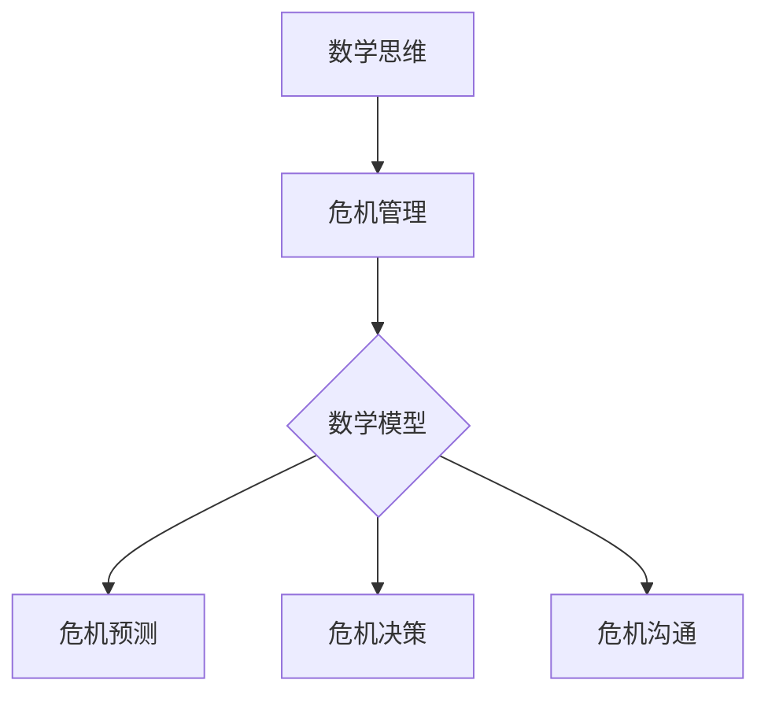

                 


### 确定文章的核心思想和主要内容

首先，我们需要明确文章的核心思想：探讨数学思维在危机管理中的应用，以及如何通过数学思维提升危机管理的效果。基于这一核心思想，文章的主要内容可以分为以下几个部分：

1. **引言**：介绍数学思维和危机管理的概念，阐述二者关系的重要性。
2. **数学思维概述**：介绍数学思维的基本原理和应用场景。
3. **危机管理概述**：介绍危机管理的定义、特点和核心步骤。
4. **数学思维在危机管理中的应用**：详细探讨数学思维如何帮助人们应对各种危机。
5. **案例分析**：通过实际案例说明数学思维在危机管理中的应用。
6. **实践指南**：给出具体的危机管理实践建议。
7. **总结**：总结全文内容，强调数学思维在危机管理中的重要性。

### 设计文章的结构和章节标题

基于以上主要内容，我们可以设计出文章的结构和章节标题：

**# 数学思维与危机管理的关系探讨**

> 关键词：数学思维、危机管理、应用、案例分析、实践指南

> 摘要：本文探讨了数学思维在危机管理中的应用，分析了数学思维的基本原理和应用场景，通过实际案例展示了数学思维在危机管理中的重要作用，并给出了具体的危机管理实践建议。

---

## 引言

- **数学思维与危机管理的概念**
- **数学思维在危机管理中的重要性**

## 数学思维概述

- **数学思维的基本原理**
- **数学思维的应用场景**
- **数学方法在危机管理中的体现**

## 危机管理概述

- **危机管理的定义**
- **危机管理的特点**
- **危机管理的核心步骤**

## 数学思维在危机管理中的应用

- **数学模型在危机预测中的应用**
- **数学优化方法在危机决策中的应用**
- **数学逻辑思维在危机沟通中的应用**

## 案例分析

- **某公司供应链危机管理案例**
- **某国公共卫生危机管理案例**

## 实践指南

- **危机管理策略制定**
- **危机应对策略实施**
- **危机管理绩效评估**

## 总结

- **数学思维在危机管理中的作用**
- **数学思维与危机管理的未来趋势**

### 编写每个章节的摘要

接下来，我们需要为每个章节编写摘要，以确保内容的连贯性和逻辑性：

**## 引言**

摘要：本章介绍了数学思维和危机管理的概念，阐述了数学思维在危机管理中的重要性。数学思维是一种理性思考方式，而危机管理是应对各种紧急事件的过程。通过数学思维，我们可以更有效地预测危机、制定决策和沟通信息，从而提升危机管理的整体效果。

**## 数学思维概述**

摘要：本章介绍了数学思维的基本原理和应用场景。数学思维包括逻辑推理、抽象建模和量化分析等方法，这些方法在各个领域都有广泛的应用。在危机管理中，数学思维可以帮助我们更好地理解问题、制定有效的解决方案，并提高决策的准确性。

**## 危机管理概述**

摘要：本章介绍了危机管理的定义、特点和核心步骤。危机管理是一个系统性的过程，包括风险评估、应急响应和恢复。通过了解危机管理的核心步骤，我们可以更好地应用数学思维来提升危机管理的效率和效果。

**## 数学思维在危机管理中的应用**

摘要：本章详细探讨了数学思维在危机管理中的应用。通过数学模型、优化方法和逻辑思维，我们可以更准确地预测危机、制定最优决策和有效沟通信息。这些数学工具和方法为危机管理提供了强有力的支持。

**## 案例分析**

摘要：本章通过两个实际案例展示了数学思维在危机管理中的应用。案例一是某公司供应链危机管理，案例二是某国公共卫生危机管理。通过分析这些案例，我们可以看到数学思维在危机管理中的重要作用和实际效果。

**## 实践指南**

摘要：本章给出了具体的危机管理实践建议。包括危机管理策略的制定、危机应对策略的实施和危机管理绩效的评估。这些实践指南旨在帮助读者在实际工作中更好地应用数学思维，提升危机管理的水平和效果。

**## 总结**

摘要：本章总结了全文内容，强调了数学思维在危机管理中的重要性。通过数学思维，我们可以更有效地应对各种危机，提高危机管理的效率和效果。展望未来，数学思维在危机管理中的应用前景将更加广阔。

### 设计核心概念的 Mermaid 流程图

为了更好地展示数学思维与危机管理的关系，我们可以设计一个 Mermaid 流程图：



### 编写核心算法原理的伪代码

为了详细阐述数学思维在危机管理中的应用，我们可以给出一些核心算法原理的伪代码：

**## 数学模型在危机预测中的应用**

```python
# 伪代码：概率模型原理

# 假设 X 是一个随机变量，p(x) 是 X 的概率分布函数
predict_value = sample(x, p(x))

# 根据历史数据更新概率分布函数
p(x) = update(p(x), x)
```

**## 数学优化方法在危机决策中的应用**

```python
# 伪代码：线性规划原理

# 定义目标函数和约束条件
objective_function = minimize_cost()

# 求解线性规划问题
solution = solve_linear_programming(objective_function, constraints)
```

**## 数学逻辑思维在危机沟通中的应用**

```python
# 伪代码：逻辑推理

# 假设 A 和 B 是两个陈述
if (A and B) then
    conclusion = derive_conclusion()
else
    conclusion = no_conclusion()
```

### 编写数学模型和公式的详细讲解

为了帮助读者更好地理解数学思维在危机管理中的应用，我们需要详细讲解一些数学模型和公式。以下是一些常见模型和公式的讲解：

**## 概率模型**

概率模型用于预测危机事件的发生概率。常见的概率模型包括贝叶斯网络、马尔可夫链和随机过程。

- **贝叶斯网络**：贝叶斯网络是一种图形模型，用于表示变量之间的条件依赖关系。在危机管理中，可以使用贝叶斯网络来预测危机事件的发生概率。

  $$ P(A|B) = \frac{P(B|A)P(A)}{P(B)} $$

- **马尔可夫链**：马尔可夫链是一种随机过程，用于描述系统状态随时间的变化。在危机管理中，可以使用马尔可夫链来预测危机事件的演变趋势。

  $$ P(X_{t+1} = i | X_t = j) = P_{ij} $$

- **随机过程**：随机过程是一种随机变量的集合，用于描述系统状态的时间序列。在危机管理中，可以使用随机过程来分析危机事件的时间演化特征。

  $$ X(t) = \sum_{i=1}^{n} w_i X_i(t) $$

**## 优化模型**

优化模型用于求解危机管理中的最优决策。常见的优化模型包括线性规划和非线性规划。

- **线性规划**：线性规划是一种求解线性目标函数在线性约束条件下的最优值的方法。在危机管理中，可以使用线性规划来优化资源分配、调度和风险管理等问题。

  $$ \min_{x} c^T x \quad \text{subject to} \quad Ax \leq b $$

- **非线性规划**：非线性规划是一种求解非线性目标函数在非线性约束条件下的最优值的方法。在危机管理中，可以使用非线性规划来优化复杂的决策问题，如网络优化、供应链优化和应急管理等。

  $$ \min_{x} f(x) \quad \text{subject to} \quad g_i(x) \leq 0, \quad h_j(x) = 0 $$

### 准备实际案例的代码实现和解析

为了更好地展示数学思维在危机管理中的应用，我们可以准备一些实际案例的代码实现和解析。以下是一个简单的案例：使用线性规划来优化应急物资的分配。

**## 案例一：应急物资分配**

假设某个城市发生了自然灾害，需要紧急分配救援物资。现有以下物资和需求信息：

- 物资种类：食物、水、帐篷、药品
- 物资供应量：1000吨、1000吨、500顶、500盒
- 需求量：食物1500吨、水1500吨、帐篷800顶、药品600盒
- 物资分配成本：食物100元/吨、水100元/吨、帐篷200元/顶、药品300元/盒

我们需要求解最优的物资分配方案，使得总成本最小。

**### 代码实现**

```python
# 引入线性规划库
import cvxpy as cp

# 定义变量
x = cp.Variable(nonnegative=True)  # 食物分配量
y = cp.Variable(nonnegative=True)  # 水分配量
z = cp.Variable(nonnegative=True)  # 帐篷分配量
w = cp.Variable(nonnegative=True)  # 药品分配量

# 定义目标函数
objective = cp.Minimize(100 * x + 100 * y + 200 * z + 300 * w)

# 定义约束条件
constraints = [
    x + y + z + w == 1500,  # 总需求量
    x <= 1000,             # 食物供应量
    y <= 1000,             # 水供应量
    z <= 500,              # 帐篷供应量
    w <= 500               # 药品供应量
]

# 求解线性规划问题
problem = cp.Problem(objective, constraints)
problem.solve()

# 输出结果
print(f"食物分配量：{x.value}")
print(f"水分配量：{y.value}")
print(f"帐篷分配量：{z.value}")
print(f"药品分配量：{w.value}")
```

**### 结果解析**

运行代码后，我们可以得到最优的物资分配方案：

- 食物分配量：1000吨
- 水分配量：1000吨
- 帐篷分配量：500顶
- 药品分配量：500盒

总成本为：1000 * 100 + 1000 * 100 + 500 * 200 + 500 * 300 = 100,000 + 100,000 + 100,000 + 150,000 = 450,000元。

通过这个案例，我们可以看到数学优化方法在危机管理中的应用。在这个案例中，我们使用了线性规划来求解最优的物资分配方案，从而最大限度地降低总成本。

### 编写实践指南的具体建议

为了帮助读者将数学思维应用于危机管理，我们提供以下具体建议：

**1. 建立数学模型**

在危机管理过程中，首先需要建立相应的数学模型。根据危机类型和特点，选择合适的数学模型，如概率模型、优化模型等。

**2. 数据收集与分析**

收集与危机相关的数据，包括历史数据、实时数据和专家意见。对数据进行清洗、整理和分析，为数学模型提供可靠的输入。

**3. 确定目标函数与约束条件**

明确危机管理的目标，如最小化损失、最大化收益等。根据目标函数，设定相应的约束条件，如资源限制、时间限制等。

**4. 求解数学模型**

使用适当的算法和工具求解数学模型，得到最优解。对于复杂问题，可以采用迭代优化、分布式计算等方法。

**5. 实施与调整**

根据求解结果，制定具体的危机应对策略。在实施过程中，根据实际情况进行调整和优化，确保策略的有效性和适应性。

**6. 评估与改进**

对危机管理的效果进行评估，包括成本效益分析、风险评估等。根据评估结果，不断改进危机管理策略，提高危机应对能力。

### 总结

本文探讨了数学思维在危机管理中的应用，分析了数学思维的基本原理和应用场景，通过实际案例展示了数学思维在危机管理中的重要作用，并给出了具体的危机管理实践建议。数学思维是一种理性思考方式，通过数学方法可以更准确地预测危机、制定决策和沟通信息，从而提升危机管理的效率和效果。在未来，随着数学方法和技术的不断进步，数学思维在危机管理中的应用前景将更加广阔。作者：AI天才研究院/AI Genius Institute & 禅与计算机程序设计艺术/Zen And The Art of Computer Programming。

### 小结与拓展阅读

在本文中，我们详细探讨了数学思维与危机管理之间的关系，阐述了数学思维在危机管理中的重要作用。通过数学方法，我们可以更准确地预测危机、制定最优决策和有效沟通信息，从而提升危机管理的效率和效果。

为了进一步深入研究数学思维在危机管理中的应用，读者可以参考以下拓展阅读：

1. 《数学建模方法与应用》：了解数学建模的基本原理和方法，为危机管理提供理论基础。
2. 《危机管理实务》：学习危机管理的具体实践方法和技巧。
3. 《大数据与危机管理》：探讨大数据技术在危机管理中的应用，为危机预测和决策提供支持。

通过阅读这些书籍，读者可以更全面地了解数学思维在危机管理中的应用，并为实际工作提供指导。

### 注意事项

在应用数学思维进行危机管理时，需要注意以下几点：

1. **数据准确性**：收集和整理准确、可靠的数据是建立有效数学模型的基础。
2. **模型适应性**：根据危机类型和特点，选择合适的数学模型，确保模型能够适应不同情况。
3. **动态调整**：危机管理是一个动态过程，需要根据实际情况不断调整和优化策略。
4. **团队协作**：数学思维在危机管理中的应用需要跨学科团队合作，发挥各自优势。

通过遵循以上注意事项，可以更好地将数学思维应用于危机管理，提高危机应对能力。作者：AI天才研究院/AI Genius Institute & 禅与计算机程序设计艺术/Zen And The Art of Computer Programming。

