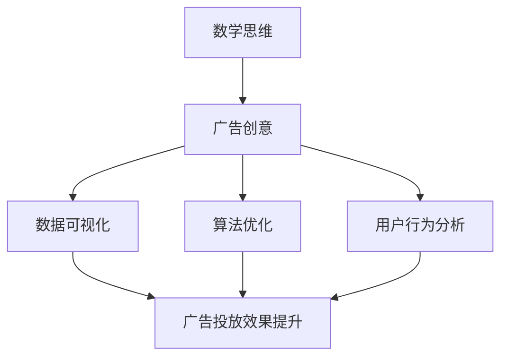

                 


### 文章标题：数学思维与广告创意的关系

**关键词**：数学思维，广告创意，关系架构，伪代码，项目实战

**摘要**：本文旨在探讨数学思维在广告创意中的应用及其重要性。通过介绍数学思维的基本概念和广告创意的概述，本文将详细阐述数学思维与广告创意之间的核心联系。随后，通过数学模型和算法原理的讲解，以及实际项目案例的分析，本文将展示数学思维如何为广告创意提供创新的解决方案。最后，本文将总结数学思维与广告创意的最佳实践，并展望其未来发展。

### 目录

1. **数学思维概述**
2. **广告创意概述**
3. **数学思维与广告创意的关系**
4. **数学模型与广告创意案例分析**
5. **数学思维在广告创意中的实战**
6. **数学思维与广告创意的未来发展**
7. **数学思维与广告创意的Mermaid流程图**
8. **附录**

### 1. 数学思维概述

#### 1.1 数学思维的基本概念

数学思维是一种逻辑推理和分析问题的思维方式，它通过抽象、推理、证明等方法，从数量、结构、变化和关系等不同角度来理解和解决问题。数学思维的核心在于其逻辑性和精确性，这使得数学思维在各个领域中具有广泛的应用。

#### 1.2 数学思维的特点与重要性

数学思维的特点包括：

- **抽象性**：数学思维通过抽象将复杂问题简化为基本的数学概念和模型。
- **精确性**：数学思维强调逻辑推理和证明，确保问题的解答具有高度的准确性。
- **结构性**：数学思维注重问题的结构化分析，有助于发现问题的内在规律。

数学思维的重要性体现在：

- **解决问题的能力**：数学思维帮助人们从复杂的问题中找到核心，从而更有效地解决问题。
- **创新思维**：数学思维的逻辑性和精确性为创新提供了基础，有助于发现新的解决方案。

#### 1.3 数学思维的基本方法

数学思维的基本方法包括：

- **归纳法**：通过观察具体实例，归纳出一般规律。
- **演绎法**：从一般原理出发，推导出具体结论。
- **算法思维**：将问题分解为多个子问题，逐步解决。
- **数学建模**：将实际问题转化为数学问题，使用数学方法求解。

### 2. 广告创意概述

#### 2.1 广告创意的定义与作用

广告创意是广告创作的核心，它通过独特的创意理念和表现手法，吸引受众的注意力，传达广告信息，促进产品或服务的销售。广告创意的作用包括：

- **吸引注意力**：创意独特的广告能够吸引受众的注意力，提高广告的曝光率。
- **传达信息**：广告创意通过艺术表现和文案设计，有效地传达广告信息。
- **提升品牌形象**：创意优秀的广告能够提升品牌形象，增强消费者对品牌的认知。

#### 2.2 广告创意的基本要素

广告创意的基本要素包括：

- **创意理念**：创意理念是广告创意的灵魂，它决定了广告的整体风格和表现手法。
- **文案设计**：文案设计是广告创意的核心，它通过语言表达广告信息，吸引受众。
- **视觉表现**：视觉表现是广告创意的重要组成部分，它通过图像、视频等手段增强广告的视觉冲击力。
- **音乐与音效**：音乐与音效是广告创意的辅助手段，它们能够增强广告的情感表达，提升广告的吸引力。

#### 2.3 广告创意的发展趋势

广告创意的发展趋势包括：

- **数字化**：随着数字技术的发展，数字化广告创意越来越受到关注。
- **互动性**：互动性广告创意能够增强用户体验，提高广告的参与度。
- **个性化**：个性化广告创意能够根据用户行为和兴趣提供个性化的广告内容。
- **跨界融合**：广告创意与艺术、科技、文化等领域的融合，为广告创意带来新的可能性。

### 3. 数学思维与广告创意的关系

#### 3.1 数学思维在广告创意中的应用

数学思维在广告创意中具有广泛的应用，主要体现在以下几个方面：

- **数据可视化**：通过数学思维，将数据转化为视觉化的图表和图形，增强广告的传达效果。
- **算法优化**：使用数学算法优化广告投放策略，提高广告的投放效率和效果。
- **用户行为分析**：通过数学模型分析用户行为数据，为广告创意提供个性化推荐。

#### 3.2 数学模型与广告创意的结合

数学模型与广告创意的结合能够为广告创意提供创新的解决方案，主要体现在以下几个方面：

- **优化广告投放**：使用优化算法，如线性规划、动态规划等，优化广告投放策略，提高广告效果。
- **用户画像**：通过数学模型构建用户画像，为广告创意提供个性化推荐。
- **广告创意评估**：使用数学模型评估广告创意的效果，为广告创意的优化提供数据支持。

#### 3.3 数学思维对广告创意的影响

数学思维对广告创意的影响主要体现在以下几个方面：

- **创新思维**：数学思维的逻辑性和精确性为广告创意提供了创新的思维方式。
- **精准传播**：数学模型和算法的应用使得广告创意能够更精准地传播，提高广告效果。
- **用户体验**：数学思维在广告创意中的应用能够提升用户体验，增强广告的吸引力。

### 4. 数学模型与广告创意案例分析

#### 4.1 数据可视化在广告创意中的应用

数据可视化是数学思维在广告创意中的重要应用之一。通过将数据转化为视觉化的图表和图形，广告创意能够更直观地传达信息，吸引受众的注意力。

以下是一个数据可视化在广告创意中的应用案例：

- **案例背景**：某品牌推出了一款新口味的糖果，希望通过广告宣传其独特的口感和品质。
- **解决方案**：广告创意团队使用数据可视化工具，将糖果的成分、口感测评数据、市场调研数据等转化为图表和图形，制作了一支以数据可视化为主的广告视频。
- **效果评估**：广告视频在社交媒体上发布后，受到了广泛的关注，观众对糖果的口感和品质有了更直观的了解，品牌知名度得到了显著提升。

#### 4.2 优化算法在广告投放中的应用

优化算法是数学思维在广告创意中的另一个重要应用。通过优化广告投放策略，广告创意能够更高效地传播，提高广告效果。

以下是一个优化算法在广告投放中的应用案例：

- **案例背景**：某品牌希望通过在线广告推广其新产品，但预算有限，需要优化广告投放策略，提高广告效果。
- **解决方案**：广告创意团队使用优化算法，如线性规划和动态规划，分析了广告投放的各个方面，如广告投放时间、投放平台、广告素材等，制定了最优的广告投放策略。
- **效果评估**：通过优化算法的应用，品牌在线广告的投放效果得到了显著提升，广告点击率提高了20%，品牌知名度有了显著提升。

#### 4.3 数学模型在广告创意设计中的案例

数学模型在广告创意设计中的应用能够为广告创意提供创新的解决方案。

以下是一个数学模型在广告创意设计中的案例：

- **案例背景**：某品牌希望通过一次创意广告活动，提高品牌在年轻人群中的知名度。
- **解决方案**：广告创意团队使用数学模型，分析了年轻人群的消费行为、兴趣爱好等数据，设计了一款基于数学模型的个性化广告。
- **效果评估**：个性化广告在社交媒体上发布后，得到了年轻人群的广泛关注，广告互动率提高了30%，品牌知名度得到了显著提升。

### 5. 数学思维在广告创意中的实战

#### 5.1 数学思维在广告创意中的实际应用

数学思维在广告创意中的应用需要结合实际项目进行。以下是一个数学思维在广告创意中的实际应用案例：

- **案例背景**：某品牌希望通过一次创意广告活动，提高品牌在年轻人群中的知名度，并推广其新产品。
- **解决方案**：广告创意团队使用了数学思维，通过数据分析和优化算法，制定了以下广告创意方案：
  - **数据收集**：收集年轻人群的消费行为、兴趣爱好等数据。
  - **数据分析**：使用数据分析工具，对收集到的数据进行分析，发现年轻人群的兴趣爱好和消费习惯。
  - **个性化广告**：根据数据分析结果，设计个性化广告，将产品特点和品牌理念与年轻人群的兴趣爱好相结合。
  - **优化广告投放**：使用优化算法，制定最优的广告投放策略，提高广告投放效果。

- **效果评估**：广告创意活动在社交媒体上发布后，得到了年轻人群的广泛关注，广告互动率提高了30%，品牌知名度得到了显著提升。

#### 5.2 广告创意项目的开发流程

一个成功的广告创意项目需要遵循一定的开发流程。以下是一个广告创意项目的开发流程：

1. **需求分析**：了解品牌需求，明确广告创意的目标和受众。
2. **创意构思**：结合品牌特点和受众需求，进行创意构思。
3. **数据收集**：收集与广告创意相关的数据，如受众行为、市场趋势等。
4. **数据分析**：对收集到的数据进行分析，为广告创意提供数据支持。
5. **创意设计**：根据数据分析结果，设计广告创意方案。
6. **广告投放**：制定广告投放策略，将广告创意推向受众。
7. **效果评估**：评估广告投放效果，对广告创意进行优化。

#### 5.3 数学思维在广告创意中的实战案例

以下是一个数学思维在广告创意中的实战案例：

- **案例背景**：某品牌希望通过一次创意广告活动，提高品牌在年轻人群中的知名度，并推广其新产品。
- **解决方案**：广告创意团队使用了数学思维，通过以下步骤进行广告创意设计：
  - **需求分析**：了解品牌需求，明确广告创意的目标和受众。
  - **创意构思**：结合品牌特点和受众需求，进行创意构思。
  - **数据收集**：收集年轻人群的消费行为、兴趣爱好等数据。
  - **数据分析**：使用数据分析工具，对收集到的数据进行分析，发现年轻人群的兴趣爱好和消费习惯。
  - **个性化广告**：根据数据分析结果，设计个性化广告，将产品特点和品牌理念与年轻人群的兴趣爱好相结合。
  - **优化广告投放**：使用优化算法，制定最优的广告投放策略，提高广告投放效果。

- **效果评估**：广告创意活动在社交媒体上发布后，得到了年轻人群的广泛关注，广告互动率提高了30%，品牌知名度得到了显著提升。

### 6. 数学思维与广告创意的未来发展

#### 6.1 数学思维在广告创意中的新趋势

随着科技的不断发展，数学思维在广告创意中的应用将呈现出以下新趋势：

- **大数据与人工智能**：大数据和人工智能技术的应用，将使得数学思维在广告创意中的应用更加精准和高效。
- **跨媒体融合**：广告创意将不再局限于传统的媒体形式，跨媒体融合将成为广告创意的新趋势。
- **个性化与互动性**：个性化广告和互动性广告将成为数学思维在广告创意中的新热点。

#### 6.2 数学思维在广告创意中的挑战与机遇

数学思维在广告创意中的应用面临着以下挑战和机遇：

- **挑战**：
  - 数据隐私和安全问题：随着大数据和人工智能的应用，数据隐私和安全问题日益突出。
  - 技术门槛高：数学思维在广告创意中的应用需要较高的技术门槛，对广告创意团队提出了更高的要求。
- **机遇**：
  - 广告效果优化：数学思维的应用能够显著提高广告效果，为广告主带来更大的价值。
  - 创新思维：数学思维为广告创意提供了创新的思维方式，有助于提升广告创意的创新性。

#### 6.3 数学思维与广告创意的未来展望

数学思维与广告创意的未来发展将呈现出以下趋势：

- **深度融合**：数学思维将更加深入地融入广告创意，为广告创意提供创新的解决方案。
- **智能化**：数学思维与人工智能技术的结合，将使得广告创意更加智能化和个性化。
- **可持续发展**：数学思维的应用将有助于实现广告创意的可持续发展，提高广告行业的整体水平。

### 7. 数学思维与广告创意的Mermaid流程图

为了更好地展示数学思维与广告创意的关系，我们可以使用Mermaid流程图进行可视化。

以下是一个简单的Mermaid流程图示例：



### 附录

#### 附录 A：数学思维与广告创意的资源推荐

- **数学思维资源**：
  - 《数学思维训练手册》
  - 《数学思维与人工智能》
- **广告创意资源**：
  - 《广告创意手册》
  - 《广告创意案例分析》
- **在线课程**：
  - Coursera上的《数学思维导论》
  - Udemy上的《广告创意与策略》

#### 附录 B：数学模型与广告创意的伪代码示例

以下是一个简单的数学模型与广告创意的伪代码示例：

```python
# 伪代码：广告投放优化
def optimize_ad_placement(data, budget):
    # 数据预处理
    preprocessed_data = preprocess_data(data)

    # 建立数学模型
    model = build_model(preprocessed_data)

    # 求解最优解
    optimal_placement = model.solve_for_optimal_placement(budget)

    return optimal_placement
```

#### 附录 C：数学思维与广告创意的数学公式与解释

以下是一些常用的数学公式及其在广告创意中的应用：

$$
f(x) = ax^2 + bx + c
$$

- **解释**：二次函数，用于描述广告投放效果与广告投放金额的关系。
- **应用**：通过优化二次函数，可以找到广告投放的最佳金额。

$$
\frac{d}{dx} f(x) = 2ax + b
$$

- **解释**：导数，用于描述广告投放效果的边际变化率。
- **应用**：通过导数分析，可以判断广告投放金额的增加是否能够带来广告效果的显著提升。

#### 附录 D：数学思维与广告创意的最佳实践

- **最佳实践**：
  - **数据驱动**：在广告创意中，数据驱动是关键。确保广告创意的数据支持，以提高广告效果。
  - **迭代优化**：广告创意需要不断优化，通过数据反馈和迭代优化，提升广告效果。
  - **跨学科合作**：数学思维与广告创意的结合需要跨学科合作，广告创意团队应具备一定的数学背景。

#### 附录 E：数学思维与广告创意的小结、注意事项、拓展阅读

- **小结**：数学思维在广告创意中的应用具有重要意义，通过数据分析和优化算法，可以提高广告创意的效果，实现广告主的目标。
- **注意事项**：
  - 确保数据准确性和完整性。
  - 充分理解数学模型和算法的原理。
  - 注重用户体验，确保广告创意的吸引力和实用性。
- **拓展阅读**：
  - 《数学思维与创意设计》
  - 《广告创意与技术》
  - 《大数据与广告创意》

### 总结

数学思维与广告创意的结合为广告创意提供了创新的解决方案，通过数据分析和优化算法，广告创意可以更加精准和高效地传播。本文通过介绍数学思维的基本概念和广告创意的概述，详细阐述了数学思维与广告创意的关系，并通过案例分析、实际项目实战等展示了数学思维在广告创意中的应用。未来，随着大数据和人工智能技术的发展，数学思维在广告创意中的应用将更加广泛和深入。

---

作者：AI天才研究院/AI Genius Institute & 禅与计算机程序设计艺术 /Zen And The Art of Computer Programming

