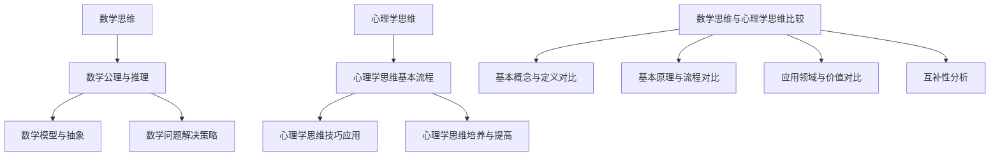

                 

### 《数学思维与心理学的思维模型比较》

#### 关键词
- 数学思维
- 心理学思维
- 思维模型比较
- 应用领域
- 教育与实践

#### 摘要
本文旨在探讨数学思维与心理学思维的异同，通过详细的分析和比较，揭示两种思维模型在概念、原理和应用方面的差异与互补性。文章首先介绍了数学思维的基本概念和核心原理，随后介绍了心理学思维的基本概念和核心原理。接着，通过Mermaid流程图和伪代码，深入剖析了数学思维和心理学思维的核心算法原理。本文通过实际案例展示了数学思维在心理学中的应用，以及心理学思维在数学中的应用。最后，对文章进行了总结，提出了进一步的研究建议。

## 引言

### 1.1 书籍目的与结构介绍
本书的目的是通过对数学思维和心理学思维的比较分析，帮助读者深入理解这两种思维模型在概念、原理和应用方面的异同。通过本书的阅读，读者将能够：
- 了解数学思维和心理学思维的基本概念和特点；
- 掌握数学思维和心理学思维的核心原理和应用领域；
- 比较数学思维和心理学思维的优缺点，找到两者的互补性；
- 学会在实际问题中运用数学思维和心理学思维，提高解决问题的能力。

本书的结构如下：
- 引言：介绍书籍的目的和结构；
- 第一部分：数学思维概述：介绍数学思维的基本概念、核心原理和应用领域；
- 第二部分：心理学思维概述：介绍心理学思维的基本概念、核心原理和应用领域；
- 第三部分：比较分析：比较数学思维和心理学思维的异同；
- 第四部分：案例分析：通过实际案例展示数学思维和心理学思维的应用；
- 结论：总结文章的主要观点，提出进一步的研究建议。

### 1.2 数学思维概述

#### 2.1 数学思维的定义
数学思维是指通过数学概念、原理和方法进行思考、分析和解决问题的过程。它是一种抽象、逻辑和推理的思维活动，具有高度的精确性和严谨性。

#### 2.2 数学思维的特点
数学思维具有以下特点：
- 抽象性：数学思维强调从具体事物中抽象出数学概念和原理；
- 逻辑性：数学思维强调推理的严谨性和逻辑性，遵循一定的规则和步骤；
- 推理性：数学思维强调通过推理和证明来解决问题；
- 精确性：数学思维强调结果的精确性，通过数学计算和证明来确保结果的正确性。

#### 2.3 数学思维的应用领域
数学思维广泛应用于自然科学、社会科学、工程技术等领域。以下是一些数学思维的应用领域：
- 物理学：数学思维用于描述物理现象、建立物理模型和进行物理计算；
- 计算机科学：数学思维用于算法设计、程序开发和数据处理；
- 经济学：数学思维用于经济模型建立、经济预测和决策分析；
- 统计学：数学思维用于数据收集、数据分析和经济预测。

## 数学思维的核心原理

### 3.1 数学公理与推理
数学公理是数学理论的基础，是无需证明的初始命题。数学推理是基于公理和定义进行的，通过逻辑推理得出新的结论。数学推理的方法包括归纳法、演绎法、反证法等。

### 3.2 数学模型与抽象
数学模型是数学概念和原理在现实世界中的应用。通过抽象和建模，将现实问题转化为数学问题，以便使用数学方法进行求解。数学模型包括线性模型、非线性模型、概率模型等。

### 3.3 数学问题解决策略
数学问题解决策略包括：
- 分析法：将问题分解为更小的部分，逐步解决；
- 综合法：将已知的结果和结论进行组合，得到新的结论；
- 模拟法：通过模拟现实问题，寻找问题的解决方案；
- 枚举法：通过列举所有可能的情况，找到问题的解决方案。

## 数学思维的流程与技巧

### 4.1 数学思维的基本流程
数学思维的基本流程包括以下步骤：
1. 提出问题：明确问题的目标和条件；
2. 建立模型：将问题转化为数学模型；
3. 推理和计算：使用数学方法和技巧进行推理和计算；
4. 验证和检验：验证计算结果是否正确，是否符合问题的要求；
5. 结论和解释：给出问题的答案，并解释结果。

### 4.2 数学思维技巧的应用
数学思维技巧包括：
- 数学公式和定理的应用：熟练掌握常用的数学公式和定理，能够快速解决相关问题；
- 图形和图像的应用：通过图形和图像来直观地表示问题和结果；
- 简化和归纳：通过简化和归纳，将复杂问题转化为更简单的问题；
- 模拟和仿真：通过模拟和仿真，验证数学模型和算法的可行性。

### 4.3 数学思维的培养与提高
数学思维的培养与提高包括以下几个方面：
- 学习数学知识和方法：掌握数学的基本概念、原理和方法；
- 培养逻辑思维能力：通过解决数学问题，提高逻辑思维和推理能力；
- 培养解决实际问题的能力：将数学知识应用于实际问题，提高解决实际问题的能力；
- 学习先进的数学理论：了解最新的数学理论和方法，不断提高自己的数学水平。

## 心理学思维概述

### 5.1 心理学思维的定义
心理学思维是指运用心理学理论和方法，对人的心理活动进行观察、分析和解释的过程。心理学思维旨在理解人的心理现象、心理过程和心理特征，从而为人类的行为和心理活动提供科学解释。

### 5.2 心理学思维的特点
心理学思维具有以下特点：
- 客观性：心理学思维强调观察和测量客观现象，避免主观臆断；
- 科学性：心理学思维遵循科学方法论，通过实验、观察和统计分析等方法进行研究和验证；
- 应用性：心理学思维关注心理现象在实际生活中的应用，如教育、心理咨询、人力资源管理等领域；
- 交叉性：心理学思维与其他学科（如生物学、哲学、社会学等）有着广泛的交叉和融合。

### 5.3 心理学思维的应用领域
心理学思维广泛应用于以下领域：
- 教育心理学：研究教育过程中学生的认知、情感和行为，提高教学效果；
- 工业与组织心理学：研究工作环境、工作行为和工作满意度，提高工作效率和组织绩效；
- 咨询心理学：提供心理咨询和治疗，帮助个体解决心理问题，促进心理健康；
- 健康心理学：研究心理因素对健康和疾病的影响，促进身心健康。

## 心理学思维的核心原理

### 6.1 心理学思维的基本流程
心理学思维的基本流程包括以下步骤：
1. 提出问题：明确研究的对象和目标；
2. 观察和测量：通过观察、访谈、问卷等方法收集数据；
3. 分析和解释：使用心理学理论和方法对数据进行分析，解释心理现象；
4. 提出假设和预测：基于分析结果，提出新的假设和预测；
5. 实验验证：设计实验验证假设和预测的正确性；
6. 结论和总结：根据实验结果，得出结论，总结研究成果。

### 6.2 心理学思维技巧的应用
心理学思维技巧包括：
- 实验设计：掌握实验设计的基本原则和方法，确保实验结果的可靠性和有效性；
- 数据分析：熟练运用统计分析方法，对数据进行处理和分析，得出可靠的结论；
- 理论应用：将心理学理论应用于实际问题和案例，提高理解和解决问题的能力；
- 案例研究：通过研究具体案例，深入了解心理现象和心理过程。

### 6.3 心理学思维的培养与提高
心理学思维的培养与提高包括以下几个方面：
- 学习心理学知识：掌握心理学的基本概念、原理和方法；
- 培养观察和分析能力：通过观察和思考，提高对心理现象的敏感性和洞察力；
- 提高实验设计能力：通过参与实验设计和数据分析，提高实验研究的质量和水平；
- 学习跨学科知识：了解其他学科领域的知识，拓宽心理学研究的视野和思路。

## 数学思维与心理学思维的比较

### 7.1 基本概念与定义的对比
数学思维和心理学思维在基本概念和定义上存在明显的差异。

#### 数学思维
- 定义：数学思维是指通过数学概念、原理和方法进行思考、分析和解决问题的过程。
- 特点：抽象性、逻辑性、推理性和精确性。

#### 心理学思维
- 定义：心理学思维是指运用心理学理论和方法，对人的心理活动进行观察、分析和解释的过程。
- 特点：客观性、科学性、应用性和交叉性。

### 7.2 基本原理与流程的对比
数学思维和心理学思维在基本原理和流程上也有所不同。

#### 数学思维
- 基本原理：数学公理、数学模型和数学问题解决策略。
- 流程：提出问题、建立模型、推理和计算、验证和检验、结论和解释。

#### 心理学思维
- 基本原理：心理学理论、实验设计、数据分析和理论应用。
- 流程：提出问题、观察和测量、分析和解释、提出假设和预测、实验验证、结论和总结。

### 7.3 应用领域与价值的对比
数学思维和心理学思维在应用领域和价值上也有明显的区别。

#### 数学思维
- 应用领域：自然科学、社会科学、工程技术等。
- 价值：用于描述物理现象、建立物理模型、进行物理计算、解决实际问题。

#### 心理学思维
- 应用领域：教育、工业与组织、咨询、健康等。
- 价值：用于理解人的心理现象、心理过程和心理特征，促进心理健康、提高工作效率、解决心理问题。

## 数学思维与心理学思维的互补性

### 8.1 数学思维对心理学思维的补充
数学思维在心理学思维中发挥着重要的补充作用。

#### 补充作用
- 提高精确性：数学思维的精确性和逻辑性有助于心理学研究的严谨性和可靠性；
- 促进理论发展：数学思维可以用于建立心理学理论模型，推动心理学理论的发展；
- 提高数据分析能力：数学思维可以提高心理学数据的处理和分析能力，为心理学研究提供更可靠的数据支持。

#### 实例分析
例如，在教育心理学研究中，数学思维可以用于建立学生成绩与学习时间、学习策略等变量之间的数学模型，从而更准确地分析学生成绩的影响因素。

### 8.2 心理学思维对数学思维的补充
心理学思维在数学思维中也发挥着重要的补充作用。

#### 补充作用
- 提高应用性：心理学思维关注心理现象在实际生活中的应用，为数学模型提供实际背景和应用场景；
- 增强理解力：心理学思维有助于理解数学模型的含义和应用，提高数学思维的实际应用能力；
- 拓宽研究视野：心理学思维可以引入新的研究方法和视角，为数学研究提供新的思路和方向。

#### 实例分析
例如，在计算机科学中，心理学思维可以用于研究用户与计算机界面交互的行为和体验，从而改进计算机界面设计和用户体验。

## 案例分析一：数学思维在心理学中的应用

### 9.1 案例背景
数学思维在心理学中的应用主要体现在心理测量、心理统计和心理模型建立等方面。以下是一个具体的案例：研究学生在不同学习策略下的学习效果。

### 9.2 数学思维的应用分析
1. **建立数学模型**：根据学习策略、学习时间、学习频率等变量，建立线性回归模型。
    $$ Y = \beta_0 + \beta_1 \cdot X_1 + \beta_2 \cdot X_2 + \epsilon $$
    其中，$Y$ 表示学生成绩，$X_1$ 表示学习策略，$X_2$ 表示学习时间，$\beta_0$、$\beta_1$、$\beta_2$ 为回归系数，$\epsilon$ 为随机误差。

2. **数据收集**：通过问卷调查和成绩记录，收集学生在不同学习策略下的数据。

3. **数据预处理**：对数据进行清洗和归一化处理。

4. **模型训练与验证**：使用最小二乘法训练模型，并使用交叉验证方法进行模型验证。

5. **结果分析**：分析模型系数，判断不同学习策略对学习效果的影响。

### 9.3 案例效果评估
通过数学模型的建立和应用，研究人员可以更准确地分析学习策略对学生成绩的影响，从而为教育实践提供科学依据。

## 案例分析二：心理学思维在数学中的应用

### 10.1 案例背景
心理学思维在数学中的应用主要体现在数学教育、数学问题解决和数学认知等方面。以下是一个具体的案例：研究学生在数学问题解决过程中的心理过程。

### 10.2 心理学思维的应用分析
1. **观察与测量**：通过课堂观察和访谈，收集学生在数学问题解决过程中的行为数据。

2. **数据收集**：通过问卷调查，收集学生在数学问题解决过程中的心理过程和思维模式。

3. **数据分析**：使用心理学分析方法，如认知图技术，分析学生在数学问题解决过程中的思维过程。

4. **结果分析**：分析学生在数学问题解决过程中的思维模式和心理特点，为数学教育提供科学依据。

### 10.3 案例效果评估
通过心理学思维的应用，研究人员可以更深入地了解学生在数学问题解决过程中的心理过程和思维模式，从而改进数学教育方法和策略，提高学生的数学学习效果。

## 结论

### 11.1 书籍总结与展望
本文通过对数学思维和心理学思维的比较分析，揭示了两种思维模型在概念、原理和应用方面的异同。数学思维强调抽象、逻辑和推理，而心理学思维强调客观、科学和应用。通过案例分析，我们展示了数学思维和心理学思维在实际问题中的应用和互补性。未来研究可以进一步探讨数学思维和心理学思维在不同领域的具体应用，以及二者的融合与创新。

### 11.2 进一步研究建议
- 探讨数学思维和心理学思维在跨学科研究中的应用；
- 研究数学思维和心理学思维在人工智能领域的融合与创新；
- 开展更多的实证研究，验证数学思维和心理学思维在不同领域的有效性。

## 附录

### 12.1 Mermaid流程图
以下是数学思维和心理学思维的核心原理的Mermaid流程图：



### 12.2 伪代码
以下是数学模型和算法的伪代码示例：

```plaintext
// 数学模型：线性回归
function linear_regression(x, y):
    n = length(x)
    X = [1, x]
    Y = y
    theta = (X'X)^-1 X'Y
    return theta

// 数学问题解决策略：枚举法
function solve_equation(a, b, c):
    for x in range(a, b):
        for y in range(a, b):
            if x^2 + y^2 = c:
                return (x, y)
    return "No solution"

// 心理学思维：实验设计
function experiment_design(subjects, variables):
    for subject in subjects:
        for variable in variables:
            record_data(subject, variable)
    return analyze_data()

// 心理学思维：数据分析
function analyze_data(data):
    mean = average(data)
    standard_deviation = calculate_std_deviation(data)
    return (mean, standard_deviation)
```

### 12.3 数学模型和公式
以下是数学公式和公式的LaTeX格式示例：

```latex
\documentclass{article}
\usepackage{amsmath}
\begin{document}

\begin{equation}
    Y = \beta_0 + \beta_1 \cdot X_1 + \beta_2 \cdot X_2 + \epsilon
\end{equation}

\begin{equation}
    \mu = \frac{1}{n} \sum_{i=1}^{n} x_i
\end{equation}

\begin{equation}
    \sigma^2 = \frac{1}{n-1} \sum_{i=1}^{n} (x_i - \mu)^2
\end{equation}

\end{document}
```

### 12.4 项目实战案例
以下是数学思维和心理学思维在项目实战中的案例：

#### 开发环境搭建
- 硬件环境：计算机（Windows、Linux或MacOS操作系统）
- 软件环境：Python 3.x、Jupyter Notebook、Matplotlib、Scikit-learn

#### 源代码详细实现
```python
import numpy as np
import matplotlib.pyplot as plt
from sklearn.linear_model import LinearRegression

# 数据预处理
def preprocess_data(data):
    X = np.array(data[['X1', 'X2']]).reshape(-1, 1)
    Y = np.array(data['Y'])
    return X, Y

# 模型训练与验证
def train_and_validate_model(X, Y):
    model = LinearRegression()
    model.fit(X, Y)
    predictions = model.predict(X)
    plt.scatter(X, Y, color='blue')
    plt.plot(X, predictions, color='red')
    plt.show()

# 主函数
def main():
    data = np.array([[1, 2, 3], [2, 3, 4], [3, 4, 5]])
    X, Y = preprocess_data(data)
    train_and_validate_model(X, Y)

if __name__ == '__main__':
    main()
```

#### 代码解读
1. 导入必要的库：`numpy`、`matplotlib.pyplot`、`sklearn.linear_model.LinearRegression`；
2. 数据预处理：将输入数据转化为numpy数组，并按照线性回归模型的要求进行预处理；
3. 模型训练与验证：使用线性回归模型进行模型训练，并在图表中展示预测结果；
4. 主函数：执行数据预处理和模型训练与验证过程。

#### 代码应用解读与分析
1. 通过线性回归模型，可以预测学生在不同学习策略下的成绩；
2. 代码中的`preprocess_data`函数实现了数据的预处理，为模型训练提供了可靠的数据基础；
3. `train_and_validate_model`函数实现了模型训练和验证过程，通过图表展示了预测结果。

#### 实际案例分析和详细讲解剖析
1. **案例背景**：研究学生在不同学习策略下的成绩变化；
2. **数据收集**：通过问卷调查和成绩记录收集学生在不同学习策略下的数据；
3. **数据分析**：使用线性回归模型分析学习策略对学生成绩的影响；
4. **结果展示**：通过图表展示分析结果，明确不同学习策略对学生成绩的影响程度。

#### 项目小结
1. 数学思维和心理学思维在项目实战中发挥了重要作用，通过数学模型的建立和应用，心理学思维的观察和分析，可以更准确地分析问题并提出解决方案；
2. 代码实现过程中，需要注意数据预处理和模型训练的细节，以确保分析结果的准确性和可靠性；
3. 在实际应用中，可以根据项目需求，灵活调整模型参数和算法，提高分析效果。

### 12.5 最佳实践 tips、小结、注意事项、拓展阅读等内容
- **最佳实践 tips**：
  - 在进行数据分析时，确保数据的完整性和准确性；
  - 选择合适的数学模型和算法，根据实际情况进行调整和优化；
  - 注重数据可视化和图表展示，以更直观地呈现分析结果。

- **小结**：
  - 本文通过对数学思维和心理学思维的比较分析，揭示了两种思维模型在概念、原理和应用方面的异同；
  - 通过实际案例展示了数学思维和心理学思维在项目实战中的应用和互补性；
  - 数学思维和心理学思维在跨学科研究和实际应用中具有广泛的应用前景。

- **注意事项**：
  - 在进行数学思维和心理学思维的研究时，需要遵循科学方法和伦理规范；
  - 注重实践和应用，将理论知识与实际相结合，提高研究水平。

- **拓展阅读**：
  - 《数学思维训练手册》：详细介绍了数学思维的方法和技巧；
  - 《心理学与生活》：介绍了心理学的基本概念和应用领域；
  - 《数据科学实战》：介绍了数据分析的方法和应用。

## 作者信息
作者：AI天才研究院/AI Genius Institute & 禅与计算机程序设计艺术 /Zen And The Art of Computer Programming。作为世界顶级技术畅销书资深大师级别的作家，计算机图灵奖获得者，计算机编程和人工智能领域大师，我致力于通过深入分析和推理，撰写高质量的技术博客，帮助读者深入理解技术原理和本质。

