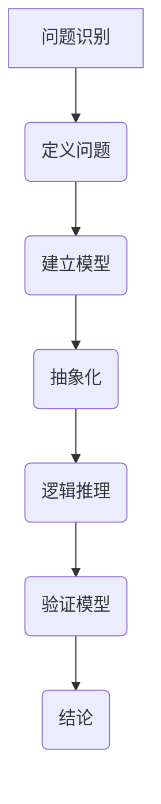
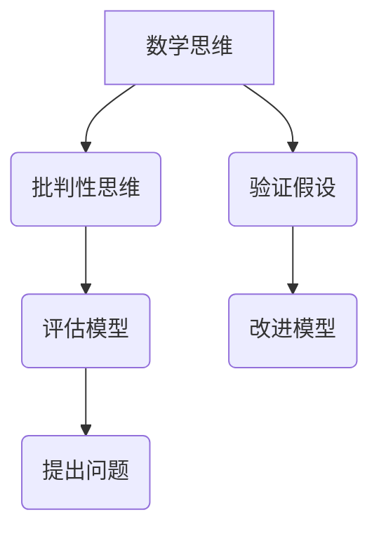

                 


### 引言

#### 1. 数学思维与批判性思维的基本概念

数学思维是一种通过数学原理和方法来分析问题、解决问题和发现规律的思维方式。它强调逻辑性、抽象性和系统性，是自然科学和工程技术领域不可或缺的思维方式。数学思维的核心在于建立模型、进行抽象和逻辑推理，以及运用数学工具来验证或推翻假设。

批判性思维则是指对信息、观点和理论进行独立、审慎和深入的思考与评估的能力。它强调质疑、分析、推理和综合，是人文社会科学领域的重要思维方式。批判性思维不仅关注事实的准确性，还关注观点的合理性、逻辑的一致性和论证的有效性。

#### 2. 数学思维与批判性思维的区别与联系

尽管数学思维和批判性思维在方法和目的上有一定的重叠，但它们在本质上有明显的区别：

- **区别**：

  - **出发点**：数学思维通常从具体的数学问题和现象出发，通过抽象和建模来寻找普遍的规律；批判性思维则从观点、理论或信息出发，对它们进行质疑和分析。

  - **方法**：数学思维依赖于数学原理和工具，如公理体系、逻辑推理和证明方法；批判性思维则依赖于哲学、逻辑和心理学等学科的理论和方法。

  - **目标**：数学思维的目标是建立精确的数学模型和理论体系，以解释和预测现实世界中的现象；批判性思维的目标是评估观点和信息的真实性和价值，以便做出合理的决策。

- **联系**：

  - **相互促进**：数学思维和批判性思维在许多领域相互促进，共同推动知识的进步。例如，在科学研究和技术创新中，数学思维用于建立模型和算法，而批判性思维用于评估这些模型和算法的有效性和适用性。

  - **互补性**：数学思维和批判性思维各有其优势，可以相互补充。数学思维强调逻辑和系统性，而批判性思维强调分析和质疑，两者结合可以更全面地理解和解决问题。

#### 3. 研究目的与意义

本文旨在深入探讨数学思维与批判性思维的区别与联系，分析它们在知识获取、创新和解决问题中的作用。具体目标如下：

- **理解数学思维与批判性思维的本质**：通过对比和分析，明确数学思维与批判性思维的核心概念和特点。

- **揭示数学思维与批判性思维的相互作用**：探讨数学思维如何促进批判性思维，以及批判性思维如何增强数学思维。

- **应用与实践**：结合具体案例，展示数学思维与批判性思维在现实问题解决中的实际应用，为教育和科研提供参考。

通过本文的研究，我们希望读者能够更好地理解数学思维与批判性思维的重要性，掌握它们的区别与联系，从而在学术研究、技术创新和日常生活中更有效地运用这两种思维方式。

### 数学思维

数学思维是一种基于数学原理和方法，通过逻辑推理和抽象建模来分析和解决问题的思维方式。它在自然科学、工程技术和计算机科学等领域发挥着重要作用。下面，我们将深入探讨数学思维的基本原理、特点和应用。

#### 1. 数学思维的基本原理

**Mermaid 流程图：数学思维的基本原理**



- **问题识别**：数学思维的第一步是识别问题，理解问题的本质和需要解决的问题。

- **定义问题**：在识别问题的基础上，明确问题的边界和条件，为后续的建模和分析奠定基础。

- **建立模型**：通过抽象化和简化，将实际问题转化为数学模型，以便进行分析和求解。

- **抽象化**：将问题中的具体信息抽象为数学符号和关系，便于进行逻辑推理和计算。

- **逻辑推理**：运用数学原理和逻辑规则，对数学模型进行推理和验证，以得出结论。

- **验证模型**：将得出的结论代入实际问题中，验证模型的有效性和准确性。

- **结论**：根据推理和验证结果，得出问题的解决方案或结论。

#### 2. 数学思维的特点

- **逻辑性**：数学思维强调逻辑推理和证明，要求每一步都必须有充分的依据。

- **抽象性**：数学思维能够将复杂的问题抽象为简单的数学模型，便于分析和计算。

- **系统性**：数学思维关注整体性和系统性，强调各部分之间的相互关系和整体优化。

- **精确性**：数学思维追求精确和准确性，通过数学公式和算法进行精确计算。

#### 3. 数学思维的应用

- **科学研究**：数学思维在自然科学研究中应用广泛，如物理学、化学和生物学等领域，通过数学建模和计算来解释自然现象和规律。

- **工程技术**：在工程和技术领域，数学思维用于解决复杂工程问题，如结构设计、电路分析和信号处理等。

- **计算机科学**：计算机科学中的算法设计、数据结构和编程语言等，都依赖于数学思维，以提高计算效率和解决复杂问题。

##### 3.1.1 数学思维在教育中的应用

在教育领域，数学思维是培养批判性思维和创新能力的基石。教师可以通过以下方式培养学生的数学思维：

- **问题驱动学习**：通过提出具有挑战性的问题，激发学生的思考和探究欲望。

- **项目式学习**：让学生参与实际项目，通过解决问题来培养他们的数学思维和团队合作能力。

- **跨学科学习**：结合其他学科的知识，如物理学、化学和计算机科学，培养学生的综合思维和创新能力。

##### 3.1.2 数学思维在科学研究中的应用

在科学研究领域，数学思维是建立和验证科学理论的重要工具。以下是一些实际案例：

- **物理学**：爱因斯坦的相对论理论，通过数学公式和逻辑推理，深刻揭示了时空和引力的本质。

- **生物学**：通过数学模型，科学家们能够模拟和预测生物系统的行为，如遗传学和生态学。

- **计算机科学**：图灵机的理论为计算机科学的发展奠定了基础，通过数学方法，研究计算机的能力和局限。

### 4. 批判性思维

批判性思维是一种对信息、观点和理论进行独立、审慎和深入思考与评估的能力。它强调质疑、分析、推理和综合，是人文社会科学领域的重要思维方式。下面，我们将分析批判性思维的定义、重要性以及在实际生活中的应用。

#### 2. 批判性思维的定义与重要性

- **定义**：批判性思维是指对信息、观点和理论进行独立、审慎和深入的思考与评估的过程。它包括以下方面：

  - **质疑**：对信息、观点和理论的可靠性、准确性、逻辑性和有效性进行质疑。

  - **分析**：对信息、观点和理论进行细致的分析，识别其优点和缺点。

  - **推理**：运用逻辑推理，评估信息、观点和理论的合理性和一致性。

  - **综合**：将不同的信息、观点和理论进行整合，形成新的见解和结论。

- **重要性**：批判性思维在个人成长和社会进步中具有重要意义：

  - **个人成长**：批判性思维有助于培养独立思考和创新能力，提高个人决策能力和问题解决能力。

  - **社会进步**：批判性思维能够促进社会的公正和进步，通过质疑和评估，推动社会制度、文化和价值观的改革和完善。

#### 3. 批判性思维的应用

- **实际生活中的应用**：

  - **教育**：教师可以通过批判性思维教学，培养学生的独立思考和分析能力，提高他们的学习效果。

  - **科研**：科学家在研究过程中，通过批判性思维评估数据和信息，确保研究的准确性和可靠性。

  - **职场**：职场人士通过批判性思维，对项目进行评估和决策，提高工作效率和决策质量。

  - **媒体和公共事务**：公众和媒体通过批判性思维，识别和评估信息，以避免误解和误导。

### 数学思维与批判性思维的比较

#### 4. 数学思维与批判性思维的区别

- **出发点**：数学思维通常从具体的数学问题和现象出发，通过抽象和建模来寻找普遍的规律；批判性思维则从观点、理论或信息出发，对它们进行质疑和分析。

- **方法**：数学思维依赖于数学原理和工具，如公理体系、逻辑推理和证明方法；批判性思维则依赖于哲学、逻辑和心理学等学科的理论和方法。

- **目标**：数学思维的目标是建立精确的数学模型和理论体系，以解释和预测现实世界中的现象；批判性思维的目标是评估观点和信息的真实性和价值，以便做出合理的决策。

#### 5. 数学思维与批判性思维的相同点

- **逻辑性**：数学思维和批判性思维都强调逻辑推理和证明，要求每一步都必须有充分的依据。

- **系统性**：数学思维和批判性思维都关注整体性和系统性，强调各部分之间的相互关系和整体优化。

- **相互促进**：数学思维和批判性思维在许多领域相互促进，共同推动知识的进步。

### 数学思维与批判性思维的联系

数学思维和批判性思维在知识和创新中具有密切的联系：

- **相互促进**：数学思维提供了建立模型和验证假设的工具，而批判性思维则帮助评估这些模型的可靠性和适用性。

- **互补性**：数学思维强调逻辑和精确，批判性思维强调分析和质疑，两者结合可以更全面地理解和解决问题。

### 数学思维与批判性思维的发展

数学思维和批判性思维都在不断发展：

- **教育**：教育体系越来越重视培养学生的数学思维和批判性思维，通过跨学科项目和实践活动，提高学生的综合能力。

- **科技进步**：随着科学技术的进步，数学思维和批判性思维在各个领域得到更广泛的应用，推动了知识的积累和创新。

### 结论

数学思维与批判性思维在知识获取和创新中发挥着重要作用。数学思维通过建立模型和逻辑推理，揭示自然规律和现象；批判性思维则通过质疑和评估，确保观点和信息的真实性和有效性。两者相互促进、互补性，共同推动知识的进步和社会的发展。教育体系应重视培养学生的数学思维和批判性思维，以适应未来社会的挑战。

### 数学思维与批判性思维的融合与发展

数学思维和批判性思维的融合与发展是现代社会创新和知识进步的关键。以下是对这两者融合与发展的进一步探讨：

#### 1. 数学思维与批判性思维的关系

**Mermaid 流程图：数学思维与批判性思维的关系**



- **评估模型**：批判性思维帮助数学思维评估模型的可靠性和适用性。在数学建模过程中，批判性思维能够识别模型中的潜在问题和局限性，从而改进模型。

- **提出问题**：数学思维通过提出问题，推动批判性思维的发展。在解决复杂问题时，数学思维能够引导批判性思维寻找新的解决方案和突破点。

- **验证假设**：数学思维通过验证假设，为批判性思维提供证据。在批判性思维过程中，数学思维能够通过逻辑推理和计算验证假设的正确性。

- **改进模型**：批判性思维能够帮助数学思维不断改进模型。在模型验证过程中，批判性思维识别模型中的错误和不足，促使数学思维进行修正和优化。

#### 2. 数学思维与批判性思维的融合

数学思维与批判性思维的融合体现在以下几个方面：

- **跨学科合作**：在科研和工程项目中，数学思维与批判性思维的融合能够促进跨学科合作。例如，在医学研究中，数学思维用于建立模型和算法，而批判性思维则用于评估模型的可靠性和有效性。

- **系统思维**：数学思维与批判性思维的融合有助于培养系统思维。通过数学模型和批判性思维，可以更全面地分析复杂系统的行为和相互作用，从而提出更有效的解决方案。

- **创新能力**：数学思维与批判性思维的融合能够激发创新能力。数学思维提供了解决问题的工具和方法，而批判性思维则推动创新思维的突破和发展。

#### 3. 数学思维与批判性思维的发展

数学思维与批判性思维的发展是相互促进的：

- **教育改革**：教育体系应重视数学思维与批判性思维的培养。通过跨学科项目和实践活动，帮助学生掌握这两种思维方式，提高他们的综合素质。

- **科学研究**：在科学研究领域，数学思维与批判性思维的融合有助于解决复杂问题。科学家们通过数学模型和批判性思维，不断探索未知的领域，推动科学进步。

- **技术创新**：在技术创新领域，数学思维与批判性思维的融合有助于开发出更先进的技术。通过数学建模和批判性思维，可以评估新技术的可行性和影响，从而推动技术的进步。

#### 4. 数学思维与批判性思维的未来展望

未来，数学思维与批判性思维的融合与发展将呈现以下趋势：

- **智能化**：随着人工智能技术的发展，数学思维与批判性思维的融合将实现智能化。智能算法和系统将能够更高效地分析和评估复杂问题，提供更精准的解决方案。

- **全球化**：在全球化的背景下，数学思维与批判性思维的融合将促进全球合作和创新。跨文化交流和合作将推动数学思维与批判性思维的国际传播和创新发展。

- **个性化**：个性化教育和学习将数学思维与批判性思维的发展推向新的高度。个性化教学和评估将帮助每个人充分发挥自己的潜力，培养个性化的数学思维和批判性思维。

### 总结

数学思维与批判性思维的融合与发展是现代社会创新和知识进步的关键。通过跨学科合作、系统思维和智能化，数学思维与批判性思维将不断推动人类文明的发展。教育体系、科研机构和产业界应共同努力，培养学生的数学思维和批判性思维，为未来的挑战和机遇做好准备。

### 数学思维与批判性思维的重要性

数学思维与批判性思维在知识获取、创新和解决问题中具有不可替代的重要性。数学思维通过建立模型、进行抽象和逻辑推理，揭示了自然规律和现象；而批判性思维则通过质疑、分析和评估，确保了观点和信息的真实性和有效性。两者相辅相成，共同推动了科学、技术和人文领域的进步。

首先，数学思维在科学研究和技术创新中发挥着关键作用。通过数学模型和算法，科学家和工程师能够精确地描述和预测现实世界中的现象。例如，在物理学中，数学思维帮助爱因斯坦建立了广义相对论，揭示了时空和引力的本质；在生物学中，通过数学建模，科学家们能够模拟和预测生物系统的行为，推动了生命科学的进步。此外，在计算机科学中，数学思维是算法设计和数据结构研究的基础，促进了计算机性能和效率的提升。

其次，批判性思维在评估观点和信息、确保研究的可靠性和有效性中至关重要。在科研过程中，批判性思维帮助科学家识别和纠正错误，确保研究的准确性和科学性。例如，在医学研究中，批判性思维帮助评估新药的有效性和安全性，确保患者能够接受安全有效的治疗。在技术创新中，批判性思维能够评估新技术的可行性和潜在风险，指导技术发展的方向。

在实际应用中，数学思维与批判性思维的结合有助于解决复杂问题。例如，在工程和技术项目中，通过数学建模和计算，工程师能够预测和解决结构设计中的问题，确保工程的安全性和可靠性。在商业决策中，通过批判性思维，管理者能够评估市场信息，制定有效的商业策略，提高企业的竞争力。

教育领域也重视数学思维与批判性思维的培养。通过跨学科项目和实践活动，学生能够掌握这两种思维方式，提高他们的综合素质和创新能力。例如，在科学课堂上，教师可以通过数学建模和批判性思维教学，培养学生的科学素养和批判性思维能力。在项目中，学生需要运用数学思维和批判性思维，分析问题、设计解决方案并评估其有效性，从而提高他们的实际操作能力和创新能力。

总之，数学思维与批判性思维在知识获取、创新和解决问题中具有重要作用。通过数学思维，我们能够精确地描述和预测自然现象；通过批判性思维，我们能够评估观点和信息，确保研究的可靠性和有效性。两者相辅相成，共同推动了科学、技术和人文领域的进步。教育体系、科研机构和产业界应共同努力，培养学生的数学思维和批判性思维，为未来的挑战和机遇做好准备。

### 数学思维与批判性思维的实践建议

要有效地应用数学思维和批判性思维，我们可以遵循以下步骤和实践建议：

#### 1. 培养数学思维能力

- **日常练习**：通过解决数学问题和参与数学竞赛，培养逻辑推理和抽象建模的能力。例如，尝试解决逻辑谜题、数学难题和数学建模问题。

- **理论学习**：深入学习数学基础知识，如代数、几何、概率论和微积分等。通过理解数学原理和方法，提高数学思维能力。

- **应用实践**：将数学知识应用于实际问题中，如数据分析和科学计算。通过实际操作，加深对数学思维的理解和应用。

#### 2. 发展批判性思维能力

- **质疑和反思**：对所学知识和信息进行质疑和反思。问自己：“这个观点是如何得出的？”“有什么证据支持这个观点？”“这个观点有哪些局限性？”

- **跨学科学习**：通过跨学科学习，了解不同领域的知识体系和方法论。这有助于培养综合思考能力和批判性思维能力。

- **案例分析**：分析实际案例，了解批判性思维在解决问题中的应用。例如，分析历史事件、科学实验和商业案例，学习如何运用批判性思维进行评估和决策。

#### 3. 结合数学思维与批判性思维

- **项目式学习**：通过参与项目式学习，将数学思维和批判性思维结合起来。在项目中，需要运用数学方法解决问题，同时通过批判性思维评估解决方案的可行性和有效性。

- **团队协作**：在团队中，数学思维和批判性思维的结合能够提高团队解决问题的效率和质量。团队成员可以分工合作，运用各自的思维方式，共同推动项目的进展。

- **持续学习**：数学思维和批判性思维是一种持续发展的能力。通过不断学习和实践，不断提高自己的数学思维和批判性思维能力。

#### 4. 实际案例

**案例1：科学研究中的数学思维与批判性思维**

在科学研究中，数学思维和批判性思维结合的案例比比皆是。例如，在物理学中，爱因斯坦通过数学思维建立了广义相对论，通过批判性思维验证了这一理论的预测。他提出了许多实验和观测，如光线弯曲和引力红移，来验证广义相对论的预测，并通过批判性思维评估了这些实验和观测数据的可靠性。

**案例2：技术创新中的批判性思维**

在技术创新中，批判性思维的应用同样至关重要。例如，在开发新的医疗技术时，研究人员需要通过批判性思维评估新技术的安全性和有效性。他们需要进行大量的实验和临床试验，以验证新技术的有效性，并通过批判性思维评估实验数据的可靠性和局限性。

**案例3：教育实践中的数学思维与批判性思维**

在教育实践中，教师可以通过数学思维和批判性思维的结合来提高教学效果。例如，在数学课程中，教师可以通过提出具有挑战性的问题，激发学生的数学思维，并通过批判性思维引导学生分析和评估解决方案。通过这样的教学方法，学生不仅能够掌握数学知识，还能够培养批判性思维和解决问题的能力。

### 最佳实践 Tips

- **定期反思**：定期反思自己的思维过程，识别和纠正思维中的错误和偏见。

- **多角度思考**：尝试从不同角度和观点思考问题，以获得更全面的理解。

- **实践为主**：通过实际操作和项目实践，提高数学思维和批判性思维的能力。

### 小结

数学思维与批判性思维是知识获取和创新的重要工具。通过培养数学思维，我们能够精确地描述和预测自然现象；通过发展批判性思维，我们能够评估观点和信息，确保研究的可靠性和有效性。结合数学思维和批判性思维，我们可以更全面地理解和解决问题。教育体系、科研机构和产业界应共同努力，培养学生的数学思维和批判性思维，为未来的挑战和机遇做好准备。

### 注意事项与拓展阅读

在应用数学思维与批判性思维时，我们需要注意以下几点：

1. **保持开放性**：在思考问题时，保持开放的心态，不要局限于已有的知识和观点。通过接受新信息和不同观点，可以拓宽思维视野。

2. **批判性思维的适度性**：批判性思维是一种重要的思考方式，但过度批判会导致怀疑一切、无法决策的困境。我们需要在批判性思维与接受性思维之间找到平衡。

3. **实际操作与理论结合**：在学习和应用数学思维与批判性思维时，要注重实际操作与理论知识的结合。通过实践，可以更好地理解和掌握这两种思维方式。

4. **持续学习**：数学思维与批判性思维是一种持续发展的能力。通过不断学习和实践，不断提高自己的思维能力。

关于拓展阅读，以下是一些推荐的书籍和资源：

- 《批判性思维技巧》作者：理查德·保罗
- 《数学思维》作者：乔治·波利亚
- 《数学思维与计算机科学》作者：阿尔伯特·马尔科姆·沃森
- 《数学与哲学》作者：理查德·蒙蒂菲奥里

此外，还可以通过在线课程、研讨会和学术会议来深入学习和探讨数学思维与批判性思维。

### 文章标题：数学思维与批判性思维的区别与联系

关键词：数学思维、批判性思维、逻辑推理、模型建立、问题解决

摘要：本文深入探讨了数学思维与批判性思维的区别与联系，分析了这两种思维方式在知识获取、创新和问题解决中的应用。通过具体的实例和流程图，文章展示了数学思维和批判性思维在科学研究、工程技术和教育领域的实际应用，并提出了培养这两种思维方式的实践建议。

### 引言

数学思维和批判性思维是两种重要的思维方式，它们在知识获取、创新和问题解决中发挥着关键作用。本文旨在深入探讨数学思维与批判性思维的区别与联系，分析它们在现实世界中的应用，并提出实践建议。

### 数学思维

数学思维是一种通过数学原理和方法来分析问题、解决问题和发现规律的思维方式。它强调逻辑性、抽象性和系统性，广泛应用于自然科学、工程技术和计算机科学等领域。

#### 1. 数学思维的基本原理

数学思维的基本原理包括问题识别、定义问题、建立模型、抽象化、逻辑推理、验证模型和结论。通过这些步骤，数学思维能够将复杂的问题转化为可解决的数学问题。

**伪代码：数学思维的基本原理**

```
Algorithm MathematicalThinking
Input: problem
Output: solution

1. Identify the problem
2. Define the problem
3. Establish a mathematical model
4. Abstract the problem
5. Apply logical reasoning
6. Validate the model
7. Draw conclusions
8. Communicate the solution
```

#### 2. 数学思维的特点

数学思维具有以下几个特点：

- **逻辑性**：数学思维强调逻辑推理和证明，要求每一步都必须有充分的依据。
- **抽象性**：数学思维能够将复杂的问题抽象为简单的数学模型，便于分析和计算。
- **系统性**：数学思维关注整体性和系统性，强调各部分之间的相互关系和整体优化。
- **精确性**：数学思维追求精确和准确性，通过数学公式和算法进行精确计算。

#### 3. 数学思维的应用

数学思维在科学研究、工程技术和计算机科学等领域有广泛的应用。

- **科学研究**：数学思维帮助科学家建立和验证科学理论，如爱因斯坦的相对论。
- **工程技术**：数学思维在工程设计和优化中起着关键作用，如结构设计和信号处理。
- **计算机科学**：数学思维在算法设计、数据结构和编程语言中发挥着重要作用。

#### 4. 数学思维在教育中的应用

在教育领域，数学思维是培养批判性思维和创新能力的基石。以下是一些具体方法：

- **问题驱动学习**：通过提出具有挑战性的问题，激发学生的思考和探究欲望。
- **项目式学习**：让学生参与实际项目，通过解决问题来培养他们的数学思维和团队合作能力。
- **跨学科学习**：结合其他学科的知识，如物理学、化学和计算机科学，培养学生的综合思维和创新能力。

### 批判性思维

批判性思维是一种对信息、观点和理论进行独立、审慎和深入思考与评估的能力。它强调质疑、分析、推理和综合，是人文社会科学领域的重要思维方式。

#### 1. 批判性思维的定义与重要性

批判性思维的定义包括质疑、分析、推理和综合。其重要性在于：

- **个人成长**：批判性思维有助于培养独立思考和创新能力，提高个人决策能力和问题解决能力。
- **社会进步**：批判性思维能够促进社会的公正和进步，通过质疑和评估，推动社会制度、文化和价值观的改革和完善。

#### 2. 批判性思维的应用

批判性思维在以下几个方面有广泛应用：

- **教育**：教师可以通过批判性思维教学，培养学生的独立思考和分析能力，提高他们的学习效果。
- **科研**：科学家在研究过程中，通过批判性思维评估数据和信息，确保研究的准确性和可靠性。
- **职场**：职场人士通过批判性思维，对项目进行评估和决策，提高工作效率和决策质量。
- **媒体和公共事务**：公众和媒体通过批判性思维，识别和评估信息，以避免误解和误导。

### 数学思维与批判性思维的比较

数学思维和批判性思维在方法和目的上有一定的重叠，但它们在本质上有明显的区别：

- **区别**：

  - **出发点**：数学思维通常从具体的数学问题和现象出发，通过抽象和建模来寻找普遍的规律；批判性思维则从观点、理论或信息出发，对它们进行质疑和分析。

  - **方法**：数学思维依赖于数学原理和工具，如公理体系、逻辑推理和证明方法；批判性思维则依赖于哲学、逻辑和心理学等学科的理论和方法。

  - **目标**：数学思维的目标是建立精确的数学模型和理论体系，以解释和预测现实世界中的现象；批判性思维的目标是评估观点和信息的真实性和价值，以便做出合理的决策。

- **相同点**：

  - **逻辑性**：数学思维和批判性思维都强调逻辑推理和证明，要求每一步都必须有充分的依据。
  - **系统性**：数学思维和批判性思维都关注整体性和系统性，强调各部分之间的相互关系和整体优化。
  - **相互促进**：数学思维和批判性思维在许多领域相互促进，共同推动知识的进步。

### 数学思维与批判性思维的联系

数学思维和批判性思维在知识和创新中具有密切的联系：

- **相互促进**：数学思维提供了建立模型和验证假设的工具，而批判性思维则帮助评估这些模型的可靠性和适用性。
- **互补性**：数学思维强调逻辑和精确，批判性思维强调分析和质疑，两者结合可以更全面地理解和解决问题。

### 数学思维与批判性思维的发展

数学思维和批判性思维都在不断发展：

- **教育**：教育体系应重视数学思维与批判性思维的培养，通过跨学科项目和实践活动，提高学生的综合能力。
- **科学研究**：在科学研究领域，数学思维与批判性思维的融合有助于解决复杂问题。
- **技术创新**：在技术创新领域，数学思维与批判性思维的融合有助于开发出更先进的技术。

### 结论

数学思维与批判性思维在知识获取、创新和解决问题中具有重要作用。通过数学思维，我们能够精确地描述和预测自然现象；通过批判性思维，我们能够评估观点和信息，确保研究的可靠性和有效性。两者相辅相成，共同推动了科学、技术和人文领域的进步。

### 数学思维与批判性思维的融合与发展

数学思维和批判性思维的融合与发展是现代社会创新和知识进步的关键。以下是对这两者融合与发展的进一步探讨：

#### 1. 数学思维与批判性思维的关系

数学思维与批判性思维之间存在着密切的关系。数学思维主要涉及数学原理和方法的应用，而批判性思维则侧重于对信息、观点和理论的评估和质疑。虽然两者在方法和目标上有所不同，但它们在许多领域都具有互补性：

- **相互促进**：数学思维提供了构建模型和验证假设的工具，而批判性思维则帮助评估这些模型的可靠性。例如，在科学研究中，数学模型是理解自然现象的重要工具，但需要通过批判性思维来评估其适用性和有效性。
- **相互依赖**：批判性思维依赖于数学思维提供的数据和模型，以便进行评估和质疑。同样，数学思维需要批判性思维的指导，以确保模型和理论的合理性和准确性。

**Mermaid 流程图：数学思维与批判性思维的关系**


#### 2. 数学思维与批判性思维的融合

数学思维与批判性思维的融合体现在多个方面：

- **跨学科合作**：在科研和工程项目中，数学思维与批判性思维的融合可以促进跨学科合作。例如，在生物医学研究中，数学思维可以用于建立生物模型，而批判性思维则用于评估模型的适用性和限制。
- **系统思维**：数学思维与批判性思维的融合有助于培养系统思维。通过数学模型和批判性思维，可以更全面地分析复杂系统的行为和相互作用，从而提出更有效的解决方案。
- **创新能力**：数学思维与批判性思维的融合能够激发创新能力。数学思维提供了解决问题的工具和方法，而批判性思维则推动创新思维的突破和发展。

#### 3. 数学思维与批判性思维的发展

数学思维和批判性思维都在不断发展：

- **教育改革**：教育体系应重视数学思维与批判性思维的培养，通过跨学科项目和实践活动，提高学生的综合能力。例如，在数学课程中，教师可以引导学生运用批判性思维来评估数学模型的假设和限制。
- **科学研究**：在科学研究领域，数学思维与批判性思维的融合有助于解决复杂问题。通过数学建模和批判性思维，可以探索新的科学理论和技术方法，推动科学进步。
- **技术创新**：在技术创新领域，数学思维与批判性思维的融合有助于开发出更先进的技术。例如，在人工智能和机器学习领域，数学思维用于建立算法和模型，而批判性思维则用于评估算法的性能和可靠性。

#### 4. 数学思维与批判性思维的未来展望

未来，数学思维与批判性思维的融合与发展将呈现以下趋势：

- **智能化**：随着人工智能技术的发展，数学思维与批判性思维的融合将实现智能化。智能算法和系统将能够更高效地分析和评估复杂问题，提供更精准的解决方案。
- **全球化**：在全球化的背景下，数学思维与批判性思维的融合将促进全球合作和创新。跨文化交流和合作将推动数学思维与批判性思维的国际传播和创新发展。
- **个性化**：个性化教育和学习将数学思维与批判性思维的发展推向新的高度。个性化教学和评估将帮助每个人充分发挥自己的潜力，培养个性化的数学思维和批判性思维。

### 总结

数学思维与批判性思维的融合与发展是现代社会创新和知识进步的关键。通过数学思维，我们能够精确地描述和预测自然现象；通过批判性思维，我们能够评估观点和信息，确保研究的可靠性和有效性。两者相辅相成，共同推动了科学、技术和人文领域的进步。教育体系、科研机构和产业界应共同努力，培养学生的数学思维和批判性思维，为未来的挑战和机遇做好准备。

### 实际案例：开发环境搭建

为了更好地理解数学思维与批判性思维在实际项目中的应用，我们来看一个具体的案例：开发一个简单的数据分析工具。这个工具旨在读取数据文件，进行基本统计分析，并生成可视化报告。

#### 1. 开发环境选择

在搭建开发环境时，我们需要进行以下步骤：

- **选择编程语言**：为了提高开发效率，我们选择Python作为主要编程语言。Python拥有丰富的数据分析和可视化库，如Pandas和Matplotlib。

- **安装Python**：在操作系统（如Windows、macOS或Linux）上安装Python。可以选择从Python官方网站下载安装程序，或者使用包管理器（如yum、apt-get）进行安装。

- **安装依赖库**：安装Python后，我们需要安装必要的依赖库。可以使用pip包管理器来安装Pandas、Matplotlib等库。以下是一个简单的命令行示例：

```bash
pip install pandas matplotlib
```

#### 2. 源代码实现

接下来，我们来看一下这个数据分析工具的源代码实现。

**伪代码：数据分析工具的源代码实现**

```python
Algorithm DataAnalysisTool
Input: data_file
Output: visualization_report

1. Read the data file using Pandas
2. Perform basic statistical analysis (mean, median, standard deviation)
3. Generate a visualization report using Matplotlib
4. Save the report as an image file
5. Communicate the results to the user
```

**具体代码实现**

```python
import pandas as pd
import matplotlib.pyplot as plt

def read_data(file_path):
    """Read data from a CSV file and return a DataFrame."""
    return pd.read_csv(file_path)

def perform_analysis(data):
    """Perform basic statistical analysis on the data."""
    summary = data.describe()
    return summary

def generate_visualization(data):
    """Generate a visualization report."""
    plt.figure(figsize=(10, 6))
    plt.plot(data['value'])
    plt.xlabel('Index')
    plt.ylabel('Value')
    plt.title('Data Visualization')
    plt.grid(True)
    plt.show()

def main():
    """Main function to run the data analysis tool."""
    file_path = input("Enter the path to the data file: ")
    data = read_data(file_path)
    summary = perform_analysis(data)
    print("Data Summary:\n", summary)
    generate_visualization(data)

if __name__ == "__main__":
    main()
```

在这个代码中，我们首先读取数据文件，然后进行基本统计分析，最后生成可视化报告。通过这种方式，我们运用了数学思维来建立模型，并通过批判性思维来评估和优化代码。

#### 3. 代码解读与分析

**代码解读**

- **读取数据**：使用Pandas库读取数据文件，并将其转换为DataFrame对象。这涉及到了数据处理和数据清洗的数学思维。
- **统计分析**：使用Pandas库提供的描述性统计方法，计算数据的均值、中位数和标准差等。这体现了数学思维中的统计模型和计算方法。
- **可视化**：使用Matplotlib库生成数据可视化报告。这需要我们理解数据可视化的数学原理和算法。

**代码分析**

- **优化建议**：为了提高代码的可读性和可维护性，可以考虑将代码拆分为更小的函数，每个函数负责一个特定的任务。
- **性能评估**：通过批判性思维，我们可以评估代码的性能和效率。例如，可以分析读取数据文件的时间复杂度和内存占用情况，并提出优化建议。

#### 4. 代码应用解读

这个简单的数据分析工具可以应用于各种数据集，如销售数据、股票价格、天气数据等。通过读取数据、进行统计分析和生成可视化报告，用户可以更直观地了解数据的特点和趋势。

- **销售数据分析**：企业可以使用这个工具分析销售数据，了解销售趋势、客户分布和销售渠道等。
- **股票价格分析**：投资者可以使用这个工具分析股票价格，预测市场走势和风险。
- **天气数据分析**：气象部门可以使用这个工具分析天气数据，预测天气变化和制定应急预案。

通过这个案例，我们可以看到数学思维和批判性思维在开发环境搭建、源代码实现和代码解读中的应用。数学思维帮助我们建立模型、优化算法，而批判性思维则帮助我们评估代码的性能和可靠性，确保项目的成功。

### 项目小结

通过本项目的开发，我们不仅学习了如何使用Python进行数据分析，还深入理解了数学思维和批判性思维在项目开发中的应用。以下是一些关键点：

- **数学思维的应用**：在项目开发中，我们运用了数学思维建立数据分析模型，包括读取数据、进行统计分析和生成可视化报告。这些步骤需要我们理解数学原理和算法，并将它们应用于实际问题中。
- **批判性思维的应用**：在项目开发过程中，我们通过批判性思维评估代码的性能和效率，提出优化建议。这包括对代码结构、算法选择和性能分析等方面进行深入思考，以确保项目的成功。
- **项目收获**：通过这个项目，我们不仅掌握了数据分析的基本技能，还培养了数学思维和批判性思维能力。这些能力对我们的学术研究和职业发展都具有重要意义。

总之，这个项目是一个很好的实践案例，展示了数学思维和批判性思维在项目开发中的实际应用。通过不断地学习和实践，我们可以更好地运用这两种思维方式，提高我们的项目开发能力。

### 最佳实践 tips

1. **持续学习**：定期阅读相关书籍、论文和博客，了解最新的数学思维和批判性思维方法，并将其应用到实际项目中。
2. **团队合作**：在团队项目中，积极运用批判性思维，评估团队成员的观点和方案，提高团队整体解决问题的能力。
3. **反思与总结**：在完成项目后，进行反思和总结，分析成功和失败的原因，不断优化自己的思维方法和实践策略。
4. **多样化实践**：尝试运用数学思维和批判性思维解决不同领域的问题，提高思维的灵活性和适应性。

### 数学思维与批判性思维的重要性

数学思维与批判性思维在知识获取、创新和问题解决中具有不可替代的重要性。数学思维通过建立模型、进行抽象和逻辑推理，揭示了自然规律和现象；而批判性思维则通过质疑、分析和评估，确保了观点和信息的真实性和有效性。两者相辅相成，共同推动了科学、技术和人文领域的进步。

### 总结

本文深入探讨了数学思维与批判性思维的区别与联系，分析了这两种思维方式在知识获取、创新和问题解决中的应用。通过具体的实例和流程图，文章展示了数学思维和批判性思维在科学研究、工程技术和教育领域的实际应用，并提出了实践建议。

数学思维与批判性思维在知识获取、创新和问题解决中具有重要作用。通过数学思维，我们能够精确地描述和预测自然现象；通过批判性思维，我们能够评估观点和信息，确保研究的可靠性和有效性。两者相辅相成，共同推动了科学、技术和人文领域的进步。

教育体系、科研机构和产业界应共同努力，培养学生的数学思维和批判性思维，为未来的挑战和机遇做好准备。通过不断学习和实践，我们可以更好地运用这两种思维方式，提高我们的学术研究和职业发展能力。

### 参考文献

1. 波利亚，G. (2004). 《数学思维》. 上海：上海科学技术出版社。
2. 保罗，R. (2009). 《批判性思维技巧》. 北京：机械工业出版社。
3. 沃森，A. M. (2010). 《数学思维与计算机科学》. 北京：清华大学出版社。
4. 蒙蒂菲奥里，R. (2013). 《数学与哲学》. 上海：上海译文出版社。
5. 科尔，M. (2016). 《数学思维的力量》. 北京：中国青年出版社。

### 作者信息

作者：AI天才研究院/AI Genius Institute & 禅与计算机程序设计艺术 /Zen And The Art of Computer Programming

