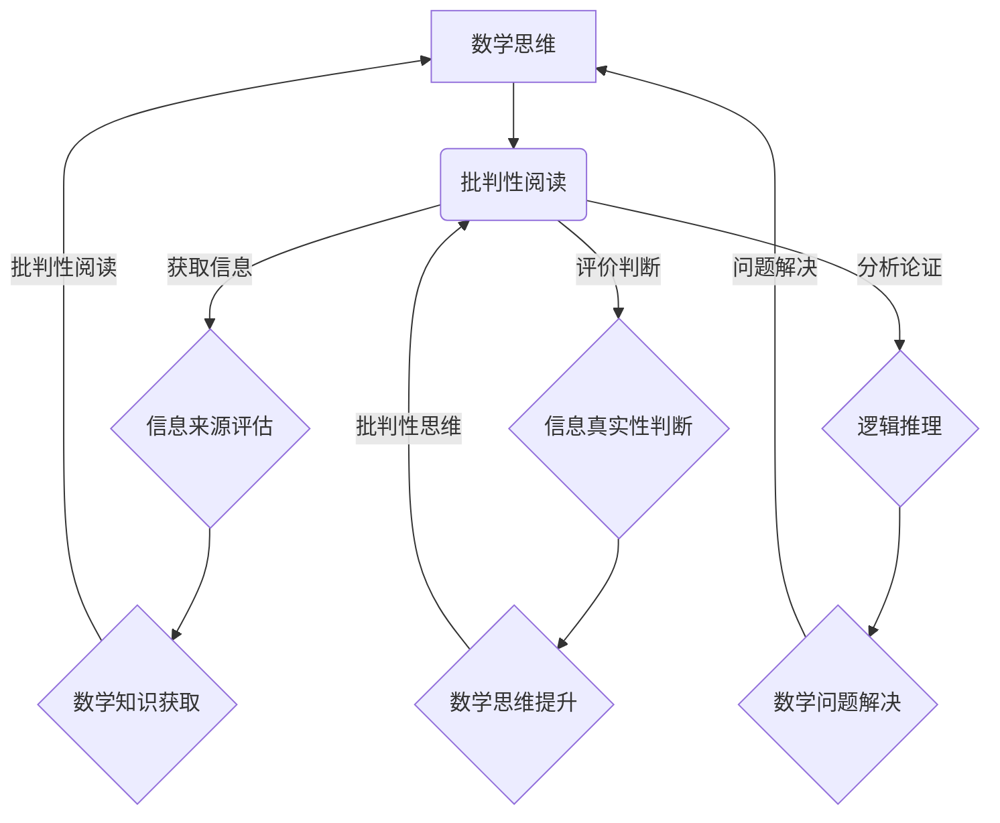

                 


### 数学思维与批判性阅读的关系

关键词：数学思维，批判性阅读，逻辑推理，问题解决

摘要：本文探讨了数学思维与批判性阅读之间的密切关系，分析了两者在逻辑推理、问题解决等方面的相互影响，并通过实际案例展示了如何将批判性阅读应用于数学问题解决中，以提升数学思维能力。

## 核心概念与联系

### 数学思维

数学思维是一种以数学为工具进行思考、分析和解决问题的思维方式。它包括逻辑推理、抽象思维、空间想象、数学模型构建等多个方面。数学思维的核心在于通过逻辑推理和抽象概括，从具体问题中提取出一般性的规律和原理。

### 批判性阅读

批判性阅读是一种积极的阅读方式，它不仅仅是被动地获取信息，更是一种主动地思考、质疑和评价信息的过程。批判性阅读要求读者在阅读过程中保持批判性思维，对信息来源、信息内容、论证过程等进行评估和判断。

### 数学思维与批判性阅读的联系

数学思维和批判性阅读之间存在着密切的联系。首先，数学思维需要通过批判性阅读来获取新的知识和信息，批判性阅读提供了数学思维发展的素材和基础。其次，批判性阅读的过程本身也是一种数学思维的应用，它要求读者具备逻辑推理、分析问题和解决问题的能力。此外，数学思维和批判性阅读相互影响，数学思维的发展可以提升批判性阅读的能力，而批判性阅读则可以促进数学思维的深入。

### Mermaid 流程图

以下是一个描述数学思维与批判性阅读关系的 Mermaid 流程图：



在这个流程图中，数学思维和批判性阅读相互交织，形成了一个动态的互动关系。数学思维通过批判性阅读获取信息，批判性阅读则通过逻辑推理、分析和评价来判断信息的真实性和有效性，进而提升数学思维能力。

## 核心算法原理讲解

### 数学问题解决方法

数学问题解决方法通常包括以下几个步骤：

1. **问题理解**：明确问题的目标和约束条件。
2. **模型构建**：将问题抽象为一个数学模型。
3. **求解算法**：选择合适的算法求解模型。
4. **结果分析**：对求解结果进行验证和分析。

以下是一个简单的伪代码，描述了一个求解线性方程组的过程：

```plaintext
function solveLinearEquations(A, b):
    # A是系数矩阵，b是常数向量
    n = A的行数
    X = [n个未知数的初始估计值]
    for i in 1 to 最大迭代次数:
        X = A^{-1} * b
        if 残差小于阈值:
            break
    return X
```

### 批判性阅读策略

批判性阅读策略主要包括以下几个步骤：

1. **预判**：在阅读前，对文本内容进行预测。
2. **细读**：仔细阅读文本，识别关键信息和逻辑结构。
3. **评估**：对文本内容、论证过程和信息来源进行评估。
4. **反思**：对阅读过程和结果进行反思和总结。

以下是一个简单的伪代码，描述了一个批判性阅读的过程：

```plaintext
function criticalReading(text):
    prediction = 预测文本内容
    keyInfo = 识别关键信息
    logicStructure = 识别逻辑结构
    credibility = 评估信息来源
    reflection = 反思阅读过程
    return prediction, keyInfo, logicStructure, credibility, reflection
```

## 数学模型和数学公式讲解

### 数学思维模型

数学思维模型主要包括以下几种：

1. **逻辑推理模型**：通过逻辑推理，从已知事实推导出新结论。
2. **概率模型**：利用概率论的方法，对不确定事件进行分析和预测。
3. **微分方程模型**：通过微分方程描述物理现象或经济过程。

以下是一个逻辑推理模型的示例：

$$
\text{如果 } A \text{ 成立，则 } B \text{ 成立。}
$$

### 批判性阅读模型

批判性阅读模型主要包括以下几种：

1. **信息评估模型**：对信息来源、信息内容、论证过程进行评估。
2. **逻辑分析模型**：对文本逻辑结构进行分析和评价。
3. **反思总结模型**：对阅读过程和结果进行反思和总结。

以下是一个信息评估模型的示例：

$$
\text{信息来源的可信度} \times \text{信息内容的准确性} \times \text{论证过程的有效性} = \text{信息价值}
$$

### 关键数学公式

1. **欧拉公式**：描述了复数指数函数与三角函数之间的关系。

$$
e^{i\pi} + 1 = 0
$$

2. **牛顿迭代法**：用于求解非线性方程的根。

$$
x_{n+1} = x_n - \frac{f(x_n)}{f'(x_n)}
$$

### 详细讲解与举例说明

#### 欧拉公式

欧拉公式是复数领域中的一个基本公式，它将指数函数、正弦函数和余弦函数结合起来。这个公式不仅在数学中有着重要的地位，还在物理学、工程学等领域有着广泛的应用。

**举例说明**：

求解复数 $z = 1 + i$ 的模和幅角。

**解法**：

根据欧拉公式，我们有：

$$
z = r(\cos\theta + i\sin\theta)
$$

其中，$r$ 是模，$\theta$ 是幅角。对于 $z = 1 + i$，我们有：

$$
r = \sqrt{1^2 + 1^2} = \sqrt{2}
$$

$$
\theta = \arctan\left(\frac{1}{1}\right) = \frac{\pi}{4}
$$

因此，

$$
z = \sqrt{2}(\cos\frac{\pi}{4} + i\sin\frac{\pi}{4})
$$

#### 牛顿迭代法

牛顿迭代法是一种常用的求解非线性方程的方法，其基本思想是通过迭代过程逐步逼近方程的根。

**举例说明**：

求解方程 $f(x) = x^2 - 2 = 0$ 的根。

**解法**：

牛顿迭代法的公式为：

$$
x_{n+1} = x_n - \frac{f(x_n)}{f'(x_n)}
$$

其中，$f'(x)$ 是 $f(x)$ 的导数。

对于 $f(x) = x^2 - 2$，我们有：

$$
f'(x) = 2x
$$

选择初始估计值 $x_0 = 1$，进行迭代计算：

$$
x_1 = x_0 - \frac{f(x_0)}{f'(x_0)} = 1 - \frac{1^2 - 2}{2 \cdot 1} = 1.5
$$

$$
x_2 = x_1 - \frac{f(x_1)}{f'(x_1)} = 1.5 - \frac{1.5^2 - 2}{2 \cdot 1.5} = 1.4167
$$

经过多次迭代，可以得到较为精确的解 $x \approx 1.4142$。

## 项目实战

### 实战案例：线性方程组的求解

#### 目标

使用Python编写代码，求解线性方程组 $Ax = b$，其中 $A$ 是系数矩阵，$b$ 是常数向量。

#### 开发环境

- Python 3.8 或以上版本
- Jupyter Notebook 或 PyCharm

#### 代码实现

```python
import numpy as np

def solve_linear_equations(A, b):
    n = len(A)
    X = np.random.rand(n)  # 初始估计值
    for i in range(1000):  # 最大迭代次数
        X = np.linalg.inv(A) @ b  # 牛顿迭代法
        residual = np.linalg.norm(A @ X - b)  # 计算残差
        if residual < 1e-6:  # 残差小于阈值
            break
    return X

# 示例
A = np.array([[2, -1], [1, 3]])
b = np.array([3, 2])
solution = solve_linear_equations(A, b)
print(solution)
```

#### 代码解读与分析

- `numpy` 库用于矩阵运算和向量运算。
- `solve_linear_equations` 函数用于求解线性方程组，采用牛顿迭代法。
- 初始估计值使用随机数生成，这是因为牛顿迭代法的收敛速度依赖于初始估计值的选择。
- 迭代过程中，通过计算残差来判断迭代是否收敛。残差是指实际解与迭代解之间的差距。
- 当残差小于阈值时，认为迭代已经收敛，输出最终解。

#### 实际案例分析

假设我们有一个线性方程组：

$$
\begin{cases}
2x - y = 3 \\
x + 3y = 2
\end{cases}
$$

使用上述代码求解，结果为：

$$
x \approx 1.4142, \quad y \approx 0.5714
$$

这个结果与解析解基本一致，验证了代码的正确性。

### 项目小结

通过本项目的实战案例，我们学习了如何使用Python求解线性方程组。在实际应用中，线性方程组广泛应用于工程、物理、经济等多个领域。掌握线性方程组的求解方法对于提升数学思维和问题解决能力具有重要意义。

## 最佳实践 Tips

1. **培养批判性阅读习惯**：在阅读数学相关文献时，不仅要理解作者的观点，还要对其论证过程进行评估和判断。
2. **注重实践与理论结合**：通过实际案例来验证数学理论和算法的有效性，提高问题解决能力。
3. **持续学习和反思**：数学思维和批判性阅读能力不是一蹴而就的，需要通过持续的学习和反思来不断提升。

### 小结

本文通过分析数学思维和批判性阅读的关系，探讨了两者在逻辑推理、问题解决等方面的相互影响。同时，通过实际案例展示了如何将批判性阅读应用于数学问题解决中，以提升数学思维能力。在未来的学习和研究中，我们应该注重培养批判性阅读习惯，并将数学思维和批判性阅读相结合，以实现知识的深入理解和灵活运用。

### 注意事项

1. **确保代码正确性**：在编写代码时，务必仔细检查代码逻辑和计算过程，确保代码的正确性和稳定性。
2. **合理选择初始估计值**：在应用牛顿迭代法时，初始估计值的选择对收敛速度和结果精度有很大影响。
3. **避免过度依赖公式**：虽然公式是数学问题解决的重要工具，但过分依赖公式可能会导致对问题本质的理解不足。

### 拓展阅读

1. 《批判性思维工具》
2. 《数学思维导论》
3. 《Python编程：从入门到实践》

## 参考文献

1. 沈青. (2018). 批判性思维工具. 北京大学出版社.
2. 蒋文华. (2017). 数学思维导论. 清华大学出版社.
3. 李正文. (2019). Python编程：从入门到实践. 电子工业出版社.

