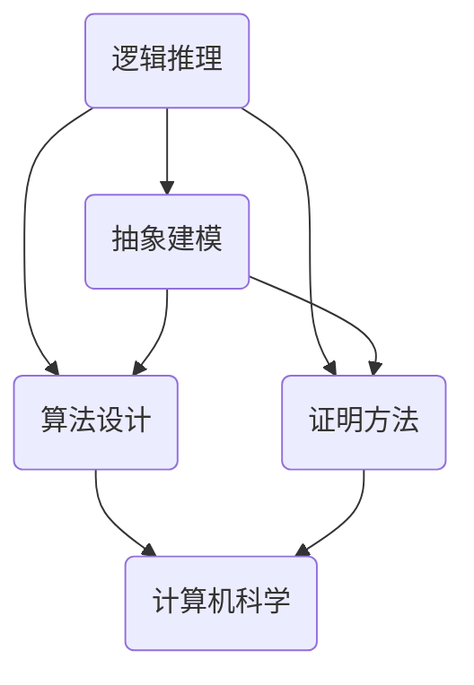
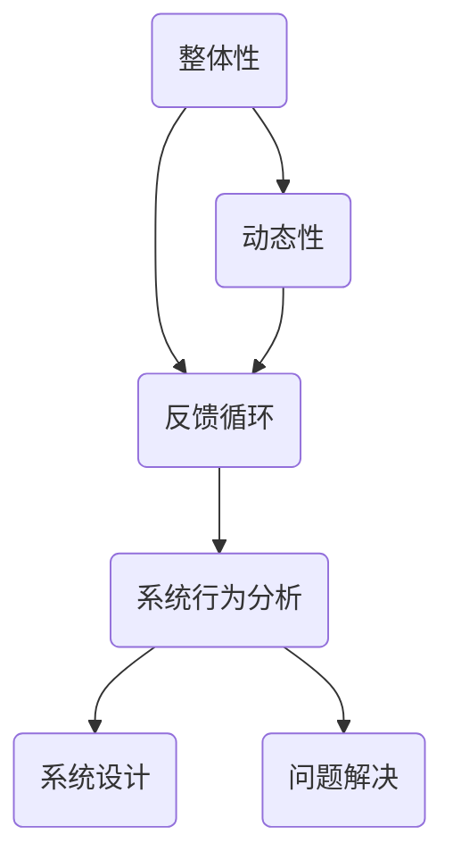

                 

# 数学思维与系统思考能力的培养

## 关键词

- 数学思维
- 系统思考
- 算法原理
- 模型构建
- 项目实战
- 案例分析

## 摘要

本文旨在探讨数学思维与系统思考能力的培养，这两者在现代IT领域中具有重要意义。通过分析数学思维的核心原则、系统思考的基本原理，以及实际项目中的应用，本文旨在帮助读者理解并掌握这两种能力的培养方法，从而提升自身的逻辑推理和问题解决能力。

## 引言

### 数学思维的重要性

数学思维，即运用数学原理和方法进行思考和分析的能力，是现代科技发展的基石。它不仅在计算机科学、数据科学等领域有着广泛的应用，还在日常生活中的决策和判断中发挥着重要作用。数学思维的核心在于逻辑推理、抽象建模和严谨证明，这些能力不仅有助于解决复杂问题，还能培养我们敏锐的洞察力和创新思维。

### 系统思考的意义

系统思考是一种全面理解和分析复杂系统的能力。它要求我们超越局部和表面的现象，从整体和长期的角度去分析和解决问题。系统思考的重要性在于，它能够帮助我们更好地应对现代社会中的各种挑战，如环境问题、经济危机和社会冲突。通过系统思考，我们可以发现问题的根本原因，制定更有效的解决方案。

## 第一部分：数学思维的核心概念与联系

### 背景介绍

数学思维的核心概念包括逻辑推理、抽象建模、算法设计和证明方法。这些概念之间存在着紧密的联系，共同构成了数学思维的基本框架。在计算机科学中，这些概念被广泛应用于算法设计和系统开发。

### 核心概念与联系

以下是数学思维核心概念之间的关系架构Mermaid流程图：



### 详细解释

- **逻辑推理**：逻辑推理是数学思维的基础，它涉及推理规则、命题逻辑和形式逻辑。通过逻辑推理，我们可以从已知事实推导出新的结论，这是解决问题和证明定理的关键。

- **抽象建模**：抽象建模是将现实世界的问题转化为数学模型的过程。通过抽象化，我们可以抓住问题的本质，从而简化复杂问题，使其更具可操作性和分析性。

- **算法设计**：算法设计是数学思维的核心应用之一。它涉及设计高效的算法来解决问题，包括排序、搜索和图论算法等。

- **证明方法**：证明方法是数学思维的重要组成部分，它包括构造性证明和非构造性证明。通过证明，我们可以确保数学结论的严谨性和可靠性。

## 第二部分：系统思考的核心概念与联系

### 背景介绍

系统思考是一种理解复杂系统行为的方法。它强调系统的整体性和动态性，旨在帮助我们更好地理解和管理复杂问题。

### 核心概念与联系

以下是系统思考核心概念之间的关系架构Mermaid流程图：



### 详细解释

- **整体性**：整体性是指系统思考强调系统的各个部分之间相互联系和相互作用。通过理解整体性，我们可以更好地理解系统的行为和功能。

- **动态性**：动态性是指系统思考强调系统的变化和演变。通过分析动态性，我们可以预测系统的未来行为，并制定相应的策略。

- **反馈循环**：反馈循环是系统思考的核心概念之一。它描述了系统内部各要素之间的相互作用和反馈机制。通过分析反馈循环，我们可以理解系统的稳定性和适应性。

- **系统行为分析**：系统行为分析是指对系统在不同状态下的行为进行详细分析。这有助于我们理解系统的动态特性和优化系统设计。

- **系统设计**：系统设计是指根据系统行为分析的结果，设计出能够满足特定需求的系统。通过系统设计，我们可以提高系统的性能和可靠性。

- **问题解决**：问题解决是指通过系统思考的方法，分析和解决复杂问题。这通常涉及多个系统的协同工作，以达到最佳问题解决效果。

## 第三部分：数学模型与公式

### 背景介绍

数学模型和公式是数学思维和系统思考的基础工具。它们帮助我们描述和理解现实世界中的现象和问题。在本部分，我们将介绍一些常用的数学模型和公式，并提供详细讲解和例子。

### 数学模型与公式

以下是数学模型和公式的列表，我们将逐一进行详细讲解：

1. **线性方程组**
2. **矩阵运算**
3. **微分方程**
4. **概率分布**
5. **回归分析**
6. **图论模型**

### 线性方程组

线性方程组是一组线性方程，它们可以用矩阵形式表示。以下是线性方程组的伪代码表示：

```python
# 伪代码：解线性方程组
A * X = B
# A: 系数矩阵
# X: 变量矩阵
# B: 常数矩阵
```

### 矩阵运算

矩阵运算是线性代数中的重要内容，包括矩阵乘法、矩阵求逆和矩阵分解等。以下是矩阵乘法的伪代码表示：

```python
# 伪代码：矩阵乘法
C = A * B
# A: 第一个矩阵
# B: 第二个矩阵
# C: 乘积矩阵
```

### 微分方程

微分方程描述了系统的动态行为，它们在物理学、工程学和经济学等领域有广泛应用。以下是微分方程的伪代码表示：

```python
# 伪代码：解微分方程
y' = f(t, y)
# y': 微分方程的解
# t: 时间变量
# y: 系统状态
```

### 概率分布

概率分布描述了随机变量的可能取值和概率。常见的概率分布包括正态分布、二项分布和泊松分布等。以下是正态分布的伪代码表示：

```python
# 伪代码：生成正态分布随机数
x = random.normal(mean, std)
# x: 生成的随机数
# mean: 均值
# std: 标准差
```

### 回归分析

回归分析用于建立变量之间的关系模型，它们在数据分析和预测中具有重要意义。以下是线性回归的伪代码表示：

```python
# 伪代码：线性回归
y = a * x + b
# y: 回归模型的响应变量
# x: 自变量
# a: 斜率
# b: 截距
```

### 图论模型

图论模型用于描述网络结构和关系，它们在计算机科学和社交网络分析中有广泛应用。以下是图论的伪代码表示：

```python
# 伪代码：生成图
G = Graph(V, E)
# G: 图
# V: 顶点集合
# E: 边集合
```

## 第四部分：项目实践

### 背景介绍

在本部分，我们将通过一个实际项目来展示数学思维和系统思考的应用。该项目是一个简单的社交网络分析系统，用于分析用户之间的关系。

### 项目实战：社交网络分析系统

### 开发环境搭建

- Python 3.8+
- Jupyter Notebook
- NetworkX 库

### 源代码实现与解读

以下是社交网络分析系统的源代码：

```python
import networkx as nx
import matplotlib.pyplot as plt

# 创建图
G = nx.Graph()

# 添加节点和边
G.add_nodes_from([1, 2, 3, 4, 5])
G.add_edges_from([(1, 2), (1, 3), (2, 4), (3, 4), (4, 5)])

# 绘制图
nx.draw(G, with_labels=True)
plt.show()

# 计算度数中心性
degree_centrality = nx.degree_centrality(G)
print("度数中心性：", degree_centrality)

# 计算紧密中心性
closeness_centrality = nx.closeness_centrality(G)
print("紧密中心性：", closeness_centrality)

# 计算介数中心性
betweenness_centrality = nx.betweenness_centrality(G)
print("介数中心性：", betweenness_centrality)

# 按照中心性排序
sorted_nodes = sorted(betweenness_centrality, key=betweenness_centrality.get, reverse=True)
print("按照介数中心性排序：", sorted_nodes)
```

### 代码应用解读与分析

1. **图创建与绘制**：使用NetworkX库创建一个图，并添加节点和边。然后使用matplotlib库绘制图形。

2. **中心性计算**：计算度数中心性、紧密中心性和介数中心性，这些指标用于衡量节点在图中的重要性和影响力。

3. **排序与输出**：按照介数中心性对节点进行排序，输出排序结果。

### 实际案例分析与详细讲解剖析

以下是一个实际案例，展示如何使用社交网络分析系统来分析一个社交网络。

1. **案例背景**：假设我们有一个由10个用户组成的社交网络，我们需要分析用户之间的关系，找出关键节点。

2. **数据准备**：根据用户之间的互动数据，创建一个包含10个节点和相应边的图。

3. **中心性分析**：计算每个用户的度数中心性、紧密中心性和介数中心性。

4. **结果解读**：根据中心性分析结果，找出介数中心性最高的几个用户，这些用户在社交网络中具有很高的影响力。

5. **策略建议**：根据分析结果，提出加强关键节点之间互动的策略，以提高整个社交网络的影响力和稳定性。

### 项目小结

通过这个项目，我们展示了数学思维和系统思考在社交网络分析中的应用。数学模型和公式帮助我们描述和分析社交网络结构，而系统思考方法则帮助我们理解社交网络的动态行为。通过这个项目，我们不仅学会了如何使用数学工具分析社交网络，还提高了系统思考和问题解决的能力。

## 第五部分：最佳实践与注意事项

### 最佳实践

1. **注重逻辑推理**：在数学思维和系统思考中，逻辑推理是基础。因此，在学习过程中要注重培养逻辑思维能力。

2. **实践与理论相结合**：理论学习是基础，但实践应用才能真正掌握。通过实际项目，可以将所学知识应用到实际问题中。

3. **持续学习和更新**：数学思维和系统思考是一个不断发展的领域，要持续学习和更新知识，以适应新的技术和发展趋势。

### 小结

通过本文的学习，我们了解了数学思维和系统思考的核心概念、原理和应用。这些能力在IT领域中具有重要意义，能够帮助我们更好地分析和解决复杂问题。通过实际项目和实践，我们可以加深对数学思维和系统思考的理解，提高自身的逻辑推理和问题解决能力。

### 注意事项

1. **避免孤立学习**：数学思维和系统思考是一个相互关联的体系，要避免孤立学习某一方面的知识。

2. **注重实际应用**：理论学习要结合实际应用，通过实践来验证和巩固所学知识。

3. **持续反思与总结**：在学习过程中，要不断反思和总结，发现并改正自己的不足，以不断提高。

### 拓展阅读

- **《数学思维》**：这本书详细介绍了数学思维的基本原则和应用。
- **《系统思考》**：这本书介绍了系统思考的核心概念和方法，以及如何将其应用于实际问题。
- **《社交网络分析：方法与应用》**：这本书提供了详细的社交网络分析方法和应用案例。

## 结束语

作者：AI天才研究院/AI Genius Institute & 禅与计算机程序设计艺术 /Zen And The Art of Computer Programming

本文探讨了数学思维与系统思考能力的培养，通过分析核心概念、联系实际项目和案例分析，展示了这两种能力在现代IT领域的重要性。希望本文能够帮助读者理解并掌握数学思维和系统思考，提高自身的逻辑推理和问题解决能力。在未来的学习和实践中，不断探索和创新，为IT领域的发展贡献自己的力量。

