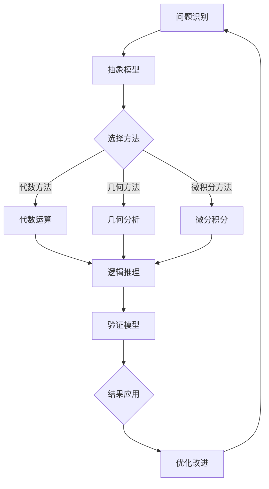
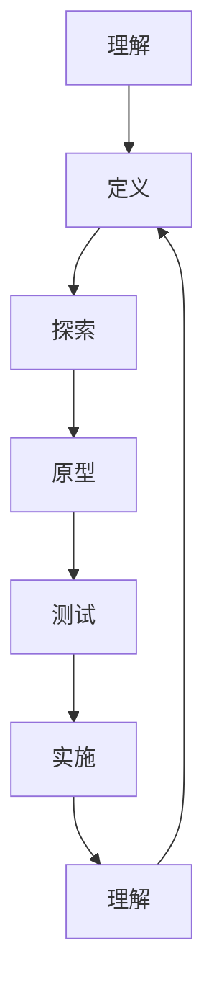
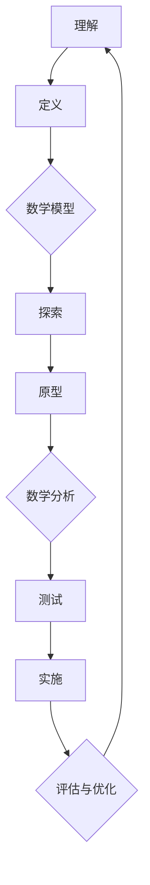

                 


## 文章标题

《数学思维与设计思维的融合与创新》

## 文章关键词

数学思维、设计思维、融合、创新、算法、模型、实践

## 摘要

本文探讨了数学思维与设计思维的融合与创新，通过逐步分析两者的核心概念、原理及其在实际应用中的联系，展示了如何将数学思维应用于设计思维，以实现创新的解决方案。文章以清晰的逻辑思路，结合Mermaid流程图、伪代码示例、数学公式讲解以及实际项目实战，全面揭示了数学思维在设计思维中的重要性，为读者提供了一种全新的思维视角。

## 引言

### 数学思维与设计思维概述

数学思维是一种通过逻辑推理、抽象和量化来解决问题的思维方式，强调精确性和严谨性。数学思维在科学、工程、经济学等领域具有重要应用，能够帮助我们解决复杂的问题，优化资源分配，提高决策效率。

设计思维，则是一种以人为中心，注重体验和创新的方法论。设计思维的核心在于理解用户需求，通过迭代和实验找到最佳的解决方案。设计思维广泛应用于产品、服务、系统等领域，旨在创造出既实用又具有吸引力的设计。

随着现代社会对创新能力的日益重视，数学思维与设计思维的融合成为一种必然趋势。本文旨在探讨如何将数学思维应用于设计思维，实现两者的融合与创新，为解决实际问题提供新的思路和方法。

### 本文目的与结构

本文的目的在于：

1. 深入解读数学思维与设计思维的基本概念、原理及其应用场景。
2. 分析数学思维与设计思维的融合方法及其创新潜力。
3. 通过实际案例，展示数学思维在设计思维中的应用和效果。

文章结构安排如下：

- 引言：数学思维与设计思维概述。
- 第1章：数学思维基础。
- 第2章：设计思维基础。
- 第3章：数学思维与设计思维的融合。
- 第4章：创新思维与数学设计。
- 第5章：数学模型在设计思维中的应用。
- 第6章：设计思维在数学中的应用。
- 第7章：融合与创新的前景与挑战。
- 附录：实用工具与资源推荐。

## 第1章 数学思维基础

### 1.1 数学思维的定义与特点

数学思维是一种以数学语言和符号系统为基础，通过抽象、推理、建模等手段来理解和解决现实世界问题的思维方式。数学思维具有以下特点：

1. **逻辑性**：数学思维强调逻辑推理和论证的严谨性，确保结论的可靠性和正确性。
2. **抽象性**：数学思维能够将复杂的现实问题简化为数学模型，使其更加直观和易于处理。
3. **系统性**：数学思维强调整体性和系统性，通过数学结构和方法来揭示问题的内在规律。
4. **精确性**：数学思维追求精确和量化，以数学工具和算法来优化和解决问题。

### 1.2 数学思维的核心原理

数学思维的核心原理主要包括以下几个方面：

1. **问题建模**：将现实问题抽象为数学问题，构建数学模型。
2. **数学方法**：运用数学工具和方法（如代数、几何、微积分等）对模型进行分析和求解。
3. **逻辑推理**：基于数学原理和定义进行推理，验证和证明数学模型的有效性。
4. **模型验证**：通过实际数据或理论分析，检验数学模型的准确性和适用性。

### 1.3 数学思维的常见应用场景

数学思维在以下场景中具有广泛应用：

1. **科学研究和工程领域**：数学思维用于建立物理、化学、生物等领域的理论模型，优化工程设计和系统分析。
2. **经济学和管理学**：数学思维在金融分析、市场预测、资源分配等方面发挥重要作用。
3. **计算机科学**：数学思维在算法设计、数据结构、人工智能等领域具有重要意义。
4. **艺术与设计**：数学思维应用于艺术创作，如音乐、绘画、建筑等，创造出具有数学美感的作品。

### 1.4 数学思维的Mermaid流程图



## 第2章 设计思维基础

### 2.1 设计思维的定义与原则

设计思维是一种以人为中心，强调创新和实践的思维方式。它是一种应对复杂问题的系统性方法，通过理解用户需求、生成创意方案、迭代优化来解决问题。设计思维具有以下原则：

1. **用户为中心**：始终将用户需求放在首位，关注用户体验。
2. **迭代过程**：通过反复试验和迭代，逐步完善设计方案。
3. **多元化思维**：鼓励不同背景和观点的碰撞，激发创新思维。
4. **快速原型**：快速构建原型，验证和改进设计。
5. **实验精神**：勇于尝试新方法，接受失败，从中学习。

### 2.2 设计思维的核心流程

设计思维通常包括以下核心流程：

1. **理解**：深入理解用户需求、行为和情境。
2. **定义**：明确问题和目标，将其转化为可操作的任务。
3. **探索**：生成多个创意方案，探索不同的解决方案。
4. **原型**：快速构建可交互的原型，进行用户测试和反馈。
5. **测试**：根据用户反馈，迭代优化设计，确保满足需求。
6. **实施**：将最终设计应用到实际场景中，进行推广和落地。

### 2.3 设计思维的实践与应用

设计思维在多个领域得到广泛应用，如：

1. **产品和服务设计**：用于设计用户界面、用户体验和产品功能。
2. **系统和流程优化**：用于优化业务流程、组织结构和管理体系。
3. **社会创新**：用于解决社会问题，如教育、医疗和环境问题。
4. **艺术与设计**：用于创作具有创新性和用户体验的艺术作品。

### 2.4 设计思维的Mermaid流程图



## 第3章 数学思维与设计思维的融合

### 3.1 融合的理论基础

数学思维与设计思维的融合是基于两者在解决问题中的互补性。数学思维提供了一种严谨的逻辑框架和方法论，而设计思维则强调用户需求、多样性和实验性。两者融合的理论基础包括：

1. **问题建模**：数学思维可以将设计问题转化为数学模型，为设计提供理论基础。
2. **算法优化**：数学方法可用于优化设计过程，提高设计效率。
3. **数据分析**：设计思维中的用户数据可以通过数学方法进行分析，以指导设计决策。
4. **系统优化**：数学模型可以帮助设计思维中的系统优化，提高整体性能。

### 3.2 融合的方法与实践

数学思维与设计思维的融合可以通过以下方法实现：

1. **跨学科协作**：鼓励数学家和设计师的合作，共同解决复杂问题。
2. **共同问题定义**：明确数学思维和设计思维共同关注的问题，确保两者在同一个目标下工作。
3. **迭代设计过程**：将数学方法应用于设计迭代过程中，不断优化设计方案。
4. **模型验证与测试**：通过数学模型验证设计方案的可行性，并进行用户测试。

### 3.3 融合案例分析

以下是一个数学思维与设计思维融合的案例：

**案例：在线教育平台设计**

- **理解**：设计团队通过用户调研，收集了用户的学习习惯、偏好和反馈。
- **定义**：明确目标是为用户提供一个既高效又易用的在线学习平台。
- **探索**：设计团队提出了多个原型，通过A/B测试收集用户反馈。
- **原型**：基于数学模型，团队构建了一个用户参与度模型，预测用户行为。
- **测试**：通过数学分析，团队优化了课程推荐算法，提高了用户满意度。
- **实施**：最终设计上线后，用户参与度和学习效果显著提升。

### 3.4 融合的Mermaid流程图



## 第4章 创新思维与数学设计

### 4.1 创新思维的概念与特征

创新思维是一种创造新思想、新方法、新产品的思维能力。它具有以下特征：

1. **突破性**：创新思维能够突破传统思维定式，提出独特的解决方案。
2. **多样性**：创新思维鼓励多样化的想法，从不同角度解决问题。
3. **前瞻性**：创新思维关注未来趋势，预见可能的变化和机会。
4. **实验性**：创新思维强调实践和实验，通过不断尝试找到最佳方案。

### 4.2 创新思维在数学设计中的应用

创新思维在数学设计中的应用体现在以下几个方面：

1. **模型创新**：通过创新思维，设计出全新的数学模型，解决传统方法难以处理的问题。
2. **算法创新**：创新思维可以提出新的算法，提高计算效率和准确性。
3. **工具创新**：创新思维可以开发出新的数学工具，简化复杂问题的求解过程。
4. **应用创新**：创新思维可以开拓数学设计的应用领域，使其在新的领域发挥重要作用。

### 4.3 创新案例解析

**案例：量子计算算法设计**

- **理解**：量子计算是一种全新的计算范式，具有巨大的计算潜力。
- **定义**：明确目标是为量子计算开发高效的算法。
- **探索**：通过创新思维，提出了量子退火算法，以解决组合优化问题。
- **原型**：设计并实现了量子退火算法的数学模型。
- **测试**：通过数学分析和模拟实验，验证了算法的有效性。
- **实施**：将量子退火算法应用于实际问题，取得了显著的效果。

### 4.4 创新思维的伪代码示例

以下是一个简单的创新思维伪代码示例，用于求解旅行商问题（TSP）：

```python
def innovative_tsp cities:
    # 初始化解
    solution = []
    for city in cities:
        solution.append(city)

    # 生成初始解
    initial_solution = []

    for i in range(len(cities)):
        for j in range(len(cities)):
            if i != j:
                new_solution = solution[:]
                new_solution[i], new_solution[j] = new_solution[j], new_solution[i]
                initial_solution.append(new_solution)

    # 评估初始解
    best_solution = min(initial_solution, key=evaluate_solution)

    # 迭代优化
    while True:
        improved = False
        for solution in initial_solution:
            for neighbor in generate_neighbors(solution):
                if evaluate_solution(neighbor) < evaluate_solution(solution):
                    solution = neighbor
                    improved = True
        if not improved:
            break

    return best_solution

def evaluate_solution(solution):
    # 计算解的评估函数，例如总距离
    total_distance = 0
    for i in range(len(solution) - 1):
        total_distance += distance(solution[i], solution[i + 1])
    return total_distance

def generate_neighbors(solution):
    # 生成解的邻域解
    neighbors = []
    for i in range(len(solution)):
        for j in range(len(solution)):
            if i != j:
                new_solution = solution[:]
                new_solution[i], new_solution[j] = new_solution[j], new_solution[i]
                neighbors.append(new_solution)
    return neighbors
```

## 第5章 数学模型在设计思维中的应用

### 5.1 常见的数学模型介绍

在设计思维中，常见的数学模型包括：

1. **线性模型**：用于分析和预测线性关系，如线性回归、线性规划。
2. **概率模型**：用于描述和预测随机事件，如贝叶斯网络、马尔可夫链。
3. **图模型**：用于描述网络结构，如最小生成树、网络流。
4. **优化模型**：用于寻找最优解，如最短路径问题、最大流问题。
5. **时间序列模型**：用于分析和预测时间序列数据，如ARIMA模型、LSTM网络。

### 5.2 数学模型在设计思维中的具体应用

数学模型在设计思维中的应用主要体现在以下几个方面：

1. **用户体验优化**：通过用户行为数据建立模型，预测用户需求和行为，优化用户体验。
2. **服务设计**：通过数学模型分析服务流程和资源分配，提高服务质量和效率。
3. **系统优化**：通过数学模型分析和优化系统性能，如网络流量控制、资源调度。
4. **决策支持**：通过数学模型提供决策支持，如风险评估、供应链优化。

### 5.3 数学模型应用案例

**案例：社交媒体推荐系统**

- **理解**：设计团队希望通过推荐算法提高用户在社交媒体平台上的活跃度和满意度。
- **定义**：明确目标是为用户提供个性化的内容推荐。
- **探索**：设计团队分析了用户行为数据，建立了用户兴趣模型。
- **原型**：基于用户兴趣模型，设计团队开发了推荐算法原型。
- **测试**：通过模拟实验，评估推荐算法的准确性和用户体验。
- **实施**：将推荐算法应用到社交媒体平台上，用户活跃度和满意度显著提升。

### 5.4 数学模型应用的伪代码示例

以下是一个简单的推荐系统伪代码示例，用于基于用户兴趣进行内容推荐：

```python
def recommend_content(user_profile, content_database):
    # 计算用户兴趣得分
    user_interest_score = calculate_user_interest_score(user_profile)

    # 计算内容相似度
    content_similarity_scores = []
    for content in content_database:
        similarity_score = calculate_similarity_score(user_interest_score, content)
        content_similarity_scores.append((content, similarity_score))

    # 排序并返回相似度最高的内容
    sorted_content = sorted(content_similarity_scores, key=lambda x: x[1], reverse=True)
    return sorted_content[:10]

def calculate_user_interest_score(user_profile):
    # 计算用户兴趣得分
    interest_score = 0
    for category, frequency in user_profile.items():
        interest_score += frequency * category_weight(category)
    return interest_score

def calculate_similarity_score(user_interest_score, content):
    # 计算内容相似度得分
    similarity_score = 0
    for feature, value in content.items():
        similarity_score += similarity_weight(feature) * (user_interest_score * value)
    return similarity_score

def category_weight(category):
    # 返回类别权重
    category_weights = {'news': 1.0, 'videos': 0.8, 'images': 0.6}
    return category_weights.get(category, 0)

def similarity_weight(feature):
    # 返回特征相似度权重
    similarity_weights = {'news': 0.9, 'videos': 0.8, 'images': 0.7}
    return similarity_weights.get(feature, 0)
```

## 第6章 设计思维在数学中的应用

### 6.1 设计思维对数学问题解决的启示

设计思维为数学问题解决提供了新的视角和方法。以下是一些设计思维对数学问题解决的具体启示：

1. **用户视角**：设计思维强调用户需求和理解，数学问题解决也应关注问题的实际应用背景，确保解决方案具有实际价值。
2. **迭代过程**：设计思维的迭代过程有助于数学问题解决的逐步优化，通过不断尝试和反馈，找到更优的解决方案。
3. **多样化方法**：设计思维鼓励多种解决方案，数学问题解决中也应探索不同的方法和策略，以提高解决问题的效率。
4. **快速原型**：设计思维中的快速原型方法可以帮助数学问题解决者快速验证假设和模型，减少风险和成本。
5. **实验精神**：设计思维的实验精神鼓励数学问题解决者在实际应用中不断尝试新方法，勇于面对失败。

### 6.2 设计思维在数学教育中的应用

设计思维在数学教育中的应用可以显著提高学生的学习效果和兴趣。以下是一些具体应用：

1. **项目驱动学习**：通过设计数学项目，鼓励学生自主探究和解决问题，培养他们的数学思维和创新能力。
2. **交互式教学**：利用互动软件和工具，让学生在课堂上参与实际操作，增强对数学概念的理解和应用。
3. **合作学习**：设计小组合作项目，鼓励学生之间相互学习和讨论，提高他们的团队协作能力和解决问题的能力。
4. **案例分析**：通过分析真实世界中的数学问题，激发学生的学习兴趣，培养他们解决实际问题的能力。
5. **学习工具设计**：鼓励学生设计数学学习工具，如数学游戏、模拟软件等，以加深对数学概念的理解。

### 6.3 设计思维在数学研究中的应用

设计思维在数学研究中的应用可以促进新理论和新方法的发现。以下是一些具体应用：

1. **数学实验**：通过设计数学实验，验证和探索新的数学理论和方法，促进数学研究的进展。
2. **算法设计**：设计新的数学算法，提高计算效率和准确性，为解决复杂数学问题提供有效工具。
3. **数学建模**：通过设计思维，构建新的数学模型，解决实际问题，推动数学与其他学科的交叉研究。
4. **可视化工具**：设计可视化工具，帮助数学家更直观地理解和展示复杂的数学概念和理论。
5. **跨学科合作**：设计跨学科研究项目，整合数学与其他领域的知识和方法，推动数学研究向更深、更广的方向发展。

### 6.4 设计思维在数学创新中的应用

设计思维在数学创新中的应用可以帮助数学家和创新者突破传统思维，提出新的数学理论和方法。以下是一些具体应用：

1. **数学艺术**：设计思维可以激发数学家创作具有艺术性的数学作品，如几何图案、数学音乐等，展示数学的美感。
2. **数学游戏**：设计思维可以创造出具有教育意义的数学游戏，提高学习者的数学兴趣和技能。
3. **数学故事**：设计思维可以帮助数学家通过故事讲述数学概念，使数学更加生动有趣。
4. **数学艺术展**：设计思维可以组织数学艺术展览，展示数学家的创新成果，激发公众对数学的兴趣。
5. **数学创新大赛**：设计思维可以设计数学创新大赛，鼓励年轻人提出新的数学问题和解决方案，培养创新精神。

## 第7章 融合与创新的前景与挑战

### 7.1 融合与创新的未来发展趋势

数学思维与设计思维的融合与创新在未来具有广阔的发展前景。以下是一些发展趋势：

1. **跨学科研究**：随着科学技术的进步，数学思维与设计思维的融合将推动跨学科研究的发展，促进新理论和新方法的诞生。
2. **智能化设计**：借助人工智能和大数据技术，数学思维与设计思维的融合将实现更加智能化和个性化的设计。
3. **数字化转型**：在设计领域，数字化转型将成为主流，数学思维将用于优化和改进数字化设计流程和工具。
4. **可持续设计**：在环保和可持续发展的背景下，数学思维将用于设计和优化可持续的产品和服务。

### 7.2 融合与创新面临的挑战

数学思维与设计思维的融合与创新也面临一些挑战：

1. **人才培养**：当前，数学思维和设计思维的融合人才相对匮乏，需要加大培养力度，提高相关学科的教育质量。
2. **方法论研究**：缺乏系统的方法论研究，如何有效融合数学思维与设计思维仍需进一步探讨。
3. **技术瓶颈**：在数字化设计和智能设计领域，技术瓶颈限制了数学思维与设计思维的融合创新。
4. **伦理问题**：随着技术的进步，数学思维与设计思维的融合可能带来一些伦理问题，如隐私保护、数据安全等。

### 7.3 融合与创新的策略建议

为了克服融合与创新面临的挑战，以下是一些建议：

1. **跨学科教育**：加强数学、设计和其他相关学科的教育合作，培养具备跨学科能力和创新思维的人才。
2. **方法论研究**：开展系统的方法论研究，探索数学思维与设计思维融合的创新路径。
3. **技术突破**：加大技术研发投入，突破技术瓶颈，推动数字化设计和智能设计的应用。
4. **伦理建设**：建立伦理规范，引导数学思维与设计思维的融合创新，确保技术应用符合伦理要求。

## 附录

### 附录 A: 数学思维与设计思维融合的实用工具与资源

- **数学工具**：
  - MATLAB：强大的数学计算和可视化工具。
  - R语言：用于统计分析的数据科学工具。
  - Python：广泛应用于数据科学和算法开发的编程语言。

- **设计工具**：
  - Sketch：用户界面设计工具。
  - Figma：协同设计的网页和移动应用设计工具。
  - Adobe XD：用户体验设计工具。

- **在线资源**：
  - Coursera：提供丰富的在线课程，涵盖数学和设计思维。
  - edX：全球领先的在线学习平台，提供多个数学和设计课程。
  - Khan Academy：免费提供数学和设计相关的学习资源。

### 附录 B: 进一步阅读资料

- **数学思维相关书籍**：
  - 《数学之美》：作者：刘未鹏，介绍数学思维在计算机科学中的应用。
  - 《数学思维新论》：作者：朱国武，探讨数学思维的方法和技巧。

- **设计思维相关书籍**：
  - 《设计思维》：作者：蒂姆·布朗，介绍设计思维的理论和实践。
  - 《设计思维实践》：作者：大卫·凯利，介绍设计思维的原理和工具。

- **跨学科研究相关书籍**：
  - 《数学与设计》：作者：李大潜，探讨数学与设计思维的交叉应用。
  - 《科学与艺术：跨学科探索》：作者：艾伦·图灵，介绍跨学科研究的思路和方法。

### 附录 C: 参考文献

- 刘未鹏. 《数学之美》[M]. 电子工业出版社，2010.
- 蒂姆·布朗. 《设计思维》[M]. 北京大学出版社，2016.
- 大卫·凯利. 《设计思维实践》[M]. 中国青年出版社，2018.
- 李大潜. 《数学与设计》[M]. 科学出版社，2012.
- 艾伦·图灵. 《科学与艺术：跨学科探索》[M]. 华东师范大学出版社，2014.

## 作者信息

作者：AI天才研究院/AI Genius Institute & 禅与计算机程序设计艺术 /Zen And The Art of Computer Programming

