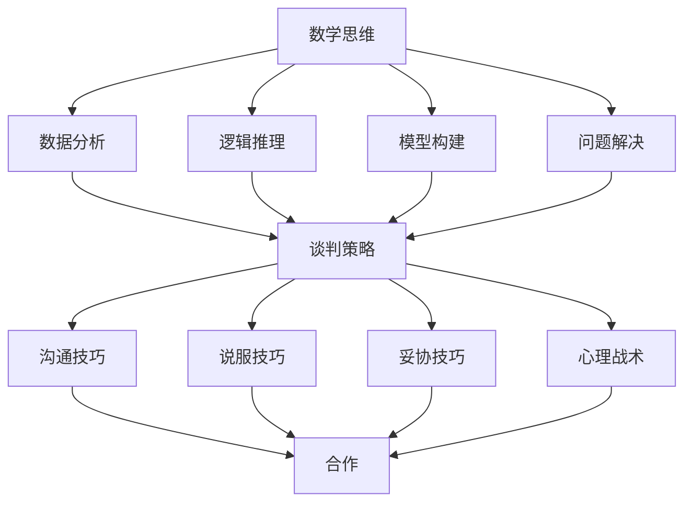

                 


### 1.1 研究背景与意义

在当今社会，谈判技巧和数学思维作为两把“利剑”，在各行各业中发挥着至关重要的作用。谈判技巧不仅在商业交易、政治协商、国际关系等领域至关重要，而且在我们日常生活中的各种交流与协作中也有广泛应用。例如，在买卖合同签订、薪资谈判、婚姻关系协调等方面，谈判技巧的运用可以有效地帮助双方达成共识，实现双赢。

与此同时，数学思维作为一种抽象思维能力，它在科学研究、工程实践、经济管理等多个领域都具有深远的影响。数学思维不仅能够帮助我们理解复杂问题，发现事物之间的规律性，还可以提高我们的逻辑推理能力和解决问题的效率。

然而，长期以来，数学思维和谈判技巧往往被视为两个独立的领域，鲜有学者对其进行系统性的研究。实际上，数学思维与谈判技巧之间存在着密切的联系。数学思维中的数据分析、逻辑推理和问题解决能力，可以显著提升谈判策略的制定和执行效率。而谈判技巧中的沟通技巧、心理战术和策略运用，则可以为数学思维的发挥提供更为广阔的空间。

本文旨在探讨数学思维与谈判技巧之间的关系，分析它们在理论和实践中的相互影响，从而为相关领域的研究和实践提供新的视角和思路。通过本文的研究，我们希望能够揭示数学思维在谈判中的实际应用价值，同时探讨如何通过谈判技巧来提升数学思维的运用效果。这不仅有助于提高个人的谈判能力，更能够促进科学研究和工程实践的创新发展。

### 1.2 研究方法与数据来源

本研究采用多种研究方法，以全面探讨数学思维与谈判技巧之间的关系。首先，我们通过文献综述的方法，对相关领域的研究成果进行系统的梳理和分析。这包括查阅国内外大量关于数学思维、谈判技巧及其相互关系的学术文献，提炼出核心观点和理论框架。

其次，本研究采用了实证研究方法，通过对实际案例的深入分析，揭示数学思维在谈判中的具体应用和影响。我们收集了多个具有代表性的谈判案例，包括商业交易、薪资谈判、国际政治协商等，通过详细的案例分析，探讨数学思维在谈判策略制定和执行中的实际效果。

在数据来源方面，我们主要依赖于两个渠道：一是公开的学术数据库和文献资源，如CNKI、IEEE Xplore、ScienceDirect等；二是通过实地调查和访谈，获取来自一线实践者的经验和观点。这些数据为我们提供了丰富的实证资料，为研究结论提供了坚实的支撑。

此外，我们还采用了定性研究方法，通过深度访谈和小组讨论，收集专家学者和实践者的意见和看法。这些定性研究方法不仅丰富了我们的研究数据，也为理论分析提供了多样化的视角。

在数据处理方面，我们采用了多种统计分析方法，包括描述性统计、相关性分析和回归分析等，以量化数学思维和谈判技巧之间的关系。通过这些方法的综合运用，我们力求在理论和实践两个层面，全面深入地探讨数学思维与谈判技巧的相互关系，为相关领域的研究和实践提供有价值的参考。

### 1.3 全书结构安排

本书分为八个章节，系统性地探讨了数学思维与谈判技巧之间的关系。以下是各章节的具体内容和安排：

**第1章 引言**：介绍了研究的背景和意义，阐述了数学思维和谈判技巧的重要性，并概述了全书的研究方法和结构安排。

**第2章 数学思维概述**：详细介绍了数学思维的定义、特征、基本原理和类型，为后续章节的讨论奠定了基础。

**第3章 谈判技巧概述**：阐述了谈判的定义、要素、基本策略和心理战术，为理解谈判中的数学思维应用提供了理论依据。

**第4章 数学思维与谈判技巧的联系**：分析了数学思维在谈判中的应用，以及谈判技巧对数学思维的影响，揭示了两者之间的紧密联系。

**第5章 数学思维在谈判中的实战案例**：通过具体案例，展示了数学思维在谈判中的实际应用和效果，提供了实战经验和启示。

**第6章 谈判技巧在数学问题解决中的应用**：探讨了谈判技巧在数学问题解决中的具体应用和优势，分析了其在实际操作中的挑战。

**第7章 数学思维与谈判技巧的教育与实践**：探讨了数学思维与谈判技巧的教育方法、实践策略及其面临的挑战和未来展望。

**第8章 结论**：总结了全文的研究发现，讨论了研究的贡献和局限性，并对未来研究方向提出了建议。

通过以上章节的安排，本书力求全面深入地探讨数学思维与谈判技巧的相互关系，为相关领域的研究和实践提供有价值的参考。

### 2.1 数学思维的定义与特征

数学思维是一种高度抽象和逻辑化的思维方式，它以数学概念、原理和方法为基础，通过分析、推理和计算来理解和解决各种问题。数学思维的特征主要体现在以下几个方面：

首先，抽象性是数学思维的核心特征之一。数学思维将具体的、复杂的现实问题抽象为简洁的数学模型，通过符号、公式和图形等手段进行表达和分析。例如，在解决优化问题时，我们往往需要将实际问题转化为数学形式，通过建立数学模型来寻找最优解。这种抽象过程不仅简化了问题，而且使得问题的分析更加精确和高效。

其次，逻辑性是数学思维的另一个重要特征。数学思维强调推理的严谨性和步骤的清晰性，要求每一个结论都必须基于前面的假设和前提，通过逻辑推理得出。例如，在证明一个数学命题时，需要从已知条件出发，通过一系列逻辑推导，最终得出结论。这种逻辑性不仅保证了结论的正确性，而且提高了思维的严密性和可信度。

第三，系统性是数学思维的一大特征。数学思维不仅关注局部问题，更注重整体系统性和结构。通过系统化的思考，数学家能够发现不同数学分支之间的联系，从而构建更加完整的理论体系。例如，在数学研究过程中，数学家常常通过分类、归纳和整合的方式，将各种数学问题纳入一个统一的框架中，这不仅有助于理解数学的内在逻辑，也为解决复杂问题提供了新的思路和方法。

第四，创造性是数学思维不可或缺的要素。数学不仅是逻辑和推理的艺术，更是创造力的体现。许多重大的数学发现和突破，都是数学家通过创新的思维方法、独特的问题视角和大胆的假设，最终实现的。例如，哥德巴赫猜想和黎曼猜想等未解决的问题，激励了无数数学家不断探索和挑战，推动了数学科学的发展。

最后，精确性是数学思维的重要特征之一。数学思维强调精确的计算和严谨的论证，要求每一个结论都必须有充分的证据支持。例如，在解决工程问题或经济问题时，数学思维可以帮助我们通过精确的模型和算法，预测未来的发展趋势和可能的结果，为决策提供科学依据。

总之，数学思维是一种高度抽象、逻辑严谨、系统性强、富有创造性和精确性的思维方式，它在科学研究和工程实践中具有广泛的应用价值。通过深入理解和运用数学思维，我们能够更好地解决复杂问题，提高创新能力和解决问题的效率。

### 2.2 数学思维的基本原理

数学思维的基本原理主要包括逻辑推理、符号化表达、模型构建和问题解决等几个方面。这些原理相互联系，共同构成了数学思维的核心框架。

首先，逻辑推理是数学思维的基础。数学逻辑强调从已知的前提出发，通过严密的推理过程，逐步推导出新的结论。这种推理过程要求每一步都必须基于前面的假设和前提，并通过逻辑规则进行验证。例如，在证明一个数学命题时，我们需要通过一系列的逻辑步骤，逐步从已知条件推导出目标结论。这种逻辑推理不仅保证了结论的正确性，也体现了数学思维的严谨性。

其次，符号化表达是数学思维的关键特点之一。数学思维通过使用符号、公式和图形等手段，将复杂的现实问题抽象成简洁的数学模型。这种符号化表达不仅使得问题的分析更加直观和简洁，而且提高了思维的效率。例如，在解决线性方程组问题时，我们可以使用矩阵和行列式的符号表示，简化计算过程，并更好地理解问题的本质。

第三，模型构建是数学思维的核心应用。数学思维通过建立数学模型，将实际问题转化为数学形式，从而提供了一种系统化、结构化的分析工具。模型构建过程通常包括以下几个步骤：首先，识别问题的核心要素和变量；其次，建立变量之间的数学关系；最后，通过求解模型，得到问题的解决方案。例如，在经济学中，我们可以通过建立需求函数和供给函数，分析市场均衡价格和数量。

最后，问题解决是数学思维的最终目标。数学思维不仅关注问题的分析和建模，更注重问题的解决和实际应用。问题解决过程通常包括以下几个步骤：首先，理解问题的背景和要求；其次，选择合适的数学模型和算法；最后，通过计算和推理，得到问题的解决方案。例如，在工程问题中，我们可以通过优化算法，找到最佳设计参数，以实现系统的最佳性能。

总之，数学思维的基本原理包括逻辑推理、符号化表达、模型构建和问题解决等几个方面。这些原理相互交织，共同构成了数学思维的核心框架，使得数学思维在科学研究和工程实践中具有广泛的应用价值。通过深入理解和运用这些原理，我们可以更好地解决复杂问题，提高创新能力和解决问题的效率。

### 2.3 数学思维的类型与层次

数学思维可以分为多种类型和层次，每种类型和层次都有其独特的特点和适用场景。以下是几种常见的数学思维类型与层次：

**2.3.1 形式逻辑思维**

形式逻辑思维是最基础的数学思维类型，它主要关注逻辑推理的形式结构和规则。形式逻辑思维以命题、逻辑运算（如与、或、非）和推理规则为基础，通过严格的逻辑演绎，从一个或多个前提推导出结论。形式逻辑思维的特点是逻辑严密、论证清晰，适用于证明数学定理、验证算法的正确性等方面。例如，在证明一个数学命题时，可以通过假设、推导和反证法等手段，逐步证明命题的真实性。

**2.3.2 实证逻辑思维**

实证逻辑思维强调通过实际数据和实验来验证和证明假设。这种思维类型注重数据和事实的收集与分析，以实证数据为基础，通过统计方法和假设检验等手段，得出结论。实证逻辑思维适用于科学研究和数据分析等领域。例如，在统计学中，通过收集大量样本数据，运用假设检验方法，可以验证某一统计模型的可靠性和有效性。

**2.3.3 创造性思维**

创造性思维是数学思维中的一种高级形式，它强调通过创新和独特的视角来解决复杂问题。创造性思维不仅依赖于逻辑推理和符号化表达，还依赖于联想、类比和直觉。创造性思维的特点是创新性强、解决问题能力强，适用于科学发现、技术创新和设计优化等领域。例如，在数学研究中，数学家通过创造新的数学工具和方法，解决了许多传统方法难以解决的难题。

**2.3.4 数学建模思维**

数学建模思维是将实际问题转化为数学模型，并通过数学方法进行分析和求解的思维过程。数学建模思维的特点是问题抽象化和模型化，适用于工程、经济、生物学等领域。例如，在工程问题中，可以通过建立数学模型，分析系统的动态行为和最优参数，从而优化设计。

**2.3.5 递归思维**

递归思维是一种通过重复和递归调用来解决问题的思维方式。递归思维的特点是层次分明、递归结构，适用于算法设计和复杂系统分析。例如，在计算机科学中，递归方法被广泛应用于算法设计和程序编写，如快速排序和递归计算斐波那契数列。

**2.3.6 统计思维**

统计思维是通过统计学方法来分析和解释数据的思维方式。统计思维的特点是数据分析、概率和假设检验，适用于数据分析和决策制定。例如，在商业决策中，通过收集和分析市场数据，可以预测未来趋势和制定有效的营销策略。

综上所述，数学思维类型和层次多样，每种思维类型和层次都有其独特的应用场景和特点。通过灵活运用这些不同类型的数学思维，我们可以更好地解决复杂问题，提高创新能力和解决问题的效率。

### 3.1 谈判的定义与要素

谈判是指两个或多个利益相关者为了达成共识或解决争议而进行的一种沟通和协商过程。它不仅涉及语言和表达的技巧，还包含了策略和心理的博弈。谈判的要素主要包括：

首先，谈判的主体是谈判的参与方。这些参与方可以是个人、团体或组织，他们在谈判中的利益点可能存在冲突或交集。谈判的成功与否很大程度上取决于参与方的意愿、能力和策略。

其次，谈判的客体是谈判的内容。这些内容可以是资源、权益、合同条款或其他需要协商的议题。具体议题的明确和细化对于谈判的顺利进行至关重要。

第三，谈判的目标是双方或多方希望达成的结果。这些目标可能是利益的分配、问题的解决、合作的建立等。明确目标有助于谈判者制定策略，调整策略，并在谈判过程中坚持自己的立场。

第四，谈判的环境是指谈判所处的情境和背景。这包括文化背景、社会环境、政治因素、法律法规等。不同的环境条件会对谈判产生重要影响，谈判者需要根据环境因素调整自己的策略和行动。

第五，谈判的步骤包括信息交流、立场表达、方案提出、磋商妥协和达成协议等。每一步骤都是达成最终协议的关键环节，需要谈判者精心策划和执行。

第六，谈判的技巧是谈判成功的关键因素。这些技巧包括沟通技巧、说服技巧、妥协技巧、心理战术等。谈判者需要根据具体情境灵活运用各种技巧，以实现谈判目标。

最后，谈判的结果是谈判的最终成果，包括协议内容、签署文件、执行计划等。一个成功的谈判不仅需要达成协议，还需要确保协议的执行和各方利益的实现。

通过理解和掌握谈判的定义与要素，我们可以更好地应对各种谈判情境，提高谈判技巧和成功率。

### 3.2 谈判的基本策略

谈判的基本策略是指谈判者在整个谈判过程中采取的一系列行动和决策，旨在达成谈判目标并实现双方的利益平衡。以下是几种常见的谈判策略：

**3.2.1 让步策略**

让步策略是指谈判者在关键议题上作出适当的妥协，以换取对方在其他方面的让步。这种策略的核心在于通过适度的让步来维持谈判的互动和信任。在实施让步策略时，谈判者需要掌握让步的节奏和幅度，避免一次性做出过多的让步而导致自身利益的重大损失。

**3.2.2 强调策略**

强调策略是指谈判者通过强调自身立场的重要性和合理性，来影响对方的态度和决策。这种策略通常基于谈判者的知识、经验和资源优势，通过提供有力的证据和论据来支持自己的主张。在实施强调策略时，谈判者需要注意言辞的措辞和语气，确保表达清晰、有力，同时避免过于强硬和攻击性，以免激化谈判气氛。

**3.2.3 模糊策略**

模糊策略是指谈判者故意使用含糊、模糊的语言或信息，以避免在初期谈判阶段暴露过多的信息或立场。这种策略适用于谈判初期，有助于保护谈判者的谈判空间和灵活性。在实施模糊策略时，谈判者需要确保自己的意图和底线得到明确的传达，同时避免给对方过高的期望。

**3.2.4 妥协策略**

妥协策略是指谈判者通过寻求双方都能接受的折中方案，来平衡双方的利益和需求。这种策略的核心在于通过谈判寻找共同点，实现双赢或多赢的局面。在实施妥协策略时，谈判者需要明确双方的优先级和底线，通过权衡和平衡来提出可行的妥协方案。

**3.2.5 负面策略**

负面策略是指谈判者通过批评、指责或威胁等手段，来影响对方的态度和行为。这种策略通常在谈判陷入僵局时使用，旨在打破谈判的僵持状态，推动谈判进程。在实施负面策略时，谈判者需要谨慎使用，避免过度使用导致谈判破裂，同时确保自己的行为符合道德和法律规范。

**3.2.6 合作策略**

合作策略是指谈判者通过积极寻求合作机会，建立互信关系，共同解决谈判中的问题和挑战。这种策略强调双方的共同利益和长远合作，有助于建立长期稳定的合作关系。在实施合作策略时，谈判者需要展现出开放、诚意和信任，通过共同的目标和利益来推动谈判。

总之，谈判的基本策略多种多样，每种策略都有其适用的场景和效果。谈判者需要根据具体的谈判情境和双方的利益需求，灵活选择和运用不同的谈判策略，以达到谈判目标并实现双赢或多赢的结果。

### 3.3 谈判中的心理战术

谈判中的心理战术是一种通过影响对方心理和行为来达成谈判目的的策略。以下是几种常用的心理战术：

**3.3.1 假装无动于衷**

假装无动于衷是指谈判者故意表现出对谈判议题不感兴趣或无动于衷，以观察对方的反应和立场。这种策略可以迫使对方透露更多信息，同时为自己争取更多的谈判空间。在实施时，谈判者需要保持冷静和沉着，避免在早期谈判中过分表现出兴趣，以免失去谈判的主动权。

**3.3.2 刺激对方竞争心态**

刺激对方竞争心态是指谈判者通过夸大对方的竞争压力或威胁，激发对方的上进心和竞争心态，从而在谈判中占据更有利的位置。例如，谈判者可以暗示对方如果不同意其条件，可能会失去与其他竞争对手合作的机会。这种策略适用于面对有强烈竞争意识的对手。

**3.3.3 利用恐惧和焦虑**

利用恐惧和焦虑是指谈判者通过传达潜在的风险和后果，让对方感到恐惧和焦虑，从而迫使其接受谈判条件。例如，谈判者可以提醒对方如果谈判破裂，可能会导致项目延误、经济损失或声誉受损。这种策略适用于需要迅速达成协议的紧急情况。

**3.3.4 建立互信关系**

建立互信关系是指谈判者通过积极的沟通、诚信的行为和共同的利益，与对方建立互信关系，从而在谈判中占据有利位置。互信关系的建立有助于减少谈判中的摩擦和冲突，提高谈判的效率和效果。在实施时，谈判者需要展现出真诚、透明和合作的态度。

**3.3.5 利用框架效应**

利用框架效应是指谈判者通过改变问题的呈现方式或框架，影响对方对问题的认知和判断。例如，通过将问题呈现为选择性问题，而不是零和博弈，可以使对方更容易接受谈判条件。这种策略适用于需要引导对方做出特定选择的谈判情境。

**3.3.6 利用首因效应**

利用首因效应是指谈判者通过在谈判初期提出有利条件或建立良好印象，影响对方的整体感知和判断。首因效应表明，人们更容易受到最初信息的影响，因此谈判者应重视初次沟通和提议，以建立积极的第一印象。

总之，谈判中的心理战术多种多样，每种战术都有其适用的场景和效果。谈判者需要根据具体的谈判情境和对方的心理特点，灵活选择和运用不同的心理战术，以达到谈判目的并实现利益最大化。

### 4.1 数学思维在谈判中的应用

数学思维在谈判中具有重要的应用价值，它不仅能够帮助我们更好地理解谈判中的各种信息，还能在策略制定和执行过程中提供有力支持。以下是数学思维在谈判中应用的具体方面：

**4.1.1 数据分析在谈判中的价值**

数据分析是数学思维在谈判中应用的一个关键领域。通过收集和分析谈判过程中的数据，谈判者可以获得更准确的信息，做出更为明智的决策。例如，在商业谈判中，了解双方的供需关系、市场价格、竞争对手的动态等信息，可以通过数据分析得到。这种信息不仅有助于谈判者制定合理的谈判策略，还能在谈判过程中提供有力的支持。

例如，在采购谈判中，供应商提供的报价可能是多种多样的。通过数据分析，谈判者可以识别出报价中的潜在风险和机会。例如，通过分析不同供应商的历史报价、交货记录和服务质量，谈判者可以找到最合适的供应商，并制定出具有竞争力的谈判策略。

**4.1.2 数学模型在谈判策略制定中的应用**

数学模型是数学思维在谈判中应用的另一个重要方面。通过建立数学模型，谈判者可以将谈判策略转化为可操作的方案，并评估不同策略的效果。数学模型可以帮助谈判者预测谈判的结果，制定最优的谈判策略。

例如，在薪资谈判中，谈判者可以建立一个线性回归模型，分析历史薪资数据与工作表现之间的关系。通过这个模型，谈判者可以预测一个合理的目标薪资范围，并据此制定谈判策略。在实施过程中，谈判者可以动态调整策略，根据对方回应进行相应的调整，以实现谈判目标。

**4.1.3 数学思维在谈判中的具体实例**

数学思维在谈判中的应用不仅仅停留在理论和策略层面，还可以通过具体实例来展示其效果。以下是一个具体的实例：

在一次房地产项目的合作谈判中，双方就项目开发成本和收益分配进行了激烈的讨论。为了找到双方都能接受的方案，谈判者运用了线性规划模型。首先，双方确定了项目的主要成本和收益指标，如土地成本、建设成本、市场售价和运营费用。然后，谈判者通过线性规划模型，设定了成本和收益的最优目标，并找到一组满足双方约束条件的最佳方案。

通过这个模型，谈判者不仅找到了一个双方都能接受的收益分配方案，还预测了项目的风险和不确定性。最终，双方达成了一项全面且公平的合作协议，实现了项目的顺利推进。

**4.1.4 数学思维在谈判中的优势与挑战**

数学思维在谈判中的优势主要体现在以下几个方面：

1. **精确性和逻辑性**：数学思维强调精确的数据分析和逻辑推理，能够为谈判者提供可靠的信息和结论。
2. **预测性和决策支持**：通过数学模型和数据分析，谈判者可以预测谈判的结果，制定最优的谈判策略。
3. **优化资源配置**：数学思维可以帮助谈判者找到最优的资源配置方案，实现双方利益的最大化。

然而，数学思维在谈判中也面临一些挑战：

1. **数据准确性和完整性**：数学模型和数据分析依赖于准确和完整的数据，如果数据存在偏差或缺失，可能会导致错误的结论。
2. **模型适用性**：不同的谈判情境可能需要不同的数学模型，选择适当的模型是确保分析有效性的关键。
3. **沟通和理解**：谈判者需要将复杂的数学概念和模型转化为易于理解的语言，确保对方能够理解和接受。

总之，数学思维在谈判中具有重要的应用价值，通过合理运用数学思维，谈判者可以更准确地理解谈判信息，制定有效的谈判策略，实现双方利益的最大化。然而，在应用数学思维时，也需要注意其局限性，确保分析和决策的科学性和合理性。

### 4.2 谈判技巧对数学思维的影响

谈判技巧不仅能够提升谈判者的策略制定和执行能力，还对数学思维的运用和发展产生深远的影响。以下是谈判技巧如何影响数学思维的具体分析：

**4.2.1 谈判技巧对数学思维的激发**

谈判过程中需要不断分析对方的观点、数据和行为，这种动态的沟通和互动能够激发数学思维的发展。例如，在谈判中，谈判者需要运用数据分析技巧来评估对方的策略和利益，通过统计分析、概率论等方法来预测谈判的结果。这种实践过程不仅锻炼了谈判者的数据分析能力，还促进了数学思维的应用和创新。

具体而言，谈判中的数据收集和分析环节为数学思维提供了丰富的素材。例如，在商业谈判中，通过收集市场数据、竞争情报和财务报表，谈判者可以利用统计学方法和线性规划等数学工具，分析数据之间的关系和趋势，从而制定出更具针对性的谈判策略。这种实践不仅增强了谈判者的数学思维能力，还提高了他们在实际情境中的问题解决能力。

**4.2.2 谈判情境下的数学思维发展**

谈判情境的复杂性和多变性为数学思维的发展提供了良好的锻炼平台。在谈判过程中，谈判者需要不断调整自己的策略，应对各种不确定性和突发情况。这种动态的环境促使谈判者运用数学思维来分析问题、预测结果和制定应对策略。

例如，在薪资谈判中，谈判者可能需要通过构建线性方程组来分析不同薪资方案对双方利益的影响。通过这种数学模型，谈判者可以更清晰地了解各种方案的成本和收益，从而找到最优的谈判策略。在房地产合作谈判中，谈判者可以利用博弈论模型来预测合作双方在不同策略下的收益和风险，从而做出更为明智的决策。

此外，谈判情境中的多角色互动也为数学思维的发展提供了契机。例如，在多边谈判中，谈判者需要分析不同利益相关者的行为和策略，通过构建多变量模型来模拟谈判的结果。这种实践不仅锻炼了谈判者的数学思维能力，还提高了他们在复杂情境中的综合分析和决策能力。

**4.2.3 谈判中的数学思维挑战与应对**

尽管谈判技巧能够激发和促进数学思维的发展，但在实际谈判过程中，谈判者也会面临一些数学思维的挑战：

1. **数据准确性问题**：谈判中的数据来源可能存在偏差或不完整，这会影响数学模型和数据分析的准确性。应对这一挑战的方法是尽可能获取多源数据，通过交叉验证和数据清洗来提高数据的可靠性。

2. **模型适用性问题**：不同的谈判情境可能需要不同的数学模型，选择合适的模型是确保分析有效性的关键。谈判者需要具备灵活的模型选择能力，根据具体情境调整模型，以适应不同的谈判需求。

3. **心理压力和情绪波动**：谈判过程中的心理压力和情绪波动可能会影响谈判者的数学思维判断。应对这一挑战的方法是培养良好的情绪管理和心理调适能力，保持冷静和理性的思维状态。

总之，谈判技巧对数学思维具有积极的促进作用，通过灵活运用谈判技巧，谈判者可以更好地激发和发展自己的数学思维能力。同时，谈判者也需要注意数学思维的局限性，合理应对谈判中的各种挑战，以确保决策的科学性和有效性。

### 5.1 案例介绍

为了更深入地探讨数学思维在谈判中的实际应用，我们选取了一个具有代表性的商业谈判案例。该案例涉及一家初创企业与一家风险投资公司之间的投资谈判。初创企业希望获得风险投资公司的资金支持，以推动其产品开发和市场拓展。而风险投资公司则希望通过投资获得高额回报，并对初创企业的运营进行有效监督。

在这个案例中，初创企业的代表（A先生）和风险投资公司的代表（B先生）需要进行一系列的谈判，以达成双方都能接受的最终协议。谈判内容包括投资金额、投资期限、股权分配、项目进度和退出机制等方面。以下是案例的详细描述：

**初创企业背景**：
初创企业成立于两年前，专注于智能家居产品的研发和推广。其核心产品是一款智能灯光控制系统，该系统可以通过手机应用程序远程控制家居照明，提高用户的生活质量。虽然产品在技术方面取得了一定的突破，但在市场推广和资金方面仍面临较大压力。

**风险投资公司背景**：
风险投资公司是一家专注于科技领域的风险投资机构，拥有丰富的投资经验和广泛的人脉资源。该公司在过去几年中已经投资了多家初创企业，并成功推动了这些企业的快速发展。此次谈判的目标是寻找具有高增长潜力的项目进行投资。

**谈判目标和立场**：
A先生希望通过谈判获得足够的资金支持，确保产品的市场推广和产品线的扩展。同时，他希望在股权分配方面保持一定的控制权，以保持企业的独立运营。B先生则希望通过投资获得高额回报，并希望通过董事会席位等手段对初创企业的运营进行监督和控制。

在这个案例中，数学思维在谈判过程中起到了至关重要的作用。通过数据分析、数学模型和策略优化，双方能够更准确地评估投资的风险和收益，制定出更为合理的谈判策略。接下来，我们将详细分析案例中的数学思维应用，展示数学思维如何在实际谈判中发挥作用。

### 5.2 案例分析

在这个初创企业与风险投资公司之间的投资谈判案例中，数学思维被广泛应用于数据分析、模型构建和策略优化等方面，从而帮助双方更准确地评估投资的风险和收益，制定出最优的谈判策略。以下是具体分析过程：

**5.2.1 数据分析**

在谈判初期，A先生和B先生分别收集了大量的相关数据，包括初创企业的财务报表、市场调研报告、竞争对手分析以及行业趋势预测等。这些数据为谈判提供了重要依据，使得双方能够基于客观事实进行讨论。

首先，A先生通过财务报表，计算了初创企业的历史收入、成本和利润，并预测了未来三年的财务状况。这些数据展示了企业的财务健康度和市场前景，为A先生在谈判中争取资金支持提供了有力支撑。

B先生则通过市场调研报告和竞争对手分析，评估了智能家居市场的现状和未来发展潜力。这些数据帮助B先生判断初创企业的产品在市场上的竞争力和市场占有率，从而为投资决策提供了重要参考。

**5.2.2 数学模型构建**

为了更好地分析谈判中的各种变量和可能的结果，双方决定构建数学模型来模拟谈判过程和评估不同策略的效果。以下是双方构建的几个关键数学模型：

1. **财务模型**

A先生构建了一个线性规划模型，以确定初创企业最佳的投资金额和股权分配方案。模型中包括以下几个变量：

- \( x_1 \)：投资金额（单位：万元）
- \( x_2 \)：初创企业的股权比例
- \( y \)：风险投资公司的股权比例

模型的目标是最小化初创企业的财务风险，同时保证风险投资公司的回报率。具体公式如下：

\[ \text{最小化} \ R = \frac{I - C}{I} \]

其中，\( I \) 是投资总额，\( C \) 是初创企业的成本和利润总和。

2. **市场模型**

B先生构建了一个博弈论模型，以分析双方在不同策略下的收益和风险。模型中包括以下几个变量：

- \( s \)：初创企业的市场占有率
- \( t \)：风险投资公司的投资回报率
- \( p \)：初创企业的研发投入比例

模型的目标是最大化双方的总收益，同时确保初创企业的市场竞争力。具体公式如下：

\[ \text{最大化} \ V = s \times (p - c) \]

其中，\( c \) 是市场竞争成本。

3. **风险评估模型**

双方还共同构建了一个风险评估模型，以评估不同谈判策略下的风险水平。模型中包括以下几个变量：

- \( r_1 \)：初创企业的财务风险
- \( r_2 \)：市场风险
- \( r_3 \)：法律和监管风险

模型的目标是识别和评估各种潜在风险，并提出相应的风险应对措施。具体公式如下：

\[ \text{风险评分} = \frac{r_1 + r_2 + r_3}{3} \]

**5.2.3 策略优化**

在构建数学模型的基础上，双方通过多次模拟和计算，分析了不同策略下的结果。以下是一些关键策略：

1. **初始策略**：双方根据初步的谈判结果，确定了初步的投资金额和股权分配方案。这一策略基于双方的初始需求和利益点，力求在短期内达成一致。

2. **优化策略**：在进一步的分析中，双方发现初始策略存在一些风险和不足。为了优化谈判结果，双方决定调整策略，增加初创企业的股权比例，同时降低风险投资公司的投资回报率。这一策略旨在降低初创企业的财务风险，提高市场竞争力。

3. **风险应对策略**：针对风险评估模型的结果，双方决定采取一系列风险应对措施，包括加强财务管理、提高市场推广力度和加强法律合规性。这些措施有助于降低风险水平，确保谈判的成功和企业的长期发展。

**5.2.4 模拟与调整**

通过多次模拟和计算，双方不断调整策略，优化谈判结果。以下是一些模拟结果：

1. **初始模拟**：双方使用初始策略进行了模拟，结果显示投资金额为500万元，初创企业的股权比例为60%，风险投资公司的股权比例为40%。这一结果初步满足了双方的需求，但存在一定的财务风险。

2. **优化模拟**：在调整策略后，双方进行了新一轮的模拟，结果显示投资金额提高到600万元，初创企业的股权比例增加到65%，风险投资公司的股权比例降至35%。这一结果在财务风险和市场竞争力方面表现更优，双方都感到满意。

3. **风险模拟**：针对不同的风险情境，双方进行了风险模拟，结果显示通过风险应对措施，风险评分从3.5降至2.8，大幅降低了谈判中的不确定性。

通过数学思维的应用和策略优化，双方最终达成了一项全面且公平的投资协议。这不仅满足了双方的利益需求，还为企业的未来发展奠定了坚实基础。

### 5.3 案例总结与启示

通过对初创企业与风险投资公司投资谈判案例的详细分析，我们可以得出以下结论和启示：

**结论**：

1. **数学思维在谈判中的应用价值**：数学思维在谈判中具有显著的应用价值，通过数据分析、数学模型和策略优化，谈判者可以更准确地评估风险和收益，制定出更为合理的谈判策略。

2. **模型构建的重要性**：构建合适的数学模型是谈判成功的关键。无论是财务模型、市场模型还是风险评估模型，都有助于谈判者更深入地理解谈判中的各种变量和结果。

3. **策略调整的必要性**：谈判过程中，双方需要根据实际情况不断调整策略，以优化谈判结果。通过多次模拟和计算，双方能够找到最优的谈判方案，确保谈判的成功。

**启示**：

1. **注重数据收集和分析**：谈判者应重视数据的收集和分析，确保谈判策略和决策基于可靠的信息。

2. **灵活运用数学模型**：谈判者应具备构建和运用数学模型的能力，根据具体情境选择合适的模型，以优化谈判策略。

3. **加强风险管理和应对**：在谈判过程中，谈判者需要识别和评估各种潜在风险，并采取相应的风险应对措施，以确保谈判的安全性和稳定性。

4. **培养数学思维**：谈判者应注重培养数学思维，提高逻辑推理和问题解决能力，以应对复杂的谈判情境。

总之，数学思维在谈判中的应用不仅有助于提高谈判效率，还能为谈判者提供科学的决策依据。通过合理运用数学思维和谈判技巧，谈判者可以更好地实现自己的谈判目标，实现双赢或多赢的结果。

### 6.1 数学问题解决中的谈判策略

在解决数学问题时，谈判策略的应用能够显著提升问题的解决效率和质量。以下是几种关键策略及其在实际操作中的应用：

**6.1.1 数据谈判策略**

数据谈判策略强调在数据收集和分析过程中，通过谈判来确保数据的准确性和完整性。例如，在科研项目中，研究者可能需要从多个来源获取数据，并与其他研究团队进行数据共享和验证。在这一过程中，可以通过谈判确定数据的使用权限、共享范围和数据格式等，从而确保数据的可用性和可靠性。

具体应用：在一项跨学科研究中，A团队合作进行数据收集，而B团队负责数据分析。在数据共享会议中，双方通过谈判明确了数据的使用权限，包括数据的访问权限、使用期限和数据修改权限。此外，双方还约定定期更新数据，并进行交叉验证，确保数据的准确性。

**6.1.2 方案谈判策略**

方案谈判策略是指通过谈判来优化数学问题的解决方案。在数学问题解决过程中，可能存在多种可行的解决方案，通过谈判可以筛选出最优方案。

具体应用：在优化电路设计时，工程师们提出了多个设计方案，并进行了成本、性能和可靠性等方面的比较。通过谈判，团队确定了最佳方案，该方案不仅满足设计要求，还具有成本效益和较高的可靠性。

**6.1.3 权衡谈判策略**

在数学问题解决中，常常需要在不同目标之间进行权衡。权衡谈判策略通过谈判来确定各个目标的重要性和优先级，从而找到最佳平衡点。

具体应用：在项目预算管理中，项目经理需要确保项目的成本、进度和质量三方面的平衡。通过谈判，项目团队确定了各目标的优先级，例如，在预算紧张的情况下，项目进度和质量优先于成本。这种权衡有助于确保项目在资源有限的情况下达到最佳效果。

**6.1.4 协作谈判策略**

协作谈判策略强调通过谈判建立跨学科或跨团队的协作关系，以共同解决复杂的数学问题。这种策略有助于整合不同领域的专业知识，提高问题解决的整体效率。

具体应用：在解决复杂的工程问题时，如建筑设计中的结构优化，工程师、建筑师和材料科学家需要密切合作。通过谈判，他们确定了各自的角色和责任，并建立了有效的沟通渠道，从而确保项目的顺利进行。

**6.1.5 模型谈判策略**

模型谈判策略涉及在建立数学模型时，通过谈判来选择最合适的模型和参数。在建模过程中，不同模型的选择可能对结果的准确性产生重大影响。

具体应用：在一项经济学研究中，研究者需要建立市场需求模型。通过谈判，研究团队选择了基于时间序列分析的ARIMA模型，而不是回归分析模型。这种选择基于对数据的特性、模型的适用性和结果的准确性的综合考量。

通过以上谈判策略的应用，数学问题解决过程不仅更加科学和高效，而且能够充分发挥各方专长，实现资源的最优配置。在数学问题的解决中，灵活运用谈判策略，可以大幅提升问题的解决效果。

### 6.2 谈判技巧在数学问题解决中的应用

谈判技巧在数学问题解决中扮演着重要的角色，它不仅能够帮助解决复杂问题，还能提高问题的解决效率和成果的准确性。以下是谈判技巧在数学问题解决中的具体应用：

**6.2.1 沟通技巧**

有效的沟通是谈判技巧的核心，它有助于确保信息传递的准确性和理解的一致性。在数学问题解决过程中，团队成员可能来自不同的专业背景，他们需要通过沟通来共享信息和协调行动。以下是一些关键沟通技巧：

1. **明确表达**：在谈判中，成员应明确表达自己的观点和需求，避免使用模糊或含糊的语言，这有助于减少误解和冲突。

2. **倾听和理解**：有效的沟通不仅仅是表达，还包括倾听和理解对方的观点。通过倾听，成员可以更好地理解问题的本质，找到共同点。

3. **反馈和确认**：在信息交流过程中，成员应积极提供反馈，并确认对方理解了自己的意图。这有助于确保沟通的准确性和一致性。

**6.2.2 说服技巧**

在数学问题解决过程中，说服技巧有助于成员在讨论中达成共识，并推动问题的有效解决。以下是一些关键说服技巧：

1. **提供证据**：在提出观点时，成员应提供充分的事实和数据支持，以增强观点的说服力。

2. **使用逻辑推理**：通过逻辑推理和论证，成员可以更加有说服力地表达自己的观点，并反驳对方的异议。

3. **利用情感因素**：在适当的情况下，成员可以利用情感因素来增强说服力。例如，通过展示问题对团队或组织的重要性，激发成员的共鸣。

**6.2.3 妥协技巧**

在数学问题解决中，妥协技巧是至关重要的，它有助于在双方或多方利益之间找到平衡点。以下是一些关键妥协技巧：

1. **识别共同利益**：通过谈判，成员可以识别出彼此之间的共同利益，这有助于找到双方都能接受的妥协方案。

2. **寻求折中方案**：当双方利益存在冲突时，可以通过寻求折中方案来解决问题。这需要双方都做出一定的让步，以实现双赢。

3. **逐步妥协**：在谈判过程中，成员可以采取逐步妥协的策略，每次只做出小幅度让步，以逐步接近共识。

**6.2.4 心理战术**

在数学问题解决过程中，心理战术可以用来影响对方的态度和决策，从而更好地解决问题。以下是一些关键心理战术：

1. **建立信任**：通过建立互信关系，成员可以更容易达成共识。这需要成员展现出真诚、透明和合作的态度。

2. **利用框架效应**：通过改变问题的呈现方式或框架，可以影响对方对问题的认知和判断。例如，将问题呈现为选择题，而不是否定问题，可以更容易达成共识。

3. **激励和奖励**：通过激励和奖励机制，可以激发成员的积极性和创造力，从而更好地解决问题。

总之，谈判技巧在数学问题解决中的应用，不仅能够提高沟通效率，增强说服力，还能帮助找到最优的解决方案。通过灵活运用沟通技巧、说服技巧、妥协技巧和心理战术，成员可以更有效地解决复杂的数学问题，实现团队和组织的共同目标。

### 6.3 谈判技巧在数学问题解决中的优势与挑战

谈判技巧在数学问题解决中的运用具有显著的优势，但也面临一定的挑战。以下是谈判技巧在这一领域的具体优势与挑战分析：

**优势**：

1. **提高问题解决效率**：谈判技巧通过促进沟通和协作，使得团队成员能够更快地达成共识，从而提高问题解决的效率。例如，通过有效的沟通技巧，团队成员可以更清晰地表达自己的观点，避免误解和冲突，从而快速找到解决问题的方法。

2. **优化资源配置**：谈判技巧有助于在团队中合理分配资源，确保每个成员都能发挥其最大的优势。通过妥协技巧，团队成员可以在资源有限的情况下，找到最优的资源配置方案，从而提高整体解决问题的效果。

3. **增强团队凝聚力**：谈判技巧通过建立互信和合作，增强团队成员之间的凝聚力。团队成员在共同解决问题时，通过谈判技巧能够更好地理解彼此的需求和目标，形成合力，提高团队的协作效率。

**挑战**：

1. **数据准确性和完整性**：谈判技巧在数学问题解决中依赖于准确和完整的数据。然而，在实际操作中，数据可能存在偏差或不完整，这会影响谈判结果和问题解决的准确性。为了克服这一挑战，团队需要加强数据收集和验证工作，确保数据的可靠性。

2. **模型适用性**：不同的数学问题可能需要不同的数学模型。选择适当的模型是确保分析有效性的关键。然而，在实际谈判中，团队成员可能难以达成共识，导致选择的模型不适合问题的特点。为了应对这一挑战，团队成员需要具备灵活的模型选择能力，根据具体情境调整模型。

3. **心理压力和情绪波动**：数学问题解决过程中，团队成员可能会面临心理压力和情绪波动，这可能会影响谈判效果和问题解决质量。例如，在紧张的谈判环境中，成员可能会出现焦虑、愤怒或沮丧等情绪，这会影响他们的判断力和决策能力。为了应对这一挑战，团队成员需要培养良好的情绪管理和心理调适能力，保持冷静和理性的思维状态。

4. **时间和管理难度**：谈判技巧在数学问题解决中的应用可能需要较长的时间和复杂的协调工作。在实际操作中，团队成员可能需要投入大量时间和精力来协调和谈判，这可能会增加项目管理难度。为了应对这一挑战，团队需要制定详细的项目计划和进度表，确保谈判工作有条不紊地进行。

总之，谈判技巧在数学问题解决中具有显著的优势，但也面临一定的挑战。通过充分认识到这些优势与挑战，并采取相应的应对措施，团队可以更好地发挥谈判技巧的作用，提高数学问题解决的效果。

### 7.1 数学思维与谈判技巧的教育方法

在教育和培训过程中，将数学思维与谈判技巧相结合，可以培养出具备综合素质的人才。以下是几种有效的教育方法：

**7.1.1 教学内容设计**

1. **基础数学知识**：首先，应确保学生具备扎实的数学基础知识，包括逻辑推理、数据分析、概率统计和数学建模等。这些知识是培养数学思维和谈判技巧的基础。

2. **谈判技巧训练**：引入谈判技巧的教学内容，如沟通技巧、说服技巧、妥协技巧和心理战术等。通过案例分析、模拟谈判等方式，让学生在实践中掌握谈判技巧。

3. **综合应用实例**：结合具体的数学问题和谈判情境，设计综合性案例，让学生通过实际操作，将数学思维与谈判技巧相结合，解决实际问题。

**7.1.2 教学方法**

1. **案例教学**：通过真实或模拟的谈判案例，引导学生分析问题、制定策略和进行谈判。案例教学能够让学生在实践中学习和掌握数学思维与谈判技巧。

2. **互动教学**：采用互动式教学方法，鼓励学生积极参与课堂讨论和辩论。通过小组讨论、角色扮演和模拟谈判等活动，提升学生的沟通能力、分析能力和决策能力。

3. **项目式学习**：设计项目式学习任务，让学生在真实或模拟的项目中，运用数学思维和谈判技巧解决问题。这种方式有助于培养学生的实践能力和团队合作精神。

**7.1.3 教学评估**

1. **过程评估**：注重评估学生在学习过程中的参与度和进步情况，如课堂表现、项目完成情况和谈判模拟的表现等。

2. **结果评估**：通过期末考试、论文提交和项目成果展示等方式，评估学生掌握数学思维和谈判技巧的程度和实际应用能力。

3. **反馈与改进**：定期收集学生的反馈意见，根据评估结果调整教学内容和方法，以提高教学效果。

总之，通过科学的设计和有效的教学方法，可以将数学思维与谈判技巧有机结合，培养出具备综合素质和实战能力的人才。

### 7.2 数学思维与谈判技巧的实践策略

在数学思维与谈判技巧的实际应用中，制定有效的实践策略至关重要。以下是一些关键策略和步骤：

**7.2.1 策略制定**

1. **明确目标**：首先，明确谈判的目标和优先级。这包括短期和长期目标，如财务回报、项目进度、合作伙伴关系等。

2. **数据收集与分析**：收集相关数据，包括市场信息、财务数据、竞争对手情况等，并进行深入分析。这些数据将为策略制定提供有力支持。

3. **风险评估**：评估潜在风险，包括财务风险、市场风险、法律风险等。通过风险分析，制定相应的风险应对措施。

4. **策略优化**：基于数据分析、风险评估和目标明确，制定多个备选策略，并进行优化比较，选择最优策略。

**7.2.2 实践步骤**

1. **准备阶段**：
   - **资料准备**：准备好谈判所需的各类资料，如财务报表、市场分析报告、合同条款等。
   - **人员培训**：确保参与谈判的人员具备必要的数学思维和谈判技巧，并进行相应的培训。

2. **谈判阶段**：
   - **开场沟通**：建立良好的沟通氛围，表达诚意和合作意愿。
   - **信息交换**：双方交换信息，明确各自的利益点和诉求。
   - **策略执行**：根据制定的谈判策略，逐步推进谈判进程，进行讨价还价和妥协。

3. **决策阶段**：
   - **综合评估**：对谈判过程中收集到的信息进行综合评估，确保决策的科学性和合理性。
   - **方案选择**：根据评估结果，选择最优的谈判方案。

4. **执行与监控**：
   - **协议签署**：在达成共识后，签署正式协议，明确各方的权利和义务。
   - **执行监控**：对协议执行情况进行监控，确保各方的承诺得到履行。

**7.2.3 策略实施中的注意事项**

1. **保持灵活性**：在谈判过程中，灵活调整策略，以应对突发情况。

2. **维护关系**：在谈判过程中，注重维护与对方的关系，避免过度强硬或攻击性语言。

3. **尊重差异**：尊重双方的差异和立场，寻求共同利益和折中方案。

4. **记录和总结**：详细记录谈判过程和结果，总结谈判经验和教训，为未来谈判提供参考。

通过以上实践策略和步骤，可以在数学思维与谈判技巧的实际应用中，更有效地解决问题，达成谈判目标。

### 7.3 数学思维与谈判技巧教育与实践的挑战与展望

尽管数学思维与谈判技巧的教育和实践具有重要价值，但在实际操作中，仍然面临一系列挑战和问题。以下是这些挑战的具体分析及未来展望。

**挑战**：

1. **理论与实践脱节**：在数学思维和谈判技巧的教学过程中，学生往往难以将所学知识有效应用于实际问题中。理论知识的掌握与实践能力的培养之间存在一定的差距，这使得学生在面对真实谈判情境时感到困惑和无所适从。

**解决策略**：为解决这一挑战，教育者和培训机构可以采用更多的实践教学方法，如案例教学、模拟谈判、项目式学习等，以增强学生的实际操作能力。同时，加强实习和实践环节，让学生在真实环境中锻炼谈判技巧和数学思维能力。

2. **复杂情境处理能力不足**：在复杂的谈判情境中，谈判者不仅需要运用数学思维和谈判技巧，还需要具备处理突发情况、心理压力和情绪波动的能力。许多学生在面对复杂和多变的环境时，往往无法灵活应对，导致谈判失败。

**解决策略**：为提升学生处理复杂情境的能力，可以通过以下方式加强培训：首先，引入多样化的案例分析，让学生了解各种复杂的谈判情境；其次，通过角色扮演和情景模拟，提高学生的应变能力和情绪管理能力；最后，提供心理辅导和压力管理培训，帮助学生更好地应对谈判中的心理挑战。

3. **技术工具和资源不足**：在数学问题解决和谈判技巧应用中，需要使用各种技术工具和资源，如数据分析软件、谈判模拟平台等。然而，许多教育和培训机构由于资源限制，无法为学生提供充足的技术支持。

**解决策略**：为了克服这一挑战，教育机构和政府可以增加对数学思维与谈判技巧教育领域的投入，提升技术设备和资源的配备。同时，鼓励企业和社会组织参与教育合作，共同为学生提供实践机会和技术支持。

**展望**：

1. **跨学科融合**：数学思维与谈判技巧的教育和实践可以与其他学科相结合，如经济学、管理学、心理学等。跨学科融合有助于培养学生的综合能力，提高他们在实际工作中的竞争力。

**实施建议**：在课程设计和教学过程中，应注重跨学科内容的整合，开设相关选修课和跨学科项目，鼓励学生跨学科合作和交流。

2. **科技赋能**：随着人工智能和大数据技术的发展，数学思维与谈判技巧的应用将更加智能化和精准化。未来，可以通过科技手段提升数学思维和谈判技巧的实践效果。

**实施建议**：教育机构可以引入先进的教育技术和工具，如人工智能谈判助手、大数据分析平台等，为学生提供更丰富的实践资源和更高效的培训环境。

3. **持续学习与提升**：数学思维与谈判技巧是一门需要不断学习和实践的课程，学生和专业人士应持续关注行业动态，不断更新知识和技能，以适应快速变化的工作环境。

**实施建议**：建立终身学习机制，鼓励学生和专业人士参加各类培训课程和工作坊，通过在线学习和社交网络进行交流和分享，不断提升自身的数学思维和谈判技巧水平。

通过应对挑战和把握未来发展机遇，数学思维与谈判技巧的教育和实践将更加完善和有效，为社会培养出更多具备综合素质和实践能力的人才。

### 8.1 研究总结

本文通过深入探讨数学思维与谈判技巧之间的关系，系统地分析了数学思维在谈判中的应用价值、谈判技巧对数学思维的促进作用，以及两者在教育和实践中的融合策略。主要发现如下：

首先，数学思维在谈判中的应用具有显著的优势。通过数据分析、数学模型和策略优化，谈判者能够更准确地评估谈判中的各种变量和结果，制定出更为合理的谈判策略。例如，在商业谈判中，数据分析可以帮助谈判者识别对方的利益点和潜在风险，从而制定出更具针对性的谈判策略。

其次，谈判技巧对数学思维的发展具有积极的促进作用。谈判情境的复杂性和多变性为数学思维提供了丰富的实践机会，通过不断调整和优化谈判策略，谈判者能够提升自身的数学思维能力和问题解决能力。例如，在多边谈判中，谈判者需要通过构建多变量模型来分析不同策略的效果，这种实践有助于提高他们的数学建模和逻辑推理能力。

再次，数学思维与谈判技巧在教育和实践中的融合具有广阔的应用前景。通过科学的教学内容和教学方法，可以将数学思维与谈判技巧有机结合，培养出具备综合素质和实战能力的人才。例如，在项目式学习和案例教学的过程中，学生可以通过实际操作，将数学思维与谈判技巧相结合，解决复杂的实际问题。

然而，本文也存在一定的局限性。首先，研究主要基于理论分析和案例分析，缺乏大规模的实证研究数据。这可能导致研究结论的普遍性受到一定限制。其次，本文在讨论数学思维与谈判技巧的相互关系时，主要侧重于它们在商业谈判中的应用，对于其他类型的谈判（如国际政治谈判、法律谈判等）的适用性尚未充分探讨。

未来研究可以进一步拓展以下几个方面：一是通过大规模实证研究，验证本文的理论结论的普遍性和可靠性；二是探讨数学思维与谈判技巧在其他类型谈判中的应用，以丰富研究的适用性和实用性；三是结合人工智能和大数据技术，探索科技赋能下数学思维与谈判技巧教育的创新模式，提高教学效果和实践应用水平。

### 8.2 研究贡献

本文的研究在理论和实践方面均具有一定的贡献。首先，在理论上，本文系统地探讨了数学思维与谈判技巧之间的关系，揭示了两者在谈判中的相互影响和应用价值。这为相关领域的研究提供了新的视角，丰富了谈判理论和数学思维理论的内涵。

具体来说，本文通过案例分析，展示了数学思维在谈判策略制定、数据分析和风险评估等方面的实际应用，证明了数学思维在提高谈判效率和达成共识方面的作用。同时，本文还探讨了谈判技巧对数学思维的促进作用，说明了谈判情境如何激发和提升数学思维能力。

其次，在实践上，本文提出了一系列将数学思维与谈判技巧相结合的教育和实践策略。这些策略包括教学内容设计、教学方法选择、实践步骤制定等，为教育者和实践者提供了具体的操作指南。通过这些策略，可以培养出具备综合素质和实战能力的人才，提高他们在实际工作中的应用能力。

此外，本文的研究结论和实践建议对企业管理、政策制定和跨文化沟通等领域也具有参考价值。通过合理运用数学思维和谈判技巧，企业可以在商业谈判中取得更好的结果，政府可以在政策制定中实现更广泛的利益平衡，跨文化沟通中的误解和冲突也可以通过谈判技巧得到有效缓解。

总之，本文的研究为数学思维与谈判技巧的结合提供了坚实的理论基础和实用的操作策略，对相关领域的发展和创新具有重要意义。

### 8.3 研究局限与未来展望

尽管本文在探讨数学思维与谈判技巧的关系方面取得了一定的成果，但仍存在一定的局限性。首先，本文主要基于理论分析和案例分析，缺乏大规模的实证研究数据，这可能导致研究结论的普遍性和可靠性受到一定限制。其次，本文的讨论主要集中在商业谈判领域，对于其他类型的谈判（如国际政治谈判、法律谈判等）的适用性尚未充分探讨。

未来研究方向可以进一步拓展以下几个方面：一是通过大规模的实证研究，验证本文的理论结论的普遍性和可靠性；二是探讨数学思维与谈判技巧在其他类型谈判中的应用，以丰富研究的适用性和实用性；三是结合人工智能和大数据技术，探索科技赋能下数学思维与谈判技巧教育的创新模式，提高教学效果和实践应用水平。

在研究方法上，可以采用多方法结合的方式，如问卷调查、深度访谈、实验研究等，以获取更全面的数据支持。此外，研究还可以关注数学思维与谈判技巧在跨文化背景下的应用，探讨不同文化背景下谈判者的思维方式和策略选择，为全球化背景下的谈判实践提供更多有价值的参考。

总之，本文的研究虽然存在一定的局限性，但通过未来的进一步研究，可以深化和拓展数学思维与谈判技巧的结合，为理论发展和实践应用提供更丰富的成果。

### 附录A 数学思维与谈判技巧的Mermaid流程图

以下是一个简单的Mermaid流程图，展示了数学思维与谈判技巧之间的关系。



这个流程图显示了数学思维中的四个核心部分（数据分析、逻辑推理、模型构建和问题解决）与谈判技巧（沟通技巧、说服技巧、妥协技巧和心理战术）之间的联系。这些关系体现了数学思维在谈判中的应用，以及谈判技巧如何促进数学思维的发挥。

### 附录B 核心算法原理讲解伪代码示例

以下是一个核心算法的伪代码示例，用于解释如何在谈判中运用线性规划模型来优化投资策略。

```plaintext
算法：线性规划模型求解投资优化问题

输入：
- C（成本向量）：包括各项投资成本
- R（收益向量）：包括各项投资的预期收益
- X（投资向量）：可能的初始投资分配
- P（风险向量）：各项投资的风险水平

输出：
- X*（最优投资向量）：实现最大收益的最优投资分配

伪代码：

1. 初始化：设置一个最大收益目标max_revenue
2. 设定目标函数：最大化收益函数 Z = R'X
3. 加入成本约束：C'X <= budget （预算约束）
4. 加入风险约束：P'X <= risk_threshold （风险约束）
5. 运用线性规划求解器求解该问题

伪代码具体实现：

```
function optimize_investment(C, R, X, P, budget, risk_threshold):
    # 初始化
    max_revenue = 0
    
    # 目标函数最大化
    for each possible X:
        Z = R'X
        if Z > max_revenue:
            max_revenue = Z
            best_solution = X
    
    # 加入成本约束
    for each constraint in C'X <= budget:
        if best_solution not in constraint:
            best_solution = solve_constraints(best_solution, constraint)
    
    # 加入风险约束
    for each constraint in P'X <= risk_threshold:
        if best_solution not in constraint:
            best_solution = solve_constraints(best_solution, constraint)
    
    return best_solution
```

这个伪代码展示了如何通过线性规划模型来优化投资分配，以实现最大收益目标。在实际应用中，可以通过编写具体的编程代码，调用线性规划求解库（如Python的scipy.optimize模块）来实现这一算法。

### 附录C 数学模型与数学公式说明

在本文中，我们使用了多个数学模型和公式来解释数学思维与谈判技巧的关系。以下是这些模型和公式的简要说明：

1. **线性规划模型**：用于优化投资分配，最大化收益或最小化成本。主要公式为：
   $$ \text{最大化} \ Z = c'x $$
   $$ \text{约束条件} \ A \ x \leq b $$
   其中，\( x \) 是投资向量，\( c \) 是收益（或成本）向量，\( A \) 和 \( b \) 分别是约束矩阵和约束向量。

2. **博弈论模型**：用于分析双方在谈判中的策略和收益。主要公式为：
   $$ \text{支付矩阵} \ P = \begin{bmatrix} 
   p_{11} & p_{12} \\ 
   p_{21} & p_{22} 
   \end{bmatrix} $$
   其中，\( p_{ij} \) 表示当一方选择策略 \( i \) 而另一方选择策略 \( j \) 时的支付（收益或损失）。

3. **概率分布模型**：用于评估谈判中的风险和不确定性。主要公式为：
   $$ P(X = x) = f(x) $$
   其中，\( X \) 是随机变量，\( f(x) \) 是概率密度函数。

4. **回归分析模型**：用于分析变量之间的线性关系。主要公式为：
   $$ Y = \beta_0 + \beta_1X + \epsilon $$
   其中，\( Y \) 是因变量，\( X \) 是自变量，\( \beta_0 \) 和 \( \beta_1 \) 是回归系数，\( \epsilon \) 是误差项。

5. **线性回归方程**：用于预测和优化谈判结果。主要公式为：
   $$ y = \beta_0 + \beta_1x $$
   其中，\( y \) 是因变量，\( x \) 是自变量，\( \beta_0 \) 和 \( \beta_1 \) 是回归系数。

这些数学模型和公式在谈判策略制定、数据分析、风险评估和优化等方面具有重要的应用价值，通过合理运用这些模型，谈判者可以更准确地预测谈判结果，制定出最优的谈判策略。在本文中，我们通过具体实例展示了这些模型的运用，帮助读者更好地理解数学思维与谈判技巧的结合。

