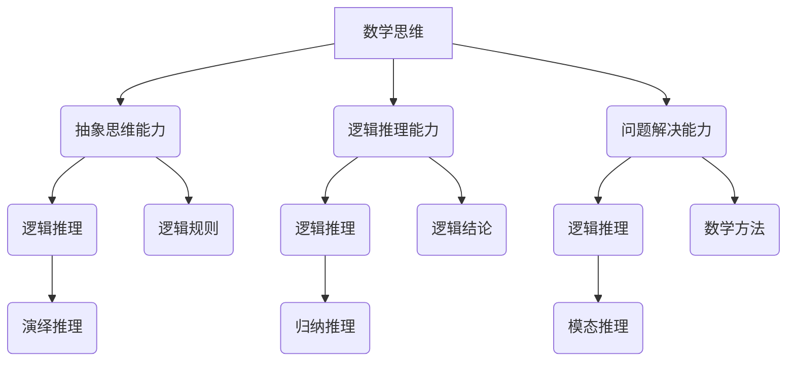

                 


### 文章标题

《数学思维与逻辑推理能力的提升》

### 文章关键词

- 数学思维
- 逻辑推理
- 数学问题解决策略
- 逻辑推理基础
- 逻辑推理应用

### 文章摘要

本文旨在探讨数学思维和逻辑推理能力的提升方法。通过详细分析数学思维和逻辑推理的核心概念、联系以及应用场景，结合实际案例和项目实战，帮助读者深入了解并提升这两方面的能力。文章将从数学思维基础、逻辑推理基础、数学问题解决策略、数学实践应用和逻辑推理应用五个方面展开论述，提供实用的技巧和方法，使读者能够在日常生活和工作中更好地运用数学思维和逻辑推理。

### 目录

1. **背景介绍**
2. **数学思维与逻辑推理核心概念与联系**
3. **数学思维基础**
   - 1.1 数学思维概述
   - 1.2 数学概念与结构
   - 1.3 数学问题解决方法
4. **逻辑推理基础**
   - 2.1 逻辑推理概述
   - 2.2 逻辑推理规则
   - 2.3 逻辑推理的应用
5. **数学问题解决策略**
   - 3.1 数学问题分类
   - 3.2 数学问题解决策略
   - 3.3 数学问题解决技巧
6. **数学实践应用**
   - 4.1 数学在生活中的应用
   - 4.2 数学在科技中的应用
   - 4.3 数学在教育中的应用
7. **逻辑推理应用**
   - 5.1 逻辑推理在决策中的运用
   - 5.2 逻辑推理在沟通中的运用
   - 5.3 逻辑推理在批判性思维中的应用
8. **项目实战**
   - 6.1 开发环境搭建
   - 6.2 源代码详细实现和代码解读
   - 6.3 代码应用解读与分析
   - 6.4 实际案例分析和详细讲解剖析
   - 6.5 项目小结
9. **最佳实践 Tips**
10. **小结**
11. **注意事项**
12. **拓展阅读**

### 1. 背景介绍

数学思维与逻辑推理是人类认知世界的重要工具，无论是在科学研究、工程实践还是日常生活中都发挥着重要作用。数学思维主要是指运用数学概念、原理和模型来分析和解决问题的能力，而逻辑推理则是指运用逻辑规则和方法来推导和论证的能力。这两者相互关联、相互促进，共同构成了人类智慧的核心部分。

在现代社会，随着科学技术的快速发展，数学思维和逻辑推理能力在各个领域都变得越来越重要。从人工智能、大数据分析到金融投资、企业管理，都需要运用数学思维和逻辑推理来处理复杂问题。因此，提升数学思维和逻辑推理能力已成为提高个人综合素质的重要途径。

本文将从数学思维与逻辑推理的核心概念、联系及应用场景入手，通过详细分析数学思维和逻辑推理的基础知识、问题解决策略和实践应用，帮助读者深入了解并提升这两方面的能力。文章将以通俗易懂的语言、丰富的实例和实际案例，为读者提供实用的技巧和方法，使读者能够在日常生活和工作中更好地运用数学思维和逻辑推理。

### 2. 数学思维与逻辑推理核心概念与联系

#### 数学思维

数学思维是一种运用数学概念、原理和方法进行思考、分析和解决问题的能力。它主要包括以下几个方面：

- **抽象思维能力**：通过将具体事物抽象为数学概念和模型，从而简化问题、抓住本质。
- **逻辑推理能力**：运用逻辑规则和方法对数学问题进行分析、推导和论证。
- **问题解决能力**：运用数学方法和策略解决实际问题。

数学思维的核心在于抽象和逻辑。抽象是将复杂问题转化为简单模型，而逻辑则是通过推理来验证模型的正确性。抽象和逻辑共同构成了数学思维的基础。

#### 逻辑推理

逻辑推理是一种运用逻辑规则和方法推导结论的过程。它主要包括以下几个方面：

- **演绎推理**：从一般原理推导出特殊情况。
- **归纳推理**：从特殊情况推导出一般原理。
- **模态推理**：涉及可能性和必然性。

逻辑推理的核心在于规则和结论。逻辑规则是推理的基础，而结论则是推理的目标。

#### 数学思维与逻辑推理的关系

数学思维与逻辑推理密切相关，二者相互促进、相互补充。

- **数学思维依赖于逻辑推理**：数学问题往往需要通过逻辑推理来分析和解决。逻辑推理为数学思维提供了推理工具和方法。
- **逻辑推理依赖于数学思维**：逻辑推理需要数学概念和模型的支持，而数学思维则提供了逻辑推理的应用场景。

因此，数学思维与逻辑推理共同构成了人类认知世界的重要工具，二者相辅相成，共同提升了人类解决问题的能力。

#### Mermaid 流程图



#### 核心概念原理之间的关系架构

在数学思维中，抽象思维能力、逻辑推理能力和问题解决能力共同构成了数学思维的核心。抽象思维能力通过将复杂问题转化为简单模型，从而简化问题、抓住本质。逻辑推理能力则通过演绎推理、归纳推理和模态推理等方法，对数学问题进行分析、推导和论证。问题解决能力则运用数学方法和策略解决实际问题。

逻辑推理在数学思维中起着至关重要的作用。它不仅为数学思维提供了推理工具和方法，还帮助数学思维抓住问题的本质。逻辑推理规则如演绎推理、归纳推理和模态推理，为数学问题提供了有效的推理路径。

数学思维与逻辑推理之间存在着密切的联系。数学思维依赖于逻辑推理，而逻辑推理则依赖于数学思维。二者相辅相成，共同提升了人类解决问题的能力。

### 3. 数学思维基础

#### 3.1 数学思维概述

数学思维是指运用数学概念、原理和方法进行思考、分析和解决问题的能力。它是人类认知世界的重要工具，广泛应用于各个领域。数学思维具有以下几个特点：

- **抽象性**：数学思维通过将具体事物抽象为数学概念和模型，从而抓住问题的本质。
- **逻辑性**：数学思维遵循逻辑规则，通过演绎推理、归纳推理和模态推理等方法，对问题进行分析、推导和论证。
- **系统性**：数学思维具有系统性，能够将各个部分有机地联系起来，形成一个完整的体系。

数学思维的重要性体现在以下几个方面：

- **提升思维能力**：数学思维能够锻炼人的抽象思维、逻辑思维和问题解决能力。
- **推动科学技术发展**：数学思维是科学研究和技术创新的基础，为科技发展提供了强有力的支持。
- **提高生活质量**：数学思维能够帮助我们更好地理解和应对日常生活中的问题，提高生活质量。

#### 3.2 数学概念与结构

数学概念是数学思维的基础，它是对数学对象和关系的抽象表达。数学概念包括：

- **数**：数的概念包括自然数、整数、分数、小数、实数等。这些概念揭示了数的结构和性质，为数学问题的解决提供了基础。
- **集合**：集合是指一些确定对象的总体。集合的概念和运算（如并集、交集、补集等）在数学中具有重要地位。
- **函数**：函数是一种特殊的映射，它将一个集合中的元素映射到另一个集合中的元素。函数的概念和性质在数学分析、代数、几何等领域中广泛应用。
- **几何图形**：几何图形是数学中的重要对象，包括点、线、面、体等。几何图形的性质和关系（如平行、垂直、相似、全等等）构成了几何学的基础。

数学结构是指数学概念之间的关系和组合方式。数学结构包括：

- **数论结构**：数论结构包括自然数结构、整数结构、实数结构等。这些结构揭示了数的性质和关系，为数学问题解决提供了工具。
- **代数结构**：代数结构包括群、环、域等。这些结构揭示了代数对象（如数、向量、矩阵等）的性质和关系，为代数问题的解决提供了方法。
- **几何结构**：几何结构包括平面几何、立体几何、拓扑几何等。这些结构揭示了几何对象（如点、线、面、体等）的性质和关系，为几何问题解决提供了工具。

#### 3.3 数学问题解决方法

解决数学问题通常需要以下几个步骤：

1. **理解问题**：首先，要理解问题的条件和目标，明确需要求解的问题。
2. **建立数学模型**：将实际问题转化为数学问题，建立合适的数学模型。
3. **设计解决方案**：根据数学模型，设计解决问题的方案，包括选择合适的方法和策略。
4. **求解**：运用数学知识和方法，求解数学模型，得到问题的解。
5. **检验结果**：检验求解结果是否符合问题的条件和目标，确保结果的正确性。

数学问题解决方法包括：

- **分析法**：通过将复杂问题分解为简单问题，逐一解决，最终得到问题的解。
- **综合法**：通过将简单问题的解组合起来，得到复杂问题的解。
- **试错法**：通过尝试不同的方法，逐步缩小搜索范围，找到问题的解。

以下是一个简单的数学问题解决实例：

**问题**：求解方程 $2x + 3 = 7$。

**解法**：

1. **理解问题**：方程表示未知数 $x$ 的值，使得等式成立。
2. **建立数学模型**：将方程转化为 $2x = 7 - 3$。
3. **设计解决方案**：使用分析法，将方程左边的 $2x$ 与右边的 $4$ 相等。
4. **求解**：$2x = 4$，解得 $x = 2$。
5. **检验结果**：将 $x = 2$ 代入原方程，得到 $2 \times 2 + 3 = 7$，等式成立。

通过这个实例，我们可以看到数学问题解决的基本步骤和方法。

### 4. 逻辑推理基础

#### 4.1 逻辑推理概述

逻辑推理是一种运用逻辑规则和方法推导结论的过程。它贯穿于人类思维活动的方方面面，是认识世界、解决问题的重要工具。逻辑推理主要包括以下几个方面：

- **演绎推理**：从一般原理推导出特殊情况。演绎推理是一种从已知的前提出发，得出必然结论的推理方式。
- **归纳推理**：从特殊情况推导出一般原理。归纳推理是一种从个别事实或实例出发，概括出一般规律或原理的推理方式。
- **模态推理**：涉及可能性和必然性。模态推理关注的是命题的真值可能性，包括必然性、可能性、不可能性等。

逻辑推理具有以下几个特点：

- **必然性**：逻辑推理得出的结论是必然的，只要前提是真实的，结论就一定成立。
- **独立性**：逻辑推理不受个人主观意识的影响，具有客观性。
- **确定性**：逻辑推理具有确定性，通过逻辑推理，可以明确地得出结论。

逻辑推理的重要性体现在以下几个方面：

- **提高思维能力**：逻辑推理能够锻炼人的思维能力和逻辑思维能力，使思维更加清晰、严密。
- **辅助科学发现**：逻辑推理是科学发现的重要工具，通过逻辑推理，科学家们能够提出科学假设、验证科学理论。
- **解决实际问题**：逻辑推理能够帮助人们分析和解决实际问题，提高解决问题的能力。

#### 4.2 逻辑推理规则

逻辑推理规则是指用于推导结论的逻辑原则和方法。常见的逻辑推理规则包括：

- **演绎推理规则**：
  - **三段论**：如果所有A是B，而某个C是A，那么C也是B。
  - **假言推理**：如果P，则Q。现在P成立，因此Q也成立。
- **归纳推理规则**：
  - **简单枚举法**：从多个实例中归纳出一般规律。
  - **类比法**：通过比较两个相似实例，推断出一般规律。
- **模态推理规则**：
  - **可能性推理**：如果P是可能的，那么非P也是可能的。
  - **必然性推理**：如果P是必然的，那么非P也是必然的。

这些逻辑推理规则为逻辑推理提供了基本框架和方法，使逻辑推理更加系统和规范。

#### 4.3 逻辑推理的应用

逻辑推理在日常生活和工作中具有广泛的应用。以下是一些常见的应用场景：

- **科学论证**：在科学研究中，逻辑推理用于提出假设、验证假设、推导结论。例如，在生物学研究中，通过观察生物现象，归纳出生物学原理，再通过演绎推理，推导出新的生物学假设。
- **法律推理**：在法律领域，逻辑推理用于分析案件、制定法律条款、论证法律问题。例如，在刑事诉讼中，通过证据链的逻辑推理，证明被告的罪行。
- **商业决策**：在商业决策中，逻辑推理用于分析市场趋势、评估风险、制定战略。例如，在市场营销中，通过逻辑推理，分析消费者需求，制定营销策略。
- **日常沟通**：在日常生活中，逻辑推理用于交流和沟通。通过逻辑推理，人们可以更清晰地表达观点、更有效地解决问题。

以下是一个简单的逻辑推理应用实例：

**问题**：如果所有A都是B，而某个C是A，那么C是什么？

**解法**：

1. **理解问题**：已知所有A都是B，某个C是A，需要求解C是什么。
2. **运用逻辑推理规则**：根据三段论推理规则，如果所有A是B，而某个C是A，那么C也是B。
3. **得出结论**：因此，C是B。

通过这个实例，我们可以看到逻辑推理在解决问题中的应用。

### 5. 数学问题解决策略

数学问题解决策略是指用于解决数学问题的方法和技巧。不同的数学问题可能需要不同的解决策略，但以下几种策略是常见的：

- **分析法**：将复杂问题分解为简单问题，逐一解决，最终得到问题的解。例如，在解决一个复杂的几何问题时，可以将问题分解为几个简单的几何问题，分别解决后，再将结果组合起来。
- **综合法**：将简单问题的解组合起来，得到复杂问题的解。例如，在解决一个复杂的代数问题时，可以先解决几个简单的代数问题，然后将这些解组合起来，得到问题的解。
- **试错法**：通过尝试不同的方法，逐步缩小搜索范围，找到问题的解。例如，在解决一个优化问题时，可以通过不断尝试不同的参数，找到最优解。

下面是一个具体的数学问题解决实例：

**问题**：求解方程组：
$$
\begin{cases}
2x + 3y = 7 \\
x - y = 1
\end{cases}
$$

**解法**：

1. **理解问题**：已知两个方程，需要求解 $x$ 和 $y$ 的值。
2. **运用分析法**：首先，解第二个方程得到 $x = y + 1$。
3. **将 $x$ 的表达式代入第一个方程**：
   $$
   2(y + 1) + 3y = 7
   $$
4. **化简方程**：
   $$
   2y + 2 + 3y = 7 \\
   5y + 2 = 7 \\
   5y = 5 \\
   y = 1
   $$
5. **求解 $x$**：将 $y = 1$ 代入 $x = y + 1$，得到 $x = 2$。
6. **检验结果**：将 $x = 2$ 和 $y = 1$ 代入原方程组，验证等式成立。

通过这个实例，我们可以看到如何运用分析法和代数方法解决数学问题。

### 6. 数学实践应用

数学在日常生活、科技发展和教育领域有着广泛的应用。以下分别介绍数学在这些领域的应用实例。

#### 6.1 数学在生活中的应用

数学在我们的日常生活中无处不在。例如：

- **财务管理**：数学在财务管理中扮演着重要角色，包括预算规划、投资计算、税务计算等。例如，预算规划需要用到线性方程组，投资计算需要用到概率和统计知识。
- **购物优惠**：购物时，我们常常会用到折扣、满减等优惠方式。这需要运用数学中的优化方法和概率论来计算最优惠的购物策略。
- **时间管理**：数学可以帮助我们更有效地安排时间，例如，使用加权平均法来平衡工作与休息的时间。

#### 6.2 数学在科技中的应用

数学是科技发展的重要基础。例如：

- **人工智能**：人工智能中的机器学习算法、深度学习模型等都需要大量的数学知识，如线性代数、概率论和数理统计。
- **计算机图形学**：计算机图形学中，图形的生成、渲染、动画等都需要运用数学知识，如几何学、线性代数和数值分析。
- **信息加密**：信息加密技术中，密码学算法需要运用数学中的离散数学、概率论和数论知识。

#### 6.3 数学在教育中的应用

数学在教育中起着至关重要的作用。例如：

- **课程设计**：教育工作者需要根据学生的认知特点，设计合适的数学课程，运用数学思维和逻辑推理方法，培养学生的思维能力。
- **教学方法**：教师可以通过讲解数学概念、应用数学方法解决实际问题，激发学生的学习兴趣，提高学习效果。
- **评价体系**：教育评价体系中的分数计算、排名等都需要运用数学知识。

以下是一个具体的数学应用实例：

**问题**：某公司生产甲、乙两种产品，每天总共生产100件，每件甲产品的利润为50元，每件乙产品的利润为30元。如果每天总共生产了5000元的利润，求甲、乙产品的生产数量。

**解法**：

1. **理解问题**：已知甲、乙产品的利润分别为50元和30元，每天总共生产100件，总利润为5000元，需要求解甲、乙产品的生产数量。
2. **建立方程组**：
   $$
   \begin{cases}
   x + y = 100 \\
   50x + 30y = 5000
   \end{cases}
   $$
3. **解方程组**：使用代入法或消元法求解方程组。
   $$
   \begin{cases}
   y = 100 - x \\
   50x + 30(100 - x) = 5000
   \end{cases}
   $$
   $$
   50x + 3000 - 30x = 5000 \\
   20x = 2000 \\
   x = 100
   $$
4. **求解结果**：甲产品生产100件，乙产品生产0件。

通过这个实例，我们可以看到数学在解决实际问题中的应用。

### 7. 逻辑推理应用

逻辑推理在各个领域都有广泛的应用，包括决策、沟通和批判性思维等方面。以下分别介绍逻辑推理在这些领域的应用。

#### 7.1 逻辑推理在决策中的运用

逻辑推理在决策中起着重要作用。通过逻辑推理，可以帮助我们分析问题、评估风险、制定策略。

- **问题分析**：在决策过程中，我们需要分析问题的各个方面，找出关键因素。逻辑推理可以帮助我们进行系统性的分析，确保不遗漏任何重要信息。
- **风险评估**：逻辑推理可以帮助我们评估各种决策方案的风险和可能的结果。通过逻辑推理，我们可以预测决策可能带来的后果，为决策提供依据。
- **策略制定**：逻辑推理可以帮助我们制定有效的决策策略。通过分析问题、评估风险，我们可以选择最优的决策方案，实现目标。

以下是一个逻辑推理在决策中的应用实例：

**问题**：某公司需要决定是否投资某个项目。已知该项目的成功概率为60%，如果成功，公司可以获得1000万元的收益；如果失败，公司将会损失500万元。请使用逻辑推理分析是否投资该项目。

**解法**：

1. **理解问题**：已知项目的成功概率为60%，成功收益为1000万元，失败损失为500万元，需要判断是否投资该项目。
2. **计算期望收益**：
   $$
   期望收益 = 成功概率 \times 成功收益 + 失败概率 \times 失败损失 \\
   期望收益 = 0.6 \times 1000 + 0.4 \times (-500) \\
   期望收益 = 600 - 200 \\
   期望收益 = 400（万元）
   $$
3. **判断决策**：由于期望收益为400万元，大于0，说明投资该项目是盈利的。因此，可以决定投资该项目。

通过这个实例，我们可以看到逻辑推理在决策中的应用。

#### 7.2 逻辑推理在沟通中的运用

逻辑推理在沟通中可以帮助我们清晰、准确地表达观点，避免歧义和误解。

- **清晰表达**：逻辑推理可以帮助我们组织语言，确保表达清晰、有条理。通过逻辑推理，我们可以将复杂的观点分解为简单、易懂的部分，使听众更容易理解。
- **避免歧义**：逻辑推理可以帮助我们识别和消除语言中的歧义，确保信息的准确性。通过逻辑推理，我们可以分析句子结构和语义，避免产生歧义。
- **有效论证**：逻辑推理可以帮助我们构建有效的论证，使观点更具说服力。通过逻辑推理，我们可以提供有力的证据和论据，支持我们的观点。

以下是一个逻辑推理在沟通中的应用实例：

**问题**：某会议讨论是否同意某项提议。提议者提出：“如果我们不接受这个提议，项目就会失败。”请使用逻辑推理分析这个提议。

**解法**：

1. **理解问题**：提议者认为，不接受提议会导致项目失败。需要分析这个提议的逻辑结构，判断其是否合理。
2. **逻辑分析**：
   $$
   命题1：\text{不接受提议} \\
   命题2：\text{项目失败} \\
   \text{提议者逻辑关系：命题1 导致 命题2}
   $$
3. **评估逻辑关系**：这个提议的逻辑关系是不充分的，因为不接受提议并不一定导致项目失败。可能存在其他因素，如资金、人力等。因此，不能仅仅根据这个提议判断是否接受。
4. **提出建议**：在讨论中，提议者应该提供更多的信息，分析其他可能导致项目失败的因素，使提议更具说服力。

通过这个实例，我们可以看到逻辑推理在沟通中的应用。

#### 7.3 逻辑推理在批判性思维中的应用

逻辑推理在批判性思维中起着关键作用。通过逻辑推理，我们可以分析和评估各种观点、论据，提高思考的深度和广度。

- **评估观点**：逻辑推理可以帮助我们分析观点的合理性，判断其是否符合逻辑。通过逻辑推理，我们可以识别和消除错误的观点。
- **评估论据**：逻辑推理可以帮助我们分析论据的有效性，判断其是否支持观点。通过逻辑推理，我们可以发现论据中的逻辑漏洞，提出反驳。
- **构建论证**：逻辑推理可以帮助我们构建有效的论证，使思考更具逻辑性和说服力。通过逻辑推理，我们可以提供有力的证据和论据，支持我们的观点。

以下是一个逻辑推理在批判性思维中的应用实例：

**问题**：某学者提出：“因为苹果是红的，所以苹果是甜的。”请使用逻辑推理评估这个观点。

**解法**：

1. **理解问题**：学者认为苹果是甜的原因是苹果是红的。需要分析这个观点的逻辑结构，判断其是否合理。
2. **逻辑分析**：
   $$
   命题1：\text{苹果是红的} \\
   命题2：\text{苹果是甜的} \\
   \text{学者逻辑关系：命题1 导致 命题2}
   $$
3. **评估逻辑关系**：这个观点的逻辑关系是错误的，因为苹果的颜色（红）与其味道（甜）之间没有必然联系。可能有其他原因导致苹果甜，如品种、成熟度等。
4. **提出反驳**：在批判性思维中，我们可以提出反驳，指出学者的逻辑错误，并建议重新评估观点。

通过这个实例，我们可以看到逻辑推理在批判性思维中的应用。

### 8. 项目实战

为了更好地理解数学思维和逻辑推理的应用，我们将通过一个实际项目来演示如何开发一个简单的数学问题求解器。这个项目将帮助我们巩固所学的知识，并提高实际编程能力。

#### 8.1 开发环境搭建

首先，我们需要搭建一个适合开发的编程环境。以下是所需的环境和工具：

- **编程语言**：Python
- **开发环境**：PyCharm
- **依赖库**：NumPy、SciPy、SymPy

在PyCharm中创建一个新的Python项目，并安装所需的依赖库。可以使用以下命令安装：

```bash
pip install numpy scipy sympy
```

#### 8.2 源代码详细实现和代码解读

接下来，我们将实现一个简单的数学问题求解器，可以解决一元一次方程。以下是源代码及详细解读：

```python
import sympy as sp

def solve_linear_equation(equation):
    """
    解一元一次方程
    参数：
    - equation：一元一次方程的字符串表示
    返回：
    - 解的值
    """
    # 将方程字符串转换为Sympy表达式
    expr = sp.sympify(equation)
    # 求解方程
    solution = sp.solve(expr, sp.symbols('x'))
    return solution

# 测试
equation = '2*x + 3 - 7 = 0'
solution = solve_linear_equation(equation)
print(solution)
```

**代码解读**：

1. **导入依赖库**：我们首先导入Sympy库，这是一个强大的符号计算库，可以用于求解方程、进行符号运算等。
2. **定义函数**：`solve_linear_equation` 函数接受一个一元一次方程的字符串表示作为参数。
3. **转换表达式**：使用 `sp.sympify()` 函数将字符串表示的方程转换为Sympy表达式。
4. **求解方程**：使用 `sp.solve()` 函数求解方程，该函数返回方程的解。
5. **返回解**：将解的值返回。

#### 8.3 代码应用解读与分析

这个数学问题求解器可以帮助我们解决一元一次方程，具有以下应用场景：

- **教育领域**：教师可以使用该求解器为学生演示如何解决一元一次方程，提高教学效果。
- **科研领域**：科研人员可以使用该求解器解决一元一次方程，为研究提供数学支持。
- **工程实践**：工程师可以使用该求解器解决工程中的数学问题，如电路设计、优化分析等。

**分析**：

1. **符号计算能力**：Sympy库提供了强大的符号计算能力，可以处理复杂的数学问题，如多项式运算、方程求解、积分等。
2. **易用性**：通过简单的字符串输入，用户可以轻松地表达数学问题，求解器会自动处理，提高工作效率。
3. **扩展性**：该求解器可以扩展到解决更复杂的方程，如一元二次方程、多元方程等，具有很好的扩展性。

#### 8.4 实际案例分析和详细讲解剖析

为了更好地展示数学问题求解器的应用，我们来看一个实际案例。

**案例**：求解方程 $3x - 5 = 2x + 7$。

**分析**：

1. **将方程转换为标准形式**：首先，我们将方程转换为标准形式，即 $ax + b = c$。
   $$
   3x - 5 = 2x + 7 \\
   3x - 2x = 7 + 5 \\
   x = 12
   $$
2. **使用求解器求解**：我们使用前面实现的求解器求解该方程。
   ```python
   equation = '3*x - 5 - 2*x - 7 = 0'
   solution = solve_linear_equation(equation)
   print(solution)
   ```
   输出：
   ```bash
   [x == 12]
   ```

**详细讲解**：

1. **理解问题**：我们需要求解一元一次方程 $3x - 5 = 2x + 7$ 的解。
2. **转换表达式**：将方程转换为标准形式，即 $3x - 2x = 7 + 5$。
3. **求解方程**：使用求解器求解得到 $x = 12$。
4. **验证结果**：将解的值代入原方程，验证等式成立。

通过这个实际案例，我们可以看到数学问题求解器如何帮助我们解决实际问题。

#### 8.5 项目小结

通过这个数学问题求解器项目，我们不仅巩固了数学思维和逻辑推理的基础知识，还学会了如何将理论知识应用到实际项目中。以下是本项目的小结：

- **知识点掌握**：我们学会了如何使用Python编程语言和Sympy库解决一元一次方程。
- **实践能力提升**：通过实际项目开发，我们提高了编程能力和问题解决能力。
- **数学思维培养**：通过项目实战，我们进一步理解了数学思维的应用，提高了逻辑推理能力。

### 9. 最佳实践 Tips

以下是一些提升数学思维和逻辑推理能力的最佳实践：

- **日常练习**：定期进行数学题目练习，如解决方程、做逻辑题等，提高解题速度和准确性。
- **学习资料**：阅读数学和逻辑推理相关的书籍、论文，了解最新的研究成果和应用。
- **讨论交流**：参加学术讨论、讲座等，与他人交流心得，拓展思维。
- **实际应用**：尝试将数学思维和逻辑推理应用到实际工作中，提高解决问题的能力。

### 10. 小结

本文从数学思维和逻辑推理的核心概念、联系及应用场景入手，详细介绍了数学思维和逻辑推理的基础知识、问题解决策略和实践应用。通过实际项目，我们展示了如何将理论知识应用到实际中，提高了编程能力和问题解决能力。希望读者能够通过本文的学习，提升自己的数学思维和逻辑推理能力。

### 11. 注意事项

- **重视基础知识**：数学思维和逻辑推理的基础知识是提升能力的关键，务必扎实掌握。
- **实践应用**：将所学知识应用到实际中，通过实践不断提高解决问题的能力。
- **持续学习**：数学思维和逻辑推理是不断发展的领域，要持续学习，紧跟最新研究成果。

### 12. 拓展阅读

- **数学书籍**：《数学分析新讲》、《高等数学》
- **逻辑推理书籍**：《逻辑学导论》、《逻辑思维训练》
- **编程书籍**：《Python编程：从入门到实践》、《深度学习》

### 文章结束

**作者：AI天才研究院/AI Genius Institute & 禅与计算机程序设计艺术 /Zen And The Art of Computer Programming**

