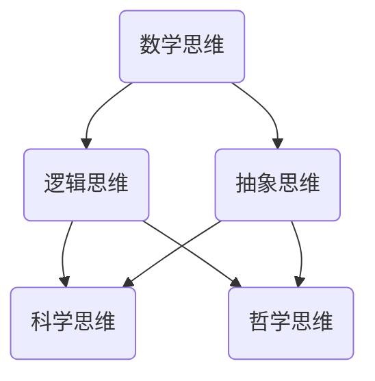
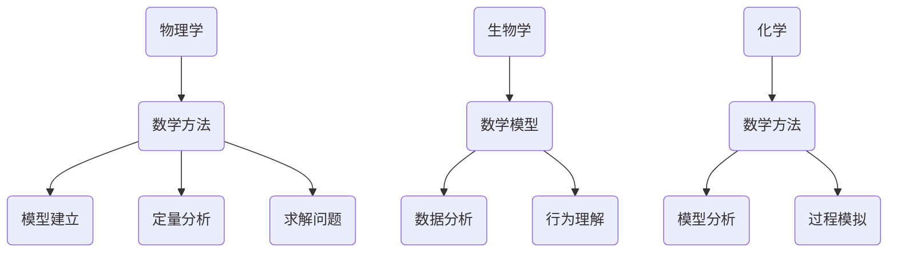
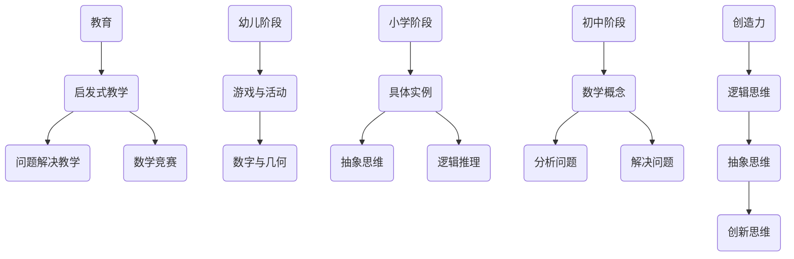
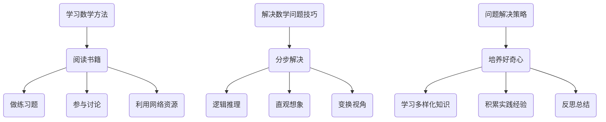
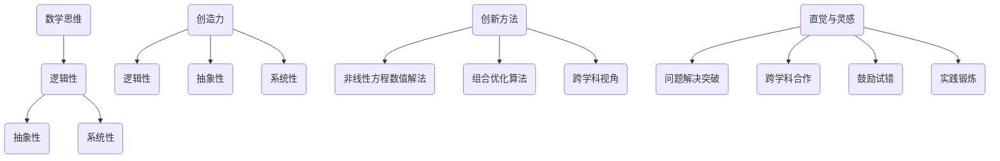

                 

### 文章标题

《数学思维与问题解决能力的关系》

### 文章关键词

- 数学思维
- 问题解决能力
- 教育培养
- 应用领域
- 创造力

### 文章摘要

本文旨在探讨数学思维与问题解决能力之间的关系，通过深入分析数学思维的核心概念及其在各个领域的应用，揭示数学思维对提高问题解决能力的积极作用。文章首先介绍了数学思维的定义与特征，接着阐述了数学思维的发展历程及其与其他思维形式的关系。随后，本文详细讨论了数学思维在科学领域、教育领域以及日常生活中的应用。最后，文章提出了提高数学思维与问题解决能力的方法和策略，以期为读者提供有益的参考和启示。

---

### 第一部分：数学思维概述

#### 第1章：数学思维的核心概念

##### 1.1 数学思维的定义与特征

数学思维是指运用数学概念、原理、方法和工具进行逻辑推理、抽象思维和问题解决的一种思维方式。其核心特征包括逻辑性、抽象性、严谨性和系统性。

- **逻辑性**：数学思维强调推理的严谨性和证明的有效性。
- **抽象性**：数学思维能够将具体问题抽象为数学模型，简化复杂问题。
- **严谨性**：数学思维要求对概念、公式和结论进行严格证明。
- **系统性**：数学思维注重概念和方法的系统性和连贯性。

##### 1.2 数学思维的发展历程

数学思维的发展历程可以追溯到古代。在古代，数学思维主要表现为对自然现象的观察和总结，如埃及和巴比伦的数学成就。随着数学工具和方法的发展，数学思维逐渐走向严谨和抽象，经历了从直观几何到代数、微积分的发展。

- **古代数学思维**：以直观几何和算术为主，注重实践应用。
- **近代数学思维**：以笛卡尔、牛顿和莱布尼茨为代表的解析几何和微积分，标志着数学思维进入一个新的阶段。
- **现代数学思维**：以抽象代数、拓扑学和集合论为代表，数学思维更加抽象和严谨。

##### 1.3 数学思维与逻辑思维、抽象思维的关系

数学思维与逻辑思维、抽象思维密切相关，它们共同构成了人类解决问题的基本思维方式。

- **逻辑思维**：是数学思维的基础，强调推理的严谨性。
- **抽象思维**：是数学思维的核心，强调从具体到抽象的转化。

数学思维不仅影响了其他学科的发展，也对逻辑思维和抽象思维产生了深远的影响。

---

为了更好地理解数学思维与其他思维形式的关系，我们可以使用Mermaid流程图来展示数学思维的发展历程及其与其他思维形式的互动。

在上面的流程图中，数学思维与逻辑思维、抽象思维紧密相连，共同构成科学思维和哲学思维的基础。通过这样的图示，我们可以更直观地理解数学思维在人类思维体系中的重要地位。

接下来，我们将进一步探讨数学思维在各个领域中的应用，以展示其在实际问题解决中的作用。

---

### 第二部分：数学思维的应用领域

#### 第2章：数学思维在科学领域中的应用

##### 2.1 数学思维在物理学中的应用

物理学是一门研究自然界基本规律的学科，数学思维在其中起着至关重要的作用。数学方法在物理学研究中被广泛应用于建立物理模型、进行定量分析和求解物理问题。

- **物理模型建立**：通过数学方法将物理现象抽象为数学模型，如麦克斯韦方程组、薛定谔方程等，这些模型为深入理解物理现象提供了理论基础。
- **定量分析**：数学思维在物理学的定量分析中具有重要意义，如牛顿运动定律、万有引力定律等，这些定律的建立和验证都依赖于数学分析的方法。
- **求解物理问题**：数学思维在求解物理问题时提供了有效的工具，如微分方程、积分方程等，这些方程的求解方法为解决复杂的物理问题提供了可能。

##### 2.2 数学思维在生物学中的应用

生物学是一门研究生命现象和生物体结构的科学，数学思维在生物学的研究中也发挥了重要作用。

- **数学模型在生物学中的应用**：生物学中的许多现象可以通过数学模型来描述，如种群动力学模型、神经网络模型等，这些模型帮助科学家更好地理解生物体的行为和功能。
- **数学方法在生物学数据分析中的应用**：生物学数据通常具有复杂性和多样性，数学方法如统计分析和数据挖掘在处理这些数据时提供了有效的手段。

##### 2.3 数学思维在化学中的应用

化学是一门研究物质的组成、性质、变化及其应用的科学，数学思维在化学研究中同样不可或缺。

- **数学方法在化学研究中的应用**：化学中的许多现象可以通过数学方法进行分析和解释，如量子化学中的数学模型、化学反应动力学中的数学方程等。
- **数学模型在化学过程模拟中的应用**：数学模型在化学过程模拟中具有重要意义，如化学反应器模拟、材料制备过程模拟等，这些模型有助于优化化学工艺和提升产品质量。

---

为了更好地理解数学思维在各个科学领域中的应用，我们可以通过以下Mermaid流程图展示数学方法在这些领域中的核心作用。

通过这样的图示，我们可以看到数学思维在物理学、生物学和化学等科学领域中的应用是广泛且深入的，它们共同推动了这些学科的发展。

接下来，我们将探讨数学思维在教育和日常生活中的应用，以展示其在各个方面的实际影响。

---

### 第三部分：数学思维在教育中的培养

#### 第3章：数学思维在教学过程中的培养

##### 3.1 数学思维培养的策略

为了培养数学思维，教育者可以采取以下策略：

- **启发式教学**：鼓励学生主动思考，引导学生从具体实例中提炼出数学概念和方法。
- **问题解决教学**：通过解决实际问题，培养学生的逻辑推理和抽象思维能力。
- **数学竞赛**：组织数学竞赛，激发学生的学习兴趣和竞争意识，提升他们的数学思维水平。

##### 3.2 不同年龄段学生数学思维培养的方法

不同年龄段的学生在数学思维的培养上需要采取不同的方法：

- **幼儿阶段的数学思维培养**：通过游戏和日常活动，培养幼儿对数字和几何形状的认识，激发他们的兴趣。
- **小学阶段的数学思维培养**：通过具体实例和实践活动，培养学生的抽象思维和逻辑推理能力。
- **初中阶段的数学思维培养**：加强数学概念的理解和运用，培养学生的分析问题和解决问题的能力。

##### 3.3 数学思维与创造力

数学思维与创造力密切相关，良好的数学思维能够促进创造力的发挥。

- **数学思维与创造力关系**：数学思维培养逻辑性和抽象思维能力，有助于创新思维的发展。
- **创造力在数学问题解决中的应用**：在解决数学问题时，创造力的发挥能够提供新的思路和方法，提高解决问题的效率。

---

为了更好地理解数学思维在教学和创造力培养中的作用，我们可以通过以下Mermaid流程图展示数学思维的发展与应用。

通过这样的图示，我们可以看到数学思维在教学和创造力培养中的关键作用，它们共同促进了学生全面素质的提升。

接下来，我们将讨论如何提高数学思维与问题解决能力，为读者提供实用的方法和技巧。

---

### 第四部分：提高数学思维与问题解决能力

#### 第4章：提高数学思维与问题解决能力的方法和技巧

##### 4.1 学习数学的方法

有效的数学学习方法对于提高数学思维至关重要。以下是一些实用的学习数学的方法：

- **阅读数学书籍和教材**：选择合适的数学书籍和教材，系统地学习数学知识。
- **做数学练习题**：通过大量练习，巩固数学概念和技巧，提高解题能力。
- **参与数学讨论和讨论组**：与他人交流数学问题，分享解题思路，拓宽思路。
- **利用网络资源**：利用在线课程、教学视频和数学论坛等网络资源，拓展数学知识。

##### 4.2 解决数学问题的技巧

解决数学问题需要一定的技巧和方法，以下是一些常用的技巧：

- **分步解决**：将复杂问题分解为简单步骤，逐步解决。
- **逻辑推理**：运用逻辑推理，逐步推导出问题的解法。
- **直观想象**：通过图形和图像，直观地理解问题，寻找解题思路。
- **变换视角**：从不同角度和视角看待问题，寻找新的解决方法。

##### 4.3 提高问题解决能力的策略

以下是一些提高问题解决能力的策略：

- **培养好奇心**：保持对未知事物的探索欲望，激发解决问题的动力。
- **学习多样化的知识**：掌握跨学科的知识，提高解决问题的广度和深度。
- **积累实践经验**：通过实际操作和实验，积累解决问题的实践经验。
- **反思和总结**：在解决问题后，反思解题过程，总结经验教训，不断提高。

---

为了更好地展示如何提高数学思维与问题解决能力，我们可以使用以下Mermaid流程图，直观地呈现学习数学和解决数学问题的方法。

通过这样的图示，我们可以清晰地看到提高数学思维与问题解决能力的方法和策略，有助于读者在实际应用中更好地运用这些技巧。

接下来，我们将探讨数学思维与创造力之间的关系，以及如何在数学问题解决中发挥创造力。

---

### 第五部分：数学思维与创造力

#### 第5章：数学思维与创造力的关系及实践

##### 5.1 数学思维与创造力关系

数学思维与创造力之间存在着紧密的联系。数学思维培养了逻辑性、抽象性和系统性，这些特质是创造力的重要基础。

- **逻辑性**：数学思维的逻辑性有助于发现问题的规律和本质，为创造力提供了思考的框架。
- **抽象性**：数学思维的抽象性能够将具体问题转化为抽象模型，为创造力提供了广阔的空间。
- **系统性**：数学思维的系统性有助于整合多种思维方式和知识，促进创造力的发挥。

##### 5.2 创造力在数学问题解决中的应用

在解决数学问题时，创造力的发挥可以提供新的思路和方法，提高问题解决的效率和质量。以下是一些实际应用的例子：

- **创新的数学方法**：在解决复杂问题时，可以尝试运用创新的数学方法，如非线性方程的数值解法、组合优化算法等。
- **跨学科的视角**：将其他学科的知识和工具引入数学问题解决中，如物理学中的模拟方法、计算机科学中的算法设计等。
- **直觉和灵感**：在解决问题的过程中，直觉和灵感有时可以提供关键的突破，这些是创造力的重要体现。

##### 5.3 提高创造力的策略

以下是一些提高创造力的策略：

- **多样化的学习**：通过学习不同领域的知识，拓宽思维视野，激发创造力。
- **跨学科合作**：与他人合作，尤其是在不同学科之间的合作，可以促进新思路的产生。
- **鼓励试错**：在尝试解决问题的过程中，允许失败和错误，从失败中学习和成长。
- **实践和锻炼**：通过实际问题和项目，锻炼解决问题的能力和创造力。

---

为了更好地理解数学思维与创造力之间的关系及其应用，我们可以使用以下Mermaid流程图展示。

通过这样的图示，我们可以清晰地看到数学思维与创造力之间的互动关系，以及如何在数学问题解决中发挥创造力。

接下来，我们将总结文章内容，并提供一些最佳实践、注意事项和拓展阅读建议，以帮助读者进一步深入理解数学思维与问题解决能力的关系。

---

### 总结

本文从多个角度探讨了数学思维与问题解决能力的关系。我们首先介绍了数学思维的定义和特征，以及其发展历程与其他思维形式的关系。接着，我们详细阐述了数学思维在科学领域、教育领域以及日常生活中的应用。随后，我们提出了提高数学思维与问题解决能力的方法和技巧，并探讨了数学思维与创造力之间的互动关系。

通过本文，我们可以看到数学思维在提高问题解决能力中的关键作用。它不仅能够帮助我们更高效地分析和解决问题，还能激发创造力和创新思维。为了进一步提升数学思维，我们建议读者：

- **持续学习**：通过阅读数学书籍、参加在线课程和参加数学竞赛，不断扩展数学知识。
- **实践应用**：将数学思维应用到实际问题中，通过解决实际问题来提高思维能力。
- **跨学科学习**：结合其他学科的知识，拓宽思维视野，促进创造力的发挥。

注意事项：

- **基础的重要性**：数学思维的基础是数学知识，因此掌握扎实的数学基础是关键。
- **积极思考**：在学习过程中，要积极思考，勇于提问，培养批判性思维。
- **持续练习**：数学思维的提升需要大量的练习，通过不断练习来巩固和提高。

拓展阅读：

- 《数学思维训练：提高逻辑推理能力的实战策略》
- 《数学哲学导论：数学思维与哲学思考》
- 《数学之美：发现隐藏在数学背后的美丽》
- 《数学思维在科技创新中的应用》

通过本文的探讨，我们希望读者能够更好地理解数学思维与问题解决能力的关系，并在实践中不断提高自己的数学思维水平，从而在生活和工作中取得更大的成就。

---

### 文章作者

**作者：AI天才研究院/AI Genius Institute & 禅与计算机程序设计艺术 /Zen And The Art of Computer Programming**

AI天才研究院致力于探索人工智能领域的最新技术和发展趋势，以推动人工智能技术的创新和进步。研究院拥有一支由世界顶级人工智能专家、程序员和软件架构师组成的核心团队，他们在计算机编程、人工智能算法设计和系统集成等方面有着丰富的经验。

禅与计算机程序设计艺术是一本经典的技术畅销书，它结合了禅宗哲学与计算机编程艺术，深入探讨了程序员如何在编程过程中培养专注力和创造力。作者通过大量的实践案例和经验总结，为程序员提供了一套系统的编程思维训练方法，帮助他们在编程实践中实现更高水平的自我提升。

通过本文，我们希望能够帮助读者更好地理解数学思维与问题解决能力之间的关系，并在实际应用中不断提升自己的数学思维水平，为未来的学习和工作打下坚实的基础。让我们共同努力，将数学思维应用于实际问题的解决，创造更美好的未来。

